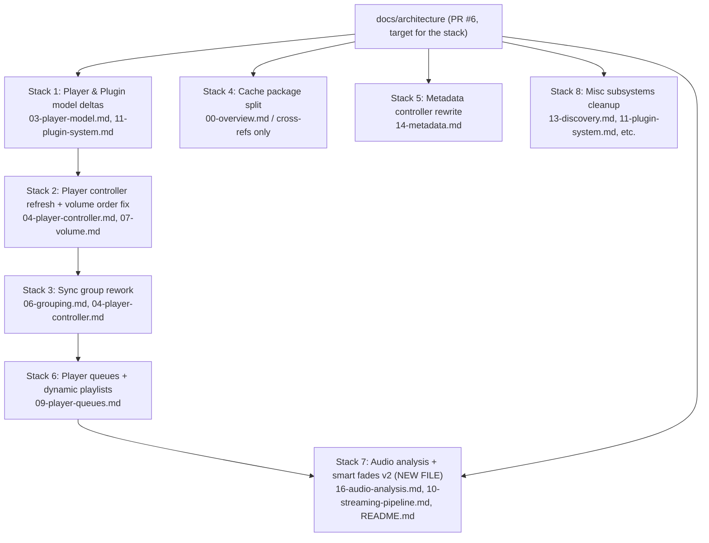

# Architecture Docs Upstream-Drift Stack — Index

## Goal

Update the docs in [docs/architecture/](docs/architecture/) to reflect the current state of `upstream/dev` so the eventual upstream PR represents accurate documentation across the entire codebase, not just the volume subsystem we already covered.

## Strategy

Stacked PRs cut from each other in dependency order, all eventually merging into `docs/architecture`. Each PR is intentionally small and focused. New subsystems large enough for their own file get one (audio analysis); smaller deltas fold into existing docs.

Each stack level has its own sub-plan in `.cursor/plans/`. Build them one at a time. This file is a pure index — no Build button.

## Stack overview

Stacks 1, 2, 3, 6 form a **dependency chain** (each PR cut from the previous). Stacks 4, 5, 7, 8 are **independent** branches off `docs/architecture` and can land in parallel.

## Sub-plans (build these in order)

| Stack | Plan | Branch | Parent branch | Status |
|---|---|---|---|---|
| 1 | [arch_docs_stack1_models.plan.md](arch_docs_stack1_models.plan.md) | `docs/architecture-models-update` | `docs/architecture` | Build-ready |
| 2 | [arch_docs_stack2_controller.plan.md](arch_docs_stack2_controller.plan.md) | `docs/architecture-controller-update` | `docs/architecture-models-update` | Build-ready |
| 3 | [arch_docs_stack3_syncgroup.plan.md](arch_docs_stack3_syncgroup.plan.md) | `docs/architecture-syncgroup-update` | `docs/architecture-controller-update` | Skeleton — pre-flight plan first |
| 4 | [arch_docs_stack4_cache.plan.md](arch_docs_stack4_cache.plan.md) | `docs/architecture-cache-split` | `docs/architecture` | Skeleton — pre-flight plan first |
| 5 | [arch_docs_stack5_metadata.plan.md](arch_docs_stack5_metadata.plan.md) | `docs/architecture-metadata-update` | `docs/architecture` | Skeleton — pre-flight plan first |
| 6 | [arch_docs_stack6_queues.plan.md](arch_docs_stack6_queues.plan.md) | `docs/architecture-queues-update` | `docs/architecture-syncgroup-update` | Skeleton — pre-flight plan first |
| 7 | [arch_docs_stack7_audio_analysis.plan.md](arch_docs_stack7_audio_analysis.plan.md) | `docs/architecture-audio-analysis` | `docs/architecture` | Skeleton — pre-flight plan first |
| 8 | [arch_docs_stack8_misc.plan.md](arch_docs_stack8_misc.plan.md) | `docs/architecture-misc-cleanup` | `docs/architecture` | Skeleton — pre-flight plan first |

## Stack 1: Player & Plugin model deltas

**Branch:** `docs/architecture-models-update` cut from `docs/architecture`.

**Scope:**

- **[docs/architecture/03-player-model.md](docs/architecture/03-player-model.md):** Document the new "parent-child notification hook" pattern on `Player`:
  - `on_protocol_player_updated`
  - `on_protocol_parent_updated`
  - `on_group_member_updated`
  - `on_group_updated`
  - `on_sync_parent_updated`
  These are explicit hook methods called by the controller when the relevant relationship changes; they replace ad-hoc `update_state()` propagation. Sourced from [music_assistant/models/player.py](music_assistant/models/player.py).
  Also document `PlayerFeature.SELECT_SOURCE` auto-set when the FINAL source list is multi-entry (#3789).
- **[docs/architecture/11-plugin-system.md](docs/architecture/11-plugin-system.md):** Add the new `PluginProvider` methods exposed by the HA plugin (#3607):
  - `get_tts_message(message, language) -> StreamDetails`
  - `ai_query(query) -> str`
  Document that `PluginSource.elapsed_time` is now used for player progress (#3652).

## Stack 2: Player controller refresh + volume order-of-ops fix

**Branch:** `docs/architecture-controller-update` cut from `docs/architecture-models-update`.

**Scope:**

- **[docs/architecture/04-player-controller.md](docs/architecture/04-player-controller.md):** Document the new public/internal helpers added to [music_assistant/controllers/players/controller.py](music_assistant/controllers/players/controller.py):
  - **Pub/sub for player state updates:** `subscribe_player_state_update`, `_dispatch_state_update_subscribers`, `_forward_state_update` — a new external subscription pattern complementary to the event bus.
  - **Synchronization helpers:** `wait_for_player_update`, `_wait_for_playback_state`, `get_player_lock`.
  - **`deselect_source`** as a first-class command.
  - Cleanup of leaked throttlers/locks/protocol evaluations on player unregister (#3554).
- **[docs/architecture/07-volume.md](docs/architecture/07-volume.md):** Correct the order-of-operations bug we introduced in our recent rewrite. The plugin `on_volume` callback in upstream's `_handle_cmd_volume_set` fires **before** the native/fake/delegate routing, not after — confirmed in [music_assistant/controllers/players/controller.py](music_assistant/controllers/players/controller.py) lines 3275–3283 (`if plugin_source := self._get_active_plugin_source(player): ... await plugin_source.on_volume(volume_level)` precedes the `if player.volume_control == PLAYER_CONTROL_NATIVE:` branch). Update both the routing diagram and the prose lead-in to match.

## Stack 3: Sync group rework

**Branch:** `docs/architecture-syncgroup-update` cut from `docs/architecture-controller-update`.

**Scope:**

- **[docs/architecture/06-grouping.md](docs/architecture/06-grouping.md):** Refresh the sync-group section to cover:
  - **Protocol awareness + transition guards** (#3600) — sync group player now handles protocol-specific sync semantics and guards against invalid transitions.
  - **State derivation + lifecycle handling** (#3709, #3682) — corrected derivation of group state from members; tightened lifecycle for AirPlay late-joiner sync.
  - **Join/unjoin forwarding** (#3718) — `cmd_set_members` on a syncgroup forwards to the syncgroup player rather than touching individual members directly.
  - **Sync leader child state forwarding** (#3717).
  - **Ungroup with stale state** (#3540) — fix for ungroup commands silently ignored.
- **[docs/architecture/04-player-controller.md](docs/architecture/04-player-controller.md):** Document:
  - Removal of protocol player power control forwarding (#3659).
  - Mute fix in group context (#3655) — muted player no longer auto-unmutes on group volume change.
  - Group member players reporting state correctly (#3646, #3672).

## Stack 4: Cache controller package split

**Branch:** `docs/architecture-cache-split` cut from `docs/architecture` (independent).

**Scope:**

The cache controller was split from a single file into a package: [music_assistant/controllers/cache/](music_assistant/controllers/cache/) with `controller.py`, `helpers.py`, `constants.py`, `__init__.py`, and a self-contained `README.md`.

The architecture docs do not currently dedicate a section to the cache controller; the impact is limited to:

- Any path references like `music_assistant/controllers/cache.py` need to point at `music_assistant/controllers/cache/controller.py` instead. Audit via `rg cache.py docs/architecture`.
- If [docs/architecture/00-overview.md](docs/architecture/00-overview.md) or [docs/architecture/02-configuration.md](docs/architecture/02-configuration.md) mentions caching as a concept, add a short reference to the new package and link to the in-tree [music_assistant/controllers/cache/README.md](music_assistant/controllers/cache/README.md).

This is a small PR, but worth keeping isolated because it touches multiple files for trivial reasons.

## Stack 5: Metadata controller rewrite

**Branch:** `docs/architecture-metadata-update` cut from `docs/architecture` (independent).

**Scope:**

Significant upstream activity on [music_assistant/controllers/metadata.py](music_assistant/controllers/metadata.py) (+744 lines). Update [docs/architecture/14-metadata.md](docs/architecture/14-metadata.md) for:

- **Metadata provider priority** (#3623) — explicit ordering when multiple providers can supply metadata.
- **iTunes artwork metadata provider** (#3740) — new provider type.
- **Artist artwork display for radio streams** (#3110) — new lookup behavior.
- **Opt-out config entry for radio artwork lookup** (#3741).
- **Local-only genre metadata option** (#3815).
- **Cleanup of TODOs** (#3771) — verify what landed and incorporate.
- **Caching fixes** (84d5db95) — clarify cache layering with the new cache package (cross-link to Stack 4 if both have landed).

## Stack 6: Player queues + dynamic playlists

**Branch:** `docs/architecture-queues-update` cut from `docs/architecture-syncgroup-update` (depends on the player controller chain).

**Scope:**

[music_assistant/controllers/player_queues.py](music_assistant/controllers/player_queues.py) saw ~1007 lines of changes. Update [docs/architecture/09-player-queues.md](docs/architecture/09-player-queues.md):

- **Dynamic playlist queue** (#3527, #3432) — new section folded into 09 for `is_dynamic` playlist queueing, refill behavior, and how unplayed buffered tracks are preserved (#3675).
- **Concurrency model:** `play_action_in_progress` lock (#3557), simultaneous play action deadlock fix (#3624), `delete_item` mutation safety (#3551).
- **Enqueue actions:** `replace` no longer stops the music (#3753); play-from-here respects sort order (#3663).
- **Queue restore:** `from_cache` reconstructs `radio_source` and `enqueued_media_items` (#3827); zero-duration item fix (#3668).

Hybrid strategy applied: dynamic playlists folds in (it's logically a queue feature), no new file.

## Stack 7: Audio analysis subsystem (NEW FILE)

**Branch:** `docs/architecture-audio-analysis` cut from `docs/architecture` (independent).

**Scope:**

This is the largest brand-new subsystem and warrants a dedicated file.

- **New file [docs/architecture/16-audio-analysis.md](docs/architecture/16-audio-analysis.md):** Cover:
  - **Audio Analysis controller** (#3509) — [music_assistant/controllers/streams/audio_analysis.py](music_assistant/controllers/streams/audio_analysis.py).
  - **Audio Analysis provider model** — [music_assistant/models/audio_analysis_provider.py](music_assistant/models/audio_analysis_provider.py), [music_assistant/models/audio_analysis.py](music_assistant/models/audio_analysis.py).
  - **Smart fades v2 provider** (#3636) — the new `controllers/streams/smart_fades/` package (`fades.py`, `filters.py`, `helpers.py`, `mixer.py`, `__init__.py`).
  - **Loudness analyzer migration** (#3727) — was a separate analyzer, now an audio analysis provider.
  - **Background scan PCM streaming** (#3821).
  - **Version gating** (#1bf6a775).
  - **CPU throttle** (#3808) — torch capped at 25% CPU.
  - **Loudness measurement robustness** (#3703).
  - **Auto-cleanup on media item deletion** (#3687).
  - **`models/audio_analysis_provider.py` "arousal" field** (#132a0cac).
- **[docs/architecture/10-streaming-pipeline.md](docs/architecture/10-streaming-pipeline.md):** Update the smart fades reference to point at the new package, remove the old `analyzer.py` references, and cross-link to `16-audio-analysis.md`.
- **[docs/architecture/README.md](docs/architecture/README.md):** Add the new entry to the table.
- **[docs/architecture/00-overview.md](docs/architecture/00-overview.md):** Add a one-line mention if the overview lists subsystems.

## Stack 8: Misc subsystems cleanup

**Branch:** `docs/architecture-misc-cleanup` cut from `docs/architecture` (independent).

**Scope:**

The catch-all PR for smaller items that don't justify their own stack level:

- **[docs/architecture/13-discovery.md](docs/architecture/13-discovery.md):** Sendspin manual IP addresses setting (#3846); AirPlay mDNS discovery race fix (#3546); Chromecast player disappearing fix (#3758) — all if they affect documented discovery behavior.
- **[docs/architecture/11-plugin-system.md](docs/architecture/11-plugin-system.md):** New plugin providers (Yandex Smart Home #3615, Yandex Music Connect/Ynison #3614, NTS Radio music provider #3722) — short mentions in the providers list, not deep coverage.
- **[docs/architecture/00-overview.md](docs/architecture/00-overview.md):** Update any feature lists or version notes if they exist.
- Final `rg` sweep for stale path references and any remaining `volume_set_optimistic`-style ghosts.

## Verification across the whole stack

After all 8 PRs land into `docs/architecture`:

1. `rg -n 'cache\.py' docs/architecture` — no stale references.
2. `rg -n 'analyzer\.py' docs/architecture` — no stale references (replaced by smart_fades package).
3. Confirm every doc file references existing source paths: small script that scans `docs/architecture/*.md` for `music_assistant/...` paths and verifies each exists in `upstream/dev`.
4. Re-run the full `rg` sweep for fork-only identifiers — should still pass.
5. Run `pre-commit run --all-files` once at the end to catch any cross-file inconsistencies.
6. Final review pass: read each top-level doc file end-to-end against current upstream source.

## Out of scope (deferred further)

- **Provider catalog expansion** — every individual music/plugin provider's specifics. The architecture docs cover *patterns* and *frameworks*; per-provider deep-dives belong in provider-specific docs (or upstream's repo-level provider READMEs).
- **`docs/architecture/plans/*.md`** — historical planning artifacts, not refreshed.
- **Frontend-related docs** — none currently exist; not in scope to add.

## Suggested first step

Start with **Stack 1** (smallest, foundational) so we develop the per-stack-level rhythm on a small surface before tackling the larger stacks (Stack 6 queue rewrite, Stack 7 new audio analysis file). After Stack 1 lands, reassess pacing.
