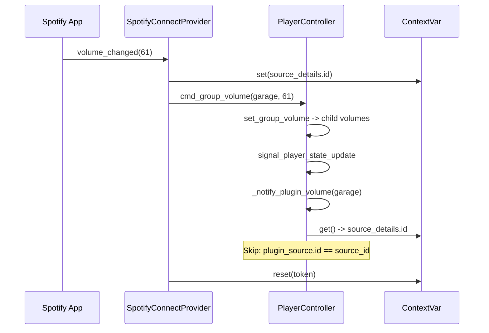

# Source-Aware Plugin Volume Notification Filtering

## Problem

When a plugin (e.g. Spotify Connect) sends an inbound volume change to MA, the internal volume lifecycle (`cmd_group_volume` -> `set_group_volume` -> child volume sets -> `signal_player_state_update`) triggers the reactive `_notify_plugin_volume` hook, which schedules a debounced `on_volume` callback **back to the same plugin**. This redundant echo:
1. Wastes an API call (sending volume back to Spotify that Spotify already knows)
2. Sets `_last_outbound_volume_time`, which then **blocks** subsequent real inbound volume changes from the Spotify app for 1.5 seconds

## Design: ContextVar-Based Source Filtering (Option 2)

Use a `ContextVar` to carry the originating plugin source ID through the async volume command chain. The controller's `_notify_plugin_volume` reads this var and skips notifying the originating source. The plugin never sees the echo.



**Why ContextVar**: `asyncio.gather` in `set_group_volume` and `call_later` in `trigger_player_update` both copy the current context, so the source ID propagates correctly to all synchronous and cascaded state updates within the volume change lifecycle. Different concurrent tasks (e.g. a simultaneous MA UI volume change) get their own context and are not affected.

**Complementary with existing echo suppression**: The `_last_outbound_volume_time` mechanism remains needed for the MA-to-Spotify-to-MA echo path (user changes volume in MA UI -> `on_volume` sends to Spotify -> Spotify echoes back). The new ContextVar mechanism handles the opposite direction (Spotify -> MA -> would-echo-back-to-Spotify).

## Changes

### 1. Controller: Add ContextVar and context manager

**File**: [music_assistant/controllers/players/controller.py](music_assistant/controllers/players/controller.py)

- Add module-level `ContextVar`:
  ```python
  from contextvars import ContextVar
  _volume_change_source_id: ContextVar[str | None] = ContextVar('_volume_change_source_id', default=None)
  ```

- Add a public context manager on `PlayerController` for plugins to use:
  ```python
  @contextmanager
  def plugin_volume_context(self, source_plugin_id: str):
      token = _volume_change_source_id.set(source_plugin_id)
      try:
          yield
      finally:
          _volume_change_source_id.reset(token)
  ```

### 2. Controller: Filter in `_notify_plugin_volume`

**File**: [music_assistant/controllers/players/controller.py](music_assistant/controllers/players/controller.py) (line ~2056)

- Read the ContextVar and skip the originating source:
  ```python
  def _notify_plugin_volume(self, player: Player) -> None:
      source_id = _volume_change_source_id.get()
      ...
      for plugin_source in self.get_plugin_sources():
          if plugin_source.in_use_by == player.player_id and plugin_source.on_volume:
              if source_id and plugin_source.id == source_id:
                  # Don't echo volume back to the plugin that initiated the change
                  continue
              ...
  ```

### 3. Spotify Connect: Use the context manager

**File**: [music_assistant/providers/spotify_connect/__init__.py](music_assistant/providers/spotify_connect/__init__.py) (line ~891)

- Wrap `cmd_group_volume` / `cmd_volume_set` calls in the context manager:
  ```python
  with self.mass.players.plugin_volume_context(self._source_details.id):
      if is_group:
          await self.mass.players.cmd_group_volume(...)
      else:
          await self.mass.players.cmd_volume_set(...)
  ```

### 4. Revert `_last_inbound_volume_time` additions

**File**: [music_assistant/providers/spotify_connect/__init__.py](music_assistant/providers/spotify_connect/__init__.py)

- Remove `self._last_inbound_volume_time` instance variable (line 219)
- Remove the `since_inbound` check and early return in `_on_volume` (the block added around line 514)
- Remove `self._last_inbound_volume_time = time.monotonic()` in the inbound handler (line 891)

### 5. Update tests

**File**: [tests/providers/test_spotify_connect.py](tests/providers/test_spotify_connect.py)

- Remove `_last_inbound_volume_time` from mock fixtures
- Remove `test_accepted_inbound_sets_inbound_timestamp`
- Remove `_make_on_volume_mock` helper
- Add a test verifying that `_notify_plugin_volume` skips the originating plugin source when the ContextVar is set
- Add a test verifying that `_notify_plugin_volume` notifies OTHER plugin sources (not the originator) when the ContextVar is set

### 6. Update architecture docs

**Files**: [docs/architecture/07-volume.md](docs/architecture/07-volume.md), [docs/architecture/11-plugin-system.md](docs/architecture/11-plugin-system.md)

- Document the ContextVar-based source filtering in the Plugin Volume Callbacks section
- Update the "Volume anti-ping-pong" section to describe both mechanisms (outbound echo suppression for MA->Spotify echoes, source filtering for Spotify->MA echoes)

## Not changing

- **AirPlay Receiver / Plex Connect**: These also call `cmd_volume_set` for inbound volume, but don't currently have echo issues. Can adopt `plugin_volume_context` in a follow-up if needed.
- **`_last_outbound_volume_time`**: Kept as-is for the MA-initiated echo suppression path.
- **`on_volume` callback signature**: Unchanged — the filtering is entirely in the controller.
