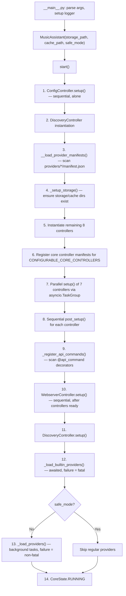

# High-Level Architecture

Music Assistant is an async Python server that acts as a centralized music library manager: it connects to streaming services (Spotify, Tidal, Qobuz, local filesystems, …), aggregates their catalogs into a unified library, and streams audio to speakers (Chromecast, AirPlay, DLNA, Sonos, …). It integrates tightly with Home Assistant but also runs standalone. The entire server is single-process, single-event-loop, built on `asyncio` and `aiohttp`.

## The Multi-Repo Ecosystem

| Repository | Purpose |
|---|---|
| **`music-assistant/server`** (this repo) | The server: controllers, providers, streaming engine, webserver |
| **`music-assistant/models`** | Shared data models (`mashumaro` + `orjson` serialization). Defines `API_SCHEMA_VERSION` / `MIN_SCHEMA_VERSION` for client-server compatibility |
| **`music-assistant/client`** | Async Python client that mirrors the server's controller API surface |
| **`music-assistant/frontend`** | Web UI (served by the server's webserver controller) |
| Protocol libraries | `aioslimproto`, `aiosonos`, `cliairplay`, `PyChromecast`, etc. — each wrapped by a player provider |

The `models` package is the shared contract between server and client. It uses `mashumaro` dataclasses with `orjson` for fast (de)serialization. The `API_SCHEMA_VERSION` integer is bumped for additive API changes; `MIN_SCHEMA_VERSION` is bumped only for breaking changes, which forces all clients to update.

## The Central Hub: `MusicAssistant`

The `MusicAssistant` class in `music_assistant/mass.py` is the nucleus of the server. Every other component holds a reference to it. It owns:

- **10 core controllers** (see component map below)
- **The event bus** (`signal_event`, `subscribe`, `_subscribers`)
- **The command handler registry** (`command_handlers`, `register_api_command`)
- **The provider registry** (`_providers`, `_provider_manifests`)
- **Task tracking** (`_tracked_tasks`, `_tracked_timers`, `create_task`, `call_later`)
- **Shared HTTP sessions** (`http_session`, `http_session_no_ssl`)

```python
class MusicAssistant:
    loop: asyncio.AbstractEventLoop
    config: ConfigController
    cache: CacheController
    discovery: DiscoveryController
    tasks: TasksController
    webserver: WebserverController
    metadata: MetaDataController
    music: MusicController
    players: PlayerController
    player_queues: PlayerQueuesController
    streams: StreamsController
```

## Component Map

| Controller | Domain | Responsibility |
|---|---|---|
| `ConfigController` | `config` | Persistent JSON settings, encryption, get/set interface for all config |
| `DiscoveryController` | `discovery` | mDNS/SSDP device discovery, zeroconf management |
| `CacheController` | `cache` | Two-tier cache (in-memory LRU + SQLite), expiration, cleanup |
| `TasksController` | `tasks` | Background task scheduling, recurring tasks, progress tracking |
| `StreamsController` | `streams` | Audio streaming engine, codec transcoding, flow-mode streams |
| `MusicController` | `music` | Unified media library, provider sync, search aggregation |
| `MetaDataController` | `metadata` | Art, lyrics, biographies — delegates to metadata providers |
| `PlayerController` | `players` | Player state machine, command routing, protocol linking |
| `PlayerQueuesController` | `player_queues` | Per-player queue management, playback progression |
| `WebserverController` | `webserver` | aiohttp web server, JSON-RPC API, WebSocket connections, auth |

Each controller inherits from `CoreController` (`music_assistant/models/core_controller.py`), which provides `setup()`, `post_setup()`, `close()`, `reload()`, and `update_config()` lifecycle hooks. Controllers that appear in `CONFIGURABLE_CORE_CONTROLLERS` also get a `ProviderManifest` registered so the UI can display their settings.

For details on the event system, see [01-event-system.md](01-event-system.md). For configuration and persistence, see [02-configuration.md](02-configuration.md). For the webserver, API, and authentication, see [12-webserver-api.md](12-webserver-api.md). For network discovery, see [13-discovery.md](13-discovery.md). For metadata enrichment, see [14-metadata.md](14-metadata.md). For the provider loading lifecycle, see [15-provider-lifecycle.md](15-provider-lifecycle.md).

## Startup Lifecycle

The startup sequence in `MusicAssistant.start()` is deliberately ordered — controllers that others depend on are initialized first, and parallelism is used only where dependencies allow it.



**Key details:**

- **Step 1**: `ConfigController` must be first — it loads `settings.json` and provides the server ID used for encryption. No other controller can function without it.
- **Step 3**: Manifest loading scans `music_assistant/providers/*/manifest.json` in parallel via `TaskManager`. Directories prefixed with `_` are skipped unless `dev_mode` is active.
- **Step 7**: The seven controllers (`cache`, `tasks`, `streams`, `music`, `metadata`, `players`, `player_queues`) are set up in parallel inside an `asyncio.TaskGroup`. Each receives its `CoreConfig` from the config controller.
- **Step 12**: Builtin providers (like `sync_group`, `universal_group`, `theaudiodb`) are loaded synchronously via `TaskGroup` — if any fails, startup aborts.
- **Step 13**: Regular providers are loaded via `TaskManager(self, 2)` (concurrency limit of 2) as background tasks. Failures trigger auto-retry after 120 seconds for `MusicAssistantError` subclasses.

## Shutdown Lifecycle

`MusicAssistant.stop()` reverses the startup:

1. State → `CoreState.STOPPING` (suppresses new events)
2. Cancel all tracked tasks
3. Unload all providers (via `asyncio.gather`, tolerating exceptions)
4. Close controllers in order: `discovery` → `streams` → `webserver` → `tasks` → `metadata` → `music` → `player_queues` → `players` → `config` → `cache`
5. Close shared HTTP sessions
6. State → `CoreState.STOPPED`

## Safe Mode

When `safe_mode=True` (set via CLI `--safe-mode`, HA add-on options, or `MASS_SAFE_MODE` env var):

- **Loads**: config controller, all core controllers, builtin providers
- **Skips**: all regular (non-builtin) providers
- **Purpose**: allows the server to start and be accessible via the web UI even when a misbehaving provider would otherwise crash the startup. Users can then disable the problematic provider through the UI before restarting normally.

## Dev Mode

Dev mode is detected in `MusicAssistant.__init__()`:

```python
self.dev_mode = (
    os.environ.get("PYTHONDEVMODE") == "1"
    or pathlib.Path(__file__).parent.resolve().parent.resolve().joinpath(".venv").exists()
)
```

When active, provider directories prefixed with `_` (like `_demo_music_provider`, `_demo_player_provider`, `_demo_plugin_provider`) are included in manifest scanning. These demo providers serve as annotated templates for provider development.

## Task Management

`MusicAssistant` provides two primitives for managing async work:

| Method | Purpose |
|---|---|
| `create_task(target, *args, task_id=None, eager_start=True)` | Wraps a coroutine in a tracked `asyncio.Task`. Tasks are auto-cancelled on server stop. The `task_id` parameter enables deduplication — if a task with the same ID is already running, the new one is skipped (or the old one cancelled if `abort_existing=True`). `eager_start=True` starts the task immediately without yielding to the event loop. |
| `call_later(delay, target, *args, task_id=None)` | Schedules a callable/coroutine to run after `delay` seconds. Uses `task_id` for debouncing — calling again with the same ID cancels the pending timer. Used extensively for config reload debouncing (1-second delay). |

Both methods enforce event-loop-thread safety via `verify_event_loop_thread()`.

## Thread Safety

`verify_event_loop_thread(what)` compares the current thread ID against the event loop's thread ID. It is called before `signal_event`, `create_task`, and `call_later` to ensure these operations are never invoked from a background thread, which would cause race conditions with the non-thread-safe subscriber set and task dictionaries.

## Data Directories

| Path | Default | Purpose |
|---|---|---|
| `storage_path` | `~/.musicassistant/` | Persistent data: `settings.json`, `library.db`, logs |
| `cache_path` | `~/.musicassistant/.cache/` | Disposable cache: `cache.db` |

The `__main__.py` entry point respects `XDG_DATA_HOME` and `XDG_CACHE_HOME` environment variables for overriding these defaults.

## Key Files

| File | Description |
|---|---|
| `music_assistant/mass.py` | `MusicAssistant` class — the central hub (~1077 lines) |
| `music_assistant/__main__.py` | CLI entry point, argument parsing, logging setup (~271 lines) |
| `music_assistant/constants.py` | Config keys (`CONF_*`), DB tables (`DB_TABLE_*`), reusable config entries, `CONFIGURABLE_CORE_CONTROLLERS`, `DEFAULT_PROVIDERS` |
| `music_assistant/models/core_controller.py` | `CoreController` base class for all controllers (~110 lines) |
| `music_assistant_models` (installed package) | Shared data models: `EventType`, `MassEvent`, `ProviderManifest`, config entries, `CoreState` |
