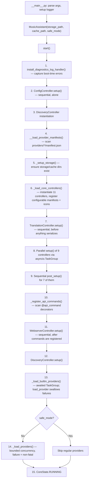

# High-Level Architecture

Music Assistant is an async Python server that acts as a centralized music library manager: it connects to streaming services (Spotify, Tidal, Qobuz, local filesystems, …), aggregates their catalogs into a unified library, and streams audio to speakers (Chromecast, AirPlay, DLNA, Sonos, …). It integrates tightly with Home Assistant but also runs standalone. The entire server is single-process, single-event-loop, built on `asyncio` and `aiohttp`.

## The Multi-Repo Ecosystem

| Repository | Purpose |
|---|---|
| **`music-assistant/server`** (this repo) | The server: controllers, providers, streaming engine, webserver. Owns `API_SCHEMA_VERSION` / `MIN_SCHEMA_VERSION` in `music_assistant/constants.py` |
| **`music-assistant/models`** | Shared data models (`mashumaro` + `orjson` serialization) — the wire-format contract between server and client |
| **`music-assistant/client`** | Async Python client that mirrors the server's controller API surface |
| **`music-assistant/frontend`** | Web UI (served by the server's webserver controller) |
| Protocol libraries | `aioslimproto`, `aiosonos`, `cliairplay`, `PyChromecast`, etc. — each wrapped by a player provider |

The `models` package is the shared serialization contract between server and client. Schema negotiation is separate: the server reports `API_SCHEMA_VERSION` / `MIN_SCHEMA_VERSION` from its own `constants.py` via `get_server_info()`. The current schema integer is bumped for additive API changes; `MIN_SCHEMA_VERSION` is bumped only for breaking changes, which forces all clients to update.

## The Central Hub: `MusicAssistant`

The `MusicAssistant` class in `music_assistant/mass.py` is the nucleus of the server. Every other component holds a reference to it. It owns:

- **13 controllers** (see component map below)
- **The event bus** (`signal_event`, `subscribe`, `_subscribers`)
- **The command handler registry** (`command_handlers`, `register_api_command`)
- **The provider registry** (`_providers`, `_provider_manifests`, `_provider_icons`)
- **Task tracking** (`_tracked_tasks`, `_tracked_timers`, `create_task`, `call_later`)
- **Shared HTTP sessions** (`http_session`, `http_session_no_ssl`)

```python
class MusicAssistant:
    loop: asyncio.AbstractEventLoop
    config: ConfigController
    webserver: WebserverController
    cache: CacheController
    metadata: MetaDataController
    tasks: TasksController
    music: MusicController
    players: PlayerController
    player_queues: PlayerQueuesController
    discovery: DiscoveryController
    streams: StreamsController
    translations: TranslationController
    diagnostics: DiagnosticsController
    dashboard: DashboardController
```

Twelve of these are `CoreController` subclasses. `ConfigController` is the exception: it is deliberately *not* a `CoreController`, because it must be usable before the core-controller machinery exists — `CoreController.setup()` takes a `CoreConfig` that only the config controller can produce. It is composed from mixins (`ProviderConfigMixin`, `PlayerConfigMixin`, `PlayerQueueConfigMixin`, `DSPConfigMixin`, `CoreConfigMixin`, `SetupFlowMixin`) and exposes a plain `initialized: bool` rather than the `asyncio.Event` the other controllers carry.

## Component Map

| Controller | Domain | Responsibility |
|---|---|---|
| `ConfigController` | `config` | Persistent JSON settings, encryption, get/set interface for all config |
| `DiscoveryController` | `discovery` | mDNS/SSDP device discovery, zeroconf management |
| `CacheController` | `cache` | SQLite cache (WAL + mmap, no in-memory tier) with JSON-serialized values, expiration, persistent entries, scheduled cleanup |
| `TasksController` | `tasks` | Background task scheduling, recurring tasks, progress tracking |
| `StreamsController` | `streams` | Audio streaming engine, codec transcoding, flow-mode streams |
| `MusicController` | `music` | Unified media library, provider sync, search aggregation |
| `MetaDataController` | `metadata` | Art, lyrics, biographies — delegates to metadata providers |
| `PlayerController` | `players` | Player state machine, command routing, protocol linking |
| `PlayerQueuesController` | `player_queues` | Per-player queue management, playback progression |
| `WebserverController` | `webserver` | aiohttp web server, JSON-RPC API, WebSocket connections, auth |
| `TranslationController` | `translations` | Loads and resolves translation strings for server-provided objects |
| `DiagnosticsController` | `diagnostics` | Assembles on-demand, privacy-safe troubleshooting reports |
| `DashboardController` | `dashboard` | Casts Music Assistant dashboards (e.g. Party mode) to display devices |

Every controller except `ConfigController` inherits from `CoreController` (`music_assistant/models/core_controller.py`), which provides `setup()`, `post_setup()`, `close()`, `reload()`, and `update_config()` lifecycle hooks. See [15-provider-lifecycle.md](15-provider-lifecycle.md#corecontroller-lifecycle) for the full `CoreController` contract.

For details on the event system, see [01-event-system.md](01-event-system.md). For configuration and persistence, see [02-configuration.md](02-configuration.md). For the webserver, API, and authentication, see [12-webserver-api.md](12-webserver-api.md). For network discovery, see [13-discovery.md](13-discovery.md). For metadata enrichment, see [14-metadata.md](14-metadata.md). For the provider loading lifecycle, see [15-provider-lifecycle.md](15-provider-lifecycle.md).

## Core Modules as Settings Entities

Core controllers are not just internal plumbing — the configurable ones are surfaced in the settings UI alongside providers, using the same models the frontend already renders for providers.

Every `CoreController` builds a `ProviderManifest` with `type=ProviderType.CORE` in its `__init__` (`builtin=True`, `allow_disable=False`), and subclasses customize `manifest.name`, `manifest.description` and `manifest.icon` from there. But only the domains listed in `CONFIGURABLE_CORE_CONTROLLERS` (`music_assistant/constants.py`) are registered into `mass._provider_manifests`, which is what the `providers/manifests` API returns:

```python
CONFIGURABLE_CORE_CONTROLLERS = (
    "discovery", "streams", "webserver", "players", "metadata",
    "cache", "music", "player_queues", "tasks",
)
```

`_load_core_controllers()` registers each of those nine manifests and, for each, calls `detect_provider_icons()` on the controller's own package directory — so a controller ships `icon.svg` / `icon_dark.svg` next to its code exactly like a provider does, and the detected variants are recorded in `manifest.icon_images`. All nine configurable controllers ship both icon variants.

`translations`, `diagnostics` and `dashboard` are full core controllers but are **not** user-configurable settings modules: they build a manifest like everyone else, but it is never registered and no icons are loaded for them.

A controller with user-visible strings also ships a `strings.json` in its package, which `scripts/build_translations.py` compiles into the flat `translations/en.json` under a `core.{domain}.` prefix — the namespace a controller's `translation_owner` property returns. This is the same pipeline providers use with their `provider.{domain}.` prefix; see [02-configuration.md](02-configuration.md) for how config entries pick up their localized labels. All nine configurable controllers ship one, as does `dashboard` (for its manifest text and error messages); `config`, `diagnostics` and `translations` currently have no localizable strings of their own.

## Startup Lifecycle

The startup sequence in `MusicAssistant.start()` is deliberately ordered — controllers that others depend on are initialized first, and parallelism is used only where dependencies allow it.



**Key details:**

- **Step 1**: The always-on diagnostics log handler is installed before anything else that can fail, so boot-time errors land in the diagnostics report. It is idempotent — `__main__.py` installs it too, but embedded usage boots the server directly.
- **Step 2**: `ConfigController` must be first — it loads `settings.json`, and it installs the encrypt/decrypt callbacks that every `SECURE_STRING` config value depends on. Encryption uses a dedicated, randomly generated `CONF_ENCRYPTION_KEY` rather than a key derived from the server ID; see [02-configuration.md](02-configuration.md) for the key handling and the one-time migration of legacy secrets.
- **Step 4**: Manifest loading scans `music_assistant/providers/*/manifest.json` in parallel via `TaskManager`. Directories prefixed with `_` are skipped unless `dev_mode` is active.
- **Step 6**: Instantiating the controllers and registering their manifests is a single step: `_load_core_controllers()` constructs all eleven remaining controllers, then registers a `ProviderManifest` plus icons for each domain in `CONFIGURABLE_CORE_CONTROLLERS`.
- **Step 7**: `translations` is set up **first and on its own**, because localized strings must exist before any object is serialized — manifests, config entries and error messages all resolve through it.
- **Step 8**: Nine controllers (`cache`, `tasks`, `streams`, `music`, `metadata`, `players`, `player_queues`, `diagnostics`, `dashboard`) are set up in parallel inside an `asyncio.TaskGroup`. Each is handed its `CoreConfig`, which is also stored on the controller as `self.config` so internal code can read values without rebuilding the entries.
- **Step 9**: `post_setup()` runs for only the original seven (`cache`, `tasks`, `streams`, `music`, `metadata`, `players`, `player_queues`) — not for `translations`, `diagnostics` or `dashboard`.
- **Steps 10–11**: API command registration happens **before** the webserver is set up, so every `@api_command` handler exists by the time the first request can arrive.
- **Step 13**: Builtin providers (like `sync_group`, `universal_player`, `sendspin`, `theaudiodb`) are loaded via `TaskGroup` and fully awaited so they finish before regular providers start — but each task calls `load_provider(..., allow_retry=True)`, which **catches** load failures, records `last_error`, and schedules a 120s retry for `MusicAssistantError` subclasses. A failed builtin therefore does **not** abort startup.
- **Step 14**: Regular providers load concurrently under `TaskManager(self, PROVIDER_LOAD_CONCURRENCY)` (8 at a time). Failures are likewise non-fatal and trigger the same auto-retry path.

## Shutdown Lifecycle

`MusicAssistant.stop()` broadly reverses the startup:

1. State → `CoreState.STOPPING` (suppresses new events)
2. Cancel all tracked tasks
3. Unload all providers (via `asyncio.gather`, tolerating exceptions)
4. Close controllers in order: `discovery` → `streams` → `webserver` → `tasks` → `metadata` → `music` → `player_queues` → `players` → `translations` → `diagnostics` → `dashboard`
5. Close `config` (flushing any pending save) and then `cache`
6. Close shared HTTP sessions
7. State → `CoreState.STOPPED`

`config` and `cache` close last because the controllers ahead of them may still persist state as they shut down.

## Safe Mode

When `safe_mode=True` (set via CLI `--safe-mode`, HA add-on options, or `MASS_SAFE_MODE` env var):

- **Loads**: config controller, all core controllers, builtin providers
- **Skips**: all regular (non-builtin) providers
- **Purpose**: allows the server to start and be accessible via the web UI even when a misbehaving provider would otherwise crash the startup. Users can then disable the problematic provider through the UI before restarting normally.

## Dev Mode

Dev mode is detected in `MusicAssistant.__init__()`:

```python
self.dev_mode = (
    os.environ.get("PYTHONDEVMODE") == "1"
    or pathlib.Path(__file__).parent.resolve().parent.resolve().joinpath(".venv").exists()
)
```

When active, provider directories prefixed with `_` (like `_demo_music_provider`, `_demo_player_provider`, `_demo_plugin_provider`) are included in manifest scanning. These demo providers serve as annotated templates for provider development.

## Task Management

`MusicAssistant` provides two primitives for managing async work:

| Method | Purpose |
|---|---|
| `create_task(target, *args, task_id=None, eager_start=True)` | Wraps a coroutine in a tracked `asyncio.Task`. Tasks are auto-cancelled on server stop. The `task_id` parameter enables deduplication — if a task with the same ID is already running, the new one is skipped (or the old one cancelled if `abort_existing=True`). `eager_start=True` starts the task immediately without yielding to the event loop. |
| `call_later(delay, target, *args, task_id=None)` | Schedules a callable/coroutine to run after `delay` seconds. Uses `task_id` for debouncing — calling again with the same ID cancels the pending timer. Used extensively for config reload debouncing (1-second delay). |

Both methods enforce event-loop-thread safety via `verify_event_loop_thread()`.

## Thread Safety

`verify_event_loop_thread(what)` compares the current thread ID against the event loop's thread ID. It is called before `signal_event`, `create_task`, and `call_later` to ensure these operations are never invoked from a background thread, which would cause race conditions with the non-thread-safe subscriber set and task dictionaries.

## Data Directories

| Path | Default | Purpose |
|---|---|---|
| `storage_path` | `~/.musicassistant/` | Persistent data: `settings.json`, `library.db`, logs |
| `cache_path` | `~/.musicassistant/.cache/` | Disposable cache: `cache.db` |

The `__main__.py` entry point respects `XDG_DATA_HOME` and `XDG_CACHE_HOME` environment variables for overriding these defaults.

## Key Files

| File | Description |
|---|---|
| [`music_assistant/mass.py`](../../music_assistant/mass.py) | `MusicAssistant` class — the central hub (~1344 lines) |
| [`music_assistant/__main__.py`](../../music_assistant/__main__.py) | CLI entry point, argument parsing, logging setup (~296 lines) |
| [`music_assistant/constants.py`](../../music_assistant/constants.py) | Config keys (`CONF_*`), DB tables (`DB_TABLE_*`), reusable config entries, `CONFIGURABLE_CORE_CONTROLLERS`, `DEFAULT_PROVIDERS` |
| [`music_assistant/models/core_controller.py`](../../music_assistant/models/core_controller.py) | `CoreController` base class for every controller except `config` (~183 lines) |
| [`music_assistant/controllers/config/`](../../music_assistant/controllers/config) | `ConfigController` package — the one controller that is not a `CoreController` |
| [`scripts/build_translations.py`](../../scripts/build_translations.py) | Compiles per-controller/per-provider `strings.json` into `translations/en.json` |
| `music_assistant_models` (installed package) | Shared data models: `EventType`, `MassEvent`, `ProviderManifest`, config entries, `CoreState` |
