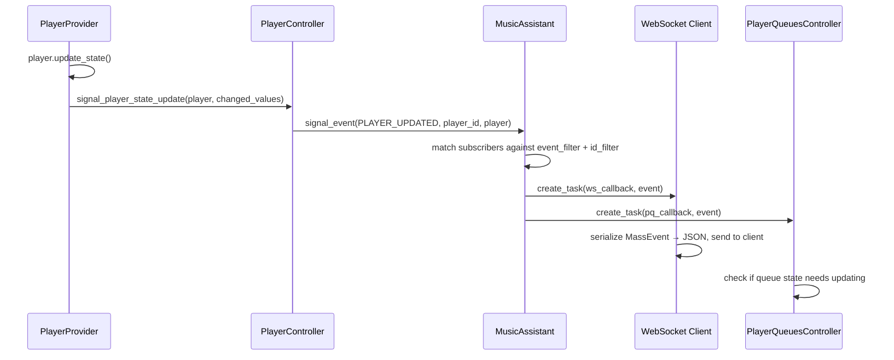

# Event System

The event system is the pub/sub backbone that ties Music Assistant together. Every meaningful state change — a player updating, a media item being added, a provider loading — is broadcast as an event. Controllers, providers, and external clients (via WebSocket) all subscribe to events to react to changes without tight coupling. The complementary imperative layer — command handlers — provides the request-response counterpart for client-driven operations.

## `EventType` Enum

Defined in `music_assistant_models.enums`, `EventType` is a `StrEnum` with **30 members** — 29 real event types plus the `UNKNOWN` fallback:

| Category | Events | Typical `object_id` |
|---|---|---|
| **Player** | `PLAYER_ADDED`, `PLAYER_UPDATED`, `PLAYER_REMOVED`, `PLAYER_CONFIG_UPDATED`, `PLAYER_DSP_CONFIG_UPDATED`, `PLAYER_OPTIONS_UPDATED`, `PLAYER_SLEEP_TIMER_UPDATED`, `DSP_PRESETS_UPDATED` | `player_id` |
| **Queue** | `QUEUE_ADDED`, `QUEUE_UPDATED`, `QUEUE_ITEMS_UPDATED`, `QUEUE_TIME_UPDATED` | `queue_id` |
| **Media** | `MEDIA_ITEM_PLAYED`, `MEDIA_ITEM_ADDED`, `MEDIA_ITEM_UPDATED`, `MEDIA_ITEM_DELETED`, `MUSIC_SYNC_COMPLETED` | URI or item identifier |
| **Provider** | `PROVIDERS_UPDATED`, `PROVIDER_EVENT` | provider `instance_id` for `PROVIDER_EVENT`; none for `PROVIDERS_UPDATED` |
| **Setup flows** | `SETUP_FLOW_UPDATED` | `flow_id` |
| **Tasks** | `TASKS_UPDATED`, `SYNC_TASKS_UPDATED` *(reserved — see below)* | (varies) |
| **Dashboard** | `DASHBOARD_SHOW`, `DASHBOARD_HIDE`, `DASHBOARDS_UPDATED`, `DASHBOARD_SESSIONS_UPDATED` | `dashboard_id` where applicable |
| **System** | `CORE_STATE_UPDATED`, `AUTH_SESSION` *(retired)*, `SHUTDOWN` *(deprecated)* | — |

`UNKNOWN` is the fallback returned by `_missing_()`, so an event name from a newer server deserializes into something inert instead of raising.

### Three members no longer emitted

Reading the enum alone would suggest otherwise, so these are worth calling out:

| Member | Status |
|---|---|
| `AUTH_SESSION` | **Retired.** #5030 removed the `AUTH_SESSION` auth-popup mechanism (the OAuth-session polling flow and `helpers/auth.py` went with it). The enum member survives for wire compatibility but nothing emits or subscribes to it. See [19-authentication.md](19-authentication.md#oauth-two-unrelated-flows) |
| `SYNC_TASKS_UPDATED` | **Reserved.** Present in the models package but referenced nowhere in server code. Sync progress reaches clients as `TASKS_UPDATED` |
| `SHUTDOWN` | **Deprecated** (value `"application_shutdown"`), superseded by `CORE_STATE_UPDATED`. Nothing signals it any more, but `helpers/aiohttp_client.py` still *subscribes* to it to close its shared DNS resolver, and `real_close()` has no other call site — so that cleanup no longer runs. Harmless in practice (the process is exiting), but it is a dangling subscription rather than a purely cosmetic enum remnant |

### `PROVIDER_EVENT`

The one generic escape hatch: a provider instance emits an arbitrary payload under its own identity via `Provider.signal_provider_event(data, sub_scope=None)`. `object_id` is the provider's `instance_id`, optionally suffixed `/{sub_scope}`, and `data` is provider-defined. This is what lets a plugin push state to its own frontend without adding an enum member — Music Quiz broadcasts its whole game state this way (see [18-ai-and-mcp.md](18-ai-and-mcp.md#music-quiz)).

### There is no position-jump event

Player position jumps do **not** have their own event type. When a player's corrected position moves outside normal playback progression (a seek, or a buffer correction), it calls `PlayerController.on_player_position_jumped()`, whose own docstring is explicit that "this is not an event by itself": it re-bases the active queue's timing on the fresh position and nudges related players, and the follow-up state update is what emits the actual `PLAYER_UPDATED`. Clients detect the discontinuity from the position anchors in the state snapshot. See [04-player-controller.md](04-player-controller.md) and [03-player-model.md](03-player-model.md#position-anchors).

### A naming collision to watch for

Several provider libraries define their own `EventType` enums — `aiosonos` and `aioslimproto` both do — with members like `PLAYER_CONNECTED`, `PLAYER_HEARTBEAT`, and `GROUP_UPDATED`. Those appear in `providers/sonos/` and `providers/squeezelite/` and have nothing to do with the MA event bus. A grep for `EventType.` across the tree will surface both.

## `MassEvent` Dataclass

Defined in `music_assistant_models.event`, this is the event envelope:

```python
@dataclass(frozen=True)
class MassEvent(DataClassORJSONMixin):
    event: EventType
    object_id: str | None = None   # player_id, queue_id, or URI
    data: Any = field(default=None, metadata={"serialize": ...})
```

The dataclass is frozen (immutable once created). The `data` field carries the event payload — typically a serialized model object like `ServerInfoMessage` (for `CORE_STATE_UPDATED`) or a list of `ProviderInstance` (for `PROVIDERS_UPDATED`). Serialization uses `mashumaro` with `orjson` under the hood, and the `data` field has a custom serialize hook (`get_serializable_value`) that handles converting arbitrary objects to JSON-safe representations.

## Signaling Events: `signal_event`

The `signal_event` method on `MusicAssistant` is the sole event emission point:

```python
def signal_event(
    self,
    event: EventType,
    object_id: str | None = None,
    data: Any = None,
) -> None:
```

**Behavior:**

1. **Suppressed when closing** — if `self.closing` is `True` (state is `STOPPING` or `STOPPED`), the call returns immediately. This prevents cascading events during shutdown.
2. **Thread enforcement** — calls `verify_event_loop_thread("signal_event")` to ensure it runs on the event loop thread. This is critical because `_subscribers` is a plain `set` with no locking.
3. **Verbose logging** — at the custom `VERBOSE_LOG_LEVEL` (5), each event is logged via the `"event"` child logger. `QUEUE_TIME_UPDATED` is not special-cased in the filter but is noted as "too chatty" in comments.
4. **Subscriber dispatch** — iterates a snapshot (`list(self._subscribers)`) to avoid mutation during iteration. For each subscriber:

| Callback type | Dispatch method | Blocking? |
|---|---|---|
| Async (coroutine function) | `create_task(cb_func, event_obj)` | No — runs as a tracked task |
| Sync (regular callable) | `loop.call_soon(cb_func, event_obj)` | No — scheduled on the next loop iteration |

Neither kind of callback runs inline, so a slow subscriber never blocks the signaler or the other subscribers.

**Sync callbacks use `call_soon`, not `call_soon_threadsafe`** (#4631). That looks unsafe until you notice the invariant that makes it correct: `signal_event` already called `verify_event_loop_thread("signal_event")` two lines earlier, which raises `RuntimeError` if it is running anywhere but the loop thread. Since the caller is provably on the loop thread, the threadsafe variant's extra work — taking the loop's lock and writing to the self-pipe to wake a possibly-sleeping selector — is pure overhead. On a high-frequency event like `QUEUE_TIME_UPDATED`, fanned out to every connected client, that adds up.

The same thread invariant is why `_subscribers` can be a plain `set` with no locking at all.

## Subscribing: `subscribe`

```python
def subscribe(
    self,
    cb_func: EventCallBackType,
    event_filter: EventType | tuple[EventType, ...] | None = None,
    id_filter: str | tuple[str, ...] | None = None,
) -> Callable[[], None]:
```

**Parameters:**

- `cb_func`: sync or async callable accepting a `MassEvent`
- `event_filter`: optional — limit to specific event types. A single `EventType` is normalized to a tuple.
- `id_filter`: optional — limit to specific IDs (player_id, queue_id, URI). A single string is normalized to a tuple.

**Returns** an unsubscribe callable that removes the listener from the set.

**Internals:** Subscribers are stored as a `set[EventSubscriptionType]`, which is a **4-tuple**:

```python
EventSubscriptionType = tuple[
    EventCallBackType,
    tuple[EventType, ...] | None,   # event_filter
    tuple[str, ...] | None,         # id_filter
    bool,                           # is_coro — precomputed at subscribe time
]
```

The fourth element is the interesting one. `subscribe()` calls `inspect.iscoroutinefunction(cb_func)` **once**, when the listener is registered, and stores the answer (#4295). Without it, `signal_event` would re-derive the same fact by reflection for every subscriber on every event — and events like `QUEUE_TIME_UPDATED` fire once per second per active queue against every connected client. Deriving it at subscribe time turns a per-dispatch reflection call into a tuple unpack.

Because the tuple *is* the identity stored in the set, the returned `remove_listener` closure captures it and removes that exact tuple — no separate handle bookkeeping is needed.

The matching logic in `signal_event` is straightforward:
- If `event_filter` is `None`, all events match; otherwise the event must be in the tuple.
- If `id_filter` is `None`, all IDs match; otherwise the `object_id` must be in the tuple.

Both filters must pass for the callback to fire. A single `EventType` or a single `str` passed to `subscribe` is normalized to a 1-tuple, so the hot path only ever does a tuple membership test.

## Task Creation: `mass.create_task`

Async event callbacks are dispatched through `mass.create_task`, so its semantics are part of the event system's behaviour. It is also the general-purpose "run this coroutine in the background and make sure it dies on shutdown" helper used throughout the server.

```python
def create_task(
    self,
    target: Callable[..., Coroutine[Any, Any, _R]] | Awaitable[_R],
    *args: Any,
    task_id: str | None = None,
    abort_existing: bool = False,
    eager_start: bool = True,
    **kwargs: Any,
) -> asyncio.Task[_R]:
```

Three behaviours worth knowing:

**`eager_start=True` is the default.** The task is constructed as `asyncio.Task(coro, loop=..., eager_start=eager_start)`, so the coroutine begins executing synchronously up to its first real suspension point instead of waiting for the next loop iteration. This is what makes ordering predictable when a caller creates several tasks in sequence — each has already run its setup by the time the next is created.

**`task_id` deduplicates.** When a `task_id` is given and a task with that id is still running, the default is to **return the existing task** rather than start a second one. Passing `abort_existing=True` inverts that: the running task is cancelled and replaced. This is how the recurring timers are kept singular — the discovery controller's UPnP cycle and HA re-announce both key off fixed ids.

**Duplicate coroutines are closed** (#3929). If the caller already built a coroutine object and the dedupe check decides to return the existing task, that orphan coroutine is explicitly `.close()`d. Without it, Python would emit a "coroutine was never awaited" `RuntimeWarning` — noisy and misleading, since the skip was intentional.

Tasks are tracked in `_tracked_tasks` keyed by `task_id` (a random hex id when none is supplied), removed by a done-callback, and cancelled during `stop()`. The done-callback also logs unhandled exceptions at warning level when debug logging is on, which is why `TaskManager` (below) can note that "logging of exceptions is done by the `mass.create_task` helper".

### Three things called "tasks"

Easy to conflate, so worth separating explicitly:

| Thing | What it is |
|---|---|
| `mass.create_task` | Fire-and-forget internal work on the event loop, tracked so it can be cancelled on shutdown. Not user-visible |
| `helpers/util.TaskManager` | A bounded-parallelism helper — an alternative to `asyncio.TaskGroup` that does **not** cancel siblings when one task fails. Built on `mass.create_task`, with an optional semaphore `limit` for `create_task_with_limit()`. Used for fan-out work like per-provider sync |
| `TasksController` (`mass.tasks`) | The user-visible long-running job system: progress reporting, cancellation from the UI, the `TASKS_UPDATED` event, and per-user visibility via `list_tasks_for_user()`. See [20-background-tasks.md](20-background-tasks.md) |

Only the third one emits events.

## Command Handlers: The Imperative Counterpart

While events are fire-and-forget broadcasts, **command handlers** provide request-response semantics for client-initiated operations. They are registered in `MusicAssistant.command_handlers`, a `dict[str, APICommandHandler]`.

| Aspect | Events | Commands |
|---|---|---|
| Direction | Server → subscribers (broadcast) | Client → server (point-to-point) |
| Pattern | Pub/sub, fire-and-forget | Request-response (JSON-RPC) |
| Registration | `subscribe()` | `register_api_command()` or `@api_command` decorator |
| Data flow | `MassEvent` pushed to callbacks | Client sends command + args, receives return value |
| Use case | React to state changes | Trigger actions (play, pause, get config, etc.) |

### The `@api_command` Decorator

Defined in `music_assistant/helpers/api.py`, this decorator marks methods for automatic registration:

```python
@api_command("info")
def get_server_info(self) -> ServerInfoMessage:
    ...

@api_command("config/providers/save", required_scope=Scope.CONFIG_PROVIDERS_WRITE)
async def save_provider_config(self, ...):
    ...
```

The decorator sets five attributes on the function:

| Attribute | Purpose |
|---|---|
| `api_cmd` | The command path string (e.g. `"config/providers/save"`) |
| `api_authenticated` | Whether the command requires authentication (default: `True`) |
| `api_required_scope` | `Scope \| None` — the scope required to call it; `None` means any authenticated user |
| `api_allow_impersonation` | Whether the command accepts an injected `user` argument |
| `api_alias` | Whether this is a backward-compatible alias, hidden from the API docs |

Authorization is **scope-based** since #4613; the earlier `required_role` parameter no longer exists. See [19-authentication.md](19-authentication.md) for the scope model and [12-webserver-api.md](12-webserver-api.md#the-api_command-decorator) for the dispatch that enforces it.

### `APICommandHandler` Dataclass

```python
@dataclass
class APICommandHandler:
    command: str
    signature: inspect.Signature
    type_hints: dict[str, Any]
    target: Callable[...]
    authenticated: bool = True
    required_scope: Scope | None = None
    allow_impersonation: bool = False
    alias: bool = False
```

The `parse` classmethod introspects the handler function to extract its signature and type hints. This metadata powers the JSON-RPC argument parsing (`parse_arguments`) and the auto-generated API schema — clients can discover available commands, their parameters, and return types at runtime. For the full WebSocket and HTTP transport layer that delivers these commands, see [12-webserver-api.md](12-webserver-api.md).

The `alias` flag marks backward-compatibility commands that remain functional but are hidden from API documentation.

### Registration Flow

During startup, `_register_api_commands()` scans all controllers (and the webserver's auth manager) for methods decorated with `@api_command`:

```python
def _register_api_commands(self) -> None:
    for cls in (self, self.config, self.metadata, self.tasks,
                self.music, self.players, self.player_queues,
                self.translations, self.webserver, self.webserver.auth,
                self.streams.audio_analysis, self.diagnostics, self.dashboard):
        for attr_name in dir(cls):
            obj = getattr(cls, attr_name)
            if hasattr(obj, "api_cmd"):
                self.register_api_command(obj.api_cmd, obj, ...)
```

Properties are explicitly skipped to avoid triggering lazy initialization side effects (like creating an HTTP session during registration).

Commands can also be registered dynamically at runtime via `register_api_command()`, which returns an unregister callable. This is used by providers that add custom API endpoints (e.g. the onboarding flow registers a temporary `config/onboard_complete` command).

## Event Flow Example

A concrete example showing how a player state change propagates through the system:



## Key Files

| File | What to look at |
|---|---|
| [`music_assistant/mass.py`](../../music_assistant/mass.py) | `signal_event`, `subscribe`, `create_task`, `verify_event_loop_thread`, `register_api_command`, `_register_api_commands`, `EventSubscriptionType` |
| [`music_assistant/helpers/api.py`](../../music_assistant/helpers/api.py) | `api_command` decorator, `APICommandHandler` dataclass, `parse_arguments`, `parse_value` |
| [`music_assistant/models/provider.py`](../../music_assistant/models/provider.py) | `signal_provider_event` — the `PROVIDER_EVENT` escape hatch |
| [`music_assistant/helpers/util.py`](../../music_assistant/helpers/util.py) | `TaskManager` — bounded-parallelism fan-out helper |
| `music_assistant_models/enums.py` | `EventType` enum definition |
| `music_assistant_models/event.py` | `MassEvent` dataclass |
