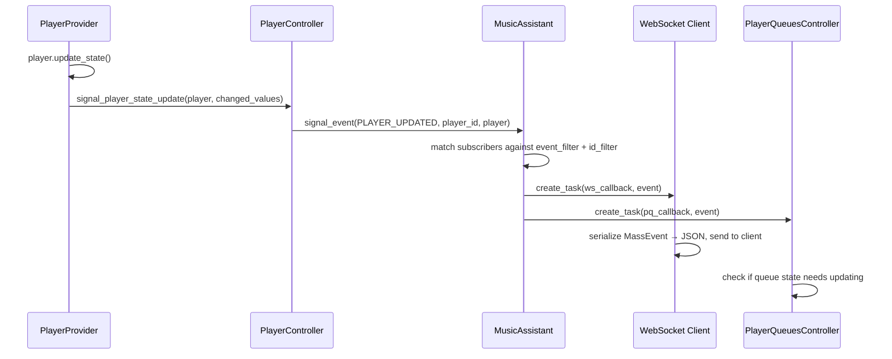

# Event System

The event system is the pub/sub backbone that ties Music Assistant together. Every meaningful state change — a player updating, a media item being added, a provider loading — is broadcast as an event. Controllers, providers, and external clients (via WebSocket) all subscribe to events to react to changes without tight coupling. The complementary imperative layer — command handlers — provides the request-response counterpart for client-driven operations.

## `EventType` Enum

Defined in `music_assistant_models.enums`, `EventType` is a `StrEnum` with 23 members. They fall into five categories:

| Category | Events | Typical `object_id` |
|---|---|---|
| **Player** | `PLAYER_ADDED`, `PLAYER_UPDATED`, `PLAYER_REMOVED`, `PLAYER_CONFIG_UPDATED`, `PLAYER_DSP_CONFIG_UPDATED`, `PLAYER_OPTIONS_UPDATED`, `DSP_PRESETS_UPDATED` | `player_id` |
| **Queue** | `QUEUE_ADDED`, `QUEUE_UPDATED`, `QUEUE_ITEMS_UPDATED`, `QUEUE_TIME_UPDATED` | `queue_id` |
| **Media** | `MEDIA_ITEM_PLAYED`, `MEDIA_ITEM_ADDED`, `MEDIA_ITEM_UPDATED`, `MEDIA_ITEM_DELETED` | URI or item identifier |
| **Provider/Sync** | `PROVIDERS_UPDATED`, `SYNC_TASKS_UPDATED`, `TASKS_UPDATED`, `MUSIC_SYNC_COMPLETED` | (varies) |
| **System** | `AUTH_SESSION`, `CORE_STATE_UPDATED`, `SHUTDOWN` (deprecated) | — |

The `UNKNOWN` member is the fallback via `_missing_()`. `SHUTDOWN` (value `"application_shutdown"`) is deprecated in favor of `CORE_STATE_UPDATED`.

## `MassEvent` Dataclass

Defined in `music_assistant_models.event`, this is the event envelope:

```python
@dataclass(frozen=True)
class MassEvent(DataClassORJSONMixin):
    event: EventType
    object_id: str | None = None   # player_id, queue_id, or URI
    data: Any = field(default=None, metadata={"serialize": ...})
```

The dataclass is frozen (immutable once created). The `data` field carries the event payload — typically a serialized model object like `ServerInfoMessage` (for `CORE_STATE_UPDATED`) or a list of `ProviderInstance` (for `PROVIDERS_UPDATED`). Serialization uses `mashumaro` with `orjson` under the hood, and the `data` field has a custom serialize hook (`get_serializable_value`) that handles converting arbitrary objects to JSON-safe representations.

## Signaling Events: `signal_event`

The `signal_event` method on `MusicAssistant` is the sole event emission point:

```python
def signal_event(
    self,
    event: EventType,
    object_id: str | None = None,
    data: Any = None,
) -> None:
```

**Behavior:**

1. **Suppressed when closing** — if `self.closing` is `True` (state is `STOPPING` or `STOPPED`), the call returns immediately. This prevents cascading events during shutdown.
2. **Thread enforcement** — calls `verify_event_loop_thread("signal_event")` to ensure it runs on the event loop thread. This is critical because `_subscribers` is a plain `set` with no locking.
3. **Verbose logging** — at the custom `VERBOSE_LOG_LEVEL` (5), each event is logged via the `"event"` child logger. `QUEUE_TIME_UPDATED` is not special-cased in the filter but is noted as "too chatty" in comments.
4. **Subscriber dispatch** — iterates a snapshot (`list(self._subscribers)`) to avoid mutation during iteration. For each subscriber:

| Callback type | Dispatch method | Blocking? |
|---|---|---|
| Async (coroutine function) | `create_task(cb_func, event_obj)` | No — runs as a tracked task |
| Sync (regular callable) | `loop.call_soon_threadsafe(cb_func, event_obj)` | No — scheduled on next loop iteration |

The key design choice: **async callbacks are dispatched via `create_task`**, so a slow subscriber never blocks the signaler or other subscribers. Each callback runs independently.

## Subscribing: `subscribe`

```python
def subscribe(
    self,
    cb_func: EventCallBackType,
    event_filter: EventType | tuple[EventType, ...] | None = None,
    id_filter: str | tuple[str, ...] | None = None,
) -> Callable[[], None]:
```

**Parameters:**

- `cb_func`: sync or async callable accepting a `MassEvent`
- `event_filter`: optional — limit to specific event types. A single `EventType` is normalized to a tuple.
- `id_filter`: optional — limit to specific IDs (player_id, queue_id, URI). A single string is normalized to a tuple.

**Returns** an unsubscribe callable that removes the listener from the set.

**Internals:** Subscribers are stored as a `set[EventSubscriptionType]` where:

```python
EventSubscriptionType = tuple[
    EventCallBackType,
    tuple[EventType, ...] | None,   # event_filter
    tuple[str, ...] | None          # id_filter
]
```

The matching logic in `signal_event` is straightforward:
- If `event_filter` is `None`, all events match; otherwise the event must be in the tuple.
- If `id_filter` is `None`, all IDs match; otherwise the `object_id` must be in the tuple.

Both filters must pass for the callback to fire.

## Command Handlers: The Imperative Counterpart

While events are fire-and-forget broadcasts, **command handlers** provide request-response semantics for client-initiated operations. They are registered in `MusicAssistant.command_handlers`, a `dict[str, APICommandHandler]`.

| Aspect | Events | Commands |
|---|---|---|
| Direction | Server → subscribers (broadcast) | Client → server (point-to-point) |
| Pattern | Pub/sub, fire-and-forget | Request-response (JSON-RPC) |
| Registration | `subscribe()` | `register_api_command()` or `@api_command` decorator |
| Data flow | `MassEvent` pushed to callbacks | Client sends command + args, receives return value |
| Use case | React to state changes | Trigger actions (play, pause, get config, etc.) |

### The `@api_command` Decorator

Defined in `music_assistant/helpers/api.py`, this decorator marks methods for automatic registration:

```python
@api_command("info")
def get_server_info(self) -> ServerInfoMessage:
    ...

@api_command("config/providers/save", required_role="admin")
async def save_provider_config(self, ...):
    ...
```

The decorator sets three attributes on the function:

| Attribute | Purpose |
|---|---|
| `api_cmd` | The command path string (e.g. `"config/providers/save"`) |
| `api_authenticated` | Whether the command requires authentication (default: `True`) |
| `api_required_role` | Required user role: `"admin"`, `"user"`, or `None` (any authenticated user) |

### `APICommandHandler` Dataclass

```python
@dataclass
class APICommandHandler:
    command: str
    signature: inspect.Signature
    type_hints: dict[str, Any]
    target: Callable[...]
    authenticated: bool = True
    required_role: str | None = None
    alias: bool = False
```

The `parse` classmethod introspects the handler function to extract its signature and type hints. This metadata powers the JSON-RPC argument parsing (`parse_arguments`) and the auto-generated API schema — clients can discover available commands, their parameters, and return types at runtime. For the full WebSocket and HTTP transport layer that delivers these commands, see [12-webserver-api.md](12-webserver-api.md).

The `alias` flag marks backward-compatibility commands that remain functional but are hidden from API documentation.

### Registration Flow

During startup, `_register_api_commands()` scans all controllers (and the webserver's auth manager) for methods decorated with `@api_command`:

```python
def _register_api_commands(self) -> None:
    for cls in (self, self.config, self.metadata, self.tasks,
                self.music, self.players, self.player_queues,
                self.webserver, self.webserver.auth):
        for attr_name in dir(cls):
            obj = getattr(cls, attr_name)
            if hasattr(obj, "api_cmd"):
                self.register_api_command(obj.api_cmd, obj, ...)
```

Properties are explicitly skipped to avoid triggering lazy initialization side effects (like creating an HTTP session during registration).

Commands can also be registered dynamically at runtime via `register_api_command()`, which returns an unregister callable. This is used by providers that add custom API endpoints (e.g. the onboarding flow registers a temporary `config/onboard_complete` command).

## Event Flow Example

A concrete example showing how a player state change propagates through the system:



## Key Files

| File | What to look at |
|---|---|
| `music_assistant/mass.py` | `signal_event`, `subscribe`, `register_api_command`, `_register_api_commands` |
| `music_assistant/helpers/api.py` | `api_command` decorator, `APICommandHandler` dataclass, `parse_arguments`, `parse_value` |
| `music_assistant_models/enums.py` | `EventType` enum definition |
| `music_assistant_models/event.py` | `MassEvent` dataclass |
