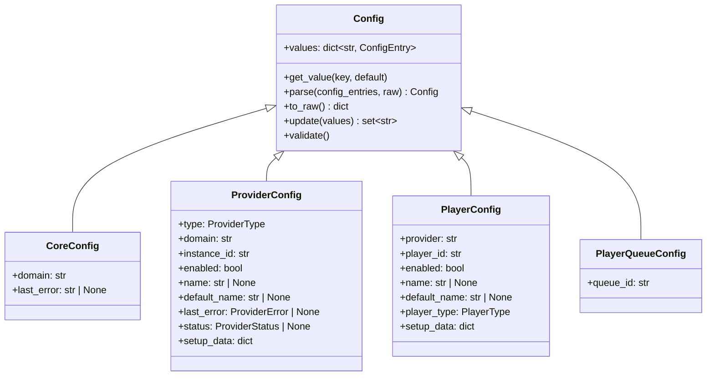

# Configuration and Persistence

The configuration system manages all persistent settings in Music Assistant — from server-level options to per-provider credentials to per-player audio tuning. It is the first controller initialized during startup, before anything else can run, because every other component depends on it for its settings. Persistence is split between a JSON config file (for settings) and SQLite databases (for the media library, the cache, and users/tokens).

## `ConfigController`

`ConfigController` lives in the [`music_assistant/controllers/config/`](../../music_assistant/controllers/config) package (PR #4484 split the former ~2100-line `controllers/config.py` into it). It is deliberately *not* a `CoreController` subclass — it has a simpler lifecycle because it must be available before the core controller infrastructure exists: `CoreController.setup()` takes a `CoreConfig`, and only the config controller can produce one.

### Package layout

`controller.py` holds the base class and composes the rest as mixins:

```python
class ConfigController(
    ProviderConfigMixin,
    PlayerConfigMixin,
    PlayerQueueConfigMixin,
    DSPConfigMixin,
    CoreConfigMixin,
    SetupFlowMixin,
):
```

Each mixin owns one config scope and declares `if TYPE_CHECKING:` stubs for the base attributes it uses (`mass`, `get`, `set`, `save`, …), so the split stays type-checkable without a shared abstract base.

| Module | Role |
|---|---|
| `controller.py` | Base `ConfigController`: `settings.json` load/save, the hierarchical `get`/`set` interface, encryption, onboarding |
| `constants.py` | `DEFAULT_SAVE_DELAY`, `BASE_KEYS`, `PLAYER_QUEUE_CONFIG_OWNER` |
| `helpers.py` | Pure helpers: `_with_translation_owner()`, `_provider_status()` |
| `core.py` | `CoreConfigMixin` — core module config CRUD and `config/core/invoke_action` |
| `providers.py` | `ProviderConfigMixin` — provider config CRUD, `setup_data` reads, derived status, load-time seeding/rehydration |
| `players.py` | `PlayerConfigMixin` — player config CRUD plus the injected protocol-output entries |
| `queues.py` | `PlayerQueueConfigMixin` — per-queue config and global-value resolution |
| `dsp.py` | `DSPConfigMixin` — per-player DSP config and shared DSP presets |
| `flows.py` | `SetupFlowMixin` — the interactive setup/reconfigure flow engine |
| `migrations.py` | One-off `settings.json` transforms applied on load |

**Key responsibilities:**

- Owns the `settings.json` file (in `storage_path`)
- Provides a hierarchical `get(key)` / `set(key, value)` interface using `/`-separated key paths
- Manages encryption of sensitive values (passwords, tokens, setup-flow data)
- Serves as the API surface for all config CRUD operations (`@api_command` decorated methods)
- Drives interactive provider/player setup flows
- Triggers provider/controller reloads when config changes require it

### JSON File I/O

Settings are stored in `{storage_path}/settings.json`. The controller loads the file on `setup()` and writes it back with a **debounced save** — `save()` schedules a write after `DEFAULT_SAVE_DELAY` (5 seconds) using `call_later`. Calling `save(immediate=True)` bypasses the debounce for critical writes (a rotated auth token, a completed setup flow). On shutdown, `close()` flushes a pending save, and returns immediately when nothing is pending.

Writes go through `_save_to_disk` and are **atomic and backed up** (durable `fsync` of the temp file before rename — #5716; earlier atomic-write work also tracked under #4534):

1. Serialize to `settings.json.tmp`, `flush()`, then `os.fsync()` the file descriptor — so a crash can never leave a zero-length primary file behind.
2. Rotate the current `settings.json` to `settings.json.backup`, but **only if it still parses as JSON**. A corrupt crash leftover can therefore never clobber a good backup.
3. `rename` the temp file over `settings.json`.
4. Best-effort `fsync` of the containing directory, so the renames themselves survive a power failure (not supported on every platform/filesystem).

Loading mirrors this: `_load()` tries `settings.json` and then `settings.json.backup`, treating a missing or corrupt file as a reason to fall through to the next candidate. If neither exists the server starts with empty storage.

The hierarchical key system means `self.get("providers/spotify_1/values/username")` traverses nested dicts:

```python
{
  "providers": {
    "spotify_1": {
      "values": {
        "username": "alice"
      }
    }
  }
}
```

### Settings migrations

`migrations.py` runs `migrate(data)` against the raw settings dict right after load, before anything is parsed into config objects, and triggers an immediate save when it changed something. There is no schema version counter: each transform is an independent, **idempotent** function gated on the shape of the data it repairs, tagged with a `TODO: remove after <release>` marker so the accumulated set can be pruned. Current transforms cover repairs (an orphaned provider stub with no `domain`, a self-referential protocol link), renames (`default_enqueue_option_radio` → `default_enqueue_option_live_sources`), and *moves* between scopes — most notably the per-player → per-queue relocation of crossfade and volume normalization, and the promotion of now-global settings to the `player_queues` core config.

One migration runs later, from `setup()` rather than `_load()`: `migrate_provider_setup_data()` moves each provider's setup-flow-owned keys out of `values` into `setup_data`. It needs the encryption callback so migrated string values are encrypted at rest, which is only available after `_init_encryption()`. The per-provider key lists live in `PROVIDER_SETUP_FLOW_KEYS`.

## Config Hierarchy

Four config types serve different scopes. All inherit from `Config` (in `music_assistant_models.config_entries`), which provides `values: dict[str, ConfigEntry]`, `get_value()`, `parse()`, `to_raw()`, `update()`, and `validate()`.



`Config.parse()` stamps every entry with a **translation owner** derived from the config type — `core.{domain}`, `provider.{domain}`, `provider.{provider}` for players, and the fixed `core.player_queues` for queues. That namespace is what resolves an entry's localized label and description at serialization time.

### CoreConfig

Per-controller settings. One `CoreConfig` exists for each controller listed in `CONFIGURABLE_CORE_CONTROLLERS`:

```python
CONFIGURABLE_CORE_CONTROLLERS = (
    "discovery", "streams", "webserver", "players", "metadata",
    "cache", "music", "player_queues", "tasks",
)
```

`translations`, `diagnostics` and `dashboard` are core controllers but not configurable settings modules — see [00-overview.md](00-overview.md) for that distinction.

Each controller defines its own entries via `get_config_entries()`, an async method that takes **no arguments**. The config controller appends `DEFAULT_CORE_CONFIG_ENTRIES` (`log_level` and `max_concurrent_tasks`) to whatever the controller returns, so every core module gets those two for free.

`ConfigEntryType.ACTION` entries are one-shot buttons rather than stored values. Pressing one calls `config/core/invoke_action`, which routes to the controller's `handle_config_action(action)` and returns the freshly rendered entry list (PR #5035). The `cache` controller is the canonical example: it declares a `clear_cache` action and, on press, clears the cache and appends a `LABEL` entry reporting the result.

A handful of entries need runtime data that would be too expensive to compute on the value-read path. `_resolve_core_config_entries()` handles those when serving entries to the UI — currently populating the global autoplay-playlist dropdown for the `player_queues` domain from the library.

### ProviderConfig

Per-provider-instance settings. Fields beyond `Config`:

| Field | Purpose |
|---|---|
| `type` | `ProviderType` (music, player, metadata, plugin) |
| `domain` | Provider domain (e.g. `"spotify"`) |
| `instance_id` | Unique instance ID (format: `{domain}--{shortuuid(8)}`, e.g. `spotify--aBcDeFgH`; single-instance providers use just the domain) |
| `enabled` | Whether the instance is active |
| `name` / `default_name` | Custom or auto-generated display name |
| `last_error` | Structured `ProviderError` (error code, message, translation key/args/owner) persisted from the last failed load |
| `status` | Derived `ProviderStatus`, stamped server-side on the API read path and never persisted |
| `setup_data` | Values collected by the setup flow (credentials, tokens, pairing data) — persisted, never serialized over the API |

`status` is computed by `_provider_status()` in `helpers.py` rather than stored: disabled → `DISABLED`, loaded → `LOADED`, otherwise derived from `last_error.error_code` (an authentication error code → `AUTH_REQUIRED`, `UnsupportedSystemError` → `INCOMPATIBLE`, anything else → `ERROR`), falling back to `LOADING`. See [15-provider-lifecycle.md](15-provider-lifecycle.md) for the error model itself.

**`setup_data` vs `values`** is the central split introduced with setup flows (PRs #4952, #5010, #5017):

- `values` holds ongoing *options* — the settings a user can revisit in the provider's settings form. They are described by `ConfigEntry` objects and read with `get_config_value()`.
- `setup_data` holds one-time *setup input* — credentials, OAuth tokens, pairing state. It is written only by the setup flow engine, read with `Provider.get_setup_value()` / `ConfigController.get_provider_setup_value()`, has its string values encrypted at rest, and is stripped from every API payload by `ProviderConfig.__post_serialize__()`.

Because `get_config_entries()` is an instance method, a provider's real entries can only be resolved once the instance exists. Two helpers bridge that gap during load: `seed_stored_config_values()` adds the stored raw values as passthrough entries so reads in `__init__`/`setup` see them, and `rehydrate_provider_config()` re-parses the config against the full entry set once the instance is constructed, before validation and async init.

### PlayerConfig

Per-player settings. Fields beyond `Config`:

| Field | Purpose |
|---|---|
| `provider` | Instance ID of the owning player provider |
| `player_id` | Unique player identifier |
| `enabled` | Whether the player is active |
| `name` / `default_name` | Custom or auto-generated display name |
| `player_type` | `PlayerType` enum (player, stereo_pair, group, protocol) |
| `setup_data` | Setup-flow data (e.g. AirPlay pairing credentials), encrypted at rest and never serialized |

Player config values are grouped into categories for the UI: `"generic"` (icon, visibility, expose-to-HA, play-media preference), `"announcements"` (TTS pre-announce, chime URL, announce volume strategy and limits), `"player_controls"` (power/volume/mute control sources, min/max volume, auto-play), `"protocol_generic"` (codec, sample rates, flow mode, output channels, HTTP profile, ICY metadata), `"protocol_general"` (the preferred-output-protocol selector), and one `protocol_{domain}` category per linked output protocol. Volume normalization and crossfade used to live here under a `"playback"` category; both are now per-queue settings (see below).

Protocol-linked players are a special case: entries belonging to a linked protocol player are injected into the parent player's config surface with a `{protocol_player_id}||protocol||{key}` prefix, so a client can configure a whole device from one endpoint. Those virtual entries are never persisted on the parent — the protocol player's own config remains the canonical store. See [05-protocol-linking.md](05-protocol-linking.md).

### PlayerQueueConfig

Per-queue settings, stored under `player_queues/{queue_id}`. Queue ids match player ids, so the mapping is 1:1. Unlike the other three types the model carries no fields beyond `queue_id`; everything is in `values`. The schema comes from `mass.player_queues.get_queue_config_entries()` (built in `controllers/player_queues/config.py`) and is described under [Per-Queue Configuration](#per-queue-configuration).

## `ConfigEntry`: The Building Block

Every configurable setting is described by a `ConfigEntry` (from `music_assistant_models.config_entries`). This is a rich metadata model that drives the UI:

| Field | Type | Purpose |
|---|---|---|
| `key` | `str` | Identifier, and the default localization slug |
| `type` | `ConfigEntryType` | `BOOLEAN`, `STRING`, `SECURE_STRING`, `INTEGER`, `FLOAT`, `LABEL`, `SPLITTED_STRING`, `DIVIDER`, `ACTION`, `ICON`, `ALERT`, `IMAGE`, `URL` |
| `default_value` | `ConfigValueType` | Default when no value is stored |
| `options` | `list[ConfigValueOption]` | Dropdown/select options; an option can be `disabled` (shown but unselectable) with a localized reason |
| `range` | `tuple[int, int] \| None` | Min/max for numeric entries |
| `category` | `str` | UI grouping (e.g. `"playback"`, `"announcements"`) |
| `advanced` | `bool` | Hidden behind an "advanced" toggle in the UI |
| `hidden` | `bool` | Completely hidden from the UI |
| `read_only` | `bool` | Shown but not editable |
| `required` | `bool` | Must have a value (forced to `False` for UI-only types) |
| `depends_on` | `str \| None` | Only visible when another entry has a value |
| `depends_on_value` / `depends_on_value_not` | `ConfigValueType \| None` | Narrow `depends_on` to a specific (or any other) value |
| `requires_reload` | `bool` | Changing this triggers a provider/controller reload (or, for a queue setting, a playback restart) |
| `immediate_apply` | `bool` | Frontend applies the change without waiting for a save |
| `multi_value` | `bool` | Value is a list; `parse_value()` rejects a scalar (and rejects a list when unset) |
| `action` | `str \| None` | Action id dispatched to `handle_config_action` |
| `validate` | `Callable \| None` | Optional author-supplied validation callback |

Types in `UI_ONLY` (`LABEL`, `DIVIDER`, `ACTION`, `ALERT`, `IMAGE`, `URL`) are display-only elements — they don't store persistent values but provide structure and interactivity in the settings UI. `to_raw()` skips them, as it skips any value equal to its default.

`label`, `description`, `category_label` and option titles are **not** authored in code: they are resolved from the translations in `ConfigEntry.__post_serialize__()`, keyed by `config_entries.{key}.*` / `config_categories.{category}` under the entry's `translation_owner`. A pre-commit hook (`scripts/check_config_entries`) fails the build when an entry hardcodes label or description text instead of using `strings.json`. `_with_translation_owner()` in the config package's `helpers.py` stamps the owner onto copies of the (often module-level) entry constants, preserving an owner an entry already declares — which is how an injected protocol entry keeps resolving against its own provider's strings.

## Reusable Config Entries

`music_assistant/constants.py` defines a library of pre-built `ConfigEntry` instances that providers and players compose their config from:

| Constant | Key | Purpose |
|---|---|---|
| `CONF_ENTRY_LOG_LEVEL` | `log_level` | Per-module log level, with a `GLOBAL` option that follows the server level |
| `CONF_ENTRY_MAX_CONCURRENT_TASKS` | `max_concurrent_tasks` | Concurrency ceiling for a core module's background work |
| `CONF_ENTRY_FLOW_MODE` | `flow_mode` | Queue flow-mode streaming toggle |
| `CONF_ENTRY_OUTPUT_CODEC` | `output_codec` | FLAC/MP3/AAC/WAV codec selection |
| `CONF_ENTRY_SAMPLE_RATES` | `sample_rates` | Supported sample rate/bit depth combinations |
| `CONF_ENTRY_HTTP_PROFILE` | `http_profile` | HTTP streaming profile (chunked, no content-length, forced content-length) |
| `CONF_ENTRY_OUTPUT_CHANNELS` | `output_channels` | Stereo / left / right / mono downmix |
| `CONF_ENTRY_VOLUME_NORMALIZATION_TARGET` | `volume_normalization_target` | Target loudness (-30 to -5 LUFS) — a **global** `streams` setting, not a player one (PR #4369) |
| `CONF_ENTRY_CROSSFADE_DURATION` | `crossfade_duration` | Crossfade length — a **global** `player_queues` setting |
| `CONF_ENTRY_ANNOUNCE_VOLUME_STRATEGY` | `announce_volume_strategy` | How to adjust volume for announcements |
| `CONF_ENTRY_LIBRARY_SYNC_*` | `library_sync_*` | Per-media-type library sync toggles (category `sync_options`), injected from provider features |

Several entries also ship pre-derived variants built with `ConfigEntry.from_dict()` — `CONF_ENTRY_HTTP_PROFILE_FORCED_1`, `CONF_ENTRY_ANNOUNCE_VOLUME_HIDDEN` and friends — for players that must pin or hide a setting.

The pattern: providers declare their config as a combination of these shared entries plus provider-specific entries returned by `Provider.get_config_entries()`. `ConfigController.get_provider_config_entries()` assembles the full list, prepending `DEFAULT_PROVIDER_CONFIG_ENTRIES` (which contains only `CONF_ENTRY_LOG_LEVEL`) and, for music providers, the feature-derived library-sync entries built by `_build_sync_entries()`. When the instance is not loaded the provider-specific entries cannot be computed at all, so only the server defaults are returned — the frontend shows the load error and a Reconfigure action instead of an editable form.

The `ConfigEntry`, `Config`, `CoreConfig`, `ProviderConfig`, `PlayerConfig` and `PlayerQueueConfig` classes all live in the installed `music_assistant_models.config_entries` module. `music_assistant/helpers/config_entries.py` is unrelated to the models: it holds a single builder, `create_player_selector()`, for entries that offer a list of players.

## Per-Queue Configuration

Crossfade and volume normalization are properties of *what is playing*, not of the speaker, so they moved from `PlayerConfig` to a per-queue config (PR #4373), which then gained global defaults with per-queue overrides (PR #4537).

The model is a tri-state select rather than a boolean. The `player_queues` core module holds the global value (`enabled` / `disabled`, or a mode select for crossfade and autoplay), and each queue's matching entry additionally offers `global` — which is also its default. `get_effective_player_queue_config_value()` resolves it: a stored `global` (or nothing stored) falls through to `get_raw_core_config_value(CONF_PLAYER_QUEUES, key, default)`; anything else is the queue's own override. This deliberately mirrors the `GLOBAL` option on `log_level`.

`controllers/player_queues/config.py` builds both schemas from shared builders:

| Setting | Global (`core/player_queues`) | Per-queue |
|---|---|---|
| `smart_shuffle_enabled` | `enabled` / `disabled` | + `global` |
| `smart_shuffle_song_recency`, `smart_shuffle_artist_recency`, `smart_shuffle_duplicate_gap` | yes | — (global-only tuning) |
| `autoplay_mode` (+ `autoplay_playlist`) | `auto` / `similar` / `library` / `playlist` | + `global` |
| `crossfade_mode` | `standard_crossfade` / `smart_crossfade` | + `global` |
| `crossfade_duration` | yes | — (a numeric range cannot carry a `global` option) |
| `volume_normalization` | `enabled` / `disabled` | + `global` |
| `default_enqueue_option_*`, `default_enqueue_select_*` | yes | — |

Two option sets are computed rather than static: the `similar` autoplay mode is offered `disabled` when no music provider supports `ProviderFeature.SIMILAR_TRACKS`, and `smart_crossfade` is offered `disabled` (with the global default falling back to standard crossfade) when smart fades cannot run on this host.

Saving through `config/player_queues/save` does more than persist: it refreshes the derived `smart_fades_active` / `smart_shuffle_active` indicators on the live queue, signals a queue update so clients don't show a stale value, and — when a changed entry has `requires_reload=True` and the queue is playing — stops and resumes playback a second later so the new setting takes effect immediately instead of on the next track.

## DSP Configuration

Per-player DSP is stored separately from `PlayerConfig`, under `player_dsp/{player_id}`, as a serialized `DSPConfig` (`music_assistant_models.dsp`) rather than as `ConfigEntry` values — the filter chain is a list of heterogeneous typed objects, which the flat entry model cannot express. `DSPConfigMixin` (`dsp.py`) owns it:

| Command | Behavior |
|---|---|
| `config/players/dsp/get` | Return the player's `DSPConfig`, or a disabled default when none is stored |
| `config/players/dsp/save` | Validate and persist a config; clears `preset_id` (this is a manual edit) |
| `config/players/dsp/apply_preset` | Copy a stored preset onto the player and record its `preset_id` |
| `config/dsp_presets/get` / `save` / `remove` | Manage the shared, user-defined presets under `player_dsp_presets` |

Presets are a shallow link: a player stores a *copy* of the preset's config plus the `preset_id` it came from. Editing a preset therefore clears the `preset_id` on every player that used it (`_clear_dsp_preset_assignments`) without changing their audio, and manually editing a player's DSP clears its own `preset_id`. Persisting a config emits `EventType.PLAYER_DSP_CONFIG_UPDATED`; preset changes emit `EventType.DSP_PRESETS_UPDATED`.

The filter catalog and how the chain is compiled into FFmpeg parameters belong to the streaming pipeline — see [10-streaming-pipeline.md](10-streaming-pipeline.md#dsp-chain).

## Setup Flows

Adding a provider, or setting up a player that needs pairing or credentials, runs through the **setup flow engine** in `flows.py` (PRs #4952, #5010, #5022). A flow is authored as one plain coroutine in the provider's `setup_flow.py`:

```python
# music_assistant/providers/<domain>/setup_flow.py
async def run_setup(session: SetupSession) -> None:
    values = await session.form([...])
    await session.finish(values)
```

`SetupSession` (`music_assistant/models/setup_flow.py`) is the coroutine-facing handle. Its methods each publish a `SetupFlowStep` and, where applicable, suspend the coroutine until the engine feeds the user's response back:

| Method | Step type | Behavior |
|---|---|---|
| `form(entries, …)` | `FORM` | Render config entries, await validated values |
| `external(url, …)` | `EXTERNAL` | Send the user to an OAuth-style URL, await the callback params on the flow's own callback route |
| `progress()` / `progress_until(awaitable, …)` | `PROGRESS` | Display-only status (optionally with a data-URI image such as a pairing QR code) |
| `finish(values)` | `FINISH` | Persist the collected values as `setup_data` and create/reload the target |
| — | `ABORT` | Terminal step for a cancelled, expired or failed flow |

Authors signal outcomes with exceptions: `AbortFlow(reason)` ends the flow cleanly, `StepExpiredError` is raised into the coroutine when a step's deadline passes, and `SetupFlowError` is raised out of `finish()` when applying the values failed — which an author may catch to re-render a form with an error.

The engine side is a registry of `ActiveSetupFlow` records keyed by flow id:

- **One flow per target.** `target_key` (`provider_setup:{domain}`, `provider_reconfigure:{instance_id}`, `player_setup:{player_id}`) makes starting a new flow abort any lingering one for the same target.
- **Cancellation is cooperative.** Aborting cancels the flow task so the author's `finally` blocks (tearing down a pairing session) run before the terminal `ABORT` step is published, bounded by `FLOW_ABORT_CLEANUP_TIMEOUT`.
- **Idle flows are swept.** A flow with no interaction for `IDLE_FLOW_TTL` (15 minutes) is aborted as timed out, unless its current step advertises a longer countdown of its own.
- **Zero-input providers are uniform.** A provider that ships no `setup_flow.py` needs no input at all: `config/providers/setup` creates the instance immediately and returns a synthesized `FINISH` step, so clients have one code path for every provider. `manifest.has_setup_flow` (set during manifest discovery, PRs #4952/#5061) tells clients which is which.
- **Wrapper players delegate.** A player whose own setup is a no-op but which wraps protocol children that need pairing delegates to the child's flow — directly when one child needs setup, or via a selection form when several do. `session.retarget()` re-points the running session at the chosen child so its steps localize under its own provider and `finish()` persists to its config.
- **Failures roll back.** Each finish handler snapshots the existing `setup_data`, writes the merged values, and restores the snapshot if creating or reloading the target fails. A failed provider creation removes the half-written config entirely.

Steps are pushed to clients as `EventType.SETUP_FLOW_UPDATED` events. Because a step can carry prefilled values, OAuth URLs, and the flow id that guards the (unauthenticated) callback route, the WebSocket layer filters these events by scope rather than broadcasting them — see [12-webserver-api.md](12-webserver-api.md). `get_setup_flow_required_scope()` exists for that filter, and retains the scopes of recently finished flows so a terminal step published just after the registry pop can still be resolved.

### Onboarding

`CONF_ONBOARD_DONE` records whether the first-run wizard completed. While it is unset, `setup()` registers an extra `config/onboard_complete` command for the frontend to call; the flag is also set automatically as soon as the first provider instance is created, so a user who skips the wizard is not asked again.

## Encryption

Sensitive config values (passwords, API tokens) use the `SECURE_STRING` config entry type and are encrypted at rest:

- **Algorithm**: Fernet symmetric encryption (from the `cryptography` library).
- **Key**: a dedicated key generated with `Fernet.generate_key()` on first run and stored in settings under `CONF_ENCRYPTION_KEY` (PR #4557). It is no longer derived from the server ID. If the stored key is unreadable a new one is generated and the migration flag is reset, so anything still decryptable is re-encrypted on the next pass.
- **Legacy migration**: while `CONF_ENCRYPTION_KEY_MIGRATED` is unset, `_migrate_legacy_secrets()` rebuilds the old server-ID-derived key (`base64(server_id[:32])`), walks the entire settings tree, and re-encrypts every value it can decrypt with it. Values it cannot decrypt are left untouched. The flag is then set so the pass runs once.
- **Marker**: `ENCRYPT_SUFFIX` (`"_encrypted_"`) is written as a **prefix** on encrypted values, despite the name. `encrypt_string()` and `decrypt_string()` are both idempotent with respect to it.
- **Storage convention**: `SECURE_STRING` values are encrypted via `ENCRYPT_CALLBACK` in `Config.to_raw()` before writing to `settings.json`, and decrypted via `DECRYPT_CALLBACK` in `Config.get_value()`. Both callbacks are installed by `ConfigController.setup()`; the models themselves hold no key material.
- **`setup_data`**: the flow engine encrypts every string value it collects (`_encrypt_values`) and decrypts on read (`_decrypt_values`, `get_setup_value`), independently of any `ConfigEntry` type — setup data has no entry metadata to key off.
- **API safety**: `Config.__post_serialize__()` replaces all `SECURE_STRING` values with `SECURE_STRING_SUBSTITUTE` before serializing for API responses, and `ProviderConfig` / `PlayerConfig` drop `setup_data` from the payload entirely. Clients never receive the encrypted (or decrypted) value — they can only *set* new values.

## Config Change Propagation

When a config value is updated (via `config/providers/save`, `config/players/save`, `config/core/save` or `config/player_queues/save`):

1. `Config.update(values)` compares new values against current ones and returns a `set[str]` of changed keys — prefixed with `values/` for entry values, bare for the root fields `enabled` and `name`.
2. If keys changed, the config is persisted **first**, then the owner's `update_config(config, changed_keys)` is called. Persisting first matters because a reload can cancel the calling task (reloading the webserver, for instance); the core and provider paths restore the previous raw config if the update raises.
3. The owner decides whether a reload is needed:
   - **`CoreController`**: assigns `self.config`, then reloads if any changed entry has `requires_reload=True`, via `call_later(1, self.reload, config, task_id=...)`. The one-second delay plus the task id collapse rapid-fire changes into a single reload.
   - **`Provider`**: assigns `self.config`, then reloads on *any* non-log-level `values/*` change without consulting `requires_reload`, also via `call_later(1, …, task_id=...)`. Provider reloads are cheap (unload + re-load) and most providers cache config values at setup time.
   - **`PlayerQueueConfig`**: there is no owner object to reload. `requires_reload` instead means "restart playback on this queue" (see above).
4. Log level changes (`values/log_level`) are applied immediately, without a reload, in both cases.

For providers, reloading means unloading and re-loading the instance (`mass.load_provider_config`). For core controllers, `reload()` closes the controller, re-reads or accepts the config, assigns `self.config`, then runs `setup()` and `post_setup()` again.

Raw writes bypass this path entirely. `set_raw_provider_config_value()` / `set_raw_player_config_value()` / `set_raw_core_config_value()` store a value without validation — used by providers to persist runtime state such as a rotated auth token — and additionally patch the loaded object's in-place `ConfigEntry.value` so object-local reads don't lag behind storage.

### API surface and scopes

The config controller exposes the whole settings surface as API commands. Every one carries a required scope (PR #4613):

| Command group | Scope |
|---|---|
| `config/core`, `config/core/get`, `config/core/get_value`, `config/core/get_entries` | `config.core.read` |
| `config/core/save`, `config/core/invoke_action` | `config.core.write` |
| `config/providers`, `config/providers/get`, `config/providers/get_value`, `config/providers/get_entries` | `config.providers.read` |
| `config/providers/save`, `config/providers/remove`, `config/providers/reload`, `config/providers/invoke_action`, `config/providers/setup`, `config/providers/reconfigure` | `config.providers.write` |
| `config/players`, `config/players/get`, `config/players/get_value`, `config/players/get_entries`, `config/players/dsp/get`, `config/dsp_presets/get`, `config/player_queues*` (reads) | `config.players.read` |
| `config/players/save`, `config/players/remove`, `config/players/invoke_action`, `config/players/setup`, `config/players/dsp/save`, `config/players/dsp/apply_preset`, `config/dsp_presets/save`, `config/dsp_presets/remove`, `config/player_queues/save` | `config.players.write` |
| `config/flows/get`, `config/flows/submit`, `config/flows/abort` | any authenticated user, then re-checked against the scope the flow's *starting* command required |

Note that `config/providers/save` no longer creates instances: adding a provider goes exclusively through `config/providers/setup`. Scope semantics and enforcement are documented in [12-webserver-api.md](12-webserver-api.md).

## SQLite Databases

Three SQLite databases handle structured persistent data, all managed through the `DatabaseConnection` class in `music_assistant/helpers/database.py`: the media library (`library.db` in `storage_path`), the cache (`cache.db` in `cache_path`), and users/tokens (`auth.db` in `storage_path`, owned by the webserver's auth manager — see [12-webserver-api.md](12-webserver-api.md)).

### Library Database (`library.db`)

The primary data store for the media library, created by `controllers/music/database.py`. Its schema version lives in `controllers/music/constants.py` as `DB_SCHEMA_VERSION`, and [08-media-library.md](08-media-library.md) owns the detail; the tables in brief:

| Group | Tables |
|---|---|
| Media items | `artists`, `albums`, `tracks`, `playlists`, `radios`, `audiobooks`, `podcasts`, `genres` — each with a `{table}_fts` FTS5 index over its `search_name` column |
| Relationships | `album_tracks`, `track_artists`, `album_artists`, `audiobook_artists`, `genre_media_item_mapping`, `genre_media_item_exclusion` |
| Provider linkage | `provider_mappings`, `external_id_lookup` |
| Analysis and history | `audio_analysis`, `audio_analysis_failures`, `playlog` |
| Bookkeeping | `settings` (schema version) |

Two constants in `music_assistant/constants.py` no longer correspond to live tables: `DB_TABLE_LOUDNESS_MEASUREMENTS` is only referenced by the migration that folded its data into `audio_analysis` and then dropped it, and `DB_TABLE_THUMBS` (`thumbnails`) is vestigial — thumbnails are a filesystem cache under a `thumbnails` directory (`helpers/images.py`), not a table.

### Cache Database (`cache.db`)

Located in `cache_path`, managed by `CacheController`:

| Table | Purpose |
|---|---|
| `cache` | Key-value store with expiration, provider grouping, category, checksums, and the `persistent` and `allow_expired_cache` flags, under `UNIQUE(category, key, provider)` |
| `settings` | Schema version tracking |

### `DatabaseConnection`

The `DatabaseConnection` class wraps `aiosqlite` with convenience methods (`get_rows`, `get_row`, `insert`, `update`, `delete`, `upsert`, `upsert_many`, `search`, `iter_items`, `deferred_commit`, `vacuum`). On setup, it configures SQLite for performance:

```sql
PRAGMA analysis_limit=10000;
PRAGMA locking_mode=exclusive;
PRAGMA journal_mode=WAL;
PRAGMA journal_size_limit=6144000;
PRAGMA synchronous=normal;
PRAGMA temp_store=memory;
PRAGMA mmap_size=<scaled>;
PRAGMA cache_size=-<scaled>;
```

These settings trade durability for speed — appropriate for a music library where data can always be re-synced from providers. On close, `PRAGMA optimize` is called to update query planner statistics.

The last two PRAGMAs are no longer fixed values. `get_sqlite_memory_settings()` scales them to the host's total RAM: capable hosts (≥ 4 GB, or unknown memory, which fails open) keep the historical 64 MB page cache and a ~2 GiB mmap ceiling, hosts with 8/12/16 GB or more get progressively larger page caches to keep a big library hot, and memory-constrained devices drop to a 16–32 MB cache and a 256 MB–1 GiB mmap ceiling. Callers may override both per connection via `setup(cache_size_kib=…, mmap_size_bytes=…)`.

The class also supports list parameters in queries: a list value in `params` is automatically expanded to `(:_param_0, :_param_1, ...)` SQL syntax via the `query_params` helper.

## `CacheController`

The `CacheController` (`music_assistant/controllers/cache/controller.py`) is a single-tier SQLite-backed cache with mandatory JSON serialization. The cache package also ships its own README at [`music_assistant/controllers/cache/README.md`](../../music_assistant/controllers/cache/README.md). Earlier versions used a layered LRU memory cache in front of SQLite; that tier was removed in PR #3542 because it produced an inconsistency where the memory layer returned native Python objects while the database layer returned JSON-deserialized dicts. With WAL mode, memory-mapped I/O, a sizeable page cache, and `synchronous=normal`, SQLite alone is fast enough for the hot paths.

### Serialization

Only `SerializableType` values (`str | int | float | bool | None | list | dict`, plus tuples that round-trip as lists) may be written. Passing a model object directly raises `TypeError` — callers must call `.to_dict()` before storing. On reads, `get()` returns the JSON-deserialized data; an optional `base_class` parameter automatically reconstructs model objects via `base_class.from_dict(...)`.

The `@use_cache` decorator (in `cache/helpers.py`) wraps the **read path only** — it does not serialize the write. The wrapped method's return value is passed straight to `cache.set()`, so the method itself is responsible for returning a `SerializableType` (typically by calling `.to_dict()` before returning). On a hit, the decorator reconstructs the cached data using whichever reconstruction strategy is configured: `base_class.from_dict(...)` if `base_class=` was passed to `@use_cache`, otherwise `parse_value(...)` from `helpers/api.py` driven by the wrapped function's return type annotation (resolved once and memoized).

### Cache operations

| Method | Behavior |
|---|---|
| `get(key, provider, category, checksum, default, allow_bypass, base_class, allow_expired_cache)` | Read from SQLite; deserialize JSON; reconstruct via `base_class.from_dict()` if provided. Returns `default` on miss. |
| `get_with_freshness(...)` | The primitive that `get()` is built on: returns `(data, is_fresh, found)`, so callers can distinguish a cached `None` from a miss and a stale entry from a fresh one. |
| `get_expiration(key, provider, category)` | Cheap freshness probe — reads only the `expires` column, never the payload. |
| `set(key, data, expiration, provider, category, checksum, persistent, allow_expired_cache)` | Validate JSON-serializability (or raise), then upsert. `persistent=True` makes the entry survive `clear()`; `allow_expired_cache=True` makes it survive auto-cleanup after expiry. |
| `delete(key, category, provider)` | Remove a specific entry. |
| `clear(key_filter, category_filter, provider_filter, include_persistent)` | Bulk delete with optional filters; `include_persistent=True` is required to remove entries written with `persistent=True`. |

Entries are namespaced by `(category: int, provider: str, key: str)`.

### `BYPASS_CACHE` context

The `BYPASS_CACHE` ContextVar (in `cache/constants.py`) forces cache misses for the duration of a context — useful during forced refreshes. Callers don't set it directly; they use the `handle_refresh()` async context manager on `CacheController`, which toggles the var for the body's lifetime. Whether a read honors it is controlled by `allow_bypass`, and when that is left unset it is derived per entry from the `persistent` flag: a persistent entry is not bypassed, an ordinary one is.

### Stale-while-revalidate

`@use_cache(allow_expired_cache=True)` opts a method into stale-while-revalidate. On an expired hit the decorator returns the stale value immediately and schedules a background refresh that re-runs the wrapped method and updates the cache; the refresh task id (`cache_refresh.{provider}.{key}`) deduplicates concurrent refreshes for the same entry. This keeps a slow or briefly unreachable upstream from blocking a request, at the cost of one stale response.

The flag is stored on the row (`allow_expired_cache`), which is what lets the entry survive as fallback data: the cleanup task deletes expired rows only when the flag is unset. Flagged rows are kept until they are `SWR_FALLBACK_MAX_AGE` (90 days) past expiry, after which their key is clearly no longer requested and the row would otherwise live forever. This is orthogonal to `persistent`, which governs explicit `clear()` calls rather than auto-cleanup.

A companion flag, `cache_none=False`, tells the decorator to treat a cached `None` as a miss — for methods where `None` signals a transient failure rather than a genuine negative result.

### Maintenance

A daily scheduled task (`CACHE_DATABASE_CLEANUP_TASK_ID`, at 04:00 local time converted to UTC) removes expired entries and over-age stale-while-revalidate rows. On setup the controller compares its stored schema version against `DB_SCHEMA_VERSION` and migrates in place, falling back to dropping and recreating the `cache` table if the migration fails — the cache is disposable by definition. It then vacuums, but only when `get_reclaimable_ratio()` reports at least `VACUUM_MIN_RECLAIM_RATIO` (20%) of the file is reclaimable, so startup isn't spent rewriting a healthy database. A database larger than `MAX_CACHE_DB_SIZE_MB` (2048 MB) is **logged as a warning and kept** — it is no longer deleted and recreated.

## Key Files

| File | What to look at |
|---|---|
| [`music_assistant/controllers/config/`](../../music_assistant/controllers/config) | `ConfigController` package: `controller.py` (file I/O, `get`/`set`, encryption), `core.py` / `providers.py` / `players.py` / `queues.py` / `dsp.py` (per-scope CRUD + API commands), `flows.py` (setup flow engine), `migrations.py` (`settings.json` transforms) |
| [`music_assistant/models/setup_flow.py`](../../music_assistant/models/setup_flow.py) | `SetupSession`, `SetupFlowContext`, `AbortFlow` / `SetupFlowError` / `StepExpiredError` — the author-facing setup flow API |
| [`music_assistant/controllers/cache/`](../../music_assistant/controllers/cache/) | `CacheController` package: `controller.py` (get/set/delete/clear, schema migrations, cleanup), `constants.py` (`BYPASS_CACHE`, `DEFAULT_CACHE_EXPIRATION`, `MAX_CACHE_DB_SIZE_MB`, `SWR_FALLBACK_MAX_AGE`), `helpers.py` (`@use_cache`, stale-while-revalidate). See in-tree [README](../../music_assistant/controllers/cache/README.md). |
| [`music_assistant/helpers/database.py`](../../music_assistant/helpers/database.py) | `DatabaseConnection` — SQLite abstraction, RAM-scaled PRAGMA setup, query helpers |
| [`music_assistant/constants.py`](../../music_assistant/constants.py) | Config keys (`CONF_*`), DB table names (`DB_TABLE_*`), reusable `ConfigEntry` instances (`CONF_ENTRY_*`), `CONFIGURABLE_CORE_CONTROLLERS` |
| [`music_assistant/controllers/player_queues/config.py`](../../music_assistant/controllers/player_queues/config.py) | The global and per-queue config-entry schemas |
| [`music_assistant/helpers/config_entries.py`](../../music_assistant/helpers/config_entries.py) | `create_player_selector()` — the only shared entry *builder* (the models live in `music_assistant_models`) |
| `music_assistant_models/config_entries.py` | `ConfigEntry`, `Config`, `CoreConfig`, `ProviderConfig`, `PlayerConfig`, `PlayerQueueConfig`, `ProviderError`, `ConfigValueType` |
