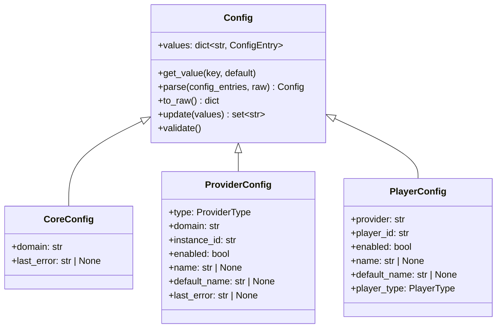

# Configuration and Persistence

The configuration system manages all persistent settings in Music Assistant — from server-level options to per-provider credentials to per-player audio tuning. It is the first controller initialized during startup, before anything else can run, because every other component depends on it for its settings. Persistence is split between a JSON config file (for settings) and SQLite databases (for the media library and cache).

## `ConfigController`

Defined in `music_assistant/controllers/config.py`, `ConfigController` is deliberately *not* a `CoreController` subclass — it has a simpler lifecycle because it must be available before the core controller infrastructure exists.

**Key responsibilities:**

- Owns the `settings.json` file (in `storage_path`)
- Provides a hierarchical `get(key)` / `set(key, value)` interface using `/`-separated key paths
- Manages encryption of sensitive values (passwords, tokens)
- Serves as the API surface for all config CRUD operations (`@api_command` decorated methods)
- Triggers provider/controller reloads when config changes require it

### JSON File I/O

Settings are stored in `{storage_path}/settings.json`. The controller loads the file on `setup()` and writes it back with a **debounced save** — `save()` schedules a write after `DEFAULT_SAVE_DELAY` (5 seconds) using `call_later`. Calling `save(immediate=True)` bypasses the debounce for critical writes. On shutdown, `close()` forces any pending save to flush.

The hierarchical key system means `self.get("providers/spotify_1/values/username")` traverses nested dicts:

```python
{
  "providers": {
    "spotify_1": {
      "values": {
        "username": "alice"
      }
    }
  }
}
```

## Config Hierarchy

Three config types serve different scopes. All inherit from `Config` (in `music_assistant_models.config_entries`), which provides `values: dict[str, ConfigEntry]`, `get_value()`, `parse()`, `to_raw()`, `update()`, and `validate()`.



### CoreConfig

Per-controller settings. One `CoreConfig` exists for each controller listed in `CONFIGURABLE_CORE_CONTROLLERS`:

```python
CONFIGURABLE_CORE_CONTROLLERS = (
    "discovery", "streams", "webserver", "players",
    "metadata", "cache", "music", "player_queues",
)
```

Each controller defines its own config entries via `get_config_entries()`. For example, the `streams` controller exposes bind IP/port settings; the `cache` controller offers a "clear cache" action.

### ProviderConfig

Per-provider-instance settings. Fields beyond `Config`:

| Field | Purpose |
|---|---|
| `type` | `ProviderType` (music, player, metadata, plugin) |
| `domain` | Provider domain (e.g. `"spotify"`) |
| `instance_id` | Unique instance ID (format: `{domain}--{shortuuid(8)}`, e.g. `spotify--aBcDeFgH`; single-instance providers may use just the domain) |
| `enabled` | Whether the instance is active |
| `name` / `default_name` | Custom or auto-generated display name |
| `last_error` | Persisted error message for UI display |

### PlayerConfig

Per-player settings. Fields beyond `Config`:

| Field | Purpose |
|---|---|
| `provider` | Instance ID of the owning player provider |
| `player_id` | Unique player identifier |
| `enabled` | Whether the player is active |
| `name` / `default_name` | Custom or auto-generated display name |
| `player_type` | `PlayerType` enum (player, stereo_pair, group, protocol) |

Player config values are organized into categories: `"generic"` (icon, visibility), `"playback"` (volume normalization, crossfade), `"protocol_generic"` (codec, sample rates, flow mode), `"announcements"` (TTS settings, volume strategy), and `"player_controls"` (power/volume/mute control sources).

## `ConfigEntry`: The Building Block

Every configurable setting is described by a `ConfigEntry` (from `music_assistant_models.config_entries`). This is a rich metadata model that drives the UI:

| Field | Type | Purpose |
|---|---|---|
| `key` | `str` | Identifier, also used as localization key |
| `type` | `ConfigEntryType` | `BOOLEAN`, `STRING`, `SECURE_STRING`, `INTEGER`, `FLOAT`, `LABEL`, `SPLITTED_STRING`, `DIVIDER`, `ACTION`, `ICON`, `ALERT` |
| `label` | `str` | Default display label |
| `default_value` | `ConfigValueType` | Default when no value is stored |
| `options` | `list[ConfigValueOption]` | Dropdown/select options |
| `range` | `tuple[int, int] \| None` | Min/max for numeric entries |
| `category` | `str` | UI grouping (e.g. `"playback"`, `"advanced"`) |
| `advanced` | `bool` | Hidden behind an "advanced" toggle in the UI |
| `hidden` | `bool` | Completely hidden from the UI |
| `required` | `bool` | Must have a value |
| `depends_on` | `str \| None` | Only visible when another entry has a value |
| `requires_reload` | `bool` | Changing this triggers a provider/controller reload |
| `multi_value` | `bool` | Allows selecting multiple values |

Types marked as `UI_ONLY` (`LABEL`, `DIVIDER`, `ACTION`, `ALERT`) are display-only elements — they don't store persistent values but provide structure and interactivity in the settings UI.

## Reusable Config Entries

`music_assistant/constants.py` defines an extensive library of pre-built `ConfigEntry` instances that providers compose their config from:

| Constant | Key | Purpose |
|---|---|---|
| `CONF_ENTRY_FLOW_MODE` | `flow_mode` | Queue flow-mode streaming toggle |
| `CONF_ENTRY_OUTPUT_CODEC` | `output_codec` | FLAC/MP3/AAC/WAV codec selection |
| `CONF_ENTRY_SAMPLE_RATES` | `sample_rates` | Supported sample rate/bit depth combinations |
| `CONF_ENTRY_HTTP_PROFILE` | `http_profile` | HTTP streaming profile (chunked, no content-length, forced content-length) |
| `CONF_ENTRY_VOLUME_NORMALIZATION` | `volume_normalization` | EBU-R128 volume normalization toggle |
| `CONF_ENTRY_VOLUME_NORMALIZATION_TARGET` | `volume_normalization_target` | Target loudness level (-30 to -5 LUFS) |
| `CONF_ENTRY_SMART_FADES_MODE` | `smart_fades_mode` | Crossfade mode selection |
| `CONF_ENTRY_ANNOUNCE_VOLUME_STRATEGY` | `announce_volume_strategy` | How to adjust volume for announcements |

The pattern: providers declare their config as a combination of these shared entries (possibly with overridden defaults via `ConfigEntry.from_dict()`) plus provider-specific entries returned by the module's `get_config_entries()` function. The `ConfigController.get_provider_config_entries()` method assembles the full list, prepending `DEFAULT_PROVIDER_CONFIG_ENTRIES` (which currently contains only `CONF_ENTRY_LOG_LEVEL`).

## Config Change Propagation

When a config value is updated (via the API's `save_provider_config` or `save_player_config`):

1. `Config.update(values)` compares new values against current ones, returns a `set[str]` of changed keys (prefixed with `values/` for value entries, bare for root fields like `enabled` or `name`).
2. If keys changed, the controller/provider's `update_config(config, changed_keys)` is called.
3. The controller/provider's `update_config` determines whether a reload is needed:
   - **`CoreController`**: checks if any changed entry has `requires_reload=True`. If so, schedules a reload via `call_later(1, self.reload, ...)` — the 1-second debounce prevents rapid-fire reloads when multiple settings change at once.
   - **`Provider`**: reloads on *any* non-log-level `values/*` change, without consulting `requires_reload`. This is because provider reloads are lightweight (unload + re-load) and most providers cache config values at setup time.
4. Log level changes (`values/log_level`) are applied immediately without a reload in both cases.

For providers, reloading means unloading and re-loading the provider instance (calling `mass.load_provider_config`). For core controllers, it means calling `close()` then `setup()` again.

## Encryption

Sensitive config values (passwords, API tokens) use the `SECURE_STRING` config entry type and are encrypted at rest:

- **Algorithm**: Fernet symmetric encryption (from the `cryptography` library)
- **Key derivation**: The first 32 bytes of the server's unique ID (`CONF_SERVER_ID`, a UUID hex string generated on first run) are base64-encoded to produce the Fernet key
- **Storage convention**: values with `ConfigEntryType.SECURE_STRING` are encrypted via `ENCRYPT_CALLBACK` before writing to `settings.json` and decrypted via `DECRYPT_CALLBACK` when read via `Config.get_value()`
- **API safety**: `Config.__post_serialize__()` replaces all `SECURE_STRING` values with the constant `SECURE_STRING_SUBSTITUTE` before serializing for API responses — clients never receive the encrypted (or decrypted) value, only a placeholder. They can only *set* new values.
- **Legacy handling**: The `ENCRYPT_SUFFIX` pattern in `constants.py` is used to identify encrypted values during migration.

## SQLite Databases

Two SQLite databases handle structured persistent data, managed through the `DatabaseConnection` class in `music_assistant/helpers/database.py`.

### Library Database (`library.db`)

Located in `storage_path`, this is the primary data store for the media library:

| Table constant | Table name | Content |
|---|---|---|
| `DB_TABLE_ARTISTS` | `artists` | Artist records |
| `DB_TABLE_ALBUMS` | `albums` | Album records |
| `DB_TABLE_TRACKS` | `tracks` | Track records |
| `DB_TABLE_PLAYLISTS` | `playlists` | Playlist records |
| `DB_TABLE_RADIOS` | `radios` | Radio station records |
| `DB_TABLE_AUDIOBOOKS` | `audiobooks` | Audiobook records |
| `DB_TABLE_PODCASTS` | `podcasts` | Podcast records |
| `DB_TABLE_PROVIDER_MAPPINGS` | `provider_mappings` | Links library items to provider-specific IDs |
| `DB_TABLE_ALBUM_TRACKS` | `album_tracks` | Album ↔ track relationships |
| `DB_TABLE_TRACK_ARTISTS` | `track_artists` | Track ↔ artist relationships |
| `DB_TABLE_ALBUM_ARTISTS` | `album_artists` | Album ↔ artist relationships |
| `DB_TABLE_PLAYLOG` | `playlog` | Playback history |
| `DB_TABLE_LOUDNESS_MEASUREMENTS` | `loudness_measurements` | EBU-R128 loudness analysis results |
| `DB_TABLE_SMART_FADES_ANALYSIS` | `smart_fades_analysis` | Beat detection / crossfade analysis |
| `DB_TABLE_GENRES` | `genres` | Genre taxonomy |
| `DB_TABLE_GENRE_MEDIA_ITEM_MAPPING` | `genre_media_item_mapping` | Genre ↔ media item links |
| `DB_TABLE_GENRE_MEDIA_ITEM_EXCLUSION` | `genre_media_item_exclusion` | User-excluded genre ↔ media item pairs |
| `DB_TABLE_THUMBS` | `thumbnails` | Cached image thumbnails |

The library database is covered in more detail in [08-media-library.md](08-media-library.md).

### Cache Database (`cache.db`)

Located in `cache_path`, managed by `CacheController`:

| Table | Purpose |
|---|---|
| `cache` | Key-value store with expiration, provider grouping, category, checksums, and a `persistent` flag |
| `settings` | Schema version tracking |

### `DatabaseConnection`

The `DatabaseConnection` class wraps `aiosqlite` with convenience methods (`get_rows`, `get_row`, `insert`, `update`, `delete`, `upsert`, `search`, `iter_items`, `vacuum`). On setup, it configures SQLite for performance:

```sql
PRAGMA analysis_limit=10000;
PRAGMA locking_mode=exclusive;
PRAGMA journal_mode=WAL;
PRAGMA journal_size_limit=6144000;
PRAGMA synchronous=normal;
PRAGMA temp_store=memory;
PRAGMA mmap_size=30000000000;
PRAGMA cache_size=-64000;
```

These settings trade durability for speed — appropriate for a music library where data can always be re-synced from providers. On close, `PRAGMA optimize` is called to update query planner statistics.

The class also supports list parameters in queries: a list value in `params` is automatically expanded to `(:_param_0, :_param_1, ...)` SQL syntax via the `query_params` helper.

## `CacheController`

The `CacheController` (`music_assistant/controllers/cache.py`) provides a two-tier caching system:

1. **Memory cache** (`MemoryCache`): An LRU `OrderedDict` limited to 500 entries. Checked first on reads.
2. **Database cache** (`cache.db`): SQLite-backed, with expiration timestamps. Items with expiration under 30 minutes are memory-only (not persisted to DB).

**Cache operations:**

| Method | Behavior |
|---|---|
| `get(key, provider, category, checksum)` | Check memory → check DB → return `default` |
| `set(key, data, expiration, provider, category)` | Write to memory; write to DB if expiration > 30 min |
| `delete(key, category, provider)` | Remove from both tiers |
| `clear(key_filter, category_filter, provider_filter)` | Bulk delete with optional filters |

The `BYPASS_CACHE` context variable allows callers to temporarily skip cache reads (used during forced refreshes). The `@use_cache` decorator wraps provider methods to automatically cache their results with configurable expiration.

**Maintenance:** A daily cleanup task (scheduled at 4:00 AM local time) scans for and removes expired entries. The database is also checked for excessive size (> 2 GB) on startup — if exceeded, the entire cache DB is deleted and recreated.

## Key Files

| File | What to look at |
|---|---|
| [`music_assistant/controllers/config.py`](../../music_assistant/controllers/config.py) | `ConfigController` — JSON file I/O, get/set, provider/player/core config CRUD, encryption (~2106 lines) |
| [`music_assistant/controllers/cache.py`](../../music_assistant/controllers/cache.py) | `CacheController` — two-tier cache, `@use_cache` decorator, `MemoryCache` |
| [`music_assistant/helpers/database.py`](../../music_assistant/helpers/database.py) | `DatabaseConnection` — SQLite abstraction, PRAGMA setup, query helpers |
| [`music_assistant/constants.py`](../../music_assistant/constants.py) | Config keys (`CONF_*`), DB table names (`DB_TABLE_*`), reusable `ConfigEntry` instances (`CONF_ENTRY_*`) |
| `music_assistant_models/config_entries.py` | `ConfigEntry`, `Config`, `CoreConfig`, `ProviderConfig`, `PlayerConfig`, `ConfigValueType` |
