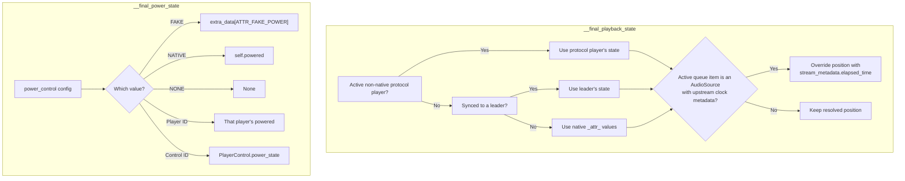

# The Player Abstraction

The `Player` class in `music_assistant/models/player.py` (~3650 lines) is the most complex single model in the codebase. It represents a physical or virtual audio device — managing raw provider state, computing derived "final" values, snapshotting state for the API, and providing the abstract control surface that every player provider must implement. Its design is modeled after Home Assistant's Entity model, using class-level `_attr_*` attributes with matching `@property` accessors to let providers report state while the framework adds computed overrides on top.

The [Player Controller README](../../music_assistant/controllers/players/README.md) is the in-tree companion to this document: it owns the module inventory, the protocol-linking developer guide, and the identifier-matching rules. This document covers the model's semantics and the resolution chains that produce `PlayerState`.

## The `_attr_*` Pattern

Providers set `_attr_*` class attributes to report device state. Public `@property` accessors expose these values read-only. The pattern: a provider's `Player` subclass mutates `_attr_volume_level = 75`, then calls `update_state()`, and the framework reads `self.volume_level` during state calculation. The `@property` methods are thin passthroughs — the real complexity lives in the `__final_*` computed properties that layer overrides on top (see below).

### Attribute Groups

**Identity and type:**

| `_attr_*` | Property | Description |
|---|---|---|
| `_attr_type: PlayerType` | `type` | PLAYER, PROTOCOL, GROUP, or STEREO_PAIR |
| `_attr_name: str \| None` | `name` | Provider-reported name |
| `_attr_supported_features: set[PlayerFeature]` | `supported_features` | Native capabilities |
| `_attr_available: bool` | `available` | Whether the device is reachable |

**Playback state:**

| `_attr_*` | Property | Description |
|---|---|---|
| `_attr_playback_state: PlaybackState` | `playback_state` | IDLE, PLAYING, PAUSED |
| `_attr_powered: bool \| None` | `powered` | Power on/off |
| `_attr_elapsed_time: float \| None` | `elapsed_time` | Current track position |
| `_attr_elapsed_time_last_updated: float \| None` | `elapsed_time_last_updated` | Timestamp of last position report |

**Volume and mute:**

| `_attr_*` | Property | Description |
|---|---|---|
| `_attr_volume_level: int \| None` | `volume_level` | 0–100 |
| `_attr_volume_muted: bool \| None` | `volume_muted` | Mute state |

**Group membership:**

| `_attr_*` | Property | Description |
|---|---|---|
| `_attr_group_members: list[str]` | `group_members` | Player IDs of group children |
| `_attr_static_group_members: list[str]` | `static_group_members` | Permanent group members |
| `_attr_can_group_with: set[str]` | `can_group_with` | Compatible player IDs |

Note: `synced_to` is *not* an `_attr_*` — it is computed by scanning `group_members` across players on the same provider. GROUP players (sync groups, universal groups) override it to always return `None`. For non-GROUP players, `group_members` is non-empty during ad-hoc sync — the sync leader lists all synced children including itself. See [06-grouping.md](06-grouping.md) for the three grouping models and how these properties interact.

**Device info and identifiers:**

| `_attr_*` | Property | Description |
|---|---|---|
| `_attr_device_info: DeviceInfo` | `device_info` | Model, manufacturer, identifiers |

**Source and media:**

| `_attr_*` | Property | Description |
|---|---|---|
| `_attr_active_source: str \| None` | `active_source` | Currently selected source |
| `_attr_current_media: PlayerMedia \| None` | `current_media` | Now-playing metadata |
| `_attr_source_list: list[PlayerSource]` | `source_list` | Available sources |
| `_attr_active_sound_mode: str \| None` | `active_sound_mode` | Selected sound mode |
| `_attr_sound_mode_list: list[PlayerSoundMode]` | `sound_mode_list` | Available sound modes (via `UniqueList`) |
| `_attr_options: list[PlayerOption]` | `options` | Player-specific options (via `UniqueList`) |
| `_attr_current_palette` / `_attr_current_palette_url` | *(read via `_resolved_palette()`)* | Color palette for the currently shown image — see [Palette Resolution](#palette-resolution) |

**Audio output capabilities:**

| `_attr_*` | Property | Description |
|---|---|---|
| `_attr_supported_sample_rates: list[tuple[int, int]] \| None` | `supported_sample_rates` | `(sample_rate, bit_depth)` pairs the device natively accepts. `None` defers to the user's `CONF_SAMPLE_RATES` selection; `get_supported_sample_rates()` resolves it to a non-`None` list, falling back to `[(44100, 16)]`. `declares_supported_sample_rates` tells the config controller whether to inject the generic sample-rate entry |
| `_attr_underlying_player_id: str \| None` | `underlying_player_id` | For a *derived* protocol player (e.g. a Sendspin bridge riding inside an AirPlay session), the player it runs on top of. Lets protocol linking resolve the parent from an explicit edge instead of identifier matching. See [05-protocol-linking.md](05-protocol-linking.md) |

**Polling:**

| `_attr_*` | Property | Description |
|---|---|---|
| `_attr_needs_poll: bool` | `needs_poll` | Whether the controller should poll this player |
| `_attr_poll_interval: int` | `poll_interval` | Seconds between polls |

**UI defaults:**

| `_attr_*` | Property | Description |
|---|---|---|
| `_attr_hidden_by_default: bool` | `hidden_by_default` | Hidden in UI initially |
| `_attr_expose_to_ha_by_default: bool` | `expose_to_ha_by_default` | Exposed to Home Assistant initially |
| `_attr_enabled_by_default: bool` | `enabled_by_default` | Enabled on first registration |
| `_attr_needs_setup: bool` | `needs_setup` | Player needs user setup before use |
| `_attr_setup_reason: str \| None` | `setup_reason` | Translatable slug explaining *why* setup is needed |

## Setup Flows

A device can be reachable on the network and still be unusable — an AirPlay receiver that has not been paired, an MPD instance that wants a password. `needs_setup` marks that state, and several members build on it:

| Member | Kind | Meaning |
|---|---|---|
| `needs_setup` | property (overridable) | The player cannot be used until the user completes setup. A player reporting `True` is serialized with `available=False` |
| `setup_reason` | property (overridable) | Short translatable slug shown next to the "setup required" indicator (`"pairing_required"`, `"password_required"`, …). `None` when there is no specific reason |
| `available_for_playback` | `@final` property | `available and not needs_setup`. This — not plain `available` — is what output-protocol selection and command routing check, so an unpaired receiver is never picked as an output or a command target |
| `implements_setup_flow` | `@final` property | Whether the subclass overrides `run_setup_flow()` |
| `has_setup_flow` | `@final` property | Whether a flow can be started *at all*: either this player implements one, or it wraps a non-native protocol child that does. Unlike `needs_setup` this stays `True` after setup completes, so the UI can offer to re-run a pairing step the user skipped |

Providers implement the interaction itself in `async run_setup_flow(session: SetupSession)`. The flow is started through the config controller's `setup_player(player_id)`, which runs the player's own flow when it has one and otherwise delegates to a protocol child (prompting the user to choose when more than one child qualifies). Values the flow collects live in the player's `setup_data`, written with `_update_setup_data()` and read back with `get_setup_value()` — strings are encrypted at rest and decrypted transparently. See [02-configuration.md](02-configuration.md) for the flow engine and [15-provider-lifecycle.md](15-provider-lifecycle.md) for where setup sits in the load sequence.

`setup_reason` and `has_setup_flow` are both carried on `PlayerState`, so clients can render the indicator and the "run setup" affordance without a second round trip.

## `Player` (Runtime) vs `PlayerState` (API Snapshot)

Two classes work together to separate mutable internal state from the snapshots consumed by API clients:

- **`Player`** (in `music_assistant/models/player.py`) — the live, mutable model. Providers set `_attr_*` values, the controller calls command methods, and `__final_*` properties compute derived state. Its own attributes are never exposed to the API.

- **`PlayerState`** (aliased from `music_assistant_models.player.Player`) — a plain dataclass holding the resolved snapshot. Created by `update_state()` and exposed via the `state` property. This is what goes over the WebSocket to clients; `Player.to_dict()` simply forwards to `state.to_dict()`. It is a snapshot by convention rather than by enforcement — the controller mutates one field on it directly, setting `available = False` on a temporary unregister so clients see the player go away without a recalculation.

```python
from music_assistant_models.player import Player as PlayerState
```

### The `state` Property

Returns `self._state` — the last snapshot produced by `update_state()`. The initial `_state` is constructed in `__init__` from whatever the subclass has set so far (`player_id`, `provider`, `type`, `name`, `available`, `device_info`, `supported_features`, `playback_state`), so `state` is safe to read before the first real calculation. Registration immediately calls `update_state(signal_event=False)` to replace it with a fully resolved snapshot.

### The Caching Mechanism

Expensive derived properties use `@cached_property` from the `propcache` library, which stores computed values in `self._cache` (a plain dict). `update_state()` invalidates the cache at the top of every call so both the input probe and any recalculation read fresh values — but the invalidation is **selective**:

```python
_CONFIG_CACHED_PROPS = frozenset({"hide_in_ui", "expose_to_ha"})
```

These two are derived purely from config, which only changes through `set_config()`. That method clears the cache *unconditionally* (config feeds many other cached values too) and marks the state dirty, so the config-derived entries stay correct while surviving the far more frequent per-update invalidation. Everything else — including cached properties defined by provider subclasses — is dropped on every `update_state()` call.

`icon` is deliberately **not** in this set (#5521): it falls back to `default_icon`, which calls `get_default_player_icon(player_type, provider_domain, manufacturer, model)` in `helpers/player.py` — so the icon depends on live device attributes rather than on config alone, and must be recomputed like any other derived value. That helper resolves in order: group and stereo-pair types first, then a per-provider default (`airplay` → `airplay`, `sonos` → `sonos`, `wiim` → `wiim`, …), then a per-player-type default (`DISPLAY` → `monitor`, `LIGHT` → `sun`, `SOURCE` → `vinyl`, `VISUALIZER` → `monitor`), then substring matches against manufacturer and model (`homepod`, `apple tv`, `nest audio`, `voice pe`, `soundbar`, `carplay`, …).

## Change Detection

`update_state()` runs on every provider state report and on a 1-second polling tick for playing players, so it is a hot path. Three mechanisms (all from #4579, "Make player state change detection exact and cheap") keep it cheap without letting a real change slip through:

**Input snapshot.** `__collect_input_snapshot()` builds a flat dict of everything the player *itself* contributes to its state: the `_attr_*` values and provider-overridable properties, the fake-control entries in `extra_data`, the protocol-linking fields, the active MA source, and the sleep timer. When the snapshot is unchanged and the state is not dirty, `update_state()` returns immediately without computing a single `__final_*` property. The snapshot deliberately excludes the playback-position anchors, which are tracked separately (see below). It also skips probing `synced_to` unless the subclass overrides it — the base implementation derives it by scanning sibling players, which is cross-player state and therefore covered by dirty-marking instead.

**Dirty marking.** `mark_state_dirty()` forces the next `update_state()` to recalculate in full. It must be called whenever state the player *derives from* changes outside its own attributes — group topology, linked protocol players, the active queue. Core code does not normally call it directly: the controller marks players dirty on `trigger_player_update()` and throughout the state fan-out, and `refresh_state()` is the convenience shorthand for `mark_state_dirty()` + `update_state()`. The flag starts out `True` so the first update always calculates.

**State fingerprint.** `_state_fingerprint()` flattens a `PlayerState` into a dict of immutable leaf values, and the diff between the previous and new fingerprint *is* the `changed_values` dict. This replaces recursive dataclass diffing and avoids deep-copying the previous state graph, which matters because `PlayerState` references some values live (`extra_attributes`, `device_info`) — freezing them into the fingerprint keeps the comparison valid. Noise filtering happens inside the fingerprint rather than as a post-pass: `extra_attributes.seq_no` and `extra_attributes.last_poll` are skipped outright, and the player's own `elapsed_time` / `elapsed_time_last_updated` are deliberately absent because `current_media` holds the final calculated position and is the only position that is event-relevant.

### Position Anchors

A playback position is stored as an *anchor*: a `(position, timestamp)` pair that consumers extrapolate from. Under steady playback a freshly reported anchor extrapolates to (nearly) the same corrected position as the previous one, so adopting it would produce a state change every tick for no new information.

`_reconcile_position_anchor()` compares the two anchors by extrapolating both to *now* (only while playing) and keeps the previous anchor unless the corrected positions differ by more than `POSITION_JUMP_THRESHOLD` (1.0 second), which indicates a seek or a buffer correction rather than normal progression. `__reconcile_current_media_anchor()` applies this to the newly calculated `current_media`, with two exceptions: a different item (by `queue_item_id` or `uri`) adopts the new anchor as-is, and players that *mirror* another player's media — grouped or synced members, protocol children — share the owner's `PlayerMedia` object, which the owner already reconciled, so they only report the jump and never mutate the shared object.

When a jump is detected, `update_state()` calls `mass.players.on_player_position_jumped(self)`. That is not an event by itself; it re-bases the active queue's timing on the fresh position and nudges related players, and the follow-up update emits the actual state change.

### `MEDIA_IDENTITY_KEYS`

Changes to any of these fingerprint keys fire the debounced `on_player_media_updated()` callback (1 second, deduplicated per player via `task_id`), which providers override to push now-playing information to a device display. The set is defined in `models/player.py` alongside `Player`, not in the shared `constants.py`:

```python
MEDIA_IDENTITY_KEYS = frozenset({
    "current_media", "current_media.uri", "current_media.title",
    "current_media.source_id", "current_media.queue_item_id",
    "current_media.image_url", "current_media.duration",
    "current_media.palette",
})
```

`palette` is in the set because it resolves *asynchronously*, shortly after a track change — a player pushing colors to its display needs a second callback once the palette lands.

### Palette Resolution

`PlayerMedia.palette` carries the color palette extracted from the now-playing image. Extraction is async and cache-backed, but state serialization is synchronous, so the value is carried on the player: the controller resolves the palette in a background task and calls `set_resolved_palette(image_url, palette)`, and `_resolved_palette(image_url)` hands it back during calculation only when the URL still matches. Players that mirror a parent's media are skipped entirely — resolving per member would be wasted work and would emit duplicate updates across the group. See [14-metadata.md](14-metadata.md) for extraction and caching.

## `update_state()` Pipeline

`update_state(force_update=False, signal_event=True)` is the central state recalculation method. It is called by providers after changing `_attr_*` values, by the controller after config changes, and internally after protocol link changes. The pipeline:

1. **Thread check** — `self.mass.verify_event_loop_thread` ensures we are on the event loop.
2. **Selective cache invalidation** — drops every `@cached_property` value except `_CONFIG_CACHED_PROPS`.
3. **Input probe** — `__collect_input_snapshot()`. If the snapshot matches the last one, the state is not dirty, no own position anchor moved, and `force_update` is `False`, return immediately.
4. **Record inputs** — clear the dirty flag, store the new snapshot and the current position anchors.
5. **`__calculate_player_state()`** — build a new `PlayerState` and diff its fingerprint against the previous one. Returns `(changed_values, position_jumped, media_position_jumped)`.
6. **Media change detection** — if any `MEDIA_IDENTITY_KEYS` key changed, schedule the debounced `on_player_media_updated()`.
7. **Config persistence** — if the provider-reported `default_name` or `player_type` changed, persist to config.
8. **Position correction** — if `position_jumped` and `signal_event`, call `mass.players.on_player_position_jumped(self)`.
9. **Early exit** — if nothing changed and not `force_update`, return.
10. **Signal** — call `mass.players.signal_player_state_update(self, changed_values, media_position_jumped=...)`.

`force_update=True` forces a recalculation past the early exit at step 3, but an update event still only fires when the recalculated state actually differs — or when `signal_player_state_update` is itself called with `force_update`.

### `__calculate_player_state()`

Reads every `__final_*` property plus `display_name`, `sound_mode_list`, `output_protocols`, the control strings, and the setup/sleep-timer fields, and constructs a new `PlayerState(...)`. Notable details:

- `available = self.enabled and self.available and not self.needs_setup` — enabled, reachable, *and* set up.
- Group, sync, media, source, and feature fields all come from the `__final_*` resolution chains below.
- Idle transitions are tracked for `stop_called`, and when playback goes to IDLE it schedules `set_active_mass_source(None)` after 5 seconds to clear the active MA source (cancelled by the shared `task_id` if playback resumes first).
- After the fingerprint diff, two keys are collapsed to carry real objects rather than fingerprint leaves: `current_media` (when media appeared or disappeared, its `current_media.*` leaf keys are removed in favor of the single top-level key holding the old and new `PlayerMedia`) and `options` (which the `PLAYER_OPTIONS_UPDATED` event consumes directly).

## `__final_*` Computed Properties

These `@cached_property @final` methods compute the "effective" value of each player attribute by layering overrides from player controls, sync groups, active output protocols, and config. The controller and API consumers never see raw `_attr_*` values — they see these resolved values via `PlayerState`.

### Resolution Chains



**A note on power**: Power (`_attr_powered: bool | None`) is an abstraction that means different things depending on the player. For physical players with native support, it represents actual hardware on/off state. For always-on network speakers (Chromecast, AirPlay endpoints), "fake" power provides a UI toggle that gates playback without affecting hardware. For group players, power controls member activation — powering on a group captures its members, powering off releases and stops them — but group players only advertise `PlayerFeature.POWER` at all once the user has explicitly assigned fake power control, since the session lifecycle otherwise forms and dissolves the group on its own. A value of `None` means the power state is unknown or the player has no power concept (`power_control == NONE`). The `PlayerFeature.POWER` flag in `__final_supported_features` is dynamically added or removed based on the `power_control` config, so a player without native power support can still gain a power toggle through fake or delegated power. See [04-player-controller.md](04-player-controller.md#power-management) for command routing and [06-grouping.md](06-grouping.md#power-across-the-three-models) for how group players use power.

**A note on volume and mute**: Volume (`volume_control` property) and mute (`mute_control` property) follow the same control-chain pattern as power. `NATIVE` means the player handles volume/mute in hardware or firmware. `FAKE` means MA simulates the control in software — for volume, the level is stored in `extra_data` and used for DSP-based software volume or group volume calculations; for mute, the current volume is saved, set to 0, and restored on unmute. `NONE` means the control is disabled. A player or control ID delegates to another entity (e.g., a Chromecast protocol player that can always adjust volume even when not actively streaming). The auto-select logic prefers native support, then falls back to a linked protocol player, then `NONE`. The `PlayerFeature.VOLUME_SET` and `PlayerFeature.VOLUME_MUTE` flags in `__final_supported_features` are dynamically added or removed based on this resolution. The **mute lock** mechanism (see [07-volume.md](07-volume.md#the-mute-lock-mechanism)) records that a player inside a group was muted deliberately, so a group volume change cannot silently undo it. See [04-player-controller.md](04-player-controller.md#volume-routing) for command routing and [07-volume.md](07-volume.md) for the full volume architecture.

| Property | Returns | Resolution priority (highest → lowest) |
|---|---|---|
| `__final_playback_state` | `tuple[PlaybackState, elapsed, timestamp]` | Active protocol player → sync leader → native `_attr_*`, then an **upstream-clock override** — see below |
| `__final_power_state` | `bool \| None` | `power_control` config: FAKE → NATIVE → NONE → external `PlayerControl`. After #3659 `power_control` never auto-selects a protocol player. See [`power_control` Degradation](#power_control-degradation) for the `NATIVE` → `NONE` fallback |
| `__final_volume_level` | `int \| None` | `volume_control` config: FAKE (logical, unscaled) → NATIVE → NONE (`None`, no scaling) → delegate player → delegate PlayerControl → **fallback: native**. Every branch that returns a numeric level (not FAKE, not NONE) runs the value through `scale_volume_from_device()` to convert the device range back to logical 0–100 |
| `__final_volume_muted_state` | `bool \| None` | `mute_control` config: FAKE → NATIVE → NONE → delegate player → delegate PlayerControl → **fallback: native** |
| `__final_active_group` | `str \| None` | PROTOCOL type → None. Else: scan GROUP players that *capture* this player — see [Active Group Resolution](#active-group-resolution) |
| `__final_current_media` | `PlayerMedia \| None` | Parent preference **`active_group or synced_to`** → protocol parent → active queue (stream metadata → media item → bare queue item) → native `_attr_current_media`. An active queue with no current item resolves to `None` rather than falling through |
| `__final_source_list` | `list[PlayerSource]` | PROTOCOL → native only. Else: native sources, a synthesized "Music Assistant Queue" source (id = `player_id`) when the player does not already list one, the live source session if there is one, then standing entries for plugin sources bound to this player. See [below](#source-list-composition) |
| `__final_group_members` | `list[str]` | If synced → empty. Else: native members (protocol IDs translated to visible parents), merged with active protocol's members. Non-GROUP with only self → empty |
| `__final_synced_to` | `str \| None` | Native `synced_to` (mapped through protocol parent) → linked protocol's `synced_to` (resolved to visible parent) |
| `__final_supported_features` | `set[PlayerFeature]` | Native features + `ACTIVE_PROTOCOL_FEATURES` from active protocol + `PROTOCOL_FEATURES` from all linked protocols ± power/volume/mute adjusted by control config; `PlayerFeature.SELECT_SOURCE` is auto-added when the final source list has at least two non-passive entries (#3789) |
| `__final_can_group_with` | `set[str]` | If synced → empty. Else: expanded native set (translated to visible) + linked protocol group sets (if no external source active) |
| `__final_active_source` | `str \| None` | Parent preference **`synced_to or active_group`** (inverted vs current media) → protocol parent → `__active_mass_source` (unless the player reports a source in `EXTERNAL_SOURCES`) → native `active_source` (only when it differs from `player_id`, playback is not IDLE, and no non-native output protocol is active) → fallback to `__active_mass_source` or `player_id` |

The inverted parent order between `__final_current_media` (`active_group` first) and `__final_active_source` (`synced_to` first) is intentional. When a player is both synced and captured by a group, media must follow the group session, while source identity prefers the sync relationship — matching how sync-group state delegation avoids circular `.state` reads (see [06-grouping.md](06-grouping.md#state-delegation)).

### The Upstream-Clock Override

Whichever of the three branches supplies `__final_playback_state`, the resolved position is overridden when the player has its own [live `AudioSource` session](04-player-controller.md#live-audiosource-sessions) whose `stream_metadata` reports an `elapsed_time` — a Spotify Connect, AirPlay, or Yandex Ynison session reporting the *source's* logical position.

The reason is that the position the protocol player or the player itself reports tracks **bytes consumed**, which is the wrong clock for a live plugin source: it loses upstream seeks and upstream pause/resume on the queue's `corrected_elapsed_time`, which both the player queues controller and several player providers consume.

The override is gated on the player *owning* the source rather than merely hearing it: it is skipped when the player is synced (`__final_synced_to`), captured by a group (`__final_active_group`), or is a PROTOCOL player with a parent. Those players mirror their owner's media, which the owner has already corrected — so applying the upstream clock again would fight the value they inherit. Looking the session up by `player_id` is what makes this a single check; it used to require inspecting the active queue item and testing a GROUP player twice.

### Active Group Resolution

`__final_active_group` answers "is some group player currently *holding* this player?", which determines whether commands aimed at the player get redirected to the group. Note the test is **not** "is the group playing or paused":

- PROTOCOL players always resolve to `None` — they follow their parent's group state.
- For every other GROUP player, the **raw** `powered` attribute is read rather than `state.powered`. A group's own `power()` sets `_attr_powered` directly, while `state.powered` routes through `__final_power_state` and can be `None` for `power_control == NONE` even while the group is actively capturing members.
- `powered is False` — an explicit power-off — never captures.
- Otherwise the group must either be explicitly powered on, or report `is_active_session == True`.
- Finally, this player must appear in the group's `state.group_members`.

`is_active_session` is a property on `Player` that returns `False` by default; group implementations override it to report whether they are holding their members right now. A sync group returns `True` while a sync leader is set, while the idle grace timer is pending, or while a debounced re-form is pending; a universal group returns `True` while its multicast stream is live or its idle grace timer is pending. [06-grouping.md](06-grouping.md) owns the session lifecycle.

### Source List Composition

`__final_source_list` assembles up to four kinds of entry, in order, and the order encodes a precedence rule:

1. **Native sources** the provider reports.
2. **The Music Assistant Queue** — synthesized with `id = player_id` when the player does not already list it, with `can_seek` / `can_next_previous` reflecting whether the queue is actually running.
3. **The live session**, if the player has one. Built from `session.source_uri` and carrying the source's capability flags (`can_play_pause`, `can_seek`, `can_next_previous`, `can_shuffle`, `can_repeat`) plus the `shuffle_enabled` / `repeat_mode` the *session* reports — so a client can render the current ordering without a queue to read it from. `passive` is the inverse of `can_initiate`.
4. **Standing plugin entries** — every `AudioSource` a plugin has bound to this player via `PluginProvider.get_player_audio_sources(player_id)` (#6026, #6042, #6070). These exist so a player's own Spotify Connect or line-in is selectable from the source menu *before* any session is active.

A URI already present is skipped, which is why the live session is added before the standing entries: both describe the same source, but only the session knows the live shuffle/repeat state, so it must win.

Two additional computed properties are included in `PlayerState` but are not `__final_*` prefixed:

| Property | Returns | Description |
|---|---|---|
| `group_volume` | `int \| None` | No group members → own `volume_level` (or `None` when `volume_control == NONE`). With members → **max** of powered members' volume (the slider acts as a master fader for the loudest speaker). See [07-volume.md](07-volume.md) |
| `group_volume_muted` | `bool \| None` | No group members → own `volume_muted` (or `None` when `mute_control == NONE`). With members → `True` if all powered members muted, `False` if all unmuted, `None` if mixed (some muted, some not) or no members support mute. See [07-volume.md](07-volume.md) |

Both aggregate over `iter_group_members(self, only_powered=True, exclude_self=self.type != PlayerType.PLAYER)`. That `exclude_self` expression matters: for a dedicated GROUP player the group entity is a virtual container with no audio of its own, so it is excluded — but for a `PlayerType.PLAYER` acting as an **ad-hoc sync leader**, the leader is a real speaker that is part of the sound, so it *is* included in the max and in the all-muted/all-unmuted decision. Members whose own `volume_control` / `mute_control` is `NONE`, or whose value is unknown, are skipped either way.

### The `follow_protocol` Sentinel

`PLAYER_CONTROL_PROTOCOL` (`"follow_protocol"`, in `music_assistant/constants.py`) is the config value that means *"resolve this control automatically, following whichever protocol can handle it"*. It is offered as an option for `CONF_VOLUME_CONTROL` and `CONF_MUTE_CONTROL` when the player has no native control of its own but a linked protocol player does, and it becomes the entry default in that case — the default is the first non-disabled option, so `NATIVE` wins whenever the player supports it.

Inside `volume_control` and `mute_control`, `follow_protocol` — along with the legacy `"auto"` value — is what *skips* the explicit-target branch: any other non-sentinel value is treated as a concrete protocol player ID or `PlayerControl` ID and resolved directly. Falling past the sentinel check reaches the auto-select logic: native support first, then `_get_protocol_player_for_feature(..., require_active=False)`, then `NONE`.

### `power_control` Degradation

`power_control` has no `follow_protocol` option — power is not delegated to protocol players (see the #3659 note in [04-player-controller.md](04-player-controller.md#power-management)); its config entry offers only `NATIVE`, `FAKE`, `NONE`, and external `PlayerControl` IDs. It does, however, **degrade**: a configured `NATIVE` is downgraded to `NONE` when `PlayerFeature.POWER` is no longer in `supported_features`.

Sync groups are the motivating case. They advertise `POWER` only while the user has assigned fake power control, so a group that had native power and then lost the feature would otherwise keep a `NATIVE` control pointing at a `power()` implementation it no longer offers. See [06-grouping.md](06-grouping.md) for the group side of this.

### Feature Sets from Protocols

Two constant sets in `music_assistant/constants.py` control which features "flow through" from linked protocols:

- **`PROTOCOL_FEATURES`** — copied from *any* linked protocol (active or not): `PLAY_ANNOUNCEMENT`, `SET_MEMBERS`
- **`ACTIVE_PROTOCOL_FEATURES`** — copied only from the *active* output protocol: everything in `PROTOCOL_FEATURES` plus `ENQUEUE`, `GAPLESS_PLAYBACK`, `MULTI_DEVICE_DSP`, `PAUSE`

## PlayerType Taxonomy

The `PlayerType` enum (from `music_assistant_models.enums`) has nine members. The four that carry playback behaviour:

| Type | Description | UI visibility | Protocol linking role |
|---|---|---|---|
| `PLAYER` | Native vendor device (Sonos, HomePod) | Visible | Can be a protocol parent |
| `PROTOCOL` | Generic protocol endpoint (AirPlay on a Samsung TV) | **Hidden** | Linked to a parent (native or universal) |
| `GROUP` | Multi-speaker sync group | Visible | **Excluded** from protocol linking |
| `STEREO_PAIR` | Two speakers acting as one | Visible | **Excluded** from protocol linking |

The rest describe devices that are not speakers, and exist so the UI can represent them sensibly (they mainly drive [default icon selection](#the-caching-mechanism)):

| Type | Description |
|---|---|
| `DISPLAY` | A screen rather than a speaker |
| `LIGHT` | A light that participates in playback (Hue Entertainment) |
| `SOURCE` | An input rather than an output — a capture-only Sendspin client (#5889) |
| `VISUALIZER` | A visualizer sink, such as the Milkdrop plugin |
| `UNKNOWN` | Fallback |

`SOURCE` and `UNKNOWN` are excluded from `_expand_can_group_with`: neither is something a user can group audio onto.

**Code paths branching on type:**

- **`synced_to`**: Returns `None` for GROUP (groups are not "synced to" in the leader/follower sense)
- **`is_native_player`**: Excludes PROTOCOL, checks for `universal_player` domain and `PLAY_MEDIA` feature
- **`__final_active_group`**: PROTOCOL → `None` (group membership follows the parent)
- **`__final_current_media`**: PROTOCOL → uses parent's media
- **`__final_source_list`**: PROTOCOL → returns only native sources (no MA queue or plugin-source injection)
- **`__final_group_members`**: PROTOCOL → no ID translation; GROUP → different self-inclusion rules
- **`__final_can_group_with`**: PROTOCOL → simplified expanded set; others → protocol-to-parent translation
- **`__final_active_source`**: PROTOCOL → uses parent's active source
- **Event signaling**: PROTOCOL players do *not* trigger `PLAYER_ADDED` or `PLAYER_UPDATED` events

## Update Notification Hooks

Beyond reacting to its own state changes, a `Player` can override one of five callbacks to be notified when a *related* player's state changes. The controller dispatches these from `_forward_state_update` whenever a relevant relationship is in scope. Default implementations call `trigger_player_update` to refresh the receiving player's own state, so subclasses only need to override when they need richer behavior than a plain re-render.

| Hook | Fires when |
|---|---|
| `on_protocol_player_updated(protocol_player, changed_values)` | One of this player's linked protocol players (e.g. a RAOP/AirPlay endpoint linked to a native parent) updated |
| `on_protocol_parent_updated(protocol_parent, changed_values)` | The protocol parent of this protocol player updated |
| `on_group_member_updated(member_player, changed_values)` | A group member of this group player updated |
| `on_group_updated(group_player, changed_values)` | A group player this player belongs to updated |
| `on_sync_parent_updated(sync_parent, changed_values)` | The sync parent (ad-hoc sync leader) of this player updated |

All five take the source `Player` and a `changed_values` dict mapping attribute name to a `(previous, new)` tuple. See [04-player-controller.md](04-player-controller.md#state-update-fan-out) for the dispatch flow.

## Player Control Commands

The `Player` class defines abstract methods that provider implementations override. Each is gated by a `PlayerFeature` flag — the controller checks the flag before calling the method.

| Method | Feature gate | Description |
|---|---|---|
| `power(powered)` | `POWER` | Turn on/off |
| `volume_set(volume_level)` | `VOLUME_SET` | Set volume 0–100 (abstract — overridden by providers) |
| `volume_mute(muted)` | `VOLUME_MUTE` | Mute/unmute |
| `play()` | *(required — must implement)* | Resume playback |
| `stop()` | `PLAY_MEDIA` | Stop playback |
| `pause()` | `PAUSE` | Pause playback |
| `next_track()` | `NEXT_PREVIOUS` | Skip to next track |
| `previous_track()` | `NEXT_PREVIOUS` | Skip to previous track |
| `seek(position)` | `SEEK` | Seek to position (not for MA queue) |
| `play_media(media)` | `PLAY_MEDIA` | Start playing a `PlayerMedia` payload |
| `enqueue_next_media(media)` | `ENQUEUE` | Queue the next track |
| `play_announcement(announcement, volume_level)` | `PLAY_ANNOUNCEMENT` | Native announcement playback |
| `select_source(source)` | `SELECT_SOURCE` | Switch input source |
| `select_sound_mode(sound_mode)` | `SELECT_SOUND_MODE` | Switch sound mode |
| `set_option(option_key, option_value)` | `OPTIONS` | Set a player-specific option |
| `set_members(player_ids_to_add, player_ids_to_remove)` | `SET_MEMBERS` | Modify group membership |
| `poll()` | *(when `needs_poll=True`)* | Periodic state refresh |

Default (non-abstract) methods providers may override: `get_config_entries()` → `[]`, `handle_config_action(action)` (one-shot config buttons), `run_setup_flow(session)`, `on_config_updated()`, `on_unload()`, `group_with()` / `ungroup()` (delegate to `set_members`), `on_protocol_playback()`, `on_player_media_updated()`, and `is_active_session` (group players only).

## The Framework-Managed Surface

Everything below the `# DO NOT OVERWRITE BELOW !` marker in `player.py` is either `@final` or managed by core logic. Providers call these; they do not override them.

**State lifecycle:**

| Member | Description |
|---|---|
| `update_state(force_update=False, signal_event=True)` | Recalculate and (conditionally) signal. Providers call this after mutating `_attr_*` values |
| `mark_state_dirty()` | Force the next `update_state()` to recalculate in full. For changes to state the player *derives* from, not its own attributes |
| `refresh_state(signal_event=True)` | `mark_state_dirty()` + `update_state()`. The shorthand core code uses when reacting to external change |
| `mass.players.trigger_player_update(player_id, force_update=False, debounce_delay=0.25)` | Controller-side entry point: marks the player dirty immediately, then schedules a debounced `update_state()`. This is what the default notification hooks call, so a burst of related updates collapses into one recalculation |
| `set_config(config)` | Called by the controller only. Replaces the config, clears the whole cache, marks dirty |
| `set_initialized()` / `initialized` | Registration-complete gate, used by the controller to filter half-registered players |

**Position and media:**

| Member | Description |
|---|---|
| `corrected_elapsed_time` | Real-time position: `elapsed_time` extrapolated by the wall-clock delta since `elapsed_time_last_updated` while PLAYING, clamped to ≥ 0. The raw `elapsed_time` is only accurate as of its timestamp, so consumers that need "now" use this |
| `set_current_media(...)` | Convenience builder that patches `_attr_current_media` field by field (`clear_all=True` to replace wholesale) |
| `set_resolved_palette(image_url, palette)` | Carry an asynchronously resolved palette. Controller only |
| `set_active_mass_source(value)` | Record the last active MA source so it can be restored after an external source takes over |
| `mark_stop_called()` / `stop_called` | Distinguishes a user-initiated stop from a natural end of playback, for the streams controller's logging |

**Sleep timer** (#4432): `sleep_timer_expires_at` is a unix timestamp on both `Player` and `PlayerState`, set through `set_sleep_timer_expires_at(value)` (or `None` to clear). The player only *carries* the value; the controller owns the scheduling, the `players/sleep_timer/*` API, and the `PLAYER_SLEEP_TIMER_UPDATED` event — see [04-player-controller.md](04-player-controller.md#sleep-timers).

**Config and output resolution:** `get_config_value(key, default, return_type=...)`, `get_setup_value(key, default)`, `resolve_output_player()` (the player that actually renders this player's audio — the active protocol player, or self), `get_output_config_value(key, ...)` (resolves audio/output settings on the rendering player first, falling back to this player), `get_supported_sample_rates()`, `supports_feature(feature)` / `check_feature(feature)`.

## Protocol Feature Routing

Two methods route commands through the protocol linking layer:

### `_check_feature_with_active_protocol(feature)`

Checks if the *active output protocol* supports a given feature. If an active protocol player exists and is not `"native"`, checks the protocol player's `supported_features`. Otherwise falls back to self. Used by `supports_enqueue` and `supports_gapless`.

### `_get_protocol_player_for_feature(feature, require_active=True)`

Finds the best player to handle a command for a given feature:

1. **Self** — if `feature in self.supported_features`, returns self.
2. **Active output protocol** — if the active (or preferred) protocol player is available and has the feature, returns it.
3. **If `require_active=True`** — stops here, returns `None`.
4. **Preferred protocol from config** — `CONF_PREFERRED_OUTPUT_PROTOCOL`, when it names a concrete protocol (not `"auto"` or `"native"`) that is available for playback and has the feature.
5. **All linked protocols** — sorted by control priority, first player that is available for playback and has the feature wins.

Steps 2, 4, and 5 all require `available_for_playback`, so a reachable-but-unpaired protocol player is never selected as a command target.

The **control priority** ordering (lower = preferred) is designed for commands that work without active streaming:

| Domain | Priority | Rationale |
|---|---|---|
| `chromecast` | 0 | Always handles volume/power commands |
| `dlna` | 1 | Always handles commands |
| `airplay` | 2 | Only while streaming |
| `sendspin` | 3 | Only while streaming |
| *(other)* | 10 | Default |

This is distinct from the **`PROTOCOL_PRIORITY`** used for output selection (airplay=10 > squeezelite=20 > chromecast=30 > sendspin=40 > dlna=50), which governs *playback* preference. The control priority here governs *command routing* for non-active protocols.

Only `volume_control` and `mute_control` use `_get_protocol_player_for_feature` during auto-select, both with `require_active=False` (so they can reach idle protocol players like Chromecast). `power_control` never calls it — after #3659 power resolves only to `NATIVE` / `FAKE` / `NONE` or an external `PlayerControl` ID (see [`power_control` Degradation](#power_control-degradation)).

## Protocol Linking State

Four properties manage the relationship between a player and its linked protocol players. These are set by the `ProtocolLinkingMixin` on the `PlayerController`, not by providers directly.

| Property | Setter | Description |
|---|---|---|
| `linked_output_protocols` | `set_linked_output_protocols()` | List of `LinkedOutputProtocol` entries for protocols linked to this player |
| `protocol_parent_id` | `set_protocol_parent_id()` | For PROTOCOL players: the ID of the native/universal parent |
| `active_output_protocol` | `set_active_output_protocol()` | Currently selected output: `None`, `"native"`, or a protocol player ID. Setting this triggers `update_state()` |
| `output_protocols` | *(derived, `@cached_property`)* | API-facing list of `OutputProtocol`: optional native entry + all linked live protocols + cached disabled protocols from config, sorted by priority |
| `playback_domains` | *(derived, `@cached_property`)* | The set of protocol domains this player can be reached on **right now** |

Note the two types are distinct. **`LinkedOutputProtocol`** is the stored link and records only `output_protocol_id`, `protocol_domain`, `priority` and `derived_from` — deliberately nothing about current state. **`OutputProtocol`** is the API-facing view, resolved from the live protocol player on every read, which is what carries `available`, `name` and `is_native`. Keeping availability out of the stored link is what stops a stale reachability flag from being persisted.

`playback_domains` filters `output_protocols` to those currently `available`, so a protocol whose player went offline drops out. A wrapper player contributes its linked protocols but never its own domain.

The relationship: a **native/universal player** holds `linked_output_protocols` and `active_output_protocol`. Each **protocol player** holds `protocol_parent_id` pointing back. `output_protocols` is the merged view for the UI. See [05-protocol-linking.md](05-protocol-linking.md) for the full linking lifecycle.

### The `output_protocols` Entries

Each `OutputProtocol` entry carries `output_protocol_id`, `name`, `protocol_domain`, `is_native`, `priority` (lower = preferred), `available`, and `derived_from`.

**`derived_from`** (#4609) holds the `output_protocol_id` of the base output a *derived transport* rides on, or `None` for an independent output. A Sendspin bridge running inside a Sonos speaker's AirPlay session records that AirPlay protocol player's ID; a bridge riding on the parent player itself records `"native"`. The value is resolved from the live link for registered protocols and from the persisted `CONF_UNDERLYING_PLAYER_ID` for cached disabled ones, so a derived output keeps its base reference even while its player is not registered.

The first entry depends on what the player itself can do:

- **`is_native_player`** (not PROTOCOL, not a universal player, has `PLAY_MEDIA`) — a `"native"` entry with `priority=0`, so native output always wins.
- **A native protocol endpoint** — a player that is *not* `is_native_player` but whose `provider.domain` is in `PROTOCOL_PRIORITY` and which supports `SET_MEMBERS`. Such a player appears in its **own** `output_protocols` under its own `player_id` with `is_native=True` and its domain's `PROTOCOL_PRIORITY` value (not 0). This is how a vendor-native AirPlay or Chromecast player advertises itself as an output that can also serve as a grouping target, rather than pretending to be a generic `"native"` output.
- Otherwise the list starts with the linked protocols.

Every entry's `available` flag reflects `available_for_playback` on the backing player (cached disabled protocols are always `False`), so an unpaired receiver shows up in the UI as a known-but-unusable output instead of silently vanishing.

## Protocol-Backed Players

Some players have **no playback capability of their own** — they exist to represent a device, and every actual command is routed to one of their linked protocol players. The Universal Player was the original case; WiiM/LinkPlay is the second (#5729). Rather than duplicating the delegation logic, both now derive from `ProtocolBackedPlayer` (`models/protocol_backed_player.py`):

```python
class UniversalPlayer(ProtocolBackedPlayer): ...   # providers/universal_player/player.py
class LinkPlayPlayer(ProtocolBackedPlayer): ...    # providers/wiim/linkplay_player.py
```

The base declares no `PLAY_MEDIA`; the player controller routes playback to a linked protocol. What it provides:

- **Availability** — `available` is true when *any* backing protocol player is `available_for_playback`. A protocol-backed player is therefore only as available as its protocols.
- **Setup passthrough** — `needs_setup` and `setup_reason` defer to a backing protocol that needs setup, so "your AirPlay endpoint needs pairing" surfaces on the player the user actually sees.
- **Delegated state** — `playback_state`, `elapsed_time`, `elapsed_time_last_updated`, `current_media`, `active_source` and `source_list` all read through to the active output protocol.
- **Delegated transport** — `stop`, `play`, `pause`, `next_track`, `previous_track`, `seek`, `set_shuffle`, `set_repeat`.
- **External-source surfacing** — the interesting part, below.

Subclasses supply only `_backing_protocol_player_ids()`, which is why `UniversalPlayer` is a thin wrapper over its member id list.

### External sources on a linked protocol

Two module-level constants handle the case where something plays on a linked protocol *without going through Music Assistant* — someone casts to the device's Chromecast endpoint directly:

```python
EXTERNAL_SOURCE_PROTOCOLS = {"chromecast", "dlna"}
FORWARDED_FEATURES = {PlayerFeature.PAUSE, PlayerFeature.SEEK, PlayerFeature.NEXT_PREVIOUS}
```

When `_get_protocol_player_with_external_source()` finds such a protocol playing, `supported_features` becomes the player's **own** native features *plus* the intersection of that protocol's features with `FORWARDED_FEATURES` — so the user can pause or skip the external stream from MA. Keeping the player's own features rather than replacing them matters because a subclass may add capabilities of its own (grouping, for instance) that have nothing to do with the external source.

Volume and mute are deliberately **excluded** from `FORWARDED_FEATURES`: the base `Player` already resolves those to the protocol player through the ordinary [control resolution chain](#resolution-chains), so forwarding them here would double up.

## Key Files

| File | Description |
|---|---|
| [`music_assistant/models/player.py`](../../music_assistant/models/player.py) | The `Player` class — `_attr_*` pattern, `__final_*` properties, abstract commands, `update_state()`, `LinkedOutputProtocol`, `MEDIA_IDENTITY_KEYS` (~3650 lines) |
| [`music_assistant/models/protocol_backed_player.py`](../../music_assistant/models/protocol_backed_player.py) | `ProtocolBackedPlayer` — shared base for delegating players, `EXTERNAL_SOURCE_PROTOCOLS`, `FORWARDED_FEATURES` |
| [`music_assistant/helpers/player.py`](../../music_assistant/helpers/player.py) | `get_default_player_icon` — the `default_icon` fallback chain |
| `music_assistant_models.player` | `PlayerState` (dataclass snapshot), `DeviceInfo`, `OutputProtocol`, `PlayerMedia`, `PlayerSource`, `PlayerSoundMode`, `PlayerOption` |
| `music_assistant_models.enums` | `PlayerType`, `PlayerFeature`, `PlaybackState`, `IdentifierType` |
| [`music_assistant/constants.py`](../../music_assistant/constants.py) | `PROTOCOL_FEATURES`, `ACTIVE_PROTOCOL_FEATURES`, `PROTOCOL_PRIORITY`, `EXTERNAL_SOURCES`, `PLAYER_CONTROL_PROTOCOL` |
| [`music_assistant/controllers/players/controller.py`](../../music_assistant/controllers/players/controller.py) | `PlayerController` — consumes `Player` state, routes commands. See [04-player-controller.md](04-player-controller.md) |
| [`music_assistant/controllers/players/README.md`](../../music_assistant/controllers/players/README.md) | In-tree companion: module inventory, protocol-linking developer guide, identifier matching |
