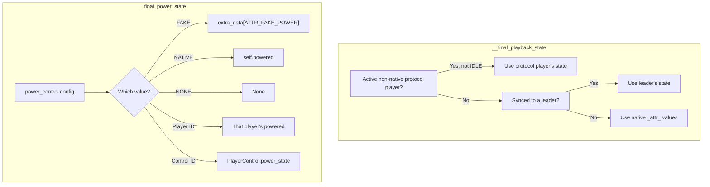

# The Player Abstraction

The `Player` class in `music_assistant/models/player.py` (~2142 lines) is the most complex single model in the codebase. It represents a physical or virtual audio device — managing raw provider state, computing derived "final" values, snapshotting state for the API, and providing the abstract control surface that every player provider must implement. Its design is modeled after Home Assistant's Entity model, using class-level `_attr_*` attributes with matching `@property` accessors to let providers report state while the framework adds computed overrides on top.

## The `_attr_*` Pattern

Providers set `_attr_*` class attributes to report device state. Public `@property` accessors expose these values read-only. The pattern: a provider's `Player` subclass mutates `_attr_volume_level = 75`, then calls `update_state()`, and the framework reads `self.volume_level` during state calculation. The `@property` methods are thin passthroughs — the real complexity lives in the `__final_*` computed properties that layer overrides on top (see below).

### Attribute Groups

**Identity and type:**

| `_attr_*` | Property | Description |
|---|---|---|
| `_attr_type: PlayerType` | `type` | PLAYER, PROTOCOL, GROUP, or STEREO_PAIR |
| `_attr_name: str \| None` | `name` | Provider-reported name |
| `_attr_supported_features: set[PlayerFeature]` | `supported_features` | Native capabilities |
| `_attr_available: bool` | `available` | Whether the device is reachable |

**Playback state:**

| `_attr_*` | Property | Description |
|---|---|---|
| `_attr_playback_state: PlaybackState` | `playback_state` | IDLE, PLAYING, PAUSED |
| `_attr_powered: bool \| None` | `powered` | Power on/off |
| `_attr_elapsed_time: float \| None` | `elapsed_time` | Current track position |
| `_attr_elapsed_time_last_updated: float \| None` | `elapsed_time_last_updated` | Timestamp of last position report |

**Volume and mute:**

| `_attr_*` | Property | Description |
|---|---|---|
| `_attr_volume_level: int \| None` | `volume_level` | 0–100 |
| `_attr_volume_muted: bool \| None` | `volume_muted` | Mute state |

**Group membership:**

| `_attr_*` | Property | Description |
|---|---|---|
| `_attr_group_members: list[str]` | `group_members` | Player IDs of group children |
| `_attr_static_group_members: list[str]` | `static_group_members` | Permanent group members |
| `_attr_can_group_with: set[str]` | `can_group_with` | Compatible player IDs |

Note: `synced_to` is *not* an `_attr_*` — it is computed by scanning `group_members` across players on the same provider. GROUP players (sync groups, universal groups) override it to always return `None`. For non-GROUP players, `group_members` is non-empty during ad-hoc sync — the sync leader lists all synced children including itself. See [06-grouping.md](06-grouping.md) for the three grouping models and how these properties interact.

**Device info and identifiers:**

| `_attr_*` | Property | Description |
|---|---|---|
| `_attr_device_info: DeviceInfo` | `device_info` | Model, manufacturer, identifiers |

**Source and media:**

| `_attr_*` | Property | Description |
|---|---|---|
| `_attr_active_source: str \| None` | `active_source` | Currently selected source |
| `_attr_current_media: PlayerMedia \| None` | `current_media` | Now-playing metadata |
| `_attr_source_list: list[PlayerSource]` | `source_list` | Available sources |
| `_attr_active_sound_mode: str \| None` | `active_sound_mode` | Selected sound mode |
| `_attr_sound_mode_list: list[PlayerSoundMode]` | `sound_mode_list` | Available sound modes (via `UniqueList`) |
| `_attr_options: list[PlayerOption]` | `options` | Player-specific options (via `UniqueList`) |

**Polling:**

| `_attr_*` | Property | Description |
|---|---|---|
| `_attr_needs_poll: bool` | `needs_poll` | Whether the controller should poll this player |
| `_attr_poll_interval: int` | `poll_interval` | Seconds between polls |

**UI defaults:**

| `_attr_*` | Property | Description |
|---|---|---|
| `_attr_hidden_by_default: bool` | `hidden_by_default` | Hidden in UI initially |
| `_attr_expose_to_ha_by_default: bool` | `expose_to_ha_by_default` | Exposed to Home Assistant initially |
| `_attr_enabled_by_default: bool` | `enabled_by_default` | Enabled on first registration |
| `_attr_needs_setup: bool` | `needs_setup` | Player needs user setup before use |

## `Player` (Runtime) vs `PlayerState` (API Snapshot)

Two classes work together to separate mutable internal state from the immutable snapshots consumed by API clients:

- **`Player`** (in `music_assistant/models/player.py`) — the live, mutable model. Providers set `_attr_*` values, the controller calls command methods, and `__final_*` properties compute derived state. This class is *never* serialized directly to the API.

- **`PlayerState`** (aliased from `music_assistant_models.player.Player`) — a frozen dataclass snapshot. Created by `update_state()` and exposed via the `state` property. This is what goes over the WebSocket to clients.

```python
from music_assistant_models.player import Player as PlayerState
```

### The `state` Property

Returns `self._state` — the last snapshot produced by `update_state()`. The initial `_state` is constructed in `__init__` with minimal fields (`player_id`, `provider`, `type`, `name`).

### The Caching Mechanism

Expensive derived properties use `@cached_property` from the `propcache` library. These store their computed values in `self._cache` (a dict). The `update_state()` method calls `self._cache.clear()` before computing anything, so all `@cached_property` values are recalculated fresh on each state update cycle — once per snapshot, no stale cross-field dependencies.

## `update_state()` Pipeline

`update_state(force_update=False, signal_event=True)` is the central state recalculation method. It is called by providers after changing `_attr_*` values, by the controller after config changes, and internally after protocol link changes. The pipeline:

1. **Thread check** — `self.mass.verify_event_loop_thread` ensures we are on the event loop.
2. **Cache invalidation** — `self._cache.clear()` forces all `@cached_property` values to recompute.
3. **Save prior media checksum** — for change detection.
4. **`__calculate_player_state()`** — builds a new `PlayerState` by reading all `__final_*` properties. Returns a diff dict of `{field: (old_value, new_value)}` via `get_changed_dataclass_values()`.
5. **Media change detection** — if the current media checksum changed, schedules `_on_player_media_updated` with a 1-second debounce via `call_later`.
6. **Noise filtering** — strips transient keys from the diff (`extra_attributes.seq_no`, `extra_attributes.last_poll`, `current_media.elapsed_time_last_updated`).
7. **Config persistence** — if the provider-reported `default_name` or `player_type` changed, persists to config.
8. **Early exit** — if no real changes and not `force_update`, returns.
9. **Signal** — calls `self.mass.players.signal_player_state_update(self, changed_values)`.

### `__calculate_player_state()`

Reads every `__final_*` property plus `display_name`, `sound_mode_list`, `output_protocols`, control strings, etc. Constructs a new `PlayerState(...)` with:

- `available = self.enabled and self.available and not self.needs_setup`
- Group/sync/media/features from the `__final_*` resolution chains

Also tracks idle transitions: when playback goes to IDLE, schedules `set_active_mass_source(None)` after 5 seconds to clear the active MA source.

## `__final_*` Computed Properties

These `@cached_property @final` methods compute the "effective" value of each player attribute by layering overrides from player controls, sync groups, active output protocols, and config. The controller and API consumers never see raw `_attr_*` values — they see these resolved values via `PlayerState`.

### Resolution Chains



**A note on power**: Power (`_attr_powered: bool | None`) is an abstraction that means different things depending on the player. For physical players with native support, it represents actual hardware on/off state. For always-on network speakers (Chromecast, AirPlay endpoints), "fake" power provides a UI toggle that gates playback without affecting hardware. For group players, power controls member activation — powering on a universal group activates its members, powering off deactivates and stops them; sync groups don't implement power natively and use fake power instead. A value of `None` means the power state is unknown or the player has no power concept (`power_control == NONE`). The `PlayerFeature.POWER` flag in `__final_supported_features` is dynamically added or removed based on the `power_control` config, so a player without native power support can still gain a power toggle through fake or delegated power. See [04-player-controller.md](04-player-controller.md#power-management) for command routing and [06-grouping.md](06-grouping.md#power-and-membership) for how group players use power.

**A note on volume and mute**: Volume (`volume_control` property) and mute (`mute_control` property) follow the same control-chain pattern as power. `NATIVE` means the player handles volume/mute in hardware or firmware. `FAKE` means MA simulates the control in software — for volume, the level is stored in `extra_data` and used for DSP-based software volume or group volume calculations; for mute, the current volume is saved, set to 0, and restored on unmute. `NONE` means the control is disabled. A player or control ID delegates to another entity (e.g., a Chromecast protocol player that can always adjust volume even when not actively streaming). The auto-select logic prefers native support, then falls back to a linked protocol player, then `NONE`. The `PlayerFeature.VOLUME_SET` and `PlayerFeature.VOLUME_MUTE` flags in `__final_supported_features` are dynamically added or removed based on this resolution. The **mute lock** mechanism (see [07-volume.md](07-volume.md#the-mute-lock-mechanism)) prevents group volume changes from auto-unmuting players the user deliberately muted. See [04-player-controller.md](04-player-controller.md#volume-routing) for command routing and [07-volume.md](07-volume.md) for the full volume architecture.

| Property | Returns | Resolution priority (highest → lowest) |
|---|---|---|
| `__final_playback_state` | `tuple[PlaybackState, elapsed, timestamp]` | Active protocol player → sync leader → native `_attr_*` |
| `__final_power_state` | `bool \| None` | `power_control` config: FAKE → NATIVE → NONE → delegate player → delegate PlayerControl |
| `__final_volume_level` | `int \| None` | `volume_control` config: FAKE → NATIVE → NONE → delegate player → delegate PlayerControl → **fallback: native** |
| `__final_volume_muted_state` | `bool \| None` | `mute_control` config: FAKE → NATIVE → NONE → delegate player → delegate PlayerControl → **fallback: native** |
| `__final_active_group` | `str \| None` | PROTOCOL type → None. Else: scan GROUP players for one that is playing/paused and includes this player in its group_members |
| `__final_current_media` | `PlayerMedia \| None` | Active group/sync leader → protocol parent → plugin source → player queue with stream details → queue media item → native `_attr_current_media` |
| `__final_source_list` | `list[PlayerSource]` | PROTOCOL → native only. Else: ensure MA queue source + plugin sources appended |
| `__final_group_members` | `list[str]` | If synced → empty. Else: native members (protocol IDs translated to visible parents), merged with active protocol's members. Non-GROUP with only self → empty |
| `__final_synced_to` | `str \| None` | Native `synced_to` (mapped through protocol parent) → linked protocol's `synced_to` (resolved to visible parent) |
| `__final_supported_features` | `set[PlayerFeature]` | Native features + `ACTIVE_PROTOCOL_FEATURES` from active protocol + `PROTOCOL_FEATURES` from all linked protocols ± power/volume/mute adjusted by control config |
| `__final_can_group_with` | `set[str]` | If synced → empty. Else: expanded native set (translated to visible) + linked protocol group sets (if no external source active) |
| `__final_active_source` | `str \| None` | Active group/sync leader → protocol parent → in-use plugin → `__active_mass_source` (if no external source) → native `active_source` → fallback to `__active_mass_source` or `player_id` |

Two additional computed properties are included in `PlayerState` but are not `__final_*` prefixed:

| Property | Returns | Description |
|---|---|---|
| `group_volume` | `int \| None` | No group → own `volume_level`. With group → **max** of powered members' volume (the slider acts as a master fader for the loudest speaker). See [07-volume.md](07-volume.md) |
| `group_volume_muted` | `bool \| None` | No group → own `volume_muted`. With group → `True` if all powered members muted, `False` if all unmuted, `None` if mixed (some muted, some not) or no members support mute. See [07-volume.md](07-volume.md) |

### Feature Sets from Protocols

Two constant sets in `music_assistant/constants.py` control which features "flow through" from linked protocols:

- **`PROTOCOL_FEATURES`** — copied from *any* linked protocol (active or not): `PLAY_ANNOUNCEMENT`, `SET_MEMBERS`
- **`ACTIVE_PROTOCOL_FEATURES`** — copied only from the *active* output protocol: everything in `PROTOCOL_FEATURES` plus `ENQUEUE`, `GAPLESS_PLAYBACK`, `MULTI_DEVICE_DSP`, `PAUSE`

## PlayerType Taxonomy

The `PlayerType` enum (from `music_assistant_models.enums`) defines four types with distinct behavior:

| Type | Description | UI visibility | Protocol linking role |
|---|---|---|---|
| `PLAYER` | Native vendor device (Sonos, HomePod) | Visible | Can be a protocol parent |
| `PROTOCOL` | Generic protocol endpoint (AirPlay on a Samsung TV) | **Hidden** | Linked to a parent (native or universal) |
| `GROUP` | Multi-speaker sync group | Visible | **Excluded** from protocol linking |
| `STEREO_PAIR` | Two speakers acting as one | Visible | **Excluded** from protocol linking |

**Code paths branching on type:**

- **`synced_to`**: Returns `None` for GROUP (groups are not "synced to" in the leader/follower sense)
- **`is_native_player`**: Excludes PROTOCOL, checks for `universal_player` domain and `PLAY_MEDIA` feature
- **`__final_active_group`**: PROTOCOL → `None` (group membership follows the parent)
- **`__final_current_media`**: PROTOCOL → uses parent's media
- **`__final_source_list`**: PROTOCOL → returns only native sources (no MA queue injection)
- **`__final_group_members`**: PROTOCOL → no ID translation; GROUP → different self-inclusion rules
- **`__final_can_group_with`**: PROTOCOL → simplified expanded set; others → protocol-to-parent translation
- **`__final_active_source`**: PROTOCOL → uses parent's active source
- **Event signaling**: PROTOCOL players do *not* trigger `PLAYER_ADDED` or `PLAYER_UPDATED` events

## Player Control Commands

The `Player` class defines abstract methods that provider implementations override. Each is gated by a `PlayerFeature` flag — the controller checks the flag before calling the method.

| Method | Feature gate | Description |
|---|---|---|
| `power(powered)` | `POWER` | Turn on/off |
| `volume_set(volume_level)` | `VOLUME_SET` | Set volume 0–100 (abstract — overridden by providers) |
| `volume_mute(muted)` | `VOLUME_MUTE` | Mute/unmute |
| `play()` | *(required — must implement)* | Resume playback |
| `stop()` | `PLAY_MEDIA` | Stop playback |
| `pause()` | `PAUSE` | Pause playback |
| `next_track()` | `NEXT_PREVIOUS` | Skip to next track |
| `previous_track()` | `NEXT_PREVIOUS` | Skip to previous track |
| `seek(position)` | `SEEK` | Seek to position (not for MA queue) |
| `play_media(media)` | `PLAY_MEDIA` | Start playing a `PlayerMedia` payload |
| `enqueue_next_media(media)` | `ENQUEUE` | Queue the next track |
| `play_announcement(announcement, volume_level)` | `PLAY_ANNOUNCEMENT` | Native announcement playback |
| `select_source(source)` | `SELECT_SOURCE` | Switch input source |
| `select_sound_mode(sound_mode)` | `SELECT_SOUND_MODE` | Switch sound mode |
| `set_option(option_key, option_value)` | `OPTIONS` | Set a player-specific option |
| `set_members(player_ids_to_add, player_ids_to_remove)` | `SET_MEMBERS` | Modify group membership |
| `poll()` | *(when `needs_poll=True`)* | Periodic state refresh |

Default (non-abstract) methods: `get_config_entries()` → `[]`, `on_config_updated()`, `on_unload()`, `group_with()` / `ungroup()` (delegate to `set_members`), `on_protocol_playback()` (optional), `_on_player_media_updated()` (optional).

## Protocol Feature Routing

Two methods route commands through the protocol linking layer:

### `_check_feature_with_active_protocol(feature)`

Checks if the *active output protocol* supports a given feature. If an active protocol player exists and is not `"native"`, checks the protocol player's `supported_features`. Otherwise falls back to self. Used by `supports_enqueue` and `supports_gapless`.

### `_get_protocol_player_for_feature(feature, require_active=True)`

Finds the best player to handle a command for a given feature:

1. **Self** — if `feature in self.supported_features`, returns self.
2. **Active output protocol** — if the active (or preferred) protocol player is available and has the feature, returns it.
3. **If `require_active=True`** — stops here, returns `None`.
4. **All linked protocols** — sorted by control priority, first available player with the feature wins.

The **control priority** ordering (lower = preferred) is designed for commands that work without active streaming:

| Domain | Priority | Rationale |
|---|---|---|
| `chromecast` | 0 | Always handles volume/power commands |
| `dlna` | 1 | Always handles commands |
| `airplay` | 2 | Only while streaming |
| `sendspin` | 3 | Only while streaming |
| *(other)* | 10 | Default |

This is distinct from the **`PROTOCOL_PRIORITY`** used for output selection (airplay=10 > squeezelite=20 > chromecast=30 > sendspin=40 > dlna=50), which governs *playback* preference. The control priority here governs *command routing* for non-active protocols.

The `power_control`, `volume_control`, and `mute_control` cached properties use this method to resolve which entity handles power/volume/mute commands. Power uses `require_active=True`; volume and mute use `require_active=False` (so they can reach idle protocol players like Chromecast).

## Protocol Linking State

Four properties manage the relationship between a player and its linked protocol players. These are set by the `ProtocolLinkingMixin` on the `PlayerController`, not by providers directly.

| Property | Setter | Description |
|---|---|---|
| `linked_output_protocols` | `set_linked_output_protocols()` | List of `OutputProtocol` entries (id, domain, priority) for protocols linked to this player |
| `protocol_parent_id` | `set_protocol_parent_id()` | For PROTOCOL players: the ID of the native/universal parent |
| `active_output_protocol` | `set_active_output_protocol()` | Currently selected output: `None`, `"native"`, or a protocol player ID. Setting this triggers `update_state()` |
| `output_protocols` | *(derived, `@cached_property`)* | API-facing list: optional native entry (priority=0) + all linked live protocols + cached disabled protocols from config, sorted by priority |

The relationship: a **native/universal player** holds `linked_output_protocols` and `active_output_protocol`. Each **protocol player** holds `protocol_parent_id` pointing back. `output_protocols` is the merged view for the UI. See [05-protocol-linking.md](05-protocol-linking.md) for the full linking lifecycle.

## Key Files

| File | Description |
|---|---|
| [`music_assistant/models/player.py`](../../music_assistant/models/player.py) | The `Player` class — `_attr_*` pattern, `__final_*` properties, abstract commands, `update_state()` (~2142 lines) |
| `music_assistant_models.player` | `PlayerState` (frozen dataclass), `DeviceInfo`, `OutputProtocol`, `PlayerMedia`, `PlayerSource`, `PlayerSoundMode`, `PlayerOption` |
| `music_assistant_models.enums` | `PlayerType`, `PlayerFeature`, `PlaybackState`, `IdentifierType` |
| [`music_assistant/constants.py`](../../music_assistant/constants.py) | `PROTOCOL_FEATURES`, `ACTIVE_PROTOCOL_FEATURES`, player control constants |
| [`music_assistant/controllers/players/controller.py`](../../music_assistant/controllers/players/controller.py) | `PlayerController` — consumes `Player` state, routes commands. See [04-player-controller.md](04-player-controller.md) |
