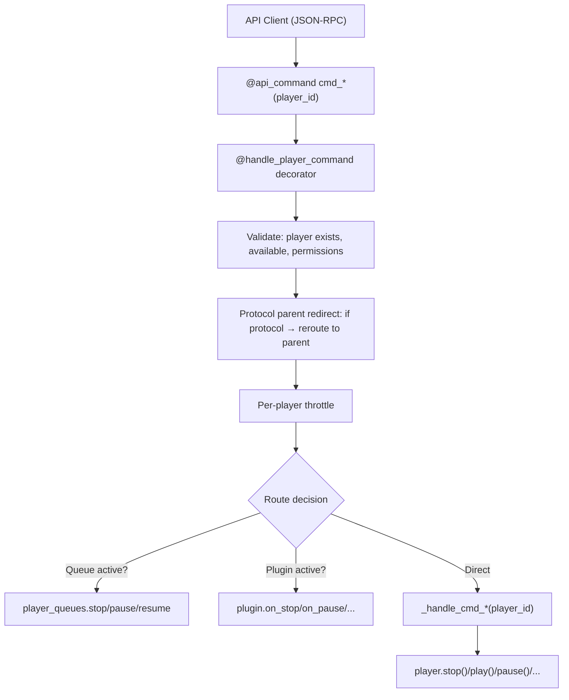

# The PlayerController

The `PlayerController` (`music_assistant/controllers/players/controller.py`, ~3242 lines) is the command routing hub between API consumers and player implementations. It handles player registration, command dispatch with two-tier routing (public API → private handler), protocol-aware redirection, power/volume/group management, polling, announcements, and concurrency control. It composes protocol linking functionality via the `ProtocolLinkingMixin`.

```python
class PlayerController(ProtocolLinkingMixin, CoreController):
    domain = "players"
```

## Registration Flow

### `register(player)`

Acquires `_register_lock` (serializes all registrations), then:

1. **Guard checks** — reject if server is closing, player already registered, or player not enabled.
2. **MAC enrichment** — for non-GROUP/STEREO_PAIR players: loads cached ARP MAC from config, calls `enrich_device_mac_address()` to ARP-resolve the real hardware MAC, persists results to config, stores reported MAC in `extra_data` for multi-MAC matching.
3. **Throttler setup** — creates a per-player `Throttler(1, 0.05)` for command rate limiting.
4. **Fake power cache** — restores persisted fake power state from the cache controller.
5. **Store** — `self._players[player_id] = player`.
6. **Initial state** — `player.update_state(signal_event=False)` to build the first `PlayerState` snapshot.
7. **Config application** — loads `PlayerConfig`, calls `player.set_config()`, triggers another `update_state()`, then `player.on_config_updated()`.
8. **Protocol linking** — `self._evaluate_protocol_links(player)` to check for matching protocols.
9. **Finalization** — `player.set_initialized()`. For non-PROTOCOL players: signals `PLAYER_ADDED` and notifies `player_queues.on_player_register()`.
10. **Post-lock** — schedules `_schedule_update_all_players(2)` to refresh all player states.

### `register_or_update(player)`

If the player ID is already registered, replaces the entry in `_players`. Otherwise calls `register()`.

### `unregister(player_id, permanent=False)`

1. Removes from `_players` dict.
2. Notifies `player_queues.on_player_remove()`.
3. Calls `player.on_unload()`.
4. **If permanent**: cleans up group memberships, protocol links, and player config; signals `PLAYER_REMOVED`.
5. **If temporary** (provider reload): marks `state.available = False`; signals `PLAYER_UPDATED`.
6. Schedules `_schedule_update_all_players()`.

## Command Routing

The controller uses a two-tier pattern for commands:

- **Public `cmd_*` / API methods** — decorated with `@api_command(...)` and often `@handle_player_command`. These are the JSON-RPC API surface. They handle validation, permission checks, logging, and routing decisions.
- **Private `_handle_cmd_*` methods** — contain the actual implementation logic for stop, play, pause, resume, power, and volume_set. Other commands (seek, next, previous, mute, grouping) route differently.



### The `handle_player_command` Decorator

Defined in `music_assistant/controllers/players/helpers.py`, this decorator wraps most command methods:

1. **Resolves player** from `player_id` argument.
2. **Availability check** — if player missing or unavailable, logs warning and returns (no exception).
3. **Protocol parent redirect** — if the player has `protocol_parent_id` and that parent is registered, rewrites `player_id` to the parent. This ensures commands on hidden protocol players route to their visible parent.
4. **Permission check** — validates the current user's `player_filter` against the player ID.
5. **Throttling** — runs the command inside `async with self._player_throttlers[player.player_id]`.
6. **Error wrapping** — catches exceptions, re-raises as `PlayerCommandFailed`.

When used as `@handle_player_command(lock=True)`, additionally acquires `self._player_command_locks[f"{fn.__name__}_{player_id}"]` — an `asyncio.Lock` per (function, player) pair to serialize concurrent calls.

### `_get_player_with_redirect`

Separate from the decorator's protocol redirect, this method handles *playback* redirection for sync groups and active groups:

- If `player.state.synced_to` → redirect to the **sync leader**
- If `player.state.active_group` → redirect to the **group player**

Used by transport commands (`cmd_stop`, `cmd_play`, `cmd_pause`, `cmd_seek`, `cmd_next_track`, `cmd_previous_track`), `play_media`, and `_handle_cmd_resume`. This ensures a play command on a group child ends up controlling the group leader.

### Full Command Surface

**Transport commands:**

| API route | Method | Implementation |
|---|---|---|
| `players/cmd/stop` | `cmd_stop` | Queue → `player_queues.stop` / else → `_handle_cmd_stop` |
| `players/cmd/play` | `cmd_play` | If paused with queue → `player_queues.resume` / else → `_handle_cmd_play` |
| `players/cmd/pause` | `cmd_pause` | Queue → `player_queues.pause` / else → `_handle_cmd_pause` |
| `players/cmd/play_pause` | `cmd_play_pause` | Dispatches to `cmd_pause` or `cmd_play` |
| `players/cmd/resume` | `cmd_resume` | → `_handle_cmd_resume` (handles source restore, auto-play) |
| `players/cmd/seek` | `cmd_seek` | Plugin → `on_seek` / queue → `queue.seek` / else → `player.seek` |
| `players/cmd/next` | `cmd_next_track` | Plugin → `on_next_track` / queue → `queue.next` / else → `player.next_track` |
| `players/cmd/previous` | `cmd_previous_track` | Plugin → `on_previous_track` / queue → `queue.previous` / else → `player.previous_track` |

**Volume commands:**

| API route | Method | Implementation |
|---|---|---|
| `players/cmd/volume_set` | `cmd_volume_set` | → `_handle_cmd_volume_set` |
| `players/cmd/volume_up` | `cmd_volume_up` | May redirect to group volume; steps → `cmd_volume_set` |
| `players/cmd/volume_down` | `cmd_volume_down` | May redirect to group volume; steps → `cmd_volume_set` |
| `players/cmd/volume_mute` | `cmd_volume_mute` | Resolves mute control (native/fake/delegate) |

**Group volume commands:**

| API route | Method | Implementation |
|---|---|---|
| `players/cmd/group_volume` | `cmd_group_volume` | `set_group_volume` → distributes to children via `_handle_cmd_volume_set` |
| `players/cmd/group_volume_up` | `cmd_group_volume_up` | Steps → `cmd_group_volume` |
| `players/cmd/group_volume_down` | `cmd_group_volume_down` | Steps → `cmd_group_volume` |
| `players/cmd/group_volume_mute` | `cmd_group_volume_mute` | `asyncio.gather` of `cmd_volume_mute` per member |

**Group membership commands:**

| API route | Method | Implementation |
|---|---|---|
| `players/cmd/set_members` | `cmd_set_members` | Locked → `_handle_set_members` |
| `players/cmd/group` | `cmd_group` | → `cmd_set_members(player_ids_to_add=[player_id])` |
| `players/cmd/group_many` | `cmd_group_many` | → `cmd_set_members` |
| `players/cmd/ungroup` | `cmd_ungroup` | → `cmd_set_members` (remove from groups) |
| `players/cmd/ungroup_many` | `cmd_ungroup_many` | Loops `cmd_ungroup` |

**Power:**

| API route | Method | Implementation |
|---|---|---|
| `players/cmd/power` | `cmd_power` | → `_handle_cmd_power` |

**Other (source, sound mode, announcements, play_media):**

| API route | Method | Implementation |
|---|---|---|
| `players/cmd/select_source` | `select_source` | → `_handle_select_source` |
| `players/cmd/select_sound_mode` | `select_sound_mode` | → `player.select_sound_mode` |
| `players/cmd/set_option` | `set_option` | → `player.set_option` |
| `players/cmd/play_announcement` | `play_announcement` | See [Announcement Handling](#announcement-handling) |

## Power Management

`_handle_cmd_power(player_id, powered, skip_auto_play=False)` resolves the power command through the `power_control` config chain:

1. **No-op** — if `player.state.powered == powered`, returns.
2. **Power off path** — optionally ungroups, stops playback, powers off sync children.
3. **`PLAYER_CONTROL_NONE`** — returns (power not supported/disabled).
4. **`PLAYER_CONTROL_NATIVE`** — `await player.power(powered)`, then `wait_for_power_on()`.
5. **`PLAYER_CONTROL_FAKE`** — stores state in `extra_data[ATTR_FAKE_POWER]`, persists to cache.
6. **External `PlayerControl`** — calls `control.power_on()` / `control.power_off()`, then `wait_for_power_on()`.
7. **Protocol-as-power** — if `power_control` is a protocol player ID, recursively calls `_handle_cmd_power` on that player.
8. **Auto-play on power on** — if `powered=True`, not grouped, `CONF_AUTO_PLAY` enabled, and no external source active, resumes the queue via `player_queues.resume()`.

**Power-on demand**: Several command handlers (`_handle_play_media`, `_handle_cmd_play`, `_handle_set_members`) call `_handle_cmd_power(player_id, True, skip_auto_play=True)` before executing, ensuring the player is powered on before receiving playback commands.

`wait_for_power_on()` (in `helpers.py`) polls `player.powered` (or `player_control.power_state`) at 100ms intervals with a 5-second timeout. On timeout it logs at debug level — no exception raised.

## Volume Routing

`_handle_cmd_volume_set(player_id, volume_level)` resolves through the `volume_control` config:

1. **GROUP type** — redirects to `cmd_group_volume`.
2. **Unmute on volume change** — if muted with a real mute control, calls `cmd_volume_mute(False)` first.
3. **Active plugin** — calls `plugin.on_volume()` if present.
4. **`NATIVE`** — `player.volume_set(volume_level)`.
5. **`FAKE`** — stores in `extra_data[ATTR_FAKE_VOLUME]`, triggers `update_state()`.
6. **`NONE`** — raises `UnsupportedFeaturedException`.
7. **External `PlayerControl`** — calls `control.volume_set()`.
8. **Protocol player** — recursively calls `_handle_cmd_volume_set` on the protocol player.

**Group volume**: `set_group_volume()` computes a delta from the current `group_volume` and applies it proportionally to each powered child member via `_handle_cmd_volume_set`.

## Player Polling

`_poll_players()` is a background task started during `setup()` that runs on a 1-second tick:

- For each **playing, non-PROTOCOL** player: schedules `player_queues.on_player_update` with a 0.5-second debounce to update elapsed time.
- For each player with **`needs_poll=True`**: checks `poll_interval` against the last poll timestamp, calls `player.poll()` when due.
- Yields (`await asyncio.sleep(0)`) between players to avoid blocking the event loop.

## Announcement Handling

`play_announcement(player_id, url, pre_announce, volume_level, pre_announce_url)` orchestrates the complex flow of interrupting playback, playing an announcement, and restoring state:

1. Sets `ATTR_ANNOUNCEMENT_IN_PROGRESS` (cleared in `finally`).
2. Resolves pre-announce chime URL from config or defaults.
3. **Group fan-out**: if the target is a GROUP and all members support `PLAY_ANNOUNCEMENT`, fans out to individual member announcements via `TaskManager`.
4. **Native path**: finds a control target with `PLAY_ANNOUNCEMENT` support, resolves announcement volume from config, calls `player.play_announcement()`.
5. **Fallback path** (`_play_announcement`): saves current sync/group/source/media state → ungroups if needed → stops playback → adjusts volume on members → plays announcement via `play_media` with streaming URL → waits for play/idle/duration → restores volume → restores sync/group/source or resumes.

## Source Selection

`select_source(player_id, source)` manages the active source:

1. If `source is None`, defaults to `player_id` (the MA queue).
2. If the player is in a group or synced, handles ungrouping/stopping the group.
3. Delegates to `_handle_select_source`, which:
   - If switching sources, stops current playback.
   - If the source is a plugin provider → `_handle_select_plugin_source`.
   - If the source is a queue ID → sets the active MA source.
   - Otherwise → validates against `source_list`, calls `player.select_source()`.

Forward reference: plugin source internals are covered in Sub-plan 5; queue management in Sub-plan 4.

## Concurrency Controls

| Mechanism | Scope | Purpose |
|---|---|---|
| `_player_throttlers` | Per-player `Throttler(1, 0.05)` | Rate-limits commands to each player (wraps all `@handle_player_command` calls) |
| `_player_command_locks` | Per `(function_name, player_id)` `asyncio.Lock` | Serializes concurrent calls to the same locked command on the same player (used by `play_announcement`, `play_media`, `enqueue_next_media`) |
| `_register_lock` | Global `asyncio.Lock` | Serializes all player registrations |
| `_delayed_evaluation_lock` | Global `asyncio.Lock` | Serializes delayed protocol evaluations (from `ProtocolLinkingMixin`) |
| `IN_QUEUE_COMMAND` | `ContextVar[bool]` | Prevents circular calls between `PlayerController` and `PlayerQueuesController`. When `True`, `cmd_stop`/`cmd_pause`/`cmd_seek` skip the queue redirect path. Set by `player_queues` when it calls back into the player controller. |

## Player Config Interaction

The controller interacts with the `ConfigController` for player settings at several points:

- **Registration**: reads/writes cached MAC addresses, loads player config, applies config to player.
- **`on_player_config_change(player_id, changed_keys, config)`**: called when config is saved. If player becomes disabled, powers off or stops. Calls `player.set_config()` and `player.on_config_updated()`. If any changed key has `requires_reload=True`, restarts the player queue.
- **`on_player_dsp_change(player_id)`**: restarts the queue or stops/plays to apply DSP config changes.
- **`delete_player_config(player_id)`**: removes player config and DSP config from the config store.
- **Weekly maintenance**: `_fix_group_member_configs` reconciles `CONF_GROUP_MEMBERS` in config against actual player states.

Player config values are organized into five categories (see [02-configuration.md](02-configuration.md)):

| Category | Contents |
|---|---|
| `"generic"` | Icon, visibility, enabled state |
| `"playback"` | Volume normalization, crossfade |
| `"protocol_generic"` | Codec, sample rates, flow mode, HTTP profile |
| `"announcements"` | TTS pre-announce, volume strategy, chime URL |
| `"player_controls"` | Power/volume/mute control sources |

## Event Signaling

The controller signals three player events (all excluding PROTOCOL players):

| Event | When | Data |
|---|---|---|
| `PLAYER_ADDED` | During `register()` | `Player` instance |
| `PLAYER_UPDATED` | Via `signal_player_state_update()` | `Player` instance |
| `PLAYER_REMOVED` | During `unregister(permanent=True)` | `player_id` only |

Additionally, `signal_player_state_update()` emits:
- `PLAYER_CONFIG_UPDATED` — when supported features or config-visible state changed
- `PLAYER_OPTIONS_UPDATED` — when player options changed

The method also handles side effects: notifies `player_queues.on_player_update()`, triggers DSP reloads on group membership changes, detects external source takeover, and cleans up memberships when a player becomes unavailable.

## Key Files

| File | Description |
|---|---|
| `music_assistant/controllers/players/controller.py` | `PlayerController` — registration, command routing, polling, announcements (~3242 lines) |
| `music_assistant/controllers/players/helpers.py` | `handle_player_command` decorator, `AnnounceData` TypedDict, `wait_for_power_on` |
| `music_assistant/controllers/players/protocol_linking.py` | `ProtocolLinkingMixin` — protocol linking logic. See [05-protocol-linking.md](05-protocol-linking.md) |
| `music_assistant/models/player.py` | `Player` class — the model the controller manages. See [03-player-model.md](03-player-model.md) |
| `music_assistant/models/player_provider.py` | `PlayerProvider` base class that providers implement |
