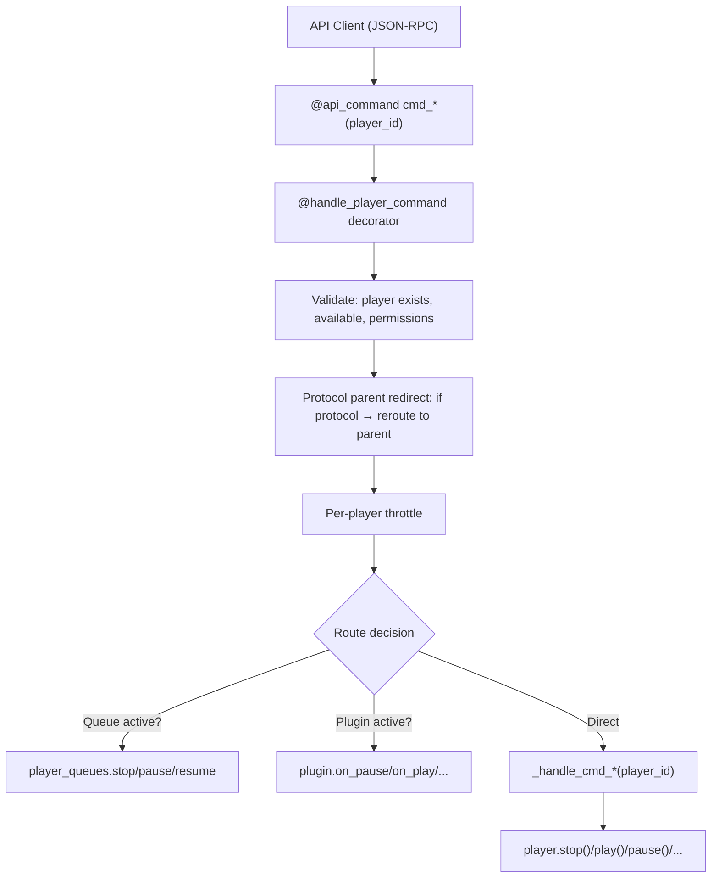

# The PlayerController

The `PlayerController` (`music_assistant/controllers/players/controller.py`, ~3242 lines) is the command routing hub between API consumers and player implementations. It handles player registration, command dispatch with two-tier routing (public API → private handler), protocol-aware redirection, power/volume/group management, polling, announcements, and concurrency control. It composes protocol linking functionality via the `ProtocolLinkingMixin`.

```python
class PlayerController(ProtocolLinkingMixin, CoreController):
    domain = "players"
```

## Registration Flow

### `register(player)`

Acquires `_register_lock` (serializes all registrations), then:

1. **Guard checks** — reject if server is closing, player already registered, or player not enabled.
2. **MAC enrichment** — for non-GROUP/STEREO_PAIR players: loads cached ARP MAC from config, calls `enrich_device_mac_address()` to ARP-resolve the real hardware MAC, persists results to config, stores reported MAC in `extra_data` for multi-MAC matching.
3. **Throttler setup** — creates a per-player `Throttler(1, 0.05)` for command rate limiting.
4. **Fake power cache** — restores persisted fake power state from the cache controller.
5. **Store** — `self._players[player_id] = player`.
6. **Initial state** — `player.update_state(signal_event=False)` to build the first `PlayerState` snapshot.
7. **Config application** — loads `PlayerConfig`, calls `player.set_config()`, triggers another `update_state()`, then `player.on_config_updated()`.
8. **Protocol linking** — `self._evaluate_protocol_links(player)` to check for matching protocols.
9. **Finalization** — `player.set_initialized()`. For non-PROTOCOL players: signals `PLAYER_ADDED` and notifies `player_queues.on_player_register()`.
10. **Post-lock** — schedules `_schedule_update_all_players(2)` to refresh all player states.

### `register_or_update(player)`

If the player ID is already registered, replaces the entry in `_players`. Otherwise calls `register()`.

### `unregister(player_id, permanent=False)`

1. Removes from `_players` dict.
2. Notifies `player_queues.on_player_remove()`.
3. Calls `player.on_unload()`.
4. **If permanent**: cleans up group memberships, protocol links, and player config; signals `PLAYER_REMOVED`.
5. **If temporary** (provider reload): marks `state.available = False`; signals `PLAYER_UPDATED`.
6. Schedules `_schedule_update_all_players()`.

## Command Routing

The controller uses a two-tier pattern for commands:

- **Public `cmd_*` / API methods** — decorated with `@api_command(...)` and often `@handle_player_command`. These are the JSON-RPC API surface. They handle validation, permission checks, logging, and routing decisions.
- **Private `_handle_cmd_*` methods** — contain the actual implementation logic for stop, play, pause, resume, power, and volume_set. Other commands (seek, next, previous, mute, grouping) route differently.



### The `handle_player_command` Decorator

Defined in `music_assistant/controllers/players/helpers.py`, this decorator wraps most command methods:

1. **Resolves player** from `player_id` argument.
2. **Availability check** — if player missing or unavailable, logs warning and returns (no exception).
3. **Protocol parent redirect** — if the player has `protocol_parent_id` and that parent is registered, rewrites `player_id` to the parent. This ensures commands on hidden protocol players route to their visible parent.
4. **Permission check** — validates the current user's `player_filter` against the player ID.
5. **Throttling** — runs the command inside `async with self._player_throttlers[player.player_id]`.
6. **Error wrapping** — catches exceptions, re-raises as `PlayerCommandFailed`.

When used as `@handle_player_command(lock=True)`, additionally acquires `self._player_command_locks[f"{fn.__name__}_{player_id}"]` — an `asyncio.Lock` per (function, player) pair to serialize concurrent calls.

### `_get_player_with_redirect`

Separate from the decorator's protocol redirect, this method handles *playback* redirection for sync groups and active groups:

- If `player.state.synced_to` → redirect to the **sync leader**
- If `player.state.active_group` → redirect to the **group player**

Used by transport commands (`cmd_stop`, `cmd_play`, `cmd_pause`, `cmd_seek`, `cmd_next_track`, `cmd_previous_track`), `play_media`, and `_handle_cmd_resume`. This ensures a play command on a group child ends up controlling the sync leader or group player.

### Full Command Surface

**Transport commands:**

| API route | Method | Implementation |
|---|---|---|
| `players/cmd/stop` | `cmd_stop` | Queue → `player_queues.stop` / else → `_handle_cmd_stop` |
| `players/cmd/play` | `cmd_play` | If not paused and queue exists → `player_queues.resume` / if paused → `_handle_cmd_play` (native unpause) |
| `players/cmd/pause` | `cmd_pause` | Queue → `player_queues.pause` / else → `_handle_cmd_pause` |
| `players/cmd/play_pause` | `cmd_play_pause` | Dispatches to `cmd_pause` or `cmd_play` |
| `players/cmd/resume` | `cmd_resume` | → `_handle_cmd_resume` (handles source restore, auto-play) |
| `players/cmd/seek` | `cmd_seek` | Plugin → `on_seek` / queue → `queue.seek` / else → `player.seek` |
| `players/cmd/next` | `cmd_next_track` | Plugin → `on_next_track` / queue → `queue.next` / else → `player.next_track` |
| `players/cmd/previous` | `cmd_previous_track` | Plugin → `on_previous_track` / queue → `queue.previous` / else → `player.previous_track` |

**Volume commands:**

| API route | Method | Implementation |
|---|---|---|
| `players/cmd/volume_set` | `cmd_volume_set` | → `_handle_cmd_volume_set` |
| `players/cmd/volume_up` | `cmd_volume_up` | May redirect to group volume; steps → `cmd_volume_set` |
| `players/cmd/volume_down` | `cmd_volume_down` | May redirect to group volume; steps → `cmd_volume_set` |
| `players/cmd/volume_mute` | `cmd_volume_mute` | Resolves mute control (native/fake/delegate) |

**Group volume commands:**

| API route | Method | Implementation |
|---|---|---|
| `players/cmd/group_volume` | `cmd_group_volume` | `set_group_volume` → distributes to children via `_handle_cmd_volume_set` |
| `players/cmd/group_volume_up` | `cmd_group_volume_up` | Steps → `cmd_group_volume` |
| `players/cmd/group_volume_down` | `cmd_group_volume_down` | Steps → `cmd_group_volume` |
| `players/cmd/group_volume_mute` | `cmd_group_volume_mute` | `asyncio.gather` of `cmd_volume_mute` per member |

**Group membership commands:**

| API route | Method | Implementation |
|---|---|---|
| `players/cmd/set_members` | `cmd_set_members` | Locked → `_handle_set_members` |
| `players/cmd/group` | `cmd_group` | → `cmd_set_members(player_ids_to_add=[player_id])` |
| `players/cmd/group_many` | `cmd_group_many` | → `cmd_set_members` |
| `players/cmd/ungroup` | `cmd_ungroup` | → `cmd_set_members` (remove from groups) |
| `players/cmd/ungroup_many` | `cmd_ungroup_many` | Loops `cmd_ungroup` |

For GROUP players (sync groups, universal groups), `_handle_set_members` delegates directly to the player's `set_members()` method. For regular players (ad-hoc sync), it proceeds to `_handle_set_members_with_protocols`, which translates user-visible player IDs to protocol player IDs before forwarding. See [06-grouping.md](06-grouping.md) for the complete two-phase pipeline.

**Power:**

| API route | Method | Implementation |
|---|---|---|
| `players/cmd/power` | `cmd_power` | → `_handle_cmd_power` |

**Other (source, sound mode, announcements, play_media):**

| API route | Method | Implementation |
|---|---|---|
| `players/cmd/select_source` | `select_source` | → `_handle_select_source` |
| *(internal — not `@api_command`-exposed)* | `deselect_source` | Stops the player and clears its current source. Called from controller-internal paths when an external source (plugin/receiver) disconnects and the player should stop rather than fall through to another source — internally calls `_handle_cmd_stop` |
| `players/cmd/select_sound_mode` | `select_sound_mode` | → `player.select_sound_mode` |
| `players/cmd/set_option` | `set_option` | → `player.set_option` |
| `players/cmd/play_announcement` | `play_announcement` | See [Announcement Handling](#announcement-handling) |

## Power Management

Power is a unifying abstraction that the controller normalizes across diverse hardware. Some speakers have real power controls (amplifiers, receivers), some are always-on network devices (Chromecast, AirPlay), and some are virtual entities (sync groups, universal groups). The per-player `power_control` config selects which mechanism to use. Power is deeply intertwined with playback: powering off stops playback and ungroups; powering on can auto-resume the queue; and play-related commands auto-power the player before executing ("power-on demand"). See [03-player-model.md](03-player-model.md#resolution-chains) for how the final power state is resolved and [06-grouping.md](06-grouping.md#power-and-membership) for how groups use power to manage member activation.

`_handle_cmd_power(player_id, powered, skip_auto_play=False)` resolves the power command through the `power_control` config chain:

1. **No-op** — if `player.state.powered == powered`, returns.
2. **Power off path** — optionally ungroups, stops playback, powers off sync children.
3. **`PLAYER_CONTROL_NONE`** — returns (power not supported/disabled).
4. **`PLAYER_CONTROL_NATIVE`** — `await player.power(powered)`, then `wait_for_power_on()`.
5. **`PLAYER_CONTROL_FAKE`** — stores state in `extra_data[ATTR_FAKE_POWER]`, persists to cache.
6. **External `PlayerControl`** — calls `control.power_on()` / `control.power_off()`, then `wait_for_power_on()`.
7. **Auto-play on power on** — if `powered=True`, not grouped, `CONF_AUTO_PLAY` enabled, and no external source active, resumes the queue via `player_queues.resume()`.

> **Note (#3659):** Earlier versions of the controller forwarded power commands to a designated protocol player when `power_control` was a player ID. That forwarding has been removed — `power_control` now only accepts `NONE`, `NATIVE`, `FAKE`, or an external `PlayerControl` ID. Protocol players are no longer used as a delegated power target.

**Power-on demand**: Several command handlers (`_handle_play_media`, `_handle_cmd_play`, `_handle_set_members`) call `_handle_cmd_power(player_id, True, skip_auto_play=True)` before executing, ensuring the player is powered on before receiving playback commands.

`wait_for_power_on()` (in `helpers.py`) polls `player.powered` (or `player_control.power_state`) at 100ms intervals with a 5-second timeout. On timeout it logs at debug level — no exception raised.

## Volume Routing

Volume and mute follow the same control-chain pattern as power: the per-player `volume_control` and `mute_control` configs select which mechanism handles commands. The key behavioral difference from power is that volume changes interact with mute state — adjusting volume on a muted player auto-unmutes it (unless the mute lock is set, which protects deliberately-muted players in groups). Fake mute works by saving the current volume, setting it to 0, and restoring on unmute — this is transparent to the user but means fake-muted players still receive volume change commands internally. See [07-volume.md](07-volume.md) for the full algorithm, group volume delta mechanics, and the mute lock mechanism.

`_handle_cmd_volume_set(player_id, volume_level)` resolves through the `volume_control` config:

1. **GROUP type** — redirects to `cmd_group_volume`.
2. **Unmute on volume change** — if muted with a real mute control, calls `cmd_volume_mute(False)` first. The mute-lock check looks at both the player's own `extra_data[ATTR_MUTE_LOCK]` *and* the protocol parent's lock (when `protocol_parent_id` is set), because `cmd_volume_mute` records the lock on the parent player while group volume changes route through the protocol player ID. Without this fallback, group volume on a Sonos-like player whose protocol child receives the actual command would auto-unmute the parent (#3655). See [07-volume.md](07-volume.md#the-mute-lock-mechanism).
3. **`NATIVE`** — scales the logical volume to the player's configured device range via `scale_volume_to_device`, then calls `player.volume_set(device_volume)`.
4. **`FAKE`** — stores in `extra_data[ATTR_FAKE_VOLUME]`, triggers `update_state()`.
5. **`NONE`** — raises `UnsupportedFeaturedException`.
6. **External `PlayerControl`** — calls `control.volume_set()`.
7. **Protocol player** — recursively calls `_handle_cmd_volume_set` on the protocol player.

Plugin volume notification **is** inline: after the routing branch returns, if the player owns an active plugin source (`plugin_source.in_use_by == player.player_id`), `_handle_cmd_volume_set` `await`s `plugin_source.on_volume(volume_level)` before returning. See [07-volume.md](07-volume.md#plugin-volume-callbacks).

**Group volume**: `set_group_volume()` applies snapshot-based interpolation. On the first adjustment it caches each powered child's current volume on the group player's `extra_data[ATTR_GROUP_VOLUME_SNAPSHOT]` as a reference; subsequent adjustments interpolate each child from its snapshot value toward 100 (when scaling up) or toward 0 (when scaling down). The snapshot is invalidated by `_invalidate_group_volume_snapshot` when a child's individual volume changes or when group membership changes. After all children are set, `set_group_volume` fires `on_volume(volume_level)` on the group's active plugin source if any. See [07-volume.md](07-volume.md) for the full algorithm.

## Player Polling

`_poll_players()` is a background task started during `setup()` that runs on a 1-second tick:

- For each **playing, non-PROTOCOL** player: schedules `player_queues.on_player_update` with a 0.5-second debounce to update elapsed time.
- For each player with **`needs_poll=True`**: checks `poll_interval` against the last poll timestamp, calls `player.poll()` when due.
- Yields (`await asyncio.sleep(0)`) between players to avoid blocking the event loop.

## Announcement Handling

`play_announcement(player_id, url, pre_announce, volume_level, pre_announce_url)` orchestrates the complex flow of interrupting playback, playing an announcement, and restoring state:

1. Sets `ATTR_ANNOUNCEMENT_IN_PROGRESS` (cleared in `finally`).
2. Resolves pre-announce chime URL from config or defaults.
3. **Group fan-out**: if the target is a GROUP and all members support `PLAY_ANNOUNCEMENT`, fans out to individual member announcements via `TaskManager`.
4. **Native path**: finds a control target with `PLAY_ANNOUNCEMENT` support, resolves announcement volume from config, calls `player.play_announcement()`.
5. **Fallback path** (`_play_announcement`): saves current sync/group/source/media state → ungroups if needed → stops playback → adjusts volume on members → plays announcement via `play_media` with streaming URL → waits for play/idle/duration → restores volume → restores sync/group/source or resumes.

## Source Selection

`select_source(player_id, source)` manages the active source:

1. If `source is None`, defaults to `player_id` (the MA queue).
2. If the player is in a group or synced, handles ungrouping/stopping the group.
3. Delegates to `_handle_select_source`, which:
   - If switching sources, stops current playback.
   - If the source is a plugin provider → `_handle_select_plugin_source`.
   - If the source is a queue ID → sets the active MA source.
   - Otherwise → validates against `source_list`, calls `player.select_source()`.

Plugin source internals are covered in [11-plugin-system.md](11-plugin-system.md); queue management in [09-player-queues.md](09-player-queues.md).

## Concurrency Controls

| Mechanism | Scope | Purpose |
|---|---|---|
| `_player_throttlers` | Per-player `Throttler(1, 0.05)` | Rate-limits commands to each player (wraps all `@handle_player_command` calls) |
| `_player_command_locks` | Per `(PlayerLockPurpose, player_id)` `asyncio.Lock` | Serializes concurrent commands sharing the same purpose on the same player. See [Per-Player Locking](#per-player-locking) below for the re-entrant `get_player_lock` API. |
| `_register_lock` | Global `asyncio.Lock` | Serializes all player registrations |
| `_delayed_evaluation_lock` | Global `asyncio.Lock` | Serializes delayed protocol evaluations (from `ProtocolLinkingMixin`) |
| `IN_QUEUE_COMMAND` | `ContextVar[bool]` | Prevents circular calls between `PlayerController` and `PlayerQueuesController`. When `True`, `cmd_stop`/`cmd_pause`/`cmd_seek` skip the queue redirect path. Set by `player_queues` when it calls back into the player controller. |

### Per-Player Locking

Player commands that must not race (power, playback, volume) acquire a lock via `get_player_lock(player_id, purpose=...)`. The lock is **purpose-scoped** — commands with different purposes can run concurrently on the same player (for example a volume change and a power change), but two commands with the same purpose serialize. The `@handle_player_command(lock=...)` decorator wraps the command body with `get_player_lock` automatically using the appropriate purpose: `PlayerLockPurpose.PLAYBACK` for `cmd_stop` / `cmd_resume` / `cmd_power` / `play_announcement` / `play_media` / `enqueue_next_media`, and `PlayerLockPurpose.VOLUME` for `cmd_volume_set` / `cmd_volume_mute`.

The lock is **re-entrant per asyncio Task**: nested calls within the same task skip re-acquisition (preventing self-deadlock), but deferred callbacks (`call_later`, `create_task`) run in a fresh task and acquire the lock fresh. Ownership is tracked in `self._task_held_locks: dict[int, set[str]]` keyed by task ID, with lock keys formed as `f"{purpose.value}_{player_id}"`.

Locks, throttlers, and protocol evaluations are also cleaned up at unregister time to prevent leakage when players disappear (#3554).

## Player Config Interaction

The controller interacts with the `ConfigController` for player settings at several points:

- **Registration**: reads/writes cached MAC addresses, loads player config, applies config to player.
- **`on_player_config_change(player_id, changed_keys, config)`**: called when config is saved. If player becomes disabled, powers off or stops. Calls `player.set_config()` and `player.on_config_updated()`. If any changed key has `requires_reload=True`, restarts the player queue.
- **`on_player_dsp_change(player_id)`**: restarts the queue or stops/plays to apply DSP config changes.
- **`delete_player_config(player_id)`**: removes player config and DSP config from the config store.
- **Weekly maintenance**: `_fix_group_member_configs` reconciles `CONF_GROUP_MEMBERS` in config against actual player states.

Player config values are organized into five categories (see [02-configuration.md](02-configuration.md)):

| Category | Contents |
|---|---|
| `"generic"` | Icon, visibility, enabled state |
| `"playback"` | Volume normalization, crossfade |
| `"protocol_generic"` | Codec, sample rates, flow mode, HTTP profile |
| `"announcements"` | TTS pre-announce, volume strategy, chime URL |
| `"player_controls"` | Power/volume/mute control sources |

## Event Signaling

The controller signals several player events:

| Event | When | Data | PROTOCOL excluded? |
|---|---|---|---|
| `PLAYER_ADDED` | During `register()` | `Player` instance | Yes |
| `PLAYER_UPDATED` | Via `signal_player_state_update()` | `Player` instance (temporary unregister emits `PlayerState` snapshot instead) | Yes |
| `PLAYER_REMOVED` | During `unregister(permanent=True)` | `player_id` only | Yes |
| `PLAYER_CONFIG_UPDATED` | When supported features or config-visible state changed | `PlayerConfig` | No — fires for all types |
| `PLAYER_OPTIONS_UPDATED` | When player options changed | options dict | No — fires for all types |

The method also handles side effects: notifies `player_queues.on_player_update()`, triggers DSP reloads on group membership changes, detects external source takeover, cleans up memberships when a player becomes unavailable, and **enforces volume limits** when `volume_level` changes — if the player reports a device volume outside the configured min/max, `_enforce_volume_limits` schedules a corrective `volume_set`.

### State Update Fan-Out

Beyond emitting events on the bus, every player state update is fanned out by the controller through three complementary mechanisms:

1. **Hook propagation to related players** (`_forward_state_update`): when a player updates, the controller calls the appropriate hook (`on_group_updated`, `on_sync_parent_updated`, `on_group_member_updated`, `on_protocol_parent_updated`, `on_protocol_player_updated`) on every related player. See [03-player-model.md](03-player-model.md#update-notification-hooks) for the hook surface.
2. **Internal subscribers** (`subscribe_player_state_update` / `_dispatch_state_update_subscribers`): callers can register a synchronous callback receiving `(Player, changed_values)` where `changed_values` maps attribute name to a `(previous, new)` tuple. `subscribe_player_state_update` returns an unsubscribe function. Used by long-running commands that need to know exactly when a state attribute flips, distinct from the event-bus subscribers that get the full `PLAYER_UPDATED` event payload.
3. **Async wait helpers** (`wait_for_player_update`, `_wait_for_playback_state`): `wait_for_player_update(player_id, attribute_name=..., attribute_value=..., timeout=...)` is an `asynccontextmanager` that subscribes on entry, runs the body (which typically triggers the awaited update), then waits for the matching update on exit. Skips the wait if the value already matches at entry. `_wait_for_playback_state` builds on it for the common "wait until PLAYING/IDLE" case.

## Key Files

| File | Description |
|---|---|
| [`music_assistant/controllers/players/controller.py`](../../music_assistant/controllers/players/controller.py) | `PlayerController` — registration, command routing, polling, announcements (~3242 lines) |
| [`music_assistant/controllers/players/helpers.py`](../../music_assistant/controllers/players/helpers.py) | `handle_player_command` decorator, `AnnounceData` TypedDict, `wait_for_power_on` |
| [`music_assistant/controllers/players/protocol_linking.py`](../../music_assistant/controllers/players/protocol_linking.py) | `ProtocolLinkingMixin` — protocol linking logic. See [05-protocol-linking.md](05-protocol-linking.md) |
| [`music_assistant/models/player.py`](../../music_assistant/models/player.py) | `Player` class — the model the controller manages. See [03-player-model.md](03-player-model.md) |
| [`music_assistant/models/player_provider.py`](../../music_assistant/models/player_provider.py) | `PlayerProvider` base class that providers implement |
