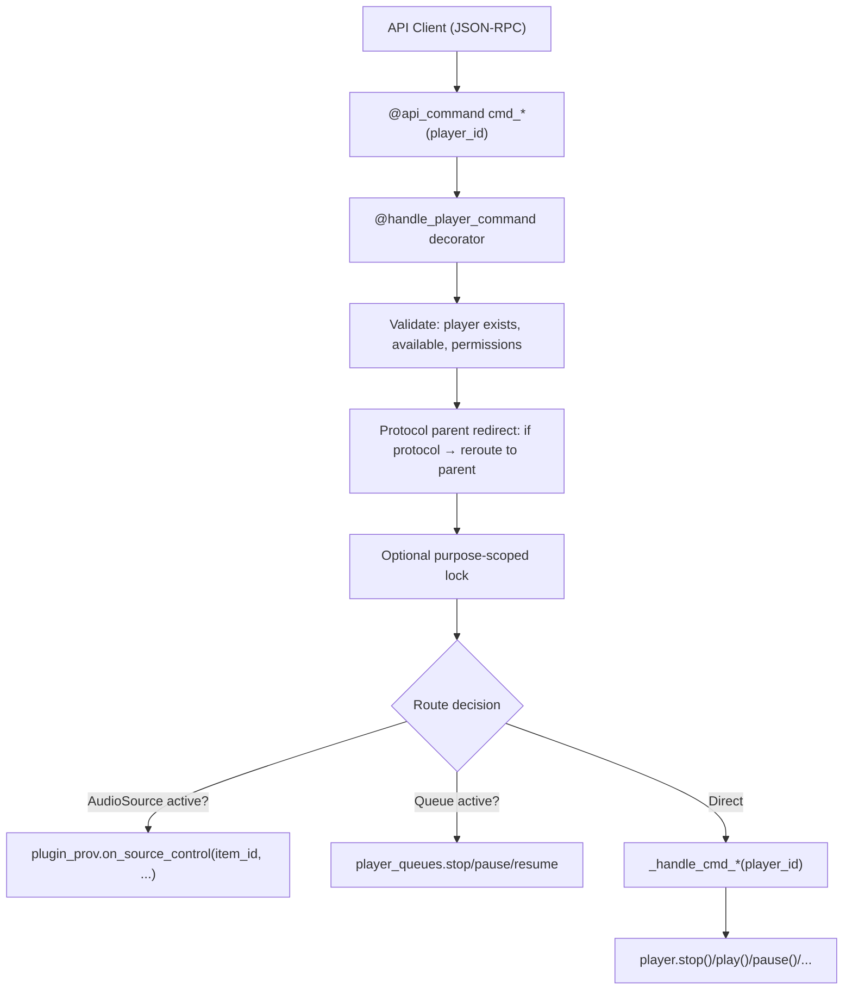

# The PlayerController

The `PlayerController` (`music_assistant/controllers/players/controller.py`, ~4900 lines) is the command routing hub between API consumers and player implementations. It handles player registration, command dispatch with two-tier routing (public API → private handler), protocol-aware redirection, power/volume/group management, polling, sleep timers, and concurrency control. It is assembled from three mixins, each owning one large concern that would otherwise swamp the controller module:

```python
class PlayerController(AnnouncementsMixin, AudioSourceMixin, ProtocolLinkingMixin, CoreController):
    domain = "players"
```

| Mixin | Module | Owns |
|---|---|---|
| `AnnouncementsMixin` | `players/announcements.py` | `play_announcement`, TTS rendering, pre-announce chime, volume/state save and restore |
| `AudioSourceMixin` | `players/audio_sources.py` | [Live `AudioSource` sessions](#live-audiosource-sessions) — the per-player record of an external source playing on a player |
| `ProtocolLinkingMixin` | `players/protocol_linking.py` | Matching, attaching and detaching protocol players; see [05-protocol-linking.md](05-protocol-linking.md) |

The [Player Controller README](../../music_assistant/controllers/players/README.md) is the in-tree companion, owning the module inventory and the provider-facing development guide.

## Registration Flow

### `register(player)`

Acquires `_register_lock` (serializes all registrations), then:

1. **Guard checks** — reject if the server is closing, the player is already registered, or the player is not enabled.
2. **MAC enrichment** — for non-GROUP/STEREO_PAIR players only. See [MAC Address Resolution](#mac-address-resolution) below.
3. **Fake power cache** — restores persisted fake power state from the cache controller, **except for GROUP players**.
4. **Store** — `self._players[player_id] = player`. This happens before the player is fully ready, because config fetching and protocol-link evaluation both need to find it in the controller; `initialized` is the flag that filters half-registered players out of `all_players()`.
5. **Initial state** — `player.update_state(signal_event=False)`, so `player.state` reflects the final attributes (notably `type`) that the subclass set after `super().__init__()`. Config entry resolution depends on `state.type`.
6. **Config application** — loads the `PlayerConfig`, calls `player.set_config()`, runs another `update_state(signal_event=False)`, persists the derived-transport edge via `_save_underlying_player_id()`, then awaits `player.on_config_updated()`.
7. **Protocol linking** — `self._evaluate_protocol_links(player)` to check for matching protocols.
8. **Finalization** — `player.set_initialized()`. For non-PROTOCOL players: signals `PLAYER_ADDED` and awaits `player_queues.on_player_register()`.
9. **Post-lock** — schedules `_schedule_update_all_players(2)`, because `can_group_with` on existing players may now expand to include the new one.

> **Group players deliberately do not restore fake power.** At boot there is no sync session yet, so a restored `powered=True` would leave the group in an inconsistent "active without a captured session" state, where children report an `active_group` that has no leader. Preserving a captured-group state across restarts would need explicit session restoration. The write side matches: `_handle_cmd_power` skips the cache write for GROUP players.

### MAC Address Resolution

Protocol linking matches players to physical devices largely by MAC address, and a provider's reported MAC is often not the one ARP sees. Registration therefore maintains two config values:

| Config key | Holds |
|---|---|
| `CONF_CACHED_ARP_MAC` (`cached_arp_mac`) | The ARP-resolved hardware MAC, so matching works immediately on the next restart even if ARP is slow or fails |
| `CONF_REPORTED_MAC` (`reported_mac`) | The provider's original MAC, when it differs from the resolved one |

The sequence: apply the cached ARP MAC to `device_info` if valid, call `enrich_device_mac_address()` to resolve the real hardware MAC (handling invalid, locally-administered, and missing MACs), then persist the result when it changed.

The reported MAC exists for devices with multiple interfaces (WiFi plus Ethernet), where ARP resolves one and the protocol advertises the other — keeping both enables multi-MAC matching. It is written to `extra_data["reported_mac"]` **and** persisted to config, and the stored value is cleared when it turns out to match the resolved MAC, so a stale entry cannot cause a false-positive match. On restart, the persisted value is restored into `extra_data` only when the provider did not supply a usable MAC of its own.

### `register_or_update(player)`

If the player ID is already registered, replaces the entry in `_players`. Otherwise calls `register()`.

### `unregister(player_id, permanent=False)`

1. Removes from the `_players` dict.
2. **Per-player cleanup** — drops the command lock for every `PlayerLockPurpose`, cancels any pending protocol evaluation, and clears the sleep timer. Without this, entries leak whenever players disappear (#3554).
3. Notifies `player_queues.on_player_remove()`.
4. Awaits `player.on_unload()`.
5. **If permanent**: cleans up group memberships, protocol links, and player config; signals `PLAYER_REMOVED`.
6. **If temporary** (provider reload): sets `state.available = False` directly; signals `PLAYER_UPDATED` with the `PlayerState` snapshot.
7. Schedules `_schedule_update_all_players()`.

## Command Routing

The controller uses a two-tier pattern for commands:

- **Public `cmd_*` / API methods** — decorated with `@api_command(...)` and often `@handle_player_command`. These are the JSON-RPC API surface. They handle validation, permission checks, logging, and routing decisions.
- **Private `_handle_cmd_*` methods** — contain the actual implementation logic for stop, play, pause, resume, power, and volume_set. They skip permission checks, locking, and redirect logic, which is what makes them safe to call from inside an already-locked command chain. Other commands (seek, next, previous, mute, grouping) route differently.



### The `handle_player_command` Decorator

Defined in `music_assistant/controllers/players/helpers.py`, this decorator wraps most command methods:

1. **Resolves player** from the `player_id` argument (positional or keyword).
2. **Availability check** — if the player is missing or unavailable, logs a warning and returns (no exception).
3. **Protocol parent redirect** — if the player has `protocol_parent_id` and that parent is registered, rewrites `player_id` to the parent. This ensures commands on hidden protocol players route to their visible parent.
4. **Permission check** — validates the current user's `player_filter` against the player ID, raising `InsufficientPermissions`.
5. **Optional locking** — see below.
6. **Error wrapping** — catches exceptions, re-raises as `PlayerCommandFailed`.

The decorator does **no rate limiting**. The per-player `Throttler(1, 0.05)` that used to wrap every command was removed in #4024 ("Drop redundant per-player throttler and harden the command lock") — it added latency to every command while the purpose-scoped locks already provide the serialization that actually matters.

`@handle_player_command(lock=PlayerLockPurpose.…)` wraps the command body in `get_player_lock(player.player_id, purpose)`. The argument is a `PlayerLockPurpose` member, not a boolean, and locks are keyed on `(purpose, player_id)` rather than on the function name — see [Per-Player Locking](#per-player-locking).

### `_get_player_with_redirect`

Separate from the decorator's protocol redirect, this method handles *playback* redirection for sync groups and active groups:

- If `player.state.synced_to` → redirect to the **sync leader**
- If `player.state.active_group` → redirect to the **group player**

Used by transport commands (`cmd_stop`, `cmd_play`, `cmd_pause`, `cmd_seek`, `cmd_next_track`, `cmd_previous_track`), the sleep timer commands, and `_handle_cmd_resume`. This ensures a play command on a group child ends up controlling the sync leader or group player.

### `play_media` and the Group Override

`play_media(player_id, media)` is not `@api_command`-exposed — it is the controller-internal entry point that `player_queues` and the announcement fallback drive. Unlike the transport commands it does **not** simply redirect to the leader, because an explicit "play this on this speaker" is usually an instruction to take the speaker *out* of whatever is holding it (#3947).

When the target player is captured (`synced_to` or `active_group` is set), the per-player `CONF_PLAY_MEDIA_OVERRIDES_GROUP` config value — **default `True`** — decides:

- **Override on:** `_release_player_for_play_media(player)` frees the player, then `_handle_play_media` runs on the player itself under its own `PLAYBACK` lock.
- **Override off:** falls back to the legacy behavior, `_get_player_with_redirect` sending the media to the leader or group player.

`_release_player_for_play_media` picks its strategy from *how* the player is captured, and in every branch waits (via `wait_for_player_update`, 5s) for the relevant state attribute to actually clear before returning — providers such as Sonos reject a `play_media` on a player whose local `synced_to` / `active_group` is still set, even after acknowledging the release:

| Captured as | Release strategy | Waits for |
|---|---|---|
| Sync member (`synced_to`) | `cmd_ungroup(player)` | `synced_to == None` |
| Dynamic group member | `cmd_set_members(group, player_ids_to_remove=[player])` | `active_group == None` |
| Static group member | The group must dissolve: `_handle_cmd_power(group, False)` when the group has a real power control and is powered, otherwise `_handle_cmd_stop(group)` | `active_group == None` |

The release step deliberately runs **outside** the `PLAYBACK` lock. `cmd_set_members` on a group takes `lock(group)` and then, through the sync group provider, `lock(sync_leader)`; holding `lock(player)` across the release would close an AB-BA cycle.

### API Scopes

Every `@api_command` on the controller declares a `required_scope` (#4613). The pattern is consistent enough to state once instead of per row:

| Scope | Applies to |
|---|---|
| `Scope.PLAYERS_READ` | `players/all`, `players/get`, `players/get_by_name`, `players/player_control(s)`, `players/sleep_timer/get` |
| `Scope.PLAYERS_CONTROL` | Every `players/cmd/*` route plus `players/sleep_timer/set` and `players/sleep_timer/clear` |
| `Scope.CONFIG_PLAYERS_WRITE` | `players/create_group_player`, `players/remove_group_player`, `players/remove` — these change the set of players that exists, not just their state |
| `Scope.LIBRARY_WRITE` | `players/add_currently_playing_to_favorites`, which writes to the library rather than to the player |

Scope enforcement happens in the API layer, not in these methods; see [19-authentication.md](19-authentication.md) for the scope model and [12-webserver-api.md](12-webserver-api.md) for where it is applied. It is distinct from the per-user `player_filter` check that `handle_player_command` performs, which restricts *which players* a user may touch rather than *which operations* they may perform.

### Full Command Surface

**Transport commands:**

| API route | Method | Implementation |
|---|---|---|
| `players/cmd/stop` | `cmd_stop` | Queue → `player_queues.stop` / else → `_handle_cmd_stop` |
| `players/cmd/play` | `cmd_play` | If not paused and queue exists → `player_queues.resume` / if paused → `_handle_cmd_play` (native unpause) |
| `players/cmd/pause` | `cmd_pause` | Queue → `player_queues.pause` / else → `_handle_cmd_pause` (AudioSource → active protocol → native pause → stop) |
| `players/cmd/play_pause` | `cmd_play_pause` | Dispatches to `cmd_pause` or `cmd_play` |
| `players/cmd/resume` | `cmd_resume` | → `_handle_cmd_resume` (handles source restore, auto-play) |
| `players/cmd/seek` | `cmd_seek` | AudioSource → `on_source_control(SEEK, position)` / queue → `queue.seek` / else → `player.seek` |
| `players/cmd/next` | `cmd_next_track` | AudioSource → `on_source_control(NEXT)` / queue → `queue.next` / else → `player.next_track` |
| `players/cmd/previous` | `cmd_previous_track` | AudioSource → `on_source_control(PREVIOUS)` / queue → `queue.previous` / else → `player.previous_track` |
| `players/cmd/shuffle` | `cmd_shuffle` | External source → `on_source_control(SHUFFLE)` / queue → `queue.set_shuffle` / else → `player.set_shuffle` |
| `players/cmd/repeat` | `cmd_repeat` | External source → `on_source_control(REPEAT)` / queue → `queue.set_repeat` / else → `player.set_repeat` |

**Shuffle and repeat are ordering commands that follow whatever is playing** (#5901, #5993). All three destinations are real: a live external source reorders within its own session, a source the *device* runs itself (its own Spotify Connect, a physical input) reorders its own content via `Player.set_shuffle` / `set_repeat`, and MA's queue reorders its own items. A player with nothing playing raises `PlayerCommandFailed` rather than silently doing nothing. `RepeatMode.UNKNOWN` is rejected with `InvalidCommand` — it is what a source *reports* when it cannot say, never a mode to set.

Both commands accept an optional **`source_id`** naming the source the caller aimed at. `_resolve_command_target` refuses the command if that source is no longer the one playing, so a command issued against a stale UI state can never land on whatever took the player over since. The same targeting applies to the transport commands.

**AudioSource proxying:** when an external source is playing on a player — a Spotify Connect session, an AirPlay receiver, a Yandex Ynison session — transport commands are proxied to the owning plugin provider rather than executed on the player, because the *upstream* service owns the transport. The source is resolved from the player's [live session](#live-audiosource-sessions), not from a queue item: `_get_active_audio_source(player)` calls `get_player_audio_source(_audio_source_owner(player).player_id)`, so a group member asking about its own transport resolves to the source playing on its leader. It returns `None` when no session exists or the owning plugin is gone. Each command additionally honors the per-source capability flag (`can_seek`, `can_next_previous`, `can_play_pause`, and now `can_shuffle` / `can_repeat`) and falls through to the normal path when the source cannot do it. See [11-plugin-system.md](11-plugin-system.md) for the `AudioSource` model.

`_handle_cmd_pause` benefits most from this (#4401). Its fallback chain is now: proxy `on_source_control(PAUSE)` to the AudioSource → delegate `pause()` to an active protocol player → call `player.pause()` directly when the player supports `PAUSE` and the active source reports `can_play_pause` → only then fall back to `_handle_cmd_stop`. Previously a pause on an external source always dropped through to stop, which tore the session down instead of holding it. `_handle_cmd_play` mirrors the chain for the unpause direction.

**Volume commands:**

| API route | Method | Implementation |
|---|---|---|
| `players/cmd/volume_set` | `cmd_volume_set` | Locked on `VOLUME` → `_handle_cmd_volume_set`, then invalidates the group volume snapshot for non-GROUP players |
| `players/cmd/volume_up` | `cmd_volume_up` | May redirect to group volume; steps → `cmd_volume_set` |
| `players/cmd/volume_down` | `cmd_volume_down` | May redirect to group volume; steps → `cmd_volume_set` |
| `players/cmd/volume_mute` | `cmd_volume_mute` | Resolves mute control (native/fake/delegate) |

**Group volume commands:**

| API route | Method | Implementation |
|---|---|---|
| `players/cmd/group_volume` | `cmd_group_volume` | `set_group_volume` → distributes to children via `_handle_cmd_volume_set` |
| `players/cmd/group_volume_up` | `cmd_group_volume_up` | Steps → `cmd_group_volume` |
| `players/cmd/group_volume_down` | `cmd_group_volume_down` | Steps → `cmd_group_volume` |
| `players/cmd/group_volume_mute` | `cmd_group_volume_mute` | `asyncio.gather` of `cmd_volume_mute` per member |

**Group membership commands:**

| API route | Method | Implementation |
|---|---|---|
| `players/cmd/set_members` | `cmd_set_members` | Redirects to an active group player, auto-ungroups a synced target, then takes the `PLAYBACK` lock → `_handle_set_members` |
| `players/cmd/group` | `cmd_group` | → `cmd_set_members(player_ids_to_add=[player_id])` |
| `players/cmd/group_many` | `cmd_group_many` | → `cmd_set_members` |
| `players/cmd/ungroup` | `cmd_ungroup` | Branches on how the player is grouped — see below |
| `players/cmd/ungroup_many` | `cmd_ungroup_many` | Loops `cmd_ungroup` |

For GROUP players (sync groups, universal groups), `_handle_set_members` delegates directly to the player's `set_members()` method. For regular players (ad-hoc sync), it proceeds to `_handle_set_members_with_protocols`, which translates user-visible player IDs to protocol player IDs before forwarding. See [06-grouping.md](06-grouping.md) for the complete two-phase pipeline.

`cmd_ungroup` is not a thin wrapper over `cmd_set_members`; it dispatches on the player's role:

| Target | Behavior |
|---|---|
| A GROUP player | Interpreted as "release the captured session entirely": powers the group off when it has a power control, otherwise stops it. This avoids the "cannot remove static member" error path when `transfer_queue` or Home Assistant's unjoin asks to release a group that has static members |
| A **static** member of a group | Recurses into the group-player branch above, since a static member cannot be released on its own |
| A dynamic or non-static group member | `cmd_set_members(group, player_ids_to_remove=[player_id])` |
| A sync member | `cmd_set_members(sync_leader, player_ids_to_remove=[player_id])` |
| A sync **leader** | Removes only itself, which lets `_handle_set_members` either transfer leadership to a remaining member (keeping playback alive) or dissolve the group and stop |
| Nothing of the above | Scans for any dynamic sync group still listing this player and removes it — an edge case that exists for the Home Assistant integration, which has only a single `unjoin` command and no `set_members` |

**Power:**

| API route | Method | Implementation |
|---|---|---|
| `players/cmd/power` | `cmd_power` | Locked on `PLAYBACK` → `_handle_cmd_power` |

**Other (source, sound mode, announcements, play_media):**

| API route | Method | Implementation |
|---|---|---|
| `players/cmd/select_source` | `select_source` | → `_handle_select_source` |
| *(internal — not `@api_command`-exposed)* | `deselect_source` | Stops the player so it does not fall through to another source. Called when an external source (plugin/receiver) disconnects — wraps `_handle_cmd_stop` and suppresses command/availability errors, since the source is already gone |
| *(internal — not `@api_command`-exposed)* | `play_media` | See [`play_media` and the Group Override](#play_media-and-the-group-override) |
| *(internal — not `@api_command`-exposed)* | `enqueue_next_media` | Locked on `PLAYBACK` → `_handle_enqueue_next_media`, which prefers an active protocol player with `ENQUEUE` support over the player itself. No group redirect |
| `players/cmd/select_sound_mode` | `select_sound_mode` | → `player.select_sound_mode` |
| `players/cmd/set_option` | `set_option` | → `player.set_option` (rejects unknown, unchanged, and read-only options) |
| `players/cmd/play_announcement` | `play_announcement` | See [Announcement Handling](#announcement-handling) |

## Power Management

Power is a unifying abstraction that the controller normalizes across diverse hardware. Some speakers have real power controls (amplifiers, receivers), some are always-on network devices (Chromecast, AirPlay), and some are virtual entities (sync groups, universal groups). The per-player `power_control` config selects which mechanism to use. Power is deeply intertwined with playback: powering off stops playback and ungroups; powering on can auto-resume the queue; and play-related commands auto-power the player before executing ("power-on demand"). See [03-player-model.md](03-player-model.md#resolution-chains) for how the final power state is resolved and [06-grouping.md](06-grouping.md#power-across-the-three-models) for how groups use power to manage member activation.

`_handle_cmd_power(player_id, powered, skip_auto_play=False)` resolves the power command through the `power_control` config chain:

1. **No-op** — if `player.state.powered == powered`, returns.
2. **Power off path** — for a player in `UNGROUP_ON_POWER_OFF_TYPES` (`PLAYER`, `STEREO_PAIR`) that is captured or is itself a sync leader, `cmd_ungroup` first. Powering off always stops the queue. Then, for a standalone player that was playing or paused, `_handle_cmd_stop` (awaiting a state update so the stop cannot race the power-off); or, for a sync leader, power off all its powered children in parallel.
3. **`PLAYER_CONTROL_NONE`** — returns (power not supported/disabled).
4. **`PLAYER_CONTROL_NATIVE`** — `await player.power(powered)`, then `wait_for_power_on()` when powering on.
5. **`PLAYER_CONTROL_FAKE`** — stores state in `extra_data[ATTR_FAKE_POWER]`. For a **GROUP** player it also awaits `player.power(powered)`, because the group must actually form or dissolve its session — without that call the toggle would only change cosmetic state while never capturing or releasing members. Persists to the cache controller for everything except GROUP players (see [Registration](#registration-flow)).
6. **External `PlayerControl`** — calls `control.power_on()` / `control.power_off()`, then `wait_for_power_on()` when powering on.
7. **Refresh** — `player.refresh_state()` so the UI reflects the change even when the device is slow to report.
8. **Auto-play on power on** — if `powered=True`, the player is neither grouped nor synced, `CONF_AUTO_PLAY` is enabled, the active source is the player's own queue (or unset), and no announcement is in progress, resumes the queue via `player_queues.resume()`.

> **Note (#3659):** Earlier versions of the controller forwarded power commands to a designated protocol player when `power_control` was a player ID. That forwarding has been removed — `power_control` now only accepts `NONE`, `NATIVE`, `FAKE`, or an external `PlayerControl` ID. Protocol players are no longer used as a delegated power target.

**Power-on demand**: Several command handlers (`_handle_play_media`, `_handle_cmd_play`, `_handle_set_members`) call `_handle_cmd_power(player_id, True, skip_auto_play=True)` before executing, ensuring the player is powered on before receiving playback commands.

`wait_for_power_on()` (in `helpers.py`) polls `player.powered` (or `player_control.power_state`) at 100ms intervals with a 5-second timeout. On timeout it logs at debug level — no exception raised.

## Volume Routing

Volume and mute follow the same control-chain pattern as power: the per-player `volume_control` and `mute_control` configs select which mechanism handles commands. Unlike power, volume and mute are **independent** — a muted player stays muted when its volume is changed (#5706), and the new level is simply what it will play at once it is explicitly unmuted. Fake mute is the exception, because it is simulated with the volume itself: there is no separate mute state to preserve, so a locked fake-muted player has its command forced to 0 to keep it silent. See [07-volume.md](07-volume.md) for the full algorithm, group volume delta mechanics, and the mute lock mechanism.

`_handle_cmd_volume_set(player_id, volume_level)` resolves through the `volume_control` config:

1. **GROUP type** — redirects to `cmd_group_volume`.
2. **Stay-silent check** — `_stays_silent_on_volume_change(player)` is true only for a player that holds an active mute lock, has `mute_control == FAKE`, *and* is currently fake-muted. In that case the level is forced to **0** and re-recorded as the volume target, since the lock may have been earned after the caller logged the level it asked for. Otherwise `extra_data[ATTR_FAKE_MUTE]` is popped.
3. **Scale to device range** — `scale_volume_to_device(player_id, volume_level)` maps logical 0–100 onto the configured min/max.
4. **AudioSource notification** — see below. Note this happens *before* the routing branch, not after it.
5. **`NATIVE`** — `player.volume_set(device_volume)`.
6. **`FAKE`** — stores the **logical** (unscaled) value in `extra_data[ATTR_FAKE_VOLUME]`, triggers `update_state()`.
7. **`NONE`** — raises `UnsupportedFeaturedException`.
8. **External `PlayerControl`** — `control.volume_set(device_volume)`.
9. **Protocol player** — `await protocol_player.volume_set(device_volume)` directly (#5697). This used to recurse back into `_handle_cmd_volume_set` for the protocol player; calling the protocol player's own setter avoids re-running the whole resolution chain (limits, mute lock, source notification) against a player none of it is configured on.

**Passing `device_volume` on redirect (#4461)** is deliberate for both delegating branches. The min/max limits are configured on the *user-facing* player; the external control and the protocol player have no limits of their own, so their own scaling is an identity pass-through. Forwarding the logical value instead would silently discard the configured range.

**AudioSource volume notification.** The notification goes to the plugin provider that owns the source playing on this player, resolved from its [live session](#live-audiosource-sessions) rather than from a queue item: `_notify_source_volume_change` looks up `get_audio_source_session(player.player_id)` and awaits `provider.on_volume_change(session.source_id, volume_level)`. Because sessions are per-player, a group member that merely *hears* the source has no session and therefore never notifies — which is what prevents a feedback loop of per-child callbacks reporting different values upstream. Group volume changes fire the callback once at the group level instead. [11-plugin-system.md](11-plugin-system.md) owns the `AudioSource` model; [07-volume.md](07-volume.md#audiosource-volume-callbacks) covers the callback contract.

**The mute lock cannot outlive its group.** `_has_active_mute_lock` requires both the `ATTR_MUTE_LOCK` flag *and* that the player is still grouped, since a lock is only ever earned inside a group. It also checks the protocol parent, because `cmd_volume_mute` stores the lock on the user-facing player while a volume command may arrive carrying the protocol player's ID (as happens during group volume changes).

**Group volume**: `set_group_volume()` applies snapshot-based interpolation. On the first adjustment it caches each powered child's current volume on the group player's `extra_data[ATTR_GROUP_VOLUME_SNAPSHOT]` as a reference; subsequent adjustments interpolate each child from its snapshot value toward 100 (when scaling up) or toward 0 (when scaling down). The snapshot is invalidated by `_invalidate_group_volume_snapshot` when a child's individual volume changes or when group membership changes. After all children are set, it fires the single group-level `on_volume_change` described above. See [07-volume.md](07-volume.md) for the full algorithm.

## Sleep Timers

A sleep timer stops playback on a player after a delay (#4432). The player model only carries the expiry timestamp; the controller owns scheduling and the API:

| API route | Method | Behavior |
|---|---|---|
| `players/sleep_timer/get` | `get_sleep_timer` | Returns `sleep_timer_expires_at` (a unix timestamp) or `None` |
| `players/sleep_timer/set` | `set_sleep_timer` | Validates `seconds > 0`, computes the expiry, stores it, and schedules `_handle_sleep_timer_expired` under a per-player `task_id`. Returns the expiry timestamp |
| `players/sleep_timer/clear` | `clear_sleep_timer` | Cancels the timer and clears the stored expiry |

All three resolve the target through `_get_player_with_redirect`, so setting a timer on a group child sets it on the leader or group player that is actually playing. Setting a timer twice replaces the pending task, because the shared `task_id` cancels the previous one.

On expiry the controller clears the stored value and calls `cmd_stop`. Every transition (set, clear, expire) signals `PLAYER_SLEEP_TIMER_UPDATED` with the new expiry (or `None`) as its data, suppressed for PROTOCOL players. Timers are also cleared when a player unregisters, and any outstanding timer task is cancelled during controller `close()`.

## Player Polling

`_poll_players()` is a background task started during `setup()` that runs on a 1-second tick:

- For each **playing, non-PROTOCOL** player: schedules `player_queues.on_player_update` with a 0.5-second debounce to update elapsed time.
- For each player with **`needs_poll=True`**: checks `poll_interval` against the last poll timestamp, calls `player.poll()` when due.
- Yields (`await asyncio.sleep(0)`) between players to avoid blocking the event loop.

## Announcement Handling

Announcements live in `AnnouncementsMixin` (`players/announcements.py`). `play_announcement(player_id, url=None, pre_announce=None, volume_level=None, pre_announce_url=None, message=None, tts_engine=None, language=None)` orchestrates the complex flow of interrupting playback, playing an announcement, and restoring state:

1. Sets `ATTR_ANNOUNCEMENT_IN_PROGRESS` (cleared in `finally`).
2. Resolves pre-announce chime URL from config or defaults.
3. **Group fan-out**: if the target is a GROUP and all members support `PLAY_ANNOUNCEMENT`, fans out to individual member announcements via `TaskManager`.
4. **Native path**: finds a control target with `PLAY_ANNOUNCEMENT` support, resolves announcement volume from config, calls `player.play_announcement()`.
5. **Fallback path** (`_play_announcement`): saves current sync/group/source/media state → ungroups if needed → stops playback → adjusts volume on members → plays announcement via `play_media` with streaming URL → waits for play/idle/duration → restores volume → restores sync/group/source or resumes.

**Announcements take a URL *or* text.** Since #5621/#5630, MA speaks announcements itself: pass `message` (optionally with `tts_engine` and `language`) instead of `url`, and the controller renders it through a TTS engine before anything else happens. The two are mutually exclusive — supplying both, or a `tts_engine`/`language` without a `message`, raises `PlayerCommandFailed` — and a `url` must still start with `http`.

**A spoken message is rendered once, up front.** `_render_announcement_message` resolves the engine (falling back to the one configured on the player controller via `CONF_ANNOUNCE_TTS_ENGINE`) and produces a URL, so everything downstream — including every member of a group fan-out — plays the resulting *audio* rather than re-speaking the text. Engine resolution goes through the shared `helpers/plugin_engines.py` selection layer; see [18-ai-and-mcp.md](18-ai-and-mcp.md#ai-and-tts-engines).

MA re-hosts announcement audio on its own stream server via `streams.get_announcement_url` so the pre-announce chime can be prepended and players that dislike HTTPS still work. When `pre_announce` is not specified it defaults from player config for a spoken message, or — for a URL — on the heuristic that the substring `"tts"` appears in it, which recognises an HA `tts_proxy` URL without chiming for arbitrary announcement audio. The render itself is shared across players announcing the same audio; see [10-streaming-pipeline.md](10-streaming-pipeline.md#announcements).

## Source Selection

`select_source(player_id, source)` manages the active source:

1. If `source is None`, defaults to `player_id` (the MA queue).
2. **Free the player if it is captured**, so an external source such as Spotify Connect or AirPlay can take over a grouped player. A **static** member of a permanent group cannot be removed individually, so the *group* is stopped and (if it has a power control) powered off; a dynamic member or a sync member is released with `cmd_ungroup`.
3. Delegates to `_handle_select_source`, which:
   - If switching away from a different source, stops current playback and waits for the state update.
   - If the source is a known queue ID → `set_active_mass_source(source)` and return.
   - **Legacy plugin-source compatibility**: the old API used a plugin provider's `instance_id` directly as the source string. Plugin sources are now first-class `AudioSource` media items played through `player_queues.play_media` (#3938), so a source that resolves to a `PluginProvider` is translated into that flow — but only when the provider exposes **exactly one** `AudioSource`, since the old API was always a 1:1 mapping. Multi-source providers raise, directing the caller to the explicit URI. This keeps old frontends, third-party scripts, and HA automations working.
   - Otherwise → requires `PlayerFeature.SELECT_SOURCE`, validates the ID against `state.source_list`, calls `player.select_source()`.

`AudioSource` internals are covered in [11-plugin-system.md](11-plugin-system.md); queue management in [09-player-queues.md](09-player-queues.md).

## Live AudioSource Sessions

An external source playing on a player used to be modelled as a `MediaType.AUDIO_SOURCE` **queue item**, which meant selecting one had to clear and rewrite the player's queue. That was the wrong shape: switching to Spotify Connect and back destroyed whatever the user had queued up, and every question about the live source ("what is it playing?", "can it seek?") had to be answered by inspecting a queue item. `AudioSourceMixin` (`players/audio_sources.py`, #5913/#5914) replaced it with a per-player session held in `_source_sessions`, keyed by `player_id`. **The queue is left completely intact.**

`AudioSourceSession` carries what the source is, who owns it, and what it reports about itself:

| Field | Meaning |
|---|---|
| `source`, `provider_instance_id` | The `AudioSource` and the plugin instance that owns it |
| `playback_session_id` | Identifies the *current selection* through pauses and stream reconnects; refreshed only on an explicit reselect |
| `stream_session_id` | Token of the stream request currently holding the claim; `None` until the first request, which makes it the record of whether this selection was ever streamed |
| `streamdetails`, `active_source_audio` | Resolved on the first stream request, and deliberately **not** cleared when a stream ends |
| `stream_metadata`, `stream_metadata_reported` | What the source says about itself. An adopted placeholder stays replaceable by a later one; something the source actually *reported* does not |
| `shuffle_enabled`, `repeat_mode` | The ordering the source reports for its own session; `None` means it has not said |

Two identifiers matter and are easy to confuse. `source_id` is `AudioSource.item_id` and is only **provider-scoped** — plugins freely reuse ids like `"main"` or a player id across instances — so anywhere a server-wide unique value is needed (notably a player's `active_source`) uses `source_uri` instead.

**Streamdetails outliving the stream is deliberate.** A paused external source keeps the player while its stream is torn down, so clearing them on stream end would lose the session's identity across an ordinary pause.

### Claiming and takeover

A source plays on **one player at a time**: two players both reporting it would let a command sent to the one that lost it drive the one that has it. `claim_audio_source_session(session, playback_session_id, stream_session_id)` is where that commits, and it runs only once the owning plugin has accepted the stream request:

- It returns `False` when the session is no longer the live one on its player (or its `playback_session_id` has moved on), and the caller must then not serve the stream.
- Eviction of the *previous* holder happens only on the **first** request for a selection (`stream_session_id is None`). A takeover that never gets a stream request therefore leaves the source untouched on the player that still has it, and a mere reconnect on the player already streaming does not steal the source from a player it is being handed to before that one has had its chance to start.

The rest of the mixin is the update surface plugins push through: `update_source_metadata`, `update_source_options` (shuffle/repeat), and `refresh_source`. `is_live_audio_source(source)` answers whether a given active-source string is a live session at all, and `release_provider_sources` drops every session belonging to a provider being unloaded.

## Concurrency Controls

| Mechanism | Scope | Purpose |
|---|---|---|
| `_player_command_locks` | Per `(PlayerLockPurpose, player_id)` `asyncio.Lock` | Serializes concurrent commands sharing the same purpose on the same player. See [Per-Player Locking](#per-player-locking) below for the re-entrant `get_player_lock` API |
| `_task_held_locks` | `weakref.WeakKeyDictionary` keyed on the `asyncio.Task` | Tracks which lock keys the current task already holds, making `get_player_lock` re-entrant |
| `_register_lock` | Global `asyncio.Lock` | Serializes all player registrations |
| `_delayed_evaluation_lock` | Global `asyncio.Lock` | Serializes delayed protocol evaluations (from `ProtocolLinkingMixin`) |

### Per-Player Locking

Player commands that must not race acquire a lock via the `get_player_lock(player_id, purpose=...)` async context manager. There are three purposes, defined in `players/constants.py`:

```python
class PlayerLockPurpose(StrEnum):
    PLAYBACK = "playback"
    VOLUME = "volume"
    GROUP_VOLUME = "group_volume"
```

`GROUP_VOLUME` is separate from `VOLUME` because a group volume change fans out into a `volume_set` on every member (#5692). Sharing one purpose would mean the group-level operation held the same lock its own children need, so `cmd_group_volume`, `cmd_group_volume_up` and `cmd_group_volume_down` take `GROUP_VOLUME` on the *group* player while each child independently takes `VOLUME` on itself.

The lock is **purpose-scoped**: commands with different purposes can run concurrently on the same player (a volume change alongside a power change), but two commands with the same purpose serialize. Lock keys are `f"{purpose.value}_{player_id}"`.

Three ways a command ends up under a lock:

| Mechanism | Commands |
|---|---|
| `@handle_player_command(lock=PlayerLockPurpose.PLAYBACK)` | `cmd_stop`, `cmd_resume`, `cmd_power`, `play_announcement`, `enqueue_next_media` |
| `@handle_player_command(lock=PlayerLockPurpose.VOLUME)` | `cmd_volume_set`, `cmd_volume_mute` |
| Acquired internally in the method body | `play_media` (decorated without a lock), `cmd_set_members` (not decorated at all), and the `cmd_group_volume*` family (`GROUP_VOLUME` on the group player) |

`cmd_power` is deliberately serialized on `PLAYBACK` rather than getting a purpose of its own: powering a sync or group player on *forms* the group and powering it off dissolves it, so it must not race with `play_media`, `cmd_resume`, or `cmd_set_members` on the same player. `cmd_set_members` acquires `get_player_lock(parent_player, PlayerLockPurpose.PLAYBACK)` around `_handle_set_members` for the same reason — a protocol switch must not interleave with a concurrent playback command.

The lock is **re-entrant per asyncio Task**: nested calls within the same task skip re-acquisition (preventing self-deadlock), while deferred callbacks (`call_later`, `create_task`) run in a fresh task and acquire the lock normally. Ownership lives in `self._task_held_locks`, a `weakref.WeakKeyDictionary` keyed on the task object — the weak reference means entries clear themselves if a task is garbage-collected before its `finally` block runs.

#### The lock timeout escape

`get_player_lock` never blocks indefinitely (#4024). Acquisition is two-stage:

1. Wait up to **5 seconds**. On timeout, log at debug level that acquisition is slow.
2. Wait up to **25 seconds** more. On timeout, log a warning and **run the body anyway, without the lock**.

The rationale is that a previous holder stuck on a dead provider socket would otherwise make the player permanently unresponsive. Proceeding unlocked after 30 seconds trades the (now unlikely) race for guaranteed responsiveness. The `finally` block only releases the lock when it was actually acquired.

## Player Config Interaction

The controller interacts with the `ConfigController` for player settings at several points:

- **Registration**: reads/writes cached MAC addresses, loads player config, applies config to player.
- **`on_player_config_change(config, changed_keys)`**: called when config is saved. Validates that the minimum volume does not exceed the maximum (raising `InvalidDataError`). If the player became disabled, powers it off or stops it. On an enable/disable transition it **cascades to linked protocol players** by saving their `enabled` flag to match — otherwise a disabled native parent would leave its protocols registered after a restart, where they fail to find their parent and get wrapped in a fresh Universal Player. Otherwise calls `player.set_config()` and `player.on_config_updated()`, and if any changed key has `requires_reload=True` while the queue is playing, stops and resumes it so the new config takes effect.
- **`on_player_dsp_change(player_id)`**: restarts the queue or stops/plays to apply DSP config changes.
- **`delete_player_config(player_id)`**: removes player config and DSP config from the config store.
- **Startup repair**: `_repair_protocol_parent_links` clears `protocol_parent_id` values pointing at configs that no longer exist, and heals a stale `player_type` left behind by an aborted registration (a valid parent link proves the player is a protocol child).
- **Weekly maintenance**: `_fix_group_member_configs` rewrites sync-group `CONF_GROUP_MEMBERS` entries that reference a protocol player ID instead of its visible parent, using the cached protocol-parent mapping.

Player config values are grouped into UI categories, which [02-configuration.md](02-configuration.md#playerconfig) owns the full inventory of:

| Category | Contents |
|---|---|
| `"generic"` | Icon, visibility, expose-to-HA, play-media preference |
| `"announcements"` | TTS pre-announce, chime URL, announce volume strategy and limits |
| `"player_controls"` | Power/volume/mute control sources, min/max volume, auto-play |
| `"protocol_generic"` | Codec, sample rates, flow mode, output channels, HTTP profile, ICY metadata |
| `"protocol_general"` | The preferred-output-protocol selector |
| `"protocol_{domain}"` | One per linked output protocol |

There is no player-level `"playback"` category any more: volume normalization and crossfade are now per-queue settings with global defaults, and the normalization *target* is a global `streams` setting. See [09-player-queues.md](09-player-queues.md#per-queue-configuration).

## Event Signaling

The controller signals several player events:

| Event | When | Data | PROTOCOL excluded? |
|---|---|---|---|
| `PLAYER_ADDED` | During `register()` | `Player` instance | Yes |
| `PLAYER_UPDATED` | Via `signal_player_state_update()` | `Player` instance (temporary unregister emits `PlayerState` snapshot instead) | Yes |
| `PLAYER_REMOVED` | During `unregister(permanent=True)` | `player_id` only | Yes |
| `PLAYER_CONFIG_UPDATED` | When `supported_features` or one of the three control strings changed | `PlayerConfig` | No — fires for all types |
| `PLAYER_OPTIONS_UPDATED` | When player options changed | `(previous, new)` options tuple | No — fires for all types |
| `PLAYER_SLEEP_TIMER_UPDATED` | On sleep timer set / clear / expiry | Expiry timestamp or `None` | Yes |

`PLAYER_CONFIG_UPDATED` firing on a feature change is a documented workaround, not a design choice: the Home Assistant integration only re-evaluates an entity's supported features on that event, and an in-code `TODO` marks it for removal once the integration also reacts to `PLAYER_UPDATED`.

The method also handles side effects, most of them gated on which keys actually changed so the hot path stays cheap: notifies `player_queues.on_player_update()` (0.5s debounce), schedules palette extraction for the current image and prefetches the next queue item's palette, triggers DSP reloads on group membership changes, detects external source takeover, and **enforces volume limits** when `volume_level` changes — if the player reports a device volume outside the configured min/max, `_enforce_volume_limits` schedules a corrective `volume_set`.

#### Position-only change sets

Because the `current_media` position anchor only moves on discrete events, a change set containing *nothing but* the anchor keys represents a position correction rather than a state change:

```python
POSITION_ANCHOR_KEYS = frozenset({
    "current_media.elapsed_time",
    "current_media.elapsed_time_last_updated",
})
```

When the change set reduces to those keys, `signal_player_state_update` returns without emitting anything — unless `force_update` is set, or the caller passed `media_position_jumped=True`, meaning the corrected position genuinely jumped (a seek, or a buffer correction reaching the current media) and consumers need to see the fresh value. See [03-player-model.md](03-player-model.md#position-anchors) for how the anchors are reconciled.

#### Membership cleanup

`_handle_membership_cleanup_on_state_change` detaches a player from its groups when a state change makes it uncontrollable, and is only entered when `available`, `enabled`, or `powered` actually changed:

- **Became unavailable or disabled** → `_cleanup_player_memberships` drops it from its parent group or leader directly, since it can no longer be commanded.
- **Powered off externally** (#4463) → an explicit `True → False` transition on a player whose type is in `UNGROUP_ON_POWER_OFF_TYPES` (`PLAYER` and `STEREO_PAIR`, #6074) and that is synced, grouped, or is itself a sync leader triggers `cmd_ungroup`. This covers a linked power control being switched off outside of MA: the player is still reachable, so routing through `cmd_ungroup` also transfers leadership when it was the leader. Players without power control (`powered is None`) are left alone. An external power-off additionally ends the player's queue after a short delay, so a device switched off at the wall does not leave a queue sitting mid-playback.

### State Update Fan-Out

Beyond emitting events on the bus, every player state update is fanned out by the controller through three complementary mechanisms:

1. **Hook propagation to related players** (`_forward_state_update`): when a player updates, the controller calls the appropriate hook (`on_group_updated`, `on_sync_parent_updated`, `on_group_member_updated`, `on_protocol_parent_updated`, `on_protocol_player_updated`) on every related player. See [03-player-model.md](03-player-model.md#update-notification-hooks) for the hook surface. A caller can suppress this with `skip_forward=True`.

    *Known limitation:* the fan-out is not change-aware. It notifies every relative regardless of whether any of them derive anything from the fields that changed, and an in-code `TODO` notes that fixing it needs reverse indexes for `synced_to` and `active_group` first. The default hook implementations route through `trigger_player_update`, whose 0.25s debounce and dirty-flag check absorb most of the redundant work.
2. **Internal subscribers** (`subscribe_player_state_update` / `_dispatch_state_update_subscribers`): callers can register a synchronous callback receiving `(Player, changed_values)` where `changed_values` maps attribute name to a `(previous, new)` tuple. `subscribe_player_state_update` returns an unsubscribe function. Used by long-running commands that need to know exactly when a state attribute flips, distinct from the event-bus subscribers that get the full `PLAYER_UPDATED` event payload.
3. **Async wait helpers** (`wait_for_player_update`, `_wait_for_playback_state`): `wait_for_player_update(player_id, attribute_name=..., attribute_value=..., timeout=...)` is an `asynccontextmanager` that subscribes on entry, runs the body (which typically triggers the awaited update), then waits for the matching update on exit. Skips the wait if the value already matches at entry, and logs at debug level rather than raising on timeout. `_wait_for_playback_state` builds on it for the common "wait until PLAYING/IDLE" case.

There is also a fourth, narrower path. `on_player_position_jumped(player)` is called by a `Player` whose corrected playback position moved outside normal progression. It is not an event: it re-bases the active queue's timing via `player_queues.on_player_elapsed_time_corrected()`, triggers a debounced update of the player itself, and runs `_forward_state_update` with an empty change set so relatives re-derive their positions. The follow-up state update emits the actual event.

Finally, when `group_members`, `synced_to`, or `available` changed, the controller schedules a debounced update (2s) of **every player in the same provider**, because calculated cross-player fields like `can_group_with` may have changed for all of them.

## Key Files

| File | Description |
|---|---|
| [`music_assistant/controllers/players/controller.py`](../../music_assistant/controllers/players/controller.py) | `PlayerController` — registration, command routing, polling, power/volume, sleep timers (~4900 lines) |
| [`music_assistant/controllers/players/audio_sources.py`](../../music_assistant/controllers/players/audio_sources.py) | `AudioSourceMixin`, `AudioSourceSession` — [live source sessions](#live-audiosource-sessions), claiming and takeover |
| [`music_assistant/controllers/players/announcements.py`](../../music_assistant/controllers/players/announcements.py) | `AnnouncementsMixin` — `play_announcement`, TTS rendering, chime, save/restore |
| [`music_assistant/controllers/players/helpers.py`](../../music_assistant/controllers/players/helpers.py) | `handle_player_command` decorator, `AnnounceData` TypedDict, `wait_for_power_on` |
| [`music_assistant/controllers/players/constants.py`](../../music_assistant/controllers/players/constants.py) | `PlayerLockPurpose` (`PLAYBACK`, `VOLUME`, `GROUP_VOLUME`) |
| [`music_assistant/controllers/players/protocol_linking.py`](../../music_assistant/controllers/players/protocol_linking.py) | `ProtocolLinkingMixin` — protocol linking logic and `_get_control_target`. See [05-protocol-linking.md](05-protocol-linking.md) |
| [`music_assistant/controllers/players/README.md`](../../music_assistant/controllers/players/README.md) | In-tree companion: module inventory, protocol-linking developer guide |
| [`music_assistant/models/player.py`](../../music_assistant/models/player.py) | `Player` class — the model the controller manages. See [03-player-model.md](03-player-model.md) |
| [`music_assistant/models/protocol_backed_player.py`](../../music_assistant/models/protocol_backed_player.py) | `ProtocolBackedPlayer` — shared base for players that delegate to linked protocols. See [03-player-model.md](03-player-model.md#protocol-backed-players) |
| [`music_assistant/models/player_provider.py`](../../music_assistant/models/player_provider.py) | `PlayerProvider` base class that providers implement |
| [`music_assistant/helpers/player.py`](../../music_assistant/helpers/player.py) | `get_default_player_icon` — default icon per player type, provider and model |
