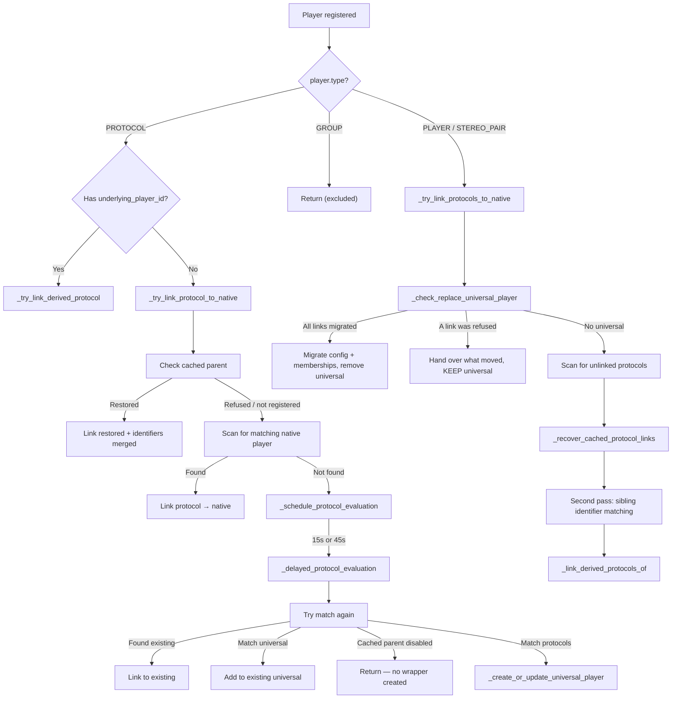

# Multi-Protocol Device Merging

A single physical audio device often exposes multiple streaming protocols — a Samsung soundbar might appear as an AirPlay endpoint, a Chromecast target, and a DLNA renderer simultaneously. Without protocol linking, a user would see three separate players in the UI for one device. The `ProtocolLinkingMixin` solves this by detecting that these endpoints belong to the same physical device and merging them under a single visible player.

Two in-tree READMEs are the companions to this document: the [Player Controller README](../../music_assistant/controllers/players/README.md) owns the provider-facing development guide and identifier-population rules, and the [Universal Player README](../../music_assistant/providers/universal_player/README.md) covers the wrapper from a user's perspective. This document covers the linking flows, their outcomes, and the invariants they maintain.

## The ProtocolLinkingMixin

`ProtocolLinkingMixin` (`music_assistant/controllers/players/protocol_linking.py`, ~3130 lines) is mixed into `PlayerController`:

```python
class PlayerController(ProtocolLinkingMixin, CoreController):
```

The mixin expects these attributes/methods on `self` (declared in a `TYPE_CHECKING` block):

- `mass: MusicAssistant`
- `_players: dict[str, Player]`
- `_pending_protocol_evaluations: dict[str, asyncio.TimerHandle]`
- `_delayed_evaluation_lock: asyncio.Lock`
- `logger: logging.Logger`
- `all_players(...)` — get all registered players
- `get_player(player_id)` — get a single player
- `unregister(player_id, permanent)` — remove a player

These are all provided by `PlayerController`, initialized in its `__init__`.

## Identifier Matching

The core matching function `_identifiers_match(player_a, player_b)` determines whether two players represent the same physical device. It checks identifiers in a strict reliability hierarchy:

### Hierarchy (strong identifiers)

Checked in this order — first match wins:

| Priority | IdentifierType | Notes |
|---|---|---|
| 1 | `MAC_ADDRESS` | Most reliable. Invalid MACs are skipped. Matching uses `normalize_mac_for_matching()` (clears the locally administered bit so AirPlay-modified MACs match hardware MACs). Also checks `extra_data["reported_mac"]` for multi-MAC unions. |
| 2 | `SERIAL_NUMBER` | Direct string comparison |
| 3 | `UUID` | Direct comparison, with special handling for Sonos (`RINCON_..._MR` suffix) |
| 4 | `CAST_UUID` | Chromecast-specific stable ID |
| 5 | `AIRPLAY_ID` | AirPlay-specific stable ID |

### Last resort — IP_ADDRESS

If no strong identifier matched, falls back to IP address with conservative rules:

- If **both** players have valid, non-locally-administered MACs, IP matching is **not used** unless at least one side is a protocol or universal player. This prevents false matches between unrelated devices that happen to share an IP (e.g. two software players on the same host).
- If at least one side lacks a reliable MAC, same IP → match.

### Same-domain exclusion

Players from the **same protocol domain** (same `provider.domain`) are never matched as belonging to the same device — even with identical identifiers. This is enforced at the call sites, not inside `_identifiers_match`. It handles the case of multiple software instances (e.g. two Squeezelite clients, two Sendspin web players) running on the same host.

The method's signature still carries a third `protocol_domain: str = ""` parameter, which several call sites pass but the body never reads — a leftover from when the exclusion was intended to live inside the method. It has no effect on matching.

### `player_id` as fallback device key

Players without any identifiers (like some Sendspin clients) use `player_id` as the device key when creating Universal Players via `_get_device_key_from_players()` in the Universal Player provider. This is not identifier matching per se — it ensures these players still get a consistent Universal Player wrapper.

## The Three Linking Flows

Protocol linking is triggered by `_evaluate_protocol_links(player)`, called during player registration. It branches on the player's type:



Note that `STEREO_PAIR` follows the native-player branch: only `GROUP` returns early. A player registering with a non-protocol type also has any leftover persisted `protocol_parent_id` cleared, so the startup repair pass cannot heal its type back to `PROTOCOL` — the case that matters is a Sendspin bridge client that later becomes a standalone web player.

### Flow 1: Protocol player registers, native player already exists

`_try_link_protocol_to_native(protocol_player)`:

1. **Derived transport shortcut** — if the player declares an `underlying_player_id` it resolves strictly through that edge; see [Derived Transports](#derived-transports).
2. **Cached parent check** — `_get_cached_protocol_parent_id()` reads `CONF_PROTOCOL_PARENT_ID` from config. If set, `_try_restore_cached_parent()` attempts an immediate restore (below).
3. **Scan for native match** — `_try_link_to_existing_player()` iterates all non-PROTOCOL, non-GROUP players. Checks, in order:
   - Universal players: whether this protocol is in the wrapper's stored `_protocol_player_ids`, or `_identifiers_match()` for a protocol the wrapper hasn't seen before
   - Cached `CONF_LINKED_PROTOCOL_IDS` (fast path on restart)
   - `_identifiers_match()` (identifier comparison)
   - `_match_via_linked_protocols()` — "sibling matching": whether any protocol *already linked* to the candidate shares identifiers with the new one. This covers native players (HEOS, for instance) that carry no MAC or serial of their own but have an AirPlay child that does share identifiers with an incoming Sendspin bridge.
4. **If matched** — `_add_protocol_link()` links the protocol to the parent.
5. **If no match** — `_schedule_protocol_evaluation()` to try again after a delay.

Every step here treats a link as *possibly refused* and re-checks `protocol_player.protocol_parent_id` afterwards rather than assuming success — see [Domain Slots and Link Refusal](#domain-slots-and-link-refusal).

#### Restoring a cached parent

`_try_restore_cached_parent()` returns `True` only when the protocol ended up parented; the caller falls through to a fresh scan otherwise. It does more than re-establish the pointer:

1. **Guard** — if the cached parent turns out to be a GROUP player, the cached ID is cleared and the restore is abandoned.
2. **Link** — if the parent already lists this protocol among its `linked_output_protocols` (an earlier call got there first), only `set_protocol_parent_id` is needed; otherwise `_add_protocol_link()` runs and may be refused.
3. **Merge identifiers into a universal parent** — when the restored parent is a Universal Player, every identifier on the protocol player is copied into the wrapper's `device_info`. This matters because the wrapper's persisted identifiers are a snapshot: an ARP-resolved MAC discovered since the last save would otherwise be missing, and a newly arriving protocol (a Sendspin bridge, typically) would fail to match the wrapper.
4. **Refresh generic device info** — `_update_universal_device_info()` fills in `model` / `manufacturer` on the wrapper when it still holds the placeholder values (`"Universal Player"` / `"Music Assistant"`) and the protocol player knows real ones.
5. **Re-check for a merge** — `_check_merge_universal_players()`. The identifiers just merged in can make this wrapper match a *different* wrapper; see [Merging Two Universal Players](#merging-two-universal-players).

If the cached parent is not registered at all, the protocol player is deliberately left **unparented** so the caller schedules a delayed evaluation. Pointing it at a dangling ID would strand it.

### Domain Slots and Link Refusal

A parent holds at most one active link per protocol domain, and `_add_protocol_link()` **refuses** rather than replaces when that slot is taken. `_parent_has_active_protocol_from_domain()` decides: a *registered* player from the domain occupies the slot even when it is unavailable, on the grounds that being offline does not make it a different device — the provider is expected to unregister stale players explicitly.

The refusal exists because a second instance of the same protocol on one host (two Snapcast clients, two Sendspin web players) is a separate logical player, not a second path to the same device. Silently replacing the first link would orphan it. The consequence is that link refusal is a normal outcome threaded through the whole module: callers check whether `protocol_parent_id` was actually set and fall through to the next candidate, and `ensure_universal_player_for_protocols` splits domain-duplicates into their own wrapper keyed on `up{player_id}`.

`_add_protocol_link()` also refuses to link a player to itself, and finishes by calling `_link_derived_protocols_of()` on the freshly linked protocol, so a bridge riding on it can join the same parent immediately.

### Flow 2: Protocol player registers, no native player yet

`_schedule_protocol_evaluation(player_id)`:

- Cancels any prior pending evaluation for this player.
- **Delay**: 45 seconds if a cached parent ID exists but that parent is not yet registered (gives the parent time to come up). Otherwise **15 seconds** (allows time for other protocols on the same device to register).
- Schedules `_delayed_protocol_evaluation(player_id)` via `mass.loop.call_later`.

`_delayed_protocol_evaluation(player_id)`:

1. Acquires `_delayed_evaluation_lock` to serialize evaluations. Multiple protocols from the same device may fire concurrently and would otherwise race.
2. Bails if the player was already linked or unregistered during the delay, **or if it changed type** while pending — a player that re-registered as a regular player must never be linked as a protocol or wrapped.
3. Derived transports resolve via their underlying player and return.
4. Tries `_try_link_to_existing_player()` one more time.
5. Tries `_find_matching_universal_player()` → `_add_protocol_to_existing_universal()`.
6. **Refuses to create a wrapper when the cached parent config exists but is disabled.** The user explicitly turned that device off; surfacing its protocols as a separate player would defeat that intent (#3993).
7. Tries `_find_matching_protocol_players()` → `_create_or_update_universal_player()`.

`_find_matching_protocol_players()` collects same-device siblings to seed the wrapper, skipping players that are already parented, from the same protocol domain, or **derived** — a derived transport follows its underlying player once that is linked and never seeds a wrapper of its own.

`_create_or_update_universal_player(protocol_players)`:

- Filters out players that got linked during the async delay.
- Resolves the `UniversalPlayerProvider`.
- Calls `universal_provider.ensure_universal_player_for_protocols(protocol_players)`, which locks per device key, adds joinable protocols to any existing wrapper, and creates separate `up{player_id}`-keyed wrappers for domain-duplicates.
- Links the remaining protocols via `_link_protocols_to_universal()`, routing any player that got its own separate wrapper to that wrapper instead.

### Flow 3: Native player registers after a Universal Player exists

When a native player (e.g. Sonos) registers via `_try_link_protocols_to_native()`, the method first calls `_check_replace_universal_player(native_player)`:

1. Skips if the native player itself is a Universal Player (prevents self-replacement).
2. Scans all Universal Players for a match — by identifiers, **or** because the native player's own ID appears in the wrapper's stored `_protocol_player_ids`. The second condition handles a player that changed type (a Sendspin web player going from `PROTOCOL` to `PLAYER`) and has no identifiers to match on.
3. Attempts to transfer every protocol link to the native player. Each transfer clears the protocol's parent, calls `_add_protocol_link()`, and then checks whether it actually landed. **A refused link is handed straight back to the wrapper** with `set_protocol_parent_id(player.player_id)`.
4. Branches on whether everything moved (below).

#### The takeover is not unconditional

The universal player does **not** always disappear (#4413). If any *active* protocol failed to move — `active_protocol_ids - moved_protocol_ids` is non-empty, typically because the native player already holds an active link from that domain — the wrapper is **kept**:

- Only the protocols that actually moved are migrated to the native player (`_migrate_protocol_ids_to_parent`) and removed from the wrapper (`_remove_protocol_ids_from_parent`).
- The refused protocols stay owned by the wrapper rather than being orphaned.
- Both players coexist, and a later evaluation can resolve the remainder.

When every active link moved, the full replacement runs: cached-only protocol IDs (disabled or temporarily unavailable protocols that exist only in the parent's cache) are migrated alongside the active ones so the obsolete parent's cleanup cannot wipe them, the wrapper's config and group memberships are carried over, and the wrapper is stopped and permanently unregistered.

One id is explicitly excluded from the migration: the native player's own. A device that kept its ID across a type change lists itself among the wrapper's protocols, and it must neither become its own protocol child nor be left in the wrapper's list — where the permanent cleanup would treat it as an orphaned protocol and immediately re-wrap it in a fresh Universal Player.

#### Preserving user state across a replacement

A replacement or merge changes which `player_id` the user's device lives under, so anything the user configured has to follow it (#4921, #4929, #4931). Two helpers run *before* the permanent removal, while the obsolete config still exists:

**`_migrate_universal_player_config(universal_id, native_id)`** copies, without overwriting anything explicitly set on the native player:

| Carried over | Rule |
|---|---|
| Custom display name | Only an actual user rename (`name != default_name`), and only when the native player has no custom name of its own |
| Player config values | Every key except `UNIVERSAL_PLAYER_INTERNAL_CONF_KEYS` (the wrapper's own bookkeeping: protocol links, parent id, underlying player id, device identifiers/info, cached and reported MAC) and stale virtual mirrors of a protocol player's config |
| DSP settings | Wholesale, unless the native player already has its own |
| Per-queue settings | Key by key; the source queue config is then removed, since permanent unregister does not cover it |

If any player-config value moved, `_reapply_player_config()` reloads the stored config onto the already-registered native player and signals `PLAYER_CONFIG_UPDATED` — the native player's config was loaded *before* the carry-over, so a migrated custom name would otherwise not take effect until restart.

**`_update_group_memberships(old_id, new_id)`** rewrites `CONF_GROUP_MEMBERS` and `CONF_ALLOWED_MEMBERS` on every other player's config, replacing the removed ID with its successor and de-duplicating. A registered player's in-memory config copy is patched too, so the change is visible without a reload. Without this, a sync group containing the device would silently lose that member.

Finally `_stop_and_unregister()` stops playback before the permanent removal. While the obsolete wrapper is not idle, its protocol child keeps playing the dead queue's stream until the buffer drains. Queue ownership is deliberately *not* transferred.

### Exclusive Ownership and Teardown

Three helpers keep the topology consistent when players change role or disappear:

**`_evict_protocol_from_other_parents(protocol_player_id, parent_id)`** (#5801) enforces that a protocol has exactly one owner. When a protocol player gets a new parent, any *other* parent still holding an **active** entry for it is out of date, so its stored ownership is dropped too. Parents that had already given up the active entry keep theirs, so they can still offer the protocol for re-enabling later — the distinction is between a stale claim and a remembered option.

**`_cleanup_player_type_transition(existing, becomes_protocol=…)`** (#5546) releases the topology a player owned before its type changed — a device that was a native parent and is now a protocol endpoint, or vice versa. When a player *leaves* the protocol role it falls back to the **persisted** parent id if the live link is already gone, since a provider may announce the new type with the link dropped and would otherwise leave an unreachable parent behind.

**`_detach_protocol_children(parent_id)`** (#5787) covers removal paths where the parent is not unregistered first — its provider being unloaded, for instance — so there is no parent object left to enumerate its own children. It scans for PROTOCOL players pointing at that parent, falling back to the cached parent id for a protocol player that was still waiting for a parent that never registered. The result is that removing a parent re-evaluates its children rather than silently wrapping them.

The same startup path exists in the provider: `UniversalPlayerProvider._restore_player()` detects a stored wrapper whose protocols are claimed by a native player's config, re-points those protocols with `_reparent_protocols_to_native()`, and — when the wrapper is not currently registered — runs the same config migration and membership re-pointing before deleting the wrapper's config, so it does not linger as a permanently unavailable entry in the settings UI.

### Merging Two Universal Players

`_check_merge_universal_players()` handles the case where a wrapper gains identifiers (typically a MAC that arrived via ARP) that now match a *different* wrapper — a DLNA-seeded wrapper discovering it is the same device as an AirPlay-seeded one.

- **Shared domains block the merge.** If both wrappers have links from the same protocol domain, they are treated as separate devices that merely share an IP (several Squeezelite players on one VM), because merging would orphan one instance's protocol.
- **The wrapper with more protocol links absorbs the other.** Ties break deterministically on the lower `player_id`. That tiebreak matters: without it the winner depends on dict iteration order, which can shift between runs and reshuffles player IDs — breaking entity bindings in consumers like the Home Assistant integration.
- Links are transferred with the same refusal-aware loop as a native replacement, cached-only ownership is migrated, identifiers are merged, and the loser's config and group memberships are carried over before it is stopped and unregistered.
- Only **one** merge runs per call; cascading merges are picked up by a later re-evaluation.

## Derived Transports

Identifier matching answers "are these two endpoints the same device?". It cannot answer "is this endpoint a *second, bridged* path through an endpoint I already have?" — and that is exactly what a **Sendspin bridge** is (#4596).

A bridge exposes a player of another protocol as an external Sendspin client, so a device that speaks only AirPlay or Chromecast can still take part in Sendspin's synchronized playback. The bridge is not an independent route to the hardware: it *runs inside* the AirPlay or Chromecast session it rides on, and can only exist while that base player exists and is enabled.

### `underlying_player_id` and `derived_from`

Bridged players declare `underlying_player_id`: the ID of the player they ride on. That single field replaces identifier matching for them, which is both more accurate and cheaper:

- `_try_link_derived_protocol()` attaches the derived player to the **parent of** its underlying player — or to that player itself when the underlying player is not a protocol player. It refuses if the underlying player is unregistered, has no parent yet, or the parent is a GROUP player.
- `_link_derived_protocols_of(player)` runs after any player is linked or registered natively, picking up derived players that registered *before* their underlying player had a parent. `_add_protocol_link()` calls it on every newly linked protocol, and `_try_link_protocols_to_native()` calls it for bridges riding directly on the native player.
- Derived players are skipped by `_find_matching_protocol_players()`, never seed a Universal Player, and never go through delayed identifier evaluation.

On the parent side, the resulting `OutputProtocol` entry carries **`derived_from`** (#4609), holding the `output_protocol_id` of the base output — normalized to `"native"` when the bridge rides on the parent player itself. A Sendspin bridge on a Sonos speaker's AirPlay protocol records that AirPlay player's ID; a bridge riding on the Sonos player directly records `"native"`. This is what distinguishes a derived transport from a natively discovered protocol in the API and the UI: without it, a Sendspin entry would look like an independent third path to the device.

`derived_from` is resolved from the live player when it is registered and from the persisted `CONF_UNDERLYING_PLAYER_ID` otherwise, so a derived output keeps its base reference even while unregistered. `_save_underlying_player_id()` persists the edge on registration and **clears** it when the player is no longer derived — a bridge client that turned into a standalone web player.

### Bridge Lifecycle

`SendspinBridgeManagerBase` (`providers/sendspin/bridge_manager.py`) reconciles bridge existence in one place; providers subclass it and supply only policy (`_should_have_bridge`) and a factory (`_create_bridge`). Participating providers today are `airplay`, `chromecast`, and `msx_bridge`.

`evaluate_bridge(player)` is idempotent and converges on a desired state: a bridge exists if and only if provider policy wants one *and* the lifecycle allows it — the Sendspin server is available, the player is the currently registered instance, the base player is enabled, and the bridge client itself is enabled. The manager subscribes to `PLAYER_CONFIG_UPDATED` and `PROVIDERS_UPDATED`, so disabling the base player tears the bridge down and re-enabling it rebuilds one. A bridge bound to a replaced Sendspin server (after a provider reload) is detected as stale and rebuilt.

Two subtleties worth knowing:

- **Bridge clients can be disabled independently** of their base player, and that disable is respected by the lifecycle check.
- **`_heal_stale_client_disable()`** re-enables a bridge client whose disabled state has outlived the parent it was disabled under. Bridge client IDs are MAC-derived and outlive UUID-derived parent IDs, so without this the client would stay disabled with no UI toggle left to undo it.

A bridge can also be **claimed** rather than created: `_try_claim_existing()` lets a provider adopt an external Sendspin client that connected on its own (a JS Cast receiver reconnecting before the Chromecast bridge could register). The claim attaches the bridge's protocol-specific identifiers, restores `PlayerType.PROTOCOL` semantics on the player, and sets `underlying_player_id` to establish the derived edge.

### Consequences elsewhere

- **Output protocol selection** treats a derived transport like any other linked protocol, ordered by `PROTOCOL_PRIORITY` — `sendspin` sits at 40, below AirPlay and Chromecast, so a bridge is normally chosen only when the base protocol is unsuitable or the user prefers it.
- **Sync group `active_source` filtering** has to account for bridges: a player streaming through a Sendspin bridge may report the *bridged* protocol (`airplay`, `cast`, `network`) as its active source. The sync group's `active_source` property filters that case out explicitly, and the controller's external-source-takeover check treats it as normal rather than a takeover. See [06-grouping.md](06-grouping.md#state-delegation).

## UniversalPlayer

The `UniversalPlayer` (`music_assistant/providers/universal_player/player.py`) is a virtual player created for devices without native vendor support. It wraps one or more protocol players.

**Key characteristics:**

- Inherits the base `PlayerType.PLAYER` (not GROUP, though config creates the entry with `player_type=PlayerType.GROUP` for UI reasons).
- **`available`** — true if any linked protocol player is `available_for_playback`, i.e. reachable *and* not awaiting setup. A wrapper whose only protocol is an unpaired AirPlay receiver is therefore unavailable, not silently broken.
- `_attr_supported_features` starts empty — all capabilities come from linked protocols via `__final_supported_features`.
- Does **not** have `PLAY_MEDIA` natively — delegates playback to protocol players via the output protocol selection mechanism.
- Maintains `_protocol_player_ids` internally; `add_protocol_player()` / `remove_protocol_player()` modify this list.

### Setup Propagation

Because `available` gates on `available_for_playback`, an unusable protocol child would leave the wrapper simply "unavailable" with no explanation. The wrapper therefore forwards the reason:

- **`needs_setup`** — when the wrapper is unavailable, returns `True` if any *connected* protocol child reports `needs_setup`.
- **`setup_reason`** — the same child's reason slug, so the UI can say "pairing required" on the visible player rather than on a hidden protocol child the user cannot see.

This is what makes a freshly discovered unpaired device actionable: the wrapper appears with a setup indicator, and `config/flows/setup_player` on it delegates to the protocol child's own flow. See [Pairing and Setup](#pairing-and-setup) below.

### External Source Passthrough

A Chromecast or DLNA endpoint can be playing something Music Assistant did not start — Spotify Connect, a TV app. When no output protocol is active and such a child reports a source in `EXTERNAL_SOURCES` while not IDLE, the wrapper mirrors that child wholesale: `playback_state`, `elapsed_time`, `current_media`, `active_source`, and `source_list` all come from it, and `stop` / `play` / `pause` / `next_track` / `previous_track` / `seek` are forwarded to it.

`supported_features` is narrowed to `FORWARDED_FEATURES` ∩ the child's features during passthrough — `PAUSE`, `SEEK`, `NEXT_PREVIOUS`. Volume and mute are deliberately excluded, since the base `Player` already resolves those to a protocol player through the control chain. Only `chromecast` and `dlna` participate (`EXTERNAL_SOURCE_PROTOCOLS`), and Chromecast wins when both qualify because DLNA metadata is less reliable.

Separately, `current_media` surfaces the *active output protocol* player's raw `current_media` while MA is streaming through it, so a consumer of the wrapper's raw value — a sync group mirroring it as leader — can still resolve the queue item. Reading the child's `.state` there would route back through the wrapper's own `__final_current_media` and lose the queue item ID.

**Provider lifecycle** (`UniversalPlayerProvider`):

- `discover_players()` — restores persisted Universal Players from config on restart, including disabled and unavailable ones.
- `_restore_player()` — reconciles the stored member list against the parent links persisted on the protocol players themselves, which are the canonical side of the relation. It picks up children pointing at this wrapper that are missing from its list (one side survived an interrupted shutdown) and drops members that moved away, unlinked, or changed type. A wrapper whose protocols are claimed by a native player's config is not restored at all; it is replaced (see [Preserving user state](#preserving-user-state-across-a-replacement)). A wrapper with **no** remaining members is also not restored, but its config is deliberately **kept** — it holds user customizations, and wrapper IDs are derived from the device, so it is picked up again when the protocols return.
- `ensure_universal_player_for_protocols(protocol_players)` — creates or updates wrappers under an `asyncio.Lock` per device key. Splits domain-duplicate protocols into separate wrappers.
- `remove_player()` — additionally deletes configs for tracked protocol players that are not currently registered; registered ones are handled by the controller's `_cleanup_protocol_links`.
- `player_id` format: `up{device_key}`, where `_get_device_key_from_players()` prefers a normalized MAC, falls back to a normalized UUID, and finally to the first protocol player's ID. IP is never used as a device key, since DHCP would change it.
- `_get_clean_player_name()` picks the display name from the protocol most likely to have a user-friendly one (Chromecast → AirPlay → DLNA → Squeezelite → Sendspin), rejecting names that look like MAC addresses, UUIDs, or player-ID prefixes.

## Output Protocol Selection

`_select_best_output_protocol(player)` determines which output to use when playing media. Returns `(target_player, output_protocol | None)` where `None` means "use native playback."

Priority chain:

1. **Grouped protocol** — if any linked protocol player is actively grouped (synced_to, multi-member group, or active_group), use it. This ensures grouped playback stays on the protocol that formed the group. The controller's `_handle_set_members_with_protocols` method handles the reverse direction — translating user-visible player IDs to protocol player IDs when forming groups. See [06-grouping.md](06-grouping.md) for the full two-phase `set_members` pipeline.
2. **User preference** — reads `CONF_PREFERRED_OUTPUT_PROTOCOL` from player config:
   - `"auto"` → skip to next step
   - `"native"` → return `(player, None)` if player has `PLAY_MEDIA`
   - Specific protocol ID → use if available
3. **Native playback** — if `PLAY_MEDIA in player.supported_features`, use native.
4. **Best available by priority** — sort `linked_output_protocols` by `OutputProtocol.priority` (ascending); first available wins.
5. **Failure** — raises `PlayerCommandFailed`.

Every candidate protocol player is tested with **`available_for_playback`**, not plain `available`. A protocol that is reachable but still needs pairing can never be selected as an output, which is what keeps an unpaired receiver from being handed a stream it will reject. The same is true of `_get_control_target()`, the command-routing counterpart used for announcements, enqueue, pause and play.

### Joining Does Not Switch a Playing Protocol

Selection above governs a *fresh* start. Adding a player to a group that is **already playing** is a different problem: the child's own preferred output protocol must not drag the whole group onto a different transport mid-session (#4419).

`_translate_members_for_protocols()` therefore has a priority 0 ahead of the child's preference. `_parent_has_live_native_session()` recognizes a parent that is playing natively — `active_output_protocol == "native"` **and** a non-idle playback state, the state check being necessary because the active protocol lingers for a few seconds after a stop. When that holds and no protocol has been chosen for this batch yet, a natively groupable child simply joins the native session via `_try_join_active_native_session()`.

`_order_members_for_native_join()` complements it by evaluating children that *cannot* group natively **first**. Those children may force a shared protocol for the whole group, and processing them before the native-capable ones lets the latter join that same protocol instead of being stranded in a separate native sub-group. The ordering is left untouched when the parent is not playing natively, so fresh-group selection is unchanged.

When a switch genuinely is required, `_forward_protocol_set_members()` restarts playback: it collects the old protocol's members, translates them back to parent IDs, stops the old protocol player, resumes on the new one, and re-adds the migrated members. It restarts *only* when actually switching — establishing native output while already native, or re-selecting the protocol already in use, does not.

### Releasing the Active Output Protocol

`active_output_protocol` is a session-scoped selection, not a permanent setting, and it is **released when the session ends** (#4937). Leaving it set would make the next playback inherit a stale output instead of re-selecting, which is wrong when the user's preference changed, the protocol became grouped, or the protocol player is simply gone by then.

`schedule_active_output_protocol_clear(player)` defers the clear rather than doing it inline, because a device may keep reporting PLAYING for a short while after a stop command. `_clear_active_output_protocol_when_idle()` waits for the player to report IDLE (10s timeout as a fallback) and then calls `set_active_output_protocol(None)`. The task is deduplicated per player via `task_id`, and starting a new session cancels it — `Player.set_active_output_protocol()` cancels the pending clear whenever it is called explicitly.

`_handle_cmd_stop` schedules the clear, but **only when the protocol player has no remaining group members**: if protocol-level members are still attached, the protocol stays active so that resuming continues on the same transport. `_dissolve_syncgroup` schedules it too, since the controller's own clear is skipped for a still-grouped protocol player.

### Recovering Disabled and Unregistered Protocols

A protocol player that the user disabled, or that has not registered yet during startup, would vanish from the parent's `output_protocols` — leaving no way to re-enable it. `_recover_cached_protocol_links()`, called from `_try_link_protocols_to_native()`, prevents that by synthesizing `OutputProtocol` entries from config:

- Sources are the parent's cached `CONF_LINKED_PROTOCOL_IDS` **plus** any player config whose `player_type` is `protocol` and whose persisted `CONF_PROTOCOL_PARENT_ID` points at this parent — the second source catches disabled protocols missing from the cached list.
- Entries are skipped when the domain slot is already filled by an active link.
- The protocol domain is derived from the stored provider instance ID (`airplay--uuid` → `airplay`), the priority from `PROTOCOL_PRIORITY`, and `available` from whether the player is actually registered.
- `derived_from` is resolved from the live player when registered, else from the persisted underlying-player edge.

This is also why `_save_linked_protocol_ids()` **merges** rather than overwrites: active IDs are unioned into the existing cached list so a temporarily unavailable protocol keeps its entry. Only `_remove_protocol_id_from_cache()` — reached via `_remove_protocol_link(..., permanent=True)` when a protocol's config is genuinely being deleted — drops an ID for good.

Disabling propagates in both directions. Disabling a parent cascades to its linked protocols so they do not re-wrap into a fresh Universal Player after a restart, and a wrapper is not created at all for a protocol whose cached parent config is disabled (#3993). The cascade is driven from the controller's `on_player_config_change`, which saves `enabled: False` onto each linked protocol; providers see the transition through `PlayerProvider.on_player_enabled` / `on_player_disabled`, whose default implementations re-run discovery and unregister respectively. `_reparent_protocols_to_native()` applies the same rule at startup for orphaned protocols it repairs.

## Pairing and Setup

A protocol endpoint can be discoverable and connectable while still being unusable. An AirPlay receiver may require PIN or password pairing; a Sendspin device may connect with encryption but have no roles activated until it is paired or explicitly allowed to play unpaired. Both report this through the player model's `needs_setup` / `setup_reason` surface (#4952, #5010, #5034).

The protocol-linking consequences:

- `available_for_playback` is `available and not needs_setup`, and it is the gate used for output protocol selection, control-target resolution, `output_protocols[].available`, and `get_preferred_protocol_player()`. An unpaired endpoint is linked and visible as an output, but never *chosen*.
- `PlayerState.available` is `enabled and available and not needs_setup`, so a protocol player awaiting setup serializes as unavailable.
- A Universal Player propagates the child's `needs_setup` and `setup_reason` (see [Setup Propagation](#setup-propagation)) so the reason surfaces on the visible player.
- `has_setup_flow` on a parent is `True` when *it* implements a flow or when any non-native protocol child does, which is what lets the UI offer "run setup" on the visible player. `config/flows/setup_player` then delegates to the child's flow — prompting the user to choose when more than one child qualifies.

Credentials collected by a pairing flow live in the player's `setup_data`, encrypted at rest, and are read back with `get_setup_value()`. See [02-configuration.md](02-configuration.md) for the flow engine and [03-player-model.md](03-player-model.md#setup-flows) for the model surface.

### PROTOCOL_PRIORITY

Defined in `music_assistant/constants.py`, these values are assigned when protocols are linked (lower = more preferred for *playback*):

```python
PROTOCOL_PRIORITY: Final[dict[str, int]] = {
    "airplay": 10,
    "squeezelite": 20,
    "chromecast": 30,
    "sendspin": 40,
    "dlna": 50,
}
```

Unknown domains default to priority 100. This ordering reflects playback quality/reliability: AirPlay is preferred for audio fidelity, DLNA is least preferred due to limited control surface.

Note: this is the *playback* priority, distinct from the *control* priority in `Player._get_protocol_player_for_feature()` (chromecast=0 > dlna=1 > airplay=2 > sendspin=3), which governs command routing for non-active protocols. See [03-player-model.md](03-player-model.md#protocol-feature-routing).

## Participating Providers

Which providers take part, and in what role:

| Role | Providers |
|---|---|
| **Protocol endpoints** (register `PlayerType.PROTOCOL`) | `airplay`, `dlna`, `squeezelite`, `sendspin`; `chromecast` chooses per device between `PLAYER`, `PROTOCOL`, `GROUP`, and `STEREO_PAIR` |
| **Derived transports** (Sendspin bridges) | `airplay`, `chromecast`, `msx_bridge` |
| **The wrapper** | `universal_player` |

`sendspin` is unusual in that it plays three roles at once: it hosts the bridge lifecycle machinery all bridges share, it registers protocol players for real Sendspin devices, and it provides the built-in web player.

### AirPlay

The AirPlay provider was rearchitected around a unified `cliairplay` binary that handles native AirPlay 2, PTP, and MediaRemote (#4879). The former `protocols/` package — with its `_protocol.py` / `airplay2.py` / `raop.py` split behind a protocol abstraction — is gone. The current shape is `player.py` plus `control_player.py`, `stream.py` / `stream_session.py`, `sendspin_bridge.py`, and `pairing.py` for the interactive pairing flow. Nothing in the linking contract changed: AirPlay still registers `PlayerType.PROTOCOL` players with `AIRPLAY_ID` and MAC identifiers, and still commonly reports a locally administered MAC, which is why [MAC normalization](#normalization-for-matching) exists.

### local_audio (retired)

`local_audio` used to enumerate the server's own soundcards and register each as a Sendspin bridge player. It was **retired** in #5965: playing out of the server's own audio hardware now runs *outside* the server, as a Sendspin add-on (the official Local Audio App), which reaches MA as an ordinary external Sendspin client and therefore needs no bridge at all. Only a tombstone package remains — see [15-provider-lifecycle.md](15-provider-lifecycle.md#retired-providers). Neither `sendspin_source` nor `helpers/pulse_capture.py` is its replacement; they serve line-in capture and Spotify Soloist respectively.

### Newer native providers

Several native player providers have been added since this document's baseline: `amplipi`, `bose_soundtouch`, `samsung_wam`, `yandex_station`, `msx_bridge`, and `wiim`. They matter to protocol linking only through the identifiers they populate — a native provider that reports a MAC, serial, or UUID lets its device's AirPlay and Chromecast endpoints attach to it as protocols instead of being wrapped in a Universal Player. `msx_bridge` additionally registers a Sendspin bridge, and `wiim`'s `LinkPlayPlayer` is a [`ProtocolBackedPlayer`](03-player-model.md#protocol-backed-players) (#5729). [13-discovery.md](13-discovery.md) owns the discovery matrix.

## Persistence

Protocol links are persisted to config for fast restoration on restart, avoiding the 15–45 second evaluation delay.

### On the parent (native/universal) side

`CONF_LINKED_PROTOCOL_IDS` stores a list of linked protocol player IDs under `{CONF_PLAYERS}/{parent_id}/values/linked_protocol_ids`. Written by `_save_linked_protocol_ids()`, which merges existing cached IDs with currently active links (preserving entries for protocols that are temporarily unavailable). Read by `_get_cached_protocol_ids()`.

For Universal Players, protocol IDs are additionally persisted through `UniversalPlayerProvider._save_player_data()` alongside device identifiers and device info.

### On the protocol player side

| Config key | Holds |
|---|---|
| `CONF_PROTOCOL_PARENT_ID` (`protocol_parent_id`) | The parent player's ID. Written by `_save_protocol_parent_id()`, read by `_get_cached_protocol_parent_id()`, cleared by `_clear_protocol_parent_id()`. This is the **canonical** side of the parent/child relation — `_restore_player()` trusts it over the wrapper's stored member list |
| `CONF_UNDERLYING_PLAYER_ID` (`underlying_player_id`) | The derived-transport edge, so it can be resolved (e.g. by the config UI, or for `derived_from` on a recovered entry) while the player is unregistered. Written and cleared by `_save_underlying_player_id()` |
| `CONF_REPORTED_MAC` (`reported_mac`) | The provider's originally reported MAC, when it differs from the ARP-resolved one. Enables multi-MAC matching for devices with several interfaces. Written during player registration; also mirrored into `extra_data["reported_mac"]`, which is what `_identifiers_match()` reads |

All three writes are guarded on the player's config entry already existing, so a link never creates a partial config for a player that was never registered.

### Restore flow

On restart, when a protocol player registers:
1. `_get_cached_protocol_parent_id()` returns the stored parent ID.
2. If the parent is already registered, `_try_restore_cached_parent()` restores the link immediately — no evaluation delay — and merges identifiers into a universal parent (see [Restoring a cached parent](#restoring-a-cached-parent)).
3. If the parent is not yet registered, the protocol is left unparented and `_schedule_protocol_evaluation()` uses the 45-second delay to give the parent time to come up.
4. If the restore is *refused* (the parent already has an active link from this domain), the caller falls through to a normal scan.

Universal Players persist more: `UniversalPlayerProvider._save_player_data()` stores the member list, the aggregated device identifiers (`CONF_DEVICE_IDENTIFIERS`), and the device info (`CONF_DEVICE_INFO`) as nested dicts written directly to config, since they are not expressible as `ConfigValueType`.

## MAC Address Handling

MAC addresses are critical for reliable device matching. The system uses ARP resolution to overcome common issues with reported MACs.

### The Problem

- Some devices report **locally administered MACs** (the "local admin" bit 0x02 is set in the first octet). AirPlay devices commonly do this. Two endpoints on the same device may report different locally administered MACs.
- Some devices report **no MAC at all**.
- Some devices report **invalid MACs** (`00:00:00:00:00:00`, `ff:ff:ff:ff:ff:ff`).

### The Solution

`enrich_device_mac_address()` (`music_assistant/helpers/util.py`) runs during player registration for non-GROUP/STEREO_PAIR players:

1. Strips invalid reported MACs from identifiers.
2. Normalizes IPv6-mapped IPv4 addresses.
3. Calls `resolve_real_mac_address()` which uses ARP (`get_mac_address`) when:
   - No MAC is reported, or
   - The reported MAC is locally administered
4. If the ARP-resolved MAC differs from the reported one, replaces `IdentifierType.MAC_ADDRESS`.

The ARP MAC is also cached in config (`CONF_CACHED_ARP_MAC`) and the provider-reported MAC is stored in `extra_data["reported_mac"]` for multi-MAC matching.

### Normalization for matching

`normalize_mac_for_matching()` clears the locally administered bit on the first octet (`first_octet & ~0x02`). This means an AirPlay-modified MAC and the real hardware MAC normalize to the same value, enabling matching even when one side has a locally administered variant.

`is_locally_administered_mac()` tests the 0x02 bit of the first octet to identify these modified MACs.

`is_valid_mac_address()` rejects `None`, empty strings, all-zeros, all-ones, and non-hex values.

## GROUP and STEREO_PAIR Exclusion

A GROUP player represents a logical grouping rather than a physical device, so it is excluded from protocol linking at multiple levels:

- **`_evaluate_protocol_links()`** — returns immediately for GROUP.
- **`_try_restore_cached_parent()`** and **`_try_link_derived_protocol()`** — abort if the resolved parent is a GROUP player; the former also clears the stale cached ID.
- **`_try_link_to_existing_player()`** — skips candidates of type PROTOCOL or GROUP.
- **Player registration** — MAC enrichment is skipped for GROUP and STEREO_PAIR types.

`STEREO_PAIR` is treated differently from GROUP: it *is* a physical arrangement of real speakers with its own identifiers, so it follows the native-player branch of `_evaluate_protocol_links()` and can act as a protocol parent. Only MAC enrichment excludes it alongside GROUP.

## Key Files

| File | Description |
|---|---|
| [`music_assistant/controllers/players/protocol_linking.py`](../../music_assistant/controllers/players/protocol_linking.py) | `ProtocolLinkingMixin` — matching, linking flows, protocol selection, config/membership migration (~3130 lines) |
| [`music_assistant/providers/universal_player/player.py`](../../music_assistant/providers/universal_player/player.py) | `UniversalPlayer` — virtual player wrapping protocols, setup propagation, external-source passthrough |
| [`music_assistant/providers/universal_player/provider.py`](../../music_assistant/providers/universal_player/provider.py) | `UniversalPlayerProvider` — lifecycle, persistence, device key and name resolution |
| [`music_assistant/providers/universal_player/constants.py`](../../music_assistant/providers/universal_player/constants.py) | `UNIVERSAL_PLAYER_PREFIX`, `CONF_DEVICE_IDENTIFIERS`, `CONF_DEVICE_INFO`, `EXTERNAL_SOURCE_PROTOCOLS` |
| [`music_assistant/providers/sendspin/bridge_manager.py`](../../music_assistant/providers/sendspin/bridge_manager.py) | `SendspinBridgeManagerBase` — derived-transport lifecycle shared by all bridge providers |
| [`music_assistant/helpers/util.py`](../../music_assistant/helpers/util.py) | `enrich_device_mac_address`, `is_valid_mac_address`, `is_locally_administered_mac`, `normalize_mac_for_matching` |
| [`music_assistant/constants.py`](../../music_assistant/constants.py) | `PROTOCOL_PRIORITY`, `PROTOCOL_FEATURES`, `ACTIVE_PROTOCOL_FEATURES`, `CONF_LINKED_PROTOCOL_IDS`, `CONF_PROTOCOL_PARENT_ID`, `CONF_UNDERLYING_PLAYER_ID`, `CONF_REPORTED_MAC`, `CONF_CACHED_ARP_MAC`, `CONF_PREFERRED_OUTPUT_PROTOCOL` |
| [`music_assistant/controllers/players/README.md`](../../music_assistant/controllers/players/README.md) | In-tree companion: development guide, identifier population, testing scenarios |
| [`music_assistant/providers/universal_player/README.md`](../../music_assistant/providers/universal_player/README.md) | In-tree companion: user-facing view of the wrapper and its takeover |
| [`music_assistant/models/player.py`](../../music_assistant/models/player.py) | Protocol linking state properties (`linked_output_protocols`, `protocol_parent_id`, `underlying_player_id`, `active_output_protocol`, `output_protocols`). See [03-player-model.md](03-player-model.md#protocol-linking-state) |
| [`music_assistant/models/player_provider.py`](../../music_assistant/models/player_provider.py) | `PlayerProvider` base — `on_player_enabled` / `on_player_disabled` drive the disable cascade |
