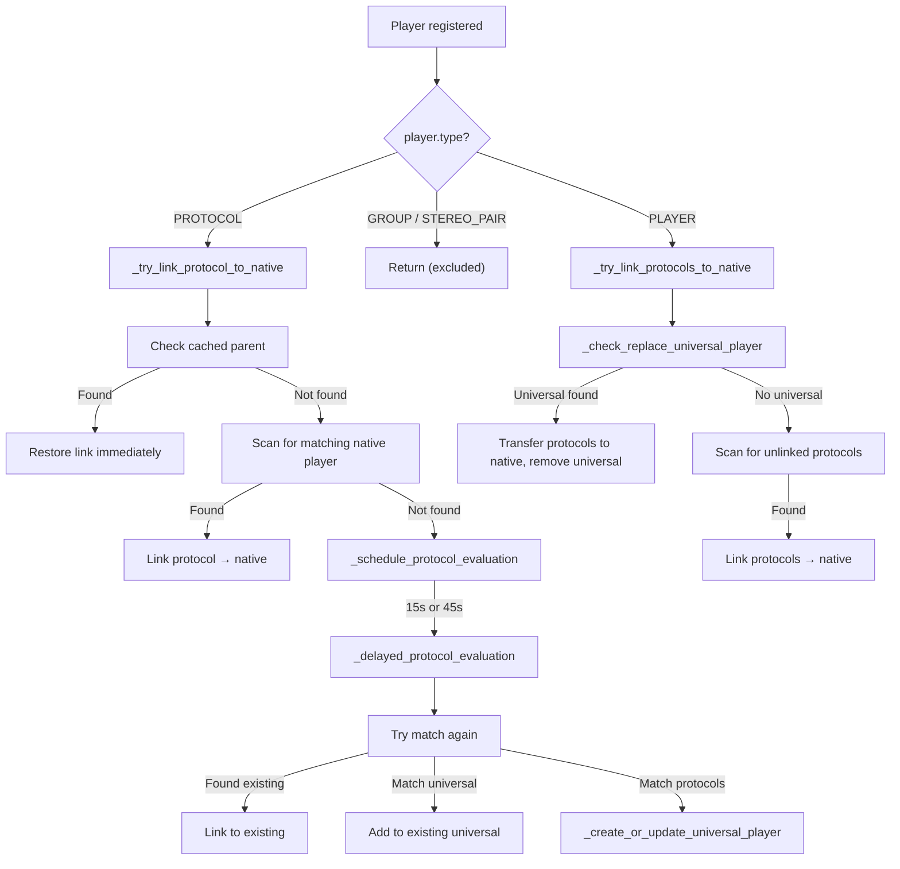

# Multi-Protocol Device Merging

A single physical audio device often exposes multiple streaming protocols — a Samsung soundbar might appear as an AirPlay endpoint, a Chromecast target, and a DLNA renderer simultaneously. Without protocol linking, a user would see three separate players in the UI for one device. The `ProtocolLinkingMixin` solves this by detecting that these endpoints belong to the same physical device and merging them under a single visible player.

## The ProtocolLinkingMixin

`ProtocolLinkingMixin` (`music_assistant/controllers/players/protocol_linking.py`, ~1870 lines) is mixed into `PlayerController`:

```python
class PlayerController(ProtocolLinkingMixin, CoreController):
```

The mixin expects these attributes/methods on `self` (declared in a `TYPE_CHECKING` block):

- `mass: MusicAssistant`
- `_players: dict[str, Player]`
- `_pending_protocol_evaluations: dict[str, asyncio.TimerHandle]`
- `_delayed_evaluation_lock: asyncio.Lock`
- `logger: logging.Logger`
- `all_players(...)` — get all registered players
- `get_player(player_id)` — get a single player
- `unregister(player_id, permanent)` — remove a player

These are all provided by `PlayerController`, initialized in its `__init__`.

## Identifier Matching

The core matching function `_identifiers_match(player_a, player_b)` determines whether two players represent the same physical device. It checks identifiers in a strict reliability hierarchy:

### Hierarchy (strong identifiers)

Checked in this order — first match wins:

| Priority | IdentifierType | Notes |
|---|---|---|
| 1 | `MAC_ADDRESS` | Most reliable. Invalid MACs are skipped. Matching uses `normalize_mac_for_matching()` (clears the locally administered bit so AirPlay-modified MACs match hardware MACs). Also checks `extra_data["reported_mac"]` for multi-MAC unions. |
| 2 | `SERIAL_NUMBER` | Direct string comparison |
| 3 | `UUID` | Direct comparison, with special handling for Sonos (`RINCON_..._MR` suffix) |
| 4 | `CAST_UUID` | Chromecast-specific stable ID |
| 5 | `AIRPLAY_ID` | AirPlay-specific stable ID |

### Last resort — IP_ADDRESS

If no strong identifier matched, falls back to IP address with conservative rules:

- If **both** players have valid, non-locally-administered MACs, IP matching is **not used** unless at least one side is a protocol or universal player. This prevents false matches between unrelated devices that happen to share an IP (e.g. two software players on the same host).
- If at least one side lacks a reliable MAC, same IP → match.

### Same-domain exclusion

Players from the **same protocol domain** (same `provider.domain`) are never matched as belonging to the same device — even with identical identifiers. This is enforced at the call sites, not inside `_identifiers_match`. It handles the case of multiple software instances (e.g. two Squeezelite clients, two Sendspin web players) running on the same host.

### `player_id` as fallback device key

Players without any identifiers (like some Sendspin clients) use `player_id` as the device key when creating Universal Players via `_get_device_key_from_players()` in the Universal Player provider. This is not identifier matching per se — it ensures these players still get a consistent Universal Player wrapper.

## The Three Linking Flows

Protocol linking is triggered by `_evaluate_protocol_links(player)`, called during player registration. It branches on the player's type:



### Flow 1: Protocol player registers, native player already exists

`_try_link_protocol_to_native(protocol_player)`:

1. **Cached parent check** — `_get_cached_protocol_parent_id()` reads `CONF_PROTOCOL_PARENT_ID` from config. If found and the parent exists, restores the link immediately via `_try_restore_cached_parent()`. Can also handle merging two Universal Players if identifiers now overlap.
2. **Scan for native match** — `_try_link_to_existing_player()` iterates all non-PROTOCOL, non-GROUP, non-STEREO_PAIR players. Checks:
   - Cached `CONF_LINKED_PROTOCOL_IDS` (fast path)
   - `_identifiers_match()` (identifier comparison)
   - `_match_via_linked_protocols()` (if the candidate has linked protocols that match this one)
3. **If matched** — `_add_protocol_link()` links the protocol to the native player.
4. **If no match** — `_schedule_protocol_evaluation()` to try again after a delay.

### Flow 2: Protocol player registers, no native player yet

`_schedule_protocol_evaluation(player_id)`:

- Cancels any prior pending evaluation for this player.
- **Delay**: 45 seconds if a cached parent ID exists but that parent is not yet registered (gives the parent time to come up). Otherwise **15 seconds** (allows time for other protocols on the same device to register).
- Schedules `_delayed_protocol_evaluation(player_id)` via `mass.loop.call_later`.

`_delayed_protocol_evaluation(player_id)`:

1. Acquires `_delayed_evaluation_lock` to serialize evaluations.
2. Bails if the player was already linked or unregistered during the delay.
3. Tries `_try_link_to_existing_player()` one more time.
4. Tries `_find_matching_universal_player()` → `_add_protocol_to_existing_universal()`.
5. Tries `_find_matching_protocol_players()` → `_create_or_update_universal_player()`.

`_create_or_update_universal_player(protocol_players)`:

- Filters out already-parented players.
- Resolves the `UniversalPlayerProvider`.
- Calls `universal_provider.ensure_universal_player_for_protocols(protocol_players)`.
- Handles domain-duplicate protocols (e.g. two AirPlay endpoints on one device) by creating separate Universal Players for the duplicates.
- Links all protocols via `_link_protocols_to_universal()`.

### Flow 3: Native player registers after a Universal Player exists

When a native player (e.g. Sonos) registers via `_try_link_protocols_to_native()`, the method first calls `_check_replace_universal_player(native_player)`:

1. Skips if the native player itself is a Universal Player.
2. Scans all Universal Players for identifier matches.
3. Transfers all protocol links from the Universal to the native player via `_add_protocol_link()` + `_migrate_protocol_ids_to_parent()`.
4. Removes protocol links from the Universal via `_remove_protocol_ids_from_parent()`.
5. Unregisters the Universal Player permanently.

The native player now has all the protocol endpoints that the Universal Player had, and the Universal Player disappears.

## UniversalPlayer

The `UniversalPlayer` (`music_assistant/providers/universal_player/player.py`) is a virtual player created for devices without native vendor support. It wraps one or more protocol players.

**Key characteristics:**

- Extends `Player` with `_attr_type = PlayerType.PLAYER` (not GROUP, though config creates it with `player_type=PlayerType.GROUP` for UI reasons).
- **`available`** — true if *any* linked protocol player exists and is available.
- `_attr_supported_features` starts empty — all capabilities come from linked protocols via `__final_supported_features`.
- Does **not** have `PLAY_MEDIA` natively — delegates playback to protocol players via the output protocol selection mechanism.
- Maintains `_protocol_player_ids` internally; `add_protocol_player()` / `remove_protocol_player()` modify this list.

**Provider lifecycle** (`UniversalPlayerProvider`):

- `discover_players()` — restores persisted Universal Players from config on restart. Validates protocol IDs, deletes stale entries.
- `ensure_universal_player_for_protocols(protocol_players)` — creates new Universal Players. Uses `asyncio.Lock` per device key. Splits domain-duplicate protocols into separate Universal Players.
- `player_id` format: `up{device_key}` where `device_key` is a normalized MAC, UUID, or fallback `player_id`.

## Output Protocol Selection

`_select_best_output_protocol(player)` determines which output to use when playing media. Returns `(target_player, output_protocol | None)` where `None` means "use native playback."

Priority chain:

1. **Grouped protocol** — if any linked protocol player is actively grouped (synced_to, multi-member group, or active_group), use it. This ensures grouped playback stays on the protocol that formed the group. The controller's `_handle_set_members_with_protocols` method handles the reverse direction — translating user-visible player IDs to protocol player IDs when forming groups. See [06-grouping.md](06-grouping.md) for the full two-phase `set_members` pipeline.
2. **User preference** — reads `CONF_PREFERRED_OUTPUT_PROTOCOL` from player config:
   - `"auto"` → skip to next step
   - `"native"` → return `(player, None)` if player has `PLAY_MEDIA`
   - Specific protocol ID → use if available
3. **Native playback** — if `PLAY_MEDIA in player.supported_features`, use native.
4. **Best available by priority** — sort `linked_output_protocols` by `OutputProtocol.priority` (ascending); first available wins.
5. **Failure** — raises `PlayerCommandFailed`.

### PROTOCOL_PRIORITY

Defined in `music_assistant/constants.py`, these values are assigned when protocols are linked (lower = more preferred for *playback*):

```python
PROTOCOL_PRIORITY: Final[dict[str, int]] = {
    "airplay": 10,
    "squeezelite": 20,
    "chromecast": 30,
    "sendspin": 40,
    "dlna": 50,
}
```

Unknown domains default to priority 100. This ordering reflects playback quality/reliability: AirPlay is preferred for audio fidelity, DLNA is least preferred due to limited control surface.

Note: this is the *playback* priority, distinct from the *control* priority in `Player._get_protocol_player_for_feature()` (chromecast=0 > dlna=1 > airplay=2 > sendspin=3), which governs command routing for non-active protocols. See [03-player-model.md](03-player-model.md#protocol-feature-routing).

## Persistence

Protocol links are persisted to config for fast restoration on restart, avoiding the 15–45 second evaluation delay.

### On the parent (native/universal) side

`CONF_LINKED_PROTOCOL_IDS` stores a list of linked protocol player IDs under `{CONF_PLAYERS}/{parent_id}/values/linked_protocol_ids`. Written by `_save_linked_protocol_ids()`, which merges existing cached IDs with currently active links (preserving entries for protocols that are temporarily unavailable). Read by `_get_cached_protocol_ids()`.

For Universal Players, protocol IDs are additionally persisted through `UniversalPlayerProvider._save_player_data()` alongside device identifiers and device info.

### On the protocol player side

`CONF_PROTOCOL_PARENT_ID` stores the parent player's ID under `{CONF_PLAYERS}/{protocol_id}/values/protocol_parent_id`. Written by `_save_protocol_parent_id()`. Read by `_get_cached_protocol_parent_id()`. Cleared by `_clear_protocol_parent_id()`.

### Restore flow

On restart, when a protocol player registers:
1. `_get_cached_protocol_parent_id()` returns the stored parent ID.
2. If the parent is already registered, `_try_restore_cached_parent()` immediately restores the link — no evaluation delay.
3. If the parent is not yet registered, `_schedule_protocol_evaluation()` uses the 45-second delay to give the parent time to come up.

## MAC Address Handling

MAC addresses are critical for reliable device matching. The system uses ARP resolution to overcome common issues with reported MACs.

### The Problem

- Some devices report **locally administered MACs** (the "local admin" bit 0x02 is set in the first octet). AirPlay devices commonly do this. Two endpoints on the same device may report different locally administered MACs.
- Some devices report **no MAC at all**.
- Some devices report **invalid MACs** (`00:00:00:00:00:00`, `ff:ff:ff:ff:ff:ff`).

### The Solution

`enrich_device_mac_address()` (`music_assistant/helpers/util.py`) runs during player registration for non-GROUP/STEREO_PAIR players:

1. Strips invalid reported MACs from identifiers.
2. Normalizes IPv6-mapped IPv4 addresses.
3. Calls `resolve_real_mac_address()` which uses ARP (`get_mac_address`) when:
   - No MAC is reported, or
   - The reported MAC is locally administered
4. If the ARP-resolved MAC differs from the reported one, replaces `IdentifierType.MAC_ADDRESS`.

The ARP MAC is also cached in config (`CONF_CACHED_ARP_MAC`) and the provider-reported MAC is stored in `extra_data["reported_mac"]` for multi-MAC matching.

### Normalization for matching

`normalize_mac_for_matching()` clears the locally administered bit on the first octet (`first_octet & ~0x02`). This means an AirPlay-modified MAC and the real hardware MAC normalize to the same value, enabling matching even when one side has a locally administered variant.

`is_locally_administered_mac()` tests the 0x02 bit of the first octet to identify these modified MACs.

`is_valid_mac_address()` rejects `None`, empty strings, all-zeros, all-ones, and non-hex values.

## GROUP and STEREO_PAIR Exclusion

These player types represent logical groupings, not physical devices. They are excluded from protocol linking at multiple levels:

- **`_evaluate_protocol_links()`** — returns immediately for GROUP and STEREO_PAIR types.
- **`_try_restore_cached_parent()`** — clears and aborts if cached parent is GROUP or STEREO_PAIR.
- **`_try_link_to_existing_player()`** — skips candidates with type PROTOCOL, GROUP, or STEREO_PAIR.
- **Player registration** — MAC enrichment is skipped for GROUP and STEREO_PAIR types.

## Key Files

| File | Description |
|---|---|
| `music_assistant/controllers/players/protocol_linking.py` | `ProtocolLinkingMixin` — matching, linking flows, protocol selection (~1870 lines) |
| `music_assistant/providers/universal_player/player.py` | `UniversalPlayer` class — virtual player wrapping protocols |
| `music_assistant/providers/universal_player/provider.py` | `UniversalPlayerProvider` — lifecycle, persistence, device key resolution |
| `music_assistant/helpers/util.py` | `enrich_device_mac_address`, `is_valid_mac_address`, `is_locally_administered_mac`, `normalize_mac_for_matching` |
| `music_assistant/constants.py` | `PROTOCOL_PRIORITY`, `PROTOCOL_FEATURES`, `ACTIVE_PROTOCOL_FEATURES`, `CONF_LINKED_PROTOCOL_IDS`, `CONF_PROTOCOL_PARENT_ID`, `CONF_PREFERRED_OUTPUT_PROTOCOL` |
| `music_assistant/controllers/players/README.md` | Existing reference documentation (development guide, testing scenarios) |
| `music_assistant/models/player.py` | Protocol linking state properties (`linked_output_protocols`, `protocol_parent_id`, `active_output_protocol`, `output_protocols`). See [03-player-model.md](03-player-model.md#protocol-linking-state) |
