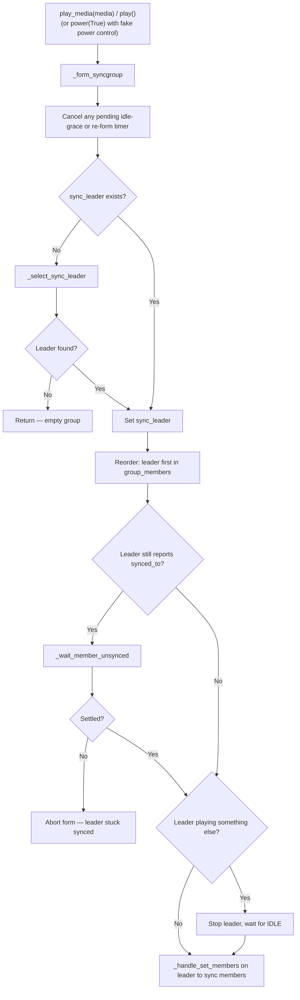
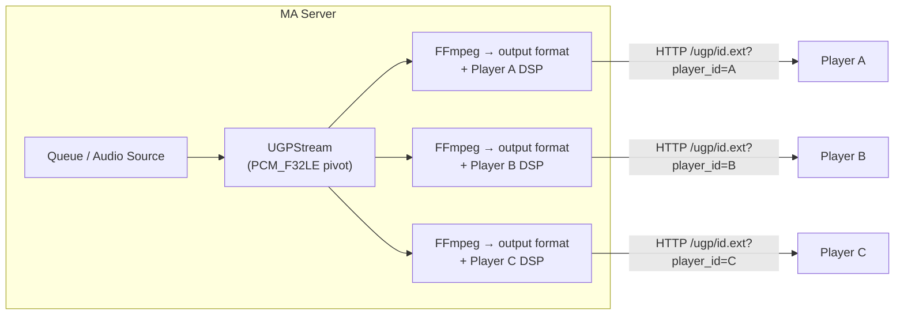
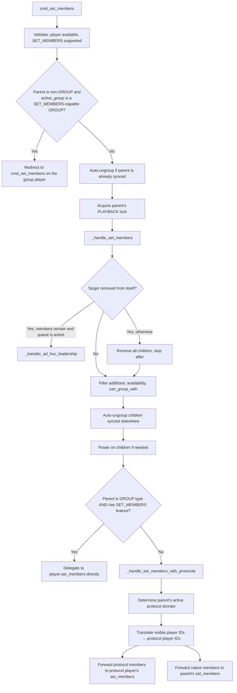
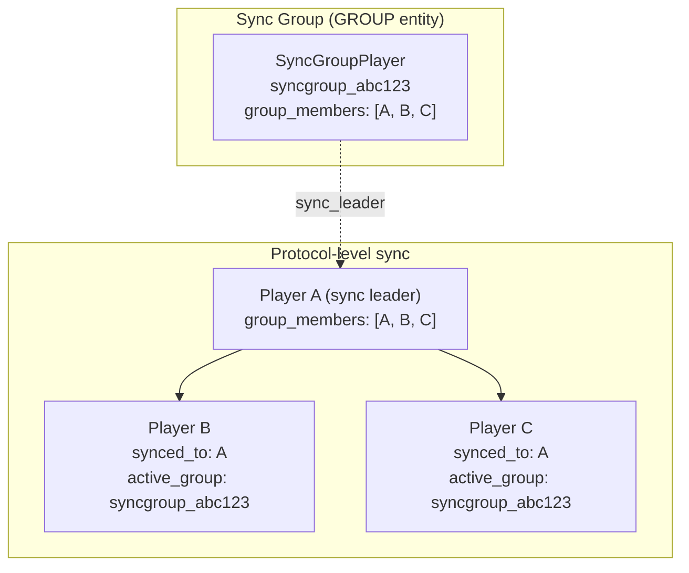

# 06 — Grouping Architecture

Music Assistant supports three distinct grouping models for multi-room audio: **sync groups**, **universal groups**, and **ad-hoc sync**. Each differs in persistence, protocol requirements, and how audio reaches the speakers. All three converge on the same underlying player properties — `group_members`, `synced_to`, and `active_group` — but populate them through fundamentally different mechanisms. This document explains each model, their formation and dissolution lifecycles, and how the controller bridges the user-visible player world with the underlying protocol reality.

Both group *providers* were reworked by #3947 ("Stabilize group players") from a **power-driven** lifecycle to a **session-driven** one. A group entity now exists persistently but only *captures* its members while a playback session is live; when dormant, its members stay individually controllable. This is the single most important thing to understand about grouping, and it is covered in [Session Lifecycle](#session-lifecycle) below.

## The Three Grouping Models

| | Sync Group | Universal Group | Ad-hoc Sync |
|---|---|---|---|
| **Provider** | `sync_group` | `universal_group` | *(none — native)* |
| **PlayerType** | `GROUP` | `GROUP` | Parent's type (usually `PLAYER`) |
| **Persistent entity** | Yes | Yes | No |
| **Queue ownership** | Group player | Group player | Parent player (sync leader) |
| **Cross-protocol** | No — same protocol only | Yes — any player | No — same protocol only |
| **Audio delivery** | Delegated to sync leader's native protocol | Server-side fan-out (independent HTTP stream per member) | Native protocol sync |
| **Player ID format** | `syncgroup_{random_8}` | `ugp_{random_8}` | N/A |
| **Captures members while** | A session is active (`is_active_session`) | A session is active (`is_active_session`) | Members are synced to the leader |
| **Dissolves on stop** | **Yes** — `stop()` releases the members immediately, unless the group is pinned with fake power | **Yes** — `stop()` releases the members immediately, unless pinned with fake power | Immediately |
| **Dissolves on natural idle** | After `IDLE_GRACE_SECONDS` (10s) | After `IDLE_GRACE_SECONDS` (10s) | N/A |
| **`PlayerFeature.POWER`** | Only when the user assigns fake power control | Only when the user assigns fake power control | Leader's own power |
| **Dynamic membership** | Optional (`CONF_DYNAMIC_GROUP_MEMBERS`) | Optional | Always |
| **`SET_MEMBERS` feature** | Only if dynamic | Only if dynamic | Depends on provider |

## Sync Groups

Sync groups are persistent group players that delegate playback to a member's native sync protocol. Created through `SyncGroupProvider.create_group_player()`, each group gets its own player ID (`syncgroup_` prefix) and queue, but never touches audio directly.

**Key class:** `SyncGroupPlayer` (`music_assistant/providers/sync_group/player.py`)

### Sync Leader

The central concept. A sync group selects one member as the **sync leader** — the player that actually receives `play_media`, manages playback state, and syncs the other members to itself via its native protocol (AirPlay-to-AirPlay, Sonos-to-Sonos, etc.).

The sync leader reference is stored as `SyncGroupPlayer.sync_leader: Player | None`.

**Selection logic** (`_select_sync_leader`):

1. If a current leader exists and is available, keep it.
2. Build the candidate list, prioritizing static group members (stable across restarts), then current members, then any newly added members.
3. **Prefer protocol continuity** when a `preferred_protocol_domain` is passed — pick the first candidate that supports that domain, either natively or through an available linked output protocol, so the live session can continue without a teardown (#3600). Callers snapshot `active_protocol_domain` before clearing the old leader and pass it here.
4. Fall back to the first available candidate.

`active_protocol_domain` is always derived from live state rather than stored, so it cannot drift. It returns the domain of the protocol carrying the live session — except when no remaining member actually *requires* that non-native protocol, in which case it returns the leader's native domain so the group **downshifts**. A member "requires" a protocol when every one of its available playback paths is on that domain, which covers both plain protocol players and Universal Player wrappers that can only reach the device one way.

### Protocol Compatibility

Only same-protocol players can be grouped in a sync group. Enforcement happens through `can_group_with`:

- **Static groups**: return the configured static members directly.
- **Dynamic groups**: aggregate across **all currently available members** — each member's own ID plus its `state.can_group_with`. Aggregating over every member rather than just the leader is what allows a protocol switch mid-session: a player compatible with *any* current member is a valid candidate, and the leader may move to a different output protocol to accommodate it.
- **Dynamic groups with nothing to derive from**: when the aggregation comes up empty — an empty group, *or* one whose every listed member is currently offline — fall back to offering any available non-GROUP player that supports `SET_MEMBERS`, has a non-empty `can_group_with`, and is not already captured by another group. Actual compatibility is then validated at add time. The offline case matters in practice: before #4814 the fallback only triggered for a group with *no* members, so a dynamic group with a single offline preset member produced an empty set and refused every join until that member came back.

### Allowed Members

`CONF_ALLOWED_MEMBERS` (`allowed_members`) is an advanced, dynamic-groups-only config entry that restricts which players may join at runtime. An empty list (the default) means any compatible player may join. The filter constrains *joiners* only:

- Players already in `group_members` bypass it, so a filter change never ejects a current member.
- Players in the `CONF_GROUP_MEMBERS` preset are always allowed, so the configured members can always rejoin.

`_is_member_allowed(player_id)` implements those two exemptions, and both `can_group_with` and `set_members` consult it.

### Static vs Dynamic Groups

**Static** groups have fixed membership defined at creation in `CONF_GROUP_MEMBERS`. Members always rejoin when playback starts and cannot be removed at runtime. The `SET_MEMBERS` feature is not advertised.

**Dynamic** groups (`CONF_DYNAMIC_GROUP_MEMBERS = True`) support runtime `SET_MEMBERS` calls. Static members still cannot be removed, but additional members can join or leave freely.

### Feature Inheritance

The only unconditional base feature is `PLAY_MEDIA`. `SET_MEMBERS` is added when the group is dynamic, and `POWER` is added **only** when the user has assigned fake power control (see [Optional Power Control](#optional-power-control)). The `supported_features` property reads the *raw* `CONF_POWER_CONTROL` config value rather than the `power_control` property, since `power_control` itself inspects supported features and would recurse.

Features are inherited from members through `EXTRA_FEATURES_FROM_MEMBERS`. When a sync leader is active they come from the leader; while dormant they are derived from **all available configured members**, so controls like volume are still advertised on an idle group:

```python
EXTRA_FEATURES_FROM_MEMBERS = {
    PlayerFeature.ENQUEUE,
    PlayerFeature.GAPLESS_PLAYBACK,
    PlayerFeature.VOLUME_SET,
    PlayerFeature.VOLUME_MUTE,
    PlayerFeature.MULTI_DEVICE_DSP,
}
```

This means a sync group's capabilities change dynamically depending on which member is elected leader. Two more properties follow the leader the same way: `requires_flow_mode` returns the leader's `flow_mode` (or `False` with no leader), and `supported_sample_rates` returns the leader's resolved rates (falling back to `[(44100, 16), (48000, 16)]`). Neither is cached, because the leader can change mid-session during a reform.

### State Delegation

The sync group delegates most of its observable state to the sync leader. Crucially, it reads the leader's *raw* attributes (`leader.playback_state`, `leader.elapsed_time`, etc.) — **not** `leader.state.*`. This avoids a circular dependency: synced clients (`__final_synced_to`) mirror their leader's `state.playback_state`, so if the group derived from `state.*` and the leader derived from the group, both would deadlock at the previous value. Members of an active group always report their own raw playback state; only manually-synced clients (`synced_to`) mirror the leader.

| Property | Source |
|---|---|
| `playback_state` | Sync leader's `state.playback_state` (or `IDLE` if no leader) |
| `elapsed_time`, `elapsed_time_last_updated` | Sync leader's `state.elapsed_time` / `state.elapsed_time_last_updated` |
| `current_media` | Sync leader's **raw** `current_media` (set optimistically in `play_media`) |
| `active_source` | Sync leader's **raw** `active_source` (with protocol-awareness — see below) |
| `group_members` | Sync leader's reported `state.group_members` (preferred) or internal list |
| `source_list` | Sync leader's raw `source_list` |
| `powered` | Group's own `_attr_powered` — `None` unless a power control is assigned. **Not** the "is this group active" signal; that is `is_active_session` |

The split between `.state.*` and raw attributes above is deliberate and narrow. `__final_current_media` and `__final_active_source` on a player that has an `active_group` route *through* the active group's state, so reading `sync_leader.state.current_media` from inside the group would loop back into the group's own derivation (group → leader.state → active_group = group → group). Those two must use the leader's raw attributes. `playback_state` and `elapsed_time` do not route via `active_group` and are safe to read from `.state.*`.

The `active_source` property filters out cases where the sync leader reports a source that actually belongs to an active output protocol (e.g. AirPlay) or a bridged protocol (e.g. Sendspin), to avoid confusing source attribution.

### State Polling

While the group is playing, `SyncGroupPlayer.poll()` runs every 1 second to refresh `elapsed_time` from the sync leader. When idle, the poll interval drops to 30 seconds. This avoids the per-second eventbus cascade that would happen if every leader `elapsed_time` tick propagated through the group's update chain.

### Session Lifecycle

The group's lifecycle is driven by the **playback session**, not by power (#3947). Playback forms the group; stopping releases it. The previous model — `power(True)` forms, `power(False)` dissolves, `stop()` leaves the group formed and ready — turned out to be a usability trap: users had to remember to power a group off, and until they did, "play X in the kitchen" from Home Assistant silently redirected to the whole group long after the group's playback had ended.

| Trigger | Effect |
|---|---|
| `play_media()` / `play()` | `_form_syncgroup()` — select a leader and sync the members to it. Idempotent, so calling it on an already-formed group is cheap |
| `stop()` (or `cmd_stop`) | Forward the stop to the leader, then **dissolve immediately**, releasing the members |
| Natural transition to IDLE (the queue simply ran out) | Start the idle grace timer; dissolve after `IDLE_GRACE_SECONDS` (10s) |
| Sync leader removed from a playing group | Seamless handoff where possible, otherwise dissolve now and re-form after `REFORM_DEBOUNCE_SECONDS` (2s) |
| `power(False)`, when fake power is assigned | Stop the leader and dissolve |

The distinction between an explicit `stop()` and a natural idle transition is the reason for the grace window: an end-of-track gap, or a user immediately queuing something else, should not tear down a live sync session, whereas pressing stop is an unambiguous "release these speakers".

#### `is_active_session`

`is_active_session` — **not** `powered` — is the canonical "this group is holding its members" signal:

```python
return (
    self.sync_leader is not None
    or self._idle_grace_task is not None
    or self._reform_task is not None
)
```

All three terms matter. A formed group is capturing. A group inside its idle grace window is still capturing, because it may yet resume. A group awaiting a debounced re-form is still capturing, because the members are about to be re-synced.

`Player.__final_active_group` reads this property to decide whether the configured members should report this group as their `active_group` — which in turn is what makes the controller redirect member-targeted commands to the group. A dormant group therefore captures nothing, and its members accept direct commands. See [03-player-model.md](03-player-model.md#active-group-resolution) for the resolution and [04-player-controller.md](04-player-controller.md#_get_player_with_redirect) for the redirect.

`is_active_session` also guards config reloads: `on_config_updated` only realigns `group_members` to the configured preset while the group is dormant, so saving an unrelated config field mid-session cannot wipe dynamic joins.

#### Optional Power Control

`PlayerFeature.POWER` is deliberately **not** advertised by default. Users who want an explicit on/off button can assign **fake power control** in the player config; the feature is then advertised and:

- `power(True)` re-applies the configured preset members (so unjoins during a powered session stick until the next power cycle) and pre-forms the group, capturing its members immediately.
- `power(False)` stops the leader and dissolves the group.
- While `_attr_powered is True`, both `stop()` and the idle grace timer **skip** the dissolve. The group stays pinned as active until the user powers it off — which is exactly the legacy behavior, now opt-in.

Because a group's `power_control` is normally `NONE`, `_attr_powered` stays `None` and `state.powered` is `None` too. That is why `__final_active_group` reads the *raw* `powered` attribute plus `is_active_session` rather than `state.powered`.

### Formation



Two guards in that flow are worth calling out:

- **Stuck-synced leader.** If the freshly selected leader still believes it is synced to a previous leader (protocol-level state that has not propagated yet), `_form_syncgroup` waits for `synced_to` to clear. `_wait_member_unsynced` first waits 5s, then tries to *kick* the member from its stale parent and waits 2s more — this rescues the common Sonos UPnP event-lag case. If the member is genuinely stuck, the form **aborts** rather than issuing a `play_media` that the provider would reject with "I'm synced to another player".
- **Staleness re-checks.** After each `await`, the method re-checks that `self.sync_leader` is still the leader it pinned. A concurrent dissolve or re-lead makes the in-flight form attempt stale, and it returns instead of acting on the old leader.

Formation is no longer serialized by a method-level `@lock` decorator. Instead, each mutating step takes the controller's purpose-scoped lock — `get_player_lock(leader, PlayerLockPurpose.PLAYBACK)` — around the `_handle_set_members` call, and `play()` / `play_media()` hold the group's own playback lock until the leader confirms it is playing (`_await_leader_playback`, up to `PLAYBACK_START_TIMEOUT` = 5s). Holding it that long prevents a concurrent (un)group command from racing a start that is still in flight at the device, which would otherwise strand a player streaming outside the group. See [04-player-controller.md](04-player-controller.md#per-player-locking).

> **Why `_handle_set_members` and not `cmd_set_members`?** `cmd_set_members` redirects commands targeting a member of an active group player back to the group itself (see [Active-Group Forwarding](#active-group-forwarding)). If `_form_syncgroup` called `cmd_set_members(sync_leader_id, ...)`, that redirect would loop the command back into `SyncGroupPlayer.set_members` on the same syncgroup. The implementation deliberately calls the lower-level `_handle_set_members` to bypass the redirect. The same reasoning applies to `_dissolve_syncgroup` and `SyncGroupPlayer.set_members` below, and to the `_handle_cmd_stop` / `_handle_play_media` calls the group makes against its leader.

### Dissolution

`_dissolve_syncgroup` is reached from `stop()`, from `power(False)`, from the idle grace timer, from removal of the last member, and from `on_unload`:

1. Cancel any pending idle-grace and re-form timer, and clear the playback-start marker.
2. Collect the sync children from the leader's `state.group_members` (excluding the leader itself).
3. Call `_handle_set_members` on the leader to remove all children, waiting for the leader's state to reflect the ungroup.
4. Schedule a clear of the leader's `active_output_protocol` — deferred until it reports IDLE, because the controller's own clear in `_handle_cmd_stop` is skipped for a still-grouped protocol player.
5. Set `sync_leader = None`, refresh attributes, emit a state event.

Step 5 is what drops `is_active_session` to `False`, so the former members see `active_group = None` on their next update and accept direct commands again.

### Dynamic Member Changes

When `set_members` is called on a dynamic group (a static group raises `UnsupportedFeaturedException`):

- **Adding members**:
  - Rejects the group's own ID, unavailable players, and players excluded by [Allowed Members](#allowed-members).
  - With **no leader yet** (empty or dormant group), the member is simply registered; leader and protocol selection happen the next time the group forms.
  - With a leader, validates compatibility against the leader's `can_group_with`, which includes the leader's *linked output protocols* (so an AirPlay-only player is valid for a Sonos leader that has AirPlay as a linked protocol).
  - Compatible members are appended to the internal list and forwarded to `_handle_set_members` on the leader, bypassing the active-group redirect (see the note in [Formation](#formation)). The leader handles protocol selection and may switch to a different output protocol so the new member can join.
  - Incompatible members are **not** registered — otherwise they would linger in `group_members` forever without ever actually being synced.
- **Removing the sync leader while playing**: see [Dynamic Leader Switch](#dynamic-leader-switch) below — either a seamless protocol-level handoff or a dissolve + re-form.
- **Removing the last member** (or the leader with no members left): stops the leader and dissolves the group.
- **Removing a regular member**: forwards the removal to `_handle_set_members` on the leader, under the leader's playback lock.
- **Removing a member grouped outside MA**: a player synced to the leader via the vendor's own app is not in the group's tracked member list but *does* appear in the leader's live `state.group_members`. Its removal is forwarded to the leader rather than silently skipped.
- **Static members cannot be removed** — raises `PlayerCommandFailed`. So does attempting to remove the group from itself.

#### The startup window

Deciding what to do on a member change depends on whether the group *was playing*, and a start that was just issued to the leader may not be reflected in the device's state yet. `set_members` therefore treats a recently started session as playing:

```python
was_playing = self.playback_state == PlaybackState.PLAYING or (
    self.playback_state != PlaybackState.PAUSED and self._playback_recently_started
)
```

`_playback_recently_started` is true within `PLAYBACK_START_TIMEOUT` (5s) of the last start issued to the leader. Without it, an (un)group command racing an in-flight start would misread the group as idle and skip the resume. An explicit `PAUSED` always wins, since pausing is deliberate user intent rather than startup noise.

### Dynamic Leader Switch

Removing the sync leader from a *playing* group used to require a full dissolve + re-form cycle (a brief audio gap). Some protocols support a **seamless leader handoff** at the protocol level: the live session keeps running while leadership transfers to another member (#3672).

Eligibility is expressed by exactly one thing — membership of the `PROVIDERS_WITH_DYNAMIC_LEADER_SWITCH` tuple in `sync_group/constants.py`, currently **AirPlay**, **Snapcast**, and **Sendspin**. There is no per-provider capability property; the domain checked is that of the player owning the *live session* (`_active_session_player()`), which is the active protocol player when the leader is streaming via a protocol, and the leader itself otherwise.

`set_members` attempts the handoff when the group was playing **and** the session player's domain is eligible; otherwise it goes straight to dissolve-and-reform. `_dynamic_leader_switch(old_leader_id)` then:

1. Snapshots `active_protocol_domain` and the session player **before** clearing the leader — both are needed for selection and for the eligibility check below.
2. Drops the old leader from the member list and selects a new one, preferring a member that supports the snapshotted protocol so the session continues on the same protocol.
3. **No remaining members?** Restores `sync_leader` to the old leader (so the dissolve can properly ungroup the protocol-level members), stops it, and dissolves the group.
4. **New leader not in the live session?** Falls back to dissolve-and-reform. This second condition is why eligibility is not a single check: `_is_player_in_session` verifies the candidate is already a client of the running session, because a freshly added player that has never streamed anything cannot take over a session it was never part of. The check inspects the session's `sync_clients` where the protocol exposes one, and optimistically assumes success where it does not (Snapcast, Sendspin).
5. Otherwise, hand off at the protocol level:
   - `set_members(player_ids_to_remove=[session_player_id])` on the **old** session player, so it steps out of the session. This goes directly to the protocol player: the controller's `cmd_set_members` would read a self-removal as "dissolve the entire group". The provider's own `set_members` handles "remove self while other clients remain" by promoting another `sync_client` at the protocol level.
   - `set_members(player_ids_to_add=[remaining_protocol_ids])` on the **new** leader's session target, transferring the bookkeeping. The members are already in the live session at the protocol level, so this only makes the new leader report them as its group members.

In the step-5 path the remaining members keep playing throughout; there is no audio gap.

#### Dissolve and Re-form

When a handoff is not possible — the protocol does not support it, the new leader is not in the session, or the group was not playing — `_dissolve_and_reform` runs instead. The teardown is immediate but the restart is **debounced** (#4815):

1. Stop the departing leader and wait for its state to settle.
2. `_dissolve_syncgroup()`, and drop the old leader from the member list.
3. If playback should resume and members remain, record the protocol hint and schedule the re-form after `REFORM_DEBOUNCE_SECONDS` (2s).

The debounce is what makes cascaded removals behave. A Home Assistant automation ungrouping several rooms in quick succession re-arms the window on each removal (`set_members` re-arms it explicitly when the group is leaderless with a re-form pending), so the group re-forms and resumes playback exactly once, with the final member list, instead of restarting for every removal.

`_reform_runner` then, under the group's own playback lock:

- Re-checks state at execution time and returns if an explicit play already re-formed the group or all members are gone.
- Waits for every remaining member to report `synced_to = None` via `_wait_member_unsynced`, concurrently. Providers like Sonos propagate group state asynchronously, so children can still report `synced_to` for seconds after the leader's ungroup returns. If any member stays stuck after the recovery attempt, the re-form **aborts** and no playback resumes on that call.
- Preselects the new leader using the protocol hint, then calls `play()`.

Note that `_reform_task` being non-`None` keeps `is_active_session` true across the whole window, so the members are not released to individual control during the gap. The `finally` block clears the task on the early-return paths so the session state settles.

## Universal Groups

Universal groups solve the cross-protocol problem. Any player that can receive HTTP audio can participate, regardless of its native protocol. Audio synchronization is best-effort since there's no shared clock across protocols.

**Key class:** `UniversalGroupPlayer` (`music_assistant/providers/universal_group/player.py`)

### Server-Side Fan-Out

Unlike sync groups that delegate to a vendor's native sync protocol, universal groups use `UGPStream` for server-side audio distribution. The MA server reads the audio source, converts it to PCM, then fans it out to each member as an independent unicast HTTP stream (one connection per member, not IP multicast). For the full audio processing pipeline that feeds these streams, see [10-streaming-pipeline.md](10-streaming-pipeline.md).



Every member receives the **same** codec and sample rate — the group's single configured output format. The per-member FFmpeg process exists for per-player DSP filter parameters, not for format negotiation.

Each member connects to a dynamic HTTP route registered at initialization — `/ugp/{player_id}.flac` and `/ugp/{player_id}.mp3`. Both are registered unconditionally, but the extension in the URL does **not** decide the codec: the served format comes from the group's own `CONF_UGP_OUTPUT_FORMAT` config.

The `player_id` **query parameter** (distinct from the one in the path, which identifies the group) identifies the requesting member, enabling per-player DSP filter parameters.

### One Deliberate Output Format

A universal group is a heterogeneous-protocol compatibility layer, not a hi-res delivery path, and every member receives the same encoded stream. The format is therefore a single explicit choice rather than a per-member negotiation. `CONF_UGP_OUTPUT_FORMAT` offers three options, defaulting to MP3:

| Option | Served format |
|---|---|
| `mp3` *(default)* | MP3 at 44.1 kHz / 16-bit |
| `flac_44100_16` | FLAC at 44.1 kHz / 16-bit |
| `flac_48000_24` | FLAC at 48 kHz / 24-bit |

The chosen format also drives the group's internal PCM pivot — `PCM_F32LE` at the output sample rate — so the per-member encoder never has to resample. It is likewise what `supported_sample_rates` reports: a single-rate list, which keeps the upstream MA flow stream pinned and stops smart/bit-perfect modes from triggering needless restarts. Changing the option requires a reload.

### UGPStream Internals

The `UGPStream` class (`music_assistant/providers/universal_group/ugp_stream.py`) manages the fan-out:

1. **`_runner()`**: The core loop. Reads from the audio source through FFmpeg (readrate-limited to 1.1x with a 5-second initial burst, so members can prime their buffers without the server running far ahead), converts to the base PCM format, and pushes each chunk to all subscribers via `asyncio.gather`. Subscriber exceptions are collected rather than raised, so one stalled member cannot kill the stream
2. **`subscribe_raw()`**: Each connecting client gets an `asyncio.Queue(10)` as its subscriber callback. The runner pushes chunks to all queues. An empty `b""` chunk signals stream end.
3. **`get_stream()`**: Wraps `subscribe_raw()` through a second FFmpeg process for per-client transcoding with custom filter parameters (player-specific DSP)

The runner starts lazily — on the first subscriber connection, with a 0.25s delay to allow other subscribers to connect before audio flows.

### Always Flow Mode

Universal groups require flow mode (`requires_flow_mode = True`). This is inherent to the architecture — the server controls the audio stream and members receive it as a continuous flow, not individual track URLs.

### Base Features

Unlike sync groups that inherit features from a leader, universal groups have a fixed base feature set:

```python
BASE_FEATURES = {
    PlayerFeature.PLAY_MEDIA,
    PlayerFeature.VOLUME_SET,
    PlayerFeature.MULTI_DEVICE_DSP,
}
```

`SET_MEMBERS` is added when the group is dynamic, and — exactly as with sync groups — `POWER` is added only when the user has assigned fake power control. It is not a base feature.

The `volume_set` implementation is a no-op — group volume is handled entirely by the player controller's `set_group_volume` mechanism (see [07-volume.md](07-volume.md)).

### Session Lifecycle

Universal groups follow the same session model as sync groups, with the live `UGPStream` standing in for the sync leader:

```python
def is_active_session(self) -> bool:
    if self.stream is not None and not self.stream.done:
        return True
    return self._idle_grace_task is not None
```

| Trigger | Effect |
|---|---|
| `play_media()` | Cancel the grace timer, `_capture_members()`, tear down any previous stream, create a fresh `UGPStream`, fan out per-member `play_media` |
| `stop()` | Stop every active member, abort the stream, and snap `group_members` back to the configured static set (unless pinned with fake power) |
| Natural transition to IDLE while the stream is still live | Start the idle grace timer; after `IDLE_GRACE_SECONDS` (10s) abort the stream and release the members |
| `power(False)`, when fake power is assigned | Stop, then power off members that have a power control, and reset the member list |

`_capture_members()` is the formation step, called from both `play_media()` and `power(True)`, and is idempotent. It rebuilds the effective member list from the available static members, then for each member:

1. Stops it if it is playing something with a different active source.
2. Resolves a **collision** when the member is currently captured by a *different* group: release it via that group's `set_members` when the group is dynamic and the member is not static; otherwise power the other group off through the controller (`_handle_cmd_power`, so a fake-power group's cached state stays in sync rather than only `_attr_powered`); failing that, stop it outright. Each branch waits for the member's state to settle.
3. Ungroups it if it is synced to another player.
4. Powers it on if it has a power control.

A newly added member joins a **live** stream immediately: `set_members` sends it the per-member stream URL when `self.stream` is still running. The `self.powered` gate that used to guard this is gone with the session refactor, since a group now normally has `_attr_powered = None`.

### Playback Flow

1. `play_media()` → cancel grace timer → `_capture_members()` → stop any existing stream.
2. Resolve the configured output format and build the `PCM_F32LE` pivot format at its sample rate.
3. Create `UGPStream` over `mass.streams.get_stream(media, pivot_format, player_id)`.
4. Set state optimistically (PLAYING, `elapsed_time = 0`).
5. Concurrently send `play_media` to each powered member with a per-member URL, `{base_url}/ugp/{group_id}.{ext}?player_id={member_id}`, as a `MediaType.FLOW_STREAM` carrying the group ID and session ID in `custom_data`.

State polling (`_set_attributes`, every 30s) takes playback state and elapsed time from the first active child player, and is also where the idle-grace timer is armed and cancelled.

### Power Across the Three Models

Power means something different for each grouping model, and since #3947 it is optional for both group providers. Neither sync groups nor universal groups advertise `PlayerFeature.POWER` unless the user assigns **fake power control**; when they do, powering on captures members and powering off releases them, and the group stays pinned as active across stops until powered off. Ad-hoc sync has no group-level power concept at all — the sync leader's own power state controls the group, and an external power-off unsyncs it (see [04-player-controller.md](04-player-controller.md#membership-cleanup)). For the general power model across all player types, see [03-player-model.md](03-player-model.md#resolution-chains) and [04-player-controller.md](04-player-controller.md#power-management).

### State Attributes

Compared to sync groups, the universal group manages its own state more directly:

| Property | Source |
|---|---|
| `playback_state` | First active child member's `state.playback_state` (via polling), else `IDLE` |
| `elapsed_time` | First active child member |
| `current_media` | Stored on group itself (deepcopy of media) |
| `group_members` | Internal `_attr_group_members`, rebuilt by `_capture_members()` and snapped back to the static set on release |
| `synced_to` | Always `None` (GROUP type) |
| `powered` | `_attr_powered` — `None` unless fake power control is assigned |
| `can_group_with` | Static→static member list; Dynamic→`instance_id` of every `PlayerProvider` except the UGP provider itself |
| `supported_sample_rates` | Single-element list derived from `CONF_UGP_OUTPUT_FORMAT` |

## Ad-hoc Sync

Ad-hoc sync is direct player-to-player grouping with no persistent group entity. The parent player's native `set_members` is called, creating a temporary sync relationship.

### How It Works

- **Triggered by**: `cmd_group(player_id, target_player)`, `cmd_ungroup(player_id)`, or `cmd_set_members`
- **Parent player**: Becomes the sync leader; its `group_members` list grows
- **Child players**: Their `synced_to` points to the parent
- **Queue**: Belongs to the parent player, not a separate entity
- **Dissolves**: When the parent stops, when manually ungrouped, or when the parent is powered off externally

### Leadership Transfer

Removing an ad-hoc sync **leader** from its own group does not necessarily dissolve it (#4412). When `_handle_set_members` sees the target player in its own removal list, it first checks whether any *other* member is still available and whether the active queue is not IDLE. If both hold, `_transfer_ad_hoc_leadership` promotes a remaining member instead:

1. `_select_ad_hoc_leader` picks the new leader, preferring a member that supports the protocol the group is currently playing on so the others can be regrouped under it. The members' own `can_group_with` is unusable here — it returns empty while they are still synced to the old leader — so the check looks at each candidate's provider domain and available linked protocols directly. Otherwise it takes the first remaining member.
2. `player_queues.transfer_queue(old, new, auto_play=False)` moves the queue. That call frees the new leader from the old leader's group and stops the old leader; the playback position survives because `stop()` stores it in `resume_pos`.
3. The other remaining members are regrouped under the new leader via `cmd_set_members`.
4. If the group had been playing, playback resumes on the new leader.

A brief audio gap is accepted in exchange for keeping playback alive. Only when no members remain, or nothing was playing, does the group dissolve outright — removing all children and then stopping.

### Controller API

| Method | Description |
|---|---|
| `cmd_group(player_id, target)` | Add `player_id` to `target`'s members |
| `cmd_group_many(target, children)` | Add multiple children (deprecated alias for `cmd_set_members`) |
| `cmd_ungroup(player_id)` | Remove player from whatever it's grouped to |
| `cmd_ungroup_many(player_ids)` | Ungroup multiple players sequentially |
| `cmd_set_members(target, add, remove)` | Full add/remove control |

`cmd_ungroup` dispatches on the player's role rather than being a thin alias for `cmd_set_members`. A GROUP player is interpreted as "release the whole captured session", a static group member recurses into that same branch (since it cannot be released individually), and a leader removes only itself so leadership transfer can kick in. See [04-player-controller.md](04-player-controller.md#full-command-surface) for the full table.

## Playing to a Captured Player

A group capturing its members means member-targeted commands normally get redirected to the group. That is right for transport commands but wrong for an explicit "play this here": since #3947, `play_media` on a captured player defaults to **breaking the player out of its group** rather than redirecting to the leader.

The per-player `CONF_PLAY_MEDIA_OVERRIDES_GROUP` config value (default `True`) controls this, and `_release_player_for_play_media` performs the release — unsyncing an ad-hoc member, removing a dynamic group member, or dissolving a static group by powering it off or stopping it. From the grouping side, the consequences are:

- Playing to a **sync group member** removes that member from the group, which for a dynamic group can trigger the leader switch or dissolve-and-reform paths above if the member happened to be the leader.
- Playing to a **static** group member cannot remove just that member, so the entire group is torn down.
- The release runs outside the group's playback lock specifically to avoid an AB-BA deadlock with `cmd_set_members`, which acquires the group's lock and then the leader's.

Setting the option to `False` restores the legacy redirect-to-leader behavior. See [04-player-controller.md](04-player-controller.md#play_media-and-the-group-override) for the controller-side mechanics.

## The Two-Phase `set_members` Pipeline

All grouping commands converge on `cmd_set_members`, which flows through a two-phase pipeline:



### Active-Group Forwarding

Before phase 1, `cmd_set_members` checks whether the targeted parent is itself a member of an active GROUP player (e.g. a `syncgroup_*`) that supports `SET_MEMBERS`. If so, the command is redirected to that group player so it can manage the membership change consistently. Without this redirect, calling `cmd_group(memberA, memberB)` on two existing members of a syncgroup could create a sync relationship at the protocol level that the group's internal state wouldn't know about (#3718).

### Phase 1: `_handle_set_members`

Handles validation and common logic for all grouping types:

1. **Self-removal**: If the target player is in its own removal list, either transfer leadership to a remaining member (see [Leadership Transfer](#leadership-transfer)) or dissolve the whole group — remove all children, then stop the parent afterwards.
2. **Compatibility check**: Each child must be in `parent_player.state.can_group_with`
3. **Auto-ungroup**: If a child is synced to a *different* player, ungroup it first. The auto-ungroup is skipped when the child is already part of *this* group via its sync leader (`active_group == target_player` and `child_player_id in group_members`) — that's a normal in-group state, not "synced elsewhere" (#3718).
4. **Stale-state ungroup fallback**: When processing removals, the controller accepts a child for removal if either (a) the child is in `parent_player.state.group_members`, or (b) the child itself reports `state.synced_to == target_player`. The (b) branch handles race conditions where the parent's `group_members` is briefly stale after the child has already established the protocol-level sync (#3540).
5. **Power management**: Power on children if needed
6. **GROUP type dispatch**: For `PlayerType.GROUP` that also has `PlayerFeature.SET_MEMBERS` in `supported_features`, call `player.set_members()` directly. Static sync groups (which lack this feature) fall through to phase 2 instead.
7. **Regular player dispatch**: For non-GROUP players, proceed to phase 2

### Phase 2: `_handle_set_members_with_protocols`

Bridges the gap between user-visible player IDs and the underlying protocol reality. This is essential because a user might group "Denon AVR" with "HomePod," but the actual sync happens between the Denon's AirPlay protocol player and the HomePod's native AirPlay.

The method:
1. Identifies the parent's active protocol domain and player
2. Translates each visible player ID to the appropriate protocol player ID (or keeps it native)
3. Splits members into protocol-routed and native-routed lists
4. Forwards each list to the appropriate player's `set_members`

This translation is the bridge described in [05-protocol-linking.md](05-protocol-linking.md) — the protocol linking system determines *which* protocol player to use, and this method maps the user's intent onto that protocol reality.

## The Three Relationship Properties

These three properties on `Player` describe group membership from different perspectives. They are frequently confused because they overlap in non-obvious ways.

### `group_members` → Leader/group's view

A list of player IDs that are part of this player's group:

- On a **GROUP** player (sync group, universal group): all member player IDs
- On an **ad-hoc sync leader**: all synced member IDs, including self as first element
- On a **regular player** with no group: empty list

The base implementation uses `_attr_group_members`. Sync groups override it to prefer the sync leader's reported members (source of truth for the actual active group).

### `synced_to` → Child's view

The player ID of the sync leader this player is synced to:

- On a **child** synced to a leader: the leader's player ID
- On a **GROUP** player: always `None` (groups cannot be synced)
- On an **unsynced** player: `None`

The default implementation scans all players from the same provider looking for one whose `group_members` includes this player.

### `active_group` → Any player's view

The player ID of the GROUP player currently **capturing** this player:

- Computed by scanning all available, enabled GROUP players.
- Returns the ID of the first one that is capturing (explicitly powered on, or `is_active_session`) and includes this player in its `state.group_members`.
- Protocol players always return `None`.

Note that this is a *session* test, not a playback-state test: a group in its idle grace window or awaiting a re-form still reports as the active group of its members even though nothing is playing.

### How They Interact

A player can simultaneously have:
- `synced_to` set (synced to an ad-hoc leader within a sync group)
- `active_group` set (part of a playing GROUP player)

This happens in sync groups: member players are synced to the sync leader (ad-hoc sync at the protocol level), while also being members of the GROUP entity.



Player A (sync leader) has `synced_to = None` and `active_group = syncgroup_abc123`.
Players B and C have `synced_to = A` (protocol-level) and `active_group = syncgroup_abc123` (GROUP-level).

## Final Computed Properties

The raw `group_members`, `synced_to`, and `active_group` from providers go through `__final_*` computation in `Player.update_state()` before reaching the API.

### `__final_group_members`

1. If this player has `synced_to` set → return `[]` (children don't have their own group)
2. Translate native `group_members` through `_translate_protocol_ids_to_visible` (maps protocol player IDs to their visible parent players)
3. If an active output protocol exists, include its group members (also translated)
4. For non-GROUP types: ensure self is first; return `[]` if only self

### `__final_synced_to`

1. Check native `synced_to` → translate to `protocol_parent_id` if the sync parent is a protocol player
2. Check linked protocol players' `synced_to` → translate protocol sync parent to visible parent

### `__final_active_group`

1. Protocol players → `None` (follow parent's group state)
2. Scan all enabled, available GROUP players
3. Skip any group whose **raw** `powered` is explicitly `False`
4. Skip any group that is neither explicitly powered on nor reporting `is_active_session`
5. Return the first remaining group that includes this player in `state.group_members`

The raw `powered` attribute is used rather than `state.powered` because a group's `power_control` is normally `NONE`, which makes `state.powered` resolve to `None` even while the group is actively capturing. See [03-player-model.md](03-player-model.md#active-group-resolution).

## Helper Methods

### `iter_group_members`

Controller method that iterates children of a group/sync leader with filtering:

```python
def iter_group_members(
    self,
    group_player: Player,
    only_powered: bool = False,
    only_playing: bool = False,
    active_only: bool = False,
    exclude_self: bool = True,
) -> Iterator[Player]:
```

Filters: available + enabled (always), powered, playing, active (checks `active_group` matches), exclude self. Used extensively by volume control, announcements, and group commands.

### `_get_player_groups`

Returns all GROUP players a given player belongs to, with optional availability and power filtering. Used to detect group collisions.

### `_get_player_with_redirect`

Redirects playback commands from grouped children to their sync leader or group player:
1. If `synced_to` is set → redirect to sync leader
2. If `active_group` is set → redirect to group player

This ensures commands like play/stop/pause always reach the entity that owns the queue.

## Key Files

| File | Role |
|---|---|
| [`music_assistant/providers/sync_group/player.py`](../../music_assistant/providers/sync_group/player.py) | `SyncGroupPlayer` — sync leader delegation, session lifecycle, leader switch |
| [`music_assistant/providers/sync_group/provider.py`](../../music_assistant/providers/sync_group/provider.py) | `SyncGroupProvider` — create/remove/discover |
| [`music_assistant/providers/sync_group/constants.py`](../../music_assistant/providers/sync_group/constants.py) | `SGP_PREFIX`, `EXTRA_FEATURES_FROM_MEMBERS`, `CONF_ALLOWED_MEMBERS`, `IDLE_GRACE_SECONDS`, `REFORM_DEBOUNCE_SECONDS`, `PLAYBACK_START_TIMEOUT`, `PROVIDERS_WITH_DYNAMIC_LEADER_SWITCH` |
| [`music_assistant/providers/sync_group/README.md`](../../music_assistant/providers/sync_group/README.md) | In-tree companion: provider-facing view of the same lifecycle |
| [`music_assistant/providers/universal_group/player.py`](../../music_assistant/providers/universal_group/player.py) | `UniversalGroupPlayer` — server-side fan-out, session lifecycle, member capture |
| [`music_assistant/providers/universal_group/provider.py`](../../music_assistant/providers/universal_group/provider.py) | `UniversalGroupProvider` — create/remove/discover |
| [`music_assistant/providers/universal_group/ugp_stream.py`](../../music_assistant/providers/universal_group/ugp_stream.py) | `UGPStream` — fan-out subscriber model |
| [`music_assistant/providers/universal_group/constants.py`](../../music_assistant/providers/universal_group/constants.py) | `UGP_PREFIX`, `IDLE_GRACE_SECONDS`, `CONF_UGP_OUTPUT_FORMAT`, `UGP_OUTPUT_FORMATS`, `resolve_ugp_output_format`, `CONFIG_ENTRY_UGP_NOTE` |
| [`music_assistant/controllers/players/controller.py`](../../music_assistant/controllers/players/controller.py) | `cmd_set_members`, `_handle_set_members`, `_handle_set_members_with_protocols`, `_transfer_ad_hoc_leadership`, `_release_player_for_play_media`, `iter_group_members`, `_get_player_groups` |
| [`music_assistant/models/player.py`](../../music_assistant/models/player.py) | `group_members`, `synced_to`, `is_active_session`, `__final_group_members`, `__final_synced_to`, `__final_active_group` |
