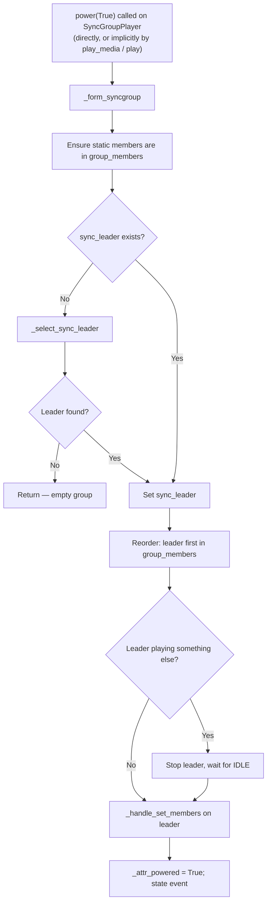
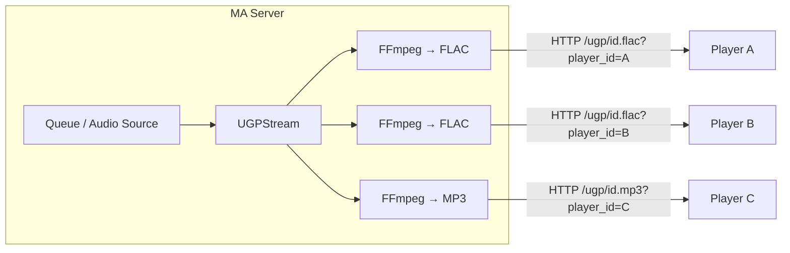
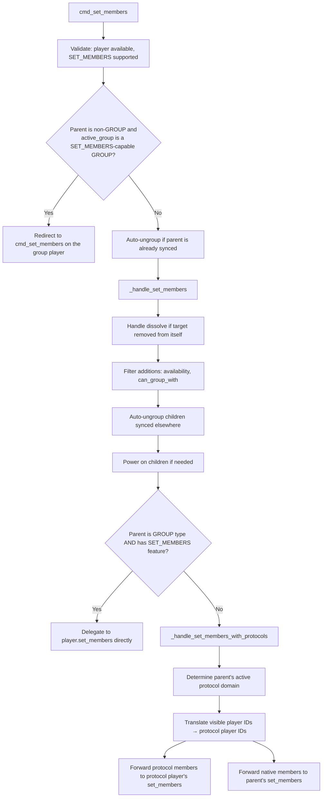
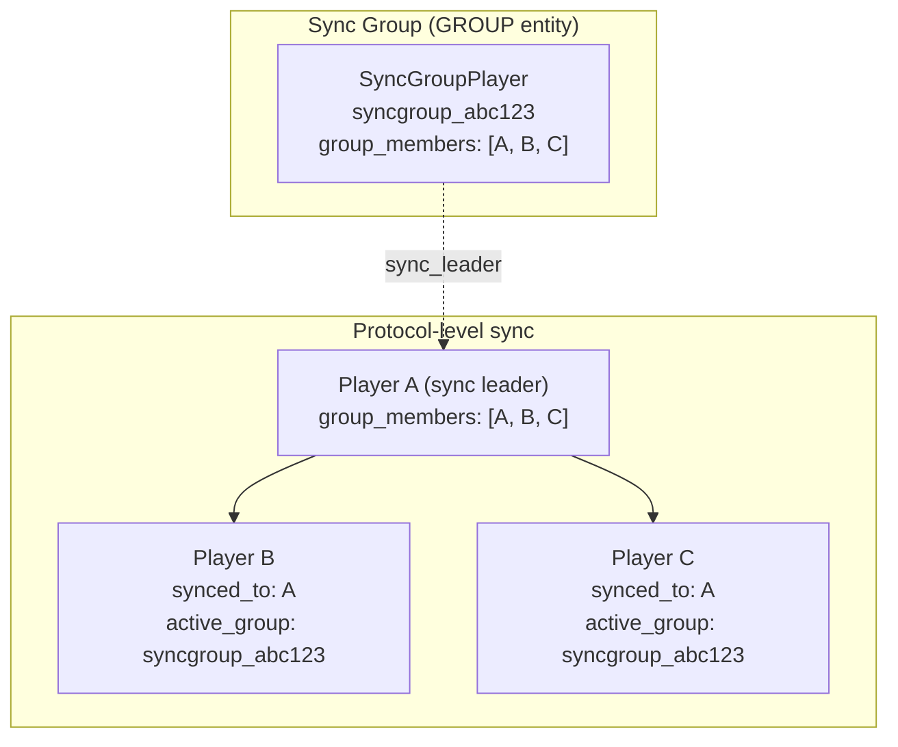

# 06 — Grouping Architecture

Music Assistant supports three distinct grouping models for multi-room audio: **sync groups**, **universal groups**, and **ad-hoc sync**. Each differs in persistence, protocol requirements, and how audio reaches the speakers. All three converge on the same underlying player properties — `group_members`, `synced_to`, and `active_group` — but populate them through fundamentally different mechanisms. This document explains each model, their formation and dissolution lifecycles, and how the controller bridges the user-visible player world with the underlying protocol reality.

## The Three Grouping Models

| | Sync Group | Universal Group | Ad-hoc Sync |
|---|---|---|---|
| **Provider** | `sync_group` | `universal_group` | *(none — native)* |
| **PlayerType** | `GROUP` | `GROUP` | Parent's type (usually `PLAYER`) |
| **Persistent entity** | Yes | Yes | No |
| **Queue ownership** | Group player | Group player | Parent player (sync leader) |
| **Cross-protocol** | No — same protocol only | Yes — any player | No — same protocol only |
| **Audio delivery** | Delegated to sync leader's native protocol | Server-side fan-out (independent HTTP stream per member) | Native protocol sync |
| **Player ID format** | `syncgroup_{random_8}` | `ugp_{random_8}` | N/A |
| **Dissolves on stop** | No — `stop()` only stops the leader; group remains powered. Dissolves only on `power(False)`. | No (persistent power state) | Immediately |
| **Dynamic membership** | Optional (`CONF_DYNAMIC_GROUP_MEMBERS`) | Optional | Always |
| **`SET_MEMBERS` feature** | Only if dynamic | Only if dynamic | Depends on provider |

## Sync Groups

Sync groups are persistent group players that delegate playback to a member's native sync protocol. Created through `SyncGroupProvider.create_group_player()`, each group gets its own player ID (`syncgroup_` prefix) and queue, but never touches audio directly.

**Key class:** `SyncGroupPlayer` (`music_assistant/providers/sync_group/player.py`)

### Sync Leader

The central concept. A sync group selects one member as the **sync leader** — the player that actually receives `play_media`, manages playback state, and syncs the other members to itself via its native protocol (AirPlay-to-AirPlay, Sonos-to-Sonos, etc.).

The sync leader reference is stored as `SyncGroupPlayer.sync_leader: Player | None`.

**Selection logic** (`_select_sync_leader`):

1. If a current leader exists and is available, keep it
2. **Prefer protocol continuity** when re-selecting after a leader change while playing — pick a member that supports the currently active output protocol so the live session can continue without a teardown (#3600)
3. Prioritize static group members (stable across restarts)
4. Fall back to first available member

### Protocol Compatibility

Only same-protocol players can be grouped in a sync group. Enforcement happens through `can_group_with`:

- **Static groups**: return the configured static members directly
- **Dynamic groups with a leader**: return the leader's `can_group_with` minus any filtered members
- **Dynamic groups with members but no leader**: use the first available member's `can_group_with`
- **Empty dynamic groups**: scan all available players that support `SET_MEMBERS` and have `can_group_with`

A `CONF_MEMBERS_FILTER` config entry allows excluding specific players from the grouping options.

### Static vs Dynamic Groups

**Static** groups have fixed membership defined at creation in `CONF_GROUP_MEMBERS`. Members always rejoin when playback starts and cannot be removed at runtime. The `SET_MEMBERS` feature is not advertised.

**Dynamic** groups (`CONF_DYNAMIC_GROUP_MEMBERS = True`) support runtime `SET_MEMBERS` calls. Static members still cannot be removed, but additional members can join or leave freely.

### Feature Inheritance

Base features are `PLAY_MEDIA` and `POWER` (plus `SET_MEMBERS` if dynamic). `POWER` is canonical here because the group's lifecycle is power-driven (see [Lifecycle](#formation-lifecycle) below) — `_attr_powered` is the source of truth for "is this group active". When a sync leader is active, the group also inherits additional features from the leader:

```python
EXTRA_FEATURES_FROM_MEMBERS = {
    PlayerFeature.ENQUEUE,
    PlayerFeature.GAPLESS_PLAYBACK,
    PlayerFeature.VOLUME_SET,
    PlayerFeature.VOLUME_MUTE,
    PlayerFeature.MULTI_DEVICE_DSP,
}
```

This means a sync group's capabilities change dynamically depending on which member is elected leader.

### State Delegation

The sync group delegates most of its observable state to the sync leader. Crucially, it reads the leader's *raw* attributes (`leader.playback_state`, `leader.elapsed_time`, etc.) — **not** `leader.state.*`. This avoids a circular dependency: synced clients (`__final_synced_to`) mirror their leader's `state.playback_state`, so if the group derived from `state.*` and the leader derived from the group, both would deadlock at the previous value. Members of an active group always report their own raw playback state; only manually-synced clients (`synced_to`) mirror the leader.

| Property | Source |
|---|---|
| `playback_state` | Sync leader's raw `playback_state` (or `IDLE` if no leader) |
| `elapsed_time`, `elapsed_time_last_updated` | Sync leader's raw `elapsed_time` / `elapsed_time_last_updated` |
| `current_media` | Sync leader's raw `current_media` (set optimistically in `play_media`) |
| `active_source` | Sync leader's raw `active_source` (with protocol-awareness — see below) |
| `group_members` | Sync leader's reported `state.group_members` (preferred) or internal list |
| `source_list` | Sync leader |
| `powered` | Group's own `_attr_powered` (canonical "is this group active" signal) |

The `active_source` property filters out cases where the sync leader reports a source that actually belongs to an active output protocol (e.g. AirPlay) or a bridged protocol (e.g. Sendspin), to avoid confusing source attribution.

### State Polling

While the group is playing, `SyncGroupPlayer.poll()` runs every 1 second to refresh `elapsed_time` from the sync leader. When idle, the poll interval drops to 30 seconds. This avoids the per-second eventbus cascade that would happen if every leader `elapsed_time` tick propagated through the group's update chain.

### Formation Lifecycle

The group's lifecycle is driven by **power**, not playback. `power(True)` forms the group; `power(False)` dissolves it; `stop()` only stops the leader and the group remains powered and ready to resume. This mirrors how an AVR or stereo system behaves: turn it on, it's an active output; turn it off, it's gone. `play_media` and `play` implicitly trigger `power(True)` if the group is not already powered, then call `_form_syncgroup` (which is idempotent).



The `_form_syncgroup` method is locked (`@lock` decorator from `music_assistant.helpers.util`) to prevent concurrent formation attempts.

> **Why `_handle_set_members` and not `cmd_set_members`?** `cmd_set_members` redirects commands targeting a member of an active group player back to the group itself (see [Active-Group Forwarding](#active-group-forwarding)). If `_form_syncgroup` called `cmd_set_members(sync_leader_id, ...)`, that redirect would loop the command back into `SyncGroupPlayer.set_members` on the same syncgroup. The implementation deliberately calls the lower-level `_handle_set_members` to bypass the redirect. The same reasoning applies to `_dissolve_syncgroup` and `SyncGroupPlayer.set_members` below.

### Stop vs Dissolve

**`stop()`** (or `cmd_stop`) is forwarded to the sync leader and *does not* dissolve the group. The group stays powered and formed; subsequent `play_media` resumes immediately on the same members.

**`_dissolve_syncgroup`** runs only on `power(False)`:

1. If currently playing/paused, the leader is stopped first
2. Get all sync children from the leader's `group_members`
3. Call `_handle_set_members` on the leader to remove all children (waits for state)
4. Clear the leader's `active_output_protocol` (when leader is not still playing)
5. Set `sync_leader = None`
6. `_attr_powered = False`; state event emitted

`_dissolve_syncgroup` is also locked.

### Dynamic Member Changes

When `set_members` is called on a dynamic group during playback:

- **Adding members**:
  - Validates compatibility with the sync leader's `can_group_with`, which now includes the leader's *linked output protocols* (so an AirPlay-only player is valid for a Sonos leader that has AirPlay as a linked protocol).
  - Appends compatible members to the internal list and forwards to `_handle_set_members` on the leader, bypassing the active-group redirect (see the note in [Formation Lifecycle](#formation-lifecycle)).
  - The leader handles protocol selection and may switch to a different output protocol so the new member can join.
  - Incompatible members are **not** registered (avoids stranding orphan entries).
- **Removing the sync leader while playing**: see [Dynamic Leader Switch](#dynamic-leader-switch) below — either a seamless protocol-level handoff or a dissolve + re-form fallback.
- **Removing last member**: Dissolves the group entirely
- **Removing a regular member**: Forwards removal to `_handle_set_members` on the leader
- **Static members cannot be removed** — raises `PlayerCommandFailed`

### Dynamic Leader Switch

Removing the sync leader from a *playing* group used to require a full dissolve + re-form cycle (a brief audio gap). Some protocols now support a **seamless leader handoff** at the protocol level: the live session keeps running while leadership transfers to another member. (#3672)

The constant `PROVIDERS_WITH_DYNAMIC_LEADER_SWITCH` lists the eligible protocols — currently **AirPlay**, **Snapcast**, and **Sendspin**. `PlayerProvider.supports_dynamic_leader_switching` exposes the capability per provider.

When the leader of a playing group is removed:

1. **If the active protocol supports handoff** *and* the chosen new leader is part of the live session (not a freshly added player):
   - On the *old* session player, call `set_members(player_ids_to_remove=[old_leader_protocol_player_id])` to drop just the old leader.
   - On the *new* leader's protocol player, call `set_members(player_ids_to_add=[remaining_protocol_player_ids])` to take ownership.
   - Remaining members keep playing; no audio gap.
   - Implemented in `SyncGroupPlayer._dynamic_leader_switch(old_leader_id)`, which selects a new leader (preferring one that already supports the active protocol), drives the protocol-level membership changes directly via the `set_members` methods on the *protocol players*, and bypasses the controller's `cmd_set_members` (which would interpret self-removal as "dissolve the entire group").
2. **Otherwise**: fall back to dissolve + re-form (brief audio gap).

## Universal Groups

Universal groups solve the cross-protocol problem. Any player that can receive HTTP audio can participate, regardless of its native protocol. Audio synchronization is best-effort since there's no shared clock across protocols.

**Key class:** `UniversalGroupPlayer` (`music_assistant/providers/universal_group/player.py`)

### Server-Side Fan-Out

Unlike sync groups that delegate to a vendor's native sync protocol, universal groups use `UGPStream` for server-side audio distribution. The MA server reads the audio source, converts it to PCM, then fans it out to each member as an independent unicast HTTP stream (one connection per member, not IP multicast). For the full audio processing pipeline that feeds these streams, see [10-streaming-pipeline.md](10-streaming-pipeline.md).



Each member connects to a dynamic HTTP route registered at initialization:

- `/ugp/{player_id}.flac`
- `/ugp/{player_id}.mp3`
- `/ugp/{player_id}.aac`

The `player_id` query parameter identifies the requesting member, enabling per-player DSP filter parameters and output format selection.

### UGPStream Internals

The `UGPStream` class (`music_assistant/providers/universal_group/ugp_stream.py`) manages the fan-out:

1. **`_runner()`**: The core loop. Reads from the audio source through FFmpeg (with readrate limiting at 1.1x to prevent excessive buffering), converts to the base PCM format, and pushes each chunk to all subscribers via `asyncio.gather`
2. **`subscribe_raw()`**: Each connecting client gets an `asyncio.Queue(10)` as its subscriber callback. The runner pushes chunks to all queues. An empty `b""` chunk signals stream end.
3. **`get_stream()`**: Wraps `subscribe_raw()` through a second FFmpeg process for per-client transcoding with custom filter parameters (player-specific DSP)

The runner starts lazily — on the first subscriber connection, with a 0.25s delay to allow other subscribers to connect before audio flows.

### Always Flow Mode

Universal groups require flow mode (`requires_flow_mode = True`). This is inherent to the architecture — the server controls the audio stream and members receive it as a continuous flow, not individual track URLs.

### Base Features

Unlike sync groups that inherit features from a leader, universal groups have a fixed feature set:

```python
BASE_FEATURES = {
    PlayerFeature.PLAY_MEDIA,
    PlayerFeature.POWER,
    PlayerFeature.VOLUME_SET,
    PlayerFeature.MULTI_DEVICE_DSP,
}
```

The `volume_set` implementation is a no-op — group volume is handled entirely by the player controller's `set_group_volume` mechanism (see [07-volume.md](07-volume.md)).

### Power and Membership

Power means something different for each grouping model. Sync groups have no native `power()` implementation — they rely on fake power from the controller, and their "on" state is effectively equivalent to "has members and is ready to play." Universal groups implement `power()` directly and use it to manage member lifecycle: power-on activates members (handling collisions with other groups), power-off deactivates and stops them. Ad-hoc sync has no group-level power concept at all — the sync leader's own power state controls the group. For the general power model across all player types, see [03-player-model.md](03-player-model.md#resolution-chains) and [04-player-controller.md](04-player-controller.md#power-management).

Universal groups have explicit power state management:

**Power on:**
1. Reset `group_members` to available static members
2. For each member:
   - Stop if playing something else
   - Handle collision if member belongs to another active group (leave or power off the other group)
   - Ungroup if synced to another player
   - Power on if needed

**Power off:**
1. Stop playback if active
2. Power off all members
3. Reset `group_members` to static list

### Playback Flow

1. `play_media()` → power on → stop existing stream
2. Create `UGPStream` with audio source from `mass.streams.get_stream`
3. Set state optimistically (PLAYING, elapsed_time = 0)
4. Concurrently send `play_media` to each powered, active member with per-member URL:
   `{base_url}/ugp/{player_id}.flac?player_id={member_id}`

State polling (`_set_attributes`, every 30s) grabs playback state and elapsed time from the first active child player.

### State Attributes

Compared to sync groups, the universal group manages its own state more directly:

| Property | Source |
|---|---|
| `playback_state` | First active child member (via polling) |
| `elapsed_time` | First active child member |
| `current_media` | Stored on group itself (deepcopy of media) |
| `group_members` | Internal `_attr_group_members` |
| `synced_to` | Always `None` (GROUP type) |
| `can_group_with` | Static→static member list; Dynamic→`instance_id` of every `PlayerProvider` except the UGP provider itself |

## Ad-hoc Sync

Ad-hoc sync is direct player-to-player grouping with no persistent group entity. The parent player's native `set_members` is called, creating a temporary sync relationship.

### How It Works

- **Triggered by**: `cmd_group(player_id, target_player)`, `cmd_ungroup(player_id)`, or `cmd_set_members`
- **Parent player**: Becomes the sync leader; its `group_members` list grows
- **Child players**: Their `synced_to` points to the parent
- **Queue**: Belongs to the parent player, not a separate entity
- **Dissolves**: When the parent stops or when manually ungrouped

### Controller API

| Method | Description |
|---|---|
| `cmd_group(player_id, target)` | Add `player_id` to `target`'s members |
| `cmd_group_many(target, children)` | Add multiple children (deprecated alias for `cmd_set_members`) |
| `cmd_ungroup(player_id)` | Remove player from whatever it's grouped to |
| `cmd_ungroup_many(player_ids)` | Ungroup multiple players sequentially |
| `cmd_set_members(target, add, remove)` | Full add/remove control |

`cmd_ungroup` handles multiple scenarios:
1. Player has `active_group` → remove from that GROUP player via `cmd_set_members`
2. Player has `synced_to` → remove from parent via `cmd_set_members`
3. Player has `group_members` (is a leader) → remove all members
4. Fallback: scan all dynamic groups for this player and remove

## The Two-Phase `set_members` Pipeline

All grouping commands converge on `cmd_set_members`, which flows through a two-phase pipeline:



### Active-Group Forwarding

Before phase 1, `cmd_set_members` checks whether the targeted parent is itself a member of an active GROUP player (e.g. a `syncgroup_*`) that supports `SET_MEMBERS`. If so, the command is redirected to that group player so it can manage the membership change consistently. Without this redirect, calling `cmd_group(memberA, memberB)` on two existing members of a syncgroup could create a sync relationship at the protocol level that the group's internal state wouldn't know about (#3718).

### Phase 1: `_handle_set_members`

Handles validation and common logic for all grouping types:

1. **Dissolve detection**: If the target player is in the removal list, dissolve the entire group (remove all children, then stop)
2. **Compatibility check**: Each child must be in `parent_player.state.can_group_with`
3. **Auto-ungroup**: If a child is synced to a *different* player, ungroup it first. The auto-ungroup is skipped when the child is already part of *this* group via its sync leader (`active_group == target_player` and `child_player_id in group_members`) — that's a normal in-group state, not "synced elsewhere" (#3718).
4. **Stale-state ungroup fallback**: When processing removals, the controller accepts a child for removal if either (a) the child is in `parent_player.state.group_members`, or (b) the child itself reports `state.synced_to == target_player`. The (b) branch handles race conditions where the parent's `group_members` is briefly stale after the child has already established the protocol-level sync (#3540).
5. **Power management**: Power on children if needed
6. **GROUP type dispatch**: For `PlayerType.GROUP` that also has `PlayerFeature.SET_MEMBERS` in `supported_features`, call `player.set_members()` directly. Static sync groups (which lack this feature) fall through to phase 2 instead.
7. **Regular player dispatch**: For non-GROUP players, proceed to phase 2

### Phase 2: `_handle_set_members_with_protocols`

Bridges the gap between user-visible player IDs and the underlying protocol reality. This is essential because a user might group "Denon AVR" with "HomePod," but the actual sync happens between the Denon's AirPlay protocol player and the HomePod's native AirPlay.

The method:
1. Identifies the parent's active protocol domain and player
2. Translates each visible player ID to the appropriate protocol player ID (or keeps it native)
3. Splits members into protocol-routed and native-routed lists
4. Forwards each list to the appropriate player's `set_members`

This translation is the bridge described in [05-protocol-linking.md](05-protocol-linking.md) — the protocol linking system determines *which* protocol player to use, and this method maps the user's intent onto that protocol reality.

## The Three Relationship Properties

These three properties on `Player` describe group membership from different perspectives. They are frequently confused because they overlap in non-obvious ways.

### `group_members` → Leader/group's view

A list of player IDs that are part of this player's group:

- On a **GROUP** player (sync group, universal group): all member player IDs
- On an **ad-hoc sync leader**: all synced member IDs, including self as first element
- On a **regular player** with no group: empty list

The base implementation uses `_attr_group_members`. Sync groups override it to prefer the sync leader's reported members (source of truth for the actual active group).

### `synced_to` → Child's view

The player ID of the sync leader this player is synced to:

- On a **child** synced to a leader: the leader's player ID
- On a **GROUP** player: always `None` (groups cannot be synced)
- On an **unsynced** player: `None`

The default implementation scans all players from the same provider looking for one whose `group_members` includes this player.

### `active_group` → Any player's view

The player ID of the currently active (playing or paused) GROUP player this player belongs to:

- Computed by scanning all available GROUP players
- Returns the ID of the first GROUP player that is playing/paused and includes this player in its `group_members`
- Protocol players always return `None`

### How They Interact

A player can simultaneously have:
- `synced_to` set (synced to an ad-hoc leader within a sync group)
- `active_group` set (part of a playing GROUP player)

This happens in sync groups: member players are synced to the sync leader (ad-hoc sync at the protocol level), while also being members of the GROUP entity.



Player A (sync leader) has `synced_to = None` and `active_group = syncgroup_abc123`.
Players B and C have `synced_to = A` (protocol-level) and `active_group = syncgroup_abc123` (GROUP-level).

## Final Computed Properties

The raw `group_members`, `synced_to`, and `active_group` from providers go through `__final_*` computation in `Player.update_state()` before reaching the API.

### `__final_group_members`

1. If this player has `synced_to` set → return `[]` (children don't have their own group)
2. Translate native `group_members` through `_translate_protocol_ids_to_visible` (maps protocol player IDs to their visible parent players)
3. If an active output protocol exists, include its group members (also translated)
4. For non-GROUP types: ensure self is first; return `[]` if only self

### `__final_synced_to`

1. Check native `synced_to` → translate to `protocol_parent_id` if the sync parent is a protocol player
2. Check linked protocol players' `synced_to` → translate protocol sync parent to visible parent

### `__final_active_group`

1. Protocol players → `None` (follow parent's group state)
2. Scan all enabled, available GROUP players
3. Return the first one that is playing/paused and includes this player in `state.group_members`

## Helper Methods

### `iter_group_members`

Controller method that iterates children of a group/sync leader with filtering:

```python
def iter_group_members(
    self,
    group_player: Player,
    only_powered: bool = False,
    only_playing: bool = False,
    active_only: bool = False,
    exclude_self: bool = True,
) -> Iterator[Player]:
```

Filters: available + enabled (always), powered, playing, active (checks `active_group` matches), exclude self. Used extensively by volume control, announcements, and group commands.

### `_get_player_groups`

Returns all GROUP players a given player belongs to, with optional availability and power filtering. Used to detect group collisions.

### `_get_player_with_redirect`

Redirects playback commands from grouped children to their sync leader or group player:
1. If `synced_to` is set → redirect to sync leader
2. If `active_group` is set → redirect to group player

This ensures commands like play/stop/pause always reach the entity that owns the queue.

## Key Files

| File | Role |
|---|---|
| [`music_assistant/providers/sync_group/player.py`](../../music_assistant/providers/sync_group/player.py) | `SyncGroupPlayer` — sync leader delegation, formation/dissolution |
| [`music_assistant/providers/sync_group/provider.py`](../../music_assistant/providers/sync_group/provider.py) | `SyncGroupProvider` — create/remove/discover |
| [`music_assistant/providers/sync_group/constants.py`](../../music_assistant/providers/sync_group/constants.py) | `SGP_PREFIX`, `EXTRA_FEATURES_FROM_MEMBERS`, `CONF_MEMBERS_FILTER` |
| [`music_assistant/providers/universal_group/player.py`](../../music_assistant/providers/universal_group/player.py) | `UniversalGroupPlayer` — server-side fan-out, power management |
| [`music_assistant/providers/universal_group/provider.py`](../../music_assistant/providers/universal_group/provider.py) | `UniversalGroupProvider` — create/remove/discover |
| [`music_assistant/providers/universal_group/ugp_stream.py`](../../music_assistant/providers/universal_group/ugp_stream.py) | `UGPStream` — fan-out subscriber model |
| [`music_assistant/providers/universal_group/constants.py`](../../music_assistant/providers/universal_group/constants.py) | `UGP_PREFIX`, `UGP_FORMAT`, `CONFIG_ENTRY_UGP_NOTE` |
| [`music_assistant/controllers/players/controller.py`](../../music_assistant/controllers/players/controller.py) | `cmd_set_members`, `_handle_set_members`, `_handle_set_members_with_protocols`, `iter_group_members`, `_get_player_groups` |
| [`music_assistant/models/player.py`](../../music_assistant/models/player.py) | `group_members`, `synced_to`, `__final_group_members`, `__final_synced_to`, `__final_active_group` |
