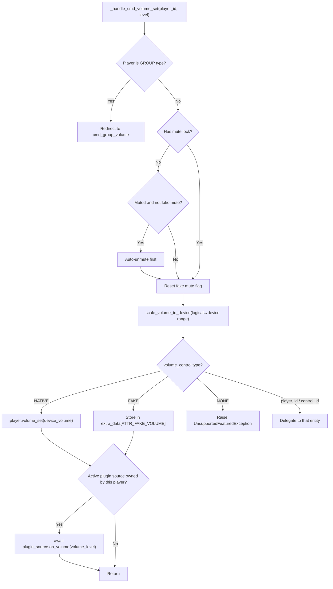
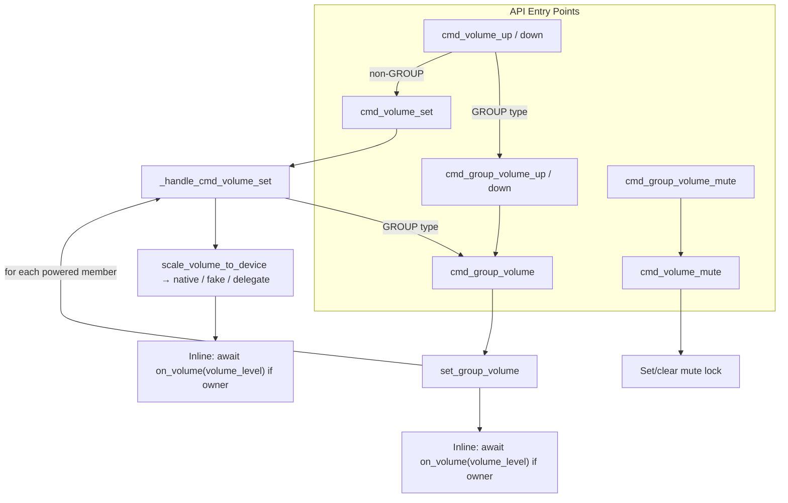

# 07 — Volume Control

Volume control in Music Assistant spans individual players, group players, and plugin sources. Individual volume routes through a configurable control chain (native, fake, delegated). Group volume uses interpolation-based scaling that preserves relative balance between speakers and reaches full silence/full volume at the extremes. Plugin sources hook into volume changes via inline callbacks. This document covers all three paths, per-player volume limits, the mute lock mechanism, announcement volume, and known architectural limitations.

The three control modes — `NATIVE`, `FAKE`, and `NONE` — apply identically to volume and mute. **NATIVE** means the player (or its active protocol) handles the command in hardware or firmware. **FAKE** means MA simulates the control in software: for volume, the level is stored in `extra_data` and used in DSP calculations; for mute, the current volume is saved, set to 0, and restored on unmute. **NONE** means the control is disabled — volume/mute commands raise `UnsupportedFeaturedException`. Beyond these three, the config can specify a specific player ID (delegating to a protocol player like Chromecast) or a `PlayerControl` ID (delegating to an external Home Assistant entity). The **mute lock** is a group-specific safeguard: when a user deliberately mutes a player within a group, a lock flag prevents subsequent group volume adjustments from auto-unmuting it. For how these modes are resolved from config, see [03-player-model.md](03-player-model.md#resolution-chains).

## Individual Volume Routing

All volume commands enter through `cmd_volume_set(player_id, volume_level)` in the player controller, which delegates to the internal `_handle_cmd_volume_set`. The routing depends on the player's `volume_control` property (resolved through the config chain described in [03-player-model.md](03-player-model.md)).



After `_handle_cmd_volume_set` finishes its native/fake/delegate routing, if the player is the direct owner of an active plugin source (`plugin_source.in_use_by == player.player_id`), it `await`s `on_volume(volume_level)` synchronously before returning. `set_group_volume` does the same at the group level after all child volumes have been applied.

### Volume Control Resolution

The `volume_control` cached property on `Player` resolves in this order:

1. **Explicit config** — if set to `NATIVE`, `FAKE`, or `NONE`, use directly
2. **Explicit player/control ID** — if set to a specific player or control ID, delegate to it (if available)
3. **Auto-select** — if the player supports `PlayerFeature.VOLUME_SET` natively, use `NATIVE`. Otherwise check linked protocol players for volume support.
4. **Fallback** — `NONE` (no volume control)

### Auto-Unmute on Volume Change

Before setting volume, the handler checks:

1. If the player has `ATTR_MUTE_LOCK` in `extra_data`, skip auto-unmute (the user deliberately muted this player)
2. If the player is muted and the mute control is not `NONE` or `FAKE`, unmute first
3. Always reset fake mute state (`ATTR_FAKE_MUTE`)

This ensures that adjusting volume on a muted player restores audio, unless the user explicitly muted it within a group context.

## Volume Limits

Per-player minimum and maximum device volume can be configured via `CONF_MIN_VOLUME` and `CONF_MAX_VOLUME`. The controller translates between the logical 0–100 range that the rest of the system uses and the device-specific range.

- **`_get_volume_limits(player_id)`** — reads `CONF_MIN_VOLUME` and `CONF_MAX_VOLUME` from player config, returning a `(min, max)` tuple (default 0 and 100).
- **`scale_volume_to_device(player_id, logical_volume)`** — maps logical 0–100 to the device's min–max range. Called by `_handle_cmd_volume_set` before `player.volume_set()`.
- **`scale_volume_from_device(player_id, device_volume)`** — the inverse mapping. Called by `Player.__final_volume_level` so the UI always sees logical 0–100 regardless of what the device reports.
- **`_enforce_volume_limits(player)`** — called from `signal_player_state_update` whenever `volume_level` changes. If the player reports a device volume outside the configured range (e.g. adjusted externally), it schedules a corrective `player.volume_set()` call to bring it back in range.

When min and max are both at their defaults (0 and 100), all three scale methods are no-ops.

## Plugin Volume Callbacks

When a volume command completes, the controller fires `plugin_source.on_volume(volume_level)` synchronously (inline) if an active plugin source owns the player:

- In `_handle_cmd_volume_set`: after the routing branch returns, the controller checks `_get_active_plugin_source(player)`. If a source is found and `plugin_source.in_use_by == player.player_id`, `on_volume(volume_level)` is awaited.
- In `set_group_volume`: after `asyncio.gather` completes on all child volume sets, the same check runs on the group player with the commanded `volume_level`.

The `in_use_by == player.player_id` ownership check ensures only the plugin-owning player fires the callback. Individual member volume changes within a group **do not** trigger `on_volume` on the group's plugin — only a group-level `set_group_volume` or a standalone player's `_handle_cmd_volume_set` produces a plugin callback. This is an intentional simplification: it eliminates per-child callbacks during group operations (which previously caused feedback loops with bidirectional plugins like Spotify Connect) at the cost of not surfacing individual member adjustments to the external service.

The callback always receives the commanded `volume_level` (not a derived average), which is the value that was just applied.

**Plugin source matching** (`_get_active_plugin_source`): A `PluginSource` is considered active for a player if either:
- `plugin_source.in_use_by == player.player_id`, or
- `player.state.active_source == plugin_source.id`

See [11-plugin-system.md](11-plugin-system.md#in_use_by-semantics) for the full plugin source model.

## Group Volume — Interpolation-Based Scaling

Group volume applies proportional scaling to all powered members, preserving their relative balance and ensuring the slider reaches full silence and full volume at the extremes.

### Sync Leader Redirect

Before the algorithm runs, `cmd_group_volume` performs routing:

- **GROUP type or has group_members** → call `set_group_volume` directly
- **Synced to another player** → redirect to `set_group_volume` on the sync leader
- **Neither** → fall back to `cmd_volume_set` (treat as individual volume)

Note the asymmetry: `cmd_group_volume_mute` does **not** redirect to the sync leader. It only handles GROUP-type players and players with group_members. Calling group mute on a sync follower is a no-op.

### The Algorithm

`set_group_volume(group_player, volume_level)` in the player controller:

```python
children = [c for c in iter_group_members(group_player, only_powered=True)
            if c.state.volume_control != PLAYER_CONTROL_NONE]

# Take a snapshot of child volumes on first adjustment (invalidated on individual changes)
snapshot = group_player.extra_data.get(ATTR_GROUP_VOLUME_SNAPSHOT)
if snapshot is None or not all(c.player_id in snapshot for c in children):
    snapshot = {c.player_id: c.state.volume_level or 0 for c in children}
    group_player.extra_data[ATTR_GROUP_VOLUME_SNAPSHOT] = snapshot

base_group = max(snapshot.values())  # loudest child at snapshot time

for child in children:
    child_base = snapshot[child.player_id]
    if volume_level >= base_group:
        # scale up: interpolate child_base toward 100
        if base_group >= 100:
            new = child_base
        else:
            progress = (volume_level - base_group) / (100 - base_group)
            new = round(child_base + (100 - child_base) * progress)
    elif base_group == 0:
        new = 0
    else:
        # scale down: interpolate child_base toward 0
        new = round(child_base * (volume_level / base_group))
    new = clamp(new, 0, 100)
    # set volume on child
```

All child volume sets execute concurrently via `asyncio.gather`. After the gather completes, `on_volume(volume_level)` is fired on the group's active plugin source (if any) — see [Plugin Volume Callbacks](#plugin-volume-callbacks).

### Why Interpolation-Based Scaling

- All members reach 0 when the slider hits 0 and 100 when it hits 100
- Relative balance between speakers is preserved across the full range
- Returning the slider to its original position restores the exact original child volumes
- A child at volume 0 will still increase when raising the group slider (unlike additive-delta, where a child stuck at 0 would remain at 0)

### Snapshot Invalidation

The snapshot is cleared whenever an individual child's volume is set directly (via `_invalidate_group_volume_snapshot`, called from `cmd_volume_set` for non-GROUP players) or when group membership changes. The next group adjustment then captures a fresh snapshot from the current state.

```python
def _invalidate_group_volume_snapshot(player_id):
    # clears ATTR_GROUP_VOLUME_SNAPSHOT from the player itself,
    # from all group players it belongs to, and from its sync leader
```

### `group_volume` Property

Computed on the `Player` model, not stored. The calculation:

- **No group members**: return `state.volume_level` (or `None` if `volume_control == NONE`)
- **Has group members**: return the **maximum** `volume_level` across all powered members (via `iter_group_members`). This makes the group slider act as a master fader representing the loudest speaker, ensuring the slider always has the full 0–100 range available regardless of individual member levels. Returns `None` if no members support volume.

### `group_volume_muted` Property

Also computed, not stored:

- **No group members**: return `state.volume_muted`
- **Has group members**: `True` if all powered members are muted. `False` if all powered members are unmuted. `None` if the state is mixed (some muted, some unmuted) or if no members support mute.

## Volume Up/Down

### Individual Volume

`cmd_volume_up` and `cmd_volume_down` use **variable step sizes** based on current volume level:

| Volume Range | Step Size |
|---|---|
| < 10 or > 90 | 1 |
| 10–30 or 70–90 | 2 |
| 30–70 | 3 |

This provides finer control at the extremes where small changes are more noticeable.

For GROUP type players, these redirect to `cmd_group_volume_up` / `cmd_group_volume_down`.

### Group Volume Up/Down

`cmd_group_volume_up` and `cmd_group_volume_down` use the same variable step size algorithm but read from `state.group_volume` and delegate to `cmd_group_volume`.

## Group Mute

`cmd_group_volume_mute(player_id, muted)`:

1. Iterates all powered group members (including self, `exclude_self=False`)
2. Calls `cmd_volume_mute` on each member concurrently via `asyncio.gather`

Each individual `cmd_volume_mute` call sets or clears the mute lock (described below).

## The Mute Lock Mechanism

The mute lock (`ATTR_MUTE_LOCK` in `extra_data`) prevents auto-unmute during group volume changes. Without it, adjusting group volume would unmute players the user had deliberately muted.

### How It Works

In `cmd_volume_mute`:

```python
is_in_group = bool(player.state.synced_to or player.state.active_group)
if muted and is_in_group:
    player.extra_data[ATTR_MUTE_LOCK] = True
elif not muted:
    player.extra_data.pop(ATTR_MUTE_LOCK, None)
```

- **Muting a grouped player** → sets lock
- **Unmuting any player** → clears lock

In `_handle_cmd_volume_set`, the lock is checked before auto-unmute:

```python
has_mute_lock = player.extra_data.get(ATTR_MUTE_LOCK, False)
if not has_mute_lock and player.state.volume_muted:
    await self.cmd_volume_mute(player_id, False)  # auto-unmute
```

### Practical Scenario

1. User mutes Kitchen speaker (in a group) → lock set
2. User raises group volume → `set_group_volume` calls `_handle_cmd_volume_set` on Kitchen
3. Kitchen has mute lock → volume level changes in data but player remains muted
4. User explicitly unmutes Kitchen → lock cleared, full volume restored

## Volume During Announcements

The announcement flow (in `_play_announcement` on the controller) manages volume in a save-adjust-restore cycle:

1. **Save** current volume level
2. **Adjust** to announcement volume via `get_announcement_volume`
3. **Play** the announcement
4. **Restore** the previous volume

### `get_announcement_volume`

Resolves the target volume based on per-player config:

| Strategy | Behavior |
|---|---|
| `none` | No volume adjustment — play at current volume |
| `absolute` | Set to a fixed level (e.g. always play at 50) |
| `relative` | Add/subtract from current volume (e.g. current + 10) |
| `percentual` | Additive percentage: `result = current + (current / 100) * strategy_value` (e.g. current=60, strategy_value=50 → 60 + 30 = 90) |

After computing the target level, it's clamped between `CONF_ENTRY_ANNOUNCE_VOLUME_MIN` and `CONF_ENTRY_ANNOUNCE_VOLUME_MAX`.

A `volume_override` parameter can bypass the strategy entirely (used when the API caller specifies an explicit volume).

## Volume Command Flow Summary



Plugin volume uses inline `on_volume` from both `set_group_volume` and `_handle_cmd_volume_set`, gated by `plugin_source.in_use_by == player.player_id`. See [Plugin Volume Callbacks](#plugin-volume-callbacks).

## Key Files

| File | Role |
|---|---|
| [`music_assistant/controllers/players/controller.py`](../../music_assistant/controllers/players/controller.py) | `cmd_volume_set`, `cmd_volume_up/down`, `cmd_group_volume`, `cmd_group_volume_up/down`, `cmd_group_volume_mute`, `set_group_volume`, `_handle_cmd_volume_set`, `_get_active_plugin_source`, `_get_volume_limits`, `scale_volume_to_device`, `scale_volume_from_device`, `_enforce_volume_limits`, `_invalidate_group_volume_snapshot`, `get_announcement_volume` |
| [`music_assistant/models/player.py`](../../music_assistant/models/player.py) | `group_volume`, `group_volume_muted` (computed properties), `volume_control`, `mute_control`, `__final_volume_level`, `__final_volume_muted_state` |
| [`music_assistant/models/plugin.py`](../../music_assistant/models/plugin.py) | `PluginSource` — `on_volume` callback, `in_use_by` field |
