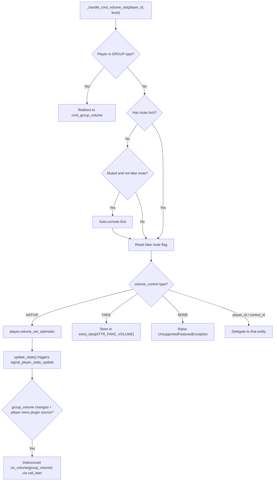
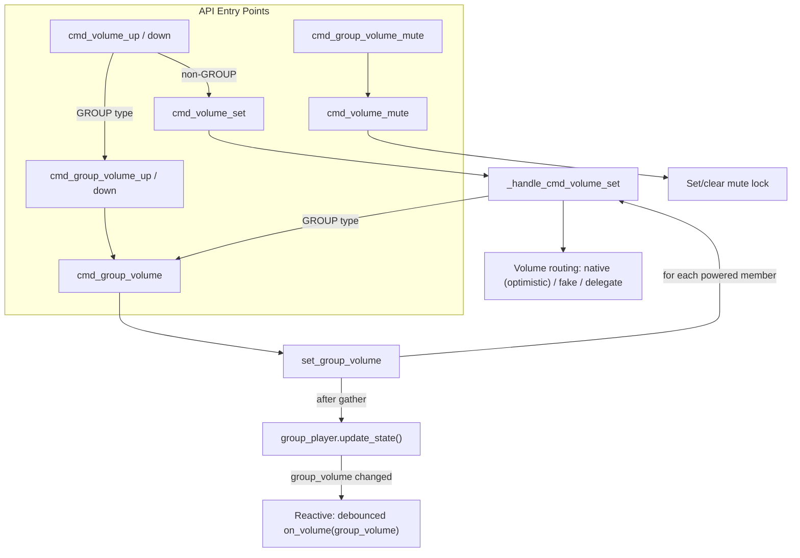

# 07 — Volume Control

Volume control in Music Assistant spans individual players, group players, and plugin sources. Individual volume routes through a configurable control chain (native, fake, delegated). Group volume uses an additive-delta algorithm that preserves relative differences between speakers. Plugin sources can hook into volume changes via callbacks. This document covers all three paths, the mute lock mechanism, announcement volume, and known architectural limitations.

The three control modes — `NATIVE`, `FAKE`, and `NONE` — apply identically to volume and mute. **NATIVE** means the player (or its active protocol) handles the command in hardware or firmware. **FAKE** means MA simulates the control in software: for volume, the level is stored in `extra_data` and used in DSP calculations; for mute, the current volume is saved, set to 0, and restored on unmute. **NONE** means the control is disabled — volume/mute commands raise `UnsupportedFeaturedException`. Beyond these three, the config can specify a specific player ID (delegating to a protocol player like Chromecast) or a `PlayerControl` ID (delegating to an external Home Assistant entity). The **mute lock** is a group-specific safeguard: when a user deliberately mutes a player within a group, a lock flag prevents subsequent group volume adjustments from auto-unmuting it. For how these modes are resolved from config, see [03-player-model.md](03-player-model.md#resolution-chains).

## Individual Volume Routing

All volume commands enter through `cmd_volume_set(player_id, volume_level)` in the player controller, which delegates to the internal `_handle_cmd_volume_set`. The routing depends on the player's `volume_control` property (resolved through the config chain described in [03-player-model.md](03-player-model.md)).



### Volume Control Resolution

The `volume_control` cached property on `Player` resolves in this order:

1. **Explicit config** — if set to `NATIVE`, `FAKE`, or `NONE`, use directly
2. **Explicit player/control ID** — if set to a specific player or control ID, delegate to it (if available)
3. **Auto-select** — if the player supports `PlayerFeature.VOLUME_SET` natively, use `NATIVE`. Otherwise check linked protocol players for volume support.
4. **Fallback** — `NONE` (no volume control)

### Auto-Unmute on Volume Change

Before setting volume, the handler checks:

1. If the player has `ATTR_MUTE_LOCK` in `extra_data`, skip auto-unmute (the user deliberately muted this player)
2. If the player is muted and the mute control is not `NONE` or `FAKE`, unmute first
3. Always reset fake mute state (`ATTR_FAKE_MUTE`)

This ensures that adjusting volume on a muted player restores audio, unless the user explicitly muted it within a group context.

### Plugin Volume Callbacks

Plugin volume notifications are handled **reactively** through the state system, not inline in `_handle_cmd_volume_set`. When any volume change causes a player's `group_volume` to change, `signal_player_state_update` fires a debounced callback to the plugin source that **owns** that player:

```python
if "group_volume" in changed_values:
    for plugin_source in self.get_plugin_sources():
        if plugin_source.in_use_by == player.player_id and plugin_source.on_volume:
            self.mass.call_later(
                0.25, plugin_source.on_volume, player.state.group_volume,
                task_id=f"plugin_volume_{player.player_id}",
            )
```

The `in_use_by == player.player_id` check ensures only the plugin-owning player fires the callback — child players that merely inherit `active_source` from a group do not trigger it. This eliminates per-child callbacks during group volume operations, which previously caused feedback loops with bidirectional plugins like Spotify Connect.

The callback always sends the computed `group_volume` (the average of powered members for groups, or the individual `volume_level` for standalone players), not a raw individual child volume. The `call_later` with a `task_id` debounces rapid changes — during slider drags, only the final value is sent to the plugin's API.

**Plugin source matching** (`_get_active_plugin_source`): A `PluginSource` is considered active for a player if either:
- `plugin_source.in_use_by == player.player_id`, or
- `player.state.active_source == plugin_source.id`

Individual member volume changes within a group propagate to the plugin automatically: the child's `update_state()` triggers a debounced `update_state()` on the group player, which recalculates `group_volume` and fires the reactive hook. See [11-plugin-system.md](11-plugin-system.md#in_use_by-semantics) for the full plugin source model.

## Group Volume — The Additive-Delta Algorithm

Group volume applies a uniform delta to all powered members, preserving their relative volume relationships.

### Sync Leader Redirect

Before the algorithm runs, `cmd_group_volume` performs routing:

- **GROUP type or has group_members** → call `set_group_volume` directly
- **Synced to another player** → redirect to `set_group_volume` on the sync leader
- **Neither** → fall back to `cmd_volume_set` (treat as individual volume)

Note the asymmetry: `cmd_group_volume_mute` does **not** redirect to the sync leader. It only handles GROUP-type players and players with group_members. Calling group mute on a sync follower is a no-op.

### The Algorithm

`set_group_volume(group_player, volume_level)` in the player controller:

```python
cur_volume = group_player.state.group_volume  # average of powered members
volume_dif = volume_level - cur_volume
for child_player in iter_group_members(group_player, only_powered=True):
    if child_player.state.volume_control == PLAYER_CONTROL_NONE:
        continue
    cur_child_volume = child_player.state.volume_level or 0
    new_child_volume = clamp(cur_child_volume + volume_dif, 0, 100)
    # Set volume on each child
```

All child volume sets execute concurrently via `asyncio.gather`. After the gather completes, `group_player.update_state()` is called to force immediate recalculation of `group_volume` from the children's new volumes. Without this, the group state update is debounced by 0.25s — if a plugin echo arrives in that window, `set_group_volume` would read a stale `group_volume` and compute a non-zero delta. The forced update also triggers the reactive plugin volume hook in `signal_player_state_update`.

### Why Additive-Delta

Additive-delta preserves the *absolute* differences between speakers. If the living room is at 60 and the kitchen is at 40 (group average 50), setting group volume to 55 adds +5 to both → 65 and 45. The relative balance is maintained.

### Clamping and Drift

When a child volume would exceed [0, 100], it clamps. This can cause drift:

| Speaker | Before | Delta +10 | After (clamped) | Lost |
|---|---|---|---|---|
| Living Room | 95 | +10 | 100 | 5 units lost |
| Kitchen | 40 | +10 | 50 | — |

The inverse operation (delta -10) produces Living Room = 90, Kitchen = 40 — the original 55-unit gap has shrunk to 50. The relative ratio is not restored.

This is an accepted characteristic. For typical use cases (moderate volume levels, small adjustments), it rarely causes noticeable imbalance.

### `group_volume` Property

Computed on the `Player` model, not stored. The calculation:

- **No group members**: return `state.volume_level` (or `None` if `volume_control == NONE`)
- **Has group members**: average the `volume_level` of all powered members (via `iter_group_members`). `exclude_self` is `True` for GROUP types but `False` for `PLAYER` types (ad-hoc sync leaders include themselves). Returns `None` if no members support volume.

### `group_volume_muted` Property

Also computed, not stored:

- **No group members**: return `state.volume_muted`
- **Has group members**: `True` if all powered members are muted. `False` if all powered members are unmuted. `None` if the state is mixed (some muted, some unmuted) or if no members support mute.

## Volume Up/Down

### Individual Volume

`cmd_volume_up` and `cmd_volume_down` use **variable step sizes** based on current volume level:

| Volume Range | Step Size |
|---|---|
| < 10 or > 90 | 1 |
| 10–30 or 70–90 | 2 |
| 30–70 | 3 |

This provides finer control at the extremes where small changes are more noticeable.

For GROUP type players, these redirect to `cmd_group_volume_up` / `cmd_group_volume_down`.

### Group Volume Up/Down

`cmd_group_volume_up` and `cmd_group_volume_down` use the same variable step size algorithm but read from `state.group_volume` and delegate to `cmd_group_volume`.

## Group Mute

`cmd_group_volume_mute(player_id, muted)`:

1. Iterates all powered group members (including self, `exclude_self=False`)
2. Calls `cmd_volume_mute` on each member concurrently via `asyncio.gather`

Each individual `cmd_volume_mute` call sets or clears the mute lock (described below).

## The Mute Lock Mechanism

The mute lock (`ATTR_MUTE_LOCK` in `extra_data`) prevents auto-unmute during group volume changes. Without it, adjusting group volume would unmute players the user had deliberately muted.

### How It Works

In `cmd_volume_mute`:

```python
is_in_group = bool(player.state.synced_to or player.state.active_group)
if muted and is_in_group:
    player.extra_data[ATTR_MUTE_LOCK] = True
elif not muted:
    player.extra_data.pop(ATTR_MUTE_LOCK, None)
```

- **Muting a grouped player** → sets lock
- **Unmuting any player** → clears lock

In `_handle_cmd_volume_set`, the lock is checked before auto-unmute:

```python
has_mute_lock = player.extra_data.get(ATTR_MUTE_LOCK, False)
if not has_mute_lock and player.state.volume_muted:
    await self.cmd_volume_mute(player_id, False)  # auto-unmute
```

### Practical Scenario

1. User mutes Kitchen speaker (in a group) → lock set
2. User raises group volume → `set_group_volume` calls `_handle_cmd_volume_set` on Kitchen
3. Kitchen has mute lock → volume level changes in data but player remains muted
4. User explicitly unmutes Kitchen → lock cleared, full volume restored

## Volume During Announcements

The announcement flow (in `_play_announcement` on the controller) manages volume in a save-adjust-restore cycle:

1. **Save** current volume level
2. **Adjust** to announcement volume via `get_announcement_volume`
3. **Play** the announcement
4. **Restore** the previous volume

### `get_announcement_volume`

Resolves the target volume based on per-player config:

| Strategy | Behavior |
|---|---|
| `none` | No volume adjustment — play at current volume |
| `absolute` | Set to a fixed level (e.g. always play at 50) |
| `relative` | Add/subtract from current volume (e.g. current + 10) |
| `percentual` | Additive percentage: `result = current + (current / 100) * strategy_value` (e.g. current=60, strategy_value=50 → 60 + 30 = 90) |

After computing the target level, it's clamped between `CONF_ENTRY_ANNOUNCE_VOLUME_MIN` and `CONF_ENTRY_ANNOUNCE_VOLUME_MAX`.

A `volume_override` parameter can bypass the strategy entirely (used when the API caller specifies an explicit volume).

## Volume Command Flow Summary



Plugin volume notification is handled reactively: when `group_volume` changes during `signal_player_state_update`, a debounced `on_volume` callback fires for the plugin-owning player. See [Plugin Volume Callbacks](#plugin-volume-callbacks).

## Key Files

| File | Role |
|---|---|
| [`music_assistant/controllers/players/controller.py`](../../music_assistant/controllers/players/controller.py) | `cmd_volume_set`, `cmd_volume_up/down`, `cmd_group_volume`, `cmd_group_volume_up/down`, `cmd_group_volume_mute`, `set_group_volume`, `_handle_cmd_volume_set`, `_get_active_plugin_source`, `get_announcement_volume` |
| [`music_assistant/models/player.py`](../../music_assistant/models/player.py) | `group_volume`, `group_volume_muted` (computed properties), `volume_control`, `mute_control`, `__final_volume_level`, `__final_volume_muted_state` |
| [`music_assistant/models/plugin.py`](../../music_assistant/models/plugin.py) | `PluginSource` — `on_volume` callback, `in_use_by` field |
