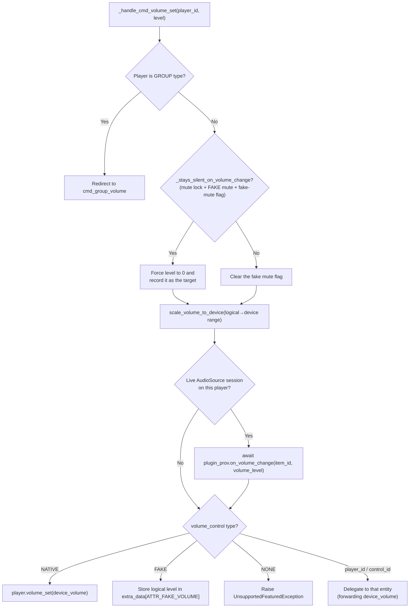
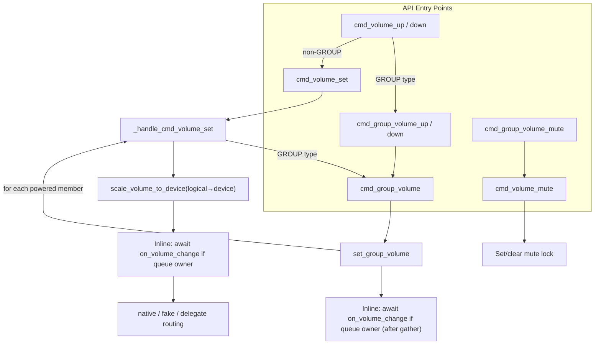

# 07 — Volume Control

Volume control in Music Assistant spans individual players, group players, and live audio sources from plugins. Individual volume routes through a configurable control chain (native, fake, delegated). Group volume uses interpolation-based scaling that preserves relative balance between speakers and reaches full silence/full volume at the extremes. Plugin-provided `AudioSource` items are notified of volume changes via an inline callback so an upstream service can keep its own slider in sync. This document covers all three paths, per-player volume limits, the mute lock mechanism, announcement volume, and known architectural limitations.

The three control modes — `NATIVE`, `FAKE`, and `NONE` — apply identically to volume and mute. **NATIVE** means the player (or its active protocol) handles the command in hardware or firmware. **FAKE** means MA simulates the control in software: for volume, the level is stored in `extra_data` and used in DSP calculations; for mute, the current volume is saved, set to 0, and restored on unmute. **NONE** means the control is disabled — volume/mute commands raise `UnsupportedFeaturedException`. Beyond these three, the config can specify a specific player ID (delegating to a protocol player like Chromecast), a `PlayerControl` ID (delegating to an external Home Assistant entity), or the [`follow_protocol` sentinel](#the-follow_protocol-sentinel) that defers to automatic resolution. The **mute lock** is a group-specific safeguard: when a user deliberately mutes a player within a group, a lock flag records that intent so a subsequent group volume adjustment cannot undo it. For how these modes are resolved from config, see [03-player-model.md](03-player-model.md#resolution-chains).

## Individual Volume Routing

All volume commands enter through `cmd_volume_set(player_id, volume_level)` in the player controller, which delegates to the internal `_handle_cmd_volume_set`. The routing depends on the player's `volume_control` property (resolved through the config chain described in [03-player-model.md](03-player-model.md)).



Before `_handle_cmd_volume_set` dispatches to the native/fake/delegate routing, if the player has a live [`AudioSourceSession`](04-player-controller.md#live-audiosource-sessions), it `await`s `on_volume_change` synchronously. This guarantees the plugin sees the commanded value before any hardware confirmation can echo back. Note the lookup is by **player**, not by queue: a live source is owned by the player, so it no longer matters which queue (if any) is involved. `set_group_volume` follows the inverse pattern at the group level: it fires the callback *after* all child volumes have been applied (since the group volume itself isn't a hardware command — only the children's volumes are).

### Volume Control Resolution

The `volume_control` cached property on `Player` resolves in this order:

1. **Explicit config** — if set to `NATIVE`, `FAKE`, or `NONE`, use directly
2. **Explicit player/control ID** — any value that is not one of the three above and not the `follow_protocol` sentinel is treated as a concrete player or `PlayerControl` ID and delegated to (if available)
3. **Auto-select** — if the player supports `PlayerFeature.VOLUME_SET` natively, use `NATIVE`. Otherwise look for a linked protocol player with volume support, via `_get_protocol_player_for_feature(..., require_active=False)` so an idle Chromecast still qualifies.
4. **Fallback** — `NONE` (no volume control)

`mute_control` resolves identically against `PlayerFeature.VOLUME_MUTE`.

#### The `follow_protocol` Sentinel

`PLAYER_CONTROL_PROTOCOL` (`"follow_protocol"`) is the config value meaning *"resolve this automatically, following whichever protocol can handle it"*. It — along with the legacy `"auto"` value — is what makes step 2 fall through to the auto-select in step 3; every other non-reserved value is read as an explicit delegation target.

The option is offered for `CONF_VOLUME_CONTROL` and `CONF_MUTE_CONTROL` only when the player has no native control of its own but a linked protocol player does, and it becomes the entry default in that case. Since entry defaults pick the first non-disabled option, `NATIVE` still wins wherever the player supports it. Chromecast and DLNA protocol players are additionally offered as *explicit* targets, because they can accept volume commands even when they are not the active output protocol.

### A muted player stays muted

Setting the volume on a muted player used to unmute it first. That is **no longer the case** (#5706): mute and volume are independent, and only an explicit unmute lifts a mute. Adjusting the volume of a muted player therefore changes the level it *will* play at once it is unmuted, and produces no sound in the meantime.

The one exception is **fake** mute, because it is simulated with the volume itself — there is no separate mute state to leave alone. `_stays_silent_on_volume_change(player)` is true only when all three hold:

1. The player has an active mute lock (`ATTR_MUTE_LOCK`),
2. its `mute_control` is `FAKE`, and
3. `ATTR_FAKE_MUTE` is set.

In that case the commanded level is forced to **0** so the player stays silent, and the level the caller asked for is recorded as the target to restore on unmute. Otherwise the fake-mute flag is simply cleared and the requested level is applied.

`record_target` matters here: the mute lock can be earned *after* the caller recorded the level it asked for, so the level the player actually lands on is not the one the caller logged. Forcing 0 re-records the real value.

### Volume nudges step from the commanded level

`cmd_volume_up` / `cmd_volume_down` do **not** step from the level the player currently reports, because a device confirms a change asynchronously — two quick presses would both step from the same stale reading and lose one. Instead `_volume_nudge_base(player)` prefers `extra_data[ATTR_VOLUME_TARGET]`, the level most recently commanded, falling back to `player.state.volume_level` only when no recent target exists. The target carries a timestamp and expires after `VOLUME_TARGET_EXPIRY`, so an external change eventually becomes authoritative again. The step size itself is configurable per player via `CONF_VOLUME_STEP`.

## Volume Limits

Per-player minimum and maximum device volume can be configured via `CONF_MIN_VOLUME` and `CONF_MAX_VOLUME`. The controller translates between the logical 0–100 range that the rest of the system uses and the device-specific range.

- **`_get_volume_limits(player_id)`** — reads `CONF_MIN_VOLUME` and `CONF_MAX_VOLUME` from player config, returning a `(min, max)` tuple (default 0 and 100). Saving a config where the minimum exceeds the maximum is rejected with `InvalidDataError`.
- **`scale_volume_to_device(player_id, logical_volume)`** — maps logical 0–100 to the device's min–max range. Called by `_handle_cmd_volume_set` before `player.volume_set()`.
- **`scale_volume_from_device(player_id, device_volume)`** — the inverse mapping. Called by `Player.__final_volume_level` so the UI always sees logical 0–100 regardless of what the device reports. It deliberately does **not** clamp, so an out-of-range device volume produces a distinct logical value and therefore still trips change detection — which is what triggers limit enforcement.
- **`_enforce_volume_limits(player)`** — called from `signal_player_state_update` whenever `volume_level` changes. If the player reports a device volume outside the configured range (e.g. adjusted externally), it schedules a corrective `player.volume_set()` call to bring it back in range.

When min and max are both at their defaults (0 and 100), all three scale methods are no-ops.

### Scaling and Delegation

Scaling happens **once**, on the user-facing player, and the already-scaled `device_volume` is what gets forwarded to a delegate (#4461):

- **External `PlayerControl`** — receives `device_volume`. The control writes the raw device volume and applies no scaling of its own.
- **Protocol player** — `_handle_cmd_volume_set` recurses with `device_volume` as the *logical* argument for the protocol player. That is intentional: the protocol player has no min/max limits configured, so its own scaling pass is an identity function, and the visible player's limits survive.

Forwarding the logical value instead would silently discard the configured range, which is precisely the bug #4461 fixed. Note the asymmetry this creates for `FAKE` volume: fake volume stores the **logical** level in `extra_data[ATTR_FAKE_VOLUME]` unscaled, and `__final_volume_level` reads it back without inverse scaling, because there is no device to scale for.

## AudioSource Volume Callbacks

Live inputs from plugin providers — a Spotify Connect session, an AirPlay receiver, a Yandex Ynison session — are first-class `AudioSource` media items played through the normal queue since #3938. There is no longer a `PluginSource` object with an `in_use_by` field and an `on_volume` method. Volume notification now goes to the **provider**:

```python
async def on_volume_change(self, source_id: str, volume: int) -> None:
```

The hook is optional; plugins override it to sync the upstream device's volume slider with MA (Spotify Connect updating the Spotify app's display, Yandex Ynison forwarding the level back to the Yandex device). `source_id` is the `AudioSource.item_id`, and `volume` is the logical 0–100 level that was just commanded.

**Resolution** goes through the [live source session](04-player-controller.md#live-audiosource-sessions), not through the queue. `_notify_source_volume_change(player, volume_level)` looks up `get_audio_source_session(player.player_id)`, resolves the session's `provider_instance_id`, checks it is still a loaded `PluginProvider`, and awaits `on_volume_change(session.source_id, volume_level)`. If the player has no session — or the plugin is gone — it returns without doing anything.

**The gate is that the source is actually playing on *this* player.** A player that merely hears its group's or sync leader's audio has no session of its own, so it never notifies. That is what prevents the feedback loop: an ownership test based on `active_source` would fire the callback once per group child, each with a different level, and a bidirectional plugin would receive a burst of contradictory volumes. With per-player sessions exactly one callback fires — from the standalone player, or once at the group level with the commanded group volume. The cost is unchanged: individual member adjustments within a group are not surfaced upstream.

The two call sites:

- In `_handle_cmd_volume_set`: after `scale_volume_to_device`, **before** the volume_control routing branches. Notifying the plugin first lets bidirectional plugins record the commanded value before the hardware roundtrip can produce an echo.
- In `set_group_volume`: after `asyncio.gather` completes on all child volume sets, against the *group* player. The group has no hardware to write to, so there is no "before-routing" placement to choose.

A related helper, `_get_active_audio_source(player)`, answers the *transport* question rather than the volume one: it resolves through `_audio_source_owner(player)` first, so a group member asking "what source am I playing?" gets its leader's source. Volume deliberately does not do this — hence the two separate paths.

The callback always receives the commanded `volume_level` (not a derived average), which is the value that was just applied.

See [11-plugin-system.md](11-plugin-system.md) for the full `AudioSource` model and [04-player-controller.md](04-player-controller.md#volume-routing) for where the callback sits in the routing order.

## Group Volume — Interpolation-Based Scaling

Group volume applies proportional scaling to all powered members, preserving their relative balance and ensuring the slider reaches full silence and full volume at the extremes.

### Sync Leader Redirect

Before the algorithm runs, `cmd_group_volume` performs routing:

- **GROUP type or has group_members** → call `set_group_volume` directly
- **Synced to another player** → redirect to `set_group_volume` on the sync leader
- **Neither** → fall back to `cmd_volume_set` (treat as individual volume)

`cmd_group_volume_mute` follows the same three-way shape (#5374), so group mute and group volume behave symmetrically:

- **GROUP type or has group_members** → `_mute_group_members(player, muted)`
- **Synced to another player** → resolve the sync leader and `_mute_group_members(sync_leader, muted)`
- **Neither** → fall back to `cmd_volume_mute` (treat as individual mute)

Muting the group therefore works from any member, not just the leader.

### The Algorithm

`set_group_volume(group_player, volume_level)` in the player controller:

```python
children = [c for c in iter_group_members(group_player, only_powered=True, exclude_self=False)
            if c.state.volume_control != PLAYER_CONTROL_NONE]

# Take a snapshot of child volumes on first adjustment (invalidated on individual changes)
snapshot = group_player.extra_data.get(ATTR_GROUP_VOLUME_SNAPSHOT)
if snapshot is None or not all(c.player_id in snapshot for c in children):
    snapshot = {c.player_id: c.state.volume_level or 0 for c in children}
    group_player.extra_data[ATTR_GROUP_VOLUME_SNAPSHOT] = snapshot

base_group = max(snapshot.values())  # loudest child at snapshot time

for child in children:
    child_base = snapshot[child.player_id]
    if volume_level >= base_group:
        # scale up: interpolate child_base toward 100
        if base_group >= 100:
            new = child_base
        else:
            progress = (volume_level - base_group) / (100 - base_group)
            new = round(child_base + (100 - child_base) * progress)
    elif base_group == 0:
        new = 0
    else:
        # scale down: interpolate child_base toward 0
        new = round(child_base * (volume_level / base_group))
    new = clamp(new, 0, 100)
    # set volume on child
```

All child volume sets execute concurrently via `asyncio.gather`. After the gather completes, `on_volume_change` fires once for the group's active `AudioSource` (if any) — see [AudioSource Volume Callbacks](#audiosource-volume-callbacks).

Note `exclude_self=False`. For a dedicated GROUP player this makes no difference, since a group's own ID is never in its `group_members`. It matters for an **ad-hoc sync leader**, whose `group_members` includes itself as the first element: the leader is a real speaker contributing to the sound, so its volume is adjusted along with the followers'.

### Why Interpolation-Based Scaling

- All members reach 0 when the slider hits 0 and 100 when it hits 100
- Relative balance between speakers is preserved across the full range
- Returning the slider to its original position restores the exact original child volumes
- A child at volume 0 will still increase when raising the group slider (unlike additive-delta, where a child stuck at 0 would remain at 0)

### Snapshot Invalidation

The snapshot is cleared whenever an individual child's volume is set directly (via `_invalidate_group_volume_snapshot`, called from `cmd_volume_set` for non-GROUP players) or when group membership changes. The next group adjustment then captures a fresh snapshot from the current state.

```python
def _invalidate_group_volume_snapshot(player_id):
    # clears ATTR_GROUP_VOLUME_SNAPSHOT from the player itself,
    # from all group players it belongs to, and from its sync leader
```

### `group_volume` Property

Computed on the `Player` model, not stored. The calculation:

- **No group members**: return `state.volume_level` (or `None` if `volume_control == NONE`)
- **Has group members**: return the **maximum** `volume_level` across all powered members (via `iter_group_members`). This makes the group slider act as a master fader representing the loudest speaker, ensuring the slider always has the full 0–100 range available regardless of individual member levels. Returns `None` if no members support volume.

### `group_volume_muted` Property

Also computed, not stored:

- **No group members**: return `state.volume_muted` (or `None` if `mute_control == NONE`)
- **Has group members**: `True` if all powered members are muted. `False` if all powered members are unmuted. `None` if the state is mixed (some muted, some unmuted) or if no members support mute.

### Self-Inclusion in the Aggregates

Both properties iterate with `exclude_self=self.type != PlayerType.PLAYER`, which mirrors the distribution side:

| Player | `exclude_self` | Effect |
|---|---|---|
| Dedicated GROUP player | `True` | The group entity is a virtual container with no audio of its own. (Moot in practice — a group's own ID is not in its `group_members`.) |
| `PlayerType.PLAYER` acting as an ad-hoc sync leader | `False` | The leader is a real speaker that is part of the sound, so it counts toward the max and toward the all-muted/all-unmuted decision |

Members whose own `volume_control` / `mute_control` is `NONE`, or whose level/mute state is unknown, are skipped either way.

## Volume Up/Down

### Individual Volume

`cmd_volume_up` and `cmd_volume_down` use **variable step sizes** based on current volume level:

| Volume Range | Step Size |
|---|---|
| < 10 or > 90 | 1 |
| 10–30 or 70–90 | 2 |
| 30–70 | 3 |

This provides finer control at the extremes where small changes are more noticeable.

For GROUP type players, these redirect to `cmd_group_volume_up` / `cmd_group_volume_down`.

### Group Volume Up/Down

`cmd_group_volume_up` and `cmd_group_volume_down` use the same variable step size algorithm but read from `state.group_volume` and delegate to `cmd_group_volume`.

## Group Mute

`cmd_group_volume_mute(player_id, muted)`:

1. Iterates all powered group members (including self, `exclude_self=False`)
2. Calls `cmd_volume_mute` on each member concurrently via `asyncio.gather`

Each individual `cmd_volume_mute` call sets or clears the mute lock (described below).

## Fake Mute

`FAKE` mute simulates muting with volume: on mute the current level is saved to `extra_data[ATTR_PREVIOUS_VOLUME]`, the volume is set to 0, and `extra_data[ATTR_FAKE_MUTE]` is set; on unmute the flag clears and the saved level is restored. `__final_volume_muted_state` reads `ATTR_FAKE_MUTE` directly to report the mute state.

Two details in `cmd_volume_mute`'s fake branch are load-bearing, and both were fixed by #4839:

- **The flag is set *after* the volume command, not before.** `_handle_cmd_volume_set` unconditionally pops `ATTR_FAKE_MUTE` — controlling volume ends a fake mute by definition. Setting the flag first meant the volume call immediately cleared it again, so a fake-muted player never actually reported `volume_muted = True`.
- **`ATTR_PREVIOUS_VOLUME` is only captured when not already muted.** On a repeated mute command the volume is already 0, so re-snapshotting would record 0 as the level to restore and unmute would produce silence.

Note that `cmd_volume_mute` guards on `volume_control == NONE` (not `mute_control`) before doing anything, which is what makes fake mute conditional on the player having some usable volume path. The config layer mirrors this: the `FAKE` option for mute control is only offered when the player has native volume support or a protocol player that provides it.

## The Mute Lock Mechanism

The mute lock (`ATTR_MUTE_LOCK` in `extra_data`) marks a player the user muted **deliberately, inside a group**. Now that a muted player [stays muted on a volume change](#a-muted-player-stays-muted), the lock's remaining job is narrower but still necessary: it is what keeps a *fake*-muted player silent when a group volume change writes a new level to it, since fake mute is simulated with the volume itself and would otherwise be undone by the write.

### How It Works

In `cmd_volume_mute`:

```python
is_in_group = bool(player.state.synced_to or player.state.active_group)
if muted and is_in_group:
    player.extra_data[ATTR_MUTE_LOCK] = True
elif not muted:
    player.extra_data.pop(ATTR_MUTE_LOCK, None)
```

- **Muting a grouped player** → sets lock
- **Unmuting any player** → clears lock

`_has_active_mute_lock(player)` reads it back, and requires **two** things:

```python
if player.extra_data.get(ATTR_MUTE_LOCK) and self._is_in_group(player.state):
    return True
# cmd_volume_mute stores the lock on the parent player, while the volume command
# may arrive with the protocol player ID (e.g. during group volume changes)
if player.protocol_parent_id and (parent := self.get_player(player.protocol_parent_id)):
    return bool(parent.extra_data.get(ATTR_MUTE_LOCK)) and self._is_in_group(parent.state)
return False
```

**A lock cannot outlive the group it was earned in.** Because a lock is only ever set inside a group, `_is_in_group` is re-checked on every read — so a player that leaves its group stops being treated as deliberately muted, rather than carrying a stale lock around forever. `_is_in_group` covers all three shapes: `synced_to`, `active_group`, or a non-empty `group_members` (a sync leader has neither of the first two but does lead its own members).

The protocol-parent fallback is needed because `cmd_volume_mute` records the lock on the visible parent, while a group volume change may arrive carrying the *protocol player's* ID (#3655). Without it, the deliberate mute on the parent would not be respected when group volume reroutes through the protocol child.

### Practical Scenario

1. User mutes Kitchen speaker (in a group) → lock set
2. User raises group volume → `set_group_volume` calls `_handle_cmd_volume_set` on Kitchen
3. Kitchen holds the lock and is fake-muted → `_stays_silent_on_volume_change` forces the level to 0, so it stays silent while the level it will return to is recorded
4. User explicitly unmutes Kitchen → lock cleared, recorded level restored

## Volume During Announcements

The announcement flow (in `_play_announcement` on the controller) manages volume in a save-adjust-restore cycle:

1. **Save** current volume level
2. **Adjust** to announcement volume via `get_announcement_volume`
3. **Play** the announcement
4. **Restore** the previous volume

### `get_announcement_volume`

Resolves the target volume based on per-player config:

| Strategy | Behavior |
|---|---|
| `none` | No volume adjustment — play at current volume |
| `absolute` | Set to a fixed level (e.g. always play at 50) |
| `relative` | Add/subtract from current volume (e.g. current + 10) |
| `percentual` | Additive percentage: `result = current + (current / 100) * strategy_value` (e.g. current=60, strategy_value=50 → 60 + 30 = 90) |

After computing the target level, it's clamped between `CONF_ENTRY_ANNOUNCE_VOLUME_MIN` and `CONF_ENTRY_ANNOUNCE_VOLUME_MAX`.

A `volume_override` parameter can bypass the strategy entirely (used when the API caller specifies an explicit volume).

## Volume Command Flow Summary



The `AudioSource` volume callback fires inline from both `set_group_volume` (after all child volumes have been gathered) and `_handle_cmd_volume_set` (*before* the routing branch dispatch), gated on the player having its own live source session. See [AudioSource Volume Callbacks](#audiosource-volume-callbacks).

## Key Files

| File | Role |
|---|---|
| [`music_assistant/controllers/players/controller.py`](../../music_assistant/controllers/players/controller.py) | `cmd_volume_set`, `cmd_volume_up/down`, `cmd_group_volume`, `cmd_group_volume_up/down`, `cmd_group_volume_mute`, `cmd_volume_mute`, `set_group_volume`, `_mute_group_members`, `_handle_cmd_volume_set`, `_stays_silent_on_volume_change`, `_notify_source_volume_change`, `_volume_nudge_base`, `_record_volume_target`, `_get_volume_limits`, `scale_volume_to_device`, `scale_volume_from_device`, `_enforce_volume_limits`, `_invalidate_group_volume_snapshot`, `get_announcement_volume` |
| [`music_assistant/controllers/players/audio_sources.py`](../../music_assistant/controllers/players/audio_sources.py) | `AudioSourceMixin.get_audio_source_session` — the per-player session the volume callback is gated on |
| [`music_assistant/models/player.py`](../../music_assistant/models/player.py) | `group_volume`, `group_volume_muted` (computed properties), `volume_control`, `mute_control`, `__final_volume_level`, `__final_volume_muted_state` |
| [`music_assistant/models/plugin.py`](../../music_assistant/models/plugin.py) | `PluginProvider.on_volume_change` — the `AudioSource` volume hook |
| [`music_assistant/constants.py`](../../music_assistant/constants.py) | `PLAYER_CONTROL_PROTOCOL`, `ATTR_FAKE_VOLUME`, `ATTR_FAKE_MUTE`, `ATTR_MUTE_LOCK`, `ATTR_PREVIOUS_VOLUME`, `ATTR_GROUP_VOLUME_SNAPSHOT` |
