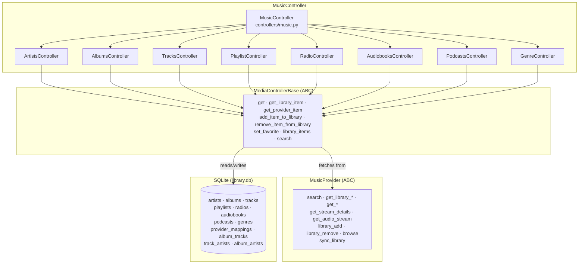
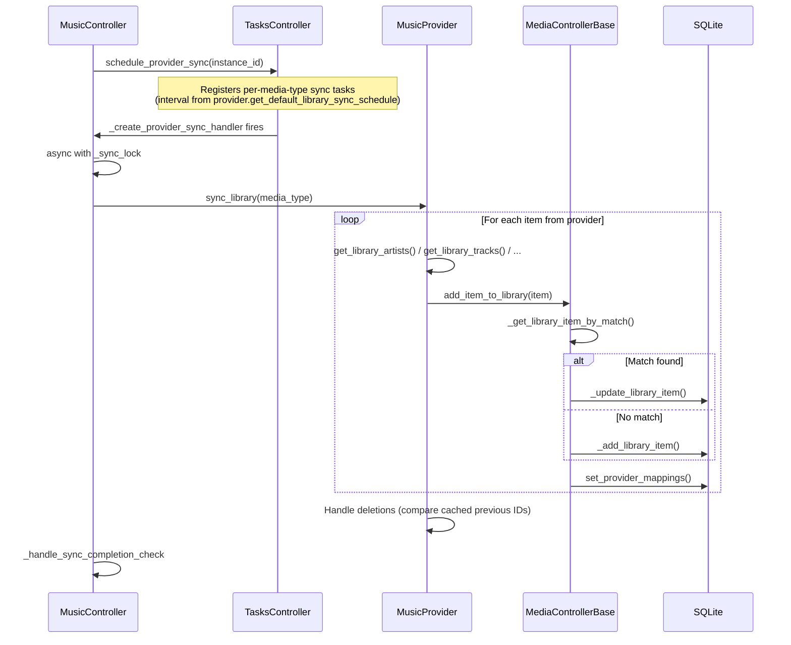

# 08 — Music Controller and Media Library

The Music Controller (`MusicController`) is the orchestrator for all media data in Music Assistant. It aggregates content from every loaded music provider into a unified SQLite-backed library, exposes search and browse APIs, and manages the lifecycle of library synchronization. Eight type-specific sub-controllers handle the per-media-type logic while sharing a common base class that encodes the match-and-store pattern.

## Component Map



## MusicController

`MusicController` extends `CoreController` with `domain = "music"`. It is the single entry point for all media operations — search, browse, URI resolution, and library sync scheduling.

### Initialization

The constructor instantiates the eight sub-controllers and creates the global `_sync_lock`:

```python
class MusicController(CoreController):
    domain: str = "music"

    def __init__(self, mass: MusicAssistant) -> None:
        super().__init__(mass)
        self.cache = self.mass.cache
        self.artists = ArtistsController(self.mass)
        self.albums = AlbumsController(self.mass)
        self.tracks = TracksController(self.mass)
        self.radio = RadioController(self.mass)
        self.playlists = PlaylistController(self.mass)
        self.audiobooks = AudiobooksController(self.mass)
        self.podcasts = PodcastsController(self.mass)
        self.genres = GenreController(self.mass)
        self._database: DatabaseConnection | None = None
        self._sync_lock = asyncio.Lock()
```

`get_controller(media_type)` maps a `MediaType` enum value to the corresponding sub-controller (including `PODCAST_EPISODE` → `podcasts`).

### Search

`search()` aggregates results from the library and all active providers:

1. **Cache check** — key built from query, media types, limit, and sorted unique provider IDs.
2. **Shareable URL detection** — if the query is a parseable URI (`parse_uri`), the item is fetched directly and returned as a single-result `SearchResults`.
3. **Library search** — `search_library()` queries each sub-controller's `library_items(search=...)` against SQLite. Note: genres are not included in library search results (`MediaType.GENRE` is not populated by `search_library`).
4. **Provider fan-out** — `asyncio.gather` runs `_search_provider` for each unique provider instance in parallel. Library hits are tracked as `(media_type, provider_domain, item_id)` tuples; provider results that already appear in the library set are deduplicated.
5. **Interleave and rank** — per-media-type results from each source are interleaved via `zip_longest` (first result from each provider alternated), then sorted by `_sort_search_result` which boosts exact matches and library items. Final list is capped to `limit`.

Results are cached for 600 seconds.

### URI System

Every media item in Music Assistant has a canonical URI of the form `provider://media_type/item_id`. The `parse_uri` function (`helpers/uri.py`) handles several URI formats:

| Format | Example | Resolution |
|--------|---------|------------|
| MA native | `spotify://track/abc123` | Split on `://` and `/` |
| Shareable HTTPS | `https://open.spotify.com/track/abc123` | Any `https://open.*` URL — domain → provider, path → type + ID (supports Spotify, Qobuz, and others) |
| Tidal HTTPS | `https://tidal.com/browse/track/12345` | Path segments → type + ID |
| Colon-separated | `spotify:track:abc123` | Split on `:` |
| Generic HTTP/RTSP | `http://stream.example.com/live` | `builtin` provider, `MediaType.UNKNOWN` |
| Local file path | `/music/song.flac` | `builtin` provider, `MediaType.UNKNOWN` |

`get_item_by_uri(uri)` calls `parse_uri` then delegates to `get_item(media_type, item_id, provider_instance_id_or_domain)`.

### Provider Orchestration

When fetching a specific item, the routing is:

1. `get_item()` dispatches by media type to the appropriate sub-controller's `get()`.
2. `MediaControllerBase.get()` checks whether the library already has a row for that provider+item_id. If so, it returns the library item (optionally scheduling a background metadata refresh). If not, it calls `get_provider_item()`.
3. `get_provider_item()` resolves the provider instance and calls `MusicProvider.get_item(media_type, item_id)`, which dispatches to the type-specific `get_track()`, `get_album()`, etc.

For items available from multiple providers (e.g. the same track on Spotify and Tidal), the library stores a single canonical row plus multiple entries in `provider_mappings`. The `match_provider_instances()` method clones non-unique streaming provider mappings across all instances of the same domain, so a second Spotify account automatically inherits mappings from the first.

### Unique Providers

`get_unique_providers()` returns one instance ID per streaming provider domain (Spotify, Tidal, etc.) but all instances for non-streaming providers (filesystem sources). This prevents duplicate search results from multiple accounts on the same service.

```python
def get_unique_providers(self) -> list[str]:
    processed_domains: set[str] = set()
    result = []
    for provider in self.providers:
        if provider.is_streaming_provider and provider.domain in processed_domains:
            continue
        result.append(provider.instance_id)
        processed_domains.add(provider.domain)
    return result
```

### Browse

`MusicController.browse(path)` builds provider root folders and delegates to `MusicProvider.browse(path)` for navigation into provider-specific catalogs.

## MediaControllerBase

`MediaControllerBase[ItemCls]` (`controllers/media/base.py`) is the abstract base class for all eight media type controllers. It is generic over the item class (`Track`, `Artist`, `Album`, etc.) and defines the shared library interaction pattern.

### Class Attributes

Each subclass sets:
- `media_type` — the `MediaType` enum value
- `item_cls` — the dataclass for this media type
- `db_table` — the SQLite table name

### Abstract Methods

Subclasses must implement:

```python
async def _add_library_item(self, item: ItemCls, overwrite_existing: bool = False) -> int
async def _update_library_item(self, item_id: str | int, update: ItemCls, overwrite: bool = False) -> None
async def match_providers(self, db_item: ItemCls) -> None
async def radio_mode_base_tracks(self, item: ItemCls, ...) -> list[Track]
```

### Core Methods

| Method | Purpose |
|--------|---------|
| `get()` | Fetch by provider+ID; returns library item if matched, otherwise `get_provider_item()` |
| `get_library_item()` | Direct SQLite lookup by integer library ID |
| `get_provider_item()` | Fetch from the music provider, with cache and fallback to stale mappings |
| `add_item_to_library()` | Match against existing items, insert or merge, emit `MEDIA_ITEM_ADDED`/`UPDATED` |
| `remove_item_from_library()` | Delete from library, `provider_mappings`, playlog; subclasses extend for junction tables |
| `set_favorite()` | Toggle favorite flag, emit `MEDIA_ITEM_UPDATED` |
| `library_items()` | Paginated query with search, sort, filtering by favorite/provider/album/artist |
| `search()` | Alias for `library_items(search=...)` |

### Match-and-Store Pattern

When adding an item to the library, `add_item_to_library` follows this sequence:

1. **Match by provider mappings** — check if any existing library item shares a provider mapping with the incoming item.
2. **Match by external IDs** — compare MusicBrainz IDs, ISRCs, barcodes, etc.
3. **Match by name + comparison** — use `compare_media_item` for fuzzy matching on title, artists, duration, etc.
4. **Insert or merge** — if no match, call `_add_library_item()`; if matched, update the existing row and add the new provider mapping.

The `_db_add_lock` (per media type) serializes inserts to prevent race conditions during concurrent syncs.

### Comparison Logic

`compare_media_item` (`helpers/compare.py`) dispatches to type-specific comparisons. For tracks, the matching checks (in priority order):

1. Same provider + item ID (or overlapping mappings)
2. **Primary** external IDs — MusicBrainz recording/track, AcoustID. These are definitive: a match confirms, a mismatch rejects.
3. **Secondary** external IDs — ISRC (with 8-second duration tolerance), DISCOGS, TADB, ASIN. Only a positive match counts; mismatches do not reject.
4. Sequential text filters: title match → artist match → version match → explicit flag → album/disc/track number alignment. Each can reject early.
5. Duration fallback within tolerance (2-3 seconds depending on context)

`compare_strings` supports both strict equality and fuzzy matching via `SequenceMatcher`. `create_safe_string` normalizes Unicode (via unidecode), strips punctuation, and handles special artist name cases.

## MusicProvider ABC

`MusicProvider` (`models/music_provider.py`) defines the interface that all music source providers implement. It extends the base `Provider` class with media-specific methods.

### Key Interface Methods

| Category | Methods |
|----------|---------|
| **Library enumeration** | `get_library_artists`, `get_library_albums`, `get_library_tracks`, ... (async generators) |
| **Item details** | `get_artist`, `get_album`, `get_track`, `get_playlist`, `get_radio`, `get_audiobook`, `get_podcast`, `get_podcast_episode` |
| **Collection contents** | `get_album_tracks`, `get_playlist_tracks`, `get_podcast_episodes` |
| **Search** | `search(query, media_types, limit)` → `SearchResults` |
| **Playback** | `get_stream_details(item_id)`, `get_audio_stream(streamdetails)`, `on_streamed()`, `on_played()` |
| **Library edits** | `library_add`, `library_remove`, `set_favorite`, playlist mutations |
| **Browse** | `browse(path)` → list of items and folders |
| **Sync** | `sync_library(media_type)` — coordinates the full sync cycle |

### Streaming vs Local Providers

The `is_streaming_provider` property (default `True`) distinguishes two provider categories:

- **Streaming providers** (Spotify, Tidal, Qobuz): Their catalog is much larger than the user's library. Only one instance per domain is queried for search/lookups (via `get_unique_providers`).
- **Local/non-streaming providers** (filesystem, Plex): Their catalog equals their library. All instances contribute to search, since each instance may point to different content.

### Capability Flags

`ProviderFeature` flags declare what a provider supports: `SEARCH`, `BROWSE`, `LIBRARY_ARTISTS`, `LIBRARY_ARTISTS_EDIT`, `FAVORITE_ARTISTS_EDIT`, `ARTIST_ALBUMS`, `ARTIST_TOPTRACKS`, `SIMILAR_TRACKS`, `RECOMMENDATIONS`, `PLAYLIST_TRACKS_EDIT`, `PLAYLIST_CREATE`, etc. The base class provides helper properties (`library_supported`, `library_edit_supported`, `library_sync_supported`) that check these flags.

## Library Sync

Library sync keeps the local SQLite database in step with each provider's catalog. The flow is coordinated between `MusicController` and `MusicProvider`.



### Sync Scheduling

- `on_provider_loaded()` calls `schedule_provider_sync(instance_id)`, which registers a recurring task for each supported media type.
- `on_provider_unload()` calls `unschedule_provider_sync(instance_id)`.
- Sync interval is determined per-provider via `MusicProvider.get_default_library_sync_schedule(media_type)`, which returns a `TaskSchedule` object. The base class defaults to every 12 hours; individual providers can override (e.g., the builtin provider syncs every 3 hours).

### The `_sync_lock`

The global `_sync_lock` on `MusicController` serializes all provider syncs — only one provider/media-type combination runs at a time. This prevents database contention and duplicate matching during concurrent syncs.

### Provider Mapping Lifecycle

During sync, `MusicProvider.sync_library()` calls `get_library_item_by_prov_mappings()` to check whether the provider's item already exists in the library. If found, it updates metadata and ensures the provider mapping row is current. If not found, it goes through the full `add_item_to_library` match-and-store flow.

Deletion handling compares the current sync's item IDs against cached IDs from the previous sync. Items missing from the new set have their provider mapping removed; if no provider mappings remain, the library item itself is deleted.

## SQLite Database Schema

The library database (`library.db`) uses the following tables:

### Entity Tables

| Table | Media Type |
|-------|------------|
| `artists` | Artists |
| `albums` | Albums |
| `tracks` | Tracks |
| `playlists` | Playlists |
| `radios` | Radio stations |
| `audiobooks` | Audiobooks |
| `podcasts` | Podcasts |
| `genres` | Genres |

### Junction Tables

| Table | Relationship |
|-------|-------------|
| `provider_mappings` | Library item ↔ provider item (all types). Columns: `media_type`, `item_id`, `provider_domain`, `provider_instance`, `provider_item_id`, `available`, `in_library`, `is_unique` |
| `album_tracks` | Album ↔ track (with disc/track numbers) |
| `track_artists` | Track ↔ artist |
| `album_artists` | Album ↔ artist |
| `genre_media_item_mapping` | Genre ↔ any media item |
| `genre_media_item_exclusion` | Genre exclusion overrides |

### Support Tables

| Table | Purpose |
|-------|---------|
| `playlog` | Playback history (used for reporting and recommendations) |
| `loudness_measurements` | EBU R128 loudness values per track (see [10-streaming-pipeline.md](10-streaming-pipeline.md)) |
| `smart_fades_analysis` | Beat detection results for crossfade timing (see [10-streaming-pipeline.md](10-streaming-pipeline.md)) |

The `provider_mappings` table is the central join that connects canonical library items to their source providers. Each entity query aggregates mappings as a JSON array via subselect, so every returned item carries its full `provider_mappings` set.

## Sub-Controller Specializations

While all eight sub-controllers share the `MediaControllerBase` pattern, some add significant type-specific logic:

### TracksController

- Overrides `base_query` to join artists, album, and `album_tracks` for richer results.
- `get()` resolves the album (from `album_uri`, library `album_tracks`, or direct fetch) and recursively expands `ItemMapping` artists to full objects.
- `versions()` aggregates same-track variants across providers.
- `similar_tracks()` queries providers with `SIMILAR_TRACKS` capability.
- `get_preview_url()` fetches short preview audio for UI use.
- `remove_item_from_library()` cleans up `album_tracks` and `track_artists` junction rows before the base deletion.

### ArtistsController

- `artist_albums()` and `artist_tracks()` merge SQLite graph data with per-provider results, using `get_unique_providers()` to avoid duplicate streaming accounts.
- `library_items()` supports an `album_artists_only` filter to show only artists that have albums (not just track credits).
- `remove_item_from_library()` cascades to albums and tracks that have no other artist references.
- `match_providers()` uses search + reference tracks/albums for cross-provider artist linking.

## Key Files

| File | Role |
|------|------|
| `controllers/music.py` | MusicController — orchestrator for all media operations |
| `controllers/media/base.py` | MediaControllerBase — shared library interaction pattern |
| `controllers/media/tracks.py` | TracksController — track-specific library logic |
| `controllers/media/artists.py` | ArtistsController — artist-specific library logic |
| `controllers/media/albums.py` | AlbumsController — album-specific library logic |
| `controllers/media/playlists.py` | PlaylistController |
| `controllers/media/radio.py` | RadioController |
| `controllers/media/audiobooks.py` | AudiobooksController |
| `controllers/media/podcasts.py` | PodcastsController |
| `controllers/media/genres.py` | GenreController |
| `models/music_provider.py` | MusicProvider ABC — provider interface |
| `helpers/compare.py` | Media item comparison and matching |
| `helpers/uri.py` | URI parsing |
| `constants.py` | DB table names, sync intervals, config keys |
