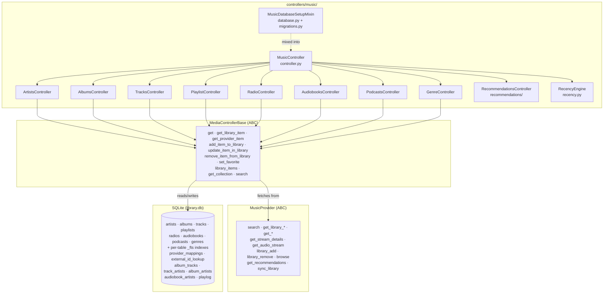
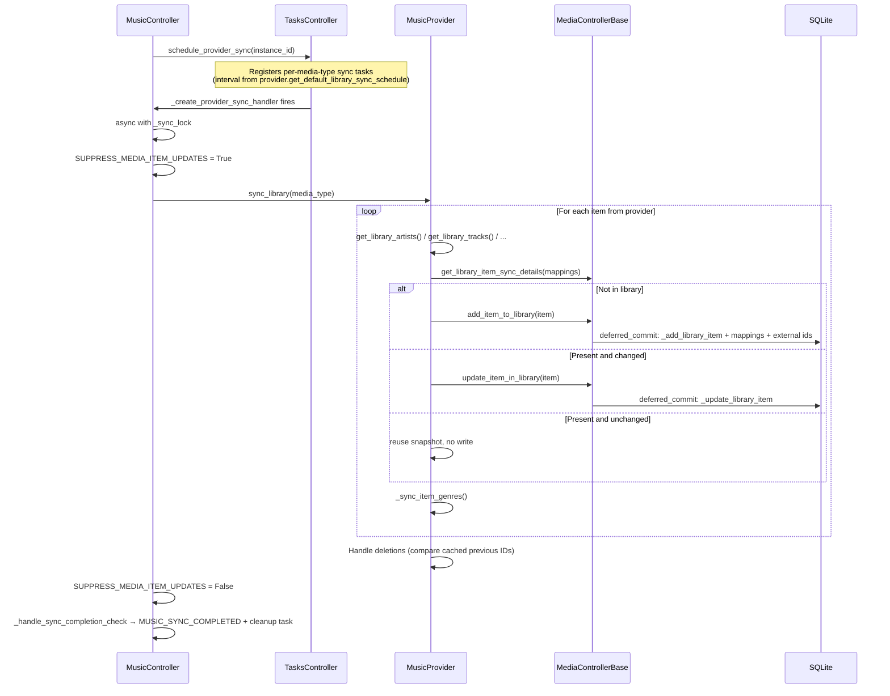

# 08 — Music Controller and Media Library

The Music Controller (`MusicController`) is the orchestrator for all media data in Music Assistant. It aggregates content from every loaded music provider into a unified SQLite-backed library, exposes search, browse and recommendation APIs, and manages the lifecycle of library synchronization. Eight type-specific sub-controllers handle the per-media-type logic while sharing a common base class that encodes the match-and-store pattern.

## Component Map



## Package Structure

The package's own [`README.md`](../../music_assistant/controllers/music/README.md) is the authoritative module inventory — it lists each module's role, states the one-way dependency rule (the `media/` sub-controllers never import `MusicController` back), explains the database split via `MusicDatabaseSetupMixin`, and documents the migration backup/reset-on-failure policy. Rather than restate that, this document covers the cross-cutting behavior the README does not: search architecture, summary modes, FTS indexing, collections, the recommendations API, the recency engine, the user-scoped playlog, and how plugin providers participate in browse and search.

## MusicController

`MusicController` is a `CoreController` with `domain = "music"`, mixed with `MusicDatabaseSetupMixin` (`database.py`) for the library database lifecycle. It is the single entry point for all media operations — search, browse, URI resolution, favorites, library edits, playback bookkeeping and sync scheduling.

### Initialization

The constructor instantiates the eight media sub-controllers plus the two subsystems that share the library's data, and creates the global `_sync_lock`:

```python
self.artists = ArtistsController(self.mass)
# … albums, tracks, radio, playlists, audiobooks, podcasts, genres …
self.recommendations = RecommendationsController(self.mass)
self.recency = RecencyEngine(self.mass)
self._database: DatabaseConnection | None = None
self._sync_lock = asyncio.Lock()
```

`setup()` initializes the database first (via the mixin) and then finishes any pending provider removals recorded under the hidden `deleted_providers` core config value — so a `cleanup_provider` interrupted by a restart resumes. `post_setup()` registers the recurring maintenance tasks: a nightly database cleanup (`music_database_cleanup`, 05:00 local), a provider-mapping correction pass every 30 days (`music_provider_mapping_correction`), the genre mapping scan, and an **hourly duplicate-track reconciliation** (`_reconcile_duplicate_tracks`, #5792/#5840).

Reconciliation merges library tracks that ended up stored twice across providers, and it is deliberately incremental and cautious:

- It **skips entirely while a sync is active** (`active_sync_tasks`), because a sync is still filling in albums and mappings, and judging duplicates against a half-populated library would merge things that only look identical.
- It walks the library through a persisted cursor (`_track_reconciliation_cursor`) a batch at a time. A `None` cursor means the library has been walked end to end with nothing synced since, so the query is skipped rather than run for a guaranteed miss.
- Merges go through [`merge_library_items`](#match-and-store-pattern).

The metadata controller runs the album counterpart hourly; see [14-metadata.md](14-metadata.md#maintenance-tasks).

`get_controller(media_type)` maps a `MediaType` enum value to the corresponding sub-controller (including `PODCAST_EPISODE` → `podcasts`). `get_controller_for_collection(item_id)` derives the media type from a collection item id and returns its controller — currently only audiobooks support collections.

### Search

Global search is built for robustness and latency (#4671): a slow or rate-limited provider cannot stall the whole search, and repeated searches are served from layered caches.

`search(search_query, media_types, limit, library_only, providers)`:

1. **Resolve the search targets.** `get_unique_providers()` supplies the music providers, and plugin providers declaring `ProviderFeature.SEARCH` are added to them — so a plugin like `smart_playlist` can contribute results. The `providers` parameter narrows this by instance id or domain, with the special value `"library"` selecting the library. `library_only` is deprecated and is rewritten to `providers=["library"]`.
2. **Combined cache check.** The key is built from the query, media types, limit, whether the library is included, and the resolved provider list.
3. **Shareable URL detection.** `_search_shareable_url` tries `parse_uri(validate_id=True)`; if the query is a public share URL for a provider in `PROVIDERS_WITH_SHAREABLE_URLS` (`spotify`, `qobuz`, `apple_music`, `deezer`), the item is fetched directly and returned as a single-result `SearchResults`. An invalid provider ID short-circuits to empty results rather than falling through to a text search.
4. **Library search first, always.** `search_library()` runs one query per media type in parallel through `get_controller(media_type).search(query, "library")`. It *does* include genres (`MediaType.GENRE` is in `result_fields`). Its results serve three purposes: they are part of the answer, they build the dedup set, and they can preempt provider searches entirely.
5. **Exact-match shortcut.** `_get_covered_media_types(library_results, query)` collects `(media_type, provider domain-or-instance)` pairs for which the library already holds a near-exact name match with an available mapping to that provider. Those media types are dropped from that provider's search; if nothing is left, the provider is skipped. The shortcut only applies to an unrestricted global search — an explicit `providers` selection always searches what was asked for.
6. **Provider fan-out.** `asyncio.gather(..., return_exceptions=True)` runs `_search_provider` per target. Library hits are passed down as `(media_type, provider_domain, item_id)` tuples and filtered out of provider results by `filter_search_results`, which rebuilds a fresh `SearchResults` rather than mutating what may be a shared cached object.
7. **Interleave and rank.** Per-media-type lists are interleaved with `zip_longest` (one result per source per pass) and capped to `limit`, then sorted by `sort_search_result` from `controllers/music/helpers.py` (previously a private controller method), which lifts literal name matches and library items to the front. `sound_effects` is one of the ranked result fields (#4669).
8. **Cache the combined result — conditionally.** The 600 s combined entry (`SEARCH_CACHE_EXPIRATION_COMBINED`) is only written when *every* provider contributed, so a failed or timed-out provider is retried on the next search instead of having its absence cached.

#### Per-provider timeouts and caching

`_search_provider` never calls a provider synchronously. It first checks a per-provider cache entry, then starts `_execute_provider_search` as a task keyed on `provider_search_{instance_id}_{cache_key}` — identical concurrent searches therefore share one provider call — and awaits it under a **soft timeout** with `asyncio.shield`:

| Constant | Value | Role |
|---|---|---|
| `SEARCH_PROVIDER_SOFT_TIMEOUT` | 8 s | How long the request waits. On expiry the provider contributes nothing *now*, but its search keeps running in the background so the result lands in the cache for the next request |
| `SEARCH_PROVIDER_HARD_TIMEOUT` | 120 s | Absolute ceiling on the background search, for badly rate-limited providers |
| `SEARCH_CACHE_EXPIRATION_STREAMING_PROVIDER` | 24 h | Streaming catalogs barely change |
| `SEARCH_CACHE_EXPIRATION_LOCAL_PROVIDER` | 15 min | Local content can change at any time; plugin providers are treated as local since they do not declare `is_streaming_provider` |
| `SEARCH_CACHE_EXPIRATION_COMBINED` | 600 s | The combined multi-provider result |

`_execute_provider_search` swallows all errors (it may outlive the request that started it) and only caches successful results, so failures are simply retried later.

#### Library search uses FTS5

Library search is backed by a **trigram-tokenized FTS5 index** per media item table (#4681). `search_name_match_clause` (`controllers/music/helpers.py`) builds the WHERE fragment:

- Terms of 3 characters or more (`MIN_FTS_TERM_LENGTH`) become `item_id IN (SELECT rowid FROM {table}_fts WHERE {table}_fts MATCH :term)`, with the term quoted so it is read as a literal substring instead of FTS5 query syntax.
- Shorter terms fall back to a `LIKE '%term%'` scan, because a trigram tokenizer cannot match them at all.

Search terms are normalized first by `_preprocess_search` → `create_safe_string` (lowercase, diacritics stripped, spaces collapsed), which is exactly what the indexed `search_name` column stores. Genre and playlist searches that come back empty get one more attempt through `_localized_search_fallback`, which reverse-resolves the query to the canonical (English) names behind a localized display name via `TranslationController.reverse_lookup_media_names` and searches those instead.

### URI System

Every media item in Music Assistant has a canonical URI of the form `provider://media_type/item_id`. The `parse_uri` function (`helpers/uri.py`) handles several URI formats:

| Format | Example | Resolution |
|--------|---------|------------|
| MA native | `spotify://track/abc123` | Split on `://` and `/` |
| Shareable HTTPS | `https://open.spotify.com/track/abc123` | Any `https://open.*` URL — domain → provider, path → type + ID (Spotify, Qobuz, and others) |
| Tidal HTTPS | `https://tidal.com/browse/track/12345` | Path segments → type + ID |
| Apple Music HTTPS | `https://music.apple.com/us/album/name/123?i=456` | Storefront-aware; `station`/`playlist`/`album`/`artist`/`song` map to media types, and an `?i=` param on an album URL resolves to that track |
| Deezer HTTPS | `https://www.deezer.com/en/track/123456` | Locale-tolerant; the type segment is located by name and the following segment must be numeric |
| Colon-separated | `spotify:track:abc123` | Split on `:` |
| Generic HTTP/RTSP/RTMP | `http://stream.example.com/live` | `builtin` provider, `MediaType.UNKNOWN` |
| Local file path | `/music/song.flac` | `builtin` provider, `MediaType.UNKNOWN` |

`valid_id()` optionally validates the extracted ID per provider (Spotify IDs must be base62, length 22) and raises `InvalidProviderID` — this is what lets search distinguish "malformed share link" from "not a URI at all".

`get_item_by_uri(uri)` calls `parse_uri` then delegates to `get_item(media_type, item_id, provider_instance_id_or_domain)`. `get_item` special-cases several non-library media types before reaching a sub-controller: `PODCAST_EPISODE` goes to `podcasts.episode()`, `FOLDER` becomes a `BrowseFolder`, `COLLECTION` resolves through `get_controller_for_collection`, and `AUDIO_SOURCE` / `SOUND_EFFECT` are fetched live from the owning provider. Those last two are deliberately **not library-backed** — their existence depends on a loaded provider and they have no stable identity, so `add_item_to_library` and `add_item_to_favorites` reject them up front by inspecting the URI's media type.

### Provider Orchestration

When fetching a specific item, the routing is:

1. `get_item()` dispatches by media type to the appropriate sub-controller's `get()`.
2. `MediaControllerBase.get()` checks whether the library already has a row for that provider+item_id. If so, it returns the library item (optionally scheduling a background metadata refresh). If not, it calls `get_provider_item()`.
3. `get_provider_item()` resolves the provider instance and calls the type-specific provider method — `get_track()`, `get_album()`, `get_artist()`, and so on. Playlists go through `PluginProvider`-or-`MusicProvider`, since a plugin provider can own a playlist too.

For items available from multiple providers (e.g. the same track on Spotify and Tidal), the library stores a single canonical row plus multiple entries in `provider_mappings`. The `match_provider_instances()` method clones non-unique streaming provider mappings across all instances of the same domain, so a second Spotify account automatically inherits mappings from the first. Cloned mappings carry `in_library=None` to distinguish them from mappings the item was genuinely added on — a distinction `_import_album_tracks_if_enabled` and the sync deletion logic both rely on. The recurring `correct_multi_instance_provider_mappings` task re-runs this over the whole library so mappings created before a second instance existed catch up.

### Unique Providers

`get_unique_providers()` returns one instance ID per streaming provider domain (Spotify, Tidal, etc.) but all instances for non-streaming providers (filesystem sources), which prevents duplicate search results from multiple accounts on the same service. It also applies the current user's `provider_filter`, dropping instances a non-admin user is not allowed to see. The `providers` property does the same for the full music provider list, so most call sites are user-scoped by construction.

### Browse

`MusicController.browse(path)` builds the root level from every provider declaring `ProviderFeature.BROWSE`, filtered through `_apply_user_provider_filter`, then delegates to `MusicProvider.browse(path)` for navigation into provider catalogs.

Plugin providers declaring `ProviderFeature.AUDIO_SOURCE` also surface at the root, even though they implement no `browse()`. A provider with several user-initiable sources gets a folder whose listing is its `get_audio_sources()` output; a provider with exactly **one** initiable source is promoted to that source directly, so it is playable in one tap instead of behind a folder with a single entry. See [11-plugin-system.md](11-plugin-system.md) for the `AudioSource` model.

## MediaControllerBase

`MediaControllerBase[ItemCls]` (`controllers/music/media/base.py`) is the abstract base class for all eight media type controllers. It is generic over the item class (`Track`, `Artist`, `Album`, etc.) and defines the shared library interaction pattern. It also registers the per-type API surface in its constructor: `music/{type}s/count`, `library_items`, `get`, `get_collection`, `update`, `remove`, plus a legacy `get_{type}` alias.

### Class Attributes

Each subclass sets:
- `media_type` — the `MediaType` enum value
- `item_cls` — the dataclass for this media type
- `summary_item_cls` — the slim dataclass used by summary listings (e.g. `TrackSummary`)
- `db_table` — the SQLite table name

### Abstract Methods

Subclasses must implement exactly three methods:

```python
async def _add_library_item(self, item: ItemCls, overwrite_existing: bool = False) -> int
async def _update_library_item(self, item_id: str | int, update: ItemCls, overwrite: bool = False) -> None
async def match_providers(self, db_item: ItemCls) -> None
```

Endless playback is not among them: it is a plugin-layer concern, handled as dynamic playlists (#4498 — see [09-player-queues.md](09-player-queues.md)).

Many of the public methods are marked `@final`, so subclass customization happens through the two query properties (`base_query`, `summary_query`), the `_parse_*` row hooks, and the `_add_library_item` / `_update_library_item` implementations rather than by overriding the public surface.

### Core Methods

| Method | Purpose |
|--------|---------|
| `get()` | Fetch by provider+ID; returns the library item if matched (scheduling a metadata refresh unless `allow_update_metadata=False`), otherwise `get_provider_item()` |
| `get_library_item()` | Direct SQLite lookup by integer library ID |
| `get_provider_item()` | Fetch from the provider under `guard_single_request`, falling back to the last known (stale) library item marked unavailable so matching can recover a changed provider ID |
| `add_item_to_library()` | Match against existing items, insert or merge, emit `MEDIA_ITEM_ADDED` / `MEDIA_ITEM_UPDATED` |
| `update_item_in_library()` | Update a library row, invalidate cached artwork for its images, emit `MEDIA_ITEM_UPDATED`, then write the change back to each music provider via `on_item_updated()` |
| `remove_item_from_library()` | Delete from the entity table, `provider_mappings`, `external_id_lookup`, `playlog`, `audio_analysis` and genre exclusions; subclasses extend for junction tables |
| `set_favorite()` | Set the favorite flag (no-op if unchanged), emit `MEDIA_ITEM_UPDATED` |
| `library_items()` | Paginated listing with search, sort, and filters (favorite, provider, genre, `played_only`, `reachable_via`, `collapse_collections`); returns summary items by default |
| `iter_library_items()` | Async generator paging the whole library 500 rows at a time |
| `get_collection()` | Resolve one collection (by collection item id) into a `MediaCollection` of hydrated items |
| `search()` | For `"library"`, a fully-hydrated `library_items(search=...)`; for any other provider id, a live `MusicProvider.search()` narrowed to this media type |
| `set_provider_mappings()` / `set_external_ids()` | Rewrite an item's rows in `provider_mappings` / `external_id_lookup` |
| `get_library_item_sync_details()` | Lightweight scalar+mappings snapshot used by the sync loops instead of hydrating full objects |

Every listing ultimately funnels through the single `@final get_library_items_by_query()` builder, which composes filters (`_apply_filters`), the fast random path (`_apply_random_subquery`), collection collapsing (`_adapt_query_for_collections`) and the final SELECT (`_build_final_query`). Two performance choices are worth knowing: provider and in-library filters are correlated `EXISTS` subqueries rather than a `JOIN` + `GROUP BY`, and `GROUP BY` is only added when a caller supplied joins that can fan out rows — both so SQLite can stream straight from a sort index instead of materializing and sorting the whole result set.

### Summary (slim list) mode

Library list endpoints return **summary items by default** (#4679, #4693). `library_items(summary=True)` selects only what a list view needs — id, name, sort name, favorite, provider mappings, the sort/statistics columns, the first thumb image, and the collections array — and builds a `summary_item_cls` instance instead of hydrating a full `MediaItem`. `summary=False` opts back into the full object, which is what internal callers that need metadata, artists or album relations use.

The mechanics:

- `summary_query` is the slim counterpart to `base_query`; subclasses override it to add per-type columns (a track's artists and album, an audiobook's authors and narrators, and so on).
- `_summary_base_columns()` deliberately selects the `search_name` / `search_sort_name` / `play_count` / `last_played` / timestamp columns, because `SORT_KEYS` orders on them and they must be resolvable from the result set.
- `_parse_summary_row()` is the parse hook, with `_parse_summary_metadata` keeping only the first `THUMB` image and `_parse_summary_artist_mappings` hydrating slim `ItemMappingSummary` artists from an aggregated JSON subquery.
- `_summary_available()` recomputes the availability flag from the provider mappings against the `available_providers` global cache value, matching `MediaItem.available` semantics that a summary item cannot inherit.

### `reachable_via`

`library_items(reachable_via=[instance_id, ...])` (#5768) restricts results to items that have an **available** mapping to at least one of the given provider instances (OR semantics). An explicit empty list therefore returns nothing, while `None` applies no filter at all — a distinction callers must respect, since the two mean "restrict to no providers" and "do not restrict".

It exists because "in my library" and "playable from here" are different questions. A library assembled from several services still lists items that a particular service cannot play, which is wrong for a Discover row scoped to one provider, and wrong for a user whose admin restricted them to a subset. The [library recommendation rows](#library-rows) are its main consumer, alongside user-scoped browsing. It composes with `_ensure_provider_filter`, which applies the user's own restrictions independently.

`library_count` applies the user's provider filter the same way (#5165), so a count never disagrees with the list it labels.

### Collections

`collapse_collections=True` groups library items that share a collection name (from `metadata.collections`, e.g. an Audiobookshelf series) into a single `MediaCollection` entry, so the series appears once instead of as N individual books. Items not in a collection are returned as-is. `_adapt_query_for_collections` wraps the composed query in a CTE that aggregates rows per collection name, caching the generated `json_object(...)` column projection per controller and summary mode. Sorting is restricted to a supported subset of `SORT_KEYS` (name, sort name, timestamps, play count, last played, plus duration for audiobooks, where a collection sorts on `SUM(duration)`).

Collection item ids are built by `helpers/collections.py` as `{media_type}{separator}{collection_name}`, which is how `get_item(MediaType.COLLECTION, ...)` and `get_controller_for_collection()` route back to the owning controller. Audiobooks are currently the only media type wired up for this (#3569).

### Match-and-Store Pattern

When adding an item to the library, `add_item_to_library` runs the whole insert inside a `database.deferred_commit()` scope (#4584) so the many writes an item add entails — the entity row, provider mappings, external ids, junction rows, genre mappings — land in one commit instead of one commit per statement:

1. **Match by provider mappings** — `_get_library_item_by_match` checks whether any existing library item shares a provider mapping (instance first, then domain).
2. **Match by external IDs** — look the incoming item's external ids up in the `external_id_lookup` table, then confirm with `compare_media_item`.
3. **Match by name + comparison** — exact `name` / `sort_name` match, then `compare_media_item` in strict mode.
4. **Insert or merge** — no match calls `_add_library_item()` (after `match_provider_instances()` clones streaming mappings); a match calls `_update_library_item()` on the existing row.

The `_db_add_lock` (per media type) serializes inserts to prevent race conditions during concurrent syncs. Note that `deferred_commit` is a batching mechanism, **not** a transaction: it always commits on exit, including on error, because the connection is shared and rolling back would discard other tasks' acknowledged writes.

Adding provider mappings to an existing item can also **merge** two library items: if a mapping being added already belongs to a different library item, that other item is removed and its mapping folded into the target.

That implicit merge grew into an explicit, reusable one. `merge_library_items(target_item_id, source_item_id)` (#5769) transfers all state — provider mappings, external ids, relations, genres, playlog — from the source into the target and then deletes the source row, under `_db_add_lock` and batched. The design decision is that **the explicit target is the deterministic winner**: its current values stay authoritative wherever the normal non-overwrite update model would keep them, and the source is applied as if it were an incoming update. Merging an item into itself, or across media types, raises `InvalidDataError`. Both the mapping-conflict path and the duplicate-reconciliation tasks below go through it, so there is one audited way for two library items to become one.

### The external ID lookup table

External-ID matching goes through a dedicated, indexed `external_id_lookup` table — a JSON column would need a `LIKE` scan that no index can serve `(media_type, external_id_type, external_id, item_id)` — first as an accelerator (#4628), then as the single source of truth with the JSON column dropped (#4645, schema v51).

- `set_external_ids()` rewrites an item's rows (delete-then-upsert), but an **empty set is a no-op** and never clears stored ids (#5548). This mirrors the provider-mapping policy: a sync that happens to return nothing must not leave an item stripped of the identity evidence everything else matches on.
- `get_library_item_by_external_id()` / `get_library_item_by_external_ids()` resolve through an `IN (SELECT ...)` subquery, optionally constrained to one `ExternalID` type.
- `music/{type}s/get_by_external_id` is registered on every type controller, so an external id is addressable straight from the API. It binds `get_item_by_external_id`, the library-then-providers path described next — not the library-only lookup above.
- `get_item_by_external_id(external_id, external_id_type)` is that wider path (#5110): it tries the library first, then falls back to asking providers. It is `@final`, and it gives up immediately when `external_id_type` is `None`, since a provider lookup needs to know which identifier it is being handed. Provider support is opt-in per media type through `TRACK_BY_EXTERNAL_ID` / `ALBUM_BY_EXTERNAL_ID` / `ARTIST_BY_EXTERNAL_ID`, dispatching to `get_track_by_external_id` / `get_album_by_external_id` / `get_artist_by_external_id` on `MusicProvider`. Separate features per media type let a provider implement only what it actually supports, which is what the first implementers do: Deezer (#6257) and Tidal (#6248) both declare track and album lookup — ISRC for tracks, barcode/UPC for albums — and neither declares the artist feature, which no in-tree provider implements.
- `_external_ids_query()` re-aggregates the rows back into the JSON array shape that `MediaItem.external_ids` expects, so consumers see no difference.
- The `external_id` column is `COLLATE NOCASE`, and the table's unique index is ordered `(media_type, external_id, external_id_type, item_id)` specifically so both typed and untyped lookups are served by it.

#### Canonicalization — `helpers/external_ids.py`

An indexed lookup only works if both sides agree on spelling, and providers do not: the same barcode arrives as a UPC-12, an EAN-13 or a GTIN-14, ISRCs turn up hyphenated, and MBIDs come wrapped in braces. `helpers/external_ids.py` (#5770) centralizes that normalization so the write path and the read path cannot drift apart:

| Function | Role |
|---|---|
| `normalize_external_id` / `normalize_external_ids` | Canonical form per type — barcode to GTIN-14, ISRC without separators, MBID unwrapped |
| `external_id_lookup_values` / `..._untyped` | Every index-compatible variant a stored value could match, so a legacy row written before normalization is still found |
| `is_valid_isrc` / `is_valid_barcode` | Validation, including the GTIN check digit (`_gtin_check_digit`) — Qobuz omits it, so a barcode missing its check digit is completed rather than rejected |
| `barcode_to_upc` | The reverse conversion, for providers that only accept UPC |
| `external_id_sort_key` | Stable ordering when an item carries several ids |

Both `compare_external_ids` in the comparison layer and `set_external_ids` on the write path route through it.

### Event suppression during bulk work

`SUPPRESS_MEDIA_ITEM_UPDATES` is a `ContextVar` (default `False`) defined in `base.py` (#4578). While set, `add_item_to_library`, `update_item_in_library`, `remove_provider_mapping(s)` skip their per-item `MEDIA_ITEM_ADDED` / `MEDIA_ITEM_UPDATED` events — a full library sync would otherwise emit one event per touched item, serialized per connected client. `update_item_in_library` additionally skips the `on_item_updated()` provider write-back while suppressed, since during a sync the update *came from* that provider.

Two call sites set it: the provider sync handler (subscribers refresh once on `MUSIC_SYNC_COMPLETED` and follow progress via `TASKS_UPDATED`) and `cleanup_provider` (subscribers refresh on `PROVIDERS_UPDATED`). `MEDIA_ITEM_DELETED` is *not* suppressed.

### Provider selection and user filters

`_select_provider_id(library_item)` is the single place that decides which provider mapping a library item's details are fetched from. Without a user filter it takes the first mapping. With one, it prefers an allowed **music** provider mapping, then falls back to any **plugin** mapping, then to any mapping inside the filter, and finally to the first mapping.

`_ensure_provider_filter(provider)` reconciles a caller-supplied provider filter with the user's own: an explicit request is intersected with the user's allowed providers plus all plugin instances, and an empty intersection raises `InsufficientPermissions` rather than silently returning nothing. With no explicit filter, the user's list plus plugin instances becomes the filter. Only music providers are ever restricted this way.

### Comparison Logic

`helpers/compare.py` holds three related comparison APIs. The boolean one answers "are these the same item?", and two newer graded ones answer "how confident are we, and would more data help?" — a distinction that matters because the boolean form has to guess when metadata is thin, while a caller that can fetch a tracklist would rather be told the question is still open.

#### Boolean comparison — `compare_media_item`

Dispatches to type-specific comparisons and is still what `TracksController.match_providers` uses for cross-provider library linking. For tracks, the checks in priority order:

1. Same provider + item ID (or overlapping mappings)
2. **Primary** external IDs — MusicBrainz recording/track, AcoustID. These are definitive: a match confirms, a mismatch rejects.
3. **Secondary** external IDs — ISRC (with 8-second duration tolerance), DISCOGS, TADB, ASIN. Only a positive match counts; mismatches do not reject.
4. Sequential text filters: title match → artist match → version match → explicit flag → album/disc/track number alignment. Each can reject early.
5. Duration fallback within tolerance (2-3 seconds depending on context)

`compare_strings` supports both strict equality and fuzzy matching via `SequenceMatcher`. `create_safe_string` (from `music_assistant_models.helpers`) normalizes Unicode (via unidecode), strips punctuation, and handles special artist name cases.

#### Album evidence — `compare_album_evidence`

Albums are the hard case: two providers' copies of the same record routinely differ only by an edition or a retail suffix, and the album's own fields cannot settle it. `compare_album_evidence` therefore returns a **tri-state** rather than a bool:

| `AlbumMatchEvidence` | Meaning |
|---|---|
| `MATCH` | Same album |
| `NO_MATCH` | Confidently different |
| `INSUFFICIENT` | The album's own metadata cannot decide |

`INSUFFICIENT` is the whole point. `AlbumsController` escalates it rather than guessing: it fetches **ordered tracklists** for both sides and re-runs the comparison with them, so a fingerprint resolves the ambiguity — and a conflicting fingerprint *overrides* an otherwise nominally-matching album (identical title, version and year but a different number of tracks). Only if that is still inconclusive does it fall back to MusicBrainz. A mapping is accepted solely on `MATCH`. The candidate tracklist is fetched from the **exact** provider instance the album was matched on, so a same-domain fallback can never fingerprint against a different account or server; if it is unavailable, it is treated as absent rather than as a mismatch.

Two supporting refinements (#5771, #5776, #5809):

- **Retail suffixes are stripped.** Some providers (notably Apple Music) append `- EP` or `- Single` to a title. `_ALBUM_RETAIL_SUFFIXES` drives both the Python comparison and a SQL match (`ALBUM_RETAIL_SUFFIX_KEYS`), so the query side agrees with the compare side.
- **A shared barcode or ASIN identifies the same retail product**, which resolves an edition difference outright.

#### Track confidence — `compare_track_evidence`

A separate graded API exists for finding a track *on another provider*, where the caller needs to decide how good a substitute is acceptable:

| `TrackMatchConfidence` | Evidence |
|---|---|
| `EXACT` (3) | Shared provider item identity, or a matching MusicBrainz **track** id — release-level evidence |
| `LIKELY` (2) | Recording-level evidence (MB recording, AcoustID) |
| `LOOSE` (1) | Metadata agreement only |
| `NO_MATCH` (0) | A conflicting authoritative id, or conflicting version/explicit flags |

`TracksController.find_provider_match(..., minimum_confidence=…)` returns the best candidate at or above a floor, and can report `ambiguous` when several tie. The consumer is **playlist migration**: `PlaylistMatchPolicy` maps user intent onto a floor via `match_policy_minimum_confidence` — `EXACT` → `EXACT`, `SAME_RECORDING` → `LIKELY`, `BEST_EFFORT` → `LOOSE` — and the migration report labels each track with the confidence it was matched at.

## MusicProvider ABC

`MusicProvider` (`models/music_provider.py`) defines the interface that all music source providers implement. It extends the base `Provider` class with media-specific methods.

### Key Interface Methods

| Category | Methods |
|----------|---------|
| **Library enumeration** | `get_library_artists`, `get_library_albums`, `get_library_tracks`, `get_library_genres`, ... (async generators) |
| **Item details** | `get_artist`, `get_album`, `get_track`, `get_playlist`, `get_radio`, `get_audiobook`, `get_podcast`, `get_podcast_episode`, `get_sound_effect` |
| **Collection contents** | `get_album_tracks`, `get_playlist_tracks`, `get_podcast_episodes`, `get_sound_effects` |
| **Artist / author views** | `get_artist_albums`, `get_artist_tracks`, `get_artist_toptracks`, `get_artist_topalbums`, `get_author_audiobooks`, `get_narrator_audiobooks` |
| **Search** | `search(query, media_types, limit)` → `SearchResults` |
| **Recommendations** | `get_recommendations()` → rows, `get_recommendation_items(item_id)` → that row's items |
| **Playback** | `get_stream_details(item_id, media_type)`, `get_audio_stream(streamdetails)`, `on_streamed()`, `on_played()`, `get_resume_position()` |
| **Library edits** | `library_add`, `library_remove`, `set_favorite`, `on_item_updated`, playlist mutations |
| **Browse** | `browse(path)` → list of items and folders |
| **Genres** | `get_item_genre_names(media_type, item_id)` |
| **Sync** | `sync_library(media_type)` — coordinates the full sync cycle |

### Streaming vs Local Providers

The `is_streaming_provider` property (default `True`) distinguishes two provider categories:

- **Streaming providers** (Spotify, Tidal, Qobuz): Their catalog is much larger than the user's library. Only one instance per domain is queried for search/lookups (via `get_unique_providers`).
- **Local/non-streaming providers** (filesystem, Plex): Their catalog equals their library. All instances contribute to search, since each instance may point to different content.

### Capability Flags

`ProviderFeature` flags declare what a provider supports: `SEARCH`, `BROWSE`, `LIBRARY_ARTISTS`, `LIBRARY_ARTISTS_EDIT`, `FAVORITE_ARTISTS_EDIT`, `ARTIST_ALBUMS`, `ARTIST_TOPTRACKS`, `SIMILAR_TRACKS`, `RECOMMENDATIONS`, `SOUND_EFFECTS`, `PLAYLIST_TRACKS_EDIT`, `PLAYLIST_CREATE`, etc. `MusicController` checks them through `library_supported`, `library_edit_supported`, `library_favorites_edit_supported` and `library_sync_back_enabled`, which combine the flag with the relevant per-provider config value.

**`supported_media_types` is the separate question of what a provider can *serve*** (#5815). It defaults to the media types the provider declares library support for, but a provider that can search and stream a type it cannot *list* — a search-only catalog — overrides it, which makes it eligible for search-based lookups such as cross-provider matching and `versions()`. Gating those paths on `library_supported` instead would have excluded exactly the providers most useful for filling a gap.

Three of these flags are **not** exclusive to music providers, which is why several controller methods accept a wider provider type than `MusicProvider`: `SEARCH` and `AUDIO_SOURCE` bring plugin providers into search and browse, and `RECOMMENDATIONS` is declared by music, metadata and plugin providers alike.

## Library Sync

Library sync keeps the local SQLite database in step with each provider's catalog. The flow is coordinated between `MusicController` and `MusicProvider`.



### Sync Scheduling

- `on_provider_loaded()` calls `schedule_provider_sync(instance_id)`, which registers a recurring task for each supported media type (each gated on that provider's `library_sync_{type}s` config value).
- `on_provider_unload()` calls `unschedule_provider_sync(instance_id)`.
- Sync interval is determined per-provider via `MusicProvider.get_default_library_sync_schedule(media_type)`, which returns a `TaskSchedule`. The base class defaults to every 12 hours; individual providers can override.
- `start_sync()` (`music/sync`) runs the registered tasks on demand, creating them if a scheduled task does not exist yet, and marks them `priority=True` with the requesting user recorded on the task.
- `active_sync_tasks` finds pending/running sync tasks by their `task_domain="music_sync"` metadata; when the last one finishes, `_handle_sync_completion_check` emits `MUSIC_SYNC_COMPLETED` and queues the database cleanup task.

### Batched commits and suppressed events

The sync loops are the main beneficiaries of the two bulk-write optimizations. Each per-item block in `_sync_library_*` is wrapped in `database.deferred_commit()` so an item and all its relations commit once (#4584), and the whole run holds `SUPPRESS_MEDIA_ITEM_UPDATES` (#4578) so no per-item `MEDIA_ITEM_ADDED` / `MEDIA_ITEM_UPDATED` events are emitted. Clients therefore see progress via `TASKS_UPDATED` and refresh once on `MUSIC_SYNC_COMPLETED`, rather than receiving one event per synced item.

Change detection avoids hydrating objects at all: `get_library_item_sync_details()` returns a `LibraryItemSyncDetails` snapshot (item id, favorite, date added, raw provider mappings — plus `has_album` for tracks and the played/resume state for audiobooks) and `_library_item_needs_update()` decides from that whether a write is needed.

### The `_sync_lock`

The global `_sync_lock` on `MusicController` serializes all provider syncs — only one provider/media-type combination runs at a time. This prevents database contention and duplicate matching during concurrent syncs.

### Provider Mapping Lifecycle

During sync, items resolve through `get_library_item_sync_details()` / `get_library_item_by_prov_mappings()`, which match on provider instance first and then on provider domain. A hit updates the row when it changed; a miss goes through the full `add_item_to_library` match-and-store flow with `in_library=True` set on the incoming mappings.

Deletion handling (only when `library_sync_deletions_enabled()`) compares this run's library IDs against the previous run's, cached per provider instance:

- For a **non-streaming** provider with no other in-library mappings left, the item is genuinely gone and is removed outright — otherwise dangling rows stay visible in artist/album views, which do not filter on `in_library`.
- Otherwise the mapping is kept but flagged `in_library=False`, preserving accumulated metadata, and the item is un-favorited if no provider has it in its library any more.

Provider *removal* is a separate path: `cleanup_provider()` walks the controllers bottom-up (radio, playlists, tracks, albums, artists, podcasts, audiobooks, then tracks/albums/artists a second time to break relations), strips that instance's mappings, and deletes its playlog rows. The instance stays recorded in the `deleted_providers` config value until the cleanup completes without errors, so it resumes after a restart.

## SQLite Database Schema

`DB_SCHEMA_VERSION` is **58**, defined in `controllers/music/constants.py`. Tables, indexes and triggers are created by `controllers/music/database.py`; the version-by-version upgrade steps live in `controllers/music/migrations.py`.

### Entity Tables

The eight media item tables are enumerated as `MEDIA_ITEM_DB_TABLES` in `music_assistant/constants.py`. Each has `item_id`, `name`, `sort_name`, `favorite`, `metadata` (JSON), `play_count`, `last_played`, `timestamp_added`, `timestamp_modified`, and the normalized `search_name` / `search_sort_name` columns — plus per-type columns:

| Table | Media Type | Notable type-specific columns |
|-------|------------|---|
| `artists` | Artists | `artist_type` (`singer` / `author` / `narrator`, schema v45) |
| `albums` | Albums | `version`, `album_type`, `year` |
| `tracks` | Tracks | `version`, `duration` |
| `playlists` | Playlists | `owner`, `is_editable`, `is_dynamic` (v36), `supported_mediatypes` (JSON), `translation_key` + `translation_params` (v43) |
| `radios` | Radio stations | `is_dynamic` (schema 58) |
| `audiobooks` | Audiobooks | `version`, `publisher`, `authors` / `narrators` (JSON, string fallbacks), `duration` |
| `podcasts` | Podcasts | `version`, `publisher`, `total_episodes` |
| `genres` | Genres | `translation_key`, `description`, `genre_aliases` (JSON), `is_excluded`, `is_default`, `content_type` (v44) |

### Full-Text Search Tables

Every media item table has a companion `{table}_fts` FTS5 virtual table over `search_name`, declared `content='{table}'`, `content_rowid='item_id'`, `tokenize='trigram'` — an external-content index, so it stores no duplicate copy of the data. Three triggers per table (`_fts_insert`, `_fts_delete`, `_fts_update` on `search_name`) keep it in step, and the migration tail issues an FTS `'rebuild'` for every table so the index is correct both on first upgrade and after any migration step that rewrote rows with triggers inactive. Creation failures are turned into an explicit error naming the SQLite/FTS5 requirement rather than a bare `OperationalError`.

### Junction Tables

| Table | Relationship |
|-------|-------------|
| `provider_mappings` | Library item ↔ provider item (all types). Columns: `media_type`, `item_id`, `provider_domain`, `provider_instance`, `provider_item_id`, `available`, `in_library`, `is_unique`, `url`, `audio_format` (JSON), `details`, under `UNIQUE(media_type, provider_instance, provider_item_id)` |
| `external_id_lookup` | Library item ↔ external identifier: `media_type`, `external_id_type`, `external_id` (`COLLATE NOCASE`), `item_id` |
| `album_tracks` | Album ↔ track (with disc/track numbers) |
| `track_artists` | Track ↔ artist |
| `album_artists` | Album ↔ artist |
| `audiobook_artists` | Audiobook ↔ artist, where the artist's `artist_type` distinguishes authors from narrators (#3570) |
| `genre_media_item_mapping` | Genre ↔ any media item, with `alias`, `is_derived`, `is_manual` |
| `genre_media_item_exclusion` | Genre exclusion overrides |

### Support Tables

| Table | Purpose |
|-------|---------|
| `playlog` | Per-user playback history — see below |
| `audio_analysis` | Per-item, per-provider analysis JSON (loudness, beats, descriptors) keyed `(item_id, provider, aa_provider_domain, media_type)` — see [16-audio-analysis.md](16-audio-analysis.md) |
| `audio_analysis_failures` | Recorded analysis failures with `reason` and optional `next_retry` |
| `settings` | Key/value bookkeeping; holds the stored schema version |

**Two table names you will meet only in migrations.** `loudness_measurements` and `smart_fades_analysis` are not library tables: both kinds of analysis live in `audio_analysis`, under the builtin `loudness_analysis` domain and the `smart_fades` analysis-provider domain respectively. The migrations still `DROP TABLE IF EXISTS` them, which is why `DB_TABLE_LOUDNESS_MEASUREMENTS` remains in `constants.py`.

**The `playlog` table** grew from a simple play history into the user-scoped record that recommendations, resume, scrobbling and recency all read:

| Column | Purpose |
|---|---|
| `item_id`, `provider`, `media_type`, `name`, `image` | The played item (provider item id, or a library id with `provider = 'library'`) |
| `artists` (JSON) | Slim artist mappings recorded at play time, so recency can match the same song across releases without a provider lookup (v47) |
| `timestamp`, `fully_played`, `seconds_played` | When and how much |
| `userid` | Owning user, `NOT NULL` |
| `queue_id` | Which queue the play came from |
| `user_initiated` | Distinguishes an explicit play from queue continuation |
| `playback_speed` | Per-item speed for audiobooks and podcast episodes (v42) |

Its uniqueness is `UNIQUE(item_id, provider, media_type, userid)` — per user, not global. Migration v49 rebuilds the table when it still carries the pre-`userid` inline constraint, because SQLite cannot drop an inline `UNIQUE` and the old three-column version collides with the per-user upsert. Rows without a `userid` cannot be kept under the `NOT NULL` schema and are dropped in that rebuild. Nightly cleanup prunes entries older than 90 days.

### Indexes

Each media item table gets indexes on `favorite`, `name`, `search_name`, `sort_name`, `search_sort_name`, `timestamp_added`, `play_count` and `last_played`. `provider_mappings` carries five composite indexes plus a unique one on `(media_type, provider_instance, provider_item_id)`, covering lookups by instance, by domain, and by in-library state. `external_id_lookup` adds `(media_type, item_id)` for the per-item rewrite path — the typed and untyped id lookups are served by the table's own unique index, which is deliberately ordered to allow that. `playlog` has the unique per-user index plus `(userid, timestamp)` for recency window reads.

### Migrations

`migrate_database()` refuses anything older than schema 15 (`MusicAssistantError`), and `_setup_database()` copies `library.db` to `library.db.backup` before migrating. If a migration raises, the database file is deleted, recreated empty, the cache cleared and a full rescan triggered — the user always ends up with a working library, with the backup left in place. On a fresh install the default genres are seeded. Startup finishes with a conditional `VACUUM`, skipped unless at least `VACUUM_MIN_RECLAIM_RATIO` (20%) of the file is reclaimable. The `reset_db` advanced core config action does the same reset on demand.

Notable content migrations:

| Step | What it does |
|---|---|
| `≤53` | One-shot normalization of stored synced lyrics (strip LRC ID tags, expand multi-timestamp lines) via `normalize_lrc_lyrics()` — see [14-metadata.md](14-metadata.md) for the on-demand path that continues to apply the same helper |
| `≤55` | Strips the `sound_effect` media type out of stored playlists' `supported_mediatypes`. Clients that do not know the type yet refuse to parse a playlist advertising it, so rewriting the rows here makes *upgrading* sufficient instead of waiting for the next library sync |
| `≤56` | Re-adds `playlists.translation_key`, `playlists.translation_params` and `playlog.playback_speed` (#5515, #5518) |
| `≤57` | Adds `radios.is_dynamic` (#5628) |

**The `≤56` step is a leapfrog guard, not a new column.** The `stable` branch numbers its schema versions independently of `dev`, so a database coming from stable can report a version that skips steps this branch added at `≤41` and `≤42`. The migration therefore re-runs those `ALTER`s for every pre-57 database, wrapped so a `duplicate column` error is swallowed and anything else re-raised — it is a no-op wherever the column already exists. The in-tree [music README](../../music_assistant/controllers/music/README.md) documents the stable-vs-dev numbering that makes this necessary.

The `provider_mappings` table is the central join that connects canonical library items to their source providers. Each entity query aggregates mappings as a JSON array via subselect, so every returned item carries its full `provider_mappings` set; `external_id_lookup` rows are re-aggregated the same way into `external_ids`.

## Sub-Controller Specializations

While all eight sub-controllers share the `MediaControllerBase` pattern, some add significant type-specific logic:

### TracksController

- Overrides `base_query` to join artists, album, and `album_tracks` for richer results, and `summary_query` to select slim artist mappings plus the album thumb.
- `library_items()` takes an `explicit` filter (#4597): `True` returns only explicit tracks, `False` only non-explicit (treating a missing flag as non-explicit), `None` everything. It reads `json_extract(tracks.metadata, '$.explicit')`.
- `get()` resolves the album (from `album_uri`, library `album_tracks`, or direct fetch) and recursively expands `ItemMapping` artists to full objects.
- `versions()` aggregates same-track variants across providers; `similar_tracks()` queries providers with `SIMILAR_TRACKS`; `get_preview_url()` fetches short preview audio for UI use.
- `remove_item_from_library()` cleans up `album_tracks` and `track_artists` junction rows before the base deletion.

### ArtistsController

- `artist_albums()` and `artist_tracks()` merge SQLite graph data with per-provider results, using `get_unique_providers()` to avoid duplicate streaming accounts.
- `library_items()` supports an `album_artists_only` filter to show only artists that have albums (not just track credits), and an `artist_type` filter — the `artist_type` column now distinguishes singers from audiobook authors and narrators, so an artist listing does not mix them.
- `remove_item_from_library()` cascades to albums and tracks that have no other artist references.
- `match_providers()` uses search + reference tracks/albums for cross-provider artist linking.

### AudiobooksController

Authors and narrators became first-class artists rather than plain strings (#3570). Both shapes coexist: the `audiobooks.authors` / `narrators` JSON columns keep string values for providers that only supply names, while providers that supply real artists get rows in `audiobook_artists` with the linked artist's `artist_type` set to `author` or `narrator`. Reads prefer the linked artist records and fall back to the strings, and the sync-details snapshot carries the stored shape (`author_is_str` / `narrator_is_str`) so a sync can tell whether an upgrade from strings to artists is needed.

- `library_items()` runs the normal (FTS-backed) search first and, if that returns few results on the first page, appends a `LIKE` search over the `authors` / `narrators` columns.
- Collections (#3569) are audiobook series: `collapse_collections` groups books sharing a `metadata.collections` entry, and a collection sorts on `SUM(duration)` when ordering by duration.
- `get_author_audiobooks()` / `get_narrator_audiobooks()` on the provider interface back the author and narrator detail views.

### RadioController

Radio stations gained the same "generated rather than fixed" concept playlists have: a **dynamic station** (`radios.is_dynamic`, schema 58, #5628) is one whose content the provider produces on demand instead of pointing at a fixed stream URL. `dynamic_tracks(radio)` delegates to `get_dynamic_radio_tracks` on the owning music or plugin provider; `radio_tracks(item_id, provider)` is the addressed form.

Being dynamic **disables name-based linking**, in two places:

- `versions()` returns an empty list — "a dynamic station is its provider's own, so a same-named station is a different one".
- `match_providers()` returns early — matching by name "would link an unrelated radio stream to it".

That is the whole point of the flag. Two providers offering a station called "Chill" are offering the same *stream* when it is a real broadcast, and two entirely different generators when it is dynamic, so the ordinary cross-provider merge would produce a station that plays the wrong thing.

### PlaylistController

- Dynamic playlists are ordinary library playlists with `is_dynamic = True`. Nothing else in the system needs to know they are generated — see [Dynamic playlists as library rows](#dynamic-playlists-as-library-rows).
- `supported_mediatypes` records which media types a playlist can hold, so `add_playlist_tracks` can reject an unsupported type.
- `translation_key` / `translation_params` let a provider-supplied playlist name be localized and parameterized (Spotify's per-account "Liked Songs", builtin playlists) and survive the library round-trip. Updates adopt the synced item's key and params as a unit rather than mixing an old key with new params.
- Empty localized searches retry through `_localized_search_fallback`, so a playlist is findable by the localized name the user actually sees.
- **Playlist migration** (`music/playlists/migrate_playlist`, #5989) copies a playlist into MA's own managed storage or onto another streaming provider, matching each track through the [confidence-based comparison](#comparison-logic) and producing a Markdown report of what matched, what was approximated and what could not be found. A dynamic playlist is refused — there is nothing fixed to migrate.

### GenreController

The largest sub-controller, and the only one with an editable taxonomy of its own.

- **Content-type namespacing** (#4435, #4474): the `content_type` column separates spoken-word taxonomies from music. `GENRE_BUCKETS` maps each taxonomy (`None` for music/general, `MediaType.AUDIOBOOK`, `MediaType.PODCAST`) to the media tables that belong to it, and `genre_content_type_for(media_type)` resolves an item's bucket. Resolution and creation are scoped per bucket, so a podcast "Comedy" never merges into the music "Comedy". Restores can target a single taxonomy.
- **Aliases:** `genre_aliases` plus the `alias` column on `genre_media_item_mapping` let many provider genre strings resolve onto one canonical genre; `promote_alias_to_genre` splits one back out.
- **Exclusions:** `is_excluded` hides a genre without deleting it (`base_query` filters excluded rows out), and `genre_media_item_exclusion` records per-item overrides of a derived mapping.
- **Defaults:** curated per-taxonomy default genre lists are seeded on a fresh install and topped up by migration; `restore_default_genres` re-seeds on demand.
- **Mapping scan:** a scheduled background task (`genre_mapping_scan`) re-derives mappings across the library, with a short-lived in-memory name→genre lookup (`SYNC_GENRE_LOOKUP_TTL`, 5 s) so a running sync picks up user edits quickly without re-querying per item.

## Recommendations

`controllers/music/recommendations/` is a small sub-controller that owns the recommendations **API** — it aggregates over providers and produces no rows itself. It exposes two commands, both requiring `Scope.LIBRARY_READ`:

| Command | Returns |
|---|---|
| `music/recommendations` | Every available row as a `RecommendationFolder`, **without items** |
| `music/recommendations/items` | The items of one row, addressed by `(provider, item_id)` |

Splitting rows from items is the point (#4487): the listing must be cheap enough to render a Discover page immediately, and each row's contents are fetched on demand as it scrolls into view.

**Row sources.** `get_recommendations()` has exactly **one** kind of source: it gathers rows from every provider declaring `ProviderFeature.RECOMMENDATIONS` — which can be a music provider, a metadata provider or a plugin provider — after passing them through the user provider filter. Sources are interleaved with `zip_longest`, one folder per source per pass, so no single provider monopolizes the top of the page.

The library rows are no exception, because **they are a provider too** (#3890): they come from `providers/recommendations/`, a builtin plugin provider (`domain="recommendations"`, `builtin: true`, `allow_disable: false`) whose only declared feature is `RECOMMENDATIONS`. The controller has no special-cased library branch left — it is purely an aggregator. Moving the rows out means they compose through the ordinary provider machinery (feature declaration, user filter, timeout isolation) rather than needing a parallel path, and it lets the rows be reordered or extended without touching the music controller.

**Timeouts and isolation.** Per-provider row fetches are bounded by `RECOMMENDATIONS_ROWS_TIMEOUT` (5 s — rows are contractually cheap, with no live backend calls), and item fetches by `RECOMMENDATIONS_ITEMS_TIMEOUT` (30 s). A timeout or exception in either logs a warning and yields an empty list, so one misbehaving provider degrades to a missing row rather than a failed page.

**Re-checking the filter on item fetch.** `get_recommendation_items()` re-applies `_apply_user_provider_filter` and re-checks that the provider still declares the feature, so a user cannot reach into a music provider an admin restricted them from by calling the items endpoint directly with a row id.

### Library rows

`providers/recommendations/__init__.py` defines the built-in rows, keyed by the `LibraryRowID` enum, each carrying a `translation_key`, an icon, and an `enabled_by_default` flag. There are **sixteen**:

| Row | Backed by | Default |
|---|---|---|
| In progress | `music.in_progress_items()` — partially played audiobooks and podcast episodes | On |
| Recently played | `recently_played()` over albums, tracks, playlists, artists and genres, user-initiated only, with podcasts and audiobooks always included | On |
| Recently added tracks / albums | `library_items(order_by="timestamp_added_desc")` | On |
| Recently favorited tracks | `library_items(favorite=True, order_by="timestamp_modified_desc")` | On |
| Favorite playlists | `library_items(favorite=True, order_by="random")` | On |
| Favorite radio stations | `library_items(favorite=True, order_by="play_count_desc")` | On |
| Random artists / albums | `library_items(order_by="random_play_count")` | Off |
| Recent artists / tracks | `recently_played()` for that single media type, not restricted to user-initiated | Off |
| Forgotten tracks / albums / artists | Played once but not for a long time | Off |
| Most played tracks | Highest play count | Off |
| Never / rarely played | Tracks the library has but the user has not listened to | Off |

The five newest rows (`forgotten_*`, `most_played_tracks`, `never_played_tracks`) all ship **off by default**, which is the pattern for rows that are interesting to some libraries and noise in others.

`recently_played()` reads the `playlog`, scoped to the current user unless a `userid` is passed, and honors `fully_played_only`, `user_initiated_only` (with an `always_include_media_types` escape hatch for podcasts and audiobooks, which have no user-initiated container row), `queue_id` and `played_after_timestamp`. Rows for unavailable or filtered-out providers are dropped.

**Library rows support the provider filter.** Each folder sets `supports_provider_filter=True`, and `get_recommendation_items(item_id, providers=…)` honours it via the [`reachable_via`](#reachable_via) library filter — an explicit empty list returns nothing, `None` applies no filter. This is what lets a user browsing Discover restrict "recently added" to a single streaming service, which a provider's own rows cannot offer.

### `RecommendationPayloadMixin`

Most streaming providers get their recommendations from one bulk backend call. `models/recommendation_payload.py` factors that into a mixin: the provider implements only `_fetch_recommendation_payload()` (folders *with* items), and the mixin derives both the fast rows call and the per-row items call from it. It is used by Tidal, Deezer, Apple Music, Plex, YouTube Music, SoundCloud, Audiobookshelf, BBC Sounds and YouSee, and is demonstrated in `_demo_music_provider`.

Caching is stale-while-revalidate on two layers:

- **In memory** — the last payload is served directly while younger than `recommendation_payload_ttl` (default 3600 s). Once stale it is still served immediately while a single background refresh replaces it.
- **Persistent** — every successful fetch is written to `mass.cache` with `persistent=True`, so a cold instance after a restart warms from the cache database with at most one read. An expired persisted payload is likewise served while one refresh runs.

Concurrent callers share one in-flight fetch, shielded so a timed-out caller cannot cancel it for the others; a cancelled fetch does not poison later calls. The mixin overrides `unload()` to cancel and await any in-flight fetch or refresh, which is why it must be listed **before** the provider base class (`class MyProvider(RecommendationPayloadMixin, MusicProvider)`) for the override to be reachable (#4946).

### `lastfm_recommendations`

Worth calling out because it is easy to misfile: `lastfm_recommendations` is a **`MetadataProvider`**, not a music provider. It declares `ProviderFeature.RECOMMENDATIONS` (plus `SIMILAR_ARTISTS`, `SIMILAR_TRACKS`, `ARTIST_TOPTRACKS`) and contributes rows to the same aggregation as any music provider — which is exactly why `RecommendationsController` types its providers as `MusicProvider | MetadataProvider | PluginProvider`.

Its personalized rows are seeded from Music Assistant's own `playlog` rather than from a Last.fm listening history (#4457): `recently_played_tracks()` supplies recent plays with the artists recorded at play time, so no provider lookup is needed, and those seed similar-artist and similar-track lookups. Both personalized rows derive from one playlog scan. Its seed window is kept inside the playlog's 90-day retention. Rows are also available for genre charts, geographic charts and global charts, each individually configurable. The metadata side of this provider is covered in [14-metadata.md](14-metadata.md).

## Recency Engine

`controllers/music/recency.py` answers one question fast and in bulk: *was this heard recently?* It exists because the features that need it — smart shuffle, dynamic playlist dedup, dynamic radio refills — would otherwise issue one playlog query per candidate track.

`RecencyEngine.snapshot(windows, userid=..., include_partially_played=...)` runs **one** batched, user-scoped playlog query and returns an immutable `RecencySnapshot`. `RecencyWindows` carries three lookback windows in seconds — `song_seconds`, `artist_seconds`, `duplicate_gap_seconds` — and `song_lookback` takes the larger of the song window and the duplicate gap so a single read covers both. A window of `None` or `0` disables that dimension, and if all are disabled the query is skipped entirely.

The snapshot indexes plays three ways, which is what makes cross-provider matching work:

| Index | Key | Purpose |
|---|---|---|
| `song_ts` | `(provider, item_id)` | Exact identity — checked against the track's own provider/id **and** every one of its provider mappings, so the same track played from another account still counts |
| `song_key_ts` | `(safe title, safe artist)` | Fuzzy same-song identity: the title is version-stripped via `parse_title_and_version(strip_for_search=True)` and normalized with `create_safe_string`, one key per artist credit. A remaster, a single vs album edit, or differing artist credits across providers therefore produce overlapping keys |
| `artist_ts` | lowercased artist name | Provider-agnostic by construction — artist playlog rows are keyed by library id, so the name is the only portable key |

`last_played(item)` takes the maximum timestamp across all matching keys; `track_recent()` and `artist_recent()` compare that against a window. The fuzzy keys come from the `playlog.artists` JSON column; rows written before that column existed simply contribute no fuzzy key and regain one on the next play.

Consumers:

- **Smart shuffle** (#4475) — takes one snapshot per arrangement; see [09-player-queues.md](09-player-queues.md).
- **Dynamic playlist / managed pool refills** — the song window is a hard gate, the artist window a soft sort nudge, and a deliberately duplicated source gates on `duplicate_gap_seconds` instead (#4603). See [09-player-queues.md](09-player-queues.md#managedpool).
- **Music Quiz** (#4817) — varies songs across replays.

## Helpers

Three small helper modules in `music_assistant/helpers/` belong to this area:

- **`collections.py`** — builds and parses collection item ids (`{media_type}{separator}{name}`), the glue between `collapse_collections`, `get_collection()` and `get_controller_for_collection()`.
- **`cue_sheet.py`** — a standalone CUE sheet parser (`parse_cue_sheet` → `CueSheet` / `CueTrack`). `providers/filesystem_local/cue.py` uses it to expose a single audio file plus its `.cue` companion as individual library tracks, resolving the referenced audio file and applying CUE metadata over the file's own tags.
- **`track_filter.py`** — a `ContextVar`-published, **advisory** include-predicate. A consumer that drives dynamic-playlist generation publishes it with the `track_filter()` context manager; generators call `filter_tracks()` on their assembled candidates to pre-skip tracks the consumer would discard anyway (recently played, already queued), saving wasted similar-track lookups. It is deliberately best-effort: `filter_tracks` never turns a non-empty list into an empty one, a generator may ignore the predicate entirely, and the consumer stays authoritative — though when the generator did consult it (`TrackFilter.called`), the consumer can skip its own redundant pass. See [09-player-queues.md](09-player-queues.md).

## Dynamic playlists as library rows

A dynamic playlist is not a separate concept in the library — it is a `playlists` row with `is_dynamic = True` (#4498). Two plugin providers write them: `smart_playlist` (rule-based, where `is_dynamic` decides whether tracks are re-evaluated fresh on every play or frozen once) and `radio_playlist` (an artist/album/track/genre/playlist seed rendered as a playlist whose `item_id` *is* the seed URI). Everything downstream — browse, favorites, search, the queue — treats them like any other playlist; only the queue controller reads `is_dynamic`, to decide whether to run a bounded managed pool instead of a linear enqueue. See [09-player-queues.md](09-player-queues.md#dynamic-playlists-and-the-managed-pool) and [11-plugin-system.md](11-plugin-system.md).

## User-scoped library access

The library is read through a per-user lens rather than as a single global view, following the scope-based authorization redesign (#4613):

- **Provider filters.** A non-admin user can be restricted to a subset of music provider instances. That filter is applied by `providers`, `get_unique_providers()`, `_apply_user_provider_filter()` (browse, sound effects, recommendations) and `_ensure_provider_filter()` (every library listing), and it also steers `_select_provider_id()` when choosing which mapping to fetch an item from. Plugin providers are never restricted.
- **Per-user playlog.** Play history, resume positions, "in progress" and "recently played" are all scoped by `playlog.userid`, defaulting to the current session user. `RecencyEngine` snapshots are user-scoped for the same reason.
- **Scopes.** Read commands require `Scope.LIBRARY_READ`, writes `Scope.LIBRARY_WRITE`, and administrative operations (sync, provider mapping edits, refresh, remove) `Scope.LIBRARY_MANAGE`. A few read commands set `allow_impersonation=True` so a trusted caller can act on another user's behalf.

Scope semantics, impersonation and the user model itself are documented in [19-authentication.md](19-authentication.md) and [12-webserver-api.md](12-webserver-api.md).

## Provider ecosystem note

The set of providers feeding the library keeps growing; classification matters more than the details of any one of them, since where a provider sits determines which of the flows above apply to it.

- **Music providers** (participate in sync, search, browse): `ambient_sounds`, `rain_mood`, `pocketcasts`, `sverigesradio`, `filesystem_google_drive`, `filesystem_onedrive`, `qqmusic`, `nts`, `teddycloud`.
- **Plugin providers** that write library rows: `smart_playlist`, `radio_playlist` (dynamic playlists, above). Plugin providers may also declare `ProviderFeature.SEARCH` to join global search, and `ProviderFeature.AUDIO_SOURCE` to appear in browse.
- **Metadata providers**: `playlist_metadata`, `wikipedia`, `lastfm_recommendations` — the last of which contributes recommendation rows as described above. See [14-metadata.md](14-metadata.md).

## Key Files

| File | Role |
|------|------|
| [`controllers/music/README.md`](../../music_assistant/controllers/music/README.md) | In-tree module inventory and design notes for the package |
| [`controllers/music/controller.py`](../../music_assistant/controllers/music/controller.py) | MusicController — orchestrator for all media operations |
| [`controllers/music/database.py`](../../music_assistant/controllers/music/database.py) | `MusicDatabaseSetupMixin` — schema creation, indexes, triggers, maintenance |
| [`controllers/music/migrations.py`](../../music_assistant/controllers/music/migrations.py) | Versioned schema migrations (`migrate_database`) |
| [`controllers/music/constants.py`](../../music_assistant/controllers/music/constants.py) | `DB_SCHEMA_VERSION`, search timeouts and cache expirations, task ids |
| [`controllers/music/helpers.py`](../../music_assistant/controllers/music/helpers.py) | `search_name_match_clause` (FTS), `sort_search_result`, `filter_search_results` |
| [`controllers/music/recency.py`](../../music_assistant/controllers/music/recency.py) | `RecencyEngine` / `RecencySnapshot` / `RecencyWindows` |
| [`controllers/music/recommendations/`](../../music_assistant/controllers/music/recommendations/) | `RecommendationsController` — the aggregating API only; owns no rows itself |
| [`providers/recommendations/`](../../music_assistant/providers/recommendations/) | `LibraryRecommendationsProvider` — the builtin plugin supplying the sixteen library rows |
| [`helpers/external_ids.py`](../../music_assistant/helpers/external_ids.py) | GTIN/ISRC/MBID canonicalization, lookup variants, validation |
| [`controllers/music/media/base.py`](../../music_assistant/controllers/music/media/base.py) | MediaControllerBase — shared library interaction pattern, summary mode, `SUPPRESS_MEDIA_ITEM_UPDATES` |
| [`controllers/music/media/tracks.py`](../../music_assistant/controllers/music/media/tracks.py) | TracksController — track-specific library logic |
| [`controllers/music/media/artists.py`](../../music_assistant/controllers/music/media/artists.py) | ArtistsController — artist-specific library logic |
| [`controllers/music/media/albums.py`](../../music_assistant/controllers/music/media/albums.py) | AlbumsController — album-specific library logic |
| [`controllers/music/media/playlists.py`](../../music_assistant/controllers/music/media/playlists.py) | PlaylistController — dynamic playlists, localized names |
| [`controllers/music/media/radio.py`](../../music_assistant/controllers/music/media/radio.py) | RadioController |
| [`controllers/music/media/audiobooks.py`](../../music_assistant/controllers/music/media/audiobooks.py) | AudiobooksController — authors, narrators, collections |
| [`controllers/music/media/podcasts.py`](../../music_assistant/controllers/music/media/podcasts.py) | PodcastsController |
| [`controllers/music/media/genres.py`](../../music_assistant/controllers/music/media/genres.py) | GenreController — taxonomies, aliases, exclusions, mapping scan |
| [`models/music_provider.py`](../../music_assistant/models/music_provider.py) | MusicProvider ABC — provider interface and the reference sync implementation |
| [`models/recommendation_payload.py`](../../music_assistant/models/recommendation_payload.py) | `RecommendationPayloadMixin` — cached bulk recommendation payloads |
| [`helpers/compare.py`](../../music_assistant/helpers/compare.py) | Media item comparison and matching, `create_safe_string` |
| [`helpers/collections.py`](../../music_assistant/helpers/collections.py) | Collection item id encoding |
| [`helpers/cue_sheet.py`](../../music_assistant/helpers/cue_sheet.py) | CUE sheet parsing for local file metadata enrichment |
| [`helpers/track_filter.py`](../../music_assistant/helpers/track_filter.py) | Advisory include-predicate for dynamic playlist generation |
| [`helpers/uri.py`](../../music_assistant/helpers/uri.py) | URI parsing |
| [`constants.py`](../../music_assistant/constants.py) | DB table names, `MEDIA_ITEM_DB_TABLES`, `PROVIDERS_WITH_SHAREABLE_URLS`, config keys |
