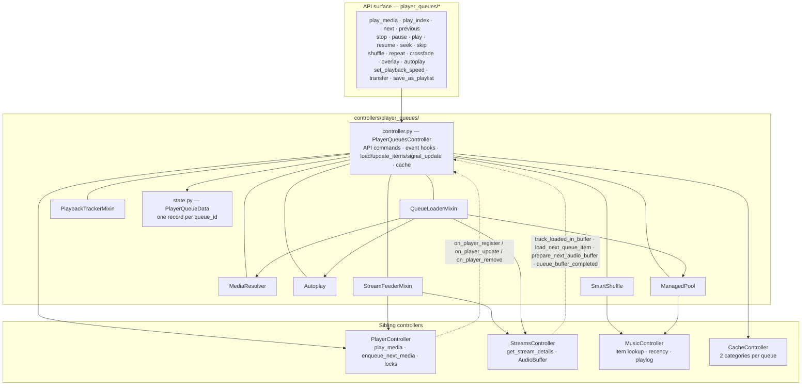
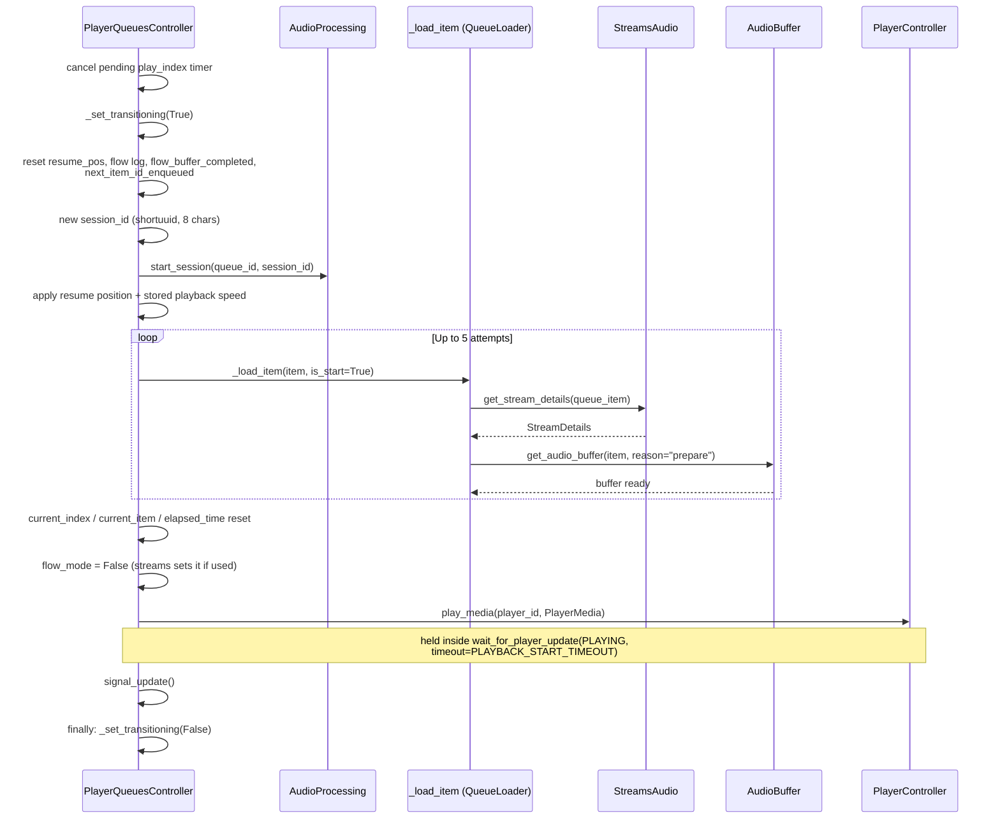

# 09 — Player Queue Management

The Player Queue system sits between the media library and the audio streaming pipeline. Every player in Music Assistant has an associated queue that holds the ordered list of items to play, tracks playback state, and orchestrates the handoff between tracks. The `PlayerQueuesController` is the central coordinator — it resolves media into queue items, drives playback via the player controller, and pre-warms audio buffers so transitions are seamless.

Two things dominate the current design and are worth internalizing before reading further:

1. **The controller is a package, not a module.** `controllers/player_queues.py` (then ~3300 lines) became `controllers/player_queues/`, where the public controller composes three logic mixins and four stateful helper services (#4263, #4509).
2. **`PlayerQueue` is the wire model; `PlayerQueueData` is the server-side record.** The pile of parallel `queue_id`-keyed dictionaries that used to live on the controller is now one `PlayerQueueData` per queue, and the fields that never belonged on the wire moved onto it.

The [Player Queues README](../../music_assistant/controllers/player_queues/README.md) is the in-tree companion. It owns the module inventory, the per-module responsibilities, and the config inventory; this document owns the cross-stack integration (players, streams, events, API), the end-to-end flows, and what changed relative to the monolith.

## Package Structure

```python
class _PlayerQueuesBase(CoreController):
    domain = "player_queues"

class PlayerQueuesController(QueueLoaderMixin, PlaybackTrackerMixin, StreamFeederMixin):
    ...
```

`controller.py` is the public face: the `player_queues/*` API commands, the inter-controller event hooks (`on_player_register`, `on_player_update`, `on_player_elapsed_time_corrected`, `on_player_remove`), and the core state/load/signal-update/persistence primitives. The heavy concern logic is split two ways:

| Kind | Component | Responsibility |
|---|---|---|
| Mixin | `QueueLoaderMixin` (`queue_loader.py`) | Apply the enqueue option, load a single item's stream details, resume from the play log, compute the next index, run the dynamic and autoplay refills |
| Mixin | `PlaybackTrackerMixin` (`playback_tracker.py`) | Reconcile queue state from player updates, detect end-of-queue, drive progress reports and play counting, compute the flow-mode stream index |
| Mixin | `StreamFeederMixin` (`stream_feeder.py`) | Enqueue the next item on the player, preload its stream details, warm the next track's `AudioBuffer`, clean up stale buffers |
| Service | `MediaResolver` (`media_resolver.py`) | Expand artists/albums/genres/playlists/podcasts/audiobooks/folders into concrete tracks, and resolve resume points |
| Service | `Autoplay` (`autoplay.py`) | Resolve the per-queue autoplay mode and produce the library/playlist batches |
| Service | `SmartShuffle` (`smart_shuffle.py`) | Recency-aware, well-spaced ordering of upcoming items |
| Module | `smart_fade_ordering.py` | Stored-analysis-only transition ordering, shared by both queue modes |
| Service | `ManagedPool` (`managed_pool.py`) | The bounded dynamic-source pool, topped up and recency-gated |

The mixins extend `_PlayerQueuesBase` (`base.py`), which declares the shared surface — `_queue_data`, the four helper services, and the signatures of the controller operations the mixins call — so each mixin type-checks independently while the real implementations stay on `PlayerQueuesController`. The services are composition objects constructed with the controller and reach back through it (`self.queues.…`).

`helpers.py` is the stateless layer: the `CompareState` snapshot type, the `handle_play_action` decorator, `build_queue_item`, `has_dynamic_source`, `sort_tracks`, `get_current_playback_speed`, and the two ordering primitives (`interleave_groups`, `space_by_artist`) shared by `SmartShuffle` and `ManagedPool`. It never imports the controller — the decorator types its host through a local `_PlayActionHost` Protocol — so there is no controller↔helper import cycle.



## `PlayerQueue` vs `PlayerQueueData`

All live state is one `PlayerQueueData` record per queue, held in `_queue_data: dict[str, PlayerQueueData]`. That single dict replaced the earlier parallel dictionaries (`_queues`, `_queue_items`, `_prev_states`, `_transitioning_players`, `_play_action_refcount`).

| Type | Where | Role |
|---|---|---|
| `PlayerQueue` | `music_assistant_models.player_queue` | The **wire snapshot** shared with API clients. Client-relevant playback state and behaviour flags only. Carries no cache logic of its own. |
| `PlayerQueueData` | `controllers/player_queues/state.py` | The **complete server-side record**. Wraps the wire `PlayerQueue` and adds the items, the full source/enqueued media, the owning user, the stream-session fields, and runtime bookkeeping. Owns the cache format for the pair. |

Access is through three controller methods: `get(queue_id)` returns the wire `PlayerQueue` (and is the `player_queues/get` API command), while `queue_data(queue_id)` (raises on an unknown queue) and `queue_data_or_none(queue_id)` return the server record. Anything outside the package that needs `session_id`, the items list, or the source items goes through `queue_data()` — the streams controller does exactly this when validating stream URLs.

The pairing mirrors how the Player Controller pairs a runtime `Player` with the wire `PlayerState`. See [03-player-model.md](03-player-model.md).

### `PlayerQueue` — the wire model

Verified field by field against `music-assistant-models` **1.1.207** (the version pinned in `pyproject.toml`). Re-check this table when that pin moves.

| Field | Type | Description |
|---|---|---|
| `queue_id` | `str` | Same as the player ID |
| `active` | `bool` | Whether this queue is the player's active source |
| `display_name` | `str` | Human-readable name, mirrored from the player |
| `available` | `bool` | Whether the associated player is available |
| `items` | `int` | Item **count** — the items themselves live on `PlayerQueueData` |
| `shuffle_enabled` | `bool` | Shuffle mode. Forced `True` and locked in dynamic mode |
| `repeat_mode` | `RepeatMode` | `OFF`, `ONE`, `ALL`. Locked in dynamic mode |
| `crossfade_enabled` | `bool` | Effective crossfade state — the global default unless the queue holds an override (#4373) |
| `autoplay_enabled` | `bool` | Effective autoplay state: keep playing past the end of the queue (#4404) |
| `overlay_enabled` | `bool` | Whether a looping sound effect is mixed into playback (#4674) |
| `overlay_source` | `ItemMapping \| None` | The selected sound effect; retained while the overlay is disabled so it can be re-enabled with the same sound |
| `overlay_volume` | `int` | Overlay loudness relative to the music, in percent (0–200; 100 = equally loud) |
| `smart_fades_active` | `bool` | **Derived, read-only, not persisted.** True when the effective crossfade is smart crossfade |
| `smart_shuffle_active` | `bool` | **Derived, read-only, not persisted.** True when smart shuffle is in effect (or the queue is dynamic) |
| `current_index` | `int \| None` | Index the player is playing |
| `index_in_buffer` | `int \| None` | Index the player has preloaded/buffered |
| `elapsed_time` | `float` | Seconds elapsed in the current item, in **media-time** |
| `elapsed_time_last_updated` | `float` | Wall-clock timestamp of the last `elapsed_time` update |
| `playback_speed` | `float` | The speed in effect at `elapsed_time_last_updated` |
| `state` | `PlaybackState` | `IDLE`, `PLAYING`, `PAUSED` |
| `current_item` | `QueueItem \| None` | The item currently playing |
| `next_item` | `QueueItem \| None` | The next item (UI display, and the pre-warm target) |
| `sources` | `list[ItemMapping]` | The parent items the queue is playing from, projected for the wire |
| `flow_mode` | `bool` | Whether flow mode is active (set by the streams layer) |
| `resume_pos` | `int` | Seconds offset to resume from after pause |
| `is_dynamic` | `bool` | True when at least one source is a dynamic playlist. Implies autoplay and smart shuffle are in effect |
| `extra_attributes` | `dict[str, EXTRA_ATTRIBUTES_TYPES]` | Bag for queue-scoped flags (value alias is `str \| int \| float \| bool \| None`). Holds `ATTR_PLAY_ACTION_IN_PROGRESS` |

`corrected_elapsed_time` extrapolates the wall-clock delta since `elapsed_time_last_updated` **scaled by `playback_speed`**, so the value stays in media-time for a sped-up audiobook. It only extrapolates while `state == PLAYING`; otherwise it returns `elapsed_time` verbatim.

Two mashumaro hooks keep older clients working across the rename:

- `__pre_deserialize__` accepts the legacy `dont_stop_the_music_enabled` and `radio_source` keys and maps them onto `autoplay_enabled` / `sources`.
- `__post_serialize__` mirrors `dont_stop_the_music_enabled` back out, and emits `radio_source` as a permanently empty list.

Fields that used to be on this model and are not any more: `dont_stop_the_music_enabled` (renamed to `autoplay_enabled`), `radio_source` (renamed to `sources` and re-typed from `list[MediaItemType]` to `list[ItemMapping]`), `items_last_updated` (removed), and `flow_mode_stream_log` / `next_item_id_enqueued` / `session_id` / `userid` / `enqueued_media_items` (all moved to `PlayerQueueData`).

### `PlayerQueueData` — the server record

| Field | Type | Description |
|---|---|---|
| `queue` | `PlayerQueue` | The wire snapshot this record owns |
| `items` | `list[QueueItem]` | The ordered queue items |
| `source_items` | `list[MediaItemType]` | The **full** media items behind `queue.sources`; every occurrence is kept, since a source added twice weights it up in the managed pool |
| `enqueued_media_items` | `list[MediaItemType]` | The parent items the user enqueued (FIFO, capped at 10). Seeds autoplay's similar mode and drives user-initiated play counting. **Persisted** |
| `userid` | `str \| None` | The user this queue plays for; scopes recency, provider filters and resume positions. **Persisted** |
| `prev_state` | `CompareState \| None` | Previous-state snapshot for change detection |
| `transitioning` | `bool` | Per-queue mid-track-change guard |
| `play_action_refcount` | `int` | Nesting depth of `@handle_play_action` invocations |
| `last_counted_play` | `str \| None` | De-duplicates the completed-play count at end of queue |
| `flow_buffer_completed` | `str \| None` | The `session_id` whose flow stream was fully generated |
| `session_id` | `str \| None` | The current stream session; validated in stream URLs |
| `flow_mode_stream_log` | `list[PlayLogEntry]` | Per-item play log for the active flow stream |
| `next_item_id_enqueued` | `str \| None` | The `queue_item_id` most recently handed to the player as its next item |
| `items_cache_dirty` | `bool` | Set when items changed since the last cache write |
| `last_saved_state` | `dict \| None` | The significant part of the last-written state, so a redundant write can be skipped |

Everything from `prev_state` downwards is runtime-only and resets to its default on restart.

### `QueueItem`

| Field | Type | Description |
|---|---|---|
| `queue_id` | `str` | Parent queue ID |
| `queue_item_id` | `str` | Unique ID for this entry (a `uuid4().hex`) |
| `name` | `str` | Display name; `"artists - title (version)"` for tracks |
| `duration` | `int \| None` | Duration in seconds. `None` is common for podcast episodes and some audiobooks, and is backfilled from stream details once known |
| `sort_index` | `int` | Insertion order, used to restore linear order when shuffle is turned off |
| `streamdetails` | `StreamDetails \| None` | Filled when the item is loaded; stripped before caching |
| `media_item` | `PlayableMediaItemType \| None` | The resolved media item |
| `image` | `MediaItemImage \| None` | Cover art, captured at enqueue time |
| `index` | `int` | Vestigial. Nothing on the server ever assigns it, so it stays at `0`; use `index_by_id()` for a position |
| `available` | `bool` | Cleared when an item proves unreachable |
| `extra_attributes` | `dict[str, EXTRA_ATTRIBUTES_TYPES]` | Per-item state; holds `playback_speed` for audiobooks and podcast episodes |

`uri` and `media_type` are derived from `media_item` (falling back to `queue_item_id` and `streamdetails` respectively).

Items are deliberately **slimmed at enqueue** (#4697). Everything goes through `build_queue_item()` rather than `QueueItem.from_media_item()` directly: for a track, the media item's `metadata` is replaced with an empty `MediaItemMetadata()`. The list-row artwork is already captured on `QueueItem.image`, so nothing the queue listing needs is lost, and a several-thousand-item queue stays cheap in both memory and persisted-cache size. The full library metadata is restored by `_load_item` when an item becomes the current or next item.

## Concurrency

### The `@handle_play_action` Decorator

`handle_play_action` lives in `helpers.py` and wraps seven methods:

| Method | Module |
|---|---|
| `_handle_play_media` | `queue_loader.py` |
| `play_index`, `stop`, `next`, `previous`, `resume`, `_handle_play` | `controller.py` |

Note the indirection on the two public entry points: `play_media()` and `play()` are the API commands, but they do their permission and availability checks and then delegate to the decorated `_handle_play_media()` / `_handle_play()`. That keeps the lock acquisition in one place and lets internal callers (`_try_resume_from_playlog`, for instance) reuse the decorated handler.

The decorator:

1. Resolves `queue_id` from the first positional argument or the `queue_id` keyword. If no `PlayerQueueData` exists for it, the wrapped function is called through **without** locking — an unregistered queue has nothing to serialize against.
2. Acquires `mass.players.get_player_lock(queue_id, PlayerLockPurpose.PLAYBACK)` — the same per-purpose, re-entrant-per-asyncio-Task lock the player controller uses for `cmd_play` / `cmd_stop` / `cmd_resume` / `cmd_power` / `play_announcement` / `play_media` / `enqueue_next_media`. See [04-player-controller.md](04-player-controller.md#per-player-locking).
3. Increments `PlayerQueueData.play_action_refcount`, sets `extra_attributes[ATTR_PLAY_ACTION_IN_PROGRESS] = True`, and signals the queue on the 0→1 transition so clients can show the command as in progress.
4. On the way out, decrements the refcount. When it reaches zero the flag is cleared and — before signalling — the decorator calls `on_player_update(player, {})` directly. Recalculating there matters because the queue normally follows the player through a debounced update that is itself suppressed while the queue is transitioning; without the explicit recalculation the update that clears the flag would carry pre-action state.

Sharing one lock across queue and controller eliminated the earlier deadlock: when the queue's `play_media` synchronously called `controller.play_media`, the two held different locks and could deadlock under concurrent play actions (#3624). With one re-entrant lock per `(player_id, purpose)` the same task re-enters freely, and no separate ContextVar guard is needed.

### Cross-Controller Command Re-entrancy

When `cmd_stop` / `cmd_pause` on `PlayerController` see an active queue they redirect to `player_queues.stop()` / `player_queues.pause()`. Those queue methods then have to actually stop the player — and they deliberately call the **private** handlers `mass.players._handle_cmd_stop()` / `_handle_cmd_pause()` rather than the public commands, precisely because the public ones would redirect straight back into the queue and loop. Combined with the shared re-entrant lock, that removed the old `IN_QUEUE_COMMAND` ContextVar guard (#3624).

### Transition Guard

`PlayerQueueData.transitioning` is a per-queue flag, set and cleared through `_set_transitioning()` (a no-op for an unregistered queue). It replaced the controller-level `_transitioning_players` set.

- **Set** at the start of `next()`, `previous()` and `play_index()`.
- **Cleared** in `play_index()`'s `finally` block, at the start of `_handle_play_media()`, in `stop()`, in `pause()`, on the early-return paths of `next()`/`previous()`, and in `on_player_remove()`.

While the flag is set, `on_player_update` returns early, so transient player state during a track change cannot fight the queue's intended state.

### Background Work and Cancellation

Delayed and background work is dispatched through the hub's named timers and tasks so it can be cancelled deterministically:

| Task/timer id | Purpose |
|---|---|
| `queue_play_index_{queue_id}` | Debounces rapid next/previous presses (1 s) |
| `preload_next_item_{queue_id}` | Waits for the buffered item to become current, then resolves the next item |
| `enqueue_next_item_{queue_id}` | Hands the next item to the player (1 s delay) |
| `fill_dynamic_tracks_{queue_id}` / `fill_autoplay_tracks_{queue_id}` | Refills, 5 s after the trigger |
| `save_queue_cache_{queue_id}` | Debounced cache write (`QUEUE_CACHE_SAVE_DELAY`, 5 s) |
| `queue_buffer_completed_{queue_id}` | Waits for the player to go idle after a flow stream ends |

`stop()` cancels the play-index timer and both the preload and enqueue-next work, as a task **and** as a timer, so nothing can enqueue onto a queue that has just stopped. `on_player_remove()` additionally cancels the cache-write timer *and* an already-started cache-write task, since a fired timer becomes a task and could otherwise recreate an entry that was just deleted.

## Playing Media

### `play_media` — The Main Entry Point

```python
async def play_media(
    queue_id, media, option=None, radio_mode=False,
    start_item=None, sort_by=None, start_from_beginning=False,
    shuffle=None,
) -> None
```

`media` accepts a `str` URI, an `ItemMapping`, a fully resolved `MediaItemType`, or a list of any combination. `play_media` checks permissions and player availability, then delegates to the decorated `_handle_play_media()`.

| Parameter | Behaviour |
|---|---|
| `option` | The `QueueOption` to apply. `None` falls back to a per-media-type config default (see below) |
| `radio_mode` | **Deprecated.** Translated to `radio_playlist://` dynamic-playlist URIs with a warning; see [Dynamic Playlists](#dynamic-playlists-and-the-managed-pool) |
| `start_item` | Item to start a playlist/album/genre from, or the chapter/episode to start an audiobook/podcast at |
| `sort_by` | Pins the queue order to whatever sort the user is viewing in the UI *before* `start_item` is applied (#3663), so "play from here" on an album sorted by year matches the user's view |
| `start_from_beginning` | Start a podcast episode at 0, ignoring any saved resume position. The stored progress itself is left untouched (#4934) |
| `shuffle` | Play this media shuffled, or explicitly in order (#5740, #5867). Applies only to the options that start playing immediately (`PLAY`/`REPLACE`), and never to a dynamic source, which is an always-on smart mix already. `None` follows the queue's own shuffle setting — which [ordered media](#enqueue-options) switches off. The **first item** of a batch decides for the whole batch |

`_handle_play_media` also records the requesting user onto `PlayerQueueData.userid` (cleared for anonymous playback), which is what later scopes background refills, recency lookups and resume positions to the right user.

**A request naming only an `AUDIO_SOURCE` is not an enqueue.** It is routed to `players.select_source` instead, because a live source now attaches to the *player* rather than occupying a queue item — see [04-player-controller.md](04-player-controller.md#live-audiosource-sessions).

### Enqueue Options

| Option | Behaviour |
|---|---|
| `REPLACE` | **Swap** the queue's contents in a single step and start from index 0 — see below. The player keeps outputting audio through the brief gap; the new track takes over via the normal `play_index` flow |
| `PLAY` | Insert after the current/buffered index and start playing there. On an idle or empty queue there is nothing to insert after, so it inserts at and starts from index 0 (#4514) |
| `NEXT` | Insert after the current/buffered index without starting playback |
| `REPLACE_NEXT` | Replace everything after the current/buffered index |
| `ADD` | Append to the end. Under shuffle, mix into the not-yet-played tail instead — while playing, starting one slot *past* the buffered index, because the item right after it has already been enqueued to the player and prepared for crossfade (#4237) |

`_enqueue_with_option` computes the insert boundary as `committed_index(queue)` — `max(current_index, index_in_buffer)`, repeat-wrap aware — when the queue is playing or paused, falling back to `current_index` otherwise. Using the committed index rather than `current_index` alone is what keeps an already-buffered upcoming track from being swapped out from under the player. The same boundary governs `set_shuffle` and the move/delete guards.

`NEXT`, `ADD` and `REPLACE_NEXT` stage items without starting playback. On a queue that has no current index yet, `_ensure_current_index()` points `current_index` at item 0 so the queue has something to display (#4519).

**`REPLACE` never empties the queue.** It is explicitly exempt from the mechanical `_clear`, because clearing and then loading would publish an empty queue to every subscriber in between. Instead it swaps the contents in one `load(keep_remaining=False, keep_played=False)`, having first:

1. released the audio the outgoing items hold via `_cleanup_queue_audio_data`, since the track about to start needs their source slot,
2. dropped `index_in_buffer` (the player is still on the old index, and the swap would otherwise hand it a "next" item taken from the new list at that position — `play_index` sets the real one), and
3. reset `queue.ended`, so `play_index` knows playback is starting over rather than honouring a stored resume position.

An *ended* queue continued with `ADD` is the one case that still clears mechanically. Dynamic queues rebuild their pool from **index 0** on REPLACE, not from behind the playing track.

**Pinning a user-picked start item.** When shuffle is on, a `start_item` must still be the track that actually plays; letting the shuffle move it to a random slot is exactly wrong (#5092). `_load_pinned_first()` handles this with a **single** `load(..., shuffle=True, pin_first=True)` — one call, specifically so the queue is never published holding just the pinned item before the rest arrives. Relatedly, `MediaResolver` is called with `keep_preceding_items=queue.shuffle_enabled`: under shuffle, "start here and play forward" has no meaning, so the tracks before the chosen one are rotated to the back rather than discarded.

**Default enqueue option.** When `option is None`, the key is `default_enqueue_option_{media_type}` — except that `RADIO` and `AUDIO_SOURCE` share a single `default_enqueue_option_live_sources` key, since both are live infinite streams for which `REPLACE` is almost always right. `QueueOption` also has an `UNKNOWN` member that its `_missing_` hook returns for unrecognized values.

**Ordered media disables shuffle.** `ORDERED_MEDIA_TYPES` (album, podcast, audiobook, radio) turns shuffle off for a `PLAY` or `REPLACE` of that type — an album or an audiobook has an intended order, and honouring a leftover shuffle flag would scramble it.

### Media Resolution

`MediaResolver` turns an umbrella media item into the concrete items to enqueue. `_resolve_media_items()` dispatches on media type:

| Media type | Resolution |
|---|---|
| `PLAYLIST` | `get_playlist_tracks()`. A fast path skips-until-found in a single streaming pass when no re-sort or rotation is needed, so starting near the end of a huge playlist never materializes the whole thing |
| `ARTIST` | `get_artist_tracks()`, honouring `default_enqueue_select_artist`: `top_tracks`, `library_tracks`, `prefer_library`, or `all_tracks` (library and provider tracks gathered concurrently and deduped on name+version). All variants are shuffled |
| `ALBUM` | `get_album_tracks()`, honouring `default_enqueue_select_album` (`library_tracks` or `all_tracks`) |
| `GENRE` | `get_genre_tracks()` — bounded deliberately (25 tracks, 5 albums, 5 artists, random order) so a broad genre doesn't load thousands of tracks |
| `AUDIOBOOK` | The book itself, with `resume_position_ms` refreshed (or a chapter start when `start_item` names one) |
| `COLLECTION` | Audiobook collections only: the first not-fully-finished book |
| `PODCAST` | `get_next_podcast_episodes()`. `start_item` may be an id/uri, a case-insensitive name substring, or the reserved keywords `latest` / `newest` |
| `PODCAST_EPISODE` | The single episode, with its resume point applied |
| `FOLDER` | `_get_folder_tracks()` |
| anything else | The item itself (a single track, a radio station, an `AudioSource`) |

Playlists, artists, genres and podcasts are also marked played as user-initiated at resolution time. `get_tracks_for_playback()` is the narrower public entry point the managed pool uses to materialize a finite source.

### Queue Loading

`load(queue_id, queue_items, insert_at_index, keep_remaining, keep_played, shuffle)` is the low-level mutator:

- `keep_played=False` drops items before `insert_at_index` (REPLACE semantics).
- `keep_remaining=True` appends the existing items from `insert_at_index` onwards (ADD/NEXT semantics).
- Each item's `sort_index` is **incremented** by `insert_at_index + position`, so re-inserting an existing item shifts its recorded linear position rather than resetting it.
- With `shuffle=True`, the final batch goes through `SmartShuffle.arrange()` when smart shuffle is enabled for the queue, and through plain `random.sample()` otherwise.

### Queue Items Mutability Invariant

`PlayerQueueData.items` is treated as **append-or-replace, never mutate-in-place**. Every mutator (`move_item`, `move_item_end`, `delete_item`) builds or `.copy()`s the list first and then calls `update_items(queue_id, new_list)`, which swaps the binding atomically, refreshes `queue.items`, and emits `QUEUE_ITEMS_UPDATED`. `delete_item()` originally popped in place, which could race with a concurrent read serializing the queue to clients; #3551 fixed it to copy first. Treat any future mutator the same way.

`update_items` also re-enqueues the next item on the player when the queue is playing and the player has already loaded the current track (`index_in_buffer == current_index`) — the upcoming track may well have changed. The same guard appears in `set_repeat` and `set_crossfade`; if the player has *not* yet loaded the current track, the re-enqueue is deferred to avoid conflicts.

`move_item`, `move_item_end` and `delete_item` all refuse to touch an item at or before `index_in_buffer`, since it is already in flight.

## Dynamic Playlists and the Managed Pool

Radio mode and dynamic playlists used to be two separate mechanisms with two separate refill paths. They are now one model: a dynamic playlist is a *source* on the queue, and a queue with any dynamic source becomes a small bounded pool that is topped up as it plays down.

### Radio mode is deprecated

`radio_mode=True` no longer builds a mix itself. `_handle_play_media` logs a deprecation warning and rewrites each seed into the `radio_playlist` provider's URI — `radio_playlist://playlist/<seed-uri>`, unless the URI already starts with `radio_playlist://` — then clears the flag and continues down the ordinary enqueue path. The `radio_playlist` provider (`providers/radio_playlist/`) is a plugin provider that generates a dynamic playlist from an artist/album/track/genre/playlist seed; because the playlist's `item_id` *is* the seed URI, the URI round-trips back to the seed. A "radio" is therefore just a dynamic playlist like any station or smart playlist.

Gone with it: `_fill_radio_tracks`, the `radio_mode_base_tracks()` abstract provider method, and `_get_radio_tracks`. `RADIO_TRACK_MAX_DURATION_SECS` (20 minutes) still exists, but it moved to `controllers/music/constants.py` and is now applied by the `radio_playlist` provider when it assembles a batch — the queue controller no longer filters on duration at all.

### A dynamic playlist is a source, not a batch

`store_sources(queue, items)` holds the full source media items on `PlayerQueueData.source_items` and projects a lighter view onto `queue.sources` for clients. The projection deliberately loses information:

- Only container types are exposed — `ARTIST`, `ALBUM`, `PLAYLIST`, `PODCAST`, `AUDIOBOOK` (`_WIRE_SOURCE_MEDIA_TYPES`). Individual items (single tracks, radio streams, podcast episodes, live audio sources) carry no grouping and only clutter the "playing from" display (#4542).
- Duplicates are collapsed by URI, so a source added twice shows once (#4524) — while `source_items` keeps every occurrence, because multiplicity is what weights a source up in the pool.

`queue.is_dynamic = has_dynamic_source(source_items)` — true when any source "supplies its own on-demand track feed", which `is_dynamic_source` defines as a `Playlist` **or `Radio`** carrying `is_dynamic` (#5628). Everything downstream keys off that flag rather than inspecting the sources again, and end-of-queue refills call `get_dynamic_source_tracks` on whichever source `find_dynamic_source` resolves — so a dynamic radio station refills exactly like a dynamic playlist.

`store_sources` also calls `ManagedPool.retain()` with the surviving URIs, so a removed source releases its materialized tracks immediately instead of lingering until the queue is torn down.

### Entering dynamic mode

`_enter_dynamic_mode(queue_id, option)` runs whenever an enqueue leaves the queue dynamic — the first transition and every later add alike (#4513):

1. Force `shuffle_enabled = True` and refresh `smart_shuffle_active`. A dynamic queue is an always-on smart mix.
2. Compute `insert_at` from `index_in_buffer` (falling back to `current_index`, then to the front of an idle/empty queue), so the already-prepared next track survives and the crossfade is not disturbed.
3. **Truncate `items` to `insert_at`** before filling. Dropping the finite tail up front matters: the pool is sized and deduped against the kept head only, so the tail being discarded does not exclude its own tracks from the new pool.
4. `ManagedPool.fill(is_initial=False)`, build queue items from the available tracks, and `load(..., keep_remaining=False)` — the pool has already interleaved the sources, so the batch loads as-is with no further shuffle.
5. `PLAY` and `REPLACE` start playback at `insert_at`. `ADD`, `NEXT` and `REPLACE_NEXT` only stage it, and an idle or empty queue stays idle (#4521) — matching the linear path.

Because every add rebuilds the tail from the buffer position, adding a third station to a dynamic queue produces one bounded mix rather than three concatenated batches (#4522).

`ADD`/`NEXT` onto an already-dynamic queue also changes what happens to a *finite* item: it is recorded as a source and left for the pool to materialize, instead of being expanded into the queue. Any other enqueue (`PLAY`/`REPLACE`, or onto a linear queue) expands finite items normally.

### `ManagedPool`

Each source has a **fill mode**:

| Mode | Applies to | Behaviour |
|---|---|---|
| `DYNAMIC` | A dynamic playlist (station, radio playlist, smart playlist) | A fresh self-managing batch is pulled on every refill, so it never runs dry |
| `TRACKS` | A finite source (playlist, album, artist) mixed into the pool | Materialized **once** into a bounded per-source deque and dequeued progressively, so the source plays through once and then drops out rather than recycling the same tracks as they age out of the recency window (#4503) |

Sizing constants (`constants.py`):

| Constant | Value | Meaning |
|---|---|---|
| `MANAGED_POOL_TARGET` | 25 | Target size of the unplayed pool; also the top-up target |
| `MANAGED_POOL_MAX` | 50 | Defensive ceiling on the unplayed tail |
| `MANAGED_POOL_SOURCE_CAP` | 250 | How many tracks a finite source holds in its deque at once |

`fill(queue_id, is_initial)`:

1. Take one `RecencySnapshot` for the queue's user from the shared `RecencyEngine` (`controllers/music/recency.py`), using the configured windows. The engine itself is documented in [08-media-library.md](08-media-library.md).
2. Publish a best-effort `track_filter` so dynamic-playlist generation can pre-skip recently played tracks while over-generating. The authoritative gate is still applied afterwards.
3. Collect sources, grouped by URI with their multiplicity. On an initial fill, dynamic playlists are skipped — each seeds its own first batch directly; a top-up folds them in so all sources mix together.
4. Dedupe against the **active tail only** (current index onwards), not against played history: recency, not permanent exclusion, decides when a track may return. Besides exact item identity, fuzzy same-song keys (title + artist) are excluded too, so a different release or version of an already-queued song is not pulled in as well (#4603).
5. `slots` is `MANAGED_POOL_TARGET` on an initial fill, otherwise `MANAGED_POOL_TARGET - unplayed`.
6. `allocate_refill()` apportions slots and assembles the batch.
7. `_reconcile_tracks()` advances each finite source's deque, pages more in, and retires exhausted ones.

**`allocate_refill`.** Weights come from `PoolWeightModel`: the shipped default `PER_BASE_QUOTA` gives each source an equal share scaled only by multiplicity (size-independent), and `SIZE_MULTIPLICITY` additionally scales by candidate count. Slots are then filled one at a time by largest deficit against each source's share. Per source:

- A `TRACKS` source keeps its materialized deque order so it plays through coherently, minus pool- and recency-blocked tracks.
- A `DYNAMIC` source is scored and sorted: tracks whose artist is inside the artist-recency window sort behind fresh-artist ones (a **soft** nudge, so a single-artist station still plays), then never-played ahead of played, then oldest play first. The song window is a **hard** gate — a within-window track is excluded entirely.
- A deliberately duplicated source (multiplicity > 1) gates on the short duplicate repeat-gap instead of the long song window.

If gating leaves nothing at all, `_ungated_fallback` returns the globally least-recently-played candidates so playback never stalls. The chosen per-source groups are then randomly interleaved (`interleave_groups`, preserving each source's internal order) and finally run through `space_by_artist`, a bounded repair pass (4 passes, lookahead window of 6) that best-effort keeps directly adjacent tracks from sharing an artist — including against the artist of the last already-queued item, since that seam is one the listener actually hears (#4528).

**Finite-source bookkeeping.** `_reconcile_tracks` walks each materialized deque: tracks handed to the queue are recorded in `dispatched` and never offered again; tracks now inside the recency window rotate to the *back* of the deque (a fair second chance rather than a drop); everything else is kept in place. When a deque drops below the pool target and the source is not yet fully paged, `_page_in` pulls the next as-yet-unseen tracks up to the cap, so a huge playlist pages in gradually instead of ballooning internal state. A source that is fully paged and empty is retired: its state is dropped and `_retire_sources` removes it from `queue.sources` so only live sources remain.

### Refill

`PlaybackTrackerMixin` triggers a refill when `current_item_id` changes and fewer than 5 items remain after the current index:

```python
running_low = queue.current_index is not None and (queue.items - queue.current_index) < 5
if queue.is_dynamic and running_low:
    self.mass.call_later(5, self._fill_dynamic_tracks, queue_id, task_id=...)
elif queue.autoplay_enabled and queue_data.enqueued_media_items and running_low:
    self.mass.call_later(5, self._fill_autoplay_tracks, queue_id, task_id=...)
```

The two paths are mutually exclusive: **autoplay never runs while `is_dynamic`**, because the managed pool owns that queue's supply.

`_fill_dynamic_tracks` restores the queue owner's user context (so provider filters apply during background work), calls `ManagedPool.fill(is_initial=False)`, and caps the batch to `MANAGED_POOL_MAX - unplayed` as a defensive ceiling on top of the sizing `fill()` already did. The result is appended past the end of the queue.

### Shuffle and repeat are locked

`set_shuffle` and `set_repeat` both raise `InvalidCommand` when `queue.is_dynamic`. A dynamic queue is an always-on, recency-orchestrated mix; plain linear order and repeat have no meaning in it, and `is_smart_shuffle_active()` reports `True` unconditionally so clients can disable the toggles.

## Autoplay

"Don't stop the music" was renamed to **Autoplay** (#4404) and then made configurable (#4446). The wire field is `autoplay_enabled`; the legacy name survives in two places for compatibility — the `dont_stop_the_music_enabled` key mirrored by `PlayerQueue.__post_serialize__` / accepted by `__pre_deserialize__`, and the `player_queues/dont_stop_the_music` API command, which is registered with `alias=True` and simply forwards to `set_autoplay`.

`Autoplay.resolve_mode(queue_id)` reads the effective per-queue config value, falling back to `AutoplayMode.AUTO` on anything unrecognized:

| Mode | Source of tracks |
|---|---|
| `SIMILAR` | Similar tracks, seeded from `enqueued_media_items` |
| `LIBRARY` | An infinite library mix, biased towards the genres of what was recently enqueued |
| `PLAYLIST` | A configured playlist, randomly shuffled |
| `AUTO` (default) | Try `SIMILAR` first; fall back to `LIBRARY` when it yields nothing |

`_fill_autoplay_tracks` (in `queue_loader.py`) runs the refill:

1. Bail out if autoplay is off.
2. Restore the queue owner's user context, so provider filters and library access match the person the queue plays for.
3. Fetch by mode. `AUTO` suppresses `MusicAssistantError` from the similar-tracks fetch — it raises when no provider can supply similar tracks — so the library fallback still runs. Any other failure is logged and the refill gives up.
4. Route the batch through `gate_tracks()` against a fresh recency snapshot, so a track heard recently isn't immediately re-added. The gate falls back to the ungated list when everything is blocked, so autoplay keeps going.
5. Build slimmed queue items and append past the end of the queue.

Mode details:

- **`LIBRARY`** (`Autoplay.get_library_tracks`) derives genre ids from the three most recently enqueued track/album/artist items, resolving each to its library id first. It requests `AUTOPLAY_BATCH_SIZE * 3` (75) candidates with `order_by="random_play_count"`, then tops up with a whole-library random mix when the genre selection yields fewer than 25 usable tracks — gauged on the *deduped* result, so unavailable or already-queued matches don't mask a shortfall.
- **`PLAYLIST`** (`Autoplay.get_playlist_tracks`) reads the playlist from *the level the mode resolves from*: a queue following the global autoplay mode also follows the global playlist, so a leftover per-queue playlist cannot override it.
- **`SIMILAR`** goes through `_get_similar_tracks`, which asks the `radio_playlist` provider for `get_dynamic_tracks(seeds, include_base_tracks=False, target_size=25)`, steered by the user's `provider_filter` when they have one. One refinement: some providers have very deterministic similar-track algorithms for a single-track seed, so when continuing from a single track on a refill the seeds are re-sampled from the queue's play history instead, keeping the result varied.

`set_autoplay` kicks off a refill 5 seconds later if the queue is *already* near its end (fewer than 5 items after the current index) and has enqueued items to seed from — but not when the queue is dynamic, since the pool manages its own refills.

## Shuffle and Repeat

### Shuffle

`set_shuffle(queue_id, shuffle_enabled)` rebuilds the queue tail from `index_in_buffer` (falling back to `current_index`), so the already-buffered upcoming track is never disturbed. Turning shuffle **off** sorts the remaining items by `sort_index` to restore the linear order; turning it **on** re-loads them with `shuffle=True`. It raises `InvalidCommand` in dynamic mode.

`is_smart_shuffle_active(queue)` is what drives the derived `smart_shuffle_active` wire flag: `True` unconditionally when the queue is dynamic, otherwise `shuffle_enabled and SmartShuffle.is_enabled(queue_id)`.

### `SmartShuffle`

Smart shuffle is a per-queue setting with a global default (#4537). When it is off, `load(shuffle=True)` is a plain `random.sample`. When it is on, `SmartShuffle.arrange()` takes one recency snapshot for the queue's user and runs the pure `_arrange` algorithm (#4475, #4773).

This is a genuine algorithm now, not the name-adjacency check that `_smart_shuffle` used to be: `_smart_shuffle` on the controller is the `SmartShuffle` service instance, not a method.

The algorithm has two stages. First, **recency tiering** puts each item in one of three buckets:

| Tier | Meaning |
|---|---|
| 0 | Fresh |
| 1 | The item's artist was played within the artist-recency window |
| 2 | The song itself was played within the song window |

A song that appears more than once in the batch is deliberately duplicated, so it is judged against the short **duplicate repeat-gap** rather than the long song window. Batches of two items or fewer skip straight to `random.sample`.

Second, **within-tier interleave**: each distinct song's copies get independently randomized positions in evenly spaced strata (`interleave_groups`), so duplicates stay spread out without repeating the same sequence, and then the same bounded `space_by_artist` pass the managed pool uses separates directly adjacent same-artist items. Tiers are concatenated 0, 1, 2 — so recently heard music lands at the back.

#### Smart Fades-aware ordering

`arrange()` has a second path. When `is_smart_fade_ordering_enabled(queue)` holds — the queue has `smart_fades_active` *and* the per-queue `CONF_SMART_SHUFFLE_OPTIMIZE_SMART_FADES` is on (default **off**) — it delegates to `_arrange_for_smart_fades`, which reorders each tier so consecutive tracks *transition* well (#6144).

The scope is deliberately narrow, and the module docstring is emphatic about it:

- **It only reorders tracks MA has already selected.** Recency stays in charge: the tier assignment is identical, and the reordering happens strictly *within* each tier.
- **It reads only stored analysis** — tempo, Camelot key and end-to-start RMS energy from the `smart_fades` analysis domain. Nothing is analyzed just to place a track in a queue, and missing analysis stays **neutral** rather than sinking a track.
- **It does not rank candidates through the transition planner.** Smart Fades still decides the actual transition; this only improves the odds it gets a good pair to work with. The signals are ranking inputs, not filters, and close choices retain randomness so the order does not become deterministic.

On this path `space_by_artist` is **not** run afterwards — artist spacing moves inside the local selector (`_prefer_different_artist`), because re-running the spacing pass would undo the ordering just computed. The seam matters too: each tier is ordered against the last item of the previous tier (`preceding_track`), and the first tier against the locked item before the batch, so the joins between tiers are considered rather than left to chance.

Two entry points feed it:

| Caller | What it orders |
|---|---|
| `SmartShuffle.arrange` | The movable future part of a fixed queue, one tier at a time |
| `ManagedPool.fill` | One dynamic refill batch, seeded from the existing queue tail |

`PlayerQueuesController.smart_fade_ordering_enabled` is the controller-level gate. The in-tree [player_queues README](../../music_assistant/controllers/player_queues/README.md#smart-shuffle-and-smart-fades-ordering) covers the user-facing behaviour in both queue modes.

The windows come from the shared `RecencyEngine` and are **global-only** configuration (a per-queue override of a tuning window isn't meaningful). `0` disables a window:

| Key | Default |
|---|---|
| `smart_shuffle_song_recency` | 7 days |
| `smart_shuffle_artist_recency` | 30 minutes |
| `smart_shuffle_duplicate_gap` | 3 hours (advanced) |

### Repeat modes

`_get_next_index(queue_id, cur_index, is_skip, allow_repeat)`:

| Mode | At the last item | During a skip (`next()`) |
|---|---|---|
| `OFF` | `None` — the queue ends | Normal advance |
| `ONE` | Same index (loop the single track) | Advances normally — a skip overrides repeat-one |
| `ALL` | Index 0 (loop the queue) | Normal advance |

`allow_repeat=False` is the error-recovery escape hatch: `play_index` uses it when skipping past an unplayable item, so repeat-all cannot turn a queue of broken items into an infinite loop.

## Playback Flow

### `play_index` — Starting a Track

`play_index(queue_id, index, seek_position=0, fade_in=False)` is the core playback driver.



Details worth knowing:

1. **Session id.** A fresh 8-character `shortuuid` per call. Stream URLs embed it and the streams controller rejects any request that doesn't match, which is how a stale player request for a superseded track gets a 404. `audio_processing.start_session()` is told about it at the same time.
2. **Resume position.** With no explicit `seek_position`, an audiobook's or podcast episode's `resume_position_ms` is applied, minus a 500 ms lead-in.
3. **Playback speed.** For a freshly queued audiobook or podcast episode that carries no `playback_speed` in `extra_attributes`, the persisted per-user speed is fetched from the music controller and applied (#4270).
4. **Retry loop.** Up to 5 attempts. On failure the next index is tried with `allow_repeat=False`. Crucially, only `MediaNotFoundError` marks the item `available = False` — an `AudioError` leaves the item available so a retry can resurface the same actionable error, and that error's own message is what gets raised when no tracks remain. If every attempt fails, the queue is stopped and `MediaNotFoundError` raised.
5. **Elapsed-time reset.** `elapsed_time` is reset together with the item switch, exactly as `next()`/`previous()` do, so a queue update signalled before the player reports position doesn't carry the previous item's elapsed time (#4898).
6. **Holding the action.** The `play_media` call to the player is wrapped in `wait_for_player_update(..., PlaybackState.PLAYING, timeout=PLAYBACK_START_TIMEOUT)` (5 s). Several player implementations return from `play_media` as soon as the start command is out while the device still needs a moment to connect and start — AirPlay anchors its audible start in the future. Holding the play action until the player reports PLAYING keeps the UI showing the command as in progress instead of flipping back to a play button, and the timeout means a player that never reports state cannot block forever (#5075). The queue update for the new item goes out first, so the item shows while it is starting.

### `_load_item` — Preparing Stream Details

`_load_item` (in `queue_loader.py`) makes a queue item playable:

1. Sets `BYPASS_THROTTLER` for this asyncio context, so playback takes priority over background provider requests.
2. Raises `MediaNotFoundError` if the item is already marked unavailable.
3. **Album-loudness context** — `_plays_as_album_track(queue_item)` decides whether to pass `prefer_album_loudness`, so tracks played as part of an album share one loudness reference instead of each being levelled individually. The test is **not** whether the adjacent queue items happen to share an album (#5981, #5994); it is whether the user actually *enqueued that album*, checked against `enqueued_media_items`. Two refinements follow from that: the comparison matches on provider mappings rather than plain `item_id` equality, because the album the user pressed play on keeps the shape of the listing it was picked from while the queue's tracks carry the library album; and `RepeatMode.ONE` returns `False`, since a track repeating on its own is its own playback whatever seeded the queue around it.
4. **Library enrichment** — for tracks, re-fetches the full library item (richer metadata, and possibly better provider qualities), restores the full album object, and puts the album image ahead of the track image. This is where the metadata that `build_queue_item` stripped at enqueue time comes back. YouTube Music is special-cased: its thumbnails are poor by default, so the full item is always fetched when the track has no image or comes from a `ytmusic*` provider.
5. Calls `StreamsAudio.get_stream_details()` to resolve the audio source, format, loudness data and normalization mode.
6. Backfills `queue_item.duration` from the stream details when it was unset (common for podcast episodes) and emits `signal_update(items_changed=True)` so the UI shows the real length (#3668).
7. When `is_start=True`, pre-fills the buffer with `mass.streams.audio.get_audio_buffer(queue_item, reason="prepare")` so playback can begin immediately — **except** for `MediaType.AUDIO_SOURCE` items, which are realtime/live and bypass the `AudioBuffer` entirely. The buffer request takes a `capacity_wait_timeout` and an `allow_provider_match` flag: while the owning provider has no free source-stream slot, a compatible provider mapping is reselected rather than failing outright.
8. Applies a **probed duration** when the provider did not report one — a podcast or audiobook whose length only becomes known once the source is opened. `_apply_probed_duration` runs once after stream details resolve and again after the first chunk is in, and the value is persisted via `store_probed_duration` so a later play of the same item starts out knowing its length (#5178).

### Pre-Warming the Next Track

Three mechanisms overlap here, and they are easy to conflate.

**1. Buffer pre-warm, ~60 s before the end.** During PCM streaming in `get_queue_item_stream`, once the consumed position passes `duration - 60` the streams layer calls `player_queues.prepare_next_audio_buffer(queue_id)` — the method formerly known as the private `_prepare_next_audio_buffer()`, now public on `StreamFeederMixin`. It only fires for a next item that is a `TRACK`: live sources would open an upstream connection that sits idle and likely times out before the player consumes it. The method itself is defensive — it returns early for `AUDIO_SOURCE` items, when `next_item` still points at the currently playing track (a real race while player state lags), and when a valid buffer already exists — then spawns a task to resolve stream details if needed and call `get_audio_buffer(..., reason="prepare_next", allow_provider_match=False)` — a *pre-warm* must not consume a provider slot by switching mappings, since the currently playing track's own needs come first.

**2. Preloading stream details and enqueuing.** When the streams layer reports `track_loaded_in_buffer(queue_id, item_id)`, the controller records `index_in_buffer`, signals an update, schedules `_cleanup_stale_queue_buffers`, and calls `_preload_next_item`. That waits (one-second polls, `max(120, int(duration) + 10)` of them) for the buffered item to actually become the queue's `current_item` — this prevents preloading too early while the player is still working through a previously enqueued item — and bails out if the queue drains to no current item in the meantime. Then `load_next_queue_item()` resolves the next item's stream details and `_enqueue_next_item()` is scheduled. Radio items and items without a duration skip this path entirely.

**3. Handing the next item to the player.** `_enqueue_next_item` waits 1 second, then waits for the player to report PLAYING before validating anything — player state updates lag behind queue loading. It then re-checks that the player is still playing, still has this queue as its active source, **still has the same `session_id`**, and is not in flow mode, and that the queue's current item still points at this same next item; any mismatch aborts (#4906). Only then does it call `PlayerController.enqueue_next_media()` and record `next_item_id_enqueued`, which lets a re-announce skip when nothing changed. Flow mode skips this whole path — there is only one stream.

### `load_next_queue_item` — Advancing the Queue

Called by the streams layer when the current stream is about to end (crossfade transitions, the flow-mode loop) and by the preload path:

1. Finds the next valid index via `_get_next_index()`, respecting repeat mode.
2. Calls `_load_item()` **without** `is_start`, so no buffer warm happens here — that is mechanism 1 above.
3. Skips unavailable items, marking each `available = False`, up to 10 attempts; raises `QueueEmpty` when it runs out. If anything was skipped, an items update is signalled so clients see the revised list.
4. Carries `playback_speed` forward when both the current and next items are audiobooks or podcast episodes, so a multi-episode listen keeps the chosen speed.

### Flow-Mode End of Stream

Flow mode concatenates the whole queue into one stream, which means the player's "track finished" signal doesn't exist. Two hooks cover it:

- `queue_buffer_completed(queue_id, queue_exhausted)` is called when the flow stream has generated all its audio. It records the session on `flow_buffer_completed` (and `queue_exhausted` on `flow_queue_exhausted`, so the resume path can tell "ran out of items" from "stopped for another reason") and starts a task that polls up to 60 seconds for the player to go idle, aborts if the queue went inactive or the session rotated, gives the player a second to settle, and then — if new items have appeared in the queue meanwhile — resumes playback with `play_index`.
- `flow_stream_finished(queue_id)` lets player providers ask whether the current session's flow stream is fully generated. It exists for devices that never report idle: a Cast group that underruns a LIVE flow stream keeps reporting "playing" forever (#4406). The Chromecast provider calls it directly.

`_handle_end_of_queue` knows about this interaction: in flow mode, if a next item is already queued it returns without scheduling its own clear-or-resume, because `queue_buffer_completed`'s resume path owns that restart and racing the two could clear the queue or double-call `play_index`.

## Playback Controls

| Method | Behaviour |
|---|---|
| `play()` | Delegates to the decorated `_handle_play()`: if the queue is active and PAUSED, forwards an unpause to the player (held until it reports PLAYING); otherwise falls through to `resume()` |
| `pause()` | Cancels the pending play-index timer, clears the transition flag, stores `resume_pos` from `corrected_elapsed_time`, calls `_handle_cmd_pause`, then starts `_watch_pause` — which auto-stops the player after ~30 s paused, unless an announcement is in progress |
| `resume()` | Computes the position from `resume_pos` / `corrected_elapsed_time`; falls back to the current index or index 0 when there is no current item; enables fade-in when the player has been idle > 60 s and the position is non-zero; forces position 0 for radio (seeking online radio is pointless); calls `play_index()`. On a genuinely empty queue it tries `_try_resume_from_playlog()` before raising `QueueEmpty` |
| `stop()` | Cancels the play-index timer and all in-flight preload/enqueue-next work, clears the transition flag, stores `resume_pos`, calls `_handle_cmd_stop`, clears `session_id` (only if it hasn't rotated meanwhile), and clears audio-processing state and buffers |
| `next()` | Sets the transition flag, advances `current_index`/`current_item` immediately so the UI updates at once, then calls `play_index` debounced by 1 s |
| `previous()` | Restarts the current track if `elapsed_time >= 5 s`, else steps back one index; same immediate-UI-update and 1 s debounce |
| `seek(position)` | Validates against the current item's duration, then `play_index(queue_id, current_index, seek_position=position)` |
| `skip(seconds)` | `seek(elapsed_time + seconds)`; negative values skip back |
| `play_pause()` | Toggles between `pause()` and `play()` |

`_try_resume_from_playlog` is the empty-queue fallback for `resume()`. It asks the music controller for user-initiated recently played items in decreasing order of specificity — userid + queue_id, then queue_id, then userid, then anything recent — and replays the first item that enqueues successfully.

### Other queue commands

| Command | Notes |
|---|---|
| `set_crossfade` | Sets the queue's **override**; refreshes `smart_fades_active` and re-enqueues the next item so the new behaviour applies to the upcoming transition |
| `set_overlay` | Configures the looping sound effect mixed into playback: `enabled`, `source` (must be a `SOUND_EFFECT` item), `volume` (0–200). An audible change while playing triggers a `resume()` so it is heard immediately rather than after the player's buffer drains (#4674) |
| `set_playback_speed` | 0.5–3.0, audiobooks and podcast episodes only, and only for items with a known duration. Stored on the item's `extra_attributes` and mirrored onto `queue.playback_speed`; when playing, the wall-clock seconds already elapsed at the old speed are closed off first so `corrected_elapsed_time` doesn't retroactively rescale them |
| `transfer_queue` | Moves a queue to another player. Dissolves the target's group or sync membership first (ungrouping the target itself for an ad-hoc sync member, so leadership doesn't transfer and recurse), captures the source's position from the live clock when playing and from `resume_pos` when not (#4115), copies settings/sources/enqueued items, then clears the source and loads the items on the target |
| `save_as_playlist` | Creates a playlist from the queue's items whose media type is in `PLAYLIST_MEDIA_TYPES` |
| `clear` | Clears items and sources, resets `is_dynamic`, drops the audio-processing state, and cleans up buffers |
| `move_item` / `move_item_end` / `delete_item` | Reordering and removal; all refuse items at or before the committed index |

**Autoplay and crossfade are overrides, not plain toggles** (#6130, #6187). Each has a global default (`CONF_AUTOPLAY_ENABLED`, default on; `CONF_CROSSFADE_ENABLED`, default off) plus an optional per-queue `autoplay_override` / `crossfade_override` on `PlayerQueueData`, which is `None` until the user changes it on that queue. The wire fields `autoplay_enabled` / `crossfade_enabled` report the **resolved** value. Storing the override separately is what lets a queue that has never been touched keep following a later change to the global default, instead of being pinned to whatever the default happened to be when the queue was created. Both overrides are persisted by `to_cache()` alongside `credited_albums`.

## Player-to-Queue Reconciliation

`PlaybackTrackerMixin` translates what the player reports into queue state. The entry point is `on_player_update(player, changed_values)`, called on every player update — roughly once a second while playing — with four early exits:

1. `player.type == PlayerType.PROTOCOL` — protocol players have no queue of their own, so their update callbacks are ignored entirely and their queue object stays inert.
2. No `PlayerQueueData` for the id (a race during registration).
3. An announcement is in progress on the player.
4. `PlayerQueueData.transitioning` is set.

There is also a fifth, conditional exit: `queue.active = player.state.active_source in (queue.queue_id, None)`, and when the queue is *not* active and has no `prev_state`, its state is forced to IDLE and processing returns. A queue that has been active before falls through to normal processing.

`_update_queue_from_player` then mirrors the basics (`display_name`, `available`, `items`, the derived `smart_fades_active` / `smart_shuffle_active`, and `state` — forced to IDLE when the queue is inactive), and calls `_update_current_index_from_player`.

### Media-time vs stream-time

This is the subtlety that trips people up most in this area. With variable playback speed, server-side `atempo` makes the player's clock and the listener's clock diverge:

- **stream-time** — seconds of audio the player has played, post-`atempo`. What the player reports.
- **media-time** — seconds of the original content the listener has heard. What the progress bar should show and what a resume position must be.

`media-time = stream-time × playback_speed`. `queue.elapsed_time` is always stored in media-time, and `queue.playback_speed` records the speed in effect at `elapsed_time_last_updated` so `corrected_elapsed_time` can extrapolate correctly. `get_current_playback_speed()` reads it off the current item's `extra_attributes`, defaulting to 1.0.

Outside flow mode, the conversion is a multiply plus the stream's `seek_position`. In flow mode, `_get_flow_queue_stream_index` already returns media-time.

### Flow-mode index calculation

In flow mode the player reports one cumulative position for the whole stream, so the queue has to map it back to a track and an offset. Each item streamed to the player appends a `PlayLogEntry` (`queue_item_id`, `duration`, `seconds_streamed`) to `PlayerQueueData.flow_mode_stream_log`. `_get_flow_queue_stream_index` walks that log, subtracting each entry's streamed seconds until the cumulative position falls inside one — that entry is the current item. A repeated track simply appears in the log more than once. `seconds_streamed` is byte-derived stream-time so the boundary comparison needs no speed factor; only the still-streaming tail entry has `seconds_streamed = None`, and the walk breaks inside it before that sentinel matters. The position within the entry is then scaled to media-time using **that entry's** speed rather than `queue.current_item`'s, since the current item may still be the previous entry mid-transition, and the item's `seek_position` is added back.

### Change detection

A `CompareState` TypedDict (in `helpers.py`) snapshots what matters for change detection: state, current/next item ids, the current item, elapsed time, `last_playing_elapsed_time`, stream title, codec type, and the resolved output player ids. `get_changed_keys` diffs it against `prev_state`; `next_item_id` and `last_playing_elapsed_time` are removed from the diff, since neither should trigger a client update on its own. `prev_state` is stored on `PlayerQueueData` when the queue is active and reset to `None` when it isn't.

`last_playing_elapsed_time` deserves a note: it is only advanced while the player is actually PLAYING (and takes the max of current and previous on the same track, to absorb timing jitter), so it preserves the last known good elapsed time across the transition to idle — where `elapsed_time` may well have been reset to 0. End-of-queue detection and the "was this fully played" decision both depend on it.

If nothing changed, processing stops. If **only** `elapsed_time` changed, no full queue update is sent; a `QUEUE_TIME_UPDATED` event fires instead, and only when the delta exceeds 2 seconds (which in practice means a seek). When `output_player_ids` changed, `audio_processing.retain_outputs()` may emit the update itself, in which case the general `signal_update` is skipped.

`on_player_elapsed_time_corrected(player)` is a separate, narrower hook: it re-bases `elapsed_time` / `elapsed_time_last_updated` / `playback_speed` when the player's real elapsed time diverged, and signals `QUEUE_TIME_UPDATED`.

### End of queue

`_handle_end_of_queue` runs when the queue's state changed to IDLE. It requires that the previous state was PLAYING or PAUSED, that `next_item` is `None`, and that something was actually playing. Then:

- **Live sources are exempt.** Radio and `AudioSource` items have no natural end — the source stopping doesn't mean the queue is exhausted, and clearing would strand a later resume. The queue is left intact (#4021).
- In flow mode, completion is judged from the stream log rather than `elapsed_time`, which is more reliable; and the guard described above defers to `queue_buffer_completed`'s resume path when a next item already exists.
- Otherwise the track must have played to within 5 seconds of its duration.

When those checks pass, `_clear_or_resume_delayed` polls for 5 seconds: if playback restarted or items were added meanwhile, it resumes instead of clearing (`queue.next_item` can be stale here, since it is only refreshed during PLAYING/PAUSED, so it consults the items list directly). Failing that, it looks for a dynamic playlist among the sources — then among the enqueued items — and fetches a fresh batch to continue with, restoring the queue owner's user context first. Only if none of that applies is the queue cleared.

## Playback Progress and Play Counting

`_handle_playback_progress_report` is called from `_update_queue_from_player` on three triggers: `state` changed, `current_item_id` changed, or the 30-second cadence (`PLAYBACK_REPORT_INTERVAL_SECONDS`). When the current item changed, the report is about the *previous* item, using `last_playing_elapsed_time`; otherwise it is about the current item, using its live elapsed time.

Filters applied before reporting: items with no media item, items whose stream errored, and anything played for less than 5 seconds (which also absorbs a bounce where the previous item gets reported with 0 elapsed seconds just after a new one starts). Reports are also suppressed when resuming from idle or paused unless the item is shorter than the report interval — otherwise an audiobook continued outside Music Assistant would have its newer position overwritten by MA's stale one (#4236).

"Fully played" is threshold-based and differs by case:

| Case | Threshold |
|---|---|
| A finished audiobook or podcast episode | Within 60 s of the end |
| Any other finished track | ≥ 90% of the duration |
| The still-playing current item | Within 10 s of the end |

`_should_mark_played` de-duplicates completed plays with `PlayerQueueData.last_counted_play`: the final track of a queue gets reported twice at end-of-queue, and this makes it count once (#4150). A subsequent not-fully-played report for the same item means it restarted (repeat-one, say), which re-arms the guard.

Two extras layered on top:

- **User-initiated plays.** `_is_user_initiated_play` checks whether the played item is in `enqueued_media_items`, so an explicitly chosen track is recorded differently from one the queue supplied (#4260).
- **Album credit.** When a track from an explicitly enqueued album finishes, `_claim_enqueued_album_credit` credits the album once per enqueue (#5991). The claim is recorded in the persisted `credited_albums` set on `PlayerQueueData`, so the credit goes to the **first of that album's tracks to complete** rather than to a positionally-first track — which means one album play counts once *however its tracks ended up ordered*, including under shuffle where a "contiguous run" does not exist. A second call for the same enqueue returns `None`. Matching is on provider mappings, since the album the user pressed play on keeps the shape of the listing it came from while the queue's tracks carry the library album, and the **most recent** enqueue wins because that is the one whose credit was just armed. `_mark_album_played` skips artists already credited via the track itself (#4149).

Finally an `EventType.MEDIA_ITEM_PLAYED` event carries a `MediaItemPlaybackProgressReport`: URI, media type, name, version, artist(s) and their MBIDs, album/album-artist and MBIDs, image URL, duration, `seconds_played`, `fully_played`, `is_playing`, `userid` and `player_id`. This is what drives scrobbling (Last.fm, ListenBrainz) and playlog updates.

## Persistence and Restore

Queues and their settings now survive a restart (#4529). The cache format is owned entirely by `PlayerQueueData`; the wire `PlayerQueue` no longer carries a `from_cache()` hook or any other cache logic of its own.

### Two cache categories

| Category | Constant | Contents |
|---|---|---|
| 0 | `CACHE_CATEGORY_PLAYER_QUEUE_STATE` | The versioned state envelope |
| 1 | `CACHE_CATEGORY_PLAYER_QUEUE_ITEMS` | The queue items |

Both are keyed by `queue_id` with the controller's domain as provider, and written `persistent=True` so a cache clear does not wipe the user's queues.

`to_cache()` produces:

```python
{
    "cache_format_version": CACHE_FORMAT_VERSION,   # currently 1
    "queue": ...,                                   # PlayerQueue.to_dict() minus derived fields
    "enqueued_media_items": [...],
    "source_items": [...],
    "userid": ...,
}
```

Nesting the wire snapshot under `queue` means more server state can be persisted later without colliding with wire field names. Six fields are popped from the snapshot because they must not be restored verbatim: `flow_mode`, `current_item`, `next_item`, `index_in_buffer`, `smart_fades_active`, `smart_shuffle_active`.

`items_to_cache()` emits only items that have a media item, via `QueueItem.to_cache()` (which strips `streamdetails`).

### Debounced, change-gated writes

`signal_update` schedules `_save_queue_to_cache` through a 5-second debounced timer (`QUEUE_CACHE_SAVE_DELAY`), so a burst of updates — or the per-second updates during playback — collapses into one write. Each category is then gated independently:

- **Items** are written only when `items_cache_dirty` is set, which `signal_update(items_changed=True)` does.
- **State** is written only when `cache_significant(state)` differs from `last_saved_state`. That view strips the volatile playback-progress fields — `elapsed_time`, `elapsed_time_last_updated`, `playback_speed` — so the elapsed clock merely advancing never triggers a write, while a settings, items, sources or current-index change does.

`close()` cancels the pending timer and flushes a final write for every queue, so the latest state survives a clean shutdown or an update.

### Restore

`on_player_register(player)` reads both categories and calls `PlayerQueueData.from_cache(state_data, items_data)`. Any exception is caught, logged, and the queue falls back to a clean `PlayerQueueData`. The restore is deliberately layered by fragility:

1. **Version check.** A `cache_format_version` that doesn't match raises `ValueError`, so an incompatible layout is discarded rather than misread. A cache written before the nested layout has no `queue` key at all, and the whole dict is used as the wire snapshot instead — the legacy top-level layout is still supported.
2. **Settings first.** The scalar settings (shuffle, repeat, crossfade, autoplay, overlay, …) are what the user actually notices, and they are deserialized independently of the media payloads, which are versioned `MediaItem` dicts far more likely to fail across a provider or model change. One unreadable item must not cost the user their settings. `sources` is a typed `list[ItemMapping]` that mashumaro deserializes all-or-nothing, so it — and the legacy `radio_source` key — is pulled out *before* `PlayerQueue.from_dict` and rebuilt item by item, skipping anything that no longer deserializes.
3. **Media payloads resiliently.** `enqueued_media_items` and `source_items` go through `_deserialize_media`, which logs and skips individual failures. Queue items go through `QueueItem.from_cache` in a per-item try/except for the same reason.
4. **Legacy `source_items`.** A cache predating `source_items` persistence rebuilds them by matching the persisted `sources` mappings against the enqueued media items by URI.
5. **Derived state.** `is_dynamic` is recomputed with `has_dynamic_source(source_items)` rather than trusted from the cache (#3948), and `queue.items` is set to the number of items *actually* restored, so refill and "running low" logic reads the right count after skipped items.
6. **Play-action flag reset.** `extra_attributes[ATTR_PLAY_ACTION_IN_PROGRESS]` is forced to `False` — protection against the server being killed mid-play-action and leaving the flag stuck on the next start.

All the runtime-only fields (`prev_state`, `transitioning`, `session_id`, the flow log, …) simply take their defaults.

`on_player_remove(player_id, permanent)` cancels the pending and in-flight cache writes, drops the record, and tells `ManagedPool` to forget the queue. Only a **permanent** removal deletes the two cache entries.

## Per-Queue Configuration

Crossfade, overlay (#4674), volume normalization, smart shuffle and autoplay are properties of *what is playing* rather than of the speaker, so they are queue-scoped with global defaults (#4373, #4537).

The mechanism is a tri-state select: the `player_queues` core module holds the global value, and each queue's matching entry additionally offers `global` — which is also its default. `get_effective_player_queue_config_value()` resolves it, falling through to the core value when `global` or nothing is stored. `controllers/player_queues/config.py` builds both schemas from shared builders, and the controller exposes them through the thin delegators `get_config_entries()` (global) and `get_queue_config_entries()` (per-queue).

Two groups are global-only, because they can't sensibly follow-or-override per queue: the smart-shuffle recency windows, and `crossfade_duration` (a numeric range cannot carry a `global` option). The per-media-type enqueue defaults and the artist/album selection modes are global-only too.

`update_config` refreshes the derived `smart_fades_active` / `smart_shuffle_active` indicators on every queue and signals them when a global value changes, so a queue that follows the global setting doesn't show a stale indicator.

See [02-configuration.md](02-configuration.md#per-queue-configuration) for the full key inventory, the resolution rules and what saving a queue config does, and the [in-tree README's configuration section](../../music_assistant/controllers/player_queues/README.md#configuration) for the schema layout.

## Queue Resolution: `get_active_queue`

When a command or stream request needs the active queue for a player, `PlayerController.get_active_queue(player)` resolves it through a four-step chain:

1. **Sync leader** — if `player.state.synced_to` points at another player, recurse into that player's queue.
2. **Active group** — if `player.state.active_group` points at a group player, recurse into the group player's queue.
3. **Active source / player id** — look up `player.state.active_source` (falling back to `player.player_id`) as a queue id.
4. **Protocol parent** — if the player is `PlayerType.PROTOCOL` with a `protocol_parent_id`, recurse into the parent player's queue.

This is what makes grouped players, sync children and protocol wrappers all find the queue owned by their effective leader or parent. The streaming pipeline relies on it — the pre-warm trigger in `get_queue_item_stream`, for instance, resolves the active queue rather than assuming the streaming player owns one. `player_queues/get_active_queue` exposes the same resolution over the API.

## Queue as Active Source

A player's queue is its *usual* active source, not its only possible one — hence the deliberately loose coupling. On every update:

```python
queue.active = player.state.active_source in (queue.queue_id, None)
```

When `active_source` is some other id (a plugin source such as Spotify Connect, or an `AudioSource` item), the queue goes inactive; with no prior state it is forced IDLE and processing returns early. Plugin sources handle their own `next_track`, `previous_track`, `seek` and `volume` commands — the `PlayerController` checks for an active plugin source before routing to the queue. See [04-player-controller.md](04-player-controller.md) and [11-plugin-system.md](11-plugin-system.md).

## Queue Events

| Event | When |
|---|---|
| `QUEUE_ADDED` | Signalled directly by `on_player_register`, after the queue record is created or restored |
| `QUEUE_UPDATED` | Any queue state change (`signal_update`) |
| `QUEUE_ITEMS_UPDATED` | Queue contents changed (`signal_update(items_changed=True)`); also marks the items cache dirty |
| `QUEUE_TIME_UPDATED` | Elapsed-time-only changes with a delta > 2 s, and explicit corrections from `on_player_elapsed_time_corrected` |
| `MEDIA_ITEM_PLAYED` | Progress reporting — on state change, item change, or the 30 s cadence |

`signal_update` also prunes audio-processing state and calls `mass.players.trigger_player_update(queue_id)` so the player's `current_media` follows the queue. See [01-event-system.md](01-event-system.md) for the general event infrastructure.

## Diagnostics

`get_diagnostics()` contributes queue totals to diagnostics bundles (#4675): total queues, how many are active, a breakdown by playback state, how many have flow mode active, how many are in dynamic mode, and the total item count across all queues.

## Key Files

| File | Role |
|---|---|
| [`controllers/player_queues/README.md`](../../music_assistant/controllers/player_queues/README.md) | In-tree companion: module inventory, invariants, config layout |
| [`controllers/player_queues/controller.py`](../../music_assistant/controllers/player_queues/controller.py) | `PlayerQueuesController` — API commands, event hooks, core primitives |
| [`controllers/player_queues/base.py`](../../music_assistant/controllers/player_queues/base.py) | `_PlayerQueuesBase` — shared state and core-operation contract for the mixins |
| [`controllers/player_queues/state.py`](../../music_assistant/controllers/player_queues/state.py) | `PlayerQueueData` — the server-side record and its cache format |
| [`controllers/player_queues/helpers.py`](../../music_assistant/controllers/player_queues/helpers.py) | `handle_play_action`, `CompareState`, `build_queue_item`, `has_dynamic_source`, ordering primitives |
| [`controllers/player_queues/queue_loader.py`](../../music_assistant/controllers/player_queues/queue_loader.py) | `QueueLoaderMixin` — enqueue option, `_load_item`, next index, refills |
| [`controllers/player_queues/playback_tracker.py`](../../music_assistant/controllers/player_queues/playback_tracker.py) | `PlaybackTrackerMixin` — reconciliation, end of queue, progress reports |
| [`controllers/player_queues/stream_feeder.py`](../../music_assistant/controllers/player_queues/stream_feeder.py) | `StreamFeederMixin` — enqueue-next, preload, `prepare_next_audio_buffer`, buffer cleanup |
| [`controllers/player_queues/managed_pool.py`](../../music_assistant/controllers/player_queues/managed_pool.py) | `ManagedPool` — bounded dynamic-source pool, weighting, recency gating |
| [`controllers/player_queues/autoplay.py`](../../music_assistant/controllers/player_queues/autoplay.py) | `Autoplay` / `AutoplayMode` — refill strategies |
| [`controllers/player_queues/smart_shuffle.py`](../../music_assistant/controllers/player_queues/smart_shuffle.py) | `SmartShuffle` — recency tiers and artist spacing |
| [`controllers/player_queues/smart_fade_ordering.py`](../../music_assistant/controllers/player_queues/smart_fade_ordering.py) | `order_queue_items` / `order_tracks` — tempo, Camelot key and edge-energy ordering from stored analysis |
| [`controllers/player_queues/media_resolver.py`](../../music_assistant/controllers/player_queues/media_resolver.py) | `MediaResolver` — media items → concrete tracks |
| [`controllers/player_queues/config.py`](../../music_assistant/controllers/player_queues/config.py) | Global and per-queue `ConfigEntry` schemas |
| [`controllers/player_queues/constants.py`](../../music_assistant/controllers/player_queues/constants.py) | Config keys, pool sizing, cache categories, `PLAYBACK_START_TIMEOUT`, `CACHE_FORMAT_VERSION` |
| `music_assistant_models/player_queue.py` | `PlayerQueue` and `PlayLogEntry` wire models |
| `music_assistant_models/queue_item.py` | `QueueItem` wire model |
| [`controllers/music/recency.py`](../../music_assistant/controllers/music/recency.py) | `RecencyEngine`, `RecencySnapshot`, `RecencyWindows` — shared by smart shuffle and the managed pool |
| [`providers/radio_playlist/`](../../music_assistant/providers/radio_playlist/__init__.py) | Generates the dynamic "radio" playlists that replaced radio mode |
| [`controllers/players/controller.py`](../../music_assistant/controllers/players/controller.py) | `PlayerController` — receives play/stop/pause/enqueue-next, owns the playback lock |
| [`controllers/streams/audio.py`](../../music_assistant/controllers/streams/audio.py) | `StreamsAudio` — `get_stream_details`, and the callbacks back into the queue |
| [`controllers/streams/audio_buffer.py`](../../music_assistant/controllers/streams/audio_buffer.py) | `AudioBuffer` — pre-filled PCM buffer |
| [`constants.py`](../../music_assistant/constants.py) | `PLAYBACK_REPORT_INTERVAL_SECONDS`, `ATTR_PLAY_ACTION_IN_PROGRESS`, `CONF_PLAYER_QUEUES` |
