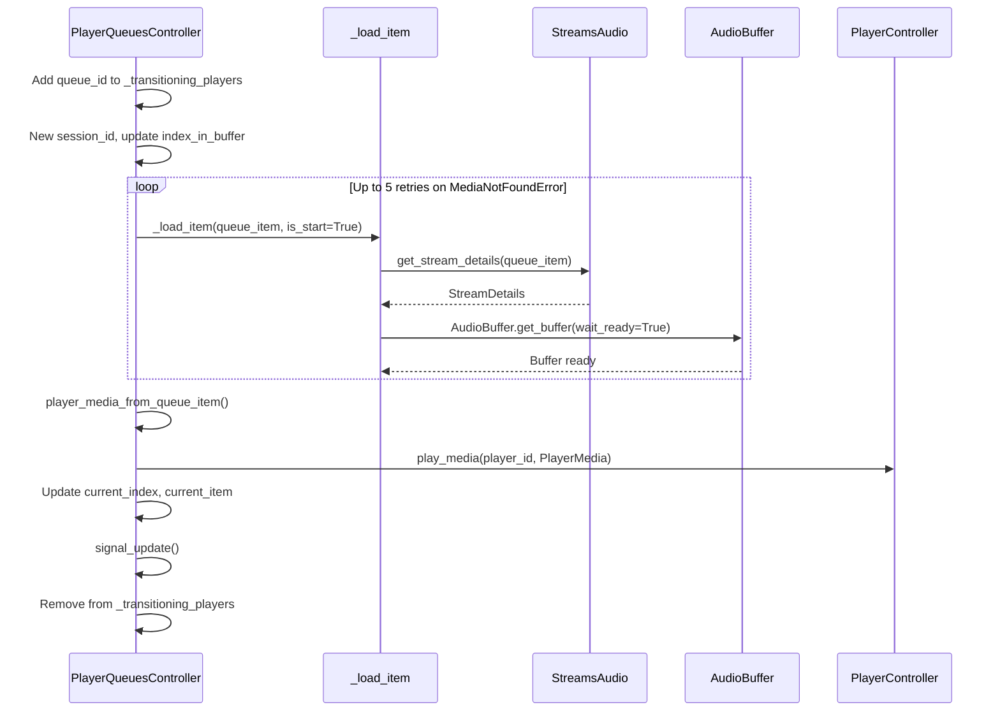

# 09 — Player Queue Management

The Player Queue system sits between the media library and the audio streaming pipeline. Every player in Music Assistant has an associated `PlayerQueue` that holds the ordered list of items to play, manages playback state, and orchestrates the handoff between tracks. The `PlayerQueuesController` is the central coordinator — it resolves media into queue items, drives playback via the player controller, and pre-warms audio buffers to ensure seamless transitions.

## Architecture Overview

```mermaid
graph LR
    subgraph "Entry Points"
        API["play_media()<br/>play_index()<br/>next() / previous()"]
    end

    subgraph "PlayerQueuesController"
        PQ[Queue State<br/>_queues · _queue_items]
        Load[load() — insert/shuffle]
        PI[play_index() — playback flow]
        LI[_load_item() — stream details + buffer]
        PNA[_prepare_next_audio_buffer()]
        LNQ[load_next_queue_item()]
    end

    subgraph "Player Layer"
        PC[PlayerController<br/>play_media · cmd_stop · cmd_pause]
    end

    subgraph "Streams Layer"
        SA[StreamsAudio<br/>get_stream_details]
        AB[AudioBuffer<br/>get_buffer · fill]
    end

    API --> PQ
    PQ --> Load --> PI
    PI --> LI
    LI --> SA
    LI --> AB
    PI --> PC
    PNA --> AB
    LNQ --> LI
```

## PlayerQueuesController

`PlayerQueuesController` extends `CoreController` with `domain = "player_queues"`. It manages two in-memory dictionaries that hold all runtime state:

| Dictionary | Key | Value |
|-----------|-----|-------|
| `_queues` | `queue_id` (= player_id) | `PlayerQueue` — playback state, indices, flags |
| `_queue_items` | `queue_id` | `list[QueueItem]` — the ordered playlist |

Additional state:
- `_prev_states` — previous `CompareState` per queue (for change detection in update signals)
- `_transitioning_players` — set of player IDs currently between tracks (prevents duplicate advance commands)
- `_play_action_refcount` — per-queue refcount of nested `@handle_play_action` invocations (used to keep `ATTR_PLAY_ACTION_IN_PROGRESS` set across nested play actions, since the actual lock is now the unified player lock — see [The `@handle_play_action` Decorator](#the-handle_play_action-decorator) below)

### The `@handle_play_action` Decorator

Play-related methods (`play_media`, `play_index`) are wrapped with `@handle_play_action`, which:

1. Acquires `mass.players.get_player_lock(queue_id, PlayerLockPurpose.PLAYBACK)` — the same per-purpose, re-entrant-per-asyncio-Task lock that the player controller uses for `cmd_play` / `cmd_stop` / `cmd_resume` / `cmd_power` / `play_announcement` / `play_media` / `enqueue_next_media`. See [04-player-controller.md](04-player-controller.md#per-player-locking) for the lock semantics.
2. Maintains a per-queue refcount in `_play_action_refcount` so nested calls (e.g. `play_media` calling `play_index`) don't clear the in-progress flag prematurely.
3. Sets `extra_attributes[ATTR_PLAY_ACTION_IN_PROGRESS] = True` and signals the queue when the refcount transitions 0→1; clears the flag and signals again when it transitions back to 0.

Sharing one lock across queue + controller eliminates the previous deadlock: when the queue's `play_media` synchronously called `controller.play_media`, both held different locks and could deadlock under concurrent play actions (#3624). With one re-entrant lock per `(player_id, purpose)`, the same task can re-enter freely — no separate ContextVar guard is required.

### Queue Restore on Player Register

When a player registers, `PlayerQueuesController.on_player_register(player)` rehydrates the queue's `PlayerQueue` snapshot from the cache. The restore path:

1. Loads the cached `PlayerQueue` dict via `mass.cache.get(...)` and runs it through `PlayerQueue.from_dict()`.
2. Forces `extra_attributes[ATTR_PLAY_ACTION_IN_PROGRESS] = False` — protection against MA being killed mid-play-action and leaving the flag stuck on next start.
3. Calls `queue.from_cache(prev_state)` (mashumaro hook on the model). This reconstructs both `radio_source` and `enqueued_media_items` back into proper `MediaItemType` instances — without it, mashumaro deserializes them as plain dicts and downstream `isinstance(item, Playlist)` checks (e.g. in `_fill_radio_tracks`) silently fail (#3827).
4. Loads the cached queue items via `mass.cache.get(...)` and runs each through `QueueItem.from_cache()`.

## PlayerQueue Dataclass

`PlayerQueue` (from `music_assistant_models.player_queue`) holds the runtime state of a single queue. Queue-scoped flags such as `ATTR_PLAY_ACTION_IN_PROGRESS` live in the `extra_attributes` dict — they used to be top-level fields in earlier versions.

| Field | Type | Description |
|-------|------|-------------|
| `queue_id` | `str` | Same as the player ID |
| `display_name` | `str` | Human-readable name |
| `active` | `bool` | Whether this queue is the player's active source |
| `available` | `bool` | Whether the associated player is available |
| `items` | `int` | Total item count |
| `state` | `PlaybackState` | IDLE, PLAYING, PAUSED |
| `shuffle_enabled` | `bool` | Shuffle mode |
| `repeat_mode` | `RepeatMode` | OFF, ONE, ALL |
| `dont_stop_the_music_enabled` | `bool` | Auto-radio when queue runs out |
| `current_index` | `int \| None` | Index of the currently playing item |
| `index_in_buffer` | `int \| None` | Index of the item currently in the audio buffer |
| `elapsed_time` | `float` | Seconds elapsed in current track |
| `elapsed_time_last_updated` | `float` | Timestamp of last elapsed_time update |
| `current_item` | `QueueItem \| None` | The item currently playing |
| `next_item` | `QueueItem \| None` | The next item (for UI display) |
| `resume_pos` | `int` | Seconds offset to resume from after pause |
| `flow_mode` | `bool` | Whether flow mode is active (set by streams layer) |
| `flow_mode_stream_log` | `list[PlayLogEntry]` | Items played during the current flow stream |
| `radio_source` | `list[MediaItemType]` | Seed items for radio mode (and dynamic-playlist refill) |
| `enqueued_media_items` | `list[MediaItemType]` | Original media items that were enqueued (capped at 10 most recent) |
| `next_item_id_enqueued` | `str \| None` | Queue item id last announced to the player via `enqueue_next_media`, so re-announce can skip if unchanged |
| `items_last_updated` | `float` | Timestamp of the last `update_items()` swap (drives `QUEUE_ITEMS_UPDATED` change detection) |
| `session_id` | `str \| None` | Current playback session (validated in stream URLs) |
| `extra_attributes` | `dict[str, EXTRA_ATTRIBUTES_TYPES]` | Bag for queue-scoped flags (value type alias is `str \| int \| float \| bool \| None`). Holds `ATTR_PLAY_ACTION_IN_PROGRESS` and any other transient queue-side state |
| `userid` | `str \| None` | User who initiated playback |

The `corrected_elapsed_time` property accounts for wall-clock drift while the state is PLAYING.

## QueueItem Dataclass

`QueueItem` (from `music_assistant_models.queue_item`) represents a single entry in the queue:

| Field | Type | Description |
|-------|------|-------------|
| `queue_id` | `str` | Parent queue ID |
| `queue_item_id` | `str` | Unique ID for this queue entry |
| `name` | `str` | Display name |
| `duration` | `float` | Track duration in seconds |
| `sort_index` | `int` | Original insertion order (for un-shuffle) |
| `streamdetails` | `StreamDetails \| None` | Filled when playback starts |
| `media_item` | `MediaItemType \| None` | The resolved media item |
| `image` | `MediaItemImage \| None` | Cover art |
| `index` | `int` | Current position in queue |
| `available` | `bool` | Whether the item can be played |
| `extra_attributes` | `dict` | Provider-specific metadata |

The `uri` and `media_type` properties are derived from `media_item`.

## Playing Media

### `play_media` — The Main Entry Point

`play_media(queue_id, media, option, radio_mode, start_item, username, sort_by)` is the primary API for initiating playback. It accepts flexible input:

- **`str`** — parsed as a URI via `mass.music.get_item_by_uri()`
- **`ItemMapping`** — a lightweight reference to a media item
- **`MediaItemType`** — a fully resolved media item
- **`list`** — any combination of the above

The `sort_by` parameter (#3663) lets the caller pin the queue's track order to whatever sort the user is currently viewing in the UI before `start_item` is applied. Without it, "play from here" on an album sorted by year/duration/title would silently fall back to the album's intrinsic track order; with it, the queue matches the user's view exactly.

The `QueueOption` enum controls how items are inserted:

| Option | Behavior |
|--------|----------|
| `REPLACE` | Clear queue items (without stopping the player — `skip_stop=True`, #3753), load new items, start playback from index 0. The player keeps outputting audio through the brief gap; the new track takes over via the normal `play_index` flow. |
| `PLAY` | Insert at current position, start playing the first new item |
| `NEXT` | Insert after the current item |
| `REPLACE_NEXT` | Replace everything after current item |
| `ADD` | Append to the end (or after current if shuffled) |

If `option` is `None`, it defaults to a per-media-type config value (`default_enqueue_option_{media_type}`).

### Radio Mode

When `radio_mode=True`, `play_media` replaces the resolved items with a mix of similar tracks:

1. `_get_radio_tracks(is_initial_radio_mode=True)` samples base tracks from each seed item's `radio_mode_base_tracks()` on the music provider.
2. Fetches similar tracks via `TracksController.similar_tracks()`.
3. Filters out tracks longer than `RADIO_TRACK_MAX_DURATION_SECS` (20 minutes) and already-queued tracks.
4. The `radio_source` on the queue is set so the system can refill when the queue runs low.

Radio refill is triggered in `_update_queue_from_player` when fewer than 5 tracks remain after the current index.

### "Don't Stop the Music"

`dont_stop_the_music_enabled` is a gentler version of radio mode — when the queue is about to run out, it uses the originally `enqueued_media_items` as seed and calls `_fill_radio_tracks` to append similar content.

### Dynamic Playlists

Some music providers expose **dynamic playlists** — internet radio stations or smart playlists where the next batch of tracks is computed on demand by the provider rather than known up-front. They surface as `Playlist` objects with `is_dynamic = True` (#3527).

`play_media` detects `Playlist + is_dynamic` and routes through a different path:

1. The first batch is fetched immediately via `get_playlist_tracks(playlist, start_item=None)`.
2. The dynamic playlist itself is preserved on `queue.radio_source` so the refill path can find it later.
3. Refill (`_fill_radio_tracks`) checks `radio_source` for a dynamic playlist *before* falling through to generic similar-tracks radio. If one is found, it fetches the next batch from the provider and **appends** to the queue:

   ```python
   await self.load(
       queue_id,
       queue_items,
       insert_at_index=len(self._queue_items[queue_id]),
       keep_remaining=True,
       keep_played=True,
   )
   ```

   Appending (rather than inserting after `current_index`) preserves any unplayed buffered tracks ahead of the new batch (#3675). Earlier versions inserted at `current_index + 1` with `keep_remaining=False`, which discarded those tracks.
4. If the provider returns no playable tracks, the refill logs a warning and exits — it does **not** fall back to the generic similar-tracks radio. Stations manage their own track supply.

## Playback Flow

### `play_index` — Starting a Track

`play_index(queue_id, index, seek_position, fade_in)` is the core playback driver. For podcast episodes and audiobooks, if no explicit `seek_position` is provided, the resume position is restored from `resume_position_ms`. On failure (`MediaNotFoundError` or `AudioError`), the item is marked unavailable and the queue advances to the next index with `allow_repeat=False` (preventing infinite loops even with repeat-all enabled):



Key details:

1. **Retry loop** — if `_load_item` raises `MediaNotFoundError` or `AudioError`, the item is marked unavailable and the next index is tried (up to 5 attempts).
2. **`_load_item`** fills `queue_item.streamdetails` via `StreamsAudio.get_stream_details()` and, when `is_start=True`, eagerly creates an `AudioBuffer` with `wait_ready=True` so the player can start immediately.
3. **Dispatch** — calls `PlayerController.play_media()` (not `cmd_play`, which is the resume path) with a `PlayerMedia` object containing the stream URL, format, and queue context.
4. **Session ID** — a new `shortuuid` is generated for each `play_index` call. Stream URLs embed this session ID; the streams controller validates it to reject stale requests.

### `_load_item` — Preparing Stream Details

`_load_item` is responsible for making a queue item playable:

1. Checks `queue_item.available` — raises `MediaNotFoundError` if false.
2. For tracks, prefers the library version over the provider version (richer metadata). Special-cases YTM and album image precedence.
3. Determines album-context loudness (tracks from the same album can share loudness measurements).
4. Calls `StreamsAudio.get_stream_details()` to resolve the actual audio source, format, loudness data, and normalization mode.
5. When `is_start=True`, calls `AudioBuffer.get_buffer(wait_ready=True, reason="prepare")` to pre-fill the buffer before the player asks for the stream.
6. After `get_stream_details` returns, if `streamdetails.duration` has a value and the original `queue_item.duration` was unset (common for podcast episodes and some audiobooks), the duration is backfilled onto the queue item and a `signal_update(items_changed=True)` is emitted so the UI reflects the actual length once playback starts (#3668).

### Pre-Warming the Next Track

Seamless transitions require the next track's buffer to be ready before the current track ends. Two mechanisms coordinate this:

**1. Buffer pre-warm (~60s before end)**

During PCM streaming in `get_queue_item_stream`, when the consumed position passes `duration - 60` seconds, the streams audio layer calls `_prepare_next_audio_buffer()`:

```python
def _prepare_next_audio_buffer(self, queue_id: str) -> None:
    # Async task: fetch stream details for next_item,
    # then AudioBuffer.get_buffer(wait_ready=True, reason="prepare_next")
    self.mass.create_task(_do_prepare)
```

**2. Preloading stream details and enqueuing**

After a track is loaded into the buffer (`track_loaded_in_buffer`), `_preload_next_item` waits until that item becomes the `current_item` (with a 120-second timeout to guard against race conditions), then calls `load_next_queue_item()` to resolve the next item's stream details. It then schedules `_enqueue_next_item()`, which calls `PlayerController.enqueue_next_media()` to tell the player about the upcoming track.

**3. Flow stream recovery**

After a flow stream finishes, `queue_buffer_completed` polls for up to 60 seconds waiting for the player to go idle. If the original session is still active and new items have been appended to the queue, it calls `play_index` to resume playback automatically.

### `load_next_queue_item` — Advancing the Queue

Called by the streams layer when the current stream is about to end (crossfade transitions, flow mode loop), and by the preload path. It:

1. Finds the next valid index via `_get_next_index()` (respecting repeat mode).
2. Calls `_load_item()` (without `is_start`, so no buffer warm here — that's handled separately by `_prepare_next_audio_buffer`).
3. Returns the resolved `QueueItem` or raises `QueueEmpty`.
4. Retries up to 10 times if items are unavailable, skipping them.

## Queue Loading and Shuffle

### `load` — Inserting Items

`load(queue_id, queue_items, insert_at_index, keep_remaining, keep_played, shuffle)` is the low-level method for modifying the queue contents:

- `keep_played=False` drops items before `insert_at_index` (REPLACE semantics).
- `keep_remaining=True` preserves items after `insert_at_index` (ADD/NEXT semantics).
- Each item's `sort_index` is set to its original insertion order (for un-shuffle).
- If `shuffle=True`, `_smart_shuffle` randomizes the new portion while trying to avoid adjacent duplicate track names.

### Shuffle and Repeat

**Shuffle:**
- `set_shuffle(enabled)` rebuilds the queue tail. When enabled, it calls `load` with `shuffle=True` on all items after the current index. When disabled, it restores `sort_index` order.
- Radio mode bypasses shuffle (radio ordering is intentional).

**Repeat modes** affect `_get_next_index`:

| Mode | At last item | During skip (`next()`) |
|------|-------------|------------------------|
| `OFF` | Returns `None` (queue ends) | Normal advance |
| `ONE` | Same index (loop single track) | Advances normally (skip overrides repeat-one) |
| `ALL` | Returns index 0 (loop entire queue) | Normal advance |

### Queue Items Mutability Invariant

`_queue_items[queue_id]` is treated as **append-or-replace, never mutate-in-place**. Methods that change the list build or `.copy()` it first, then call `update_items(queue_id, new_list)` to atomically swap the binding and emit a `QUEUE_ITEMS_UPDATED` event. `delete_item()` originally mutated the list in place, which could race with concurrent reads serializing the queue to clients; PR #3551 fixed it to copy before `pop()`. Treat any future mutator the same way.

## Playback Controls

| Method | Behavior |
|--------|----------|
| `play()` | If queue is active and PAUSED, resumes via `queue_player.play()`; otherwise falls through to `resume()` |
| `pause()` | Saves `resume_pos`, sends `cmd_pause` to player; starts `_watch_pause` (auto-stop after ~30s paused) |
| `resume()` | Computes position from `resume_pos` / `corrected_elapsed_time`; optional fade-in if idle > 60s; radio forces position 0; calls `play_index()` |
| `stop()` | Sends `cmd_stop` to player; clears transitioning state; schedules buffer cleanup |
| `next()` | Adds to `_transitioning_players`; updates UI index; debounced `play_index` after 1s |
| `previous()` | If elapsed < 5s, go to previous index; otherwise restart current track; debounced `play_index` |
| `seek(position)` | Calls `play_index(queue_id, current_index, seek_position=position)` |
| `play_pause()` | Toggle between `play()` and `pause()` |

### Cross-Controller Command Re-entrancy

When `cmd_stop`, `cmd_pause`, etc. on `PlayerController` see an active queue, they unconditionally redirect to `player_queues.stop()` / `player_queues.pause()`. The queue methods then call back into `cmd_stop` / `cmd_pause` to actually stop the player.

This used to require an `IN_QUEUE_COMMAND` ContextVar guard to prevent infinite recursion and lock contention. PR #3624 removed the guard: both call sites now share the unified player lock via `get_player_lock(player_id, PlayerLockPurpose.PLAYBACK)`, which is re-entrant per asyncio Task. The same task that's running inside `player_queues.stop()` can call `cmd_stop` and re-enter the lock without deadlock — and the redirect from `cmd_stop` back to the queue is harmless because the redirect target sees a no-op (queue already stopping). See [04-player-controller.md](04-player-controller.md#per-player-locking).

## Transition Guard

`_transitioning_players` is a set of player IDs currently between tracks. It is:
- **Set** in `next()`, `previous()`, and at the start of `play_index()`
- **Cleared** in `play_index()`'s `finally` block

When `on_player_update` fires for a transitioning player, the handler returns early. This prevents transient player state during track changes from fighting the queue's intended state.

## Playback Progress Reporting

`_update_queue_from_player` calls `_handle_playback_progress_report` on three triggers: when `state` changes, when `current_item_id` changes, or on the 30-second cadence (`PLAYBACK_REPORT_INTERVAL_SECONDS`). The report emits an `EventType.MEDIA_ITEM_PLAYED` event carrying a `MediaItemPlaybackProgressReport` that includes:

- URI, media type, name, artists, album
- Duration, `seconds_played`, `fully_played`
- `is_playing`, `userid`

This event drives scrobbling (Last.fm, ListenBrainz) and playlog updates.

## Queue Resolution: `get_active_queue`

When a command or stream request needs the active queue for a player, `PlayerController.get_active_queue(player)` resolves it through a 4-step chain:

1. **Sync leader** — if `player.state.synced_to` points to another player, recurse into that player's queue.
2. **Active GROUP** — if `player.state.active_group` points to a group player, recurse into the group player's queue.
3. **Active source / player ID** — look up `player.state.active_source` (or fall back to `player.player_id`) as a queue ID.
4. **Protocol parent** — if the player is `PlayerType.PROTOCOL` with a `protocol_parent_id`, recurse into the parent player's queue.

This resolution chain ensures that grouped players, sync children, and protocol wrappers all find the correct queue — the one owned by their effective leader or parent. It is used throughout the streaming pipeline (e.g., `_prepare_next_audio_buffer` pre-warms based on the resolved queue, not the individual player's naive queue).

## Queue as Active Source

The queue is the "usual active source" for a player, but not the only possibility. On every player update, the queue checks:

```python
queue.active = player.state.active_source in (queue.queue_id, None)
```

When `active_source` is another ID (e.g. a plugin source like Spotify Connect), the queue becomes inactive. If this is the first update for this queue (no entry in `_prev_states`), its state is set to IDLE and processing returns early. Otherwise, the queue falls through to normal `_update_queue_from_player` processing. Plugin sources can handle their own `next_track`, `previous_track`, `seek`, and `volume` commands — the `PlayerController` checks for an active plugin source before routing to the queue (see [04-player-controller.md](04-player-controller.md) and [11-plugin-system.md](11-plugin-system.md) for the full plugin source architecture).

## Queue Events

| Event | When |
|-------|------|
| `QUEUE_ADDED` | First player update after registration |
| `QUEUE_UPDATED` | Any queue state change (`signal_update`) |
| `QUEUE_ITEMS_UPDATED` | Queue contents changed (`signal_update` with `items_changed=True`) |
| `QUEUE_TIME_UPDATED` | Elapsed-time-only changes (> 2s delta) or explicit time corrections |
| `MEDIA_ITEM_PLAYED` | Progress reporting / scrobbling every 30s |

See [01-event-system.md](01-event-system.md) for the general event infrastructure.

## Key Files

| File | Role |
|------|------|
| [`controllers/player_queues.py`](../../music_assistant/controllers/player_queues.py) | PlayerQueuesController — queue management and playback orchestration |
| `music_assistant_models/player_queue.py` | PlayerQueue dataclass (in models package) |
| `music_assistant_models/queue_item.py` | QueueItem dataclass (in models package) |
| [`controllers/players/controller.py`](../../music_assistant/controllers/players/controller.py) | PlayerController — receives play/stop/pause commands from the queue |
| [`controllers/streams/audio.py`](../../music_assistant/controllers/streams/audio.py) | StreamsAudio — provides `get_stream_details` and buffer management |
| [`controllers/streams/audio_buffer.py`](../../music_assistant/controllers/streams/audio_buffer.py) | AudioBuffer — pre-filled PCM buffer |
| [`constants.py`](../../music_assistant/constants.py) | `PLAYBACK_REPORT_INTERVAL_SECONDS`, `QueueOption`, config keys |
