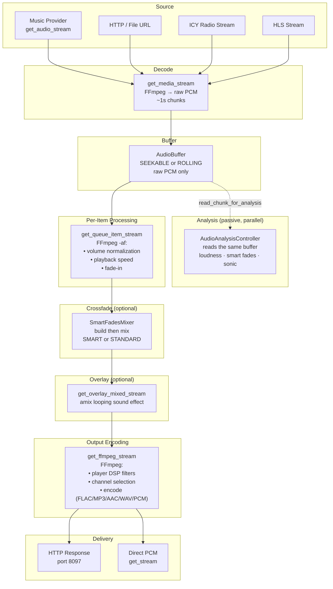

# 10 — Audio Streaming Pipeline

The streaming pipeline is the end-to-end audio path from music provider to player. Raw audio is decoded from the source, buffered as PCM, processed through volume normalization and DSP filters, optionally crossfaded and overlaid, encoded to the player's preferred output format, and served via HTTP or consumed directly as PCM. Audio analysis runs alongside it as a passive reader of the same buffer.

The package has five collaborating classes, all reachable from `mass.streams`:

| Class | Attribute | Role |
|---|---|---|
| `StreamsController` | `mass.streams` | HTTP server, endpoints, stream-URL resolution, the public streaming API |
| `StreamsAudio` | `.audio` | Stream acquisition, decoding, per-item processing, crossfade, overlay, format selection |
| `AudioProcessingManager` | `.audio_processing` | Tracks what processing is actually in effect and publishes it onto `StreamDetails` |
| `AudioAnalysisController` | `.audio_analysis` | Ahead-of-time analysis, reading PCM out of the playback buffer |
| `LiveAnnouncementManager` | `.live_announcements` | Accepts an announcement streamed in over a WebSocket and serves it back out to players (#5626) |

The [Streams Controller README](../../music_assistant/controllers/streams/README.md) is the in-tree companion; it owns the module inventory and the config-key table.

## Pipeline Overview



`MediaType.AUDIO_SOURCE` items (plugin-backed live sources) take a deliberately shorter route that skips the buffer, normalization, crossfade and overlay entirely — see [AudioSource: the realtime bypass](#audiosource-the-realtime-bypass).

## Network Architecture

The streams controller runs a **dedicated HTTP-only webserver** on a separate port (default **8097**), independent of the main Music Assistant API server on port 8095. This is intentional:

- **No SSL/TLS** — many embedded audio players (Chromecast, DLNA receivers) have limited resources and struggle with TLS handshakes. Audio streaming is internal-network only.
- **No authentication** — players need direct stream access. Instead, stream URLs embed a **session ID** that the controller validates to reject stale or invalid requests.
- **Separate port** — isolates audio traffic from API traffic, allowing independent configuration.

The webserver is an `aiohttp` application managed by a `Webserver` helper class with dynamic route support.

Three advanced config values control the network surface: `bind_ip` (default `0.0.0.0`, offered as a dropdown of the host's addresses), `bind_port` (default 8097), and `publish_ip`. `publish_ip` is what gets baked into the URLs handed to players, and it defaults to `auto` — resolved at setup to the host's first address from `get_ip_addresses(include_ipv6=True)`. All three are `requires_reload=True`. Because a wrong publish address is a common and confusing failure (players get a URL they cannot reach, so nothing plays), `setup()` deliberately logs the resolved address and port in a boxed banner — at WARNING level until onboarding completes.

The streams server publishes **one** address. The multi-address advertising added in #4646 applies to the main webserver and mDNS discovery, not here; see [13-discovery.md](13-discovery.md).

## StreamsController

`StreamsController` (`controllers/streams/controller.py`, ~2340 lines) extends `CoreController` with `domain = "streams"`. It owns the HTTP server and the three sub-components.

### Initialization

```python
self._server = Webserver(self.logger, enable_dynamic_routes=True)
self.audio = StreamsAudio(mass)
self.audio_processing = AudioProcessingManager(mass)
self._audio_analysis = AudioAnalysisController(self)
self._active_output_streams = 0
```

`AudioProcessingManager` (`audio_processing.py`) was extracted from `audio.py` in #4793. `AudioAnalysisController` is exposed through an `audio_analysis` property rather than the attribute directly.

`_active_output_streams` counts queue streams (single-item or flow) currently serving a player. It is incremented and decremented around the serving handlers and read back through `output_stream_active()` / `audio_analysis.playback_active()`, so the analysis workers know to yield CPU while audio is actually flowing. Announcements are a separate path and never run analysis.

`StreamsAudio` in turn instantiates a `SmartFadesMixer` (exposed as the `smart_fades_mixer` property) that reads persisted analysis to drive crossfade execution — the mixer is separate from the analysis algorithm, which lives in the `smart_fades` audio-analysis provider. See [17-smart-fades.md](17-smart-fades.md).

`setup()` calls `self.audio.setup()` and `self._audio_analysis.setup()`, mirrors the log level onto the audio and FFmpeg loggers, configures the dedicated smart-fades logger, validates FFmpeg version (≥ 6), and starts the HTTP server.

### HTTP Endpoints

Six static routes, registered in `setup()`:

| Path Pattern | Handler | Purpose |
|-------------|---------|---------|
| `/single/{session_id}/{queue_id}/{queue_item_id}/{player_id}.{fmt}` | `serve_queue_item_stream` | Single-item stream |
| `/flow/{session_id}/{queue_id}/{queue_item_id}/{player_id}.{fmt}` | `serve_queue_flow_stream` | Continuous flow stream |
| `/source/{session_id}/{source_player_id}/{player_id}.{fmt}` | `serve_audio_source_stream` | A live `AudioSource` attached to a player rather than sitting in a queue |
| `/announcement/{player_id}.{fmt}` | `serve_announcement_stream` | Announcement audio |
| `/command/{session_id}/{queue_id}/{command}.mp3` | `serve_command_request` | Command sounds |
| `/live_announcement/{session_id}.wav` | `live_announcements.serve_stream` | Outbound leg of a live (streamed-in) announcement |

Dynamic routes (registered via `register_dynamic_route`) handle UGP streams (`/ugp/{player_id}.{codec}`) and other runtime-registered paths.

Live sources have **two** routes, depending on how they are bound. A live source that the user enqueued is a `MediaType.AUDIO_SOURCE` queue item and streams through `/single/`, inheriting session validation, queue state and transport control. A source **attached directly to a player** — the common case for a receiver like Spotify Connect — is not a queue item at all; it is an [`AudioSourceSession`](04-player-controller.md#live-audiosource-sessions) and streams through `/source/`, keyed by the player that owns the source rather than by a queue. See [11-plugin-system.md](11-plugin-system.md) for the provider-side model.

### Stream URL Resolution

`resolve_stream_url(player_id, media)` decides the path and format for a `PlayerMedia`, and it is where **flow mode is actually settled** — just-in-time, because the answer depends on which protocol player ends up rendering the audio.

Announcements and pre-built flow streams return their URI verbatim. Otherwise the output codec comes from the protocol player's `CONF_OUTPUT_CODEC` (default FLAC). For a live source, WAV is available as an **opt-in** via the per-player `CONF_PREFER_WAV_FOR_LIVE_SOURCES` (default **off**): a live source is already PCM, so a WAV container can make the encode step a pure passthrough, dropping an entire FFmpeg process and its latency from the consumer side. It is not the default because the passthrough only actually happens when WAV is chosen *and* no filters are active *and* the PCM format matches exactly; when any of those fail the stream is re-encoded anyway, and WAV costs far more bandwidth than FLAC for no benefit.

Flow mode is then forced when any of these hold:

| Condition | Why |
|---|---|
| The protocol player has `flow_mode` configured | Explicit user/provider choice |
| Crossfade is enabled on the queue and the player does not support gapless | Crossfading across a per-item boundary is impossible without gapless |
| An audio overlay is active on the queue | The overlay has to run continuously across track boundaries |

…and always suppressed for `RADIO` and `AUDIO_SOURCE`, which are single long-lived streams where flow mode is meaningless. The same three-way decision is repeated in `get_stream()` for direct-PCM consumers, which additionally accept a `force_flow_mode` override for multi-client fan-out.

### Session ID Validation

**Both** `/single/` and `/flow/` enforce the session ID. It lives on the server-side record as `PlayerQueueData.session_id`, not on the wire `PlayerQueue`, and is reached through `mass.player_queues.queue_data()`:

```python
session_id = request.match_info["session_id"]
pq_data = self.mass.player_queues.queue_data(queue.queue_id)
if pq_data.session_id is None or session_id != pq_data.session_id:
    raise web.HTTPNotFound(reason=f"Unknown (or invalid) session: {session_id}")
```

Note the `is None` check: a queue with no active session rejects every request rather than accepting any. `PlayerQueuesController.play_index` rotates the session on every new playback session, which is what makes a stale player request for a superseded track fail fast. See [09-player-queues.md](09-player-queues.md#playerqueue-vs-playerqueuedata).

`get_queue_flow_stream` re-validates beyond the handler: it snapshots the session at the top and exits cleanly on the next yield or play-log append if `PlayerQueueData.session_id` has moved on, so a newer producer taking over the queue (rapid track switch, sync-group reform, dynamic leader handoff) can never end up with two producers writing to the same `flow_mode_stream_log`.

### Stream Entry Points

Two paths exist for delivering audio:

1. **HTTP endpoints** (`serve_queue_item_stream`, `serve_queue_flow_stream`) — for players consuming HTTP streams (Chromecast, DLNA, Sonos). Responses include DLNA-compatible headers, optional ICY metadata, and configurable HTTP profiles (chunked, no content-length, forced content-length).

2. **Direct PCM** (`get_stream`) — for player providers that consume raw PCM directly (AirPlay, Sendspin, Snapcast). These providers call `get_stream()` to receive an async generator of PCM chunks without HTTP overhead. `get_stream` also handles the announcement and UGP-member special cases, and `use_flow_stream_buffering` wraps the flow stream in a 30-second buffer for consumers that cannot tolerate the brief stall a smart-fade transition can introduce.

The two paths deliberately mirror each other rather than sharing one code path, and three behaviours must stay in sync between them: the flow-mode decision, overlay mixing, and the `AudioSource` plugin lifecycle hooks. Both call `_update_audio_processing_context()` so the processing snapshot is published either way.

### HTTP Profile Configuration

Per-player `CONF_HTTP_PROFILE` controls response behavior:

| Profile | Content-Length | Transfer | Use case |
|---------|---------------|----------|----------|
| Chunked | Not set | Chunked encoding | Most players |
| No content-length | Not set | Identity | Players that choke on chunked |
| Forced content-length | Calculated | Identity | Players that require length (some DLNA) |

## StreamsAudio

`StreamsAudio` (`controllers/streams/audio.py`, ~4840 lines) is the audio processing engine, accessible as `self.audio` on `StreamsController`. It handles stream acquisition, format selection, normalization, crossfade, overlay, and the player output plan.

### `get_stream_details` — Resolving Audio Sources

Before a queue item can be streamed, the system must know where its audio comes from, what format it's in, and what processing is needed:

1. **Reuse check** — reuse the existing `streamdetails` when its buffer can serve the requested seek position (the fast-seek path), or when the details simply have not expired yet (`created_at + expiration`), in which case a fresh buffer is built around them.
2. **Provider walk** — iterate `provider_mappings` sorted by quality descending, skipping unavailable mappings and unloaded providers. The walk runs as a two-phase loop over `allow_other_provider` in `(False, True)`: the first pass only tries providers in the preferred set, the second falls back to any remaining provider. The preferred set is the playback user's `provider_filter` when they have one, otherwise all of the item's own provider instances. `AUDIO_SOURCE` items branch to `PluginProvider.get_stream_details(item_id, queue_id)`, which is queue-scoped rather than media-type-scoped.
3. **Error preference** — the last `AudioError` seen during the walk is remembered and re-raised in preference to the generic `MediaNotFoundError`, so the user sees the actionable message ("this track requires a subscription") rather than "not found".
4. **Radio resolution** — for radio streams, resolve playlist URLs (M3U, PLS) and detect ICY vs in-band metadata vs HLS; HLS radio attaches a metadata update callback on a 5-second interval.
5. **Duration and seek sanity** — backfill duration from the media item, and drop a requested seek position when the stream does not allow seeking or has no duration.
6. **Normalization** — set `target_loudness` from the **streams-global** `volume_normalization_target` (validated against the entry's own range and reset to the default if a bad value is stored), then resolve `volume_normalization_mode` via `get_normalization_mode()`.

Two things this method deliberately does **not** do, both of which happen later for good reason:

- **No loudness lookup.** Loudness is hydrated just-in-time in `get_queue_item_stream()`, so a measurement that completed during an earlier play is picked up on this one. See [Volume Normalization](#volume-normalization).
- **No DSP attachment.** DSP is resolved per output at encode time by `get_player_output_plan()`, because one stream can feed several players with different filter chains.

Note the split in how normalization is configured: the **target LUFS is global** to the streams controller (#4369), while **enablement is per-queue** (#4373), read with `get_effective_player_queue_config_value(queue_id, CONF_VOLUME_NORMALIZATION, ...)`. The mode *preference* (`volume_normalization_radio` / `volume_normalization_tracks`) is global too.

### `get_media_stream` — Decoding to PCM

This method acquires raw PCM audio from the source:

| Source Type | Handling |
|-------------|----------|
| `CUSTOM` | Provider's `get_audio_stream()` async generator |
| `ICY` | `get_icy_radio_stream()` — raw stream with ICY metadata parsing |
| `SHOUTCAST` | `get_shoutcast_stream()` — Shoutcast-style radio with its own metadata path |
| `IN_BAND` (OGG radio) | `get_chained_ogg_stream()` — stitched OGG pages via `ogg_handler.py` |
| `HLS` | `get_hls_substream()` — HLS segment fetching; radio adds `-stream_loop -1 -re` |
| `HTTP` / `FILE` | Direct path to FFmpeg |
| `ENCRYPTED_HTTP` | HTTP with `-decryption_key` for FFmpeg |
| Multi-file | `get_multi_file_stream()` — concat demux |

All sources are piped through **FFmpeg**, which decodes to raw PCM. Output chunks are ~1 second of audio (`calculate_content_length(pcm_format, 1)`). FFmpeg also detects and reports the actual codec after the first chunk, and can refresh track duration from byte count when decoding completes without seeking.

### `get_queue_item_stream` — Per-Item Processing

Streams a single queue item from the `AudioBuffer` with optional per-item filters. `AUDIO_SOURCE` items are dispatched straight to `get_audio_source_stream()` and skip everything below.

1. **Loudness hydration** — if `streamdetails.loudness` is still unset, load it from `audio_analysis.get_audio_analysis(item_id, provider, priority=LOUDNESS_PROVIDER_PRIORITY)`. Doing it here rather than in `get_stream_details` means a measurement that completed during an earlier play is picked up on this one. The priority tuple is `(provider_loudness, loudness_analysis)`, so **a loudness figure supplied by the music provider outranks the server's own EBU R128 measurement** (#6188) — the provider's value describes the audio it is actually about to hand over, including any normalization it applied, which the server's measurement of an earlier encode may not. Builtin ebur128 still runs and still stores its result; it simply loses the tie at read time. An existing value on the streamdetails is never clobbered.
2. **Normalization re-evaluation** — recompute the mode, since hydration may just have made a measurement available that `get_stream_details` did not have. The `normalization_override` parameter skips both steps: the crossfade path uses it to pin a track's replayed intro and its body to the same mode, which would otherwise flip mid-transition.
3. **Filters** — assemble the FFmpeg `-af` chain:
   - **DYNAMIC** → `loudnorm=I={target}:TP=-2.0:LRA=10.0:offset=0.0:print_format=json`
   - **MEASUREMENT_ONLY** → static `volume=XdB`, where X is target minus the measured value (album loudness when `prefer_album_loudness` and a value exists, else track loudness, else 0)
   - **FIXED_GAIN** → constant dB from the radio or tracks config key
   - Optional `atempo` for playback speed, and `afade=type=in:start_time=0:duration=3` **inserted at the front** for fade-in on resume
   The resolved static gain is stored on `streamdetails.volume_normalization_gain_correct`.
4. **Buffer** — `AudioBuffer.get_buffer(reason="streaming")`, then `buffer.get_stream(output_format, seek_position_ms, filter_params)`. With no filters this yields straight from the buffer with no FFmpeg in the path at all.
5. **Publish** — call `audio_processing.update_item_runtime()` with the buffer's input format, the internal PCM format, the effective normalization details and the playback speed, flagging `alters_audio` when a fade-in is applied.

`FALLBACK_DYNAMIC` and `FALLBACK_FIXED_GAIN` are resolved earlier, by `get_normalization_mode()`: by the time filters are built the mode is always one of DISABLED, DYNAMIC, MEASUREMENT_ONLY, FIXED_GAIN, or [SOURCE](#modes) — the last two of which, like DISABLED, contribute no filter.

**Buffer pre-warm trigger:** when the consumed position passes `duration - 60` seconds, the stream calls `player_queues.prepare_next_audio_buffer(queue_id)` to start filling the next track's buffer. The method is public and lives on `StreamFeederMixin` (`controllers/player_queues/stream_feeder.py`); it was previously the private `_prepare_next_audio_buffer()` on the queue controller. The trigger fires once per stream, resolves the queue via `get_active_queue()` rather than assuming the streaming player owns one, and only fires when the next item is a `TRACK` — a live source (radio, `AudioSource`) would open an upstream connection that sits idle and likely times out before the player consumes it. See [09-player-queues.md](09-player-queues.md#pre-warming-the-next-track).

**Track hand-off chain:** once a track is loaded into the buffer, `player_queues.track_loaded_in_buffer(queue_id, item_id)` records `index_in_buffer` and kicks off `_preload_next_item`, which waits for that item to actually become the queue's current item, resolves the next item's stream details via `load_next_queue_item()`, and then has `_enqueue_next_item` hand it to the player through `enqueue_next_media()`. That last step re-validates the session before enqueueing, so a track switch mid-preload cannot enqueue against a superseded session.

### `get_queue_item_stream_with_smartfade` — Crossfade Streaming

For single-item streams with crossfade enabled, this method manages the overlap between outgoing and incoming tracks. Because each track is a separate request, the overlap has to be carried across the request boundary — and it is carried as a **live generator**, not as a buffer of bytes.

`CrossfadeHandover` (keyed by queue) holds the not-yet-consumed remainder of the boundary mix as an open `AsyncGenerator[bytes]`, which the *next* item's request owns and drains. Alongside the stream it carries the bookkeeping the next track needs to stay consistent with the intro that was already played: `fade_in_media_duration` (how much of the next item the mix consumed), the `pcm_format` the mix renders in, the `crossfade_mode` used, an `elapsed_time_offset` so progress reporting accounts for the blended intro, and the `normalization_mode` the intro PCM was baked with — so the replayed intro and the track body never end up on different normalization modes. It keeps a second reference, `source`, to the running mix underneath the continuation, because closing an unstarted generator wrapper never runs its `finally`; `close()` releases both when nothing is going to consume the handover.

The sequence:

1. Pick up the previous track's handover, if any. It is discarded when the user seeks into the track (a crossfade into a mid-track position makes no sense) or when the next item changed while the crossfade was being prepared — the stored `queue_item_id` no longer matches.
2. Hold back the last N seconds of the current track: 45 s (`SMART_CROSSFADE_DURATION`) for smart, the configured duration for standard, capped at half the track duration and abandoned below 5 s. The tail is only held once the buffer has reached EOF, so a still-filling track is never starved of output.
3. At track end, call `load_next_queue_item()` for the next item.
4. `SmartFadesMixer.build(...)` to pick and prime the fade, then `mix(...)` to execute it.
5. Emit the mix into the current response and hand the open remainder on as the next request's `CrossfadeHandover`.

`clear_crossfade_handover(queue_id)` drops a pending handover — used when the queue changes underneath a prepared crossfade.

**Flow streams prefetch the incoming side.** In a flow stream both tracks live in one response, and gathering the audio a transition needs to blend in would otherwise emit nothing while it collected — the player hears that gap as lost lead. `_IncomingFadePrefetcher` collects the incoming track's fade-in *alongside* the held-back tail rather than after it, then hands the collected audio and the still-open stream over together. The track is therefore decoded exactly once and the seam is a plain continuation.

### `get_queue_flow_stream` — Continuous Flow

Flow mode produces a continuous PCM stream across all queue tracks. It is used by universal group players (see [06-grouping.md](06-grouping.md)) and players that don't support gapless.

- Infinite loop: calls `load_next_queue_item()` until the queue is empty.
- Sets `queue.flow_mode = True`.
- Maintains the play log on `PlayerQueueData.flow_mode_stream_log` — appending a `PlayLogEntry` per item, with the seconds actually streamed. It lives on the server-side record, not the wire model, and is written from here; the queue controller reads it to map the player's single cumulative position back to a track index and a per-track elapsed time.
- On EOF, calls `player_queues.queue_buffer_completed(queue_id)` so the queue can wait for the player to go idle and resume if items were added meanwhile. `player_queues.flow_stream_finished(queue_id)` exposes the same fact to player providers whose devices never report idle.
- With crossfade enabled: buffers the tail of each track, mixes the overlap with `SmartFadesMixer`, yields the blended audio.
- Smart crossfade is only offered when `smart_fades_available` — which requires a non-MINIMAL buffer preset *and* the `smart_fades` analysis provider to be loaded. Otherwise the effective mode degrades to standard crossfade.

**Mid-flow restart.** Before each next item, `_flow_stream_needs_restart()` can exit the flow so the queue controller opens a new stream:

- Upcoming `RADIO` or `AUDIO_SOURCE` — live media cannot stay inside a multi-track flow; the controller falls back to a single-item stream.
- Sample-rate mismatch under `bit_perfect` (any effective next rate ≠ current flow rate) or `smart` (next rate **higher** than the current flow rate, after snapping up to a supported player rate). Fixed-rate modes (`48000` / `96000` / `highest`) resample in place and do not restart for rate.

That seam is what lets mixed queues (tracks + radio/plugins) and bit-perfect rate changes coexist with gapless/crossfade continuity on the stretches that *can* flow. See [`select_flow_pcm_format`](#select_flow_pcm_format) for how the initial flow rate is chosen.

## Audio Overlay

The audio overlay (#4674) mixes a looping sound effect — any `sound_effect` media item a provider offers, e.g. rain or white noise — into a queue's playback. It is configured per queue through `player_queues/overlay` (see [09-player-queues.md](09-player-queues.md#other-queue-commands)); this section covers the streaming side.

**It forces flow mode.** An overlay has to run continuously across track boundaries, which per-item stream requests cannot do — each new request would restart the overlay from its beginning. `resolve_stream_url` and `get_stream` therefore both treat an active overlay as a reason to switch the queue to flow mode. Radio is the exception: it is already a single long-lived stream, so the overlay is wrapped around that one request instead.

Mixing happens **once per queue stream**, not once per player, so every player consuming a shared stream hears the identical mix.

`get_overlay_mixed_stream(queue, audio_input, pcm_format)` resolves the source and delegates to `get_ffmpeg_overlay_stream()` in `helpers/ffmpeg.py`, which builds:

- The overlay as FFmpeg **input 0**, looped with `-stream_loop -1` (plus reconnect args for an HTTP source); the main audio arrives on stdin as input 1.
- A `filter_complex` that runs `silenceremove` on the overlay (stripping a soft fade-in from the source so it becomes audible immediately — a no-op for sources that already start at level), scales it by `volume={overlay_volume/100}`, resamples and reformats it to match, then `amix=inputs=2:duration=first:normalize=0`. `duration=first` follows the *main* input's length so the mix ends with the music; `normalize=0` keeps original levels instead of averaging them down.

The output has exactly the same PCM format, duration and chunking as the input. Two design choices make the feature safe to fail:

- `_resolve_overlay_input()` returns `None` — with a warning, not an exception — when the source's provider is gone, the stream type is not a local file or HTTP URL, or a local file no longer exists. The caller then passes the original stream through untouched. Feeding a missing file to the mixer would kill the whole music stream, not just the overlay.
- If the overlay input dies mid-stream, FFmpeg keeps passing the main audio through.

Two consequences worth knowing: the internal PCM format is upgraded to F32 for clipping headroom (as crossfade and DSP do), and audio already sitting in a player's buffer is unaffected by an overlay change — which is exactly why the queue controller restarts playback on an audible change.

## AudioSource: the realtime bypass

`MediaType.AUDIO_SOURCE` items are live and latency-sensitive, so they take the shortest path the pipeline has. `get_audio_source_stream()` skips **all** of it: no `AudioBuffer`, no loudness hydration, no volume normalization, no crossfade or fade-in, no playback-speed shift, no next-track preload, and no analysis session.

`_iter_audio_source_pcm()` picks one of two routes:

| Route | When | Behaviour |
|---|---|---|
| Fast path | The source's PCM format already matches the consumer's | The provider's bytes are paced in Python by `realtime_pcm_pacer` and forwarded — **no FFmpeg in the data path at all** |
| Slow path | Formats differ | `get_media_stream()` resamples through FFmpeg with `-re` for rate pacing |

Rate pacing matters because some producers are not realtime — librespot's pipe backend will hand over audio as fast as it can read it, and without pacing the consumer buffers many seconds ahead, making next/skip feel laggy.

`_open_audio_source_generator()` supports two stream types: `CUSTOM` calls the provider's `get_audio_stream()`, and `NAMED_PIPE` reads a pipe via `read_named_pipe()`. Anything else raises.

**The silence-during-pause contract holds.** `PluginProvider.get_stream_details` and `get_audio_stream` both document that the server wraps a `CUSTOM` generator with a silence-keepalive, so a plugin can simply stop yielding while its upstream device is paused without the player disconnecting. `_open_audio_source_generator()` wraps every `CUSTOM` source in `audio_source_silence_keepalive` (`helpers/audio.py`) to honour that. Silence injection and pacing compose rather than substitute for each other: the keepalive fills the gap so a paused source cannot starve the connection, and `realtime_pcm_pacer` meters the result (#5961). The `NAMED_PIPE` half of the contract needs neither, because those producers (shairport-sync, librespot in pipe mode) write silence themselves.

Both delivery paths run the plugin lifecycle hooks. `serve_queue_item_stream` fires `on_source_selected` on every `AUDIO_SOURCE` **GET** — unconditionally, even when stream details are cached, so a disconnect/reconnect re-claims the source with a fresh session id rather than streaming against stale ownership — and pairs it with `on_source_unselected` in a `finally`. A HEAD probe deliberately does **not** fire the hooks: many DLNA renderers probe with HEAD before GET, and claiming ownership then would trigger transfer side effects prematurely. The HEAD response still validates that the providing plugin is loaded (returning 200 for an unloaded provider would lie to a renderer that caches the response) and advertises `audio/wav` for PCM formats, since most renderers pick a decoder from the HEAD content type and cannot handle `application/octet-stream`. `get_stream()` mirrors the same lifecycle through `_wrap_with_audio_source_lifecycle()` for direct-PCM consumers.

See [11-plugin-system.md](11-plugin-system.md) for the provider-side model and the source-selection semantics.

## Announcements

Announcement audio (a TTS clip, a chime, a notification sound) is produced by `controllers/streams/announcements.py`, and its central idea is **sharing**. `AnnouncementRenderer` owns the announcements currently in progress and keys renders by their audio, so ten players announcing the same sentence attach to one `AnnouncementRender` rather than each running its own TTS fetch and FFmpeg encode. It tracks two maps — render-by-audio and announcement-by-player — because the HTTP route (`/announcement/{player_id}.{fmt}`) only knows which player it is serving. Every `register()` must be paired with an `unregister()`.

The render is buffered and seekable, which is what makes sharing possible: a player that connects slightly later still gets the clip from the start.

### Live announcements

A *live* announcement is speech captured on a client and played out once it has been spoken — a walkie-talkie rather than a text-to-speech clip. `LiveAnnouncementManager` (`live_announcements.py`, #5626) implements it as two legs:

1. **Inbound**, on the main webserver at `/live_announcement`: the client holds an authenticated WebSocket and pushes raw little-endian 16-bit PCM frames for as long as the user speaks. The handshake is `auth` (omitted for Ingress connections), then `start` carrying the player id, sample rate, channels and pre-announce/volume options, answered with `started`. Any text frame — or simply closing — ends the clip. A rejected client is closed with code **4001** and the reason in the close frame.
2. **Outbound**, on the stream server at `/live_announcement/{session_id}.wav`: the buffered frames are served as WAV. The clip is only dispatched to the player once it is **complete**, at which point the ordinary announcement renderer pulls that URL exactly as it would pull a TTS clip — so every player plays a live announcement through the path it already knows.

The limits exist because the clip is held in memory while it is spoken, and because a client that stops sending without saying so would otherwise hold the player's playback lock indefinitely:

| Limit | Value | Reason |
|---|---|---|
| `MAX_CONCURRENT_SESSIONS` | 4 | Live announcements are spoken one at a time by a person; the cap bounds simultaneously buffered audio |
| Sample rate | 8–96 kHz | The accepted range stops at what a capture device plausibly delivers — announcements render to 44.1 kHz anyway, so more is only a bigger buffer |
| Channels | ≤ 2 | Same reasoning |
| Bit depth | 16, fixed | Live audio is always uncompressed 16-bit PCM; only rate and channel count vary |
| `IDLE_TIMEOUT` | 10 s | Measures the gap *between frames*, so silence ends the clip on its own and a trickle of frames cannot hold the player forever |
| `HANDSHAKE_TIMEOUT` | 10 s | Bounds the wait for the messages preceding the audio |

## AudioBuffer

`AudioBuffer` (`controllers/streams/audio_buffer.py`) stores decoded raw PCM audio in memory. It is the single source of truth for audio data — filters are applied only when reading via `get_stream()`.

### Buffer Modes

| Mode | Use Case | Behavior |
|------|----------|----------|
| **SEEKABLE** | Tracks (finite duration, `allow_seek=True`) | Deque of 1-second chunks with indexed access. Old chunks are evicted when max size is reached. |
| **ROLLING** | Radio (infinite, non-seekable) | Short FIFO (~15 seconds). Consumer pops chunks sequentially. |

### Buffer Size Presets

| Preset | Seconds | Nominal RAM target |
|--------|---------|-------------------|
| `MINIMAL` | 60 | Always available |
| `BALANCED` | 300 | ~4 GB |
| `MAXIMUM` | 1200 | ~8 GB |

The RAM figures are **nominal** targets checked through `meets_memory_target()`, which absorbs the gap between a host's advertised size and what the kernel reports (MemTotal reservation plus any integrated-GPU carve-out) — so a "4 GB" box reporting ~3.8 GB still qualifies for Balanced. `get_available_buffer_sizes()` only offers the presets the host can sustain. When total memory is unknown (0.0, e.g. on Windows) the *options list* fails open and offers all three, while the *default* deliberately picks Minimal.

Radio streams always use `RADIO_BUFFER_SIZE` (15 seconds) regardless of preset.

### Buffer Lifecycle

1. **Creation** — `AudioBuffer.get_buffer()` is the static factory. It reuses an existing buffer when it is valid for the requested seek; when invalidating one, it only clears it outright if no consumer has touched it in 30 seconds, otherwise it detaches and lets the inactivity monitor clean up behind the active reader.
2. **Ready threshold** — how many seconds must be buffered past the seek point before `ready` fires:

   | Condition | Threshold |
   |---|---|
   | Crossfade enabled and the item is a track | 8 s |
   | Dynamic normalization, non-radio | 5 s |
   | Dynamic normalization, radio | 3 s |
   | Otherwise | 2 s |

   Radio gets a lower threshold than tracks because a continuous stream lets `loudnorm` converge quickly, so there is no reason to pay the startup latency. The threshold is capped at buffer capacity to avoid a deadlock, and `wait_ready` times out after 15 seconds.
3. **Analysis** — a session is started only for a freshly created buffer at seek position 0, and never for `AUDIO_SOURCE` or `SOUND_EFFECT` media. It is fire-and-forget: analysis setup can include a model load, which must never delay the buffer fill.
4. **Filling** — `fill()` starts a background task that reads `get_media_stream()` and feeds PCM chunks via `_put()`. For a seek beyond 60 seconds the producer starts at the seek position and `_discarded_chunks` is pre-set so chunk numbering still lines up.
5. **Consumption** — `get_stream()` (with optional FFmpeg filters) or `get_raw_stream()` (raw) for playback; `read_chunk_for_analysis()` for the passive analysis reader.
6. **Cleanup** — stale buffers are cleared by `_cleanup_stale_queue_buffers()` on the queue side.

### Seek Behavior

| Scenario | Behavior |
|----------|----------|
| Forward seek ≤ 20s beyond buffered data | Wait for producer to fill (`SEEK_WAIT_THRESHOLD`) |
| Forward seek > 20s or large seek | Invalidate buffer, re-fetch from provider at seek position |
| Backward seek within buffer | Direct read from deque (SEEKABLE mode) |

For large seeks (> 60s), FFmpeg starts at the seek position directly (`-ss` flag), and chunk indices are aligned via `_discarded_chunks`.

### Audio Analysis Hand-off

Analysis is a **passive observer** of the playback buffer (#4442). Nothing is pushed to it, the audio path is not modified, and playback never waits on it. This replaced both the original per-`AudioBuffer` chunk callbacks and the push-based `start_analysis(session_id, streamdetails, audio_format)` + `_distribute_chunk(session_key, pcm)` hand-off that sat between them.

```
AudioBuffer.get_buffer()
  └─ mass.create_task(audio_analysis.start_analysis(audio_buffer, streamdetails))   [fire-and-forget]
       ├─ provider.start_analysis() on every available provider  → declining providers drop out
       └─ AudioAnalysisController._buffer_reader_worker()
            ├─ buffer.read_chunk_for_analysis(cursor)      [1-second chunks, non-mutating]
            ├─ _distribute_chunk(...) fans out to accepting providers
            └─ provider.finalize() at clean EOF, provider.cancel() otherwise
```

The reader keeps **its own cursor** over the buffer's retained chunks and reads at its own pace. That inversion is the whole point: a slow analyzer falls behind and loses its session instead of holding up playback. Concretely:

- `read_chunk_for_analysis()` does not mutate the buffer. If the chunk the reader wants has already been evicted it raises `AudioBufferDiscarded`, and the session is dropped rather than allowed to slow the producer.
- The buffer's only hook into analysis is `register_cancel_callback()`, used to drop the session when the buffer is torn down (track skipped, buffer cleaned up).
- `REALTIME_ANALYSIS_MAX_SESSIONS` caps realtime sessions at **2 per queue** — the playing track and its preloaded successor — evicting the oldest in that queue. Scoping per queue keeps simultaneous queues from evicting each other.
- A provider that blocks longer than `CHUNK_HANG_GUARD_SECONDS` (120.0) on a single chunk is evicted from the session.
- A stream that ends short of `ANALYSIS_MIN_COMPLETENESS_RATIO` (90%) of the expected duration is discarded rather than finalized, so a source that died mid-track cannot persist truncated analysis.
- `playback_active()` reads the controller's `_active_output_streams`, letting the analysis workers yield CPU while audio is actually being served.

See [16-audio-analysis.md](16-audio-analysis.md) for the controller lifecycle, the provider interface, the result schema, and the nightly background scan that reuses the same providers for tracks that have never been analyzed.

### Error Handling

Producer exceptions are stored in `_producer_error`. Consumers can drain remaining buffered data; the error surfaces when they read past the buffered end. Errors bubble up as `AudioError` through the streaming chain.

## Volume Normalization

Volume normalization ensures consistent perceived loudness across tracks from different sources.

### Modes

| Mode | Behavior | FFmpeg Filter |
|------|----------|---------------|
| **DISABLED** | No normalization | None |
| **DYNAMIC** | Real-time loudness analysis and leveling | `loudnorm=I=target:TP=-2.0:LRA=10.0:offset=0.0` |
| **MEASUREMENT_ONLY** | Static gain from stored loudness measurement | `volume=XdB` where X = target - measured |
| **FALLBACK_DYNAMIC** | Use measurement if available, otherwise dynamic | Depends on availability |
| **FALLBACK_FIXED_GAIN** | Use measurement if available, otherwise fixed gain from config | Depends on availability |
| **FIXED_GAIN** | Constant dB adjustment from config | `volume=XdB` from `CONF_VOLUME_NORMALIZATION_FIXED_GAIN_*` |
| **SOURCE** | The provider already delivers normalized audio, so MA adds nothing | None |

`SOURCE` (#5937) is an **outcome, not a user choice** — it is never configured, only reported. When a `MusicProvider` returns true from `delivers_normalized_audio(streamdetails)`, applying MA's own normalization on top would level already-levelled audio, so the chain stays empty and the mode records *why*. `CrossfadeMode.SOURCE` is its counterpart for providers that hand over already-crossfaded audio (a DJ mix, a continuous stream), declared through `delivers_crossfaded_audio()` and applied via `update_source_context`. Both are bit-perfect-neutral: because they add no filter, they do not defeat bit-perfect detection the way an active normalization stage would.

Mode selection (`get_normalization_mode` in `helpers/audio.py`) resolves the `FALLBACK_*` modes down to a concrete one. It considers:

- Whether normalization is enabled — a **per-queue** setting since #4373, resolved with `get_effective_player_queue_config_value()` (see [02-configuration.md](02-configuration.md#per-queue-configuration)).
- Whether a target loudness is set on the stream — a **streams-global** setting (#4369; `volume_normalization_target`, default −14 LUFS).
- Whether a stored loudness measurement exists.
- The separate radio vs tracks mode preference in the streams core config (`volume_normalization_radio` / `volume_normalization_tracks`, both defaulting to `fallback_dynamic`).

The mode is resolved twice: once in `get_stream_details`, then again in `get_queue_item_stream` after loudness hydration, because a measurement may have landed in between. `get_normalization_details()` in `audio_processing.py` turns the outcome into the client-facing `AudioNormalizationDetails`, tagging the measurement source as `LIVE` (dynamic), `FALLBACK` (fixed gain or no measurement), `ALBUM`, or `TRACK`.

### Loudness Analysis

Loudness measurement runs through the **builtin `loudness_analysis` audio-analysis provider** (EBU R128 via FFmpeg `ebur128`). Live playback and the nightly background scan share the same provider. Results are stored in `DB_TABLE_AUDIO_ANALYSIS` under the `loudness_analysis` provider domain. Loudness supplied externally — by file tags, ReplayGain, or a streaming provider's own figure — is written through `set_track_loudness()` under the **virtual `provider_loudness` domain**, which then wins the priority walk described above. There is no separate loudness table: the former `loudness_measurements` was folded into `audio_analysis` and dropped at schema v39. See [16-audio-analysis.md](16-audio-analysis.md#built-in-loudness-analysis) for the full provider model.

## Crossfade

### Configuration

Crossfade is **queue-scoped** (#4373): `PlayerQueue.crossfade_enabled` is the on/off toggle and `crossfade_mode` is a per-queue setting with a global default. The duration (`crossfade_duration`) is global-only, since a numeric range cannot carry the tri-state `global` option.

`StreamsController.get_crossfade_mode(queue)` resolves the effective mode, and it is the single place that decision is made:

1. Crossfade off on the queue → `DISABLED`.
2. Otherwise the default is `SMART_CROSSFADE` when `smart_fades_available`, else `STANDARD_CROSSFADE`.
3. The per-queue `crossfade_mode` value overrides that default, but `SMART_CROSSFADE` is only honoured when `smart_fades_available` — anything else lands on `STANDARD_CROSSFADE`.

`smart_fades_available` requires **both** a non-MINIMAL buffer preset (smart crossfade needs room for 45 seconds of analysis window) **and** the `smart_fades` analysis provider to be loaded. `is_smart_fades_active(queue)` is the derived flag the queue publishes to clients.

### When crossfade is skipped

`crossfade_allowed()` vetoes a transition when the current or next item is not a `TRACK`, when there is no next item, when both tracks belong to the same album (unless `CONF_ALLOW_CROSSFADE_SAME_ALBUM`, default false — there is no reliable way to detect a gapless album, so album-internal transitions are left alone), or, outside flow mode, when the two tracks have different sample rates and the player has not opted in via `CONF_ENTRY_CROSSFADE_DIFFERENT_SAMPLE_RATES`.

`get_queue_item_stream_with_smartfade` additionally discards pending crossfade data when the user seeks into a track, or when the next item changed while the crossfade was being prepared.

### `SmartFadesMixer` — build, then mix

The mixer works in two phases:

- **`build(...)`** picks the `SmartFade` implementation and primes its filters, returning it without touching a byte of audio. It walks a degradation chain: attempt `_build_smart_crossfade()` first when the mode is `SMART_CROSSFADE`, and fall through to `_build_standard_crossfade()`, which never fails.
- **`mix(smart_fade, fade_in_part, fade_out_part, pcm_format)`** executes the already-built fade and yields mixed PCM.

The smart path requires **BPM and beats on both tracks**; without them `build` falls back immediately. A `SmartFadeNotApplicable` exception (debug-logged) or any other build failure (warning-logged) also falls back. Crucially, the fallback retains the outgoing track's analysis row: `StandardCrossFade` uses it for vocal-aware silence retention (#4816), computing how much of the tail must be kept so an audible vocal is not clipped, instead of blindly stripping trailing silence.

The buffered tail is `SMART_CROSSFADE_DURATION` (45 s) for smart or the configured duration for standard, capped at half the track duration, and abandoned entirely below 5 seconds where it would not be musically meaningful.

### Output pacing

Audio handed to a player is rate-limited a little above playback speed. The rationale is in `streams/constants.py`: Music Assistant serves audio for *listening*, not for collecting. Barely above realtime the player's buffer still grows steadily, while pulling an entire catalogue takes about as long as listening to it would. A gentle feed also keeps a realtime source's banked head start resident for its end-of-track crossfade, and spares players with a small input buffer (Chromecast being the known case).

`output_pacing_args(profile)` renders `-readrate` / `-readrate_initial_burst` from three named profiles:

| Profile | `readrate` | Initial burst | Used for |
|---|---|---|---|
| `default` | `1.02` | `3` | Ordinary flow and single-item streams |
| `gapless_burst` | `1.2` | `60` | Players that must hold a whole opening chunk before they play gapless (MusicCast is the known case) |
| `low_latency` | `1.02` | `0.5` | Live `AudioSource` streams, where whatever the burst hands over sits in the player's buffer as listening delay |

The pacing is deliberate and load-bearing — the constant carries an explicit "do not remove this pacing to *fix* slow buffering" warning. The live *decode* side is separate and stricter (`-readrate 1` with a `0.5` burst), and the Universal Player's own passthrough is the one remaining caller that still hardcodes `1.1` / `5`.

### Smart fades: analysis vs execution

The system splits cleanly in two:

- **Analysis** is done by the optional `smart_fades` audio-analysis provider (`providers/smart_fades/`), producing beats, downbeats, time signature, key, RMS energy, spectral centroid, frequency-band envelopes and vocal activity into `DB_TABLE_AUDIO_ANALYSIS`.
- **Execution** lives here in `controllers/streams/smart_fades/`, which was refactored into a plan/render architecture (#4532): a `planner/` package (candidates, policies, selection, assembly) chooses a transition, `renderer.py` renders it, and `bands.py` / `structure.py` / `vocal.py` supply the band-power, bar-structure and vocal-collision signals it reasons over. The composable PCM filters in `filters.py` are `GradualTimeStretchFilter`, `FadeInTrimFilter`, `FadeOutTrimFilter`, `ShelfFilter`, `PeakFilter` and `CrossfadeFilter` — the shelf and peak filters being what implement DJ-style bass swap and content-aware 3-band EQ from the band envelopes (#4536, #4591).

**See [17-smart-fades.md](17-smart-fades.md) for the full planner, filter and rendering model.** This document covers only the pipeline's entry points into it.

## DSP Chain

Per-player DSP is applied in the final FFmpeg encoding stage. The entry point is **`get_player_output_plan()`**, which replaced `get_player_filter_params()`: it still returns the executable filter list, but wraps it in an `AudioOutputPlan` alongside the client-facing `AudioOutputDetails` describing the same processing, and publishes that to `AudioProcessingManager`.

```python
@dataclass(slots=True)
class AudioOutputPlan:
    filter_params: list[str]
    output_details: AudioOutputDetails
    input_format: AudioFormat
    handoff_format: AudioFormat | None = None
    dsp_config_id: str | None = None
```

The filter chain, in order:

1. **Input gain** — `volume={input_gain}dB`, when non-zero.
2. **Custom DSP filters** — each enabled filter through `filter_to_ffmpeg_params()`.
3. **Output gain** — `volume={output_gain}dB`, when non-zero.
4. **Channel selection** — `pan=mono|c0=FL` or `c0=FR` from `CONF_OUTPUT_CHANNELS`.

There is **no unconditional limiter** at the end of the chain: clipping protection is something the user opts into as a DSP filter (`SafetyLimiterFilter`) rather than a fixed cost on every stream (#4901). The removed per-player `output_limiter` setting still has a live migration — `_migrate_output_limiter` in `config/migrations.py` drops the stored value, keyed off `LEGACY_CONF_OUTPUT_LIMITER` — so you will encounter the old name there. **Rendering is a separate matter** — see the catalog below.

Only filters that actually emit parameters are recorded as `effective_filters`. A neutral filter — 0 dB gain, centred balance — produces no params and is deliberately excluded, so it is not reported as an active stage and does not defeat bit-perfect detection.

### Filter catalog

`DSPFilterType` (in `music_assistant_models.dsp`) lists every filter the UI can configure, and `filter_to_ffmpeg_params()` now renders **all** of them. The catalog below records what each one emits, because the FFmpeg flag choices carry non-obvious reasoning:

| Filter | Emits | Notes |
|---|---|---|
| `PARAMETRIC_EQ` | biquad chain | Multi-band EQ with per-band type/frequency/gain/Q, optional per-channel preamp (applied via `pan` rather than `volume`, which is stream-wide) |
| `TONE_CONTROL` | biquads | Simple bass/mid/treble |
| `GAIN`, `BALANCE` | `volume`, `pan` | Straight gain and L/R balance (#4857); balance is stereo-only |
| `HIGH_LOW_PASS` | biquad cascade | A slope of 12/24/48 dB per octave becomes a cascade of second-order Butterworth sections at one cutoff, each section computed with its own pole Q (#4944) |
| `TRANSPOSE` | `rubberband` | Pitch shift with `formant=preserved`, so voices stay natural rather than chipmunk-like (#5005) |
| `SAFETY_LIMITER` | `alimiter` | Opt-in replacement for the removed fixed stage. `level=false` keeps it a transparent ceiling with no auto make-up; `latency=true` realigns the lookahead buffer |
| `COMPRESSOR` | `acompressor` | Skipped at unity ratio with no make-up, which would compress nothing. A knee width of N dB is converted to `acompressor`'s linear knee factor of `10**(N/20)` |
| `STEREO_WIDTH` | `extrastereo` | Stereo-only — a mono source has no side component to scale. `c=0` disables the filter's internal hard clipping, which would otherwise clamp a widened signal before the output gain could bring it back down |
| `CROSSFEED` | `crossfeed` | Stereo-only, for headphone listening. `level_in=1` overrides the default 0.9, which would attenuate every crossfed stream |
| `CONVOLUTION` | `afir` (`ComplexFilter`) | Impulse-response convolution (#4947). The IR is a **second input**, resampled to match, so this is the one filter that cannot be a plain `-af` string |

Most filters become plain FFmpeg `-af` strings. `CONVOLUTION` is the exception and the reason the `str | ComplexFilter` union exists: `filter_to_ffmpeg_params()` returns a `ComplexFilter(body="afir=irnorm=1", inputs=[...])` carrying the IR file as an extra input, and `_build_filtergraph_args()` in `helpers/ffmpeg.py` switches from `-af` to `-filter_complex` as soon as any `ComplexFilter` is present. (`irnorm=1` holds the response at unity gain, which `afir`'s deprecated `gtype` no longer does.) The sound-effect overlay mixer builds a `ComplexFilter` on the same path.

Impulse responses are user-managed: `config/dsp_irs/list`, `config/dsp_irs/upload` and `config/dsp_irs/remove` maintain the WAV files that `ir_id` refers to, and a change dispatches `EventType.DSP_IRS_UPDATED`.

### Grouping and shared outputs

`is_grouping_preventing_dsp` (in `helpers/audio.py`) checks whether the player is in a multi-device group that doesn't support `PlayerFeature.MULTI_DEVICE_DSP`. If so, DSP is reported as `DSPState.DISABLED_BY_UNSUPPORTED_GROUP` — per-device filters would produce different audio on each member, breaking synchronization. The distinction matters for the UI: a config that is *enabled* but suppressed by grouping reads differently from one the user simply turned off.

One output path can serve several players. `get_player_output_plan` takes `shared_player_ids`, resolves them through `resolve_output_player_ids()` — which maps protocol players onto their user-facing parent — and reports the plan for every destination. Synchronized players and sync leaders are included, so a sync group's members all appear on the shared chain (#4856). The call sites pass `player.state.group_members`.

Two related nuances: a plan built for a protocol player is attributed to its `protocol_parent_id`, and passing an *empty* iterable (rather than `None`) marks a path that can gain shared destinations later — which is what lets `retain_outputs()` fan a stored template out to players that join mid-stream.

Clients read the `AudioOutputDetails` published by the output plan.

## Audio Processing Metadata

`AudioProcessingManager` (`audio_processing.py`, #4793) answers the question *what is actually happening to this audio right now?* It tracks processing per queue session and publishes a complete `AudioProcessingChain` onto each queue item's `StreamDetails`, where clients can read it.

### Structure

```
AudioProcessingChain
├── input_fidelity: AudioFidelity          # quality of the decoded source
├── queue_processing: AudioQueueProcessing  # shared, once per queue stream
│     ├── pcm_format, normalization, playback_speed
│     └── crossfade_mode, overlay_active
└── outputs: list[AudioOutputDetails]       # per destination, players grouped
      ├── player_ids, dsp, source_channel, output_format
      └── fidelity: AudioFidelity
```

The split mirrors where work happens: `queue_processing` is what is done once for the whole queue stream, `outputs` is what is done per player on the way out. Players whose effective output is identical are collapsed into one entry with several `player_ids`.

### Session tracking

State is keyed by `queue_id` and gated on the queue's `session_id`, so a producer that has been superseded silently stops publishing (`_get_session` returns `None` when the ids no longer match). `start_session`, `update_item_context`, `update_item_runtime`, `update_output`, `retain_outputs`, `clear` and `prune` are the surface; `audio.py` calls the `update_*` methods as it builds each stage.

Housekeeping keeps this from growing without bound: `_prune_played_items` drops state for items before the current index and nulls their published chain, and `retain_outputs` reconciles the output set against the players actually attached to the queue — which is how a player leaving or joining a group updates the chain. Chains are only re-published when they actually changed, and a queue update is signalled only when the change affects the *current* item.

### Fidelity and bit-perfect

`AudioFidelity` carries a `quality` and a `bit_perfect` flag. `get_audio_quality()` classifies a format from server-owned codec semantics: lossless with >16-bit or >48 kHz is `HI_RES`, other lossless is `LOSSLESS`, and lossy is `STANDARD` or `LOW` split at 256 kbps (`UNKNOWN` when the codec or bit rate is not known). An output's quality is the **minimum** of the input and output quality — you cannot gain fidelity downstream.

`_is_bit_perfect()` answers whether the decoded source samples reach the player untouched. It returns `None` when it cannot tell (no output format or no PCM format yet) and `False` unless every one of these holds:

- The output format is `LOSSLESS` or `HI_RES` — a lossy container is never bit-perfect (#5087).
- Sample rate, bit depth and channel count are identical across **every** stage: source format, decoded format, the queue-processing input and PCM formats, the output's input format, its handoff format, and the final output format.
- No normalization, no playback-speed change, no crossfade mode, no active overlay.
- No effective DSP — enabled with no filters and zero gain still counts as untouched — and no channel mapping.
- No `alters_audio` flag, which stages set when they apply an intentionally invisible transform (a fade-in, for instance).

The `handoff_format` field exists for provider paths that hand audio over in an intermediate format; including it in the comparison is what made bit-perfect reporting correct for AirPlay (#5042).

## Output Format Selection

### `get_output_format`

Determines the final encoding from the URL's format extension and the player's capabilities:

- Use the content sample rate when the player supports it, else its highest supported rate. Bit depth is then capped by the depths actually **paired with that rate**, not by the player's global maximum — a player that only does 24-bit at 48 kHz is described correctly.
- Lossy formats cap at 16-bit and 48 kHz.
- Non-track media (TTS, radio) caps at 16-bit.
- `fmt == "pcm"` derives the content type from the resolved bit depth.
- Channels collapse to 1 when an output-channel override is set.

### `select_pcm_format`

Picks the internal PCM format for a single-item stream:

- Sample rate: the highest supported rate **≤** the source rate, so the source is never upsampled. When the source is below every supported rate (22 kHz content on a 44.1k-only player) it falls back to the *lowest* supported rate rather than a hardcoded 48 kHz the player may not accept.
- Bit depth follows the source unless crossfade, normalization, overlay or DSP is active, in which case F32 gives processing headroom.
- Crossfade or overlay forces stereo, since mixing needs a consistent channel count.
- `AUDIO_SOURCE` items short-circuit to `_select_audio_source_pcm_format()` — a pure passthrough at the source's own rate and depth where the player allows it.

### `select_flow_pcm_format`

The flow-mode sample rate comes from the player's `CONF_FLOW_MODE_SAMPLE_RATE` setting rather than a fixed ladder:

| Mode | Rate |
|---|---|
| `smart` / `bit_perfect` (default) | Anchored on the first track's rate, snapped **up** to the nearest supported rate if the player lacks it |
| `48000` / `96000` | Snapped **down** to the highest supported rate ≤ the target |
| `highest` | The highest supported rate |

Because a flow stream can feed several players at once, the method takes `output_players` and intersects their supported rates, raising `AudioError` when they share none. Bit depth follows the first track unless processing is active — avoiding a pointless up-convert to 32-bit when no consumer benefits. Output is always stereo. As with the per-item path, a leading `AUDIO_SOURCE` item bypasses the flow config entirely for a passthrough format.

## Stream Types Comparison

| Type | AudioBuffer | Mode | Description |
|------|-------------|------|-------------|
| Queue tracks | Yes | SEEKABLE | Full buffering with seek support |
| Realtime queue tracks | Yes | SEEKABLE | Ordinary tracks whose provider delivers at playback pace and sets `streamdetails.is_realtime` — Spotify's Soloist backend is the case in practice. They **do** buffer and **do** crossfade; the incoming side just gets a bounded grace period (`_await_realtime_fade_source`) to start delivering before the fade begins |
| Radio streams | Yes | ROLLING | Short 15s rolling buffer, also `is_realtime`; analysis still runs, capped by the provider |
| `AUDIO_SOURCE` items | **No** | — | Realtime plugin audio enqueued as a queue item; bypasses the buffer, normalization, crossfade and overlay (see [above](#audiosource-the-realtime-bypass)) |
| Player-attached sources | **No** | — | The same realtime audio, but owned by an [`AudioSourceSession`](04-player-controller.md#live-audiosource-sessions) instead of a queue item, and served from `/source/` |
| Sound effects | No | — | Overlay sources, mixed in as an extra FFmpeg input; never analyzed |
| Announcements | Yes | SEEKABLE | Rendered once by `AnnouncementRenderer` and **shared**: players announcing the same audio attach to one render rather than each re-rendering it |
| Live announcements | Yes | SEEKABLE | Announcement audio streamed *into* the server over a WebSocket, buffered until complete, then served back out (#5626) |

`is_realtime` also changes the buffer's readiness threshold: a realtime source is considered ready after **1 second** (2 s when dynamic normalization needs a window) rather than waiting for the usual fill, and a seek on one always restarts at the source instead of waiting for the buffer to catch up.

## UGP Stream Integration

Universal group players serve the same audio source to multiple members via individual HTTP streams. Each UGP registers dynamic routes (`/ugp/{player_id}.{codec}`) through `register_dynamic_route`. The `UGPStream` class manages a single flow-mode audio source and fans it out to each member's individual HTTP request. See [06-grouping.md](06-grouping.md) for the full UGP architecture.

## OGG Stream Stitching

For radio streams using in-band OGG metadata (Opus/Vorbis), `ogg_handler.py` handles chained OGG stitching:

- Parses OGG pages and rewrites CRC/serial/sequence/granule numbers.
- First chain passes beginning-of-stream and headers normally.
- Subsequent chains skip new BOS/header pages and rewrite data pages to maintain a single logical stream for FFmpeg.
- Extracts metadata from OpusTags/Vorbis comment pages.
- `get_chained_ogg_stream` feeds `get_reconnecting_radio_stream`, handling resync on stream corruption.

## FFmpeg Process Management

`FFMpeg` (`helpers/ffmpeg.py`) wraps FFmpeg subprocess execution:

- **Stdin feeding** — for async generator inputs, `_feed_stdin` pumps PCM chunks to FFmpeg's stdin.
- **Output reading** — `iter_chunked` for fixed-size reads (streaming), `iter_any` for variable reads.
- **Error handling** — non-zero exit codes surface as `AudioError` with log tail context.
- **HTTP inputs** — automatic reconnect arguments for HTTP sources.
- **Filter chain** — `-af` parameters joined with proper `aresample`/dither rules; `soxr` resampler avoided when `loudnorm` filter is present (compatibility).
- **Version check** — `check_ffmpeg_version` ensures FFmpeg ≥ 6 at startup.

## Key Files

| File | Role |
|------|------|
| [`controllers/streams/README.md`](../../music_assistant/controllers/streams/README.md) | In-tree companion: module inventory, config-key table, buffer design principles |
| [`controllers/streams/controller.py`](../../music_assistant/controllers/streams/controller.py) | `StreamsController` — HTTP server, endpoints, stream-URL resolution, `get_stream` |
| [`controllers/streams/audio.py`](../../music_assistant/controllers/streams/audio.py) | `StreamsAudio` — acquisition, decoding, per-item/flow streaming, crossfade, overlay, output plan |
| [`controllers/streams/audio_processing.py`](../../music_assistant/controllers/streams/audio_processing.py) | `AudioProcessingManager`, `AudioOutputPlan`, `get_audio_quality`, bit-perfect detection |
| [`controllers/streams/audio_analysis.py`](../../music_assistant/controllers/streams/audio_analysis.py) | `AudioAnalysisController` — passive buffer reader, provider fan-out, result persistence |
| [`controllers/streams/audio_buffer.py`](../../music_assistant/controllers/streams/audio_buffer.py) | `AudioBuffer` — in-memory PCM buffering, ready thresholds, seek handling |
| [`controllers/streams/announcements.py`](../../music_assistant/controllers/streams/announcements.py) | `AnnouncementRenderer` / `AnnouncementRender` — one render shared across every player announcing the same audio |
| [`controllers/streams/live_announcements.py`](../../music_assistant/controllers/streams/live_announcements.py) | `LiveAnnouncementManager` — inbound WebSocket leg, session caps, outbound WAV route |
| [`controllers/streams/constants.py`](../../music_assistant/controllers/streams/constants.py) | Buffer presets and RAM targets, config keys, default port, seek threshold, `output_pacing_args` and the pacing profiles |
| [`helpers/pulse_capture.py`](../../music_assistant/helpers/pulse_capture.py) | `PulseCaptureServer`, `PipeSink`, `PAVolumeController` — PulseAudio capture into a named pipe, used by the Spotify Soloist backend |
| [`controllers/streams/smart_fades/planner/`](../../music_assistant/controllers/streams/smart_fades/planner/planner.py) | Transition planning: candidates, policies, selection, assembly |
| [`controllers/streams/smart_fades/mixer.py`](../../music_assistant/controllers/streams/smart_fades/mixer.py) | `SmartFadesMixer` — `build()` picks and primes the fade, `mix()` executes it |
| [`controllers/streams/smart_fades/fades.py`](../../music_assistant/controllers/streams/smart_fades/fades.py) | `SmartFade` ABC plus `SmartCrossFade` / `StandardCrossFade` |
| [`controllers/streams/smart_fades/filters.py`](../../music_assistant/controllers/streams/smart_fades/filters.py) | Composable PCM filters (time-stretch, trims, shelf, peak, crossfade) |
| [`controllers/streams/smart_fades/renderer.py`](../../music_assistant/controllers/streams/smart_fades/renderer.py) | Renders a planned transition |
| [`controllers/streams/smart_fades/models.py`](../../music_assistant/controllers/streams/smart_fades/models.py) | Smart fade data models |
| [`controllers/streams/smart_fades/bands.py`](../../music_assistant/controllers/streams/smart_fades/bands.py) | Band-power signals across the transition window |
| [`controllers/streams/smart_fades/structure.py`](../../music_assistant/controllers/streams/smart_fades/structure.py) | Bar-level musical structure detection |
| [`controllers/streams/smart_fades/vocal.py`](../../music_assistant/controllers/streams/smart_fades/vocal.py) | Vocal-activity contract and collision math |
| [`controllers/streams/smart_fades/helpers.py`](../../music_assistant/controllers/streams/smart_fades/helpers.py) | `SMART_CROSSFADE_DURATION`, tempo steps, downbeat extrapolation |
| [`controllers/streams/ogg_handler.py`](../../music_assistant/controllers/streams/ogg_handler.py) | Chained OGG stitching for radio |
| [`helpers/audio.py`](../../music_assistant/helpers/audio.py) | Normalization mode selection, silence stripping, `realtime_pcm_pacer`, output-player resolution |
| [`helpers/dsp.py`](../../music_assistant/helpers/dsp.py) | `filter_to_ffmpeg_params`, `ComplexFilter` for multi-input DSP |
| [`helpers/ffmpeg.py`](../../music_assistant/helpers/ffmpeg.py) | FFmpeg process management, overlay mixing, filtergraph assembly |
| `music_assistant_models/audio_processing.py` | `AudioProcessingChain`, `AudioOutputDetails`, `AudioQueueProcessing`, `AudioFidelity` |
| `music_assistant_models/dsp.py` | `DSPFilterType` and the filter models |
