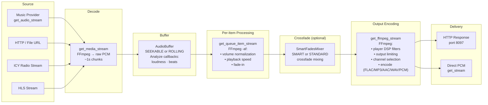

# 10 — Audio Streaming Pipeline

The streaming pipeline is the end-to-end audio path from music provider to player. Raw audio is decoded from the source, buffered as PCM, analyzed for loudness and beat patterns, processed through volume normalization and DSP filters, optionally crossfaded, encoded to the player's preferred output format, and served via HTTP or consumed directly as PCM. The pipeline is split across two main classes: `StreamsController` (HTTP server and endpoints) and `StreamsAudio` (all audio processing logic).

## Pipeline Overview



## Network Architecture

The streams controller runs a **dedicated HTTP-only webserver** on a separate port (default **8097**), independent of the main Music Assistant API server on port 8095. This is intentional:

- **No SSL/TLS** — many embedded audio players (Chromecast, DLNA receivers) have limited resources and struggle with TLS handshakes. Audio streaming is internal-network only.
- **No authentication** — players need direct stream access. Instead, stream URLs embed a **session ID** that the controller validates to reject stale or invalid requests.
- **Separate port** — isolates audio traffic from API traffic, allowing independent configuration.

The webserver is an `aiohttp` application managed by a `Webserver` helper class with dynamic route support.

## StreamsController

`StreamsController` (`controllers/streams/controller.py`) extends `CoreController` with `domain = "streams"`. It owns the HTTP server, the `StreamsAudio` sub-controller, and the [`AudioAnalysisController`](16-audio-analysis.md) sub-controller that fans PCM out to registered audio-analysis providers.

### Initialization

```python
def __init__(self, mass: MusicAssistant) -> None:
    super().__init__(mass)
    self._server = Webserver(self.logger, enable_dynamic_routes=True)
    self.register_dynamic_route = self._server.register_dynamic_route
    self.unregister_dynamic_route = self._server.unregister_dynamic_route
    self.audio = StreamsAudio(mass)
    self._audio_analysis = AudioAnalysisController(self)
```

`StreamsAudio` in turn instantiates a `SmartFadesMixer` (`self._smart_fades_mixer`) that reads persisted analysis to drive crossfade execution — the mixer is separate from the analysis algorithm (which now lives in the `smart_fades` audio-analysis provider). See [16-audio-analysis.md](16-audio-analysis.md#crossfade-execution-separate-from-the-analysis).

`setup()` calls `self.audio.setup()`, validates FFmpeg version (≥ 6), and starts the HTTP server with the configured bind IP and port.

### HTTP Endpoints

| Path Pattern | Handler | Purpose |
|-------------|---------|---------|
| `/single/{session_id}/{queue_id}/{queue_item_id}/{player_id}.{fmt}` | `serve_queue_item_stream` | Single track stream |
| `/flow/{session_id}/{queue_id}/{queue_item_id}/{player_id}.{fmt}` | `serve_queue_flow_stream` | Continuous flow stream |
| `/announcement/{player_id}.{fmt}` | `serve_announcement_stream` | Announcement audio |
| `/command/{queue_id}/{command}.mp3` | `serve_command_request` | Command sounds |
| `/pluginsource/{plugin_source}/{player_id}.{fmt}` | `serve_plugin_source_stream` | Plugin audio sources |

Dynamic routes (registered via `register_dynamic_route`) handle UGP streams (`/ugp/{player_id}.{codec}`) and other runtime-registered paths.

### Session ID Validation

The `/single/` handler validates the session ID from the URL against `queue.session_id`:

```python
session_id = request.match_info["session_id"]
if queue.session_id and session_id != queue.session_id:
    raise web.HTTPNotFound(reason=f"Unknown (or invalid) session: {session_id}")
```

The `/flow/` handler carries a session segment in the URL for shape consistency but does not enforce it.

### Stream Entry Points

Two paths exist for delivering audio:

1. **HTTP endpoints** (`serve_queue_item_stream`, `serve_queue_flow_stream`) — for players consuming HTTP streams (Chromecast, DLNA, Sonos). Responses include DLNA-compatible headers, optional ICY metadata, and configurable HTTP profiles (chunked, no content-length, forced content-length).

2. **Direct PCM** (`get_stream`) — for player providers that consume raw PCM directly (AirPlay, Sendspin). These providers call `get_stream()` to receive an async generator of PCM chunks without HTTP overhead.

### HTTP Profile Configuration

Per-player `CONF_HTTP_PROFILE` controls response behavior:

| Profile | Content-Length | Transfer | Use case |
|---------|---------------|----------|----------|
| Chunked | Not set | Chunked encoding | Most players |
| No content-length | Not set | Identity | Players that choke on chunked |
| Forced content-length | Calculated | Identity | Players that require length (some DLNA) |

## StreamsAudio

`StreamsAudio` (`controllers/streams/audio.py`) is the audio processing engine, accessible as `self.audio` on `StreamsController`. It handles stream acquisition, format selection, normalization, DSP, and crossfade management.

### `get_stream_details` — Resolving Audio Sources

Before a queue item can be streamed, the system must know where its audio comes from, what format it's in, and what processing is needed:

1. **Reuse check** — if the queue item already has valid `streamdetails` with an active buffer, reuse them.
2. **Provider walk** — iterate `provider_mappings` sorted by quality, calling `MusicProvider.get_stream_details(item_id)` on each until one succeeds. The current playback user's `provider_filter` restricts which providers are tried, evaluated in a two-phase loop (preferred/filtered providers first, then remaining providers as fallback).
3. **Radio resolution** — for radio streams, resolve playlist URLs (M3U, PLS), detect ICY vs in-band metadata vs HLS; HLS radio may attach a metadata update callback.
4. **Loudness lookup** — load stored EBU R128 loudness from the database (`mass.music.get_loudness`).
5. **Normalization mode** — determine `VolumeNormalizationMode` based on player and core config.
6. **DSP details** — attach per-player DSP configuration via `get_stream_dsp_details`.

### `get_media_stream` — Decoding to PCM

This method acquires raw PCM audio from the source:

| Source Type | Handling |
|-------------|----------|
| `CUSTOM` | Provider's `get_audio_stream()` async generator |
| `ICY` | `get_icy_radio_stream()` — raw stream with ICY metadata parsing |
| `IN_BAND` (OGG radio) | `get_chained_ogg_stream()` — stitched OGG pages via `ogg_handler.py` |
| `HLS` | `get_hls_substream()` — HLS segment fetching; radio adds `-stream_loop -1 -re` |
| `HTTP` / `FILE` | Direct path to FFmpeg |
| `ENCRYPTED_HTTP` | HTTP with `-decryption_key` for FFmpeg |
| Multi-file | `get_multi_file_stream()` — concat demux |

All sources are piped through **FFmpeg**, which decodes to raw PCM. Output chunks are ~1 second of audio (`calculate_content_length(pcm_format, 1)`). FFmpeg also detects and reports the actual codec after the first chunk, and can refresh track duration from byte count when decoding completes without seeking.

### `get_queue_item_stream` — Per-Item Processing

Streams a single queue item from the `AudioBuffer` with optional per-item filters:

1. Reads the `AudioBuffer` via `buffer.get_stream()`.
2. Applies FFmpeg `-af` filters based on normalization mode:
   - **DYNAMIC** → `loudnorm` filter (real-time analysis and leveling)
   - **MEASUREMENT_ONLY** → static `volume=XdB` from stored loudness vs target
   - **FIXED_GAIN** → constant dB from config
   - **FALLBACK_DYNAMIC** → measurement if available, otherwise falls back to dynamic
   - **FALLBACK_FIXED_GAIN** → measurement if available, otherwise fixed gain from config
3. Optional `atempo` for playback speed adjustment.
4. Optional `afade` for fade-in on resume.

**Buffer pre-warm trigger:** When the consumed position passes `duration - 60` seconds, the stream calls `_prepare_next_audio_buffer()` on the queue controller to start filling the next track's buffer (see [09-player-queues.md](09-player-queues.md)).

### `get_queue_item_stream_with_smartfade` — Crossfade Streaming

For single-item streams with crossfade enabled, this method manages the overlap between outgoing and incoming tracks:

1. Uses `_crossfade_data` from the previous track's tail (if any).
2. Buffers the last N seconds of the current track (45s for smart, configurable for standard, capped at half track duration).
3. At track end, calls `load_next_queue_item()` to get the next item.
4. Feeds both tails into `SmartFadesMixer.mix()`.
5. Splits the mixer output: first half is appended to the current response, second half is stored as `CrossfadeData` for the next request.

### `get_queue_flow_stream` — Continuous Flow

Flow mode produces a continuous PCM stream across all queue tracks. It is used by universal group players (see [06-grouping.md](06-grouping.md)) and players that don't support gapless.

- Infinite loop: calls `load_next_queue_item()` until the queue is empty.
- Sets `queue.flow_mode = True`.
- Maintains `flow_mode_stream_log` tracking which items have been played.
- With crossfade enabled: buffers the tail of each track, mixes overlap with `SmartFadesMixer`, yields the blended audio.
- If smart crossfade is enabled but buffer preset is MINIMAL, downgrades to standard crossfade (smart crossfade needs enough buffer to hold 45s of analysis data).

## AudioBuffer

`AudioBuffer` (`controllers/streams/audio_buffer.py`) stores decoded raw PCM audio in memory. It is the single source of truth for audio data — filters are applied only when reading via `get_stream()`.

### Buffer Modes

| Mode | Use Case | Behavior |
|------|----------|----------|
| **SEEKABLE** | Tracks (finite duration, `allow_seek=True`) | Deque of 1-second chunks with indexed access. Old chunks are evicted when max size is reached. |
| **ROLLING** | Radio (infinite, non-seekable) | Short FIFO (~15 seconds). Consumer pops chunks sequentially. |

### Buffer Size Presets

| Preset | Seconds | Auto-Selected When |
|--------|---------|-------------------|
| `MINIMAL` | 60 | System RAM < 4 GB |
| `BALANCED` | 300 | System RAM ≥ 4 GB |
| `MAXIMUM` | 1200 | System RAM ≥ 8 GB |

Radio streams always use `RADIO_BUFFER_SIZE` (15 seconds) regardless of preset.

### Buffer Lifecycle

1. **Creation** — `AudioBuffer.get_buffer()` is the static factory. It checks for an existing valid buffer on the `streamdetails`, reuses it when possible, or creates a new one.
2. **Filling** — `fill()` starts a background task that calls `get_media_stream()` and feeds PCM chunks via `_put()`.
3. **Analysis** — chunk callbacks (loudness, smart fades) observe data as it flows in; attached only when `seek_position_ms == 0`.
4. **Ready threshold** — the buffer waits for enough chunks before signaling ready: 10s if smart fades enabled, 5s if dynamic normalization, 2s otherwise (capped by max buffer size). Wait timeout is 15 seconds.
5. **Consumption** — `get_stream()` or `get_raw_stream()` read chunks with optional FFmpeg filter processing.
6. **Cleanup** — stale buffers are cleared by `_cleanup_stale_queue_buffers()`.

### Seek Behavior

| Scenario | Behavior |
|----------|----------|
| Forward seek ≤ 20s beyond buffered data | Wait for producer to fill (`SEEK_WAIT_THRESHOLD`) |
| Forward seek > 20s or large seek | Invalidate buffer, re-fetch from provider at seek position |
| Backward seek within buffer | Direct read from deque (SEEKABLE mode) |

For large seeks (> 60s), FFmpeg starts at the seek position directly (`-ss` flag), and chunk indices are aligned via `_discarded_chunks`.

### Audio Analysis Hand-off

Live PCM is forwarded to the [`AudioAnalysisController`](16-audio-analysis.md) via `start_analysis(session_id, streamdetails, audio_format)` at the start of `_load_item` and `_distribute_chunk(session_key, pcm)` for each chunk. The controller fans the data out to every registered audio-analysis provider (loudness, smart fades, etc.) — they are no longer chunk callbacks attached to the `AudioBuffer` itself. Sessions only spin up when `seek_position_ms == 0`, since analysis needs the full track. See [16-audio-analysis.md](16-audio-analysis.md) for the controller lifecycle, provider hooks, and background scan.

### Error Handling

Producer exceptions are stored in `_producer_error`. Consumers can drain remaining buffered data; the error surfaces when they read past the buffered end. Errors bubble up as `AudioError` through the streaming chain.

## Volume Normalization

Volume normalization ensures consistent perceived loudness across tracks from different sources.

### Modes

| Mode | Behavior | FFmpeg Filter |
|------|----------|---------------|
| **DISABLED** | No normalization | None |
| **DYNAMIC** | Real-time loudness analysis and leveling | `loudnorm=I=target:TP=-2.0:LRA=10.0:offset=0.0` |
| **MEASUREMENT_ONLY** | Static gain from stored loudness measurement | `volume=XdB` where X = target - measured |
| **FALLBACK_DYNAMIC** | Use measurement if available, otherwise dynamic | Depends on availability |
| **FALLBACK_FIXED_GAIN** | Use measurement if available, otherwise fixed gain from config | Depends on availability |
| **FIXED_GAIN** | Constant dB adjustment from config | `volume=XdB` from `CONF_VOLUME_NORMALIZATION_FIXED_GAIN_*` |

Mode selection (`get_normalization_mode` in `helpers/audio.py`) considers:
- Whether normalization is enabled per player (`CONF_VOLUME_NORMALIZATION`)
- Whether a target loudness is set on the stream
- Whether a stored loudness measurement exists
- Separate radio vs tracks preference in core config

### Loudness Analysis

Loudness measurement runs through the **builtin `loudness_analysis` audio-analysis provider** (EBU R128 via FFmpeg `ebur128`). Live playback and the nightly background scan share the same provider. Results are stored in `DB_TABLE_AUDIO_ANALYSIS` plus a denormalized fast-path in `DB_TABLE_LOUDNESS_MEASUREMENTS` (which also accepts loudness values supplied by file tags or ReplayGain — in which case runtime ebur128 is skipped). See [16-audio-analysis.md](16-audio-analysis.md#built-in-loudness-analysis) for the full provider model.

## Smart Fades System

The smart fades system splits into **analysis** and **execution**:

- **Analysis** is done by the optional [`smart_fades` audio-analysis provider](16-audio-analysis.md#optional-smart-fades-v2) (`providers/smart_fades/`) — Beat This! transformer + S-KEY on a streaming-friendly pipeline. Results (beats, downbeats, key, RMS energy, spectral centroid) land in `DB_TABLE_AUDIO_ANALYSIS`. This replaced the earlier per-`AudioBuffer` chunk-callback analyzer that ran `librosa.beat.beat_track` inline.
- **Execution** stays here in `controllers/streams/smart_fades/`. `SmartFadesMixer.mix(...)` reads the persisted analysis and picks a fade strategy; the strategy composes a list of PCM filters.

### Fades (`fades.py`)

Two crossfade strategies:

| Strategy | Behavior |
|----------|----------|
| **`SmartCrossFade`** | Beat-matched transitions. May add time-stretch, trim, frequency sweep (lowpass on outgoing, highpass on incoming), and crossfade filters. |
| **`StandardCrossFade`** | Fixed-duration overlap with configurable duration. Silence stripping on tail/head before crossfade. |

### Mixer (`mixer.py`)

`SmartFadesMixer.mix` orchestrates the crossfade:

| Crossfade Mode | Behavior |
|----------------|----------|
| **DISABLED** | Concatenate tracks (gapless) |
| **STANDARD_CROSSFADE** | Strip silence, apply `StandardCrossFade` |
| **SMART_CROSSFADE** | Load intro/outro analysis; if both exist and confidence > 0.3, apply `SmartCrossFade`; on failure, fall back to `StandardCrossFade` |

The `CONF_ALLOW_CROSSFADE_SAME_ALBUM` setting (default false) prevents crossfading consecutive tracks from the same album, preserving intended album flow. Crossfading can also be skipped when adjacent tracks have different sample rates, unless `CONF_ENTRY_CROSSFADE_DIFFERENT_SAMPLE_RATES` is enabled.

For flow streams targeting Chromecast-style clients, FFmpeg uses `-readrate 1` and `-readrate_initial_burst 6` to throttle output to real-time speed, preventing the player from buffering too far ahead.

## DSP Chain

Per-player DSP is applied in the final FFmpeg encoding stage via `get_player_filter_params`:

1. **Input/output gain** — `volume=` filter for DSP gain adjustments.
2. **Custom DSP filters** — per-player filter chain from `filter_to_ffmpeg_params`.
3. **Channel selection** — mono pan from `CONF_OUTPUT_CHANNELS`.
4. **Output limiter** — `alimiter` when limiter is enabled.

**Grouping interaction**: `is_grouping_preventing_dsp` (in `helpers/audio.py`) checks whether the player is in a multi-device group that doesn't support `PlayerFeature.MULTI_DEVICE_DSP`. If so, DSP is disabled entirely (`DSPState.DISABLED_BY_UNSUPPORTED_GROUP`) because per-device DSP filters would produce different audio on each group member, breaking synchronization.

`get_player_dsp_details` provides DSP state for the UI, including gains, active filters, limiter status, and output format.

## Output Format Selection

### `get_output_format`

Determines the final encoding based on the URL's format extension and the player's capabilities:

- Intersects player-supported sample rates and bit depths.
- Lossy formats (MP3, AAC) → cap at 16-bit, 48 kHz.
- Special case: `fmt == "pcm"` → bit depth from player's max supported.

### `select_pcm_format`

Picks the internal PCM format for the buffer-to-filter stage:

- Sample rate = max supported rate ≤ source rate.
- If smart fades, normalization, or DSP are active → internal F32 (float 32-bit for processing headroom).
- Smart fades force stereo (mixing requires consistent channel count).
- Otherwise, native bit depth from source.

### `select_flow_format`

For flow mode, picks the highest internal rate from 192000 down to 44100 that the player supports, using `INTERNAL_PCM_FORMAT` content type and bit depth, always stereo.

## Stream Types Comparison

| Type | AudioBuffer | Mode | Description |
|------|-------------|------|-------------|
| Queue tracks | Yes | SEEKABLE | Full buffering with seek support |
| Radio streams | Yes | ROLLING | Short 15s rolling buffer |
| Announcements | No | — | Short one-off audio (TTS), streamed directly |
| Plugin sources | No | — | Real-time audio, streamed directly (see [11-plugin-system.md](11-plugin-system.md)) |

## UGP Stream Integration

Universal group players serve the same audio source to multiple members via individual HTTP streams. Each UGP registers dynamic routes (`/ugp/{player_id}.{codec}`) through `register_dynamic_route`. The `UGPStream` class manages a single flow-mode audio source and fans it out to each member's individual HTTP request. See [06-grouping.md](06-grouping.md) for the full UGP architecture.

## OGG Stream Stitching

For radio streams using in-band OGG metadata (Opus/Vorbis), `ogg_handler.py` handles chained OGG stitching:

- Parses OGG pages and rewrites CRC/serial/sequence/granule numbers.
- First chain passes beginning-of-stream and headers normally.
- Subsequent chains skip new BOS/header pages and rewrite data pages to maintain a single logical stream for FFmpeg.
- Extracts metadata from OpusTags/Vorbis comment pages.
- `get_chained_ogg_stream` feeds `get_reconnecting_radio_stream`, handling resync on stream corruption.

## FFmpeg Process Management

`FFMpeg` (`helpers/ffmpeg.py`) wraps FFmpeg subprocess execution:

- **Stdin feeding** — for async generator inputs, `_feed_stdin` pumps PCM chunks to FFmpeg's stdin.
- **Output reading** — `iter_chunked` for fixed-size reads (streaming), `iter_any` for variable reads.
- **Error handling** — non-zero exit codes surface as `AudioError` with log tail context.
- **HTTP inputs** — automatic reconnect arguments for HTTP sources.
- **Filter chain** — `-af` parameters joined with proper `aresample`/dither rules; `soxr` resampler avoided when `loudnorm` filter is present (compatibility).
- **Version check** — `check_ffmpeg_version` ensures FFmpeg ≥ 6 at startup.

## Key Files

| File | Role |
|------|------|
| [`controllers/streams/controller.py`](../../music_assistant/controllers/streams/controller.py) | StreamsController — HTTP server and streaming endpoints |
| [`controllers/streams/audio.py`](../../music_assistant/controllers/streams/audio.py) | StreamsAudio — audio processing engine |
| [`controllers/streams/audio_buffer.py`](../../music_assistant/controllers/streams/audio_buffer.py) | AudioBuffer — in-memory PCM buffering |
| [`controllers/streams/constants.py`](../../music_assistant/controllers/streams/constants.py) | Buffer sizes, config keys, default port |
| [`controllers/streams/smart_fades/fades.py`](../../music_assistant/controllers/streams/smart_fades/fades.py) | `SmartFade` ABC plus `SmartCrossFade` / `StandardCrossFade` implementations |
| [`controllers/streams/smart_fades/filters.py`](../../music_assistant/controllers/streams/smart_fades/filters.py) | Composable PCM filters used by `SmartCrossFade` |
| [`controllers/streams/smart_fades/helpers.py`](../../music_assistant/controllers/streams/smart_fades/helpers.py) | Tempo steps, downbeat extrapolation, synthetic timestamps |
| [`controllers/streams/smart_fades/mixer.py`](../../music_assistant/controllers/streams/smart_fades/mixer.py) | `SmartFadesMixer` — reads persisted analysis, drives fade strategy |
| [`controllers/streams/ogg_handler.py`](../../music_assistant/controllers/streams/ogg_handler.py) | Chained OGG stitching for radio |
| [`helpers/audio.py`](../../music_assistant/helpers/audio.py) | Audio utilities, normalization mode selection |
| [`helpers/ffmpeg.py`](../../music_assistant/helpers/ffmpeg.py) | FFmpeg process management |
| [`controllers/streams/README.md`](../../music_assistant/controllers/streams/README.md) | Existing detailed documentation (verified against code) |
