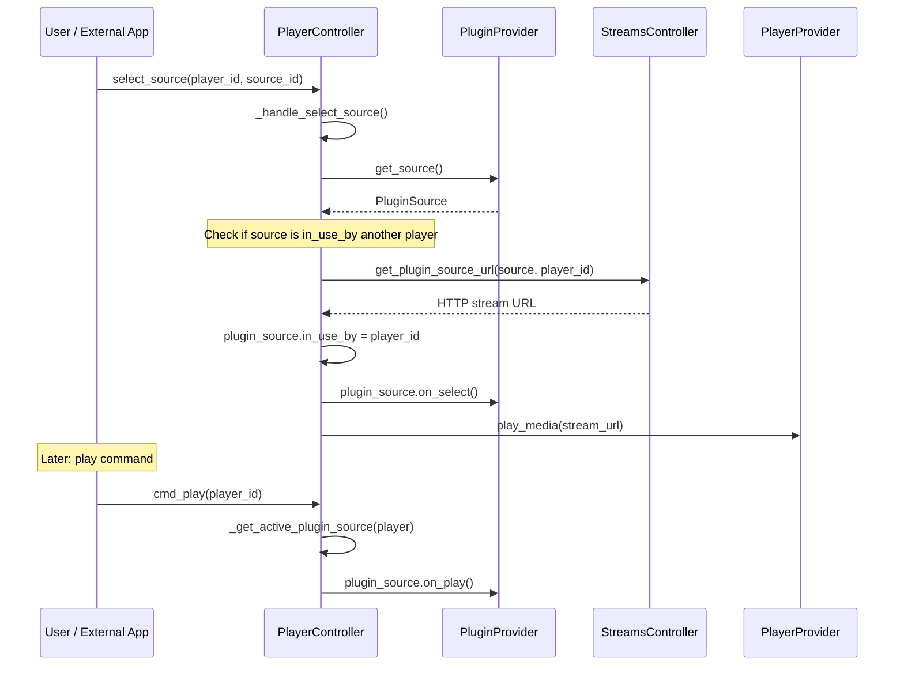
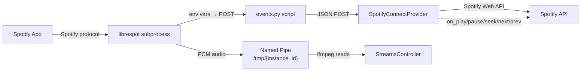

# 11 — Plugin System

The plugin system bridges external audio sources and services into the Music Assistant player model. A **plugin provider** can inject audio from external apps (Spotify, AirPlay, AriaCast, VBAN), report plays to scrobbling services (Last.fm, ListenBrainz, Subsonic), or provide guest access features (Party). The key abstraction is `PluginSource` — a `PlayerSource` subclass that carries both stream configuration and playback-control callbacks, allowing MA to route commands back to the originating external app.

---

## Plugin Taxonomy

Plugins fall into three categories based on what they provide:

| Category | Examples | Has `AUDIO_SOURCE` Feature | Provides Audio | Listens to Events |
|---|---|---|---|---|
| **Receiver** (audio source) | Spotify Connect, AirPlay Receiver, AriaCast Receiver, VBAN Receiver | Yes | Yes — raw PCM via pipe or async generator | Indirectly (via subprocess/protocol events) |
| **Scrobbler** (event listener) | Last.fm, ListenBrainz, Subsonic | No | No | Yes — subscribes to `MEDIA_ITEM_PLAYED` |
| **Feature** (UI/access) | Party | No | No | No — registers API commands |

Only receiver plugins participate in the `PluginSource`/player integration described below. Scrobblers and feature plugins use the standard provider base class with no audio-specific behavior.

---

## `PluginSource` — The Core Abstraction

`PluginSource` (in `models/plugin.py`) extends `PlayerSource` from the shared models package. It is an **internal-only** model — every field added beyond the inherited ones uses `serialize="omit"` to prevent leaking unpicklable callbacks through the API.

### Inherited Fields (from `PlayerSource`)

| Field | Type | Purpose |
|---|---|---|
| `id` | `str` | Unique identifier (typically the provider's `instance_id`) |
| `name` | `str` | Display name shown in source selection UI |
| `passive` | `bool` | If `True`, source is hidden from the selectable list — activates only when the plugin itself initiates |
| `can_play_pause` | `bool` | Whether play/pause commands are supported |
| `can_seek` | `bool` | Whether seeking is supported |
| `can_next_previous` | `bool` | Whether next/previous commands are supported |

### Added Fields

| Field | Type | Default | Purpose |
|---|---|---|---|
| `audio_format` | `AudioFormat` | PCM S16LE 44.1kHz stereo | PCM format the source provides |
| `metadata` | `StreamMetadata \| None` | `None` | Current track info (title, artist, album, image URL, duration, elapsed time) |
| `stream_type` | `StreamType \| None` | `StreamType.CUSTOM` | How audio is delivered: `CUSTOM` (async generator) or pipe-based |
| `path` | `str \| None` | `None` | Named pipe path when `stream_type` is not `CUSTOM` |
| `in_use_by` | `str \| None` | `None` | Player ID currently consuming this source |

### Callback Fields

All callbacks are `Callable[..., Awaitable[None]] | None`, defaulting to `None`. The player controller invokes these when playback commands target a player whose active source is this plugin:

| Callback | Signature | Invoked by |
|---|---|---|
| `on_play` | `Awaitable[None]` | `_handle_cmd_play` |
| `on_pause` | `Awaitable[None]` | `_handle_cmd_pause` |
| `on_next` | `Awaitable[None]` | `cmd_next_track` |
| `on_previous` | `Awaitable[None]` | `cmd_previous_track` |
| `on_seek` | `(int) -> Awaitable[None]` | `cmd_seek` (position in seconds) |
| `on_volume` | `(int) -> Awaitable[None]` | Inline at the end of `set_group_volume` (with the commanded `volume_level`) and at the end of `_handle_cmd_volume_set` for the player that owns the source (`in_use_by == player.player_id`). See [07-volume.md](07-volume.md#plugin-volume-callbacks). |
| `on_select` | `Awaitable[None]` | `_handle_select_plugin_source` |

### `as_player_source()`

Returns a plain `PlayerSource` copy with only the serializable fields (`id`, `name`, `passive`, `can_play_pause`, `can_seek`, `can_next_previous`). This exists because `PluginSource` contains unpicklable callables that would break `deepcopy` during player state serialization — the `Player.__final_source_list` property calls `as_player_source()` on every plugin source before including it in the source list.

---

## `PluginProvider` Base Class

`PluginProvider` (in `models/plugin.py`) extends `Provider` and defines three methods:

```python
def get_source(self) -> PluginSource:
    """Return the plugin's audio source details."""
    raise NotImplementedError

async def get_audio_stream(self, player_id: str) -> AsyncGenerator[bytes, None]:
    """Yield raw audio bytes for CUSTOM stream type."""
    raise NotImplementedError

async def resolve_image(self, path: str) -> str | bytes:
    """Resolve an image path to bytes or a URL."""
    return path
```

`get_source()` is called only when `ProviderFeature.AUDIO_SOURCE` is declared. `get_audio_stream()` is called only when `stream_type == StreamType.CUSTOM`. Providers using named pipes (Spotify Connect, AirPlay) never implement `get_audio_stream()` — the streams controller reads the pipe directly via ffmpeg.

---

## Plugin Registration and Source Resolution

The player controller (`controllers/players/controller.py`) manages plugin source discovery and activation.

### Registration

Plugin sources are not explicitly "registered" — they are discovered dynamically. The controller queries all loaded plugin providers on demand:

- **`get_plugin_sources()`** — API: `players/plugin_sources`. Iterates all providers of `ProviderType.PLUGIN` that have `ProviderFeature.AUDIO_SOURCE`, calls `get_source()` on each, returns the list.
- **`get_plugin_source(source_id)`** — API: `players/plugin_source`. Finds a specific source by ID among all plugin providers.

### Active Source Resolution

**`_get_active_plugin_source(player)`** determines which plugin source (if any) is active for a given player. It checks two conditions:
1. Any plugin source has `in_use_by == player.player_id`
2. `player.state.active_source == plugin_source.id`

If either matches, that `PluginSource` is returned. This method is called by every command handler that needs to route playback commands to plugin callbacks.

### Source List Assembly

The `Player.__final_source_list` property (in `models/player.py`) builds the complete source list a user sees:
1. Start with the player's native `source_list` (provider-reported sources)
2. Always add "Music Assistant Queue" if not already present
3. Append all plugin sources (converted via `as_player_source()`) — no passive filter is applied

**Exception**: `PlayerType.PROTOCOL` players return early from `__final_source_list` with only their native source list — they never receive the MA Queue entry or plugin sources. Plugin audio can still be routed through control logic, but protocol players won't offer plugin sources in their UI.

### Active Source Detection

The `Player.__final_active_source` property resolves the active source in priority order: (1) group/sync parent's active source, (2) protocol parent's active source, (3) plugin source with `in_use_by == player.player_id`, (4) the player's own active MA source or provider-reported source. The plugin check at step 3 means that if the player is synced, grouped, or a protocol child, the plugin override is never reached — the parent's source takes precedence.

---

## How Plugins Integrate with Players

The following diagram shows the flow when a plugin source is selected on a player:



### Source Selection (`_handle_select_plugin_source`)

When a user selects a plugin source on a player:

1. If the source is already `in_use_by` another player, that player is stopped first (single-player exclusivity)
2. The streams controller generates a URL for the plugin source audio
3. `plugin_source.in_use_by` is set to the target player ID
4. `plugin_source.on_select()` callback fires (if defined) — note that `in_use_by` is already set when `on_select` runs
5. `play_media()` is called with a `PlayerMedia` containing `media_type=MediaType.PLUGIN_SOURCE`

### Command Routing to Plugin Callbacks

When a playback command targets a player with an active plugin source, the player controller routes it to the plugin's callback instead of the normal queue/provider path:

- **`_handle_cmd_play`**: Checks `_get_active_plugin_source(player)` — if the source has `can_play_pause` and `on_play`, calls the callback and returns
- **`_handle_cmd_pause`**: Same pattern with `on_pause`
- **`cmd_seek`**: Checks for active plugin source with `on_seek`, passes position in seconds
- **`cmd_next_track`**: Checks for `on_next`
- **`cmd_previous_track`**: Checks for `on_previous`

### Current Media from Plugin

The `Player.__final_current_media` property detects when the active source is a plugin with metadata and constructs a `PlayerMedia` from `source.metadata` (title, artist, album, image URL, duration, elapsed time).

---

## `in_use_by` Semantics

The `in_use_by` field tracks which player is currently consuming a plugin source. Important constraints:

- **Single player ID**: `in_use_by` holds the ID of whichever player selected the source — this can be a physical player or a group player. Only one ID is stored at a time.
- **Single-player exclusivity**: A plugin source can only be used by one player at a time. Selecting the source on a different player stops the current consumer first.
- **Group volume propagation**: When a group player selects a plugin source, `in_use_by` holds the group player's ID. Group-level volume changes (`set_group_volume`) fire `on_volume(volume_level)` on the plugin once at the group level. Individual member volume changes within the group **do not** propagate to the plugin — only the directly-owning player triggers the callback. This avoids feedback loops with bidirectional plugins like Spotify Connect at the cost of not surfacing per-member adjustments to the external service. See [07-volume.md](07-volume.md#plugin-volume-callbacks).

---

## Audio Delivery: Stream Types

Receiver plugins deliver audio via one of two mechanisms:

| Stream Type | How It Works | Used By |
|---|---|---|
| `StreamType.NAMED_PIPE` | Plugin creates a named pipe (e.g., `/tmp/{instance_id}`); the external process writes raw PCM to it; the streams controller reads via ffmpeg | Spotify Connect, AirPlay Receiver |
| `StreamType.CUSTOM` | Plugin implements `get_audio_stream()` as an async generator yielding raw bytes; the streams controller consumes the generator directly | AriaCast Receiver, VBAN Receiver |

Named pipes are simpler — the plugin just manages the subprocess and pipe lifecycle. Custom streams give the plugin more control over buffering and backpressure but require implementing the async generator.

The streams controller serves plugin source audio at `/pluginsource/{source_id}/{player_id}.{fmt}` on the streams HTTP server (port 8097), where `{fmt}` is the audio format suffix (e.g., `.wav`, `.flac`). See [10-streaming-pipeline.md](10-streaming-pipeline.md) for the full pipeline.

---

## Receiver Plugins in Detail

### Spotify Connect — The Exemplar

`providers/spotify_connect/` is the most feature-rich receiver plugin, demonstrating the full callback integration.

**Architecture**: One `librespot` subprocess per provider instance. Librespot is a reverse-engineered implementation of the Spotify audio protocol. It writes raw PCM (S16LE 44.1kHz stereo) to a named pipe and emits events to a callback script.



**Event flow**: Librespot invokes `events.py` (a standalone Python script) via `--onevent`. The script reads event data from environment variables set by librespot, constructs a JSON payload, and POSTs it to the provider's custom webservice endpoint (`/{instance_id}`). Key events:

| Event | Action |
|---|---|
| `session_connected` | Store username, find matching Spotify music provider for Web API |
| `session_disconnected` | Clear state, disable Web API control |
| `playing` / `sink` | Determine target player, call `select_source()`, set `in_use_by` |
| `paused` | Release player UI state (clear `in_use_by`) but keep `_active_player_id` |
| `track_changed` | Parse metadata (title, artist, album, artwork, duration) |
| `volume_changed` | Convert from 0-65535 to 0-100, apply to player |
| `position_ms` | Update `elapsed_time` on `StreamMetadata` |

**Credential flow**: The user selects the MA-named device in the Spotify app. Librespot authenticates with Spotify servers and caches credentials. The provider parses the authenticated username from librespot's stderr output and matches it to a configured Spotify music provider instance for Web API access.

**Dynamic capabilities**: Playback controls (`can_play_pause`, `can_seek`, `can_next_previous`) start as `False`. Once a matching Spotify music provider is found (providing Web API access), the provider enables all capabilities and registers callbacks (`on_play` → `PUT me/player/play`, `on_pause` → `PUT me/player/pause`, etc.).

**Volume anti-ping-pong**: The inbound `volume_changed` handler skips events within 3 seconds of session connect to avoid initial feedback. Outside that window it converts the 0–65535 Spotify scale to 0–100, records the value in `_last_volume_sent_to_spotify`, and forwards to `cmd_volume_set(self._source_details.in_use_by, volume)`. The outbound `_on_volume` callback short-circuits when the requested volume already equals `_last_volume_sent_to_spotify`, so the echo from Spotify's confirmation does not trigger a redundant Web API call back. See [07-volume.md](07-volume.md#plugin-volume-callbacks) for the inline plugin-callback model.

**Player targeting**: Follows a priority chain: currently active player → auto-select (prefer playing, then first available) → configured default.

### AirPlay Receiver

Uses `shairport-sync` binary. Similar architecture to Spotify Connect but with two named pipes (audio + metadata) instead of a webservice. No Web API integration — playback controls are not available (`can_play_pause = False`). Volume comes through the metadata pipe converted from AirPlay's 0-100 range.

### AriaCast Receiver

Uses a Go binary (`ariacast`) with `--stdout`. Unlike the pipe-based plugins, AriaCast implements `StreamType.CUSTOM` with an async generator. Audio is 48kHz (not 44.1kHz). Metadata arrives via WebSocket (`ws://127.0.0.1:12889/metadata`), and playback control uses HTTP POST to `http://127.0.0.1:12889/api/command`. Has full playback controls enabled by default.

Pre-buffering: Uses a ring buffer (75 frames × 20ms = 1.5s) and waits for 60% fill before starting playback.

### VBAN Receiver

Receives audio over UDP using the VBAN protocol (via the `aiovban` library). Implements `StreamType.CUSTOM`. Highly configurable (PCM format, sample rate, channels, bind IP, port, queue strategy). No playback controls, no metadata. The simplest receiver — always visible in the source list (`passive = False`).

---

## Scrobbler Plugins

Scrobblers are event-driven plugins with no audio source. They share a common `ScrobblerHelper` base class (from `helpers/scrobbler.py`) that handles event subscription and reporting logic.

All scrobblers subscribe to `EventType.MEDIA_ITEM_PLAYED` in `loaded_in_mass()` and implement two methods:
- `_update_now_playing(report)` — called when playback starts
- `_scrobble(report)` — called when playback completes the scrobble threshold

| Scrobbler | Library | Auth Method | Notes |
|---|---|---|---|
| **Last.fm** | `pylast` (blocking, wrapped in `asyncio.to_thread`) | Web auth flow with callback URL, session key stored | Also supports Libre.fm |
| **ListenBrainz** | `liblistenbrainz` (blocking, wrapped in thread) | User token (simple) | Supports self-hosted instances, sends MusicBrainz IDs |
| **Subsonic** | OpenSubsonic provider's connection | Reuses existing provider auth | Scrobbles back to the source server, supports audiobooks and podcasts |

---

## Party Plugin

The Party plugin (`providers/party/`) is neither a receiver nor a scrobbler — it provides guest access functionality with no audio involvement.

**Core features**:
- Guest user creation (`UserRole.GUEST` named `party_guest`)
- Join code generation (8-hour expiry) via the auth controller
- URL generation (remote via `app.music-assistant.io` or local)
- Queue management with priority sections and boosting

**API commands**: `party/url`, `party/player`, `party/config`, `party/add_to_queue`, `party/boost_queue_item`, `party/skip`.

**Queue management**: Guest-added tracks go into a priority section after the current track. Boosted tracks move to the end of the boosted sub-section. A `_queue_lock` serializes all queue mutations. The `_find_section_end` helper scans forward to find where consecutive items with a given attribute end.

---

## Key Files

| File | Purpose |
|---|---|
| [`music_assistant/models/plugin.py`](../../music_assistant/models/plugin.py) | `PluginSource`, `PluginProvider` base class |
| [`music_assistant/controllers/players/controller.py`](../../music_assistant/controllers/players/controller.py) | `get_plugin_sources`, `_get_active_plugin_source`, `_handle_select_plugin_source`, callback routing |
| [`music_assistant/models/player.py`](../../music_assistant/models/player.py) | `__final_source_list`, `__final_active_source`, `__final_current_media` — plugin integration in player state |
| [`music_assistant/providers/spotify_connect/`](../../music_assistant/providers/spotify_connect/) | Exemplar receiver: librespot, events, Web API control |
| [`music_assistant/providers/airplay_receiver/`](../../music_assistant/providers/airplay_receiver/) | AirPlay receiver via shairport-sync |
| [`music_assistant/providers/ariacast_receiver/`](../../music_assistant/providers/ariacast_receiver/) | AriaCast receiver with custom async stream |
| [`music_assistant/providers/vban_receiver/`](../../music_assistant/providers/vban_receiver/) | VBAN UDP receiver |
| [`music_assistant/providers/lastfm_scrobble/`](../../music_assistant/providers/lastfm_scrobble/) | Last.fm / Libre.fm scrobbler |
| [`music_assistant/providers/listenbrainz_scrobble/`](../../music_assistant/providers/listenbrainz_scrobble/) | ListenBrainz scrobbler |
| [`music_assistant/providers/subsonic_scrobble/`](../../music_assistant/providers/subsonic_scrobble/) | Subsonic scrobbler |
| [`music_assistant/providers/party/`](../../music_assistant/providers/party/) | Guest access and queue management |
| [`music_assistant/helpers/scrobbler.py`](../../music_assistant/helpers/scrobbler.py) | Shared `ScrobblerHelper` base class |
