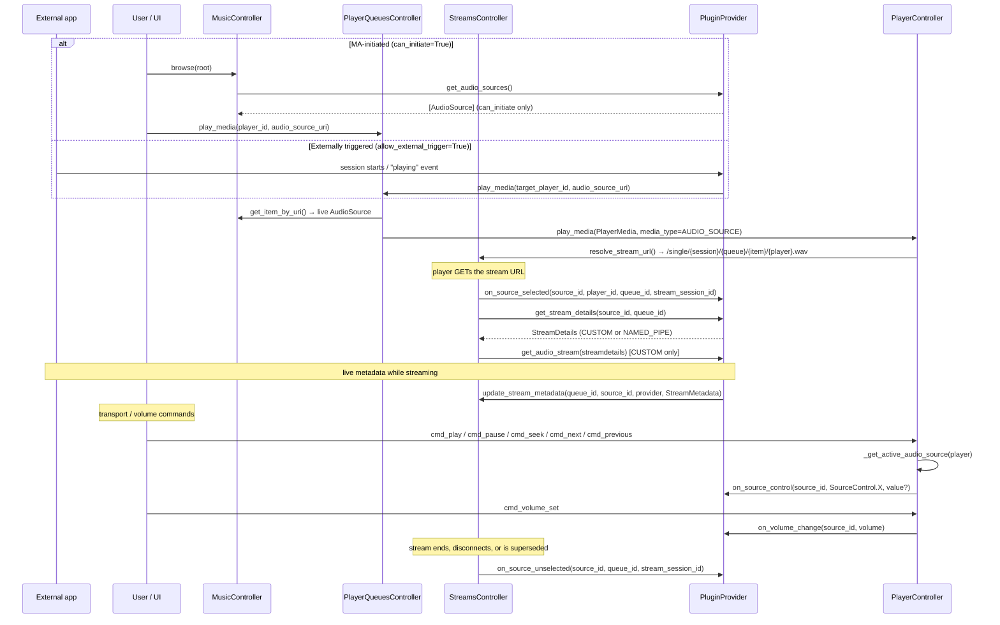
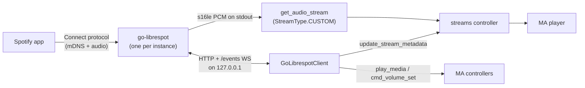

# 11 — Plugin System

Plugin providers are the "everything else" provider type: they bridge external audio sources and services into Music Assistant without being a music library, a speaker, or a metadata lookup. A plugin can inject live audio from an external app (Spotify Connect, AirPlay, AriaCast, VBAN, Yandex Music), report plays to a scrobbling service, expose MA players onto a foreign control surface (Plex, Yandex Alice), host a guest experience (Party, Music Quiz), generate playlists and recommendations, or add a whole server surface such as an MCP endpoint.

The abstraction at the centre of the audio half of the system is the **`AudioSource` media item**. Before #3938 a receiver plugin returned a `PluginSource` — a `PlayerSource` subclass carrying stream configuration *and* a bag of playback-control callbacks — and the player controller special-cased it throughout the source list, active-source resolution, and command routing. That model is gone. An `AudioSource` is now an ordinary `MediaItem` (`MediaType.AUDIO_SOURCE`, defined in `music_assistant_models`) that is browsed, enqueued, and streamed through the same paths as a radio station. Control travels back to the plugin through provider-level hooks on `PluginProvider` rather than per-source callbacks.

| Old model (pre-#3938) | Current model |
|---|---|
| `get_source() -> PluginSource` | `get_audio_sources() -> list[AudioSource]` |
| Callback fields on the source: `on_play`, `on_pause`, `on_next`, `on_previous`, `on_seek`, `on_volume`, `on_select` | `on_source_control(source_id, action, value=None)` for PLAY / PAUSE / NEXT / PREVIOUS / SEEK, plus a separate `on_volume_change(source_id, volume)` |
| Ownership tracked centrally in `PluginSource.in_use_by` | Ownership is queue-scoped and provider-held, claimed in `on_source_selected(...)` and released in `on_source_unselected(...)` |
| `get_audio_stream(player_id)` | `get_stream_details(source_id, queue_id)` then `get_audio_stream(streamdetails, seek_position=0)` |
| Live metadata on `PluginSource.metadata` | `StreamDetails.stream_metadata`, pushed via `mass.streams.update_stream_metadata(...)` |
| Selected with `select_source(plugin_instance_id)` | Played with `player_queues.play_media(audio_source_uri)`; the old call survives as a compatibility shim |
| `get_tts_message()`, `ai_query()` | **unchanged** — still optional hooks gated by `ProviderFeature.TTS` / `AI_QUERY` |

The `PluginSource`, `get_plugin_sources()`, `get_plugin_source()`, and `_handle_select_plugin_source()` symbols no longer exist anywhere in `music_assistant/`, and the `players/plugin_sources` / `players/plugin_source` API commands are gone with them.

---

## Plugin Taxonomy

There are 20 production plugin providers (`"type": "plugin"` in `manifest.json`), plus `_demo_plugin_provider` as an annotated template. Only the first category participates in the `AudioSource` machinery; the rest use the plain `Provider` surface plus whatever API commands, event subscriptions, or HTTP routes they register.

| Category | Plugins | `AUDIO_SOURCE` | What it does |
|---|---|---|---|
| **Receiver** (live audio source) | Spotify Connect, AirPlay Receiver, AriaCast Receiver, VBAN Receiver, Yandex Music Connect (Ynison) | Yes | Exposes one or more `AudioSource` items; audio flows *into* MA from an external app or device |
| **Scrobbler** | Last.fm, ListenBrainz, Subsonic | No | Subscribes to `EventType.MEDIA_ITEM_PLAYED` and reports plays outward |
| **External control bridge** | Plex Connect, Yandex Smart Home | No | Advertises MA players on a foreign protocol and translates inbound commands into `PlayerController` calls |
| **Home Assistant bridge** | Home Assistant (`hass`) | No | Two-way HA integration; also the only in-tree backend for `ProviderFeature.TTS` and `AI_QUERY` |
| **Guest and social experience** | Party, Music Quiz | No | Guest access, join codes, shared playback sessions, guest-scoped queue mutation |
| **Library and discovery** | Radio Playlists, Smart Playlists, Sonic Similarity, AI Radio | No | Implements *music* features (`BROWSE`, `SEARCH`, `RECOMMENDATIONS`, `SIMILAR_TRACKS`, playlist resolution) from a plugin |
| **Server extension** | MCP Server (`fastmcp_server`), Hue Lights Sync, Profiler | No | Mounts a new server surface, virtual players, or diagnostics onto the running instance |

Three easy misclassifications, all of which are **not** plugins: `teddycloud` is a music provider, `msx_bridge` and `snapcast` are player providers. The `dashie_kiosk` provider referenced by older revisions of these docs was deleted upstream (#4192) and was a player provider besides.

`plex_connect` is a bridge, not a receiver: it declares no `ProviderFeature`s at all and never touches audio. It makes an MA player appear as a controllable device in Plexamp and the Plex web player, then drives that player from Plex's remote-control and timeline protocols.

---

## `AudioSource` — the core abstraction

`AudioSource` lives in `music_assistant_models.media_items` (not in MA core) and subclasses `MediaItem`, so it inherits the whole media-item surface: `item_id`, `provider`, `name`, `provider_mappings`, `metadata`, and a computed `uri`. Its docstring describes it as behaving like a live media item similar to `Radio` — enqueued as a single queue item, streamed continuously, with metadata pushed by the owning plugin.

The URI is the standard media-item form, which is what makes the source addressable by browse, `get_item_by_uri`, and `play_media`:

```
spotify_connect--a1b2c3://audio_source/main
```

Every in-tree receiver uses the literal `item_id` `"main"` for its single source (`AUDIO_SOURCE_ID = "main"`), so the instance id is what distinguishes two receivers of the same kind. The contract permits several sources per provider — the base-class docstring calls out a paired hardware device whose favorites come and go — and `get_audio_sources()` is re-called rather than cached, so the set may change over the provider's lifetime.

### Fields specific to `AudioSource`

| Field | Default | Purpose |
|---|---|---|
| `media_type` | `MediaType.AUDIO_SOURCE` | Fixed; this is the discriminator every core path branches on |
| `duration` | `None` | A live source has no fixed length; the field exists only for `QueueItem` compatibility |
| `can_play_pause` | `False` | Whether the UI shows play/pause and the controller proxies PLAY/PAUSE to `on_source_control` |
| `can_seek` | `False` | Same, for SEEK |
| `can_next_previous` | `False` | Same, for NEXT/PREVIOUS |
| `exclusive` | `True` | Only one concurrent consumer. MA fans the single stream out through the sync-group machinery when several players target it. `False` means the plugin is responsible for serving independent per-consumer streams |
| `allow_external_trigger` | `False` | The plugin may start playback itself (the Spotify app picking MA as its device) |
| `can_initiate` | `False` | MA may start this source on demand from the UI. `False` means the source is reachable only via an external trigger, and the browse listings filter it out |

The old `PlayerSource.passive` flag split into the last two. `passive = False` meant "show it in the selectable source list"; the replacement is finer-grained, because "the user can start this" (`can_initiate`) and "the external app can start this" (`allow_external_trigger`) are genuinely independent, and most receivers are `can_initiate=False` / `allow_external_trigger=True`.

`can_initiate=False` is not a soft hint. The browse tree filters on it, and the owning plugin's `get_stream_details` is expected to raise `AudioError` when it cannot actually acquire the upstream producer — which is exactly what Spotify Connect, AirPlay Receiver, and AriaCast all do when no external session is connected.

### The capability flags are the routing gate

`can_play_pause` / `can_seek` / `can_next_previous` are not just UI hints: the player controller checks them before proxying, so a command against a source that declares `can_play_pause=False` is silently not forwarded. Every in-tree receiver except Yandex Ynison sets them statically — Spotify Connect enables all three, AirPlay Receiver and VBAN none, AriaCast play/pause and next/previous but not seek. Yandex Ynison rebuilds its `AudioSource` with the flags derived from whether its companion `yandex_music` provider is loaded.

---

## `PluginProvider` base class

`PluginProvider` (`music_assistant/models/plugin.py`) extends `Provider`. Every method is optional, and the base class uses a consistent pattern for feature-gated methods: raise `NotImplementedError` when the matching `ProviderFeature` is declared but the subclass did not override, otherwise return an empty result. That means a plugin can declare `SEARCH` and forget to implement it and get a loud failure, while a plugin that never declares it gets a harmless empty `SearchResults`.

### AudioSource surface

| Method | Gate | Notes |
|---|---|---|
| `get_audio_sources() -> list[AudioSource]` | `AUDIO_SOURCE` | Called on demand, never cached. Return `[]` when the plugin currently has nothing to offer (hardware offline) |
| `get_stream_details(source_id, queue_id) -> StreamDetails` | `AUDIO_SOURCE` | **MUST be side-effect-free** — see below |
| `get_audio_stream(streamdetails, seek_position=0)` | called when `stream_type == StreamType.CUSTOM` | Async generator of raw PCM in the format declared by `streamdetails.audio_format`. `seek_position` is ignored for live sources |
| `on_source_control(source_id, action, value=None)` | `AUDIO_SOURCE` | Transport commands. `action` is a `SourceControl` (`PLAY`, `PAUSE`, `NEXT`, `PREVIOUS`, `SEEK`, `UNKNOWN`); `value` carries the seek position in seconds |
| `on_source_selected(source_id, player_id, queue_id, stream_session_id)` | `AUDIO_SOURCE` | Non-abstract, no-op by default. Where exclusive sources claim ownership |
| `on_source_unselected(source_id, queue_id, stream_session_id)` | `AUDIO_SOURCE` | Non-abstract, no-op by default. Where they release it |
| `on_volume_change(source_id, volume)` | optional | Push MA's new volume (0–100) upstream. Only Spotify Connect implements it in-tree |

`SourceControl` has no `VOLUME` member — the `on_source_control` docstring mentions one, but volume genuinely travels on its own hook. `on_volume_change` exists separately because the routing conditions differ: transport commands follow the active queue item, while volume is gated on *direct queue ownership* to avoid a group firing one callback per member. See [07-volume.md](07-volume.md#audiosource-volume-callbacks).

**Why `get_stream_details` must be side-effect-free.** It is called from two places: the real stream request, and queue preload (`_load_item`, which drives the generator to fill an initial buffer). If a plugin claimed its exclusive lock here, a preload would reserve the source and then block a genuine cross-queue handoff at the actual stream request. Ownership therefore belongs in `on_source_selected`, which fires only on the real request and is always paired with `on_source_unselected` in a `finally`.

### Music features

Since #3811 (and #3978 for search, #4487 for the recommendations split) a `PluginProvider` can implement the music-provider surface, which is how the library-and-discovery plugins work without being music providers:

| Method | Gate |
|---|---|
| `browse(path)` | `BROWSE` |
| `search(search_query, media_types, limit=5)` | `SEARCH` |
| `get_similar_tracks(track, limit=25)` | `SIMILAR_TRACKS` |
| `get_recommendations()` | `RECOMMENDATIONS` — must be fast: static/cached row descriptors only, no backend calls |
| `get_recommendation_items(item_id)` | `RECOMMENDATIONS` — the live fetch for a single row |
| `get_playlist(prov_playlist_id)` / `get_playlist_tracks(prov_playlist_id, page=0)` | *ungated* |

The playlist pair is deliberately not feature-gated: `MediaControllerBase.get_provider_item` casts to `MusicProvider | PluginProvider` and calls `get_playlist` for any provider backing a playlist URI, which is what lets `radio_playlist` and `smart_playlist` synthesise playlists that resolve like real ones. See [08-media-library.md](08-media-library.md#browse) for how these providers appear in the browse tree.

### Other hooks

| Method | Gate | Notes |
|---|---|---|
| `get_tts_message(message, language=None) -> StreamDetails` | `TTS` | Text to speech (#3607). `hass` is the only in-tree implementation; AI Radio consumes it |
| `ai_query(query) -> str` | `AI_QUERY` | Natural-language prompt to an AI backend (#3607). Consumed by AI Radio, Music Quiz, and Smart Playlists |
| `resolve_image(path) -> str \| bytes` | *ungated override* | Defaults to returning `path` unchanged. AirPlay Receiver and AriaCast use it to serve cover art bytes received over their metadata channels |

See [18-ai-and-mcp.md](18-ai-and-mcp.md) for the TTS/AI backend contract and its consumers.

---

## Discovery, resolution, and playback

There is no registration step. Everything flows from `get_audio_sources()` being called on demand by whichever core path needs it.

### The player source list no longer carries plugin sources

`Player.__final_source_list` (`models/player.py`) used to append every plugin source, converted through `PluginSource.as_player_source()` to strip the unpicklable callbacks. It no longer does — and `as_player_source()` no longer exists, because an `AudioSource` has no callbacks to strip. The property now only takes the player's native `source_list` and ensures a "Music Assistant Queue" entry exists:

```python
def __final_source_list(self) -> UniqueList[PlayerSource]:
    """Return the FINAL source list for the player."""
    sources = UniqueList(self.source_list)
    if self.type == PlayerType.PROTOCOL:
        return sources
    # always ensure the Music Assistant Queue is in the source list
    mass_source = next((x for x in sources if x.id == self.player_id), None)
    if mass_source is None:
        ...
```

The `PlayerType.PROTOCOL` early return still stands: protocol players get their native source list and nothing else, not even the MA Queue entry.

### Sources are discovered through music browse

`MusicController.browse` surfaces every provider declaring `ProviderFeature.AUDIO_SOURCE` at the **browse root**, alongside the providers declaring `BROWSE`, filtered through the same per-user provider filter. Only sources with `can_initiate=True` are listed, and the shape depends on how many survive that filter:

- **exactly one** initiable source → the `AudioSource` item itself is placed at the root, so it plays in one tap
- **more than one** → a `BrowseFolder` at `{instance_id}://`, whose listing (handled at the provider level, since these providers implement no `browse()`) is the initiable sources
- **none** → the provider does not appear at all

Note what this means for the passive receivers: Spotify Connect, AirPlay Receiver, and AriaCast are all `can_initiate=False`, so they are invisible in browse and can only be started from their external app. VBAN is `can_initiate=True` and is therefore browsable and playable on demand.

The `"Live Inputs"` node named in `PluginProvider`'s docstrings and in `_demo_plugin_provider`'s comments is a leftover from #3938; #3964 replaced that dedicated node with the root-level placement above. The name survives in the queue config entry `default_enqueue_option_live_sources`, which `AudioSource` shares with `RADIO` — both are infinite live streams where `REPLACE` is almost always the right enqueue semantic. See [08-media-library.md](08-media-library.md#browse) and [09-player-queues.md](09-player-queues.md).

### URI resolution

`MusicController.get_item` special-cases `MediaType.AUDIO_SOURCE`: rather than looking in the library (an `AudioSource` is never library-backed and never favoritable), it fetches the owning provider's `get_audio_sources()` and returns the live item whose `item_id` matches, raising `MediaNotFoundError` otherwise. `get_item_by_uri` skips the library-existence check for `AUDIO_SOURCE` and `SOUND_EFFECT` for the same reason. Returning the live `MediaItem` is what lets `play_media` build a queue item through the completely standard path.

### Active source detection

The `PluginSource`-era `_get_active_plugin_source(player)` — which matched on `in_use_by == player.player_id` or `active_source == plugin_source.id` — is replaced by `_get_active_audio_source(player)` in `controllers/players/controller.py`. It asks a different question: *is the player's active queue item an `AudioSource`?*

```python
active_queue = self.get_active_queue(player)
if active_queue is None:
    return None
current_item = active_queue.current_item
if current_item is None or current_item.media_item is None:
    return None
media_item = current_item.media_item
# ... isinstance and feature-flag guards ...
return media_item, provider
```

It returns the `(AudioSource, PluginProvider)` pair, or `None`. Two guards are deliberate belt-and-suspenders: an `isinstance(media_item, AudioSource)` check rather than a bare `media_type` comparison (so a mutated or wrongly constructed item cannot slip through and crash a downstream hook), and a re-check that the provider still declares `ProviderFeature.AUDIO_SOURCE` (so a feature flag flipped off at runtime by a provider reload does not leave `on_source_control` raising `NotImplementedError` out of `cmd_play`).

`Player.__final_active_source` has correspondingly lost its plugin branch. It now resolves: group/sync parent's active source → protocol parent's active source → `__active_mass_source` (unless the player reports a known-external source such as a TV or line-in input) → the player's own reported source → `__active_mass_source` or the player's own queue id. Its docstring still lists "plugin source active: return the active plugin source" as a case; the code does not, and `AudioSource` activity is a queue property now. See [03-player-model.md](03-player-model.md#resolution-chains).

### Legacy `select_source` compatibility

The old API used the plugin's `instance_id` directly as the source string. `_handle_select_source` keeps that working, but only for the 1:1 case the old model implied:

- if `source` names a `PlayerQueue`, set it as the active MA source (unchanged)
- else if `source` resolves to a `PluginProvider`: require `ProviderFeature.AUDIO_SOURCE`, then call `get_audio_sources()`. Exactly one source → translate to `player_queues.play_media(player_id, source.uri)`. More than one → raise `UnsupportedFeaturedException` telling the caller to use an explicit `AudioSource` URI
- else fall through to the normal player-native source-selection path (`PlayerFeature.SELECT_SOURCE`, validity check against `source_list`, forward to the provider)

Treat it as a shim for old frontends, third-party scripts, and HA automations, not as the supported entry point.

### Sequence



### Command routing

Each handler resolves the active `AudioSource`, checks the relevant capability flag, and proxies:

| Handler | Capability checked | Call |
|---|---|---|
| `_handle_cmd_play` | `can_play_pause` | `on_source_control(item_id, SourceControl.PLAY)` |
| `_handle_cmd_pause` | `can_play_pause` | `on_source_control(item_id, SourceControl.PAUSE)` |
| `cmd_seek` | `can_seek` | `on_source_control(item_id, SourceControl.SEEK, position)` |
| `cmd_next_track` | `can_next_previous` | `on_source_control(item_id, SourceControl.NEXT)` |
| `cmd_previous_track` | `can_next_previous` | `on_source_control(item_id, SourceControl.PREVIOUS)` |
| `_handle_cmd_volume_set` | — | `on_volume_change(item_id, volume_level)`, gated on direct queue ownership |
| `set_group_volume` | — | `on_volume_change(item_id, volume_level)` once, after all child volumes are applied |

### Current media and the upstream clock

The `PluginSource.metadata` path is gone; live track info now rides on the active queue item's `StreamDetails.stream_metadata`, which is the same field ICY radio metadata uses. `Player.__final_current_media` picks it up generically: whenever the current queue item has `streamdetails.stream_metadata`, the title, artist, album, image, duration, and elapsed time come from there in preference to the queue item's own values. No `AudioSource`-specific branch is needed.

The insight from the original doc still holds, with a new mechanism. `Player.__final_playback_state` overrides the resolved `elapsed_time` when the active queue item is an `AudioSource` whose `stream_metadata.elapsed_time` is set — because the protocol player's (or the player's own) position tracks **bytes consumed**, which is the wrong clock for a live source: it loses upstream seeks and upstream pause/resume on the queue's `corrected_elapsed_time`, which both the player queues controller and several player providers consume. A `GROUP` player is checked twice, once against `__final_active_source` and once against its own `player_id`, because it outputs the `AudioSource` from its own queue, which `__final_active_source` may not resolve to. See [03-player-model.md](03-player-model.md#the-upstream-clock-override).

`mass.streams.update_stream_metadata(queue_id, source_id, provider, stream_metadata)` is the push channel, and it is defensive on purpose. The update is dropped unless the queue's current item's streamdetails are an `AUDIO_SOURCE` from that exact `provider` with that exact `item_id`, and the identity is re-checked *after* the write is prepared — plugins fire these from arbitrary threads (the AirPlay metadata reader, the Spotify websocket handler, the AriaCast websocket reader), and the GIL makes each attribute write atomic but not the read-then-write sequence.

---

## Selection lifecycle and ownership

`in_use_by` on a central `PluginSource` object is replaced by a **queue-scoped claim held inside the provider**. Every in-tree receiver implements the same pattern with the same two fields:

```python
self._in_use_by_queue: str | None = None    # which queue currently owns us
self._active_session_id: str | None = None  # the controller's token for that request
```

`on_source_selected` sets both; `on_source_unselected` clears them, but only if the session id matches.

### Where the hooks fire

The streams controller owns the lifecycle, from two entry points that must stay in sync:

- **`serve_queue_item_stream`** (the HTTP route) fires `on_source_selected` on every `AUDIO_SOURCE` **GET**, then pairs it with `on_source_unselected` in a `finally` that runs however the stream ended — normal completion, client disconnect, or exception.
- **`get_stream`** → `_wrap_with_audio_source_lifecycle` mirrors the same pairing for direct-PCM consumers (AirPlay, Snapcast, UGP) that never touch the HTTP route.

Three details are load-bearing:

**Selected fires before `get_stream_details`.** That ordering lets the plugin stop the previous player and replace its claim *before* the stream-details fetch that follows, which is what makes a cross-queue handoff work.

**It fires unconditionally, even when streamdetails are cached.** A disconnect/reconnect for the same queue item therefore re-claims the source with a fresh session id, instead of streaming against the stale ownership of the prior request.

**A HEAD probe does not fire the hooks at all.** Many DLNA renderers probe with HEAD before GET, and claiming ownership then would trigger the transfer side effects (stopping the previous player, redirecting a disallowed switch) prematurely. The HEAD response still validates that the providing plugin is loaded — returning 200 for an unloaded provider would lie to a renderer that caches the response — and rewrites a PCM format suffix to `audio/wav`, because most renderers pick a decoder from the HEAD `Content-Type` and cannot handle `application/octet-stream`.

### Why `stream_session_id` exists

A `queue_id`-only guard is not sufficient. Consider a same-queue reconnect: the player drops and reopens the same stream URL before the original request's `finally` has run. Both requests carry the same `queue_id`, so the old request's late `on_source_unselected` would clear the *live* claim of its replacement — silently dropping metadata pushes and volume sync for a stream that is actually playing. The controller therefore mints a fresh `uuid4().hex` per stream request, hands it to `on_source_selected`, and passes the same value to the matching `on_source_unselected`. Implementations **must** reject the callback when it does not match the currently stored session id.

The same token guards the long-lived generators. VBAN, AriaCast, and Yandex Ynison all snapshot `(_in_use_by_queue, _active_session_id)` at generator entry, break out of their read loop when either has moved on, and skip the release in their own `finally` unless both still match.

### Failure handling

- **The provider can abort the request** by raising `RuntimeError` from `on_source_selected`. Yandex Ynison is the in-tree case: with its `allow_player_switch` option off, a selection on the wrong player triggers a (rate-limited) `play_media` redirect to the configured target and then raises. The HTTP route surfaces the raise as a 404 so the disallowed player drops the connection cleanly rather than treating an uncaught 500 as transient and retrying; `get_stream` converts it to `AudioError`. The contract requires raising *before* claiming, so it is a clean abort.
- **The provider is wired into the `finally` before the hook is awaited**, so a plugin that partially mutates state and then raises still gets its `on_source_unselected`. The session-id guard makes a release-without-claim a harmless no-op.
- **`on_source_unselected` exceptions are caught and logged, never propagated** — the response cycle is already unwinding. They are logged loudly rather than swallowed, because a buggy plugin that leaks `_in_use_by_queue` forever would otherwise leave no trail.

### Volume ownership

Volume goes to the direct queue owner exactly once. `_handle_cmd_volume_set` and `set_group_volume` both resolve the active `AudioSource` and then gate on `active_queue.queue_id == player.player_id`. A group member inherits `active_source` from its parent, so a source-based ownership test would fire one callback per child, each with a different level, and a bidirectional plugin would receive a burst of contradictory volumes. Requiring *direct* queue ownership means either the standalone player fires once, or the group fires once with the commanded group volume. The cost is that per-member adjustments inside a group are never surfaced upstream. See [07-volume.md](07-volume.md#audiosource-volume-callbacks).

---

## Audio delivery

### Stream URLs

The dedicated `/pluginsource/{source_id}/{player_id}.{fmt}` endpoint is gone. An `AudioSource` is a queue item, so it is served from the ordinary per-item stream URL:

```
http://<host>:8097/single/{session_id}/{queue_id}/{queue_item_id}/{player_id}.{fmt}
```

`resolve_stream_url` makes two `AUDIO_SOURCE`-specific decisions. The output codec is forced to **WAV** regardless of the player's configured `output_codec`, because a live source is already PCM and a WAV container makes the encode step a pure passthrough. And flow mode is always suppressed — a single infinite stream has no track boundaries to flow across. `get_stream()` repeats both decisions for direct-PCM consumers.

The WAV choice pays off downstream: `serve_queue_item_stream` skips the encode FFmpeg process entirely when the item is an `AUDIO_SOURCE`, the output is WAV, no filter params apply, and the sample rate / bit depth / channel count all match the source PCM. It then streams a WAV header followed by raw bytes via `_wav_passthrough_stream`, saving a process and its buffer latency on every realtime stream. See [10-streaming-pipeline.md](10-streaming-pipeline.md#stream-url-resolution).

### Stream types

`_open_audio_source_generator` supports exactly two, and raises `AudioError` for anything else:

| Stream type | Mechanism | Used by |
|---|---|---|
| `StreamType.CUSTOM` | The provider implements `get_audio_stream()` as an async generator; the streams controller consumes it directly | Spotify Connect, AriaCast Receiver, VBAN Receiver, Yandex Music Connect |
| `StreamType.NAMED_PIPE` | The provider creates a FIFO and sets `StreamDetails.path`; the streams controller reads it via `read_named_pipe()` | AirPlay Receiver |

Note that **Spotify Connect is no longer `NAMED_PIPE`**. Since the go-librespot migration (#4384) it is `CUSTOM`, reading the daemon's stdout — go-librespot is configured with `audio_output_pipe: /dev/stdout`, so the subprocess pipe always has a reader and the daemon's non-blocking pipe open never fails for lack of a consumer. AirPlay Receiver is the only remaining `NAMED_PIPE` receiver.

### Realtime handling

`AudioSource` items take the shortest path the pipeline has: `get_audio_source_stream()` bypasses the `AudioBuffer`, loudness hydration, volume normalization, crossfade, fade-in, playback-speed shift, next-track preload, and analysis entirely. `_iter_audio_source_pcm` then picks one of two routes — if the source's PCM format already matches the consumer's, the provider's bytes are paced in Python by `realtime_pcm_pacer` with **no FFmpeg in the data path at all**; otherwise `get_media_stream()` resamples through FFmpeg with `-re`.

Pacing exists because some producers are not realtime. go-librespot's pipe backend hands audio over as fast as it can decode; without back-pressure the consumer buffers many seconds ahead and next/skip feel laggy. Spotify Connect additionally paces inside its own `get_audio_stream`, so the daemon stays a fraction of a second ahead even on the FFmpeg resample path.

### The silence-during-pause contract

A player consuming a live stream needs continuous byte flow or it disconnects after a few seconds. The `PluginProvider` docstrings describe a two-sided contract:

- **`NAMED_PIPE`** — the producer process must keep writing silence during pause. shairport-sync and librespot's pipe backend both do this by default. AirPlay Receiver additionally writes a second of explicit silence (`_write_silence_to_unblock_stream`) when its session stops, so the reading FFmpeg can produce a chunk and the consumer can make forward progress for a clean teardown.
- **`CUSTOM`** — the docstrings promise that the server wraps the generator with a silence-keepalive, so a plugin can simply stop yielding while its upstream device is paused.

**The `CUSTOM` half of that promise is not currently true.** The wrapper (`audio_source_silence_keepalive` in `helpers/audio.py`) still exists and is unit-tested, but #3964 removed it from the streaming path and replaced it with `realtime_pcm_pacer`, which paces without injecting silence. Read the docstring as the intended contract, not a description of current behaviour — and note that the receivers do not rely on it: Spotify Connect ends the stream with a clean EOF after 0.5 s of no PCM while not playing, AriaCast and VBAN keep waiting on a 1 s timeout, and AirPlay is on the pipe side of the contract. See [10-streaming-pipeline.md](10-streaming-pipeline.md#audiosource-the-realtime-bypass), which owns this note.

### Consumers outside the HTTP route

Some player providers consume `AudioSource` queue items without going through `serve_queue_item_stream`. **Snapcast** (a player provider, not a plugin) is the interesting case: for `MediaType.AUDIO_SOURCE` it scopes the Snapcast stream to the queue rather than the player, and appends a short hash of the `queue_item_id` so a queue rapidly re-selecting the same source (`AudioSource A` → track → `AudioSource A` again) cannot collide with a half-torn-down stream of the same name, since `destroy_on_stop` teardown is asynchronous. These consumers get the lifecycle hooks through `_wrap_with_audio_source_lifecycle`. See [10-streaming-pipeline.md](10-streaming-pipeline.md#stream-entry-points).

---

## Receiver plugins in detail

### Spotify Connect

`providers/spotify_connect/` is the most complete receiver and the reference implementation. It was rewritten around **go-librespot** in #4384; the in-tree [`ARCHITECTURE.md`](../../music_assistant/providers/spotify_connect/ARCHITECTURE.md) is the authoritative deep dive, including the binary provisioning story and the known limitations. What matters at the plugin-system level:

**No Spotify Web API, no Spotify music provider.** The old model shelled out to `librespot` with an `--onevent` callback script that POSTed to a provider webservice, and needed a configured Spotify *music* provider for Web API transport control. Both are gone. The provider now drives one go-librespot subprocess per instance entirely over its loopback HTTP + WebSocket API through `GoLibrespotClient` (`client.py`): REST `POST /player/{resume,pause,next,prev,seek,volume,play}` outbound, and a `/events` WebSocket inbound.



**Capabilities are static.** `can_play_pause`, `can_seek`, and `can_next_previous` are all hardcoded `True`, because go-librespot's REST API always provides them while a session is active. There is no longer a dynamic upgrade when a Web API credential appears. `exclusive=True`, `allow_external_trigger=True`, `can_initiate=False` — a cold start from MA is unreliable because Spotify needs an existing playback context, so entry comes from the Spotify app.

**Format layering.** `audio_format` advertises the *source* codec (Ogg Vorbis 320 kbps) for display, while `decoded_audio_format` is the s16le PCM actually on the wire; the streams controller hands the latter to FFmpeg as the input format. `extra_input_args=["-fflags", "nobuffer"]` keeps the resample path low-latency, and `expiration=0` means streamdetails are never reused from cache, so the active-device check in `get_stream_details` re-runs on every play attempt.

**External trigger is debounced.** A `playing` event fires `_deferred_play_media_fire`, which sleeps `PLAY_MEDIA_DEBOUNCE_S = 0.5` before calling `player_queues.play_media(target_player_id, source.uri)`. The debounce exists because the daemon can emit a stale `playing` from a dying session just before it reconnects; a later `paused`, `stopped`, or `active` event cancels the pending task, avoiding a play → stop → replay loop.

**Taking playback back.** The provider remembers the last seen `context_uri` and track `uri` from the event stream. If the user moved the active device away in the Spotify app and then presses play in MA, `on_source_selected` calls `POST /player/play` with that context (and `skip_to_uri` for the track) — go-librespot activates the device unconditionally for a play request. With no known context it raises a localized "not the active Spotify device" error instead.

**Pause is a clean EOF, not a held state.** go-librespot keeps the pipe open while paused and simply stops writing. `get_audio_stream` notices the gap (`PAUSE_EOF_TIMEOUT_S = 0.5`), confirms `self._playing` is false, and returns — so the player leaves the playing state with the track preserved, and the next `playing` event re-streams.

**Volume anti-ping-pong.** Volume is bidirectional and deduplicated on a single field:

- **MA → Spotify** (`on_volume_change`): return early if `volume == self._last_volume_sent`; otherwise record the new value *before* awaiting `set_volume`, because the daemon echoes a `volume` event back over the WebSocket and that echo can arrive while the await is still in flight. Restore the previous value on failure so a retry is not wrongly deduped.
- **Spotify → MA** (`_handle_volume_event`): ignore the event if it equals `_last_volume_sent` (our own echo); ignore it entirely within `INITIAL_VOLUME_GRACE_S = 3.0` of the session becoming active, so the player's own volume wins over the daemon's initial value on (re)connect; otherwise `cmd_volume_set` on `_in_use_by_queue`.

The scale is a percentage, not the old 0–65535 librespot range: the daemon config pins `volume_steps: 100` so its 0..max maps 1:1, and `external_volume: True` stops it attenuating the PCM (MA and the target player own the actual volume).

**Player targeting** follows a priority chain in `_get_target_player_id`: the currently active player, else — in `__auto__` mode — a currently playing player then the first available, else the configured default. `on_source_selected` deliberately caches the **`queue_id`** rather than the protocol `player_id`, because some protocol players are ephemeral bridges whose id becomes invalid for `play_media` once torn down.

### AirPlay Receiver

Wraps `shairport-sync` with two named pipes, audio and metadata, on deterministic paths derived from the instance id. The AirPlay port is also derived deterministically (`7000 + md5(instance_id) % 1000`) so it survives restarts — the AirPlay *player* provider uses it to recognise and ignore MA's own advertisement during discovery. The mDNS advertisement is pinned to the streams server's bind interface when one is configured.

- `StreamType.NAMED_PIPE`, `path = audio_pipe.path`. `audio_format` is ALAC 44.1/16 (the protocol-native source format, for display); `decoded_audio_format` is the s16le PCM shairport-sync actually writes.
- `can_play_pause` / `can_seek` / `can_next_previous` are all `False`, and `on_source_control` is an explicit no-op that exists only to satisfy the contract. `can_initiate=False`, `allow_external_trigger=True` — audio only flows when an AirPlay client connects, and `get_stream_details` raises `AudioError` when there is no active client.
- **Volume is inbound only.** `on_volume_change` is *not* implemented. The AirPlay client's volume arrives on the metadata pipe and `_handle_volume_change` pushes it into MA with `cmd_volume_set(self._in_use_by_queue, volume)`, skipping the very first event of each session (which is shairport-sync's initial sync from `default_airplay_volume`) so it cannot clobber the player's current volume. shairport-sync runs with `ignore_volume_control = "yes"`, so it never attenuates the audio itself.
- Metadata (title, artist, album, duration, elapsed time) comes from a `MetadataReader` on the metadata pipe and is pushed with `update_stream_metadata`. Cover art is served through `resolve_image`, keyed on a `cover_art_{hash}` path so each unique image gets its own thumbnail cache entry and a stale request cannot cache new bytes under an old key.
- A `play_state` of `"playing"` from shairport-sync's sessioncontrol hooks starts playback via `play_media` on the target player; `"stopped"` clears the claim, writes the unblocking silence, and stops the player. `_start_playback` awaits any pending stop first so a rapid stop/start cannot race.

### AriaCast Receiver

Rewritten in #4871 as a **native Python AriaCast v1.1 protocol server** — the Go binary and its named pipe are gone. An `aiohttp` server on port 12889 serves the wire protocol directly: WebSocket routes for `/audio`, `/control`, `/metadata`, and `/stats`, plus HTTP `POST /metadata`, `POST /api/command`, and artwork GETs, with UDP discovery on 12888. Audio frames land in an `asyncio.Queue` and `get_audio_stream` drains it, VBAN-style. PCM is 48 kHz s16le stereo (20 ms frames = 3840 bytes). Only one `/audio` sender is allowed at a time; a second connection attempt is rejected with HTTP 403.

`can_play_pause=True` and `can_next_previous=True` (forwarded to the sender as control actions), `can_seek=False`. `can_initiate=False`, `allow_external_trigger=True`. The generator drains stale frames on entry and exit so a pause does not leave built-up silence to play through, and cold-starts fail fast with `AudioError` if the sender never sends. Artwork is served via `resolve_image`.

### VBAN Receiver

The simplest receiver: audio over UDP using the VBAN protocol via `aiovban`, `StreamType.CUSTOM`, no metadata beyond a static title/artist pair (the stream name and sender host), no playback controls at all. Highly configurable — PCM format, sample rate, channels, bind IP and port, sender host, stream name, queue size, and back-pressure strategy.

It is the one receiver with **`can_initiate=True`** (and `allow_external_trigger=False`): MA opens the UDP listener on demand, and `get_audio_stream` raises a localized `AudioError` if the configured sender never sends a packet within the first second. That makes it the only receiver visible in the browse tree by default.

`on_source_selected` notably does *not* stop a previous player the way the other receivers do — VBAN is a purely passive UDP receiver with no concept of an active player, so the previous queue's read loop simply notices the ownership change on its 1 s timeout and exits on its own.

### Yandex Music Connect (Ynison)

Provider domain `yandex_ynison` (#3614), now at manifest stage `stable`. It makes an MA player appear as a selectable device inside the Yandex Music app over the Ynison protocol. `depends_on: yandex_music` is real, not cosmetic: the plugin follows Ynison state to learn *which track* is playing, then resolves that track's stream through the companion `yandex_music` **music** provider (`_get_stream_details_with_retry`). It is the only receiver whose `get_audio_stream` is multi-track — a single `CUSTOM` generator session streams the current track, waits for a track-change event, and streams the next, running until the source is deselected.

- Transport control goes through `on_source_control` (PLAY / PAUSE / NEXT / PREVIOUS / SEEK), which dispatches to internal `_on_play` / `_on_pause` / `_on_next` / `_on_previous` / `_on_seek` handlers that issue Ynison peer commands.
- **`on_volume_change` is not implemented.** There is no volume sync with the Yandex device in either direction. Earlier revisions of this document said otherwise.
- Capability flags are dynamic: `_build_audio_source()` sets all three to whether the `yandex_music` provider is currently loaded. `exclusive=True`, `allow_external_trigger=True`, `can_initiate` left at its `False` default.
- The `allow_player_switch` option turns `on_source_selected` into the redirect-and-`RuntimeError` path described under [Failure handling](#failure-handling).
- The PCM format is frozen at session start, so a mid-session `_update_normalized_format()` (e.g. a provider reload) takes effect only on the next session rather than causing a bit-depth or sample-rate mismatch mid-stream.

---

## Scrobbler plugins

Scrobblers are event-driven and touch no audio. They share the `ScrobblerHelper` base class (`helpers/scrobbler.py`), subscribe to `EventType.MEDIA_ITEM_PLAYED` in `loaded_in_mass()`, and implement two methods: `_update_now_playing(report)` when playback starts, and `_scrobble(report)` once the report qualifies.

`ScrobblerHelper._on_mass_media_item_played` handles the shared decision-making, which is more than it looks:

- **Media-type filter** — a subclass can restrict itself via `supported_media_types` (Last.fm and ListenBrainz accept tracks only; Subsonic also handles audiobooks and podcasts).
- **User and player filters** — `ScrobblerConfig.mass_userids` / `mass_playerids`, surfaced as shared config entries by `ScrobblerConfig.get_shared_config_entries`, so a household can scrobble only certain users or only certain rooms.
- **Duplicate and loop detection** — `should_scrobble` refuses a repeat of `last_scrobbled` and requires `report.fully_played`; a not-fully-played report for the same URI is read as a restart and resets both `last_scrobbled` and `currently_playing`, so a single song on loop keeps scrobbling.
- **Error containment** — `scrobble_exceptions` is a `ClassVar` tuple naming the client library's error hierarchy. Those are logged and swallowed (a network blip must not break the event bus); anything outside the set surfaces as the bug it is.

| Scrobbler | Library | Auth | Notes |
|---|---|---|---|
| **Last.fm** | `pylast` (blocking, wrapped in `asyncio.to_thread`) | Web auth flow with callback URL, session key stored | Also supports Libre.fm via `_NetworkType` |
| **ListenBrainz** | `liblistenbrainz` (blocking, wrapped in a thread) | User token | Supports self-hosted instances via `api_base_url`, sends MusicBrainz IDs |
| **Subsonic** | The OpenSubsonic provider's connection (`depends_on: opensubsonic`) | Reuses that provider's auth | Scrobbles back to the source server; supports audiobooks and podcasts |

---

## Bridge and feature plugins

These declare no `ProviderFeature`s (or only music features) and never expose an `AudioSource`. Phase 13 of this documentation set covers the wider plugin ecosystem — shared playback, the AI/MCP surface, the discovery plugins — in depth; the sections below cover what the plugin system itself needs to know.

### Party

`providers/party/` provides guest access with no audio involvement of its own. Since #4672 it builds on **`SharedPlaybackSession`** (`helpers/shared_playback.py`), a reusable abstraction with two modes:

| Mode | Host of the queue | Guest experience |
|---|---|---|
| `VENUE` | An existing real player, playing out loud | Guests may optionally *listen in* on their own device, when the venue player supports grouping with it |
| `REMOTE` | A hidden Sendspin virtual player | Every guest's web player attaches, so all playback happens on guests' own devices (silent-disco style) |

The mode is a config option; `create_venue()` / `create_remote()` are the factories. A `REMOTE` session's virtual player lives in the Sendspin provider's memory, so it evaporates when that provider reloads and the owning plugin must re-create it — passing the same `session_id` yields the same `player_id`.

**Guest access:** a `UserRole.GUEST` user named `party_guest` (display name "Party Guest"), a join code with an 8-hour default expiry from the auth controller, and a join URL that is either remote (`https://app.music-assistant.io/?remote_id=…&join=…`) or local. Guest tokens are revoked when the plugin is removed *or* when guest access is switched off in config, read from the live config rather than the init-time snapshot.

**API commands** (each with an explicit `required_scope`): `party/url`, `party/player`, `party/config`, `party/add_to_queue`, `party/boost_queue_item`, `party/skip`, `party/listen_in`, `party/stop_listen_in`, `party/can_listen_in`.

**Queue management** is unchanged in shape. Guest-added tracks go into a priority section after the current track; boosted items form their own sub-section at the front of the guest section, selected by scanning for the most specific marker attribute (`party_boosted` before `party_guest`). `_add_to_priority_section` uses `index_in_buffer` while playing rather than `current_index`, so an insert cannot land before an already-buffered track and get skipped. A single `_queue_lock` serialises reading queue state, computing the insert index, and loading the item, so concurrent guests cannot interleave — and when the queue is idle the same lock covers the resolve-insert-`play_index` sequence so two guests do not both start playback.

### Yandex Smart Home

Provider domain `yandex_smarthome` (#3615). Declares no `ProviderFeature`s: it stands up a Yandex Smart Home API surface so MA players are controllable from Alice. Architecturally it is the mirror image of a receiver — commands flow *in* from the external service and are translated into `PlayerController` calls, rather than MA reaching out.

Three connection modes: `cloud` (the public yaha-cloud.ru relay, zero setup but one instance per Yandex account), `cloud_plus` (a private skill through the same relay, registered manually in the dev console), and `direct` (Yandex calls the MA webserver directly, requiring public HTTPS). Playlists are exposed as device sources.

The `auto_skill.py` module described by earlier revisions was deleted in #3834; the auto-create logic now lives in `_smarthome_auto_create.py`, narrowed to smart-home URL derivation only — the `skill_type="dialog"` (Alice voice-skill) branch moved out to the separate `ma-provider-yandex-alice` provider.

### Plex Connect

`plex_connect` (`depends_on: plex`, stage beta) makes an MA player appear as a controllable device in the official Plex apps. Each instance links one MA player and binds its own port from a 32500+ range; discovery is GDM-based (`gdm.py`), and the modules split along protocol lines — `server.py` for the remote-control HTTP surface, `timeline.py` for playback state reporting, `queue_sync.py` / `queue_commands.py` for the Plex play-queue, `playback.py` and `parsing.py` for the rest. It declares no features and exposes no `AudioSource`; classifying it as a receiver would be wrong.

### Home Assistant

`hass` is the odd one out: a plugin whose `supported_features` are computed at runtime. It adds `ProviderFeature.TTS` and `ProviderFeature.AI_QUERY` to its own feature set when the connected HA instance offers the matching services, and discards them otherwise. That makes it the only in-tree backend for both hooks, consumed by AI Radio (`get_tts_message` for moderator segments, `ai_query` for text), Music Quiz (trivia and distractors), and Smart Playlists (rule generation from a prompt). See [18-ai-and-mcp.md](18-ai-and-mcp.md).

### Library and discovery plugins

`radio_playlist` (builtin), `smart_playlist`, `sonic_similarity`, and `ai_radio` are plugins that behave like music providers through the #3811 feature surface: `smart_playlist` declares `BROWSE` + `RECOMMENDATIONS` and implements the playlist pair; `sonic_similarity` declares `SIMILAR_TRACKS` + `RECOMMENDATIONS` and adds `SEARCH` in its `setup()` when the `enable_text_search` option is on (read from raw config, since option entries are not resolved until the instance exists); `radio_playlist` implements only `get_playlist` / `get_playlist_tracks`, which is enough for its synthesised playlist URIs to resolve. See [08-media-library.md](08-media-library.md) and [09-player-queues.md](09-player-queues.md) for how dynamic playlists feed the queue.

---

## Key Files

| File | Purpose |
|---|---|
| [`music_assistant/models/plugin.py`](../../music_assistant/models/plugin.py) | `PluginProvider` base class: `get_audio_sources`, `get_stream_details`, `get_audio_stream`, `on_source_control`, `on_source_selected`, `on_source_unselected`, `on_volume_change`, the music-feature surface, `get_tts_message`, `ai_query`, `resolve_image` |
| `music_assistant_models.media_items.AudioSource` | The `AudioSource` media item itself — lives in the shared models package, not in MA core |
| [`music_assistant/controllers/players/controller.py`](../../music_assistant/controllers/players/controller.py) | `_get_active_audio_source`, transport proxying in the `cmd_*` handlers, volume notification in `_handle_cmd_volume_set` / `set_group_volume`, the legacy `select_source` shim in `_handle_select_source` |
| [`music_assistant/controllers/streams/controller.py`](../../music_assistant/controllers/streams/controller.py) | Selection lifecycle (`serve_queue_item_stream`, `_wrap_with_audio_source_lifecycle`), `resolve_stream_url` WAV forcing, `update_stream_metadata`, WAV passthrough |
| [`music_assistant/controllers/streams/audio.py`](../../music_assistant/controllers/streams/audio.py) | `get_audio_source_stream`, `_iter_audio_source_pcm`, `_open_audio_source_generator`, `_select_audio_source_pcm_format` |
| [`music_assistant/controllers/music/controller.py`](../../music_assistant/controllers/music/controller.py) | Root browse placement of `AUDIO_SOURCE` providers, provider-level listing, `get_item` resolution for `MediaType.AUDIO_SOURCE` |
| [`music_assistant/controllers/player_queues/`](../../music_assistant/controllers/player_queues/) | `play_media`, the shared `default_enqueue_option_live_sources` default, and the preload paths that skip `AudioSource` items |
| [`music_assistant/models/player.py`](../../music_assistant/models/player.py) | `__final_source_list`, `__final_active_source`, `__final_current_media`, and the upstream-clock override in `__final_playback_state` |
| [`music_assistant/helpers/shared_playback.py`](../../music_assistant/helpers/shared_playback.py) | `SharedPlaybackSession` and `SharedPlaybackMode` — venue/remote guest listening |
| [`music_assistant/helpers/scrobbler.py`](../../music_assistant/helpers/scrobbler.py) | `ScrobblerHelper` and `ScrobblerConfig` |
| [`music_assistant/providers/_demo_plugin_provider/`](../../music_assistant/providers/_demo_plugin_provider/) | Annotated template covering the full `AudioSource` contract |
| [`music_assistant/providers/spotify_connect/`](../../music_assistant/providers/spotify_connect/) | Reference receiver: go-librespot, `GoLibrespotClient`, bidirectional volume. See its [`ARCHITECTURE.md`](../../music_assistant/providers/spotify_connect/ARCHITECTURE.md) |
| [`music_assistant/providers/airplay_receiver/`](../../music_assistant/providers/airplay_receiver/) | The only `NAMED_PIPE` receiver, via shairport-sync |
| [`music_assistant/providers/ariacast_receiver/`](../../music_assistant/providers/ariacast_receiver/) | Native Python AriaCast protocol server |
| [`music_assistant/providers/vban_receiver/`](../../music_assistant/providers/vban_receiver/) | VBAN UDP receiver; the only `can_initiate=True` receiver |
| [`music_assistant/providers/yandex_ynison/`](../../music_assistant/providers/yandex_ynison/) | Multi-track receiver bridging the Ynison protocol |
| [`music_assistant/providers/party/`](../../music_assistant/providers/party/) | Guest access, shared playback, priority-section queue management |
| [`music_assistant/providers/plex_connect/`](../../music_assistant/providers/plex_connect/) | External control bridge for the Plex apps |
| [`music_assistant/providers/yandex_smarthome/`](../../music_assistant/providers/yandex_smarthome/) | External control bridge for Yandex Alice |
