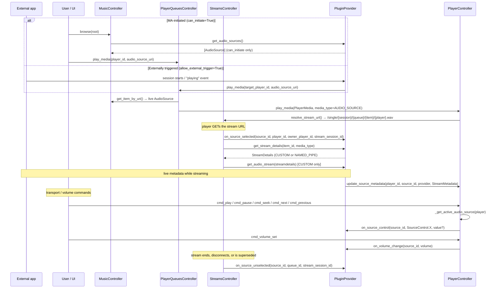

# 11 — Plugin System

Plugin providers are the "everything else" provider type: they bridge external audio sources and services into Music Assistant without being a music library, a speaker, or a metadata lookup. A plugin can inject live audio from an external app (Spotify Connect, AirPlay, AriaCast, VBAN, Yandex Music), report plays to a scrobbling service, expose MA players onto a foreign control surface (Plex, Yandex Alice), host a guest experience (Party, Music Quiz), generate playlists and recommendations, or add a whole server surface such as an MCP endpoint.

The abstraction at the centre of the audio half of the system is the **`AudioSource` media item**: an ordinary `MediaItem` (`MediaType.AUDIO_SOURCE`, defined in `music_assistant_models`) that is browsed, enqueued, and streamed through the same paths as a radio station. Control travels back to the plugin through provider-level hooks on `PluginProvider` rather than through callbacks attached to the source, and ownership is player-scoped — the core-side record is the [live session](04-player-controller.md#live-audiosource-sessions).

One entry point is kept alive purely for compatibility: `select_source(plugin_instance_id)`, which still works for a provider exposing exactly one source. See [Legacy `select_source` compatibility](#legacy-select_source-compatibility).

---

## Plugin Taxonomy

There are 25 production plugin providers (`"type": "plugin"` in `manifest.json`), plus `_demo_plugin_provider` as an annotated template. Only the first category participates in the `AudioSource` machinery; the rest use the plain `Provider` surface plus whatever API commands, event subscriptions, or HTTP routes they register.

| Category | Plugins | `AUDIO_SOURCE` | What it does |
|---|---|---|---|
| **Receiver** (live audio source) | Spotify Connect, AirPlay Receiver, AriaCast Receiver, VBAN Receiver, Yandex Music Connect (Ynison), Sendspin Source | Yes | Exposes one or more `AudioSource` items; audio flows *into* MA from an external app or device |
| **Scrobbler** | Last.fm, ListenBrainz, Subsonic | No | Subscribes to `EventType.MEDIA_ITEM_PLAYED` and reports plays outward |
| **External control bridge** | Plex Connect, Yandex Smart Home | No | Advertises MA players on a foreign protocol and translates inbound commands into `PlayerController` calls |
| **Home Assistant bridge** | Home Assistant (`hass`) | No | Two-way HA integration; also an AI/TTS backend |
| **AI and TTS backend** | Home Assistant (`hass`), OpenAI-compatible, OpenAI TTS | No | Answers `ProviderFeature.AI_QUERY` / `TTS` by exposing selectable [engines](18-ai-and-mcp.md#ai-and-tts-engines) |
| **Guest and social experience** | Party, Music Quiz | No | Guest access, join codes, shared playback sessions, guest-scoped queue mutation |
| **Library and discovery** | Radio Playlists, Smart Playlists, Sonic Similarity, AI Radio, Library Recommendations | No | Implements *music* features (`BROWSE`, `SEARCH`, `RECOMMENDATIONS`, `SIMILAR_TRACKS`, playlist resolution) from a plugin |
| **Server extension** | MCP Server (`fastmcp_server`), Hue Lights Sync, Milkdrop Visualizer, Profiler | No | Mounts a new server surface, virtual players, or diagnostics onto the running instance |

Recent additions worth placing:

- **Sendspin Source** (`sendspin_source`, #5658) — builtin, `depends_on: sendspin`. Exposes the **line-in** of a Sendspin client that supports the `source@v1` role (a turntable, a microphone, an aux input) as an `AudioSource`, one per connected client.
- **Library Recommendations** (`recommendations`, #3890) — builtin and `allow_disable: false`. Supplies the library recommendation rows; see [08-media-library.md](08-media-library.md#library-rows).
- **Milkdrop Visualizer** (`milkdrop_visualizer`, #5511) — experimental, with an empty `SUPPORTED_FEATURES`. Taps decoded playback PCM and relays waveform, beat and colour data over a WebSocket at `/milkdrop_visualizer`.
- **OpenAI-compatible** and **OpenAI TTS** — see [18-ai-and-mcp.md](18-ai-and-mcp.md#backends).

Four easy misclassifications, all of which are **not** plugins: `teddycloud` is a music provider, `msx_bridge` and `snapcast` are player providers, and `_demo_sendspin_clients` (#6085, fake pairing devices for development) is a *player* provider despite the name.

`plex_connect` is a bridge, not a receiver: it declares no `ProviderFeature`s at all and never touches audio. It makes an MA player appear as a controllable device in Plexamp and the Plex web player, then drives that player from Plex's remote-control and timeline protocols.

---

## `AudioSource` — the core abstraction

`AudioSource` lives in `music_assistant_models.media_items` (not in MA core) and subclasses `MediaItem`, so it inherits the whole media-item surface: `item_id`, `provider`, `name`, `provider_mappings`, `metadata`, and a computed `uri`. Its docstring describes it as behaving like a live media item similar to `Radio` — enqueued as a single queue item, streamed continuously, with metadata pushed by the owning plugin.

The URI is the standard media-item form, which is what makes the source addressable by browse, `get_item_by_uri`, and `play_media`:

```
spotify_connect--a1b2c3://audio_source/main
```

There are now **two id conventions**, reflecting two different bindings:

- **One source per provider instance** uses the literal `item_id` `"main"` (`AUDIO_SOURCE_ID = "main"`), so the instance id is what distinguishes two receivers of the same kind. AriaCast Receiver, VBAN Receiver and Yandex Ynison still work this way, as does `_demo_plugin_provider`.
- **One source per player** uses the **player id** as the `item_id`. Spotify Connect and AirPlay Receiver moved to this (#6026): a single provider instance runs one daemon per connected player and exposes each as its own source, which is what lets a user enable Spotify Connect on some speakers and not others without configuring multiple provider instances. `sendspin_source` keys on the Sendspin `client_id` for the same reason.

Because `item_id` is only provider-scoped, code that needs a server-wide unique value uses the source's `uri` — see [04-player-controller.md](04-player-controller.md#live-audiosource-sessions).

The contract permits several sources per provider either way — the base-class docstring calls out a paired hardware device whose favorites come and go — and `get_audio_sources()` is re-called rather than cached, so the set may change over the provider's lifetime.

### Fields specific to `AudioSource`

| Field | Default | Purpose |
|---|---|---|
| `media_type` | `MediaType.AUDIO_SOURCE` | Fixed; this is the discriminator every core path branches on |
| `duration` | `None` | A live source has no fixed length; the field exists only for `QueueItem` compatibility |
| `can_play_pause` | `False` | Whether the UI shows play/pause and the controller proxies PLAY/PAUSE to `on_source_control` |
| `can_seek` | `False` | Same, for SEEK |
| `can_next_previous` | `False` | Same, for NEXT/PREVIOUS |
| `can_shuffle` | `False` | Whether the source can reorder its own session; gates `SourceControl.SHUFFLE` (#5880) |
| `can_repeat` | `False` | Same, for `SourceControl.REPEAT` |
| `exclusive` | `True` | **Convention / documentation for plugins**, not a core gate — no controller reads `AudioSource.exclusive`. In-tree receivers set it `True` and implement single-consumer ownership in `on_source_selected` / stream claim logic; `False` would mean the plugin must serve independent per-consumer streams itself |
| `allow_external_trigger` | `False` | **Convention only** — signals that an external app may start playback (e.g. the Spotify app picking MA as its device). Core does not branch on this field |
| `can_initiate` | `False` | MA may start this source on demand from the UI. `False` means the source is reachable only via an external trigger, and the browse listings filter it out |

The old `PlayerSource.passive` flag split into `can_initiate` / `allow_external_trigger`. `passive = False` meant "show it in the selectable source list"; the replacement is finer-grained, because "the user can start this" (`can_initiate`) and "the external app can start this" (`allow_external_trigger`) are genuinely independent. Only `can_initiate` is enforced by core (browse filter); `allow_external_trigger` and `exclusive` are provider contracts.

`can_initiate=False` is not a soft hint. The browse tree filters on it, and the owning plugin's `get_stream_details` is expected to raise `AudioError` when it cannot actually acquire the upstream producer — which is exactly what AirPlay Receiver and AriaCast do when no external session is connected.

**Receivers are not uniformly passive.** Spotify Connect, VBAN Receiver and `sendspin_source` all set `can_initiate=True`. Starting Spotify Connect from MA resumes the last known Spotify context, claiming active-device status; with no prior context it raises a localized error pointing the user at the app. Its `can_shuffle` / `can_repeat` are derived from the backend's `supports_queue_control` rather than hardcoded.

### The capability flags are the routing gate

`can_play_pause` / `can_seek` / `can_next_previous` are not just UI hints: the player controller checks them before proxying, so a command against a source that declares `can_play_pause=False` is silently not forwarded. Every in-tree receiver except Yandex Ynison sets them statically — Spotify Connect enables all three, AirPlay Receiver and VBAN none, AriaCast play/pause and next/previous but not seek. Yandex Ynison rebuilds its `AudioSource` with the flags derived from whether its companion `yandex_music` provider is loaded.

---

## `PluginProvider` base class

`PluginProvider` (`music_assistant/models/plugin.py`) extends `Provider`. Every method is optional, and the base class uses a consistent pattern for feature-gated methods: raise `NotImplementedError` when the matching `ProviderFeature` is declared but the subclass did not override, otherwise return an empty result. That means a plugin can declare `SEARCH` and forget to implement it and get a loud failure, while a plugin that never declares it gets a harmless empty `SearchResults`.

### AudioSource surface

| Method | Gate | Notes |
|---|---|---|
| `get_audio_sources() -> list[AudioSource]` | `AUDIO_SOURCE` | Called on demand, never cached. Return `[]` when the plugin currently has nothing to offer (hardware offline) |
| `get_player_audio_sources(player_id) -> list[AudioSource] \| None` | `AUDIO_SOURCE` | The sources this plugin has bound to **one specific player**. `None` means the plugin is not player-bound at all, which is what distinguishes the two models |
| `get_stream_details(item_id, media_type) -> StreamDetails` | `AUDIO_SOURCE` | **MUST be side-effect-free** — see below. The signature is the same `(item_id, media_type)` pair a `MusicProvider` uses |
| `get_audio_stream(streamdetails, seek_position=0)` | called when `stream_type == StreamType.CUSTOM` | Async generator of raw PCM in the format declared by `streamdetails.audio_format`. `seek_position` is ignored for live sources |
| `on_source_control(source_id, action, value=None)` | `AUDIO_SOURCE` | Transport commands. `action` is a `SourceControl` (`PLAY`, `PAUSE`, `NEXT`, `PREVIOUS`, `SEEK`, `SHUFFLE`, `REPEAT`, `UNKNOWN`); `value` is a `SourceControlValue` — the seek position or volume for `SEEK`/`VOLUME`, the enabled state for `SHUFFLE`, a `RepeatMode` for `REPEAT`, `None` for plain transport |
| `on_source_selected(source_id, player_id, owner_player_id, stream_session_id)` | `AUDIO_SOURCE` | Non-abstract, no-op by default. Where exclusive sources claim ownership |
| `on_source_unselected(source_id, owner_player_id, stream_session_id)` | `AUDIO_SOURCE` | Non-abstract, no-op by default. Where they release it |
| `on_source_released(source_id, player_id)` | optional | Fired when a player lets go of the source **for good** — another source was selected, it was deselected, or the player went away. *Not* fired when a stream merely ends (#5875) |
| `on_volume_change(source_id, volume)` | optional | Push MA's new volume (0–100) upstream |

**`player_id` and `owner_player_id` are both passed, and the distinction matters.** `player_id` is the player the audio is *served to*, which for a direct-PCM consumer or the legacy queue-item path can be a protocol bridge or a group member. `owner_player_id` is the user-facing player that owns the session, and is the one to store: a protocol bridge's id can be gone by the time the plugin uses it for `play_media` or `cmd_stop`.

**`stream_session_id` must be checked on unselect.** It is a fresh per-request token paired between the two hooks, and implementations are required to guard on it rather than on the player alone. A same-player reconnect — the player drops and reopens the same stream URL before the original request's `finally` runs — would otherwise let the *old* request's late callback clear the live claim of the new stream, silently dropping metadata and volume sync.

`SourceControl` still has no `VOLUME` member despite the value type naming one; volume travels on its own hook. `on_volume_change` is separate because the routing conditions differ: transport commands follow the source playing on the player, while volume is gated on the player having its own [live session](04-player-controller.md#live-audiosource-sessions) so a group cannot fire one callback per member. See [07-volume.md](07-volume.md#audiosource-volume-callbacks).

Metadata is pushed the other way through `mass.players.update_source_metadata(player_id, ...)`, with `update_source_options` for shuffle/repeat state and `refresh_source` to re-read the source itself.

**Why `get_stream_details` must be side-effect-free.** It is called from two places: the real stream request, and queue preload (`_load_item`, which drives the generator to fill an initial buffer). If a plugin claimed its exclusive lock here, a preload would reserve the source and then block a genuine handoff at the actual stream request. Ownership therefore belongs in `on_source_selected` — which fires only on the real request, is always paired with `on_source_unselected` in a `finally`, and is deliberately fired **before** `get_stream_details` so the plugin can stop the previous player and replace its claim before the upcoming details fetch.

### Music features

Since #3811 (and #3978 for search, #4487 for the recommendations split) a `PluginProvider` can implement the music-provider surface, which is how the library-and-discovery plugins work without being music providers:

| Method | Gate |
|---|---|
| `browse(path)` | `BROWSE` |
| `search(search_query, media_types, limit=5)` | `SEARCH` |
| `get_similar_tracks(track, limit=25)` | `SIMILAR_TRACKS` |
| `get_recommendations()` | `RECOMMENDATIONS` — must be fast: static/cached row descriptors only, no backend calls |
| `get_recommendation_items(item_id)` | `RECOMMENDATIONS` — the live fetch for a single row |
| `get_playlist(prov_playlist_id)` / `get_playlist_tracks(prov_playlist_id, page=0)` | *ungated* |

The playlist pair is deliberately not feature-gated: `MediaControllerBase.get_provider_item` casts to `MusicProvider | PluginProvider` and calls `get_playlist` for any provider backing a playlist URI, which is what lets `radio_playlist` and `smart_playlist` synthesise playlists that resolve like real ones. See [08-media-library.md](08-media-library.md#browse) for how these providers appear in the browse tree.

### Other hooks

| Method | Gate | Notes |
|---|---|---|
| `get_tts_message(message, language=None) -> StreamDetails` | `TTS` | Text to speech (#3607). `hass` is the only in-tree implementation; AI Radio consumes it |
| `ai_query(query) -> str` | `AI_QUERY` | Natural-language prompt to an AI backend (#3607). Consumed by AI Radio, Music Quiz, and Smart Playlists |
| `resolve_image(path) -> str \| bytes` | *ungated override* | Defaults to returning `path` unchanged. AirPlay Receiver and AriaCast use it to serve cover art bytes received over their metadata channels |

See [18-ai-and-mcp.md](18-ai-and-mcp.md) for the TTS/AI backend contract and its consumers.

---

## Discovery, resolution, and playback

There is no registration step. Everything flows from `get_audio_sources()` being called on demand by whichever core path needs it.

### The player source list carries plugin sources again

This went back and forth, so it is worth stating where it landed. Originally `Player.__final_source_list` appended every plugin source, converted through `PluginSource.as_player_source()` to strip unpicklable callbacks. That was removed when `PluginSource` became `AudioSource`. It is now **back**, but on a different basis: the entries come from the player-bound model rather than from a global list of every plugin source.

`__final_source_list` assembles native sources, the synthesized "Music Assistant Queue" entry, the player's [live session](04-player-controller.md#live-audiosource-sessions) if it has one, and then standing entries from `prov.get_player_audio_sources(self.player_id)` for every loaded `AUDIO_SOURCE` plugin (#6026, #6042, #6070). A uri already present is skipped, so the live session — which alone knows the current shuffle/repeat state — wins over the standing entry for the same source.

The point of the standing entries is that a player's own Spotify Connect or line-in is selectable from the source menu *before* anything is playing on it, which the session-only model could not express. `as_player_source()` remains gone; an `AudioSource` has no callbacks to strip, and the `PlayerSource` is built field by field. See [03-player-model.md](03-player-model.md#source-list-composition) for the full ordering.

The `PlayerType.PROTOCOL` early return still stands: protocol players get their native source list and nothing else, not even the MA Queue entry.

### Sources are discovered through music browse

`MusicController.browse` surfaces every provider declaring `ProviderFeature.AUDIO_SOURCE` at the **browse root**, alongside the providers declaring `BROWSE`, filtered through the same per-user provider filter. Only sources with `can_initiate=True` are listed, and the shape depends on how many survive that filter:

- **exactly one** initiable source → the `AudioSource` item itself is placed at the root, so it plays in one tap
- **more than one** → a `BrowseFolder` at `{instance_id}://`, whose listing (handled at the provider level, since these providers implement no `browse()`) is the initiable sources
- **none** → the provider does not appear at all

Note what this means for the genuinely passive receivers: AirPlay Receiver and AriaCast are `can_initiate=False`, so they are invisible in browse and can only be started from their external app. Spotify Connect, VBAN and `sendspin_source` are `can_initiate=True` and therefore browsable and playable on demand. Player-bound sources are additionally scoped by `_get_plugin_audio_sources` so a browse listing shows the sources belonging to the relevant player rather than every player's.

The `"Live Inputs"` node named in `PluginProvider`'s docstrings and in `_demo_plugin_provider`'s comments is a leftover from #3938; #3964 replaced that dedicated node with the root-level placement above. The name survives in the queue config entry `default_enqueue_option_live_sources`, which `AudioSource` shares with `RADIO` — both are infinite live streams where `REPLACE` is almost always the right enqueue semantic. See [08-media-library.md](08-media-library.md#browse) and [09-player-queues.md](09-player-queues.md).

### URI resolution

`MusicController.get_item` special-cases `MediaType.AUDIO_SOURCE`: rather than looking in the library (an `AudioSource` is never library-backed and never favoritable), it fetches the owning provider's `get_audio_sources()` and returns the live item whose `item_id` matches, raising `MediaNotFoundError` otherwise. `get_item_by_uri` adds no check of its own — it parses the URI and delegates straight to `get_item`, which carries a parallel branch for `SOUND_EFFECT` that resolves live through `prov.get_sound_effect(item_id)` on a `MusicProvider` declaring `SOUND_EFFECTS`. Returning the live `MediaItem` is what lets `play_media` build a queue item through the completely standard path.

### Active source detection

The `PluginSource`-era `_get_active_plugin_source(player)` — which matched on `in_use_by == player.player_id` or `active_source == plugin_source.id` — is replaced by `_get_active_audio_source(player)` in `controllers/players/controller.py`. It asks a different question: *is the player's active queue item an `AudioSource`?*

```python
active_queue = self.get_active_queue(player)
if active_queue is None:
    return None
current_item = active_queue.current_item
if current_item is None or current_item.media_item is None:
    return None
media_item = current_item.media_item
# ... isinstance and feature-flag guards ...
return media_item, provider
```

It returns the `(AudioSource, PluginProvider)` pair, or `None`. Two guards are deliberate belt-and-suspenders: an `isinstance(media_item, AudioSource)` check rather than a bare `media_type` comparison (so a mutated or wrongly constructed item cannot slip through and crash a downstream hook), and a re-check that the provider still declares `ProviderFeature.AUDIO_SOURCE` (so a feature flag flipped off at runtime by a provider reload does not leave `on_source_control` raising `NotImplementedError` out of `cmd_play`).

`Player.__final_active_source` has no plugin-specific branch. It resolves: group/sync parent's active source → protocol parent's active source → `__active_mass_source` (unless the player reports a known-external source such as a TV or line-in input) → the player's own reported source → `__active_mass_source` or the player's own queue id. Note the docstring is misleading here: it lists "plugin source active: return the active plugin source" as a case, which the code does not implement — a live source surfaces through the player's [session](04-player-controller.md#live-audiosource-sessions) instead. See [03-player-model.md](03-player-model.md#resolution-chains).

### Legacy `select_source` compatibility

`select_source` accepts a plugin's `instance_id` directly as the source string, rather than an `AudioSource` URI. `_handle_select_source` keeps that working, but only where it is unambiguous:

- if `source` names a `PlayerQueue`, set it as the active MA source (unchanged)
- else if `source` resolves to a `PluginProvider`: require `ProviderFeature.AUDIO_SOURCE`, then call `get_audio_sources()`. Exactly one source → translate to `player_queues.play_media(player_id, source.uri)`. More than one → raise `UnsupportedFeaturedException` telling the caller to use an explicit `AudioSource` URI
- else fall through to the normal player-native source-selection path (`PlayerFeature.SELECT_SOURCE`, validity check against `source_list`, forward to the provider)

Treat it as a shim for old frontends, third-party scripts, and HA automations, not as the supported entry point.

### Sequence



### Command routing

Each handler resolves the active `AudioSource`, checks the relevant capability flag, and proxies:

| Handler | Capability checked | Call |
|---|---|---|
| `_handle_cmd_play` | `can_play_pause` | `on_source_control(item_id, SourceControl.PLAY)` |
| `_handle_cmd_pause` | `can_play_pause` | `on_source_control(item_id, SourceControl.PAUSE)` |
| `cmd_seek` | `can_seek` | `on_source_control(item_id, SourceControl.SEEK, position)` |
| `cmd_next_track` | `can_next_previous` | `on_source_control(item_id, SourceControl.NEXT)` |
| `cmd_previous_track` | `can_next_previous` | `on_source_control(item_id, SourceControl.PREVIOUS)` |
| `_handle_cmd_volume_set` | — | `on_volume_change(item_id, volume_level)`, gated on direct queue ownership |
| `set_group_volume` | — | `on_volume_change(item_id, volume_level)` once, after all child volumes are applied |

### Current media and the upstream clock

Live track info rides on `StreamMetadata`, the same field ICY radio metadata uses. A plugin pushes it with `mass.players.update_source_metadata(...)` and it lands on the player's [live session](04-player-controller.md#live-audiosource-sessions); for a queue-item source it arrives via `StreamDetails.stream_metadata`. `Player.__final_current_media` picks it up generically — title, artist, album, image, duration and elapsed time come from there in preference to the queue item's own values — so no `AudioSource`-specific branch is needed.

`Player.__final_playback_state` additionally overrides the resolved `elapsed_time` from the session's `stream_metadata`, because the protocol player's (or the player's own) position tracks **bytes consumed**, which is the wrong clock for a live source: it loses upstream seeks and upstream pause/resume on the queue's `corrected_elapsed_time`, which both the player queues controller and several player providers consume. The override is gated on the player owning the source rather than merely hearing it. See [03-player-model.md](03-player-model.md#the-upstream-clock-override).

`mass.players.update_source_metadata(player_id, source_id, provider_instance_id, stream_metadata)` is the push channel, and it is defensive on purpose. The update is dropped silently unless the source playing on that player is owned by that exact provider instance with that exact `item_id` — plugins fire these from arbitrary threads (the AirPlay metadata reader, the Spotify websocket handler, the AriaCast websocket reader), and the GIL makes each attribute write atomic but not the read-then-write sequence.

It is keyed on the **player** rather than the queue, because the live source is a player-scoped session now. One consequence is worth noting: metadata is accepted from the moment the source is *selected*, before any stream exists, so a provider can report what it already knows rather than waiting for audio to start flowing. A placeholder adopted from `get_stream_details` stays replaceable by a later placeholder, but anything the source actually *reported* is not overwritten by one — see `attach_streamdetails` in [04-player-controller.md](04-player-controller.md#live-audiosource-sessions).

---

## Selection lifecycle and ownership

`in_use_by` on a central `PluginSource` object is replaced by a **queue-scoped claim held inside the provider**. Every in-tree receiver implements the same pattern with the same two fields:

```python
self._in_use_by_queue: str | None = None    # which queue currently owns us
self._active_session_id: str | None = None  # the controller's token for that request
```

`on_source_selected` sets both; `on_source_unselected` clears them, but only if the session id matches.

### Where the hooks fire

The streams controller owns the lifecycle, from two entry points that must stay in sync:

- **`serve_queue_item_stream`** (the HTTP route) fires `on_source_selected` on every `AUDIO_SOURCE` **GET**, then pairs it with `on_source_unselected` in a `finally` that runs however the stream ended — normal completion, client disconnect, or exception.
- **`get_stream`** → `_wrap_with_audio_source_lifecycle` mirrors the same pairing for direct-PCM consumers (AirPlay, Snapcast, UGP) that never touch the HTTP route.

Three details are load-bearing:

**Selected fires before `get_stream_details`.** That ordering lets the plugin stop the previous player and replace its claim *before* the stream-details fetch that follows, which is what makes a cross-queue handoff work.

**It fires unconditionally, even when streamdetails are cached.** A disconnect/reconnect for the same queue item therefore re-claims the source with a fresh session id, instead of streaming against the stale ownership of the prior request.

**A HEAD probe does not fire the hooks at all.** Many DLNA renderers probe with HEAD before GET, and claiming ownership then would trigger the transfer side effects (stopping the previous player, redirecting a disallowed switch) prematurely. The HEAD response still validates that the providing plugin is loaded — returning 200 for an unloaded provider would lie to a renderer that caches the response — and rewrites a PCM format suffix to `audio/wav`, because most renderers pick a decoder from the HEAD `Content-Type` and cannot handle `application/octet-stream`.

### Why `stream_session_id` exists

A `queue_id`-only guard is not sufficient. Consider a same-queue reconnect: the player drops and reopens the same stream URL before the original request's `finally` has run. Both requests carry the same `queue_id`, so the old request's late `on_source_unselected` would clear the *live* claim of its replacement — silently dropping metadata pushes and volume sync for a stream that is actually playing. The controller therefore mints a fresh `uuid4().hex` per stream request, hands it to `on_source_selected`, and passes the same value to the matching `on_source_unselected`. Implementations **must** reject the callback when it does not match the currently stored session id.

The same token guards the long-lived generators. VBAN, AriaCast, and Yandex Ynison all snapshot `(_in_use_by_queue, _active_session_id)` at generator entry, break out of their read loop when either has moved on, and skip the release in their own `finally` unless both still match.

### Failure handling

- **The provider can abort the request** by raising `RuntimeError` from `on_source_selected`. Yandex Ynison is the in-tree case: with its `allow_player_switch` option off, a selection on the wrong player triggers a (rate-limited) `play_media` redirect to the configured target and then raises. The HTTP route surfaces the raise as a 404 so the disallowed player drops the connection cleanly rather than treating an uncaught 500 as transient and retrying; `get_stream` converts it to `AudioError`. The contract requires raising *before* claiming, so it is a clean abort.
- **The provider is wired into the `finally` before the hook is awaited**, so a plugin that partially mutates state and then raises still gets its `on_source_unselected`. The session-id guard makes a release-without-claim a harmless no-op.
- **`on_source_unselected` exceptions are caught and logged, never propagated** — the response cycle is already unwinding. They are logged loudly rather than swallowed, because a buggy plugin that leaks `_in_use_by_queue` forever would otherwise leave no trail.

### Volume ownership

Volume goes to the player the source actually plays on, exactly once. `_handle_cmd_volume_set` and `set_group_volume` both resolve the player's own [live session](04-player-controller.md#live-audiosource-sessions) via `get_audio_source_session(player_id)`. A group member that merely *hears* the source has no session of its own, so it never notifies — where a test based on the inherited `active_source` would fire one callback per child, each with a different level, handing a bidirectional plugin a burst of contradictory volumes. Either the standalone player fires once, or the group fires once with the commanded group volume. The cost is that per-member adjustments inside a group are never surfaced upstream. See [07-volume.md](07-volume.md#audiosource-volume-callbacks).

---

## Audio delivery

### Stream URLs

A live source reaches a player over one of two routes, depending on how it is bound. A source the user **enqueued** is an ordinary queue item and uses the per-item URL; a source attached **directly to a player** is not a queue item at all and uses `/source/`, keyed by the owning player:

```
http://<host>:8097/single/{session_id}/{queue_id}/{queue_item_id}/{player_id}.{fmt}
http://<host>:8097/source/{session_id}/{source_player_id}/{player_id}.{fmt}
```

`resolve_stream_url` makes two `AUDIO_SOURCE`-specific decisions. Flow mode is always suppressed — a single infinite stream has no track boundaries to flow across; `get_stream()` (direct-PCM consumers) suppresses it for `RADIO` / `AUDIO_SOURCE` too. The output codec follows the player's configured `output_codec`, with **WAV available as an opt-in** through the per-player `CONF_PREFER_WAV_FOR_LIVE_SOURCES` (default off).

WAV is worth opting into only when it actually buys a passthrough: `serve_queue_item_stream` skips the encode FFmpeg process entirely when the output is WAV, no filter params apply, and the sample rate, bit depth and channel count all match the source PCM — it then streams a WAV header followed by raw bytes via `_wav_passthrough_stream`, saving a process and its buffer latency. When any of those conditions fail the stream is re-encoded anyway, and WAV costs far more bandwidth than FLAC for nothing. See [10-streaming-pipeline.md](10-streaming-pipeline.md#stream-url-resolution).

### Stream types

`_open_audio_source_generator` supports exactly two, and raises `AudioError` for anything else:

| Stream type | Mechanism | Used by |
|---|---|---|
| `StreamType.CUSTOM` | The provider implements `get_audio_stream()` as an async generator; the streams controller consumes it directly | Spotify Connect (go-librespot backend), AriaCast Receiver, VBAN Receiver, Yandex Music Connect, Sendspin Source |
| `StreamType.NAMED_PIPE` | The provider creates a FIFO and sets `StreamDetails.path`; the streams controller reads it via `read_named_pipe()` | Spotify Connect (Soloist backend), AirPlay Receiver |

**Spotify Connect uses either, depending on its backend.** The go-librespot backend is `CUSTOM`, reading the daemon's stdout — the daemon is configured with `audio_output_pipe: /dev/stdout`, so the subprocess pipe always has a reader and its non-blocking open never fails for lack of a consumer. The Soloist backend is `NAMED_PIPE`, because it captures the client's output through PulseAudio into a FIFO (`helpers/pulse_capture.py`). The choice of stream type therefore follows the engine, not the provider.

### Realtime handling

`AudioSource` items take the shortest path the pipeline has: `get_audio_source_stream()` bypasses the `AudioBuffer`, loudness hydration, volume normalization, crossfade, fade-in, playback-speed shift, next-track preload, and analysis entirely. `_iter_audio_source_pcm` then picks one of two routes — if the source's PCM format already matches the consumer's, the provider's bytes are paced in Python by `realtime_pcm_pacer` with **no FFmpeg in the data path at all**; otherwise `get_media_stream()` resamples through FFmpeg with `-re`.

Pacing exists because some producers are not realtime. go-librespot's pipe backend hands audio over as fast as it can decode; without back-pressure the consumer buffers many seconds ahead and next/skip feel laggy. Spotify Connect additionally paces inside its own `get_audio_stream`, so the daemon stays a fraction of a second ahead even on the FFmpeg resample path.

### The silence-during-pause contract

A player consuming a live stream needs continuous byte flow or it disconnects after a few seconds. The `PluginProvider` docstrings describe a two-sided contract:

- **`NAMED_PIPE`** — the producer process must keep writing silence during pause. shairport-sync and librespot's pipe backend both do this by default. AirPlay Receiver additionally writes a second of explicit silence (`_write_silence_to_unblock_stream`) when its session stops, so the reading FFmpeg can produce a chunk and the consumer can make forward progress for a clean teardown.
- **`CUSTOM`** — the docstrings promise that the server wraps the generator with a silence-keepalive, so a plugin can simply stop yielding while its upstream device is paused.

**The `CUSTOM` half of that promise is not currently true.** The wrapper (`audio_source_silence_keepalive` in `helpers/audio.py`) still exists and is unit-tested, but #3964 removed it from the streaming path and replaced it with `realtime_pcm_pacer`, which paces without injecting silence. Read the docstring as the intended contract, not a description of current behaviour — and note that the receivers do not rely on it: Spotify Connect ends the stream with a clean EOF after 0.5 s of no PCM while not playing, AriaCast and VBAN keep waiting on a 1 s timeout, and AirPlay is on the pipe side of the contract. See [10-streaming-pipeline.md](10-streaming-pipeline.md#audiosource-the-realtime-bypass), which owns this note.

### Consumers outside the HTTP route

Some player providers consume `AudioSource` queue items without going through `serve_queue_item_stream`. **Snapcast** (a player provider, not a plugin) is the interesting case: for `MediaType.AUDIO_SOURCE` it scopes the Snapcast stream to the queue rather than the player, and appends a short hash of the `queue_item_id` so a queue rapidly re-selecting the same source (`AudioSource A` → track → `AudioSource A` again) cannot collide with a half-torn-down stream of the same name, since `destroy_on_stop` teardown is asynchronous. These consumers get the lifecycle hooks through `_wrap_with_audio_source_lifecycle`. See [10-streaming-pipeline.md](10-streaming-pipeline.md#stream-entry-points).

---

## Receiver plugins in detail

### Spotify Connect

`providers/spotify_connect/` is the most complete receiver and the reference implementation. It now supports two interchangeable playback engines behind one backend-agnostic provider: **Soloist** (Spotify's official headless client, the recommended default, #5810) and **go-librespot** (the community client it was originally rewritten around in #4384). The in-tree [`README.md`](../../music_assistant/providers/spotify_connect/README.md) covers the module layout and the backend contract, with the deep dives — binary provisioning, known limitations — in [`soloist/README.md`](../../music_assistant/providers/spotify_connect/soloist/README.md) and [`go_librespot/README.md`](../../music_assistant/providers/spotify_connect/go_librespot/README.md). What matters at the plugin-system level:

**No Spotify Web API, no Spotify music provider.** Transport control needs neither: the go-librespot backend drives one subprocess per instance entirely over its loopback HTTP + WebSocket API through `GoLibrespotClient` (`go_librespot/client.py`): REST `POST /player/{resume,pause,next,prev,seek,volume,play}` outbound, and a `/events` WebSocket inbound.


**Transport capabilities are static.** `can_play_pause`, `can_seek`, and `can_next_previous` are all hardcoded `True`, because the backend's control API always provides them while a session is active. `can_shuffle` / `can_repeat` are not: they follow the backend's `supports_queue_control`. `exclusive=True`, `allow_external_trigger=True`, and `can_initiate=True` — MA can start the source by resuming the last known Spotify context, though with no prior context it raises a localized error pointing the user at the app, since Spotify needs an existing playback context.

**Format layering.** `audio_format` advertises the *source* codec (Ogg Vorbis 320 kbps) for display, while `decoded_audio_format` is the s16le PCM actually on the wire; the streams controller hands the latter to FFmpeg as the input format. `extra_input_args=["-fflags", "nobuffer"]` keeps the resample path low-latency, and `expiration=0` means streamdetails are never reused from cache, so the active-device check in `get_stream_details` re-runs on every play attempt.

**External trigger is debounced.** A `playing` event fires `_deferred_play_media_fire`, which sleeps `PLAY_MEDIA_DEBOUNCE_S = 0.5` before calling `player_queues.play_media(target_player_id, source.uri)`. The debounce exists because the daemon can emit a stale `playing` from a dying session just before it reconnects; a later `paused`, `stopped`, or `active` event cancels the pending task, avoiding a play → stop → replay loop.

**Taking playback back.** The provider remembers the last seen `context_uri` and track `uri` from the event stream. If the user moved the active device away in the Spotify app and then presses play in MA, `on_source_selected` calls `POST /player/play` with that context (and `skip_to_uri` for the track) — go-librespot activates the device unconditionally for a play request. With no known context it raises a localized "not the active Spotify device" error instead.

**Pause is a clean EOF, not a held state.** go-librespot keeps the pipe open while paused and simply stops writing. `get_audio_stream` notices the gap (`PAUSE_EOF_TIMEOUT_S = 0.5`), confirms `self._playing` is false, and returns — so the player leaves the playing state with the track preserved, and the next `playing` event re-streams.

**Volume anti-ping-pong.** Volume is bidirectional and deduplicated on a single field:

- **MA → Spotify** (`on_volume_change`): return early if `volume == self._last_volume_sent`; otherwise record the new value *before* awaiting `set_volume`, because the daemon echoes a `volume` event back over the WebSocket and that echo can arrive while the await is still in flight. Restore the previous value on failure so a retry is not wrongly deduped.
- **Spotify → MA** (`_handle_volume_event`): ignore the event if it equals `_last_volume_sent` (our own echo); ignore it entirely within `INITIAL_VOLUME_GRACE_S = 3.0` of the session becoming active, so the player's own volume wins over the daemon's initial value on (re)connect; otherwise `cmd_volume_set` on `_in_use_by_queue`.

The scale is a percentage: the daemon config pins `volume_steps: 100` so its 0..max maps 1:1, and `external_volume: True` stops it attenuating the PCM (MA and the target player own the actual volume).

**Player targeting** follows a priority chain in `_get_target_player_id`: the currently active player, else — in `__auto__` mode — a currently playing player then the first available, else the configured default. `on_source_selected` deliberately caches the **`queue_id`** rather than the protocol `player_id`, because some protocol players are ephemeral bridges whose id becomes invalid for `play_media` once torn down.

### AirPlay Receiver

Wraps `shairport-sync` with two named pipes, audio and metadata, on deterministic paths derived from the instance id. The AirPlay port is also derived deterministically (`7000 + md5(instance_id) % 1000`) so it survives restarts — the AirPlay *player* provider uses it to recognise and ignore MA's own advertisement during discovery. The mDNS advertisement is pinned to the streams server's bind interface when one is configured.

- `StreamType.NAMED_PIPE`, `path = audio_pipe.path`. `audio_format` is ALAC 44.1/16 (the protocol-native source format, for display); `decoded_audio_format` is the s16le PCM shairport-sync actually writes.
- `can_play_pause` / `can_seek` / `can_next_previous` are all `False`, and `on_source_control` is an explicit no-op that exists only to satisfy the contract. `can_initiate=False`, `allow_external_trigger=True` — audio only flows when an AirPlay client connects, and `get_stream_details` raises `AudioError` when there is no active client.
- **Volume is inbound only.** `on_volume_change` is *not* implemented. The AirPlay client's volume arrives on the metadata pipe and `_handle_volume_change` pushes it into MA with `cmd_volume_set(self._in_use_by_queue, volume)`, skipping the very first event of each session (which is shairport-sync's initial sync from `default_airplay_volume`) so it cannot clobber the player's current volume. shairport-sync runs with `ignore_volume_control = "yes"`, so it never attenuates the audio itself.
- Metadata (title, artist, album, duration, elapsed time) comes from a `MetadataReader` on the metadata pipe and is pushed with `update_source_metadata`. Cover art is served through `resolve_image`, keyed on a `cover_art_{hash}` path so each unique image gets its own thumbnail cache entry and a stale request cannot cache new bytes under an old key.
- A `play_state` of `"playing"` from shairport-sync's sessioncontrol hooks starts playback via `play_media` on the target player; `"stopped"` clears the claim, writes the unblocking silence, and stops the player. `_start_playback` awaits any pending stop first so a rapid stop/start cannot race.

### AriaCast Receiver

A **native Python AriaCast v1.1 protocol server** (#4871), with no external binary. An `aiohttp` server on port 12889 serves the wire protocol directly: WebSocket routes for `/audio`, `/control`, `/metadata`, and `/stats`, plus HTTP `POST /metadata`, `POST /api/command`, and artwork GETs, with UDP discovery on 12888. Audio frames land in an `asyncio.Queue` and `get_audio_stream` drains it, VBAN-style. PCM is 48 kHz s16le stereo (20 ms frames = 3840 bytes). Only one `/audio` sender is allowed at a time; a second connection attempt is rejected with HTTP 403.

`can_play_pause=True` and `can_next_previous=True` (forwarded to the sender as control actions), `can_seek=False`. `can_initiate=False`, `allow_external_trigger=True`. The generator drains stale frames on entry and exit so a pause does not leave built-up silence to play through, and cold-starts fail fast with `AudioError` if the sender never sends. Artwork is served via `resolve_image`.

### VBAN Receiver

The simplest receiver: audio over UDP using the VBAN protocol via `aiovban`, `StreamType.CUSTOM`, no metadata beyond a static title/artist pair (the stream name and sender host), no playback controls at all. Highly configurable — PCM format, sample rate, channels, bind IP and port, sender host, stream name, queue size, and back-pressure strategy.

It is the one receiver with **`can_initiate=True`** (and `allow_external_trigger=False`): MA opens the UDP listener on demand, and `get_audio_stream` raises a localized `AudioError` if the configured sender never sends a packet within the first second. That makes it the only receiver visible in the browse tree by default.

`on_source_selected` notably does *not* stop a previous player the way the other receivers do — VBAN is a purely passive UDP receiver with no concept of an active player, so the previous queue's read loop simply notices the ownership change on its 1 s timeout and exits on its own.

### Yandex Music Connect (Ynison)

Provider domain `yandex_ynison` (#3614), now at manifest stage `stable`. It makes an MA player appear as a selectable device inside the Yandex Music app over the Ynison protocol. `depends_on: yandex_music` is real, not cosmetic: the plugin follows Ynison state to learn *which track* is playing, then resolves that track's stream through the companion `yandex_music` **music** provider (`_get_stream_details_with_retry`). It is the only receiver whose `get_audio_stream` is multi-track — a single `CUSTOM` generator session streams the current track, waits for a track-change event, and streams the next, running until the source is deselected.

- Transport control goes through `on_source_control` (PLAY / PAUSE / NEXT / PREVIOUS / SEEK), which dispatches to internal `_on_play` / `_on_pause` / `_on_next` / `_on_previous` / `_on_seek` handlers that issue Ynison peer commands.
- **`on_volume_change` is not implemented.** There is no volume sync with the Yandex device in either direction.
- Capability flags are dynamic: `_build_audio_source()` sets all three to whether the `yandex_music` provider is currently loaded. `exclusive=True`, `allow_external_trigger=True`, `can_initiate` left at its `False` default.
- The `allow_player_switch` option turns `on_source_selected` into the redirect-and-`RuntimeError` path described under [Failure handling](#failure-handling).
- The PCM format is frozen at session start, so a mid-session `_update_normalized_format()` (e.g. a provider reload) takes effect only on the next session rather than causing a bit-depth or sample-rate mismatch mid-stream.

---

## Scrobbler plugins

Scrobblers are event-driven and touch no audio. They share the `ScrobblerHelper` base class (`helpers/scrobbler.py`), subscribe to `EventType.MEDIA_ITEM_PLAYED` in `loaded_in_mass()`, and implement two methods: `_update_now_playing(report)` when playback starts, and `_scrobble(report)` once the report qualifies.

`ScrobblerHelper._on_mass_media_item_played` handles the shared decision-making, which is more than it looks:

- **Media-type filter** — a subclass can restrict itself via `supported_media_types` (Last.fm and ListenBrainz accept tracks only; Subsonic also handles audiobooks and podcasts).
- **User and player filters** — `ScrobblerConfig.mass_userids` / `mass_playerids`, surfaced as shared config entries by `ScrobblerConfig.get_shared_config_entries`, so a household can scrobble only certain users or only certain rooms.
- **Duplicate and loop detection** — `should_scrobble` refuses a repeat of `last_scrobbled` and requires `report.fully_played`; a not-fully-played report for the same URI is read as a restart and resets both `last_scrobbled` and `currently_playing`, so a single song on loop keeps scrobbling.
- **Error containment** — `scrobble_exceptions` is a `ClassVar` tuple naming the client library's error hierarchy. Those are logged and swallowed (a network blip must not break the event bus); anything outside the set surfaces as the bug it is.

| Scrobbler | Library | Auth | Notes |
|---|---|---|---|
| **Last.fm** | `pylast` (blocking, wrapped in `asyncio.to_thread`) | Web auth flow with callback URL, session key stored | Also supports Libre.fm via `_NetworkType` |
| **ListenBrainz** | `liblistenbrainz` (blocking, wrapped in a thread) | User token | Supports self-hosted instances via `api_base_url`, sends MusicBrainz IDs |
| **Subsonic** | The OpenSubsonic provider's connection (`depends_on: opensubsonic`) | Reuses that provider's auth | Scrobbles back to the source server; supports audiobooks and podcasts |

---

## Bridge and feature plugins

These declare no `ProviderFeature`s (or only music features) and never expose an `AudioSource`. What they have in common is that they extend the server through some surface other than audio input: API commands, HTTP routes, virtual players, event subscriptions, or the music-provider feature set. [18-ai-and-mcp.md](18-ai-and-mcp.md) covers the AI-facing plugins in depth — the `AI_QUERY`/`TTS` contract, AI Radio's generation pipeline, and the MCP tool surface; the sections here state each plugin's shape and its integration points.

### Shared playback sessions

Two plugins need the same thing: a queue that a group of guests listens to together, with guests optionally joining on their own devices. `helpers/shared_playback.py` (#4672) factors that out as `SharedPlaybackSession`, used by Party and Music Quiz.

A session is a thin wrapper around **a player that owns a queue**, in one of two modes:

| Mode | Queue host | Guest experience | Factory |
|---|---|---|---|
| `VENUE` | An existing real player, playing out loud | Guests may optionally *listen in* on their own device, when the venue player can group with it | `create_venue(mass, venue_player_id)` |
| `REMOTE` | A hidden Sendspin virtual player | Every guest's web player attaches, so all playback happens on guests' devices (silent-disco style) | `create_remote(mass, owner_instance_id, display_name, session_id=None)` |

The owning plugin drives playback on `session.queue_id` and calls `close()` when the session ends. `queue_id` is simply `player_id` — a player-owned queue always shares its player's id — which is why the same code path works for a real speaker and a virtual one.

**Listening in is a grouping operation, not a second stream.** `can_listen_in(web_player_id)` requires the host player to support `PlayerFeature.SET_MEMBERS` and the guest player to appear in the host's `state.can_group_with` or existing `state.group_members`; `add_guest_listener` then just calls `cmd_set_members`. Delegating the compatibility question to `can_group_with` means all protocol expansion and translation is already handled, for both a real venue player and a virtual Sendspin host — see [06-grouping.md](06-grouping.md).

Guest listeners are **tracked, not merely added**. The session keeps its own `_guest_listeners` set, and `restore_guest_listeners()` re-attaches any tracked guest missing from the host's group. A guest whose player is offline or temporarily incompatible stays tracked rather than being dropped, so a later playback transition can restore it once the device reconnects. Teardown is mode-dependent: `REMOTE` removes the virtual player (and its queue) entirely, while `VENUE` detaches only the guests this session added and leaves the venue player untouched.

The one sharp edge is documented in the module docstring: a `REMOTE` session's virtual player lives in the **Sendspin provider's memory**, so it disappears when that provider reloads. The owning plugin is responsible for re-creating the session, and passing the same `session_id` yields the same `player_id`. `create_remote` also carries a fair amount of cancellation-safety machinery, because a cancelled creation that nevertheless completes must not leak an orphaned virtual player.

Guest tokens, join codes, and the guest-access flow itself belong to [19-authentication.md](19-authentication.md).

### Party

`providers/party/` provides guest access with no audio involvement of its own. Its playback host is a `SharedPlaybackSession` whose mode comes from the provider's `mode` config option, so an installation picks venue or remote once rather than per game.

**Guest access:** a `UserRole.GUEST` user named `party_guest` (display name "Party Guest"), a join code with an 8-hour default expiry from the auth controller, and a join URL that is either remote (`https://app.music-assistant.io/?remote_id=…&join=…`) or local. Guest tokens are revoked when the plugin is removed *or* when guest access is switched off in config, read from the live config rather than the init-time snapshot.

**API commands** (each with an explicit `required_scope`): `party/url`, `party/player`, `party/config`, `party/add_to_queue`, `party/boost_queue_item`, `party/skip`, `party/listen_in`, `party/stop_listen_in`, `party/can_listen_in`.

**Queue management** is unchanged in shape. Guest-added tracks go into a priority section after the current track; boosted items form their own sub-section at the front of the guest section, selected by scanning for the most specific marker attribute (`party_boosted` before `party_guest`). `_add_to_priority_section` uses `index_in_buffer` while playing rather than `current_index`, so an insert cannot land before an already-buffered track and get skipped. A single `_queue_lock` serialises reading queue state, computing the insert index, and loading the item, so concurrent guests cannot interleave — and when the queue is idle the same lock covers the resolve-insert-`play_index` sequence so two guests do not both start playback.

### Music Quiz

`music_quiz` (#4572, stage `beta`) is a multiplayer quiz game at roughly 7,800 lines — among the largest plugins, though `fastmcp_server` is larger by line count (~10.3k). It declares no `ProviderFeature`s but is the heaviest consumer of other subsystems: `SharedPlaybackSession` for playback (mode chosen **per game**, unlike Party), guest access for joining, `ProviderFeature.AI_QUERY` for two of its three quiz types, and twenty `music_quiz/*` API commands.

Three quiz types register as strategy classes in `QUIZ_TYPES`: `guess_the_song` (multiple choice, optional AI distractors), `music_timeline` (a shared chronological timeline with optional artist and title bonuses, no AI), and `trivia` (AI-worded questions grounded in library metadata, AI required). `get_available_quiz_types` filters on each class's `is_available(mass)`, so trivia disappears from the options rather than failing when no AI plugin is loaded.

State reaches guests as `PROVIDER_EVENT` events scoped to the provider's `instance_id`, and the public state is guest-safe by construction rather than by edge filtering — private player IDs never enter a broadcast, and the correct answer, current song, and bonus answers are withheld until the reveal phase. The generation pipeline, the AI grounding-and-validation approach, and the full event contract are covered in [18-ai-and-mcp.md](18-ai-and-mcp.md#music-quiz).

### Yandex Smart Home

Provider domain `yandex_smarthome` (#3615). Declares no `ProviderFeature`s: it stands up a Yandex Smart Home API surface so MA players are controllable from Alice. Architecturally it is the mirror image of a receiver — commands flow *in* from the external service and are translated into `PlayerController` calls, rather than MA reaching out.

Three connection modes: `cloud` (the public yaha-cloud.ru relay, zero setup but one instance per Yandex account), `cloud_plus` (a private skill through the same relay, registered manually in the dev console), and `direct` (Yandex calls the MA webserver directly, requiring public HTTPS). Playlists are exposed as device sources.

The auto-create logic lives in `_smarthome_auto_create.py` and covers smart-home URL derivation only; Alice voice-skill support is a separate `ma-provider-yandex-alice` provider.

### Plex Connect

`plex_connect` (`depends_on: plex`, stage beta) makes an MA player appear as a controllable device in the official Plex apps. Each instance links one MA player and binds its own port from a 32500+ range; discovery is GDM-based (`gdm.py`), and the modules split along protocol lines — `server.py` for the remote-control HTTP surface, `timeline.py` for playback state reporting, `queue_sync.py` / `queue_commands.py` for the Plex play-queue, `playback.py` and `parsing.py` for the rest. It declares no features and exposes no `AudioSource`; classifying it as a receiver would be wrong.

### Home Assistant

`hass` is the odd one out: a plugin whose `supported_features` are computed at runtime. It adds `ProviderFeature.TTS` and `ProviderFeature.AI_QUERY` to its own feature set when the connected HA instance offers the matching services, and discards them otherwise. It was once the only in-tree backend for both hooks; `openai_compatible` (AI) and `openai_tts` (speech) now serve them too, and all three expose their backends as selectable **engines** rather than being chosen as whole providers. Consumers are AI Radio (speech for moderator segments, `ai_query` for text), Music Quiz (trivia and distractors), Smart Playlists (rule generation from a prompt) and the player controller's spoken announcements. See [18-ai-and-mcp.md](18-ai-and-mcp.md#ai-and-tts-engines).

### Library and discovery plugins

Four plugins behave like music providers through the #3811 feature surface without being music providers. This is the pattern that makes a "plugin" a genuinely open extension point rather than an audio-only one.

#### Radio Playlists

`radio_playlist` (#4498) is **builtin** and always on. It generates a dynamic "radio" playlist from any seed media item — artist, album, track, genre, or playlist — mixing the seed's own tracks with similar tracks. It declares **no** `ProviderFeature`s at all and implements only `get_playlist` / `get_playlist_tracks`, which is enough because the playlist pair is ungated.

The neat part is the identity trick: the playlist's `item_id` **is the seed item's own URI**, so `radio_playlist://playlist/<seed-uri>` round-trips straight back to the seed with no state to persist. The result is a normal dynamic playlist (`is_dynamic=True`), so the queue treats it exactly like a provider station or a smart playlist. This is what replaced the old radio mode — see [09-player-queues.md](09-player-queues.md) for the bounded managed pool that consumes it.

#### Smart Playlists

`smart_playlist` (#3630, stage `beta`) builds playlists from rules: genres, artists, albums, favorites, similar tracks, release year, album type, explicit content, and more. It declares `BROWSE` and `RECOMMENDATIONS` and implements the playlist pair, so its playlists browse and resolve like any provider's. Rules are persisted to disk per playlist, and a cached dynamic sample is invalidated through the provider-scoped cache whenever they change. Its optional AI-generated descriptions are covered in [18-ai-and-mcp.md](18-ai-and-mcp.md#smart-playlists).

#### Sonic Similarity

`sonic_similarity` (#3943, stage `beta`, `depends_on: sonic_analysis`) declares `SIMILAR_TRACKS` and `RECOMMENDATIONS`, and adds `SEARCH` in its `setup()` when the `enable_text_search` option is on — read through `get_raw_provider_config_value` because a provider's option entries are not resolved until the instance exists, which is after `setup()` returns.

It hosts **two** similarity engines, both backed by usearch HNSW indices, and consumes analysis output that another provider produced:

| Engine | Vector | Source | Availability |
|---|---|---|---|
| Traits | 18-dim weighted Euclidean | `sonic_analysis` scalars (BPM, energy, loudness, …) | Always on |
| Character | 1024-dim CLAP cosine | The CLAP embedding `sonic_analysis` stores in `audio_analysis.extra_data["clap_embedding"]` | Opt-in via `enable_clap_index` |

Weight presets are deliberately non-uniform, tuned per feature-group informativeness, and a genre/year rerank bonus is scaled down (`METADATA_BONUS_SCALE`) so metadata nudges the audio distance rather than dominating it. Index rebuilds are atomic mmap-view swaps, exposed as config actions and refreshed by a scheduled background task. See [16-audio-analysis.md](16-audio-analysis.md) for the analysis pipeline that feeds it and [20-background-tasks.md](20-background-tasks.md) for the scheduling.

#### AI Radio

`ai_radio` (#3407, stage `alpha`) generates AI-moderated radio programs: an LLM writes spoken host segments, a TTS backend renders them, and the result is interleaved with a source playlist either as a generated playlist or by batch-feeding a live queue. `SUPPORTED_FEATURES` is empty — it is a pure consumer of other plugins' `AI_QUERY` and `TTS` hooks. Fully covered in [18-ai-and-mcp.md](18-ai-and-mcp.md#ai-radio--the-orchestrator).

### Server extension plugins

#### MCP Server

`fastmcp_server` (#3858, stage `experimental`) exposes MA's library, queue, playback, player, metadata, debug, and config surfaces as Model Context Protocol tools for external LLM clients, mounted into MA's own aiohttp webserver at `/mcp/v1` through an ASGI bridge. It declares no `ProviderFeature`s — it is the inverse of the AI consumers, publishing MA as the tool provider rather than calling out. See [18-ai-and-mcp.md](18-ai-and-mcp.md#the-fastmcp-server--ma-as-the-tool-provider).

#### Hue Lights Sync

`hue_entertainment` (#3627, reworked in #4042, moved onto the standalone `hue-entertainment` library in #4152) syncs Philips Hue lights to the music. Its integration shape is unusual for a plugin in two ways.

First, **it creates players.** Each entertainment area on a paired Hue bridge becomes a virtual Sendspin player (`depends_on: sendspin`), so playing music to that player activates entertainment mode and makes the lights react. A plugin provider producing players is legal — nothing ties player creation to `PlayerProvider` — and it is the cleanest way to make lights a routable playback target.

Second, **it consumes the analysis pipeline as an in-process client.** The bridge registers with the local Sendspin server via `register_external_player` (no WebSocket involved) and its visualizer and color roles subscribe directly to the playing group's roles, receiving spectrum, onset peaks, beat schedule, and colour palette through callbacks. Because in-process delivery follows the audio *push*, features arrive **ahead of the playhead** — audio is buffered seconds in advance — so the analyzer queues them by playback timestamp and a fixed 30 Hz render loop drains at the server clock plus a configurable Hue-latency lead. Frames then go out as DTLS 1.2 PSK / HueStream v2 over UDP.

The in-tree [`README.md`](../../music_assistant/providers/hue_entertainment/README.md) owns the effect-mode catalog, the streaming-layer detail, and the known limitations; [16-audio-analysis.md](16-audio-analysis.md) covers the analysis side.

#### Profiler

`profiler` (#4653, stage `alpha`) is a diagnostics plugin meant to be installed temporarily: while loaded it continuously records CPU, memory, and event-loop health, optionally takes periodic CPU profile windows, and exposes the aggregated result as a shareable report through the `profiler/report` API command (scope `Scope.SYSTEM_MANAGE`). It adds a logging handler, subscribes to the whole event bus, and runs three background tasks — a loop-lag monitor, a flight recorder, and a CPU profile scheduler — all torn down on unload. The in-tree [`README.md`](../../music_assistant/providers/profiler/README.md) documents the workflow, what is measured, and how to interpret the report; [20-background-tasks.md](20-background-tasks.md) covers the diagnostics framework it complements.

---

## Key Files

| File | Purpose |
|---|---|
| [`music_assistant/models/plugin.py`](../../music_assistant/models/plugin.py) | `PluginProvider` base class: `get_audio_sources`, `get_player_audio_sources`, `get_stream_details`, `get_audio_stream`, `on_source_control`, `on_source_selected`, `on_source_unselected`, `on_source_released`, `on_volume_change`, the music-feature surface, `get_tts_message`, `ai_query`, `resolve_image`, plus `PluginEngine` / `AIEngine` / `TTSEngine` and `SourceControlValue` |
| `music_assistant_models.media_items.AudioSource` | The `AudioSource` media item itself — lives in the shared models package, not in MA core |
| [`music_assistant/controllers/players/audio_sources.py`](../../music_assistant/controllers/players/audio_sources.py) | `AudioSourceMixin`, `AudioSourceSession` — the per-player live session, claiming and takeover |
| [`music_assistant/controllers/players/announcements.py`](../../music_assistant/controllers/players/announcements.py) | `AnnouncementsMixin` — spoken announcements through a TTS engine |
| [`music_assistant/helpers/plugin_engines.py`](../../music_assistant/helpers/plugin_engines.py) | AI/TTS engine collection, resolution, auto-selection and picker config |
| [`music_assistant/helpers/tts.py`](../../music_assistant/helpers/tts.py) | Shared TTS invocation, language fallback and stream-path validation |
| [`music_assistant/controllers/players/controller.py`](../../music_assistant/controllers/players/controller.py) | `_get_active_audio_source`, transport proxying in the `cmd_*` handlers (including `cmd_shuffle` / `cmd_repeat`), volume notification in `_handle_cmd_volume_set` / `set_group_volume`, the legacy `select_source` shim in `_handle_select_source` |
| [`music_assistant/controllers/streams/controller.py`](../../music_assistant/controllers/streams/controller.py) | Selection lifecycle (`serve_queue_item_stream`, `serve_audio_source_stream`, `_wrap_with_audio_source_lifecycle`), `resolve_stream_url` codec choice, WAV passthrough |
| [`music_assistant/controllers/streams/audio.py`](../../music_assistant/controllers/streams/audio.py) | `get_audio_source_stream`, `_iter_audio_source_pcm`, `_open_audio_source_generator`, `_select_audio_source_pcm_format` |
| [`music_assistant/controllers/music/controller.py`](../../music_assistant/controllers/music/controller.py) | Root browse placement of `AUDIO_SOURCE` providers, provider-level listing, `get_item` resolution for `MediaType.AUDIO_SOURCE` |
| [`music_assistant/controllers/player_queues/`](../../music_assistant/controllers/player_queues/) | `play_media`, the shared `default_enqueue_option_live_sources` default, and the preload paths that skip `AudioSource` items |
| [`music_assistant/models/player.py`](../../music_assistant/models/player.py) | `__final_source_list`, `__final_active_source`, `__final_current_media`, and the upstream-clock override in `__final_playback_state` |
| [`music_assistant/helpers/shared_playback.py`](../../music_assistant/helpers/shared_playback.py) | `SharedPlaybackSession` and `SharedPlaybackMode` — venue/remote guest listening |
| [`music_assistant/helpers/scrobbler.py`](../../music_assistant/helpers/scrobbler.py) | `ScrobblerHelper` and `ScrobblerConfig` |
| [`music_assistant/providers/_demo_plugin_provider/`](../../music_assistant/providers/_demo_plugin_provider/) | Annotated template covering the full `AudioSource` contract |
| [`music_assistant/providers/spotify_connect/`](../../music_assistant/providers/spotify_connect/) | Reference receiver: pluggable Soloist / go-librespot backends, bidirectional volume. See its [`README.md`](../../music_assistant/providers/spotify_connect/README.md) |
| [`music_assistant/providers/airplay_receiver/`](../../music_assistant/providers/airplay_receiver/) | `NAMED_PIPE` receiver, via shairport-sync |
| [`music_assistant/providers/ariacast_receiver/`](../../music_assistant/providers/ariacast_receiver/) | Native Python AriaCast protocol server |
| [`music_assistant/providers/vban_receiver/`](../../music_assistant/providers/vban_receiver/) | VBAN UDP receiver; `can_initiate=True` |
| [`music_assistant/providers/sendspin_source/`](../../music_assistant/providers/sendspin_source/) | Builtin receiver exposing a Sendspin client's line-in (`source@v1`) as an `AudioSource` |
| [`music_assistant/providers/recommendations/`](../../music_assistant/providers/recommendations/) | Builtin, undisableable plugin supplying the library recommendation rows |
| [`music_assistant/providers/milkdrop_visualizer/`](../../music_assistant/providers/milkdrop_visualizer/) | Taps decoded PCM and relays waveform/beat/colour data over a WebSocket |
| [`music_assistant/providers/yandex_ynison/`](../../music_assistant/providers/yandex_ynison/) | Multi-track receiver bridging the Ynison protocol |
| [`music_assistant/providers/party/`](../../music_assistant/providers/party/) | Guest access, shared playback, priority-section queue management |
| [`music_assistant/providers/music_quiz/`](../../music_assistant/providers/music_quiz/) | Quiz engine: per-game shared playback, guest-safe state broadcast, AI-grounded trivia |
| [`music_assistant/providers/plex_connect/`](../../music_assistant/providers/plex_connect/) | External control bridge for the Plex apps |
| [`music_assistant/providers/yandex_smarthome/`](../../music_assistant/providers/yandex_smarthome/) | External control bridge for Yandex Alice |
| [`music_assistant/providers/radio_playlist/`](../../music_assistant/providers/radio_playlist/) | Builtin seed-URI-addressed dynamic radio playlists |
| [`music_assistant/providers/smart_playlist/`](../../music_assistant/providers/smart_playlist/) | Rule-based playlists via the plugin music-feature surface |
| [`music_assistant/providers/sonic_similarity/`](../../music_assistant/providers/sonic_similarity/) | Two usearch similarity engines over `sonic_analysis` output |
| [`music_assistant/providers/ai_radio/`](../../music_assistant/providers/ai_radio/) | AI-moderated radio programs; pure consumer of `AI_QUERY` and `TTS` |
| [`music_assistant/providers/fastmcp_server/`](../../music_assistant/providers/fastmcp_server/) | MCP server mounted into MA's webserver — MA as a tool provider |
| [`music_assistant/providers/hue_entertainment/`](../../music_assistant/providers/hue_entertainment/) | Virtual Sendspin players per Hue entertainment area; in-process visualizer client |
| [`music_assistant/providers/profiler/`](../../music_assistant/providers/profiler/) | Temporary diagnostics plugin; `profiler/report` |
