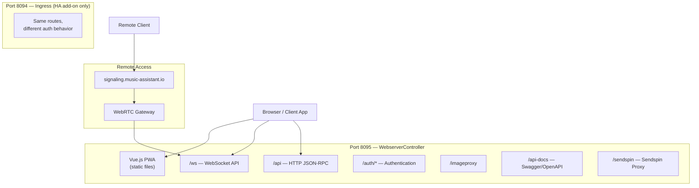
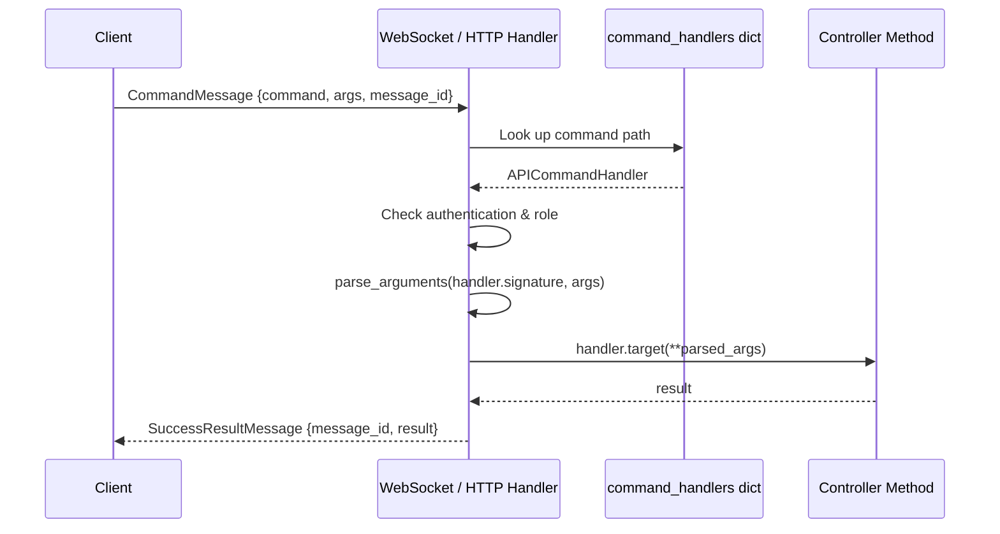
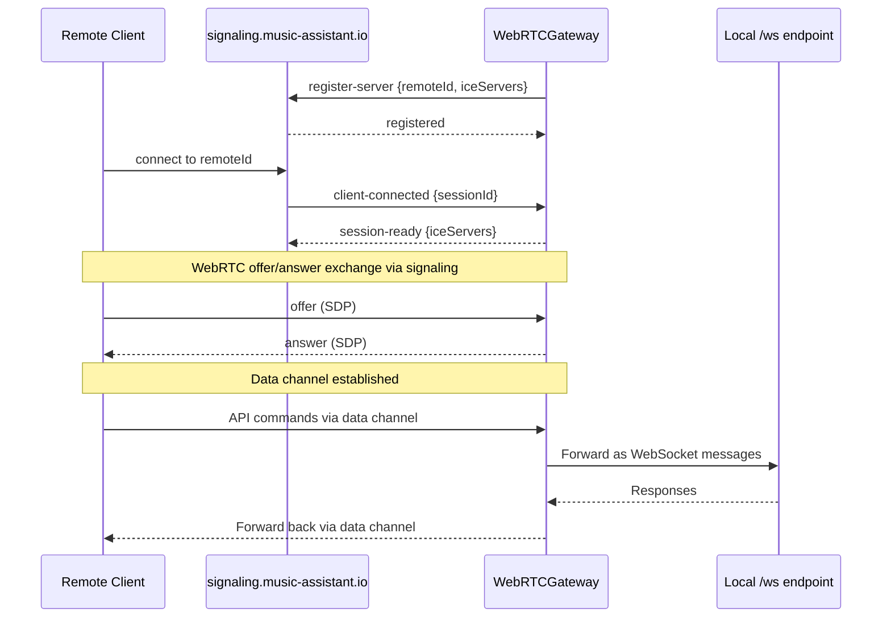

# 12 — Webserver and API

The webserver is the primary interface between Music Assistant and the outside world. It serves the Vue.js frontend, exposes a JSON-RPC command API over both WebSocket and HTTP, manages authentication and user sessions, and provides remote access via WebRTC. The `WebserverController` (on port 8095 by default) handles all of this through a single `aiohttp` application, while the streams controller runs a separate HTTP server on port 8097 for audio delivery (see [10-streaming-pipeline.md](10-streaming-pipeline.md)).

---

## Architecture Overview



---

## `WebserverController`

`WebserverController` (`controllers/webserver/controller.py`) extends `CoreController`. It wraps a `Webserver` helper (from `music_assistant.helpers.webserver`) providing the underlying `aiohttp` application.

### Key Attributes

| Attribute | Purpose |
|---|---|
| `_server` | `Webserver` instance — the underlying aiohttp server |
| `clients` | `set[WebsocketClientHandler]` — active WebSocket connections |
| `auth` | `AuthenticationManager` — user/token/session management |
| `remote_access` | `RemoteAccessManager` — WebRTC remote connectivity |
| `_sendspin_proxy` | `SendspinProxyHandler` — Sendspin WebSocket proxy |

### Port Configuration

| Setting | Default | Purpose |
|---|---|---|
| `CONF_BIND_PORT` | `8095` | Main webserver port |
| `CONF_BIND_IP` | `0.0.0.0` | Bind address |
| `CONF_BASE_URL` | Auto-detected | Public URL for external references |
| Ingress port | `8094` | HA internal network only (`172.30.32.x`) |

### Route Map

The controller registers routes during `setup()`:

| Method | Path | Handler | Purpose |
|---|---|---|---|
| GET | `/` | `_handle_index` | Frontend with onboarding guard |
| GET | `/{filename}` | `serve_static` | Frontend static files |
| GET | `/ws` | `_handle_ws_client` | WebSocket API |
| POST | `/api` | `_handle_jsonrpc_api_command` | HTTP JSON-RPC API |
| GET | `/imageproxy` | `mass.metadata.handle_imageproxy` | Image proxy |
| GET | `/preview` | `serve_preview_stream` | Audio preview (AAC) |
| GET | `/info` | `_handle_server_info` | Server info (CORS enabled) |
| GET | `/login` | `_handle_login_page` | Login page |
| POST | `/auth/login` | `_handle_auth_login` | Login action |
| GET | `/auth/me` | `_handle_auth_me` | Current user info |
| GET | `/auth/providers` | `_handle_auth_providers` | Available auth providers |
| GET | `/auth/authorize` | `_handle_auth_authorize` | OAuth initiation |
| GET | `/auth/callback` | `_handle_auth_callback` | OAuth callback |
| GET | `/setup` | `_handle_setup_page` | First-time admin setup |
| POST | `/setup` | `_handle_setup` | Create first admin user |
| GET | `/api-docs` | `_handle_api_intro` | API documentation |
| GET | `/api-docs/openapi.json` | `_handle_openapi_spec` | OpenAPI 3.0 spec |
| GET | `/api-docs/swagger` | `_handle_swagger_ui` | Swagger UI |
| GET | `/sendspin` | `handle_sendspin_proxy` | Sendspin WebSocket proxy |

### Onboarding Guard

The index handler (`_handle_index`) implements first-time setup logic:
- If no users exist and request is from ingress: checks HA user role — non-admins get an error page
- If no users exist and not ingress: redirects to `/setup`
- Otherwise: serves the Vue.js frontend normally

### SSL/TLS Support

Optional SSL via `CONF_ENABLE_SSL`. Accepts PEM certificate and private key as file paths or inline content. A verification action button (`verify_ssl`) tests the cert/key pair and reports key type, subject, expiry, and match status.

---

## JSON-RPC Command Model

The command system is the backbone of the MA API. Every controller method decorated with `@api_command` becomes callable via both WebSocket and HTTP.

### The `@api_command` Decorator

Defined in `helpers/api.py`:

```python
@api_command("players/all", authenticated=True, required_role=None)
def get_all_players(self) -> list[Player]:
    ...
```

The decorator sets three attributes on the function:
- `api_cmd` — the command path string (e.g., `"players/all"`)
- `api_authenticated` — whether authentication is required (default: `True`)
- `api_required_role` — required role (`"admin"`, `"user"`, or `None`)

### `APICommandHandler` Dataclass

During initialization, `MusicAssistant._register_api_commands()` scans a fixed list of class instances — `self` (MusicAssistant), `config`, `metadata`, `tasks`, `music`, `players`, `player_queues`, `webserver`, and `webserver.auth` — for methods with `api_cmd` attributes. Each match creates an `APICommandHandler` stored in `mass.command_handlers: dict[str, APICommandHandler]`. Additional commands (e.g., party mode, genre APIs) are registered dynamically at runtime via `mass.register_api_command()`:

```python
@dataclass
class APICommandHandler:
    command: str
    signature: inspect.Signature
    type_hints: dict[str, Any]
    target: Callable[...]
    authenticated: bool = True
    required_role: str | None = None
    alias: bool = False
```

The `parse` classmethod resolves forward references, TypeVars, and type aliases for accurate parameter validation and API documentation generation.

### `parse_arguments`

Converts JSON request arguments to Python types by introspecting the handler's type hints:
- Dataclasses with `from_dict` → deserialized via mashumaro
- Enums → matched by value
- ISO datetime strings → parsed
- Collections → recursively converted
- Type coercion fallback: int↔float, str→int/float/bool

### Command Dispatch Flow



Both WebSocket and HTTP endpoints use the same dispatch path — they differ only in transport and authentication flow.

---

## WebSocket API (`/ws`)

`WebsocketClientHandler` (`websocket_client.py`) manages a single WebSocket connection with 30-second heartbeats.

### Authentication Flow

**Regular connections**: The first meaningful command must be `"auth"` with a token:

```json
{"command": "auth", "args": {"token": "eyJhbG..."}}
```

The token is validated via `authenticate_with_token()`. Home Assistant system users are blocked on non-ingress connections.

**Ingress connections**: Auto-authenticated via HTTP headers (`X-Remote-User-ID`, `X-Remote-User-Name`, `X-Remote-User-Display-Name`). The handler creates or updates the user account automatically, using HA as the source of truth for display name and avatar.

### Event Subscription

After authentication, the client automatically subscribes to all `MassEvent` broadcasts. Events are filtered based on the user's `player_filter` — if set, only events for allowed player IDs are forwarded. Special handling for `TASKS_UPDATED` events: the controller calls `list_tasks_for_user(user)` to filter task visibility.

Events are serialized inline (not in an executor) and sent via `_send_message_sync` for minimal latency.

### Command Execution

Commands from the client are dispatched as independent tasks (not blocking the message loop). For async generators (e.g., large result sets), the handler collects items in batches of 500 and sends partial `SuccessResultMessage` responses for each batch.

### Writer Queue and Backpressure

A bounded `asyncio.Queue(maxsize=512)` separates message production from WebSocket writes. Large messages (command responses) are serialized in a thread executor before queuing; small messages (events) are serialized inline. If the queue fills (slow client), the connection is cancelled — this prevents a single slow client from blocking the event bus.

---

## HTTP JSON-RPC API (`/api`)

The HTTP endpoint accepts POST requests with a `CommandMessage` body. The dispatch logic mirrors WebSocket:

1. Reject if no users exist (503 "Setup required")
2. Parse body as `CommandMessage`
3. Look up handler in `command_handlers`
4. Authenticate via `Authorization: Bearer <token>` header
5. `parse_arguments` → execute → return raw JSON result via `web.json_response(result)` (no `SuccessResultMessage` envelope — that wrapper is WebSocket-only)

For async generators, results are collected into a list before returning.

---

## Authentication System

`AuthenticationManager` (`auth.py`) manages users, tokens, and login providers with its own SQLite database (`auth.db`).

### User Model

| Field | Type | Notes |
|---|---|---|
| `user_id` | `str` | `secrets.token_urlsafe(32)` |
| `username` | `str` | Case-insensitive, stored lowercase |
| `role` | `UserRole` | `ADMIN`, `USER`, or `GUEST` |
| `enabled` | `bool` | Disabled users cannot authenticate |
| `display_name` | `str \| None` | Optional display name |
| `avatar_url` | `str \| None` | Profile image |
| `preferences` | `dict` | User preferences JSON |
| `player_filter` | `list` | Restrict visible players |
| `provider_filter` | `list` | Restrict visible providers |

### Token System

Two token types, both JWT-based (with legacy SHA-256 hash fallback for backward compatibility):

| Type | Expiry | Auto-Renewal | Use Case |
|---|---|---|---|
| Short-lived | 30 days | Sliding window — extends 30 days on each use | Browser sessions, mobile apps |
| Long-lived | ~10 years (3650 days) | No | API integrations, automation |

Tokens are stored as SHA-256 hashes in the database. The database expiration is the source of truth (not the JWT `exp` claim), allowing server-side revocation.

### Login Providers

**`BuiltinLoginProvider`**: Username/password authentication. Passwords are hashed with `hashlib.pbkdf2_hmac("sha256", ..., iterations=100000)` using `{user_id}:{server_id}` as the salt. A `LoginRateLimiter` enforces progressive delays after failed attempts:

| Failed Attempts | Delay |
|---|---|
| 1-2 | None |
| 3-5 | 30 seconds |
| 6-9 | 60 seconds |
| 10-14 | 120 seconds |
| 15+ | 300 seconds |

**`HomeAssistantOAuthProvider`**: OAuth2 flow when the HA integration is configured. Uses HA's external URL for the authorization endpoint. On callback, exchanges the code for a token, retrieves the HA user ID, and creates or links an MA user account. Supports an `allow_self_registration` setting to control whether new HA users can create MA accounts.

### Join Codes

6-character codes from the set `ABCDEFGHJKLMNPQRSTUVWXYZ23456789` (no I/O/0/1 to avoid ambiguity). Used by the Party plugin for QR/link-based guest login. Features:
- Configurable expiry (default 8 hours)
- Maximum use count
- Exchangeable for a short-lived token via `auth/join_code/exchange`
- Automatic cleanup of expired/exhausted codes (daily)

### Context Variables

Request-scoped authentication state is propagated through the async call chain via `contextvars.ContextVar`:
- `get_current_user()` / `set_current_user()` — the authenticated user
- `get_current_token()` / `set_current_token()` — the auth token
- `get_sendspin_player_id()` / `set_sendspin_player_id()` — Sendspin player binding

### Ingress Security

Ingress detection uses **socket-level verification**, not headers. The `is_request_from_ingress(request)` function checks the actual TCP socket's `sockname` against the ingress site bind address and port — this prevents header spoofing from external requests.

### Auth Database Schema

Five tables in `auth.db` (schema version 5):

| Table | Purpose |
|---|---|
| `settings` | Key/value store (schema version, JWT secret) |
| `users` | User accounts |
| `user_auth_providers` | Links users to login providers (builtin password hash, HA user ID) |
| `auth_tokens` | Token records with hash, expiry, last-used tracking |
| `join_codes` | Short codes with expiry, use count, device name |

---

## Remote Access

`RemoteAccessManager` provides external connectivity without port forwarding via WebRTC data channels.

### Architecture



**Key components**:

- **Remote ID**: Derived from a persistent DTLS certificate, formatted as `MA-XXXX-XXXX`. This ID is stable across restarts, enabling client-side pinning.
- **Signaling server**: `wss://signaling.music-assistant.io/ws`. The gateway maintains a persistent connection with exponential backoff reconnection (10s → 300s max). A close code of 4000 (`CLOSE_CODE_REPLACED`) means another instance registered with the same remote ID — reconnection stops.
- **ICE servers**: Default STUN servers from Google and Cloudflare. When HA Cloud is available, TURN servers are retrieved for NAT traversal.
- **Data channel bridging**: Each WebRTC session gets a local WebSocket connection to `/ws?webrtc_session_id=...`. Messages are forwarded bidirectionally, making remote access transparent to the API layer.
- **HTTP proxy**: Remote clients can send HTTP requests through the data channel for endpoints that aren't WebSocket-based (e.g., image proxy, audio preview).
- **Sendspin channel**: A separate data channel labeled `"sendspin"` bridges to the internal Sendspin server for turntable control.

### Home Assistant Integration

When running as an HA add-on:
- Ingress server on port 8094 provides seamless authentication via HA headers
- HA Cloud TURN servers are used for WebRTC when available (requires HA 2025.12.0b6+)
- The server announces itself to the HA Supervisor via REST API for add-on discovery

---

## API Documentation

`api_docs.py` generates three documentation formats from the registered command handlers:

| Endpoint | Format | Purpose |
|---|---|---|
| `/api-docs/openapi.json` | OpenAPI 3.0 spec | Machine-readable API definition |
| `/api-docs/swagger` | Swagger UI | Interactive API explorer |
| `/api-docs/commands.json` | Custom JSON | Command reference data for the docs UI |
| `/api-docs/schemas.json` | Custom JSON | Data model schemas |

The generator converts Python type hints to OpenAPI schemas, parses docstrings (supporting Sphinx, Google, NumPy, and bullet formats), and remaps internal types (e.g., `Player` → `PlayerState` from the models package).

---

## Sendspin Proxy

`SendspinProxyHandler` provides an authenticated WebSocket proxy between web clients and the internal Sendspin server (port 8927). Authentication follows the same pattern as the main WebSocket — ingress uses headers, regular connections require a token in the first message. Messages are forwarded bidirectionally (both text and binary). The proxy extracts a `client_id` from the auth message to associate the WebSocket client with a specific Sendspin player.

---

## Key Files

| File | Purpose |
|---|---|
| `music_assistant/controllers/webserver/controller.py` | `WebserverController` — routes, lifecycle, frontend serving |
| `music_assistant/controllers/webserver/auth.py` | `AuthenticationManager` — users, tokens, join codes, login providers |
| `music_assistant/controllers/webserver/websocket_client.py` | `WebsocketClientHandler` — WebSocket connection management |
| `music_assistant/controllers/webserver/api_docs.py` | OpenAPI/Swagger documentation generation |
| `music_assistant/controllers/webserver/sendspin_proxy.py` | Sendspin WebSocket proxy |
| `music_assistant/controllers/webserver/helpers/auth_middleware.py` | Context variables, ingress detection, auth middleware |
| `music_assistant/controllers/webserver/helpers/auth_providers.py` | `BuiltinLoginProvider`, `HomeAssistantOAuthProvider`, rate limiter |
| `music_assistant/controllers/webserver/helpers/ssl.py` | SSL certificate management |
| `music_assistant/controllers/webserver/remote_access/` | `RemoteAccessManager`, `WebRTCGateway` |
| `music_assistant/helpers/api.py` | `@api_command`, `APICommandHandler`, `parse_arguments` |
