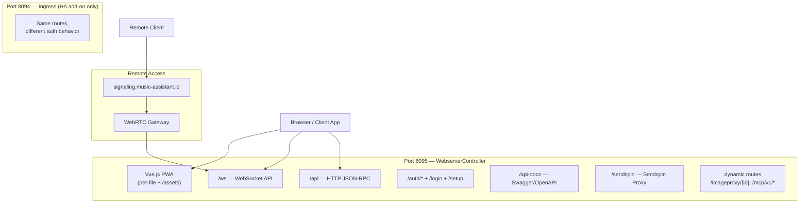
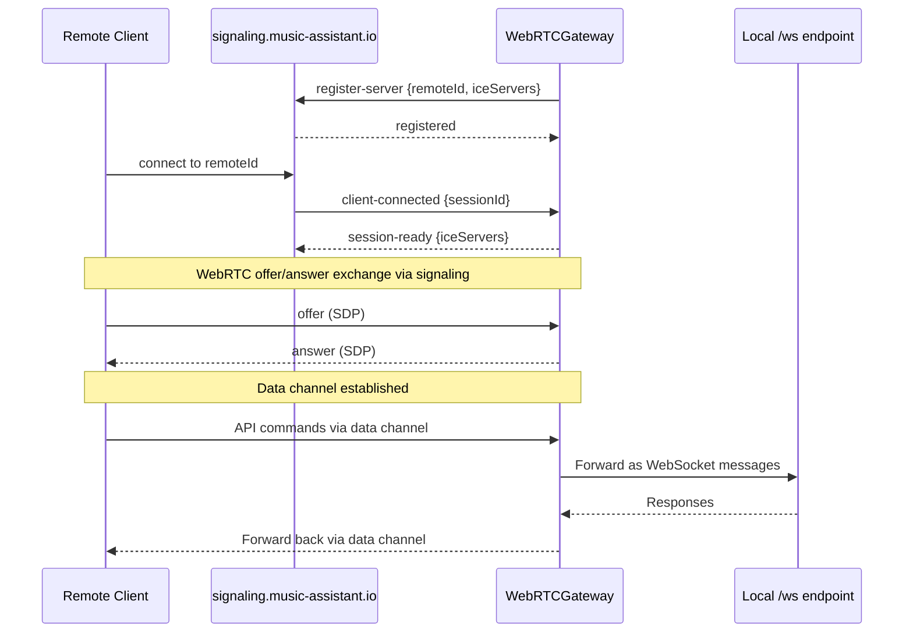

# 12 — Webserver and API

The webserver is the primary interface between Music Assistant and the outside world. It serves the Vue.js frontend, exposes a JSON-RPC command API over both WebSocket and HTTP, manages authentication and user sessions, and provides remote access via WebRTC. The `WebserverController` (on port 8095 by default) handles all of this through a single `aiohttp` application, while the streams controller runs a separate HTTP server on port 8097 for audio delivery (see [10-streaming-pipeline.md](10-streaming-pipeline.md)).

This document covers the transport: routes, the command registry and dispatch, the WebSocket lifecycle, remote access, and static serving. The authorization model those paths enforce — scopes, roles, tokens, impersonation, guest access — is documented separately in [19-authentication.md](19-authentication.md).

---

## Architecture Overview



---

## `WebserverController`

`WebserverController` (`controllers/webserver/controller.py`) extends `CoreController`. It wraps a `Webserver` helper (from `music_assistant.helpers.webserver`) providing the underlying `aiohttp` application.

### Key Attributes

| Attribute | Purpose |
|---|---|
| `_server` | `Webserver` instance — the underlying aiohttp server |
| `clients` | `set[WebsocketClientHandler]` — active WebSocket connections |
| `auth` | `AuthenticationManager` — user/token/session management |
| `remote_access` | `RemoteAccessManager` — WebRTC remote connectivity |
| `_sendspin_proxy` | `SendspinProxyHandler` — Sendspin WebSocket proxy |

### Port Configuration

| Setting | Default | Purpose |
|---|---|---|
| `CONF_BIND_PORT` | `8095` | Main webserver port |
| `CONF_BIND_IP` | `0.0.0.0` | Bind address |
| `CONF_BASE_URL` | Auto-detected | Public URL for external references |
| Ingress port | `8094` | HA internal network only (`172.30.32.x`) |

### Route Map

`setup()` builds one `routes` list and hands it to `Webserver.setup(static_routes=...)`.

| Method | Path | Handler | Purpose |
|---|---|---|---|
| GET | `/` | `_handle_index` | Frontend with onboarding guard |
| HEAD | `/` | `_handle_index` | Health check |
| GET | `/<each frontend file>` | `serve_static` | Frontend static files — see below |
| GET | `/logo.png` | `serve_static` | MA logo from the resources dir |
| GET | `/resources/common.css` | `serve_static` | Shared CSS for the server-rendered HTML pages |
| GET | `/info` | `_handle_server_info` | Server info |
| OPTIONS | `/info` | `_handle_cors_preflight` | CORS preflight |
| GET | `/ws` | `_handle_ws_client` | WebSocket API |
| POST | `/api` | `_handle_jsonrpc_api_command` | HTTP JSON-RPC API |
| GET | `/preview` | `serve_preview_stream` | Audio preview (AAC) |
| GET | `/login` | `_handle_login_page` | Login page |
| POST | `/auth/login` | `_handle_auth_login` | Login action |
| OPTIONS | `/auth/login` | `_handle_cors_preflight` | CORS preflight |
| POST | `/auth/logout` | `_handle_auth_logout` | Revoke the presented bearer token |
| GET | `/auth/me` | `_handle_auth_me` | Current user info |
| PATCH | `/auth/me` | `_handle_auth_me_update` | Update own username / display name / avatar |
| GET | `/auth/providers` | `_handle_auth_providers` | Available login providers |
| GET | `/auth/authorize` | `_handle_auth_authorize` | OAuth initiation |
| GET | `/auth/callback` | `_handle_auth_callback` | OAuth callback |
| GET | `/setup` | `_handle_setup_page` | First-time admin setup page |
| POST | `/setup` | `_handle_setup` | Create the first admin user |
| GET | `/api-docs`, `/api-docs/` | `_handle_api_intro` | API documentation index |
| GET | `/api-docs/openapi.json` | `_handle_openapi_spec` | OpenAPI 3.0 spec |
| GET | `/api-docs/swagger`, `/api-docs/swagger/` | `_handle_swagger_ui` | Swagger UI |
| GET | `/api-docs/commands`, `/api-docs/commands/` | `_handle_commands_reference` | Commands reference page |
| GET | `/api-docs/commands.json` | `_handle_commands_json` | Commands JSON data |
| GET | `/api-docs/schemas`, `/api-docs/schemas/` | `_handle_schemas_reference` | Schemas reference page |
| GET | `/api-docs/schemas.json` | `_handle_schemas_json` | Schemas JSON data |
| GET | `/sendspin` | `handle_sendspin_proxy` | Sendspin WebSocket proxy |

Plus one static-content mount: `/assets` → the frontend's `assets` subdirectory.

**Frontend files are registered individually, not through a catch-all.** `setup()` walks `locate_frontend()` and appends one explicit `GET /{filename}` route per file found (skipping `.py`), each bound to `serve_static` with a `partial`. There is no `GET /{filename}` wildcard, so a request for a path the frontend does not ship falls through to the dynamic-route catch-all rather than being answered with a static file.

**`/imageproxy` is not registered here.** The old query-string endpoint was replaced by opaque image ids in #3960 / #4544. `MetaDataController.post_setup()` now registers the canonical `/imageproxy/{image_id}?size=&fmt=` form as a **dynamic** route, on *both* the webserver and the streams controller, and unregisters it on teardown. See [14-metadata.md](14-metadata.md#image-proxy-system).

**CORS** is deliberately narrow: only `/info` and `/auth/login` answer `OPTIONS`, via `_handle_cors_preflight`, which returns `Access-Control-Allow-Origin: *`, allows `GET, POST, OPTIONS` and the `Content-Type`/`Authorization` headers, and caches the preflight for 24 hours. `_handle_auth_login` repeats those headers on its own responses. Nothing else is cross-origin accessible.

### Dynamic Routes

The webserver is constructed with `Webserver(self.logger, enable_dynamic_routes=True)`, which installs a catch-all handler and exposes a runtime registration API re-exported on the controller:

```python
unregister = mass.webserver.register_dynamic_route("/imageproxy/*", handler)   # method defaults to "*"
mass.webserver.unregister_dynamic_route("/imageproxy/*")
```

Routes are keyed `"{method}.{path}"`; registering a duplicate key raises. `_handle_catch_all` resolves in a fixed order — exact `"{METHOD}.{path}"`, then exact `"*.{path}"`, then any registered key ending in `/*` matched as a prefix. Registration returns an unregister callable, so a component that comes and goes can clean up after itself.

This is what lets subsystems outside the webserver own HTTP paths without the controller knowing about them: the metadata controller claims `/imageproxy/*`, and the MCP server plugin claims `/mcp/v1/*` plus its well-known and Connect Wizard routes (see [18-ai-and-mcp.md](18-ai-and-mcp.md#mounting-the-asgi-bridge)).

### Onboarding Guard

The index handler (`_handle_index`) implements first-time setup logic:

- **Ingress, and setup is incomplete** (no users *or* `onboard_done` is false): resolve the HA user's role via `get_ha_user_role()` and render an error page for anyone who is not an HA administrator. An HA admin is allowed through — their account is auto-created and the frontend takes over the onboarding wizard.
- **Not ingress, and no users**: 302 redirect to `setup`.
- **Otherwise**: serve the frontend's `index.html`.

Note that the ingress guard also fires when users exist but onboarding is unfinished, so a non-admin household member cannot land in a half-configured instance.

### SSL/TLS Support

Optional SSL via `CONF_ENABLE_SSL`. Accepts PEM certificate and private key as file paths or inline content. A verification action button (`verify_ssl`) tests the cert/key pair and reports key type, subject, expiry, and match status.

---

## JSON-RPC Command Model

The command system is the backbone of the MA API. Every controller method decorated with `@api_command` becomes callable via both WebSocket and HTTP.

### The `@api_command` Decorator

Defined in `helpers/api.py`. Authorization is **scope-based** since #4613 — there is no `required_role` parameter, and the name no longer appears in any Python code:

```python
@api_command(
    "players/all",
    authenticated=True,
    required_scope=Scope.PLAYERS_READ,
    allow_impersonation=False,
    alias=False,
)
def get_all_players(self) -> list[PlayerState]:
    ...
```

The decorator sets five attributes on the function:

| Attribute | Purpose |
|---|---|
| `api_cmd` | The command path string (e.g. `"players/all"`) |
| `api_authenticated` | Whether authentication is required (default `True`) |
| `api_required_scope` | `Scope \| None` — `None` means any authenticated user |
| `api_allow_impersonation` | Whether the command accepts an injected `user` argument |
| `api_alias` | Whether this is a backward-compatible alias, functional but hidden from the docs |

See [19-authentication.md](19-authentication.md#per-command-enforcement) for the scope model and [19-authentication.md](19-authentication.md#impersonation) for what `allow_impersonation` implies.

### `APICommandHandler` Dataclass

During startup, `MusicAssistant._register_api_commands()` scans a fixed list of instances for methods carrying `api_cmd`:

`self` (MusicAssistant), `config`, `metadata`, `tasks`, `music`, `players`, `player_queues`, `translations`, `webserver`, `webserver.auth`, `streams.audio_analysis`, `diagnostics`, `dashboard`.

The scan skips dunder names and — importantly — **properties**, checked via `getattr(type(cls), attr_name, None)`, so registration never triggers a lazy initializer as a side effect (the `http_session` property would otherwise build an aiohttp connector during startup). Attributes that raise `AttributeError` or `RuntimeError` while the instance is still initializing are skipped too.

Each match becomes an `APICommandHandler` in `mass.command_handlers: dict[str, APICommandHandler]`. Anything not on that list registers itself at runtime through `mass.register_api_command(...)`, which returns an unregister callable and raises on a duplicate command name — this is how plugin providers (`party/*`, `music_quiz/*`, `ai_radio/*`, `profiler/report`) and the remote-access manager (`remote_access/*`) contribute commands.

```python
@dataclass
class APICommandHandler:
    command: str
    signature: inspect.Signature
    type_hints: dict[str, Any]
    target: Callable[...]
    authenticated: bool = True
    required_scope: Scope | None = None      # None means any authenticated user
    allow_impersonation: bool = False        # command accepts an injected 'user' argument
    alias: bool = False                      # hidden from API docs, still callable
```

The `parse` classmethod resolves forward references, TypeVars, and type aliases for accurate parameter validation and API documentation generation. Two of its behaviours are load-bearing:

- **Forward refs declared under `TYPE_CHECKING` are resolved anyway.** Controllers routinely type-hint models imported only for type checking, so a naive `get_type_hints()` would raise `NameError` at registration. `_get_type_hints_for_api_command` catches the `NameError`, extracts the missing symbol, searches the `music_assistant_models` package for it, injects it into the globals, and retries — up to 32 times.
- **A command cannot both allow impersonation and take its own `user`/`username` parameter.** Since the dispatch pops that argument before parsing, the collision would silently swallow the handler's own parameter, so `parse` raises `RuntimeError` at startup instead.

### `parse_arguments`

Converts JSON request arguments to Python types by introspecting the handler's type hints:
- Dataclasses with `from_dict` → deserialized via mashumaro
- Enums → matched by value
- ISO datetime strings → parsed
- Collections → recursively converted
- Type coercion fallback: int↔float, str→int/float/bool

### Command Dispatch Flow

```mermaid
sequenceDiagram
    participant Client
    participant WS as WebSocket / HTTP Handler
    participant Registry as command_handlers dict
    participant Handler as Controller Method

    Client->>WS: CommandMessage {command, args, message_id}
    WS->>Registry: Look up command path
    Registry-->>WS: APICommandHandler
    WS->>WS: authenticated or required_scope? → resolve user
    WS->>WS: has_scope(user, handler.required_scope)
    WS->>WS: set current_user / token / client_id context vars
    WS->>WS: allow_impersonation? → resolve_command_impersonation(args)
    WS->>WS: parse_arguments(handler.signature, args)
    WS->>Handler: handler.target(**parsed_args)
    Handler-->>WS: result
    WS-->>Client: SuccessResultMessage {message_id, result}
```



Both transports run the same sequence, and both gate on `handler.authenticated or handler.required_scope` — declaring a scope implies authentication. They differ in three ways:

| | WebSocket | HTTP |
|---|---|---|
| Identity source | The connection's stored user, set once by the `auth` command or ingress headers | Re-resolved per request from the `Authorization: Bearer` header or ingress headers |
| Enforcement site | `WebsocketClientHandler._handle_command` | `WebserverController._authenticate_api_command` |
| Failure shape | `ErrorResultMessage` with an error code and translation key | HTTP 401 (with `WWW-Authenticate`) or 403 |

The scope check happens *after* the context vars are set, so a handler that needs a finer-grained decision can read `get_current_user()` and call `has_scope` itself.

---

## WebSocket API (`/ws`)

`WebsocketClientHandler` (`websocket_client.py`) manages a single WebSocket connection. The socket is created with `heartbeat=25`, so aiohttp pings every 25 seconds. Each connection gets a `client_id` (`uuid4().hex`), which is exposed to handlers through the `current_client_id` context var and is what the dashboard controller uses to tie a registration to a connection.

On connect, before any authentication, the handler sends the server info message. If no users exist and the connection is not ingress, it sends a `setup_required` error and closes.

### Special pre-dispatch commands

Two commands are handled inside `_handle_command` before the registry is consulted, because they mutate connection state rather than invoking a controller:

- **`auth`** — validates the token and establishes the connection's identity.
- **`translations/set_locale`** — sets the connection's UI locale and warms it up. A locale can also be supplied as an argument to `auth`, which avoids a second round trip.

The locale matters beyond convenience: it is bound into `TRANSLATION_RESOLVER` for every outgoing message, so error details and translatable model fields are localized per connection at serialization time. See [21-localization.md](21-localization.md).

### Authentication Flow

**Regular connections**: the first meaningful command must be `auth` with a token (`access_token` is accepted as a legacy alias):

```json
{"command": "auth", "args": {"token": "eyJhbG...", "locale": "nl"}}
```

The token is validated via `authenticate_with_token()`. The Home Assistant system user is rejected on non-ingress connections. On success the handler stores the user, the raw token, and the token id (for revocation-driven disconnect), then subscribes to events and registers with the controller for tracking.

**Ingress connections**: auto-authenticated from `X-Remote-User-ID` / `X-Remote-User-Name` / `X-Remote-User-Display-Name`, creating or linking the account as needed, and **subscribed to events immediately** — before any command arrives. A regular connection only subscribes after a successful `auth`. See [19-authentication.md](19-authentication.md#ingress-auto-provisioning).

An ingress connection *without* user headers is left unauthenticated on purpose: that is how the HA integration itself connects, using a token over the internal network.

### Event Subscription

Once subscribed, the connection receives every `MassEvent`, with three filters applied in the callback:

**`player_filter`** — when the user has one, events of type `PLAYER_ADDED`, `PLAYER_REMOVED`, `PLAYER_UPDATED`, `PLAYER_SLEEP_TIMER_UPDATED`, `QUEUE_ADDED`, `QUEUE_ITEMS_UPDATED`, `QUEUE_TIME_UPDATED`, and `QUEUE_UPDATED` are dropped unless their `object_id` is in the filter — or matches the connection's own Sendspin player id, so a restricted guest still gets events for the player they are listening on.

**`SETUP_FLOW_UPDATED`** — filtered by scope, not by player. Setup-flow steps carry prefilled values, OAuth URLs, and the `flow_id` that guards the unauthenticated callback route, so only a user who could actually interact with the flow may receive them. The required scope comes from `mass.config.get_setup_flow_required_scope(flow_id)`. When that returns `None` — the flow was already popped, which happens when a terminal step publishes just after the registry pop — the handler falls back to requiring **both** `CONFIG_PROVIDERS_WRITE` and `CONFIG_PLAYERS_WRITE`, because the flow's kind is no longer knowable. See [02-configuration.md](02-configuration.md#setup-flows).

**`TASKS_UPDATED`** — not forwarded verbatim. The handler re-derives the payload per connection via `mass.tasks.list_tasks_for_user(user)` and sends a rebuilt event, so each user sees only their own tasks.

Note that **`provider_filter` is not applied at the event layer** — only `player_filter` is. `provider_filter` narrows API results, not the event stream.

Events are serialized inline via `_send_message_sync` (no executor) since they are small and latency-sensitive.

### Command Execution

Commands are dispatched as independent tasks so a slow handler never blocks the receive loop. For async generators — large library listings — the handler accumulates items and flushes a partial `SuccessResultMessage` every 500 items, then sends the remainder as the final message.

Response serialization runs in a thread executor with `contextvars.copy_context()`, which carries `IMAGE_PROXY_ID_RESOLVER` and `TRANSLATION_RESOLVER` into the worker thread. That is what lets nested models inject an opaque `proxy_id` and localize their own fields inside `__post_serialize__` without the serializer needing a reference back to the controllers.

`MusicAssistantError` subclasses are logged at warning level (they are normal API responses, not crashes) and returned as `ErrorResultMessage` carrying the error code plus the translation key, arguments, and owner. Anything else is logged as an error and returned with code `999`.

### Writer Queue and Backpressure

A bounded `asyncio.Queue(maxsize=512)` separates message production from WebSocket writes. Large messages (command responses) are serialized in a thread executor before queuing; small messages (events) are serialized inline. If the queue fills (slow client), the connection is cancelled — this prevents a single slow client from blocking the event bus.

---

## HTTP JSON-RPC API (`/api`)

The HTTP endpoint accepts POST requests with a `CommandMessage` body. The dispatch logic mirrors WebSocket:

1. Reject if no users exist (503 "Setup required"), or if there is no body (400)
2. Parse body as `CommandMessage` — a missing `message_id` is tolerated and defaulted to `"unknown"`, since HTTP callers have no use for correlation ids
3. Look up handler in `command_handlers` (400 on an unknown command)
4. `_authenticate_api_command` — resolve the user from the `Authorization: Bearer` header or ingress headers, set the context vars, check `required_scope`
5. Resolve impersonation if the command allows it, `parse_arguments`, execute
6. Return the raw JSON result — **no `SuccessResultMessage` envelope**, that wrapper is WebSocket-only

For async generators the items are collected into a list before returning. Errors map to status codes: `InsufficientPermissions` → 403, `InvalidDataError` → 400, anything else → 500 with a generic "Internal server error" body (the detail goes to the log, not the response).

The response locale comes from the request headers rather than connection state, since HTTP has no session: `_locale_from_request` reads the highest-priority tag from `Accept-Language` (dropping any `q=` factor, returning `None` when the header is absent), the catalogue is warmed, and `_localized_json_response` binds both `IMAGE_PROXY_ID_RESOLVER` and `TRANSLATION_RESOLVER` for the duration of serialization.

---

## Authentication and Authorization (transport view)

`AuthenticationManager` (`auth.py`) owns users, tokens, join codes, and login providers, backed by its own SQLite database (`auth.db`, five tables at schema version 5). The full model — the `Scope` enum, `ROLE_SCOPES`, the four built-in roles, impersonation, the three token classes and their expiry rules, join codes, guest access, and both OAuth flows — is documented in [19-authentication.md](19-authentication.md). What follows is only what the transport layer itself does.

### Where authentication happens

| Path | Mechanism |
|---|---|
| `/ws` | The `auth` command (or ingress headers) once per connection; the user is then cached on the handler |
| `POST /api` | Per request, in `_authenticate_api_command` → `get_authenticated_user` |
| `/sendspin` | Ingress headers, or an `{"type": "auth", "token": ...}` first message; the auth message also carries the `client_id` that binds the socket to a Sendspin player |
| Other HTTP routes | `auth_middleware` resolves a user if one is presentable and stores it on the request; each handler decides whether to require it |

`auth_middleware` skips authentication entirely for ingress requests and for a prefix allowlist: `/info`, `/login`, `/setup`, `/auth/`, `/api-docs/`, `/assets/`, `/favicon.ico`, `/manifest.json`, `/index.html`, and `/`. For everything else it resolves the user *optionally* — it never rejects — and leaves the requirement to the handler, which calls `require_authentication()` when it needs one.

### Ingress and socket-level verification

Under the HA add-on a second `TCPSite` is started on the internal `172.30.32.x` address at port **8094**, sharing the same aiohttp app, and its `(host, port)` pair is stored in `app["ingress_site"]`.

`is_request_from_ingress(request)` does **not** trust headers. It reads the actual TCP socket's `sockname` via `request.transport.get_extra_info("sockname")` and compares the bound address and port to the stored ingress site parameters. Only a request that genuinely arrived on the ingress site matches, so the `X-Remote-User-*` headers cannot be spoofed by an external caller hitting port 8095. As a second layer, the Home Assistant system user is rejected on non-ingress connections in both the HTTP and WebSocket paths.

### Token revocation reaches live connections

`webserver.register_websocket_client` / `unregister_websocket_client` maintain `self.clients`, which exists so that `disconnect_websockets_for_token(token_id)` can walk live connections and drop any whose token was just revoked. Without that set, a revoked token would keep working until the socket happened to close.

---

## Remote Access

`RemoteAccessManager` provides external connectivity without port forwarding via WebRTC data channels.

### Architecture



### The Remote ID

The Remote ID is **not** formatted `MA-XXXX-XXXX`; that shape appears only in some stale upstream UI copy. It is a **26-character uppercase string** derived deterministically from the instance's persistent WebRTC DTLS certificate, in `helpers/webrtc_certificate.py::_remote_id_from_certificate`:

1. take the SHA-256 fingerprint of the DER certificate (the same digest DTLS advertises, so the ID and the certificate can never disagree)
2. keep the **first 128 bits**
3. base32-encode, strip the `=` padding, and substitute `9` for `2`

128 bits at 5 bits per base32 symbol is exactly 26 characters. The `2`→`9` substitution is a custom alphabet choice for readability. `tests/helpers/test_webrtc_certificate.py` pins the whole derivation against a frozen certificate fixture, so any change to the algorithm is a test failure rather than a silent break of every client's saved ID.

The certificate itself is an ECDSA SECP256R1 keypair (the standard WebRTC DTLS curve) valid for 10 years, persisted in the MA storage directory as `webrtc_certificate.pem` and `webrtc_private_key.pem`. The private key is written through `os.open(..., 0o600)` with an explicit `fchmod` **before any key byte is written**, and its permissions are repaired on load — older versions wrote it under the process umask first, so a crash in that window could leave it world-readable, and a valid pair is otherwise never rewritten. A mismatched cert/key pair (a crash between the two writes) is detected on load and regenerated, since it would otherwise fail every DTLS handshake.

Crucially, `get_or_create_remote_id()` derives the ID **without importing the WebRTC library at all**, so `remote_access/info` can report it on an instance where remote access is disabled and the native library was never loaded.

### Other key components

- **WebRTC stack**: **`aiolibdatachannel`** (a binding for libdatachannel), not aiortc — migrated in #4930. It is imported lazily, only when remote access is actually enabled (#4292), so a disabled instance never spins up the native library's thread pool.
- **Signaling server**: `wss://signaling.music-assistant.io/ws`. The gateway holds a persistent connection with exponential-backoff reconnection, from 10 s up to a 300 s ceiling. Close code 4000 (`CLOSE_CODE_REPLACED`) means another instance registered the same Remote ID — reconnection then stops rather than fighting for the registration.
- **ICE servers**: there are two public-STUN lists, and which one applies depends on the path. In basic mode `RemoteAccessManager` passes no ICE servers to the gateway, so `WebRTCGateway.DEFAULT_ICE_SERVERS` applies — **four** entries: `stun.home-assistant.io:3478`, `stun.l.google.com:19302`, `stun1.l.google.com:19302`, `stun.cloudflare.com:3478`. When HA Cloud is available its STUN/TURN set is passed in instead, adding relay for restrictive networks, and `get_ice_servers()` is additionally wired in as a per-session callback so TURN credentials stay fresh. That method's own fallback is a shorter three-entry list (no `stun1`), which is only reached if HA Cloud reports available and then yields nothing. `get_ice_servers()` works whether or not remote access is enabled.
- **Data channel bridging**: each WebRTC session opens a local WebSocket connection to `/ws?webrtc_session_id=...`, so remote access is transparent to the API layer — the same handler, the same auth, the same scope checks.
- **Message chunking**: libdatachannel caps a data-channel message at 256 KiB, so `ma-api` messages larger than `MA_API_CHUNK_SIZE` (64 KiB) are split and reassembled.
- **HTTP proxy**: remote clients tunnel plain HTTP requests over the data channel for endpoints that are not WebSocket-based (the image proxy, audio preview), bounded by `HTTP_PROXY_CONCURRENCY` (6).
- **Sendspin channel**: a separate data channel labelled `"sendspin"` bridges to the internal Sendspin server.

### Configuration and scopes

Remote access is a stored core config value (`core/remote_access/enabled`), not a provider. Enabling it schedules a debounced gateway start (`STARTUP_DELAY` = 5 s). Both commands are registered dynamically by the manager and require **`Scope.SYSTEM_MANAGE`** — not a bare admin check:

| Command | Returns / does |
|---|---|
| `remote_access/info` | `RemoteAccessInfo`: `enabled`, `running`, `connected`, `remote_id`, `using_ha_cloud`, `signaling_url` |
| `remote_access/configure` | Toggles `enabled`, starts or stops the gateway, and signals `CORE_STATE_UPDATED` when the value actually changed |

### Home Assistant Integration

When running as an HA add-on:
- Ingress server on port 8094 provides seamless authentication via HA headers
- HA Cloud TURN servers are used for WebRTC when available (requires HA 2025.12.0b6+)
- The server announces itself to the HA Supervisor via REST API for add-on discovery

---

## API Documentation

`api_docs.py` generates three documentation formats from the registered command handlers:

| Endpoint | Format | Purpose |
|---|---|---|
| `/api-docs/openapi.json` | OpenAPI 3.0 spec | Machine-readable API definition |
| `/api-docs/swagger` | Swagger UI | Interactive API explorer |
| `/api-docs/commands.json` | Custom JSON | Command reference data for the docs UI |
| `/api-docs/schemas.json` | Custom JSON | Data model schemas |

The generator converts Python type hints to OpenAPI schemas, parses docstrings (supporting Sphinx, Google, NumPy, and bullet formats), and remaps internal types (e.g., `Player` → `PlayerState` from the models package). Commands flagged `alias=True` are skipped in both the OpenAPI and the commands-reference output, and each entry carries a `required_scope` field so a reader can see the permission a command needs without reading the source.

One stale artefact to be aware of: `helpers/resources/commands_reference.html` still renders a `required_role` badge from the JSON payload. That field no longer exists, so the badge never appears — it is dead frontend template code, not a second authorization mechanism.

---

## Command Namespaces Without HTTP Routes

Some subsystems expose an API surface but no HTTP route of their own, so they belong here rather than in a document of their own.

### Dashboard

`DashboardController` (#4887) casts MA dashboards — now-playing screens, Party mode — onto display devices. It has **no HTTP routes at all**: everything is `dashboard/*` commands plus one URL builder.

| Command | Scope | Purpose |
|---|---|---|
| `dashboard/register` | *(any authenticated)* | Register the calling client as a dashboard endpoint |
| `dashboard/unregister` | *(any authenticated)* | Drop a registration and any active session |
| `dashboard/dashboards` | *(any authenticated)* | List registered endpoints, optionally filtered by dashboard type |
| `dashboard/sessions` | *(any authenticated)* | List active cast sessions |
| `dashboard/show` | `USERS_INVITE` | Show a dashboard on a registered endpoint |
| `dashboard/hide` | `USERS_INVITE` | Hide whatever is showing |
| `dashboard/get_url` | `USERS_INVITE` **or** session ownership | Resolve a URL for the caller to load itself |

Two things make this WebSocket-specific rather than transport-agnostic:

**Registration requires a `client_id`.** `dashboard/register` and `dashboard/unregister` read `get_current_client_id()` and raise `InvalidCommand` when it is `None` — that is, when called over HTTP. A registration is *owned* by a WebSocket connection, recorded on `_RegisteredDashboard.client_id`, and re-registration by a different owner is rejected. The WebSocket handler calls `mass.dashboard.handle_client_disconnected(client_id)` in its `finally`, so a display that drops off the network takes its registration and session with it instead of lingering as a phantom endpoint.

**`dashboard/get_url` has a dual authorization rule.** A caller with `USERS_INVITE` may resolve any URL; a caller without it may still resolve a URL matching *its own* active session, which is what lets a registered display fetch its own URL without holding an invite scope.

The URL itself embeds a **guest join code**: a `dashboard_viewer` guest account with a 1-hour code (`DASHBOARD_CODE_EXPIRY_HOURS`), built through the shared guest-access helper. Which form is returned depends on reachability — an https `base_url` yields a same-origin URL, otherwise the remote-access portal form `https://app.music-assistant.io/<channel>/?remote_id=…&dashboard=…&path=…` is used, and `ActionUnavailable` is raised when neither is configured (cast receivers require https). `prefer_local=True` bypasses that gate for native LAN apps, which are not bound by the receiver's https requirement.

### Diagnostics

`diagnostics/get` (#4652) returns a full sanitized diagnostics report and requires `Scope.SYSTEM_MANAGE`. The HTTP download endpoint that originally accompanied it was removed in #4709, so the report is command-only. [20-background-tasks.md](20-background-tasks.md) covers what goes into it.

### Provider icons

`providers/icon` (#4907) returns a provider icon variant as a base64 `data:` URI, gated on `Scope.PROVIDERS_READ`. Icons used to be inlined into every provider manifest; serving them on demand keeps the manifest payload small.

### MCP

The FastMCP server plugin mounts a Model Context Protocol endpoint at `/mcp/v1` (configurable) as a **dynamic route**, bridging Starlette ASGI to aiohttp, plus a `/.well-known/oauth-protected-resource` route and a Connect Wizard under `<mount>/connect`. It reuses this server's port, auth subsystem, and origin allowlist rather than standing up its own. See [18-ai-and-mcp.md](18-ai-and-mcp.md#the-fastmcp-server-ma-as-the-tool-provider).

---

## Sendspin Proxy

`SendspinProxyHandler` provides an authenticated WebSocket proxy between web clients and the internal Sendspin server (port 8927). Authentication follows the same pattern as the main WebSocket — ingress uses headers, regular connections must send `{"type": "auth", "token": "..."}` as the first message, and anything else closes the socket with code 4001. Messages are forwarded bidirectionally (both text and binary). The proxy extracts a `client_id` from the auth message to associate the WebSocket client with a specific Sendspin player, which is also what populates the `sendspin_player_id` context var used by the event filter.

---

## Key Files

| File | Purpose |
|---|---|
| [`music_assistant/controllers/webserver/controller.py`](../../music_assistant/controllers/webserver/controller.py) | `WebserverController` — route list, lifecycle, frontend serving, HTTP dispatch, `_authenticate_api_command`, CORS preflight |
| [`music_assistant/helpers/webserver.py`](../../music_assistant/helpers/webserver.py) | `Webserver` — the aiohttp app, TCP sites (including ingress), static content, dynamic routes and the catch-all resolver |
| [`music_assistant/controllers/webserver/websocket_client.py`](../../music_assistant/controllers/webserver/websocket_client.py) | `WebsocketClientHandler` — heartbeat, pre-dispatch commands, scope enforcement, event filtering, writer queue |
| [`music_assistant/controllers/webserver/api_docs.py`](../../music_assistant/controllers/webserver/api_docs.py) | OpenAPI/Swagger/commands documentation generation |
| [`music_assistant/controllers/webserver/sendspin_proxy.py`](../../music_assistant/controllers/webserver/sendspin_proxy.py) | Sendspin WebSocket proxy |
| [`music_assistant/controllers/webserver/auth.py`](../../music_assistant/controllers/webserver/auth.py) | `AuthenticationManager` — see [19-authentication.md](19-authentication.md) |
| [`music_assistant/controllers/webserver/helpers/auth_middleware.py`](../../music_assistant/controllers/webserver/helpers/auth_middleware.py) | Context vars, `is_request_from_ingress`, `auth_middleware`, `has_scope` |
| [`music_assistant/controllers/webserver/helpers/ssl.py`](../../music_assistant/controllers/webserver/helpers/ssl.py) | SSL context creation and the `verify_ssl` action |
| [`music_assistant/controllers/webserver/remote_access/`](../../music_assistant/controllers/webserver/remote_access/) | `RemoteAccessManager`, `WebRTCGateway`, `RemoteAccessInfo` |
| [`music_assistant/helpers/webrtc_certificate.py`](../../music_assistant/helpers/webrtc_certificate.py) | Persistent DTLS keypair and the Remote ID derivation |
| [`music_assistant/controllers/dashboard/controller.py`](../../music_assistant/controllers/dashboard/controller.py) | `DashboardController` — the `dashboard/*` namespace and URL resolution |
| [`music_assistant/helpers/api.py`](../../music_assistant/helpers/api.py) | `@api_command`, `APICommandHandler`, `parse_arguments`, `parse_value` |
| [`music_assistant/controllers/webserver/README.md`](../../music_assistant/controllers/webserver/README.md) | In-tree companion: component inventory, auth-provider development guide, remote-access testing steps |
