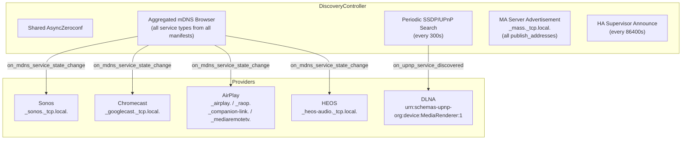
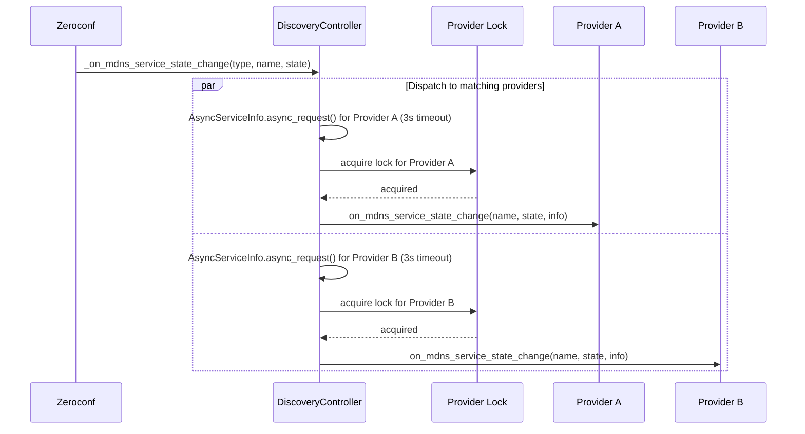
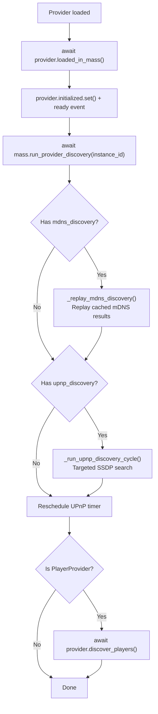

# 13 — Network Discovery

The discovery controller centralizes how Music Assistant finds devices and services on the local network. Rather than each provider running its own mDNS browser or SSDP scanner, the `DiscoveryController` owns a single shared Zeroconf instance and a single aggregated mDNS browser, routing callbacks to providers based on their manifest declarations. This shared-infrastructure approach prevents resource contention (multiple Zeroconf instances fighting over sockets) and simplifies provider development.

The in-tree [`controllers/discovery/README.md`](../../music_assistant/controllers/discovery/README.md) covers the controller's responsibilities and the provider-integration contract; this document owns the cross-cutting flows, the matching semantics, and the provider matrix.

---

## Discovery Architecture



---

## `DiscoveryController`

`DiscoveryController` (`controllers/discovery/controller.py`) extends `CoreController` with domain `"discovery"`.

### Key Attributes

| Attribute | Type | Purpose |
|---|---|---|
| `_aiozc` | `AsyncZeroconf \| None` | Shared Zeroconf instance for all consumers |
| `_mdns_browser` | `AsyncServiceBrowser \| None` | Single global browser for all service types |
| `_mass_service_info` | `AsyncServiceInfo \| None` | MA's own Zeroconf registration |
| `_mdns_locks` | `dict[str, asyncio.Lock]` | Per-provider locks serializing mDNS callbacks |
| `_upnp_locks` | `dict[str, asyncio.Lock]` | Per-provider locks serializing UPnP callbacks |
| `_upnp_run_lock` | `asyncio.Lock` | Prevents concurrent UPnP discovery cycles |
| `_mdns_waiters` | `list[asyncio.Event]` | Events signalled on every mDNS state change, so `async_find_mdns_service` can wake and re-scan the cache |

### Setup Lifecycle

During `setup(config)`:

1. Create `AsyncZeroconf` instance via `_create_aiozc(config)` (respects interface configuration)
2. Align `async_upnp_client` log level with the controller's log level
3. Set up the aggregated mDNS browser via `_setup_mdns_browser()`
4. Register the MA server as `_mass._tcp.local.` via `_register_mass_service()`
5. Subscribe `_on_core_state_updated` to `EventType.CORE_STATE_UPDATED` (#6031). The mDNS record **embeds the server info**, so renaming the server or changing its URLs has to re-register the service or the advertised record goes stale — the handler simply calls `_register_mass_service()` again, guarding on the Zeroconf instance still existing and the server not closing
6. If running as an HA add-on: announce to the Supervisor, **and** schedule the periodic re-announce
7. Schedule periodic UPnP discovery via `_schedule_periodic_upnp_discovery()`

### Teardown

During `close()`:

1. Cancel the UPnP timer (`UPNP_DISCOVERY_TIMER_ID`), the running UPnP task (`UPNP_DISCOVERY_TASK_ID`), and the HA re-announce timer (`HA_ANNOUNCE_TIMER_ID`)
2. Cancel the mDNS browser
3. Unregister the MA Zeroconf service
4. Clear all per-provider locks
5. Close and release the `AsyncZeroconf` instance

---

## Interface Selection

Configurable via `CONF_ZEROCONF_INTERFACES` with two options:

| Value | Behavior |
|---|---|
| `"default"` (default) | Use the system's default network interface |
| `"all"` | Bind to all available interfaces |

The `get_zeroconf_args()` helper (in `helpers/util.py`) inspects system network adapters via the `ifaddr` library, determines the IP version (with a macOS/FreeBSD workaround that avoids dual-stack due to broken `IPVersion.All`), and returns the appropriate interface configuration.

Multi-homed hosts (multiple NICs, VLANs, Docker bridge networks) may need `"all"` to discover devices on all subnets.

---

## mDNS Discovery

### Manifest-Driven Subscriptions

Providers declare which mDNS service types they care about in their `manifest.json`:

```json
{
  "mdns_discovery": ["_sonos._tcp.local."]
}
```

Every in-tree provider declaring `mdns_discovery`, verbatim from the manifests:

| Provider | Type | Service Types |
|---|---|---|
| `sonos` | player | `_sonos._tcp.local.` |
| `chromecast` | player | `_googlecast._tcp.local.` |
| `airplay` | player | `_companion-link._tcp.local.`, `_mediaremotetv._tcp.local.`, `_airplay._tcp.local.`, `_raop._tcp.local.` |
| `heos` | player | `_heos-audio._tcp.local.` |
| `musiccast` | player | `_http._tcp.local.` |
| `bluesound` | player | `_musc._tcp.local.`, `_musp._tcp.local.` |
| `bose_soundtouch` | player | `_soundtouch._tcp.local.` |
| `wiim` | player | `_linkplay._tcp.local.` |
| `yandex_station` | player | `_yandexio._tcp.local.` |
| `hue_entertainment` | **plugin** | `_hue._tcp.local.` |

`wiim` owns the whole `_linkplay._tcp.local.` space, not just WiiM-branded hardware, and then picks a backend per device via `is_official_device(manufacturer, model)`. Audio Pro devices always take the official SDK; a WiiM or LinkPlay manufacturer takes it only when the UPnP *model* identifies a WiiM product. Everything else — generic LinkPlay OEM gear such as the Teufel Holist S — is driven by the generic pywiim backend instead (#6223). The model check is what makes that possible: OEM devices advertise the same `Linkplay` manufacturer as WiiM's own products, so the manufacturer alone cannot tell them apart.

Two further entries deserve a note. `airplay` subscribes to **four** types, not two — the companion-link and mediaremotetv records are what make native transport controls on Apple TVs possible (#4882), alongside the RAOP/AirPlay pair used to build the player. And `musiccast` subscribes to the generic `_http._tcp.local.`, which is extremely common on a home network, so that provider does its own filtering in the callback rather than trusting the service type.

`hue_entertainment` is the only **plugin** provider using this infrastructure — a reminder that mDNS subscription is a `Provider` capability, not a `PlayerProvider` one. See [11-plugin-system.md](11-plugin-system.md#hue-lights-sync).

`_demo_player_provider` also declares a (fictional) `_demo_service_type._tcp.local.` as a template for provider authors.

### Aggregated Browser

`_setup_mdns_browser()` creates a **single** `AsyncServiceBrowser` for the union of all service types from all registered manifests (not just loaded instances — manifests are registered at startup for all known providers):

```python
self._mdns_browser = AsyncServiceBrowser(
    self.aiozc.zeroconf,
    list(all_types),
    handlers=[self._on_mdns_service_state_change],
)
```

This avoids N browsers for N providers, reducing network overhead and simplifying lifecycle management.

### Callback Routing

When a service is found, updated, or removed, `_on_mdns_service_state_change` routes the event to all **loaded, available** providers whose `manifest.mdns_discovery` includes the service type. Each provider is dispatched as a separate task:



For `Removed` events, `info` is passed as `None`. For `Added`/`Updated`, the live path creates an `AsyncServiceInfo` and resolves it with a 3-second timeout **before** taking the provider lock, then holds the lock only around the provider callback. Concurrent resolves for the same provider can therefore overlap; only the callback is serialized. (Replay holds the lock across resolve + callback — see below.)

Per-provider locks (`_mdns_locks`) serialize callbacks to a single provider instance, preventing concurrent *handling* of multiple service events from racing.

### Replay Mechanism

When a provider loads after startup, it may have missed mDNS announcements that arrived before it was ready. `_replay_mdns_discovery(provider)` addresses this by reading directly from Zeroconf's internal cache:

1. Iterate all entries in `self.aiozc.zeroconf.cache.cache`
2. Filter entries matching the provider's declared service types
3. Re-resolve each entry via `async_request` (3-second timeout)
4. Deliver as synthetic `ServiceStateChange.Added` events

The entire replay is serialized under the provider's lock to prevent interleaving with live events.

### On-Demand Lookup

Alongside the push-based callback routing, providers can *pull* a specific service when they need it synchronously:

```python
info = await mass.discovery.async_find_mdns_service(
    service_type="_raop._tcp.local.",
    name_filter=device_name,
    timeout=3.0,
)
```

`async_find_mdns_service(service_type, name_filter, timeout=3.0)` implements a **check-cache-then-wait** loop:

1. Register an `asyncio.Event` in `_mdns_waiters`.
2. Clear the event, then scan `aiozc.zeroconf.cache.cache` for an entry matching both the service type and the device name (see below). On a hit, resolve via `async_request` and return.
3. On a miss, `await` the event with the remaining deadline. `_on_mdns_service_state_change` sets every waiter's event on each incoming mDNS event, waking the loop to re-scan.
4. Return `None` once the deadline expires.

Clearing the event *before* the cache scan (rather than after) is what makes this race-free: an announcement arriving mid-scan still leaves the event set, so the next `await` returns immediately instead of blocking until timeout.

**Name matching is exact on the device-name portion**, not a substring test (#4098). Matching by "does the cache key contain the name filter?" is tempting and wrong: a lookup for a device called `Foo` would also match a different device called `ATV Foo`, and the provider would build a player from another device's records. The actual rule is:

1. the cache key must contain the (lowercased) service type, and must not *be* the bare service type — that entry is the service-type pointer record, not a device
2. take the first DNS label — everything before the first `.`
3. strip a leading RAOP MAC prefix if one is present, using `RAOP_MAC_PREFIX = re.compile(r"^[0-9a-f]{12}@")`, since RAOP names take the form `aabbccddeeff@DeviceName`
4. require the remainder to **equal** the lowercased `name_filter`

The regex is anchored to exactly twelve hex characters followed by `@`, and substitution is capped at one replacement, so a device whose name legitimately contains an `@` is not truncated. Comparison is lowercase throughout because Zeroconf cache keys are lowercased DNS names.

This whole mechanism exists because of the **AirPlay RAOP/AirPlay race** (#3546). An AirPlay device advertises `_airplay._tcp.local.` and `_raop._tcp.local.` independently, and either can arrive first. The provider needs both to build one player, so on receiving one it pulls the other on demand rather than holding partial state and hoping for a second callback.

Note that the **replay** path (`_replay_mdns_discovery`) still uses the looser "cache key contains the service type" test. That is correct there: replay wants *every* cached entry for a provider's service types, not one specific device, so there is no name to match exactly against.

---

## SSDP/UPnP Discovery

For protocols like DLNA that use UPnP rather than mDNS, the controller runs periodic SSDP search cycles.

### Manifest-Driven Subscriptions

```json
{
  "upnp_discovery": ["urn:schemas-upnp-org:device:MediaRenderer:1"]
}
```

All three in-tree providers declaring `upnp_discovery`:

| Provider | Search Target |
|---|---|
| `dlna` | `urn:schemas-upnp-org:device:MediaRenderer:1` |
| `samsung_wam` | `urn:samsung.com:device:RemoteControlReceiver:1` |
| `roku_media_assistant` | `roku:ecp` |

Note that only `dlna` uses the generic `MediaRenderer` target. `samsung_wam` (#3334) searches a vendor-specific Samsung target, and `roku_media_assistant` searches `roku:ecp` — Roku's External Control Protocol identifier — not a MediaRenderer at all.

### Periodic Cycles

UPnP discovery runs every `UPNP_DISCOVERY_INTERVAL` (300 seconds / 5 minutes) via `mass.call_later()`. The timer is managed with a dedicated task ID to prevent duplicates and is rescheduled in the `finally` block of each cycle.

### Discovery Cycle Flow

`_run_upnp_discovery_cycle(search_targets=None)`:

1. Acquire `_upnp_run_lock` (prevents concurrent cycles)
2. Collect subscriptions from loaded providers
3. For each `(search_target, providers)`:
   - Run standard multicast SSDP search via `async_upnp_client.search.async_search`
   - Optionally run a broadcast search to `255.255.255.255:1900` (when `CONF_UPNP_NETWORK_SCAN` is enabled)
4. Deduplicate results by `(usn, location, host)` tuple
5. Dispatch each result to subscribed providers via `_dispatch_upnp_discovery`

The `async_upnp_client` library is lazy-imported to avoid loading it when no UPnP providers are configured.

### Broadcast Discovery

The `CONF_UPNP_NETWORK_SCAN` option enables subnet-wide broadcast SSDP to `255.255.255.255:1900`. This is off by default because broadcast traffic can be problematic on large networks, but it helps discover devices behind certain routers that don't properly relay multicast.

---

## Server Advertisement

The controller registers the MA server itself on the local network:

```python
AsyncServiceInfo(
    "_mass._tcp.local.",
    name=f"{server_id}._mass._tcp.local.",
    addresses=[
        await get_ip_pton(address) for address in self.mass.webserver.publish_addresses
    ],
    port=self.mass.webserver.publish_port,
    properties=self.mass.get_server_info().to_dict(),
    server="mass.local.",
)
```

**The registration publishes a list of addresses, not one.** `webserver.publish_addresses` (#4646) advertises all of them, so one record can cover both IPv4 and IPv6 (and several interfaces on a multi-homed host). That matters on a dual-stack LAN, where a client would otherwise only ever see whichever single family happened to be picked.

The webserver keeps both: `publish_ip` is still the single primary address baked into `base_url`, while `publish_addresses` is computed alongside it at setup by `_get_publish_addresses(bind_ip, publish_ip, all_addresses)` — respecting a specific configured bind IP, otherwise using the host's detected addresses. The **streams** controller is unaffected and still publishes one `publish_ip`, because a player is handed exactly one stream URL; see [10-streaming-pipeline.md](10-streaming-pipeline.md#network-architecture).

The service properties include the full `ServerInfo` dict, allowing other MA instances or clients to discover the server's capabilities. On subsequent config reloads, `async_update_service` is called instead of re-registering. A `NonUniqueNameException` is handled gracefully — logged as an error — when another MA instance with the same name exists on the same LAN.

### Home Assistant Announcement

When running as an HA add-on, the controller also announces itself to the HA Supervisor via REST API:

```
POST http://supervisor/discovery
{
  "service": "music_assistant",
  "config": {
    "host": "<addon_hostname>",           # $HOSTNAME
    "port": INGRESS_SERVER_PORT,          # 8094
    "auth_token": "<ha_integration_token>"
  }
}
```

The Supervisor token comes from `$SUPERVISOR_TOKEN` and the integration token from `webserver.auth.get_homeassistant_system_user_token()`. The call is bounded at 10 seconds and a failure is logged as a warning rather than raised — a Supervisor hiccup must not fail discovery setup.

**This is not a one-shot on setup.** `_schedule_periodic_ha_announce()` re-announces every `HA_ANNOUNCE_INTERVAL` (**86400 s**, one day), rescheduling itself each time, and `close()` cancels `HA_ANNOUNCE_TIMER_ID`. The reason is token rotation, not discovery (#4620): the HA integration token has a bounded lifetime and is proactively rotated before its absolute cap, so on an instance that stays up for months the token HA holds would eventually stop working. Re-announcing daily pushes the current token back to the Supervisor, so the integration keeps authenticating without a restart. See [19-authentication.md](19-authentication.md#the-ha-integration-token).

---

## Provider Integration

### Discovery Callbacks

Providers implement these base class methods (defined in `models/provider.py`) to receive discovery events:

```python
async def on_mdns_service_state_change(
    self, name: str, state_change: ServiceStateChange,
    info: AsyncServiceInfo | None
) -> None: ...

async def on_upnp_service_discovered(
    self, search_target: str, discovery_info: CaseInsensitiveDict
) -> None: ...
```

Both are no-op by default. Providers override them to register or update players/devices.

### `discover_players()` — Provider-Specific Discovery

In addition to the shared mDNS/UPnP infrastructure, player providers can implement `discover_players()` for discovery paths that don't fit the manifest model. The base implementation is a no-op, so a purely mDNS-driven provider never needs it.

**Manual IP addresses** are the most common reason. Ten providers read the shared `CONF_ENTRY_MANUAL_DISCOVERY_IPS` config entry (`manual_discovery_ip_addresses`, advanced, multi-value STRING) and probe each address directly, so devices on unroutable subnets or with mDNS blocked still register:

`sonos`, `sonos_s1`, `chromecast`, `sendspin`, `wiim`, `mpd`, `roku_media_assistant`, `bose_soundtouch`, `samsung_wam`, `fully_kiosk`.

Note that this composes with network discovery rather than replacing it — `bose_soundtouch` and `wiim` do both mDNS *and* manual IPs, and `chromecast` feeds its manual list into PyChromecast as `known_hosts`. Sendspin gained the setting in #3846.

Beyond manual IPs, each of these providers discovers in a way the manifest cannot express:

| Provider | Mechanism |
|---|---|
| `heos` | mDNS finds **one controller**; `discover_players()` then asks it to enumerate every device on the HEOS network. The mDNS callback short-circuits once a controller is set up, so extra announcements are ignored |
| `chromecast` | Owns a PyChromecast `CastBrowser` constructed against the shared `mass.discovery.aiozc.zeroconf` instance — so it gets its own listener semantics without a second Zeroconf. `discover_players()` starts it in an executor, since `start_discovery` is blocking |
| `yandex_station` | Two-phase (#3605): the **Quasar cloud API** enumerates the account's devices in `discover_players()` (requires session cookies derived from an `x_token`), while local control arrives over mDNS through the manifest |
| `amplipi` | mDNS (`_amplipi._tcp.local.`) only **prefills the controller host during setup** (#6206); it registers no players itself. `discover_players()` then registers each non-disabled **zone** of the already-polled controller status as a player. A background `_poll_loop` keeps that status fresh |
| `sendspin` | Devices arrive over Sendspin's own server protocol plus a pairing flow, with manual IPs as a fallback. It declares **no** `mdns_discovery` and implements no `discover_players()` |
| `msx_bridge` | `discover_players()` is deliberately **empty** — Media Station X players register on demand via `get_or_register_player()` when a TV first connects |
| `sync_group`, `universal_group`, `universal_player` | No network discovery. `discover_players()` reads stored player configs and re-registers the virtual players by id prefix (`syncgroup_`, `ugp_`, and `up` — constant names `SGP_PREFIX` / `UGP_PREFIX` / `UNIVERSAL_PLAYER_PREFIX`). `universal_player` also includes unavailable and disabled configs, since those players are created by the `PlayerController` rather than discovered |

Two providers that look like they belong here but don't: `ariacast_receiver` is a **plugin** with no network discovery of its own (it runs a protocol server that senders connect *to*), and `teddycloud` is a **music** provider. Neither registers players.

`local_audio` used to appear in this table, enumerating the host's own soundcards. It was retired in #5965 and has no discovery — or implementation — left; see [15-provider-lifecycle.md](15-provider-lifecycle.md#retired-providers).

### The Two-Phase Discovery Flow

There are **two methods with the same name**, at different levels:

| Method | Takes | Does |
|---|---|---|
| `mass.run_provider_discovery(instance_id: str)` | An instance **id**, resolved internally (raises `KeyError` if unknown) | Calls the controller method below, then `discover_players()` when the provider is a `PlayerProvider` |
| `discovery.run_provider_discovery(provider)` | The provider **instance** | mDNS replay, then a targeted UPnP cycle, then reschedules the periodic UPnP timer |

Callers use the `mass` one; only it knows about players.



**The whole chain is a single fire-and-forget task, but the steps inside it are strictly sequential.** `_load_provider` wraps it in `create_task(_on_provider_loaded())` so the load path is not blocked and `PROVIDERS_UPDATED` can be signalled immediately — but inside that task every step is awaited in order. A provider is therefore guaranteed to have completed `loaded_in_mass()` before any discovery runs, and completed the shared mDNS/UPnP phase before `discover_players()` is called. That ordering is what lets `heos` rely on its mDNS controller being present by the time it enumerates devices. For the full provider loading lifecycle, see [15-provider-lifecycle.md](15-provider-lifecycle.md#loading-flow).

### Player Enable Trigger

When a player is enabled via config, the default `on_player_enabled` (in `models/player_provider.py`) schedules `mass.run_provider_discovery(instance_id)` with a 5-second delay under the task id `discover_players_{instance_id}`. The fixed task id is doing real work: `call_later` cancels any existing timer with the same id, so it **debounces**. Enabling several players in quick succession from the UI resets the 5-second timer each time and results in one discovery pass after things go quiet, rather than one per player. Providers are free to override the method with something cheaper.

### Provider Unload

When a provider unloads, `discovery.on_provider_unload(instance_id)` clears the provider's mDNS and UPnP locks and reschedules the UPnP timer (in case no subscriptions remain).

---

## Key Files

| File | Purpose |
|---|---|
| [`music_assistant/controllers/discovery/controller.py`](../../music_assistant/controllers/discovery/controller.py) | `DiscoveryController` — shared Zeroconf, mDNS browser, `async_find_mdns_service`, `RAOP_MAC_PREFIX`, SSDP cycles, `_register_mass_service`, `_announce_to_homeassistant` |
| [`music_assistant/controllers/discovery/README.md`](../../music_assistant/controllers/discovery/README.md) | In-tree overview: responsibilities and the provider-integration contract |
| [`music_assistant/models/provider.py`](../../music_assistant/models/provider.py) | `on_mdns_service_state_change`, `on_upnp_service_discovered` — base callbacks |
| [`music_assistant/models/player_provider.py`](../../music_assistant/models/player_provider.py) | `discover_players()`, `on_player_enabled` — provider-specific discovery |
| [`music_assistant/helpers/util.py`](../../music_assistant/helpers/util.py) | `get_zeroconf_args()` — interface selection logic |
| [`music_assistant/mass.py`](../../music_assistant/mass.py) | `run_provider_discovery(instance_id)` — orchestration including `discover_players()`; `_on_provider_loaded` sequencing |
| [`music_assistant/constants.py`](../../music_assistant/constants.py) | `INGRESS_SERVER_PORT`, `CONF_ENTRY_MANUAL_DISCOVERY_IPS`, `DEFAULT_PROVIDERS` |
| Provider `manifest.json` files | `mdns_discovery`, `upnp_discovery` — subscription declarations |
