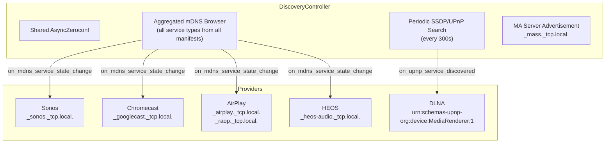
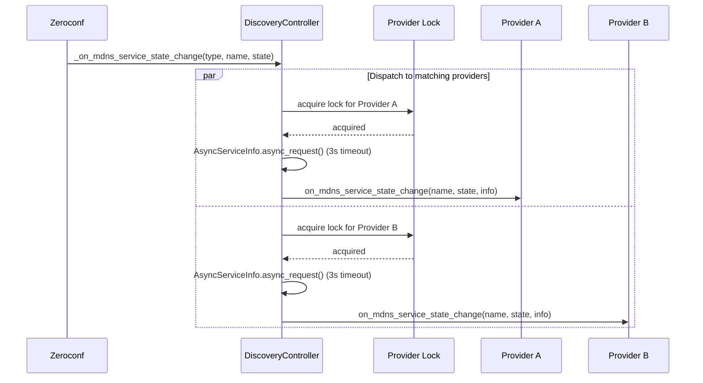
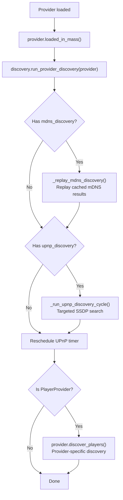

# 13 — Network Discovery

The discovery controller centralizes how Music Assistant finds devices and services on the local network. Rather than each provider running its own mDNS browser or SSDP scanner, the `DiscoveryController` owns a single shared Zeroconf instance and a single aggregated mDNS browser, routing callbacks to providers based on their manifest declarations. This shared-infrastructure approach prevents resource contention (multiple Zeroconf instances fighting over sockets) and simplifies provider development.

---

## Discovery Architecture



---

## `DiscoveryController`

`DiscoveryController` (`controllers/discovery/controller.py`) extends `CoreController` with domain `"discovery"`.

### Key Attributes

| Attribute | Type | Purpose |
|---|---|---|
| `_aiozc` | `AsyncZeroconf \| None` | Shared Zeroconf instance for all consumers |
| `_mdns_browser` | `AsyncServiceBrowser \| None` | Single global browser for all service types |
| `_mass_service_info` | `AsyncServiceInfo \| None` | MA's own Zeroconf registration |
| `_mdns_locks` | `dict[str, asyncio.Lock]` | Per-provider locks serializing mDNS callbacks |
| `_upnp_locks` | `dict[str, asyncio.Lock]` | Per-provider locks serializing UPnP callbacks |
| `_upnp_run_lock` | `asyncio.Lock` | Prevents concurrent UPnP discovery cycles |
| `_mdns_waiters` | `list[asyncio.Event]` | Events signalled on every mDNS state change, so `async_find_mdns_service` can wake and re-scan the cache |

### Setup Lifecycle

During `setup(config)`:

1. Create `AsyncZeroconf` instance via `_create_aiozc(config)` (respects interface configuration)
2. Align `async_upnp_client` log level with the controller's log level
3. Set up the aggregated mDNS browser via `_setup_mdns_browser()`
4. Register the MA server as `_mass._tcp.local.` via `_register_mass_service()`
5. Announce to Home Assistant Supervisor if running as HA add-on
6. Schedule periodic UPnP discovery via `_schedule_periodic_upnp_discovery()`

### Teardown

During `close()`:

1. Cancel UPnP timer and running discovery task
2. Cancel the mDNS browser
3. Unregister the MA Zeroconf service
4. Clear all per-provider locks
5. Close and release the `AsyncZeroconf` instance

---

## Interface Selection

Configurable via `CONF_ZEROCONF_INTERFACES` with two options:

| Value | Behavior |
|---|---|
| `"default"` (default) | Use the system's default network interface |
| `"all"` | Bind to all available interfaces |

The `get_zeroconf_args()` helper (in `helpers/util.py`) inspects system network adapters via the `ifaddr` library, determines the IP version (with a macOS/FreeBSD workaround that avoids dual-stack due to broken `IPVersion.All`), and returns the appropriate interface configuration.

Multi-homed hosts (multiple NICs, VLANs, Docker bridge networks) may need `"all"` to discover devices on all subnets.

---

## mDNS Discovery

### Manifest-Driven Subscriptions

Providers declare which mDNS service types they care about in their `manifest.json`:

```json
{
  "mdns_discovery": ["_sonos._tcp.local."]
}
```

Examples from the codebase:

| Provider | Service Types |
|---|---|
| Sonos | `_sonos._tcp.local.` |
| Chromecast | `_googlecast._tcp.local.` |
| AirPlay | `_airplay._tcp.local.`, `_raop._tcp.local.` |
| HEOS | `_heos-audio._tcp.local.` |
| MusicCast | `_http._tcp.local.` |
| Bluesound | *(via mDNS)* |

### Aggregated Browser

`_setup_mdns_browser()` creates a **single** `AsyncServiceBrowser` for the union of all service types from all registered manifests (not just loaded instances — manifests are registered at startup for all known providers):

```python
self._mdns_browser = AsyncServiceBrowser(
    self.aiozc.zeroconf,
    list(all_types),
    handlers=[self._on_mdns_service_state_change],
)
```

This avoids N browsers for N providers, reducing network overhead and simplifying lifecycle management.

### Callback Routing

When a service is found, updated, or removed, `_on_mdns_service_state_change` routes the event to all **loaded, available** providers whose `manifest.mdns_discovery` includes the service type. Each provider is dispatched as a separate task:



For `Removed` events, `info` is passed as `None`. For `Added`/`Updated`, the controller creates an `AsyncServiceInfo` and resolves it with a 3-second timeout before passing to the provider.

Per-provider locks (`_mdns_locks`) serialize callbacks to a single provider instance, preventing concurrent handling of multiple service events from racing.

### Replay Mechanism

When a provider loads after startup, it may have missed mDNS announcements that arrived before it was ready. `_replay_mdns_discovery(provider)` addresses this by reading directly from Zeroconf's internal cache:

1. Iterate all entries in `self.aiozc.zeroconf.cache.cache`
2. Filter entries matching the provider's declared service types
3. Re-resolve each entry via `async_request` (3-second timeout)
4. Deliver as synthetic `ServiceStateChange.Added` events

The entire replay is serialized under the provider's lock to prevent interleaving with live events.

### On-Demand Lookup

Alongside the push-based callback routing, providers can *pull* a specific service when they need it synchronously:

```python
info = await mass.discovery.async_find_mdns_service(
    service_type="_raop._tcp.local.",
    name_filter=device_name,
    timeout=3.0,
)
```

`async_find_mdns_service(service_type, name_filter, timeout=3.0)` implements a **check-cache-then-wait** loop:

1. Register an `asyncio.Event` in `_mdns_waiters`.
2. Clear the event, then scan `aiozc.zeroconf.cache.cache` for an entry whose lowercased name contains both `service_type` and `name_filter` (cache keys are lowercased DNS names, so matching is case-insensitive). On a hit, resolve via `async_request` and return.
3. On a miss, `await` the event with the remaining deadline. `_on_mdns_service_state_change` sets every waiter's event on each incoming mDNS event, waking the loop to re-scan.
4. Return `None` once the deadline expires.

Clearing the event *before* the cache scan (rather than after) is what makes this race-free: an announcement arriving mid-scan still leaves the event set, so the next `await` returns immediately instead of blocking until timeout.

This exists because of the **AirPlay RAOP/AirPlay race** (#3546). An AirPlay device advertises `_airplay._tcp.local.` and `_raop._tcp.local.` independently, and either can arrive first. The provider needs both to build one player, so on receiving one it pulls the other on demand rather than holding partial state and hoping for a second callback.

---

## SSDP/UPnP Discovery

For protocols like DLNA that use UPnP rather than mDNS, the controller runs periodic SSDP search cycles.

### Manifest-Driven Subscriptions

```json
{
  "upnp_discovery": ["urn:schemas-upnp-org:device:MediaRenderer:1"]
}
```

| Provider | Search Target |
|---|---|
| DLNA | `urn:schemas-upnp-org:device:MediaRenderer:1` |
| Roku | *(via UPnP)* |

### Periodic Cycles

UPnP discovery runs every `UPNP_DISCOVERY_INTERVAL` (300 seconds / 5 minutes) via `mass.call_later()`. The timer is managed with a dedicated task ID to prevent duplicates and is rescheduled in the `finally` block of each cycle.

### Discovery Cycle Flow

`_run_upnp_discovery_cycle(search_targets=None)`:

1. Acquire `_upnp_run_lock` (prevents concurrent cycles)
2. Collect subscriptions from loaded providers
3. For each `(search_target, providers)`:
   - Run standard multicast SSDP search via `async_upnp_client.search.async_search`
   - Optionally run a broadcast search to `255.255.255.255:1900` (when `CONF_UPNP_NETWORK_SCAN` is enabled)
4. Deduplicate results by `(usn, location, host)` tuple
5. Dispatch each result to subscribed providers via `_dispatch_upnp_discovery`

The `async_upnp_client` library is lazy-imported to avoid loading it when no UPnP providers are configured.

### Broadcast Discovery

The `CONF_UPNP_NETWORK_SCAN` option enables subnet-wide broadcast SSDP to `255.255.255.255:1900`. This is off by default because broadcast traffic can be problematic on large networks, but it helps discover devices behind certain routers that don't properly relay multicast.

---

## Server Advertisement

The controller registers the MA server itself on the local network:

```python
AsyncServiceInfo(
    "_mass._tcp.local.",
    name=f"{server_id}._mass._tcp.local.",
    addresses=[await get_ip_pton(self.mass.webserver.publish_ip)],
    port=self.mass.webserver.publish_port,
    properties=self.mass.get_server_info().to_dict(),
    server="mass.local.",
)
```

The service properties include the full `ServerInfo` dict, allowing other MA instances or clients to discover the server's capabilities. On subsequent config reloads, `async_update_service` is called instead of re-registering. A `NonUniqueNameException` is handled gracefully when another MA instance exists on the same LAN.

### Home Assistant Announcement

When running as an HA add-on, the controller also announces itself to the HA Supervisor via REST API:

```
POST http://supervisor/discovery
{
  "service": "music_assistant",
  "config": {
    "host": "<addon_hostname>",
    "port": 8094,
    "auth_token": "<ha_integration_token>"
  }
}
```

This enables automatic discovery of the MA add-on by the Home Assistant integration.

---

## Provider Integration

### Discovery Callbacks

Providers implement these base class methods (defined in `models/provider.py`) to receive discovery events:

```python
async def on_mdns_service_state_change(
    self, name: str, state_change: ServiceStateChange,
    info: AsyncServiceInfo | None
) -> None: ...

async def on_upnp_service_discovered(
    self, search_target: str, discovery_info: CaseInsensitiveDict
) -> None: ...
```

Both are no-op by default. Providers override them to register or update players/devices.

### `discover_players()` — Provider-Specific Discovery

In addition to the shared mDNS/UPnP infrastructure, player providers can implement `discover_players()` for discovery paths that don't fit the manifest model:

| Pattern | Example | Why not manifest-driven |
|---|---|---|
| Manual IP addresses | Sonos, Sonos S1, Chromecast, Sendspin, WiiM, MPD, Roku, Bose SoundTouch, Samsung WAM, Fully Kiosk | User-configured IPs bypass network discovery entirely. Shared via the `CONF_ENTRY_MANUAL_DISCOVERY_IPS` config entry (`manual_discovery_ip_addresses`, advanced, multi-value STRING). Providers read it in `discover_players()` and probe each address directly, so devices on unroutable subnets or with mDNS blocked still register. Sendspin gained support in #3846. |
| Controller-side enumeration | HEOS | mDNS finds the controller; `discover_players()` queries it for all devices |
| Library-based discovery | Chromecast | Delegates to PyChromecast's own Zeroconf browser |
| Config-driven virtual players | Sync Group | No network discovery — reads stored player configs |

### The Two-Phase Discovery Flow

When a provider loads, `mass.run_provider_discovery()` triggers a two-phase sequence:



This runs as a fire-and-forget task, so discovery does not block the provider load path. For the full provider loading lifecycle, see [15-provider-lifecycle.md](15-provider-lifecycle.md).

### Player Enable Trigger

When a player is enabled via config, `on_player_enabled` (in `models/player_provider.py`) schedules a `run_provider_discovery` call with a 5-second delay, re-triggering the full two-phase discovery for that provider.

### Provider Unload

When a provider unloads, `discovery.on_provider_unload(instance_id)` clears the provider's mDNS and UPnP locks and reschedules the UPnP timer (in case no subscriptions remain).

---

## Key Files

| File | Purpose |
|---|---|
| [`music_assistant/controllers/discovery/controller.py`](../../music_assistant/controllers/discovery/controller.py) | `DiscoveryController` — shared Zeroconf, mDNS browser, SSDP cycles |
| [`music_assistant/models/provider.py`](../../music_assistant/models/provider.py) | `on_mdns_service_state_change`, `on_upnp_service_discovered` — base callbacks |
| [`music_assistant/models/player_provider.py`](../../music_assistant/models/player_provider.py) | `discover_players()`, `on_player_enabled` — provider-specific discovery |
| [`music_assistant/helpers/util.py`](../../music_assistant/helpers/util.py) | `get_zeroconf_args()` — interface selection logic |
| [`music_assistant/mass.py`](../../music_assistant/mass.py) | `run_provider_discovery()` — two-phase discovery orchestration |
| Provider `manifest.json` files | `mdns_discovery`, `upnp_discovery` — subscription declarations |
