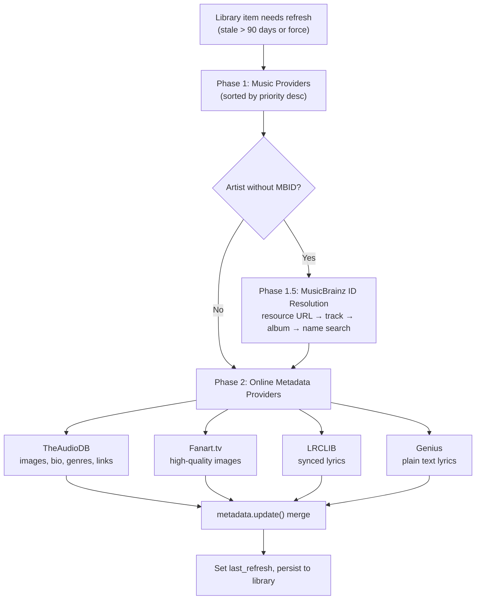

# 14 — Metadata Enrichment

The metadata system enriches library items (see [08-media-library.md](08-media-library.md)) with artwork, biographies, lyrics, genre tags, and external identifiers by orchestrating queries across both music providers and dedicated metadata providers. The `MetaDataController` follows a two-phase priority model: music providers are checked first (they often supply their own artwork), then online metadata providers fill the gaps. A built-in image proxy with thumbnail caching handles serving and resizing images for the frontend.

---

## Enrichment Architecture



---

## `MetaDataController`

`MetaDataController` (`controllers/metadata.py`) extends `CoreController` with domain `"metadata"`.

### Configuration

| Key | Type | Default | Purpose |
|---|---|---|---|
| `CONF_LANGUAGE` | STRING | `"en_US"` | Preferred locale for metadata (30+ options) |
| `CONF_ENABLE_ONLINE_METADATA` | BOOLEAN | `True` | Toggle online provider queries |
| `CONF_PREFER_LOCAL_GENRES` | BOOLEAN | `False` | When on, online providers' genres are masked off items that already have a local genre (file tag/NFO). Items without a local genre still receive online genres. (#3815) |
| `CONF_ENABLE_RADIO_METADATA_LOOKUP` | BOOLEAN | `True` | When off, radio streams skip the artist/track artwork lookup and show only the station logo. (#3741) |
| `CONF_THUMB_CACHE_MAX_SIZE` | INTEGER | `500` (MB) | Max disk cache for thumbnails (50-5000 range) |

### Setup and Lifecycle

- **`setup(config)`**: Silences PIL logger, creates `collage_images/` directory under `mass.cache_path`
- **`post_setup()`**: Registers the `/imageproxy` HTTP route on the streams server and schedules maintenance tasks
- **`close()`**: Unregisters the `/imageproxy` route

### Core Entry Point: `update_metadata`

`update_metadata(item, force_refresh=False)` (API: `metadata/update_metadata`) is the main enrichment entry point. It accepts a URI string or a `MediaItemType` and dispatches to type-specific handlers:

| Media Type | Handler | Notes |
|---|---|---|
| Artist | `_update_artist_metadata` | Includes MusicBrainz ID resolution |
| Album | `_update_album_metadata` | Also fills year and album_type |
| Track | `_update_track_metadata` | — |
| Playlist | `_update_playlist_metadata` | Generates collage images |
| Audiobook | `_update_audiobook_metadata` | Fills publisher, authors, narrators, duration |
| Podcast | `_update_podcast_metadata` | Fills publisher, total_episodes |

Calls are rate-limited through a `Throttler(1, 30)` (1 request per 30-second window) to avoid overwhelming external APIs.

### Refresh Gating

All enrichment methods check whether the item's `metadata.last_refresh` is older than `REFRESH_INTERVAL` (90 days). If the item is fresh and `force_refresh` is not set, enrichment is skipped. The `schedule_update_metadata(item)` method uses this check to create deterministic background tasks (via `uuid5(NAMESPACE_URL, uri)`) submitted to the tasks controller.

---

## The Two-Phase Priority Model

### Phase 1: Music Providers

Music providers are checked first because they often supply their own artwork (streaming services like Spotify and Tidal have comprehensive image libraries):

1. Iterate `item.provider_mappings` sorted by **priority descending** (local filesystem providers get higher priority than streaming providers)
2. For each mapping, call `get_provider_item()` to fetch the full item from the provider
3. Merge the provider's metadata via `item.metadata.update(prov_item.metadata)` — this fills in any missing fields without overwriting existing values
4. Use each streaming provider's `domain` as a dedup key (same catalog across instances) but local providers' `instance_id` (each instance may have different metadata)

### Phase 1.5: MusicBrainz ID Resolution (Artists Only)

Many online metadata providers require a MusicBrainz ID (MBID) to look up an artist. If `artist.mbid` is still unset after Phase 1, the controller tries multiple strategies through the MusicBrainz provider:

1. **Resource URL lookup**: Streaming providers share URLs that MusicBrainz maps via its URL relations (e.g., a Spotify artist URL → MB artist ID)
2. **Track recording ID**: If any of the artist's tracks have a MusicBrainz recording ID, look up the artist from that
3. **Album release group ID**: Same approach via the artist's albums
4. **Name-based search**: Fall back to searching by artist name, optionally constrained by album/track names

### Phase 2: Online Metadata Providers

If `CONF_ENABLE_ONLINE_METADATA` is enabled, the controller iterates all loaded `MetadataProvider` instances:

- For **artists**: Requires `artist.mbid` to be set (skipped if MusicBrainz resolution failed)
- For **albums**: No MBID requirement — providers handle their own lookups
- For **tracks**: Always attempted if online metadata is enabled

Each provider is checked for the relevant `ProviderFeature` flag (`ARTIST_METADATA`, `ALBUM_METADATA`, `TRACK_METADATA`, `LYRICS`), and its returned `MediaItemMetadata` is merged via `update()`.

**Provider order**: `MetadataProvider.priority` (default `50`, lower wins) determines iteration order — the controller's `providers` property sorts by it (#3623). The iTunes Artwork provider sets `priority = 30` so it runs before the default-priority providers; the rest currently use the default and effectively iterate in load order.

**Local-genre masking**: When `CONF_PREFER_LOCAL_GENRES` is enabled and the item already has a non-empty `metadata.genres`, each online provider's response is shallow-cloned with `dataclasses.replace(metadata, genres=None)` before merging. Other fields merge normally — only the `genres` set is shielded. (#3815)

---

## Metadata Providers

### `MetadataProvider` ABC

Defined in `models/metadata_provider.py`, this base class provides the interface:

```python
async def get_artist_metadata(self, artist: Artist) -> MediaItemMetadata | None: ...
async def get_album_metadata(self, album: Album) -> MediaItemMetadata | None: ...
async def get_track_metadata(self, track: Track) -> MediaItemMetadata | None: ...
async def resolve_image(self, path: str) -> str | bytes: ...
```

Each method checks whether the corresponding `ProviderFeature` is declared. If the feature is declared but the method isn't overridden, `NotImplementedError` is raised. If the feature isn't declared, `None` is returned silently.

### Provider Capabilities

| Provider | Domain | Features | Lookup Key | Cache TTL | Throttle |
|---|---|---|---|---|---|
| **MusicBrainz** | `musicbrainz` | *(utility — no standard features)* | Artist name + tracks/albums | 30 days | 5 req/s |
| **TheAudioDB** | `theaudiodb` | `ARTIST`, `ALBUM`, `TRACK` | MBID (artist), RG-MBID or name (album) | 90 days | 1 req/s |
| **Fanart.tv** | `fanarttv` | `ARTIST`, `ALBUM` | MBID (artist), RG-MBID (album) | 60 days | 1/30s (or 1/s with VIP key) |
| **iTunes Artwork** | `itunes_artwork` | `ALBUM` | UPC/EAN barcode (via `ExternalID.BARCODE`; `MusicBrainzReleaseGroup.barcode` is captured for RG lookups) | 30 days | *(uncapped)* |
| **Genius Lyrics** | `genius_lyrics` | `TRACK`, `LYRICS` | Artist name + track name | 7 days | *(library-managed)* |
| **LRCLIB** | `lrclib` | `TRACK`, `LYRICS` | Artist + track + album + duration | 14 days | 1/30s (or 1/s custom API) |

### What Each Provider Contributes

| Data Type | TheAudioDB | Fanart.tv | iTunes | Genius | LRCLIB |
|---|---|---|---|---|---|
| Artist images (thumb, logo, banner, fanart, cutout, clearart, landscape) | Yes (up to 10 variants per type) | Yes (thumb, logo, banner, fanart) | — | — | — |
| Album images (thumb, disc art) | Yes (including HQ, 3D variants) | Yes | Yes (thumb only, 1500×1500) | — | — |
| Track images | Yes (thumb) | — | — | — | — |
| Biography/description | Yes (localized) | — | — | — | — |
| External links (website, social) | Yes | — | — | — | — |
| Genre/style/mood | Yes | — | — | — | — |
| Plain text lyrics | Yes | — | — | Yes | Yes (fallback) |
| Synced lyrics (LRC) | — | — | — | — | Yes (preferred) |
| Album review | Yes | — | — | — | — |
| MBID backfill | Yes (artist + album RG) | — | — | — | — |

### MusicBrainz — The Utility Provider

MusicBrainz is unique: it declares no standard metadata features and is never iterated during Phase 2. Instead, it's called directly by the controller for ID resolution during Phase 1.5. It uses a custom mirror (`musicbrainz-mirror.music-assistant.io`) with a higher rate limit (5 req/s vs the public API's 1 req/s) and 30-day caching.

Key data models: `MusicBrainzArtist`, `MusicBrainzRecording`, `MusicBrainzRelease`, `MusicBrainzReleaseGroup` — all dataclasses with mashumaro serialization.

### TheAudioDB

The most comprehensive metadata provider. Uses MBID for artist lookup, MusicBrainz release group ID for albums (falling back to name search), and MBID or name search for tracks. Provides localized content using the controller's preferred language. As a side effect, it can backfill MBIDs on artists and release group IDs on albums when discovered during lookups.

### Fanart.tv

Purely image-focused — no text metadata. Requires MBIDs for all lookups. Optional VIP `client_key` unlocks a faster throttle (1 req/s vs 1 req/30s).

### Lyrics Providers

**LRCLIB** provides synced lyrics (LRC format with timestamps) and requires track duration for matching. **Genius** provides plain text lyrics via the `lyricsgenius` library (blocking, wrapped in `asyncio.to_thread`). The `get_track_lyrics()` method (API: `metadata/get_track_lyrics`) resolves lyrics through a multi-step chain: (1) check existing track metadata, (2) for library tracks, trigger a metadata update, (3) try the track's own music provider (if it supports `ProviderFeature.LYRICS`), (4) iterate all loaded metadata providers with `LYRICS` support in load order. The order of LRCLIB vs Genius in step 4 depends on provider load order, not a hardcoded sequence.

---

## Image Proxy System

The image proxy handles serving, resizing, and caching images for the frontend. The `/imageproxy` endpoint is mounted on **both** the streams server (port 8097) and the main webserver (port 8095) — `get_image_url()` selects which base URL to use via the `prefer_stream_server` parameter (webserver by default, streams server when `prefer_stream_server=True`).

### URL Generation

`get_image_url(image, size, prefer_proxy, image_format)` determines whether to proxy an image:
- SVGs: returned as-is (no resizing)
- Images needing resize or not directly accessible: routed through the proxy URL
- Otherwise: the raw `image.path` is returned

Proxy URLs follow the format: `{base_url}/imageproxy?provider={}&size={}&fmt={}&path={}` (path is double-URL-encoded).

### Image Resolution Chain

`get_image_url_for_item(media_item, img_type)` resolves images with a fallback chain:
- Track → Track's Album → Album's Artists → Track's Artists

### Thumbnail Caching

Two-tier cache in `helpers/images.py`:

| Tier | Capacity | Key |
|---|---|---|
| In-memory | 50 entries (LRU via `OrderedDict`) | `SHA256("{provider}/{path_or_url}")_{size}.{ext}` |
| On-disk | Configurable (default 500 MB) | Same key, stored in `{cache_path}/thumbnails/` |

`get_image_thumb()` checks memory → disk → generates via PIL (`Image.thumbnail` with Lanczos resampling, quality 95). Concurrent requests for the same thumbnail are deduplicated via a shared task (task ID = `thumb.{cache_filename}`).

### Image Data Resolution

`get_image_data(path_or_url, provider)` resolves raw image bytes through a chain with max recursion depth 5:
1. Provider's `resolve_image()` — may return bytes directly or a new path
2. HTTP URLs — fetched via `http_session_no_ssl` (detects self-referencing imageproxy URLs and recurses)
3. `data:image` base64 URIs — decoded directly
4. Local files (`.jpg/.png/.jpeg/.svg`) — read via `aiofiles`
5. Embedded artwork — extracted via ffmpeg

### Collage Images

For playlists, the controller generates collage thumbnails:
- Collects images from playlist tracks (minimum 3 for thumb, 8 for fanart)
- Randomly samples up to 50 images
- Creates a grid of 250×250 tiles: 1500×1500 for thumbnails, 2500×1750 for fanart
- Saved to `{cache_path}/collage_images/{filename}`
- Only regenerated if no user-set image exists

---

## Radio Stream Artwork

When a radio stream produces ICY/HLS in-band metadata containing an `artist - title` pair, the streams controller hands the `StreamDetails` to `MetaDataController.update_radio_stream_artwork(streamdetails)`. The full lookup pipeline is dedicated to enriching now-playing display when the station itself only carries text. (#3110)

### Entry Point

`update_radio_stream_artwork(streamdetails)` is gated by `CONF_ENABLE_RADIO_METADATA_LOOKUP` (default on; #3741). When enabled, it calls `get_image_url_by_name(artist_name, track_name, fallback_image_url=…)` to resolve an image URL plus optional corrected `artist`/`track` (the helper detects "Track - Artist" swaps). On a successful resolution, it updates `streamdetails.stream_metadata` and signals the active queue.

### Lookup Pipeline

1. **Filtering**: artist names matching `AD_DETECTION_PHRASES` (`"asset link"`, `"asset stop"`, `"asset spot"`, `"advert"`, `"promo"`) are short-circuited to the fallback image — these are commercial breaks, not music.
2. **Cache check**: results are cached under `CACHE_CATEGORY_RADIO_ARTWORK` (`= 101`) keyed by `f"{artist_name.lower()}|{track_name.lower()}"`. Hits store for 90 days (`CACHE_EXPIRATION_RADIO_ARTWORK`); misses store for 7 days (`CACHE_EXPIRATION_RADIO_ARTWORK_MISS`) — the asymmetric TTL prevents repeatedly hammering MusicBrainz/etc. for the same dead lookup.
3. **Library-first**: `_get_library_track_metadata`, `_get_library_artist_metadata`, and `_get_library_item_thumb` check the user's existing library before reaching out — if the user already owns the track, the local artwork is preferred.
4. **External fallback**: `get_track_metadata_by_name` searches MusicBrainz with name variants (via `_search_musicbrainz_with_variants` for swapped/punctuated forms), then `_get_release_group_artwork` walks `self.providers` in priority order. Because the controller sorts by `MetadataProvider.priority` (#3623), **iTunes Artwork (priority 30) is checked before Fanart.tv (default priority 50)** — iTunes succeeds when the release group has a barcode; Fanart.tv handles the cases iTunes can't.
5. **Station logo fallback**: `get_radio_stream_station_image(streamdetails)` returns the station's own logo when track-level lookup yields nothing.

### Callers

`controllers/streams/audio.py` reaches `update_radio_stream_artwork` along three paths, all of which funnel through the internal `_update_radio_stream_metadata(streamdetails, artist, title, …)` helper:

- **ICY** (Shoutcast/Icecast `StreamTitle`): when in-band metadata is parsed and contains a `"Artist - Title"` pair, the audio loop calls `_update_radio_stream_metadata` directly.
- **OGG** (in-band Vorbis comments via the chained-OGG handler): when the metadata callback fires with new artist/title, the audio loop calls `_update_radio_stream_metadata` directly.
- **HLS**: `_update_hls_radio_metadata` is registered as `streamdetails.stream_metadata_update_callback` with a 5-second interval; it polls the playlist for fresh metadata and forwards new tracks into `_update_radio_stream_metadata`.

`_update_radio_stream_metadata` updates `streamdetails.stream_metadata` and signals the queue, then schedules `update_radio_stream_artwork` via `mass.call_later(0.2, ..., task_id=f"update_radio_artwork_{queue_id}")`. The 0.2 s debounce + per-queue task ID coalesces rapid metadata flaps into a single artwork lookup.

---

## Genre Handling

`GenreController` (`controllers/media/genres.py`) manages genre entities as library-only items with an alias-based matching system.

### Genre Alias System

Each genre has a JSON array of aliases (e.g., "Rock" includes "classic rock", "hard rock", "alternative rock"). When media items are scanned, their raw genre strings are normalized (via `create_safe_string`) and matched against these aliases.

Default genres and aliases are loaded from `helpers/resources/genres/genre_mapping.json`. Genre icons are SVG files at `helpers/resources/genres/{translation_key}.svg`.

### Database Schema

| Table | Purpose |
|---|---|
| `genres` | Genre records with name, sort_name, translation_key, aliases, is_default, is_excluded |
| `genre_media_item_mapping` | N:N relationship: `(genre_id, media_id, media_type, alias, is_derived)` |
| `genre_media_item_exclusion` | User-excluded genre-to-media pairs |

### Genre Scanning Pipeline

Triggered by library sync completion (`EventType.MUSIC_SYNC_COMPLETED`), manual API call, or daily at 4:00 AM:

1. `_cleanup_stale_genre_mappings()` — removes mappings where the alias no longer appears in the item's metadata
2. Extract all unique genre names from all media tables via SQL `json_each()`
3. Match each name against the alias lookup table
4. Bulk insert/replace into `genre_media_item_mapping`
5. `_propagate_genre_mappings_to_parents()` — for filesystem providers with `propagate_track_genres`, inherits track genres onto albums and artists (marked `is_derived=1`)

---

## Maintenance Tasks

Registered in `_register_maintenance_tasks()`, all scheduled daily at 4:00 AM local time (converted to UTC):

| Task | Handler | Behavior |
|---|---|---|
| Missing artist metadata scan | `_scan_missing_artist_metadata` | Finds artists missing images **or** description with no `last_refresh`, processes batch of 5 (#3595) |
| Playlist metadata refresh | `_refresh_playlist_metadata_batch` | Finds playlists needing refresh, processes batch of 5 |
| Thumbnail cache cleanup | `_cleanup_thumb_cache` | Removes oldest thumbnails when cache exceeds configured max size |

---

## Key Files

| File | Purpose |
|---|---|
| [`music_assistant/controllers/metadata.py`](../../music_assistant/controllers/metadata.py) | `MetaDataController` — orchestration, enrichment, image proxy, collage generation |
| [`music_assistant/models/metadata_provider.py`](../../music_assistant/models/metadata_provider.py) | `MetadataProvider` ABC — provider interface |
| [`music_assistant/providers/theaudiodb/`](../../music_assistant/providers/theaudiodb/) | Artist/album/track images, bios, genres, links |
| [`music_assistant/providers/musicbrainz/`](../../music_assistant/providers/musicbrainz/) | MusicBrainz ID resolution, release matching |
| [`music_assistant/providers/fanarttv/`](../../music_assistant/providers/fanarttv/) | High-quality fan art and logos |
| [`music_assistant/providers/itunes_artwork/`](../../music_assistant/providers/itunes_artwork/) | High-resolution album artwork from the iTunes catalog (UPC barcode lookup, 30-day cache, priority 30) |
| [`music_assistant/providers/genius_lyrics/`](../../music_assistant/providers/genius_lyrics/) | Plain text lyrics via Genius API |
| [`music_assistant/providers/lrclib/`](../../music_assistant/providers/lrclib/) | Synced (LRC) and plain lyrics |
| [`music_assistant/helpers/images.py`](../../music_assistant/helpers/images.py) | Image data resolution, thumbnail generation, collage creation, cache management |
| [`music_assistant/controllers/media/genres.py`](../../music_assistant/controllers/media/genres.py) | `GenreController` — genre alias matching, scanning, propagation |
| [`music_assistant/helpers/resources/genres/genre_mapping.json`](../../music_assistant/helpers/resources/genres/genre_mapping.json) | Default genre definitions and alias mappings |
