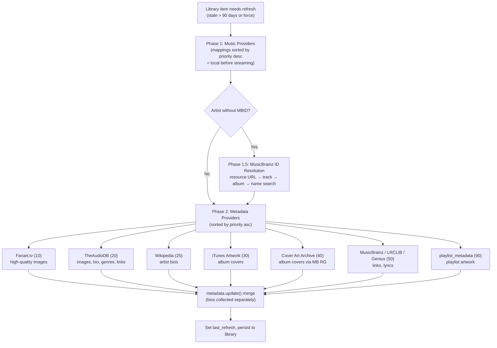

# 14 — Metadata Enrichment

The metadata system enriches library items (see [08-media-library.md](08-media-library.md)) with artwork, biographies, lyrics, genre tags, and external identifiers by orchestrating queries across both music providers and dedicated metadata providers. The `MetaDataController` follows a two-phase priority model: music providers are checked first (they often supply their own artwork), then online metadata providers fill the gaps. A built-in image proxy with opaque image IDs, layered caching and colour-palette extraction handles serving and resizing images for clients and players.

---

## Enrichment Architecture



---

## Package Structure

`controllers/metadata.py` became the `controllers/metadata/` package (#4265, reorganized further in #4838). `MetaDataController` is now composed from three mixins, each in its own module, mirroring how `controllers/players/` is organized — all behaviour is still reachable on the single controller instance, the split is purely for managing a large surface:

```python
class MetaDataController(
    ImageProxyMixin, RadioArtworkMixin, MetadataEnrichmentMixin, CoreController
):
```

The package's own [`README.md`](../../music_assistant/controllers/metadata/README.md) is the authoritative module inventory and states the design rationale behind the image-id system, the local-over-online ordering, and the randomized maintenance schedule. This document covers what the README does not: the concrete provider priority ordering and capability matrix, the enrichment flow per media type, the imageproxy URL contract and its cache tiers, palette extraction, the radio artwork pipeline, and how genre ownership is split with the music controller.

| Module | Role |
|---|---|
| `controller.py` | `MetaDataController` — lifecycle, config, preferred language, `update_metadata`, lyrics, maintenance tasks, diagnostics |
| `images.py` | `ImageProxyMixin` — image resolution, opaque image IDs, thumbnails, the `/imageproxy` endpoint, palettes, collages |
| `radio.py` | `RadioArtworkMixin` — radio stream artwork lookup |
| `enrichment.py` | `MetadataEnrichmentMixin` — the per-media-type enrichment routines |
| `helpers.py` | Pure functions (image format detection and `fmt` normalization) |
| `constants.py` | Config keys, cache categories, task IDs, the locale map, imageproxy tunables |

---

## `MetaDataController`

`MetaDataController` (`controllers/metadata/controller.py`) extends `CoreController` with domain `"metadata"`.

### Configuration

| Key | Type | Default | Purpose |
|---|---|---|---|
| `CONF_LANGUAGE` | STRING | `"en_US"` | Preferred locale for metadata (38 options in `constants.py:LOCALES`, including Traditional Chinese as of #4870) |
| `CONF_ENABLE_ONLINE_METADATA` | BOOLEAN | `True` | Toggle online provider queries |
| `CONF_PREFER_LOCAL_GENRES` | BOOLEAN | `False` | When on, online providers' genres are masked off items that already have a local genre source — a file tag/NFO, or (for artists and albums) a propagated mapping. Items without one still receive online genres. (#3815, #3883) |
| `CONF_ENABLE_RADIO_METADATA_LOOKUP` | BOOLEAN | `True` | When off, radio streams skip the artist/track artwork lookup and show only the station logo. (#3741) |
| `CONF_THUMB_CACHE_MAX_SIZE` | INTEGER | `500` (MB) | Max disk cache for thumbnails (50-5000 range) |

### Setup and Lifecycle

- **`setup(config)`**: Silences the PIL logger and creates the `collage_images/` directory under `mass.cache_path`.
- **`post_setup()`**: Registers `/imageproxy/*` as a **dynamic route** on *both* the streams server and the main webserver, then registers the maintenance tasks. Dynamic routes are a shared `WebserverBase` facility (`helpers/webserver.py`), so the same handler is reachable on both ports — the streams server is what player-facing media URLs point at. The route map in [12-webserver-api.md](12-webserver-api.md) covers the endpoint from the HTTP side.
- **`close()`**: Unregisters the route from both servers.

### Core Entry Point: `update_metadata`

`update_metadata(item, force_refresh=False)` (API: `metadata/update_metadata`, requires `Scope.LIBRARY_MANAGE`) is the main enrichment entry point. It accepts a URI string or a `MediaItemType`, rejects anything that is not a library item, and dispatches to type-specific handlers:

| Media Type | Handler | Beyond the metadata merge |
|---|---|---|
| Artist | `_update_artist_metadata` | MusicBrainz ID resolution; bio selection (see below) |
| Album | `_update_album_metadata` | Fills `year` and `album_type` when still unknown |
| Track | `_update_track_metadata` | — |
| Playlist | `_update_playlist_metadata` | Aggregates genres from tracks; calls `PLAYLIST_METADATA` providers |
| Audiobook | `_update_audiobook_metadata` | Fills publisher, authors, narrators, duration; **replaces** images |
| Podcast | `_update_podcast_metadata` | Fills publisher, total_episodes; **replaces** images |

Calls are rate-limited through a `Throttler(1, 30)` (1 request per 30-second window) to avoid overwhelming external APIs.

Audiobooks and podcasts replace `metadata.images` outright with the first provider's images rather than merging, because there is no cover picker for those types and merging would let a stale cover outlive the provider's own.

### Refresh Gating

Every enrichment method checks whether the item's `metadata.last_refresh` is older than `REFRESH_INTERVAL` (90 days) and returns immediately when the item is fresh and `force_refresh` is not set. This is what keeps load on the free online services low.

`force_refresh` also opens `cache.handle_refresh(force_refresh)` around the whole call, which sets the `BYPASS_CACHE` context variable. Without that, a forced refresh would re-run enrichment only to be served the same stale answers out of the `@use_cache` layer wrapping each provider's calls — the refresh gate and the cache have to be bypassed together for "refresh" to mean anything. `schedule_update_metadata(item)` applies the same check before creating a deterministic background task (task ID from `uuid5(NAMESPACE_URL, uri)`), so repeated UI access to a fresh item schedules nothing.

---

## The Two-Phase Priority Model

### Phase 1: Music Providers

Music providers are checked first because they often supply their own artwork (streaming services like Spotify and Tidal have comprehensive image libraries):

1. Iterate `item.provider_mappings` sorted by **priority descending** (local filesystem providers get higher priority than streaming providers)
2. For each mapping, call `get_provider_item()` to fetch the full item from the provider
3. Merge the provider's metadata via `item.metadata.update(prov_item.metadata)` — this fills in any missing fields without overwriting existing values
4. Use each streaming provider's `domain` as a dedup key (same catalog across instances) but local providers' `instance_id` (each instance may have different metadata)

### Phase 1.5: MusicBrainz ID Resolution (Artists Only)

Many online metadata providers require a MusicBrainz ID (MBID) to look up an artist. If `artist.mbid` is still unset after Phase 1, the controller tries multiple strategies through the MusicBrainz provider:

1. **Resource URL lookup**: Streaming providers share URLs that MusicBrainz maps via its URL relations (e.g., a Spotify artist URL → MB artist ID)
2. **Track recording ID**: If any of the artist's tracks have a MusicBrainz recording ID, look up the artist from that. Reference tracks come from the (widely supported) top-tracks listing, falling back to all tracks.
3. **Album release group ID**: Same approach via the artist's albums
4. **Name-based search**: Fall back to searching by artist name, constrained by a reference track's album and track names

`VARIOUS_ARTISTS_NAME` short-circuits to the well-known `VARIOUS_ARTISTS_MBID` rather than being searched for.

### Phase 2: Online Metadata Providers

If `CONF_ENABLE_ONLINE_METADATA` is enabled, the controller iterates all loaded `MetadataProvider` instances:

- For **artists**: Requires `artist.mbid` to be set (skipped entirely if MusicBrainz resolution failed).
- For **albums** and **tracks**: No MBID requirement — providers handle their own lookups. Note that tracks are subject to the same 90-day refresh gate as every other type; the enrichment method returns before Phase 2 unless `force_refresh` or `needs_refresh` holds.

Each provider is checked for the relevant `ProviderFeature` flag (`ARTIST_METADATA`, `ALBUM_METADATA`, `TRACK_METADATA`, `PLAYLIST_METADATA`, `LYRICS`), and its returned `MediaItemMetadata` is merged via `update()`, which fills gaps without overwriting values already present. A provider raising is logged and skipped, never aborting the pass.

**Provider order**: `MetadataProvider.priority` (default `50`) determines iteration order, and the controller's `providers` property sorts **ascending — lower runs first** (#3623). Because `update()` only fills gaps, running first effectively means winning:

| Priority | Provider |
|---|---|
| 10 | Fanart.tv |
| 20 | TheAudioDB |
| 25 | Wikipedia |
| 30 | iTunes Artwork |
| 40 | Cover Art Archive |
| 50 | *default* — MusicBrainz, LRCLIB, Genius Lyrics, `lastfm_recommendations` |
| 90 | `playlist_metadata` |

So Fanart.tv and TheAudioDB both run **before** iTunes Artwork; Cover Art Archive runs after iTunes (still before the default tier); and `playlist_metadata` runs last so it only generates playlist artwork nothing else supplied.

**Local-genre masking**: When `CONF_PREFER_LOCAL_GENRES` is enabled and the item already has a local genre source, each online provider's response is shallow-cloned with `dataclasses.replace(metadata, genres=None)` before merging. Other fields merge normally — only the `genres` set is shielded (#3815). What counts as "local" differs by type:

- **Artists and albums**: a non-empty `metadata.genres` **or** propagation-derived genre mappings, checked via `GenreController.has_derived_genre_mappings()`. Counting derived mappings is what stops a filesystem provider's propagated track genres from being overwritten on every refresh (#3883).
- **Tracks**: only `track.metadata.genres` — a track is the propagation *source*, so it has no derived mappings to protect.

### Artist Descriptions

Artist biographies are deliberately **excluded from the generic field merge** and chosen by an explicit policy instead (#3972), because `update()`'s fill-the-gaps semantics would otherwise lock in whichever provider happened to answer first — regardless of language.

Each provider's description is collected as a `(language, text)` candidate and stripped from the metadata before merging, in priority order: music providers first, then metadata providers (TheAudioDB at 20, then Wikipedia at 25). `_select_description(candidates, prev_description, prev_description_language)` then picks the winner:

1. The first candidate in the user's preferred language (the 2-letter code from `CONF_LANGUAGE`).
2. Otherwise, keep an already-stored bio that *is* in the preferred language, rather than downgrading it.
3. Otherwise, the first English candidate.
4. Otherwise, the highest-priority candidate in any language, including unknown.

The bio is re-derived on every refresh, so changing the preferred language and forcing a refresh switches the stored bio and its `description_language`.

### Playlists

`_update_playlist_metadata` walks the playlist's tracks to aggregate genres — a genre must appear on more than 5 tracks to count, and at most 8 are kept — falling back to a track's album genres when the track itself carries none. It then calls every provider declaring `ProviderFeature.PLAYLIST_METADATA` and persists with `overwrite=True`.

It does **not** call `create_collage_image`. Playlist artwork generation moved to the `playlist_metadata` provider (#3786), which offers several layout templates; the controller's own collage builder still exists in `images.py` but is no longer invoked from enrichment. See [`playlist_metadata`](#playlist_metadata) below.

---

## Metadata Providers

### `MetadataProvider` ABC

Defined in `models/metadata_provider.py`, the base class is broader than just the three enrichment hooks — a metadata provider can also serve similar-item lookups, artist top lists and recommendation rows:

| Method | Gating feature |
|---|---|
| `get_artist_metadata(artist)` | `ARTIST_METADATA` |
| `get_album_metadata(album)` | `ALBUM_METADATA` |
| `get_track_metadata(track)` | `TRACK_METADATA` (also the lyrics path) |
| `get_playlist_metadata(playlist)` | `PLAYLIST_METADATA` (#4460) |
| `get_similar_tracks(track, limit)` | `SIMILAR_TRACKS` |
| `get_similar_artists(artist, limit)` | `SIMILAR_ARTISTS` |
| `get_recommendations()` / `get_recommendation_items(item_id)` | `RECOMMENDATIONS` |
| `get_artist_toptracks(artist, limit)` | `ARTIST_TOPTRACKS` |
| `get_artist_topalbums(artist, limit)` | `ARTIST_TOPALBUMS` |
| `resolve_image(path)` | *(always available; returns the path unchanged by default)* |

Each method follows the same contract: if the corresponding `ProviderFeature` is declared but the method isn't overridden, `NotImplementedError` is raised; if the feature isn't declared, an empty result is returned silently. `priority` defaults to `50`.

The recommendation methods make `MetadataProvider` a first-class source for the Discover page, alongside music and plugin providers — see [08-media-library.md](08-media-library.md#recommendations), which owns that subsystem.

### Provider Capabilities

| Provider | Domain | Priority | Features | Lookup Key | Cache TTL | Throttle |
|---|---|---|---|---|---|---|
| **Fanart.tv** | `fanarttv` | 10 | `ARTIST_METADATA`, `ALBUM_METADATA` | MBID (artist), RG-MBID (album) | 60 days | 1/30s (or 1/s with VIP key) |
| **TheAudioDB** | `theaudiodb` | 20 | `ARTIST_METADATA`, `ALBUM_METADATA`, `TRACK_METADATA` | MBID (artist), RG-MBID or name (album) | 90 days | 1 req/s |
| **Wikipedia** | `wikipedia` | 25 | `ARTIST_METADATA` | MBID → MusicBrainz URL relations → Wikidata sitelinks | 90 days | 1 req/s |
| **iTunes Artwork** | `itunes_artwork` | 30 | `ALBUM_METADATA` | UPC/EAN barcode (via `ExternalID.BARCODE`; `MusicBrainzReleaseGroup.barcode` is captured for RG lookups) | 30 days | *(uncapped)* |
| **Cover Art Archive** | `coverartarchive` | 40 | `ALBUM_METADATA` | MusicBrainz release-group MBID (`ExternalID.MB_RELEASEGROUP`) | 30 days | *(HTTP; 503 → `ResourceTemporarilyUnavailable`)* |
| **MusicBrainz** | `musicbrainz` | 50 | `ARTIST_METADATA`, `RECOMMENDATIONS` | MBID (metadata); artist name + tracks/albums (ID resolution) | 30 days | 10 req/10s |
| **Genius Lyrics** | `genius_lyrics` | 50 | `TRACK_METADATA`, `LYRICS` | Artist name + track name | 7 days | *(library-managed)* |
| **LRCLIB** | `lrclib` | 50 | `TRACK_METADATA`, `LYRICS` | Artist + track + album + duration | 14 days | 1/30s (or 1/s custom API) |
| **`lastfm_recommendations`** | `lastfm_recommendations` | 50 | `RECOMMENDATIONS`, `SIMILAR_ARTISTS`, `SIMILAR_TRACKS`, `ARTIST_TOPTRACKS` | Playlog seeds, genre/geo/global charts | — | — |
| **`playlist_metadata`** | `playlist_metadata` | 90 | `PLAYLIST_METADATA` | Playlist tracks (local generation, no external API) | — | — |

### What Each Provider Contributes

| Data Type | Fanart.tv | TheAudioDB | Wikipedia | iTunes | CAA | MusicBrainz | Genius | LRCLIB | `playlist_metadata` |
|---|---|---|---|---|---|---|---|---|---|
| Artist images (thumb, logo, banner, fanart, cutout, clearart, landscape) | Yes (thumb, logo, banner, fanart) | Yes (up to 10 variants per type) | — | — | — | — | — | — | — |
| Album images (thumb, disc art) | Yes | Yes (including HQ, 3D variants) | — | Yes (thumb only, 1500×1500) | Yes (thumb) | — | — | — | — |
| Track images | — | Yes (thumb) | — | — | — | — | — | — | — |
| Playlist images | — | — | — | — | — | — | — | — | Yes (thumb + fanart, generated) |
| Biography/description | — | Yes (localized) | Yes (localized) | — | — | — | — | — | — |
| External links (website, social) | — | Yes | — | — | — | Yes (from URL relations) | — | — | — |
| Genre/style/mood | — | Yes | — | — | — | — | — | — | Optional (from tracks) |
| Plain text lyrics | — | Yes | — | — | — | — | Yes | Yes (fallback) | — |
| Synced lyrics (LRC) | — | — | — | — | — | — | — | Yes (preferred) | — |
| Album review | — | Yes | — | — | — | — | — | — | — |
| MBID backfill | — | Yes (artist + album RG) | — | — | — | *(the resolver itself)* | — | — | — |

### MusicBrainz — Identity Resolution and Links

MusicBrainz plays two distinct roles. It is **called directly** by the controller for MBID resolution during Phase 1.5 and by the radio artwork pipeline for release-group lookups, and it *also* participates in Phase 2 as an ordinary metadata provider: it declares `ARTIST_METADATA` (surfacing external links — Wikipedia, AllMusic, Last.fm, official homepage and social profiles — derived from MusicBrainz URL relations) and `RECOMMENDATIONS` (artist birthday and in-memoriam rows).

It is a package, `providers/musicbrainz/` (#3905), split into `provider.py`, `api_client.py`, `models.py`, `recommendations.py` and `constants.py`. Requests go through a custom mirror (`musicbrainz-mirror.music-assistant.io`) at `ThrottlerManager(rate_limit=10, period=10)` — 10 requests per 10 seconds, well above the public API's 1 req/s — with 30-day caching.

Key data models: `MusicBrainzArtist`, `MusicBrainzRecording`, `MusicBrainzRelease`, `MusicBrainzReleaseGroup`, `MusicBrainzRelation` — all dataclasses with mashumaro serialization.

### TheAudioDB

The most comprehensive text-and-image provider. Uses MBID for artist lookup, MusicBrainz release group ID for albums (falling back to name search), and MBID or name search for tracks. Provides localized content using the controller's preferred language. As a side effect, it can backfill MBIDs on artists and release group IDs on albums when discovered during lookups.

### Fanart.tv

Purely image-focused — no text metadata. Requires MBIDs for all lookups. Optional VIP `client_key` unlocks a faster throttle (1 req/s vs 1 req/30s). At priority 10 it is the first provider consulted, so its artwork wins wherever it has coverage.

### Cover Art Archive

Builtin stable metadata provider (`coverartarchive`) at priority **40**. Declares only `ALBUM_METADATA` and looks up front-cover art by MusicBrainz **release-group** MBID via `https://coverartarchive.org`. It sits after iTunes Artwork in the enrichment and radio-artwork walks, so it fills album thumbs when higher-priority image providers miss. Responses are cached for 30 days; HTTP 503 becomes `ResourceTemporarilyUnavailable`.

### Wikipedia

Added in #3972 to supply artist biographies in the user's own language, which TheAudioDB often lacks. It contributes nothing but `description` + `description_language`, and only for artists that already have an MBID.

Resolution walks three hops:

1. Fetch the artist's **MusicBrainz URL relations** and extract Wikipedia article titles per language from any `*.wikipedia.org/wiki/<title>` relation.
2. For languages MusicBrainz did not cover, follow the `wikidata` relation's entity ID (`Q…`) and ask the **Wikidata** API for that entity's sitelinks, filtered to just the wanted languages — so the extra request is skipped entirely when MusicBrainz already had the language.
3. Fetch the **plain-text lead section** (`prop=extracts&exintro&explaintext`) for the preferred language, falling back to English.

Sitelink and bio responses are cached for 90 days, persistently. A 404 is a real negative and returns `None`; any other failure raises `ResourceTemporarilyUnavailable` so a transient error is not cached as "no bio".

### `playlist_metadata`

A metadata provider (#3786) that *generates* playlist artwork locally instead of fetching it, replacing the controller's built-in collage as the primary path. At priority 90 it runs after every other provider, so it only fills in where nothing else supplied art.

- **Templates** (`CONF_TEMPLATE`): `album_grid` (the classic collage, default), `album_fan`, `album_grid_tilted`, `artist_mosaic`, `artist_grid`, `artist_radio`, `artist_banner`. Both a thumb and a fanart variant are rendered.
- **Skipping provider-owned playlists** (`CONF_SKIP_PROVIDER_PLAYLISTS`, default on): a playlist that is neither `builtin` nor `smart_playlist` and already has a provider-supplied thumb is left alone; only playlists whose art it generated itself are regenerated.
- **Genre detection** (`CONF_ENABLE_GENRE_DETECTION`, default off): scans up to 500 tracks and keeps the most common genres that clear a configurable percentage threshold (`CONF_GENRE_MIN_THRESHOLD`, default 10%) up to `CONF_GENRE_MAX_COUNT` (default 3) — a stricter, configurable version of the controller's own aggregation (#4593).
- **Storage**: images live in `{storage_path}/playlist_metadata_images/` and are served through the provider's own `resolve_image()`, which returns bytes and guards against path traversal. Superseded images are deleted as soon as new ones are generated, and a `TaskSchedule.hourly(every=2)` cleanup task sweeps anything stale that survived.

### `lastfm_recommendations`

Despite the domain name suggesting library enrichment, this is a `MetadataProvider` that serves **Discover rows**, not `*_METADATA` features. Its personalized rows are seeded from Music Assistant's own playlog rather than a Last.fm listening history (#4457). [08-media-library.md](08-media-library.md#lastfm_recommendations) owns the authoritative description.

### Lyrics Providers

**LRCLIB** provides synced lyrics (LRC format with timestamps) and requires track duration for matching. **Genius** provides plain text lyrics via the `lyricsgenius` library (blocking, wrapped in `asyncio.to_thread`).

The `get_track_lyrics()` method (API: `metadata/get_track_lyrics`) resolves lyrics through a chain:

1. Return the track's existing `metadata.lyrics` / `lrc_lyrics` if already populated.
2. For library tracks, trigger a metadata update and return whatever that produced.
3. Try the track's own music provider, if it declares `ProviderFeature.LYRICS`.
4. Iterate the metadata providers with `LYRICS` support **in priority order** — the controller's `providers` property is sorted, so this is deterministic rather than dependent on load order. A provider that raises is logged and skipped.

**LRC normalization.** Synced lyrics from providers vary in shape, so `normalize_lrc_lyrics()` (`helpers/lyrics.py`, #4823) reduces them to minimal, chronologically sorted LRC that clients can parse without a full LRC implementation: ID/metadata tag lines (`[ar:…]`, `[ti:…]`, `[#comment]`) are stripped, enhanced per-word timing tags (`<00:22.00>`) are removed, and a line carrying several timestamps — a repeated chorus — is expanded into one line per timestamp. Untimed lines inherit the previous timestamp so a stable sort keeps them in place.

Normalization is applied in two places: stored lyrics were normalized once by the schema ≤53 migration in `controllers/music/migrations.py` (noted under [08-media-library.md](08-media-library.md#migrations)), and on-demand `get_track_lyrics` responses are normalized on the way out, since they are never persisted.

---

## Image Proxy System

The image proxy serves, resizes and caches images for clients and players. `/imageproxy/*` is registered as a dynamic route on **both** the streams server (port 8097) and the main webserver (port 8095) — `get_image_url()` picks the base URL via `prefer_stream_server` (webserver by default, streams server when set, which is what player-facing media URLs use).

### Opaque image IDs

The query-string form the proxy originally used — `?provider=…&path=…` with a double-URL-encoded path — is **gone** (#3960, #4544). Images are now addressed by an opaque, deterministic ID:

```
{base_url}/imageproxy/{image_id}?size={size}&fmt={format}
```

where `image_id = sha256(f"{provider}/{path}")` (`create_thumb_hash` — the same hash the thumbnail cache keys on).

This is a security boundary, not just a cosmetic change. Only IDs the server itself has registered resolve to anything, so the endpoint cannot be coerced into fetching an arbitrary URL on the caller's behalf, and image paths — which are often URLs, sometimes with credentials in them — never appear in a client-visible query string.

| Function | Role |
|---|---|
| `compute_image_id(provider, path)` | Return the ID, registering the reverse mapping as a side effect. Thread-safe: it runs from the executor during outbound serialization |
| `resolve_image_id(image_id)` | Resolve an ID back to `(provider, path)`, or `None` for an unregistered ID |

`proxy_id` is injected into `MediaItemImage` during **outbound serialization**: the webserver binds the `IMAGE_PROXY_ID_RESOLVER` ContextVar to `compute_image_id` around each JSON response and WebSocket message, so every image a client receives carries a usable ID without the model layer knowing about the metadata controller. Clients (and the Snapcast control script, for instance) build the URL by appending that `proxy_id` as a single path segment.

**ID registration is three bounded maps** on the controller, all capped at `_IMAGE_ID_LRU_MAX` (10 000) and sharing their key strings so the combined footprint stays small:

- `_image_id_forward`: `(provider, path) → image_id`, so re-serializing a known image skips both the hash and the lock. Read lock-free, since a single dict lookup is atomic.
- `_image_id_lru`: `image_id → (provider, path)`, a write-through hot cache in front of the cache controller so resolving a freshly generated ID never waits on SQLite.
- `_image_id_persisted`: `image_id → last persist timestamp`, so repeat encounters skip the write.

Mappings are also persisted to the cache DB with a 1-year TTL (`persistent=True`) and rewritten once a stored row has burned through half its TTL, which keeps long-lived IDs resolvable across restarts. `_persist_image_id` probes the stored expiration before writing, turning the write storm that browsing after a restart would otherwise cause into much cheaper reads. Overflow of any map is harmless: an evicted entry costs one re-hash or one cache-DB probe.

### The endpoint

`handle_imageproxy(request)` validates strictly before touching any image:

1. The path must be exactly `/imageproxy/<id>` (a trailing slash is tolerated); extra segments are rejected.
2. The ID must be 64 lowercase hex characters.
3. `size` must be one of `_ALLOWED_IMAGEPROXY_SIZES` = `{0, 80, 160, 256, 512, 1024}`, where `0` means no resize. Anything else returns **400** with a message naming the allowed values (#4897). Whitelisting sizes bounds both PIL memory and thumbnail-cache cardinality.
4. `fmt` is normalized against `_IMAGEPROXY_CONTENT_TYPES` (`jpg`, `jpeg`, `png`, `svg`), falling back to detection from the path extension.
5. An unregistered ID returns **404**.

Responses carry `Cache-Control: max-age=31536000` and `Access-Control-Allow-Origin: *`. A response whose *sniffed* content is SVG additionally gets a restrictive `Content-Security-Policy` (`default-src 'none'; style-src 'unsafe-inline'; sandbox`) and `X-Content-Type-Options: nosniff`, because SVGs from attacker-influenceable sources (radio station favicons) are served same-origin and could otherwise run an embedded `<script>`.

`fmt=jpeg` is treated as the explicit player request: players get JPEG for compatibility, and since JPEG has no alpha channel, transparency is composited onto white (`flatten_transparency`). The auto-detected `jpg`/`png` default used by the app and UI instead preserves transparency as PNG. `player_image_url()` (`helpers/images.py`) rewrites a frontend URL into that form — streams-server origin, `fmt=jpeg` — for players that cannot reach the webserver.

### URL Generation

`get_image_url(image, size, prefer_proxy, image_format, prefer_stream_server)` decides whether to proxy at all:

- SVGs are never resized (`size` is forced to 0).
- An image that is not remotely accessible, or that needs a resize, or where `prefer_proxy` is set, is routed through the proxy URL.
- Otherwise the raw `image.path` is returned unchanged.

### Image Resolution Chain

`get_image_url_for_item(media_item, img_type)` resolves an item's image with a fallback chain: Track → Track's Album → Album's Artists → Track's Artists. An `ItemMapping` that already carries a matching image is used directly rather than paying for a full item fetch.

### Caching tiers

Three distinct caches sit behind the endpoint, all under `{cache_path}/thumbnails/` on disk.

**Thumbnails** (`helpers/images.py`):

| Tier | Capacity | Key |
|---|---|---|
| In-memory | 50 entries (LRU via `OrderedDict`) | `{sha256}_{size}_v{version}[_flat].{jpg\|png}` |
| On-disk | Configurable (default 500 MB) | Same filename, in `{cache_path}/thumbnails/` |

The filename is **versioned** (`_THUMB_CACHE_VERSION`, currently 2) so a change to the encoding rules — such as the old black-background JPEGs generated for transparent logos — cannot be served from a colliding filename after an upgrade. The `_flat` marker separates the flattened and transparency-preserving variants. A regex (`_THUMB_FILENAME_RE`) re-validates the constructed filename before it is joined into a filesystem path.

`get_image_thumb()` checks memory → disk → generates via PIL (`Image.thumbnail` with Lanczos resampling, quality 95). Concurrent requests for the same thumbnail are deduplicated through a shared task (`thumb.{cache_filename}`).

**Source images** (#4703) are the tier the older docs lacked. Every derived artifact — each thumbnail size and format, the colour palette, collage tiles — is generated from the same origin bytes, and without this cache the first display of a single item would fetch that origin several times within seconds:

- Memory tier is **byte-budgeted** rather than entry-counted (originals can be multi-MB): 32 MB total, with a single entry capped at 8 MB so one huge original cannot evict everything else. Entries carry a 1-hour TTL.
- Disk tier is a `{hash}_src` file in the same thumbnail directory, so multi-variant generation after a restart doesn't re-fetch either. Remote URLs are only considered fresh within the 1-hour TTL, since a CDN can serve new content behind a stable URL; local files rely on explicit invalidation instead.
- Concurrent requests share one fetch (`imgsrc.{cache_key}`).

**Palettes** live in the cache controller — see [Colour Palettes](#colour-palettes).

### Image Data Resolution

`get_image_data(path_or_url, provider)` resolves raw bytes through a chain with a max recursion depth of 5:

1. `data:image` base64 URIs are decoded inline.
2. An imageproxy URL pointing at **this** server is resolved to its underlying `(provider, path)` *before* anything is cached, and re-entered — an alias-keyed cache entry would keep being served after the underlying image was invalidated. An own-server URL with an unknown ID raises `FileNotFoundError`.
3. The provider's `resolve_image()` — may return bytes directly or a replacement path.
4. HTTP URLs are fetched over HTTP (with a User-Agent that bot-protected CDNs accept).
5. Local image files, guarded by `is_safe_path`.
6. Embedded artwork, extracted via ffmpeg.

### Cache Invalidation

`invalidate_image_cache(provider, path)` drops **every** cached artifact for one image identity: the source bytes, all thumbnail size/format/flatten variants in both memory and disk, and the extracted palette. It exists for the case where the content behind an unchanged `(provider, path)` pair has changed — typically a local file whose embedded artwork was replaced (#4703). `MediaControllerBase` calls it when a library item's images change or the item is removed (see [08-media-library.md](08-media-library.md)).

### Collage Images

Playlist collages are now generated by the **`playlist_metadata` provider**, which offers several templates and stores its output in provider storage. The controller's own `create_collage_image()` still exists in `images.py` — 250×250 tiles, 1500×1500 for thumbs and 2500×1750 for fanart, minimum 3 images (8 for fanart), sampled down to 50 to bound memory — but **enrichment no longer calls it**. The `collage_images/` directory under `cache_path` is still created at setup and images with a `/collage/{filename}` path are still resolvable through `_resolve_thumbnail`, so previously generated collages keep working; the directory is otherwise residual.

---

## Colour Palettes

`helpers/colors.py` derives a colour palette from artwork so clients and players can theme their now-playing view to the current track (#4193). The palette follows the Sendspin `color@v1` spec: six fields — `primary`, `accent`, `on_dark`, `on_light`, `background_dark`, `background_light`.

Extraction runs `modern_colorthief`'s MMCQ quantizer over the source bytes to get candidate colours, then picks and adjusts them so **every spec-mandated contrast pair clears WCAG AA (4.5:1)**. The picker aims for a richer 7.0:1 first and falls back to the 4.5:1 floor; when picking the dark on-light colour it caps contrast at 17.35:1, because otherwise near-black image regions (text outlines, letterboxing) win and the result looks like pure black instead of a vivid dark shade from the artwork. Accent selection requires a minimum RGB distance from `primary` so the two don't collapse into the same colour.

**API.** `metadata/get_image_palette(image_id)` takes an **opaque image ID only** (#4550) — the same `proxy_id` a client already has on its `MediaItemImage`. It resolves the ID and returns `None` for anything unregistered, which keeps the endpoint from being turned into a fetch-arbitrary-URL primitive, exactly as the imageproxy endpoint is.

**Caching.** Palettes are content-addressed on `sha256(provider + path)` and stored in the cache controller for 90 days, so they persist across restarts and are shared process-wide. An *empty* result is deliberately not cached — that usually means a transient decode or download failure that should be retried. Concurrent extraction for the same image is deduplicated through a `palette.{key}` task, and CPU-bound extraction runs in a thread.

**Player integration.** Palette resolution is asynchronous but player state serialization is synchronous, so the palette is carried on the player rather than resolved inline. `PlayerController._schedule_palette_fetch()` kicks off extraction when `current_media.palette` is still unset, `get_palette_for_url()` resolves the imageproxy URL back to `(provider, path)`, and the result is handed back via `Player.set_resolved_palette(image_url, palette)` — applied only while the URL still matches. The controller also prefetches the *next* queue item's palette so it is hot at the transition, and skips players that mirror a parent's media entirely, since resolving per group member would be duplicated work.

Because the palette lands a moment after the track change, `current_media.palette` is part of `MEDIA_IDENTITY_KEYS` — a player pushing colours to its display needs a second callback once it arrives. See [03-player-model.md](03-player-model.md#palette-resolution) and [04-player-controller.md](04-player-controller.md).

---

## Radio Stream Artwork

When a radio stream produces ICY/HLS in-band metadata containing an `artist - title` pair, the streams controller hands the `StreamDetails` to `MetaDataController.update_radio_stream_artwork(streamdetails)`. The full lookup pipeline is dedicated to enriching now-playing display when the station itself only carries text. (#3110)

### Entry Point

`update_radio_stream_artwork(streamdetails)` is gated by `CONF_ENABLE_RADIO_METADATA_LOOKUP` (default on; #3741). When enabled, it calls `get_image_url_by_name(artist_name, track_name, fallback_image_url=…, album_name=…)` to resolve an image URL plus optional corrected `artist`/`track` (the helper detects "Track - Artist" swaps). On a successful resolution, it rebuilds `streamdetails.stream_metadata` and signals the active queue.

### Name Normalization

Station metadata is free-form text, so names are cleaned up before any lookup. `normalize_radio_artist_name()` is applied by the streams controller *before* it hands the metadata over, and flips comma-inverted names (`"Squier, Billy"` → `"Billy Squier"`) while refusing to mangle names where the comma is real:

- A curated exception set (`"hello, goodbye"`, `"slaughter beach, dog"`, …).
- Anything containing `" and "` or `" & "` — `"Crosby, Stills & Nash"`.
- Business suffixes — `"Lipps, Inc."`.
- Two or more words after the comma — `"Portugal, The Man"` — except the exact suffix `"The"`, which does flip (`"Beatles, The"` → `"The Beatles"`).

`get_image_url_by_name` then reduces multi-artist strings to a single artist, splitting on `" / "` or via `split_artists`, and track titles are stripped of version suffixes and featuring credits by `parse_title_and_version(strip_for_search=True)`.

### Lookup Pipeline

1. **Ad filtering**: artist names matching `AD_DETECTION_PHRASES` (`"asset link"`, `"asset stop"`, `"asset spot"`, `"advert"`, `"promo"`) short-circuit to the fallback image — these are commercial breaks, not music.
2. **Cache check**: results are cached under `CACHE_CATEGORY_RADIO_ARTWORK` (`= 101`) keyed by `f"{artist}|{track}|{album_key}"`, where `album_key = create_safe_string(album_name)` (empty when the station announced no album). The album must be part of the key because it influences which release group's artwork is chosen — without it, two albums carrying the same track would alias onto one cached image. Hits store for 90 days (`CACHE_EXPIRATION_RADIO_ARTWORK`); misses store an empty string for 7 days (`CACHE_EXPIRATION_RADIO_ARTWORK_MISS`) — the asymmetric TTL prevents repeatedly hammering MusicBrainz for the same dead lookup. Resolved imageproxy URLs are deliberately not cached, since the ID mapping behind them is the durable thing.
3. **Library-first**: `_get_library_track_metadata`, `_get_library_artist_metadata` and `_get_library_item_thumb` check the user's existing library before reaching out — if the user already owns the track, their own artwork wins.
4. **MusicBrainz with variants**: `_search_musicbrainz_with_variants` tries the announced order, then the swapped order (some stations send `"Track - Artist"`), then punctuation variants. A swap is reported back so subsequent lookups and the displayed metadata use the corrected order.
5. **Singles before albums**: matched release groups are split by `primary_type`, and `Single` release groups are tried before `Album` ones — a single's cover is the artwork for *that* track, whereas an album cover is merely the artwork of a release containing it. When the station announced an album, `_prioritize_release_groups` reorders **within each type** so a release group whose title matches the announcement sorts first, using a loose substring match either way; singles still outrank albums (#4364).
6. **Provider artwork per release group**: `_get_release_group_artwork` builds a throwaway `Album` carrying the release group MBID (plus its barcode when known) and walks `self.providers` in priority order. That means **Fanart.tv (10) and TheAudioDB (20) run before iTunes Artwork (30), then Cover Art Archive (40)**; iTunes is the one that needs a barcode, while CAA needs the release-group MBID.
7. **Artist artwork**: with no release-group art, the library is checked for the artist, then `ARTIST_METADATA` providers are asked for artist artwork using a throwaway `Artist` carrying the MBID.
8. **Station logo fallback**: `get_radio_stream_station_image(streamdetails)` returns the station's own logo when track-level lookup yields nothing.

### Station-supplied cover art

ICY streams can carry a cover URL in the non-standard `StreamUrl` field. When `_parse_icy_image_url` finds one that looks like a PNG or JPEG, it is used as the image directly and **the whole MusicBrainz lookup is skipped** — `_update_radio_stream_metadata` only schedules `update_radio_stream_artwork` when no `image_url` was supplied. Station-provided art for the currently playing track beats anything a name-based lookup can infer.

### Callers

`controllers/streams/audio.py` reaches `update_radio_stream_artwork` along three paths, all of which funnel through the internal `_update_radio_stream_metadata(streamdetails, artist, title, …)` helper:

- **ICY** (Shoutcast/Icecast `StreamTitle`): when in-band metadata is parsed and contains a `"Artist - Title"` pair, the audio loop calls `_update_radio_stream_metadata` directly.
- **OGG** (in-band Vorbis comments via the chained-OGG handler): when the metadata callback fires with new artist/title, the audio loop calls `_update_radio_stream_metadata` directly.
- **HLS**: `_update_hls_radio_metadata` is registered as `streamdetails.stream_metadata_update_callback` with a 5-second interval; it polls the playlist for fresh metadata and forwards new tracks into `_update_radio_stream_metadata`.

`_update_radio_stream_metadata` updates `streamdetails.stream_metadata` and signals the queue, then schedules `update_radio_stream_artwork` via `mass.call_later(0.2, ..., task_id=f"update_radio_artwork_{queue_id}")`. The 0.2 s debounce + per-queue task ID coalesces rapid metadata flaps into a single artwork lookup.

---

## Genre Handling

Genres are **owned by `GenreController`** (`controllers/music/media/genres.py`), not by the metadata controller — they are library entities like any other media type, and [08-media-library.md](08-media-library.md#genrecontroller) covers the controller itself. What matters here is where genres and metadata meet: enrichment merges provider-supplied genre strings, and `CONF_PREFER_LOCAL_GENRES` decides whether they may override local ones.

### Alias system and taxonomies

Each genre carries a JSON array of aliases (e.g. "Rock" covers "classic rock", "hard rock", "alternative rock"). Raw provider genre strings are normalized via `create_safe_string` and matched against those aliases, so many upstream spellings collapse onto one canonical genre.

There are now **three taxonomies**, namespaced by the `genres.content_type` column so a podcast "Comedy" never merges into the music "Comedy" (#4435, #4474):

| Taxonomy | `content_type` | Default mapping file | Icons |
|---|---|---|---|
| Music / general | `NULL` | `helpers/resources/genres/genre_mapping.json` | `helpers/resources/genres/{translation_key}.svg` |
| Podcast | `podcast` | `podcast_genre_mapping.json` | `genres/podcast/{translation_key}.svg` |
| Audiobook | `audiobook` | `audiobook_genre_mapping.json` | `genres/audiobook/{translation_key}.svg` |

Icons live in a flat directory for music plus per-taxonomy subdirectories (#4611). Stored icon paths are install-location independent (`genres/<file>.svg`, resolved against `RESOURCES_DIR` at serve time) — a schema migration rewrote absolute paths that broke after a runtime upgrade relocated `site-packages`.

### Database Schema

| Table | Purpose |
|---|---|
| `genres` | Genre records with name, sort_name, translation_key, description, aliases, is_default, is_excluded, content_type |
| `genre_media_item_mapping` | N:N relationship: `(genre_id, media_id, media_type, alias, is_derived, is_manual)` |
| `genre_media_item_exclusion` | User-excluded genre-to-media pairs |

### Genre Scanning Pipeline

Triggered by library sync completion (`EventType.MUSIC_SYNC_COMPLETED`), a manual API call (`music/genres/scan_mappings`), or the `genre_mapping_scan` task — which `GenreController` registers for 4:00 AM local time, and which therefore does *not* share the metadata controller's randomized schedule:

1. `_cleanup_stale_genre_mappings()` — removes mappings where the alias no longer appears in the item's metadata
2. Extract all unique genre names from all media tables via SQL `json_each()`
3. Match each name against the alias lookup table, scoped to the item's taxonomy
4. Bulk insert/replace into `genre_media_item_mapping`
5. `_propagate_genre_mappings_to_parents()` — for filesystem providers with `propagate_track_genres`, inherits track genres onto albums and artists (marked `is_derived=1`)

Step 5 is what `has_derived_genre_mappings()` later reports on, so propagated genres survive metadata refreshes under `CONF_PREFER_LOCAL_GENRES` (#3883).

---

## Maintenance Tasks

Registered in `_register_maintenance_tasks()`. The three **daily** tasks run at a randomized UTC time rather than a fixed local 4:00 AM (#4126): one `random.randint(0, 24 * 60 - 1)` minute-of-day is drawn per process and shared by them, so independent installations don't all hit the shared MusicBrainz mirror at the same moment.

| Task | Handler | Cadence | Behavior |
|---|---|---|---|
| Missing artist metadata scan | `_scan_missing_artist_metadata` | Daily | Finds artists missing images **or** description that have never been refreshed; processes a batch of 5 (`METADATA_SCAN_BATCH_SIZE`, #3595) |
| Playlist metadata refresh | `_refresh_playlist_metadata_batch` | Daily | Finds non-dynamic playlists (`is_dynamic = 0`) whose `last_refresh` is absent or older than 90 days; processes a batch of 5 |
| Thumbnail cache cleanup | `_cleanup_thumb_cache` | Daily | Deletes oldest-first from `{cache_path}/thumbnails/` until the total is under `CONF_THUMB_CACHE_MAX_SIZE` |
| Duplicate album reconciliation | `_reconcile_duplicate_albums` | **Hourly** | Re-enriches albums that are sparse (`album_type = 'unknown'`) or look like duplicates of a sibling, then re-runs `albums.match_providers()` so genuine duplicates fold together |

Excluding dynamic playlists matters because their contents are regenerated on every play — refreshing metadata for them would be churn with no stable result to show.

Album reconciliation is the metadata-side half of the duplicate cleanup whose track counterpart lives in the music controller ([08-media-library.md](08-media-library.md#initialization)). Enrichment comes first for a reason: an album stored with `album_type = unknown` and thin metadata often *is* a duplicate, but cannot be proven one until it has enough fields to compare, so the task fills those in and only then asks the [evidence-based matcher](08-media-library.md#album-evidence--compare_album_evidence) to merge. Candidates are gated on `last_refresh` being absent or older than `REFRESH_INTERVAL`, so a transient provider outage retries at the normal cadence instead of burning the item's only attempt.

### Corrupt metadata tolerance

SQLite's JSON functions raise a fatal `malformed JSON` error on invalid input, which a single corrupt `metadata` column would turn into a failure of the whole scan query. `_get_scan_batch` therefore catches that error, calls `_report_corrupt_metadata_rows` to identify the offending rows, and retries the query behind a `json_valid()` guard so the scan completes without them (#4803).

Findings are surfaced twice: as a task failure message telling the user which item to remove and re-sync, and through `get_diagnostics()` as `corrupt_metadata_rows` for inclusion in a diagnostics report. A later clean scan clears the entry, so a repaired row drops out again. See [20-background-tasks.md](20-background-tasks.md) for the task and diagnostics frameworks.

---

## Key Files

| File | Purpose |
|---|---|
| [`controllers/metadata/README.md`](../../music_assistant/controllers/metadata/README.md) | In-tree module inventory and design notes for the package |
| [`controllers/metadata/controller.py`](../../music_assistant/controllers/metadata/controller.py) | `MetaDataController` — lifecycle, config, `update_metadata`, lyrics, maintenance, diagnostics |
| [`controllers/metadata/enrichment.py`](../../music_assistant/controllers/metadata/enrichment.py) | `MetadataEnrichmentMixin` — per-media-type enrichment, MBID resolution, bio selection |
| [`controllers/metadata/images.py`](../../music_assistant/controllers/metadata/images.py) | `ImageProxyMixin` — image IDs, `/imageproxy` endpoint, thumbnails, palettes, collages |
| [`controllers/metadata/radio.py`](../../music_assistant/controllers/metadata/radio.py) | `RadioArtworkMixin` — radio stream artwork lookup |
| [`controllers/metadata/constants.py`](../../music_assistant/controllers/metadata/constants.py) | Locales, cache categories, imageproxy allowed sizes and TTLs, task IDs |
| [`models/metadata_provider.py`](../../music_assistant/models/metadata_provider.py) | `MetadataProvider` ABC — provider interface and `priority` |
| [`helpers/images.py`](../../music_assistant/helpers/images.py) | Image data resolution, thumbnail + source caches, invalidation, collage rendering |
| [`helpers/colors.py`](../../music_assistant/helpers/colors.py) | Palette extraction, contrast adjustment, palette caching |
| [`helpers/lyrics.py`](../../music_assistant/helpers/lyrics.py) | LRC normalization and conversion |
| [`providers/fanarttv/`](../../music_assistant/providers/fanarttv/) | High-quality fan art and logos (priority 10) |
| [`providers/theaudiodb/`](../../music_assistant/providers/theaudiodb/) | Artist/album/track images, bios, genres, links (priority 20) |
| [`providers/wikipedia/`](../../music_assistant/providers/wikipedia/) | Localized artist biographies via MusicBrainz relations and Wikidata (priority 25) |
| [`providers/itunes_artwork/`](../../music_assistant/providers/itunes_artwork/) | High-resolution album artwork via UPC barcode lookup (priority 30) |
| [`providers/coverartarchive/`](../../music_assistant/providers/coverartarchive/) | Album artwork from Cover Art Archive via MusicBrainz release group (priority 40) |
| [`providers/musicbrainz/`](../../music_assistant/providers/musicbrainz/) | MBID resolution, release matching, external links, artist-date recommendation rows |
| [`providers/genius_lyrics/`](../../music_assistant/providers/genius_lyrics/) | Plain text lyrics via the Genius API |
| [`providers/lrclib/`](../../music_assistant/providers/lrclib/) | Synced (LRC) and plain lyrics |
| [`providers/playlist_metadata/`](../../music_assistant/providers/playlist_metadata/) | Generated playlist artwork templates and genre detection (priority 90) |
| [`controllers/music/media/genres.py`](../../music_assistant/controllers/music/media/genres.py) | `GenreController` — genre alias matching, taxonomies, scanning, propagation |
| [`helpers/resources/genres/`](../../music_assistant/helpers/resources/genres/) | The three default genre mapping files and their icon sets |
