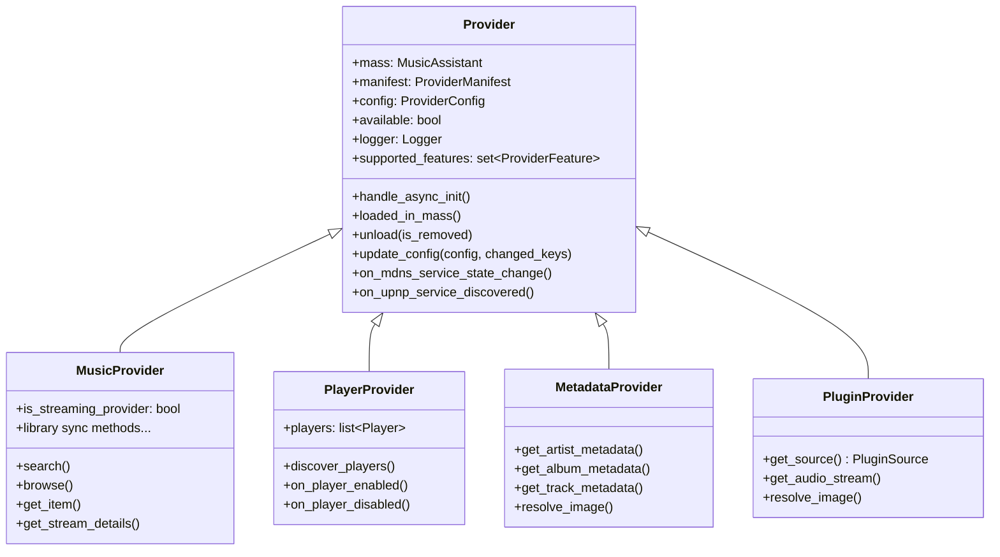
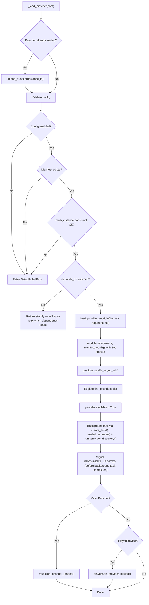

# Provider Lifecycle

Providers are the modular extension points of Music Assistant. Every external integration — a streaming service, a speaker protocol, a metadata source, an audio plugin — is a provider. This document covers how providers are discovered, loaded, configured, and torn down, and the class hierarchy that makes them work.

## Provider Taxonomy

The `ProviderType` enum (from `music_assistant_models.enums`) defines five provider categories:

| Type | Purpose | Examples |
|---|---|---|
| `MUSIC` | Sources of media: catalogs, libraries, streams | Spotify, Tidal, Qobuz, filesystem_local, RadioBrowser |
| `PLAYER` | Speakers and renderers that play audio | Chromecast, AirPlay, DLNA, Sonos, Bluesound, SqueezeBox |
| `METADATA` | Art, lyrics, biographies for enriching library items | TheAudioDB, MusicBrainz, Fanart.tv, Genius Lyrics |
| `PLUGIN` | Extras: connect integrations, scrobblers, audio sources | Spotify Connect, Last.fm scrobbler, VBAN receiver |
| `CORE` | Not a real provider — used for core controller manifests in the UI | (internal only) |

There is also `AUDIO_ANALYSIS` (for future use) and `UNKNOWN` as a fallback.

## `ProviderManifest`

Every provider has a `manifest.json` in its directory. This is parsed into a `ProviderManifest` dataclass (from `music_assistant_models.provider`):

```python
@dataclass
class ProviderManifest(DataClassORJSONMixin):
    type: ProviderType
    domain: str           # unique identifier, e.g. "spotify"
    name: str             # human-readable name
    description: str
    codeowners: list[str]
    stage: ProviderStage = ProviderStage.STABLE
    requirements: list[str] = []       # pip packages
    multi_instance: bool = False       # allow multiple configs
    builtin: bool = False              # loaded automatically, failure = fatal
    allow_disable: bool = True
    depends_on: str | None = None      # domain of required provider
    mdns_discovery: list[str] | None = None
    upnp_discovery: list[str] | None = None
    # ... icon fields, documentation URL, credits
```

### Concrete Examples

**Music provider** (multi-instance, has pip requirements):

```json
{
  "type": "music",
  "domain": "spotify",
  "name": "Spotify",
  "description": "Stream music, playlists, podcasts...",
  "codeowners": ["@music-assistant"],
  "requirements": ["pkce==1.0.3"],
  "multi_instance": true
}
```

**Player provider** (single-instance, uses mDNS discovery):

```json
{
  "type": "player",
  "domain": "chromecast",
  "name": "Chromecast",
  "description": "Cast music to Chromecast or Google Cast devices.",
  "codeowners": ["@music-assistant"],
  "requirements": ["PyChromecast==14.0.9"],
  "mdns_discovery": ["_googlecast._tcp.local."]
}
```

**Builtin provider** (cannot be disabled, no external requirements):

```json
{
  "type": "player",
  "domain": "sync_group",
  "name": "Sync Group Player",
  "description": "Create permanent sync groups...",
  "codeowners": ["@music-assistant"],
  "builtin": true,
  "allow_disable": false
}
```

**Metadata provider** (builtin):

```json
{
  "type": "metadata",
  "domain": "theaudiodb",
  "name": "The Audio DB",
  "description": "Provides artist images, album art, and rich textual metadata...",
  "codeowners": ["@music-assistant"],
  "builtin": true
}
```

## Manifest Discovery

`__load_provider_manifests()` in `MusicAssistant` runs during startup (step 3), before any controllers are set up:

1. Scans `music_assistant/providers/*/manifest.json`
2. Skips directories starting with `.` (hidden)
3. Skips directories starting with `_` unless `dev_mode` is active (demo/test providers)
4. Loads manifests in parallel via `TaskManager` (unlimited concurrency)
5. Checks for `icon.svg`, `icon_dark.svg`, `icon_monochrome.svg` in each provider directory
6. Special case: if domain is `"hass"` and running as HA add-on, overrides `builtin=True` and `allow_disable=False`

Results are stored in `self._provider_manifests: dict[str, ProviderManifest]`, keyed by domain.

## Provider Class Hierarchy



### `Provider` Base Class (`music_assistant/models/provider.py`)

The base class provides:

- **Identity properties** (all `@final`): `type`, `domain`, `instance_id`, `name`, `default_name`, `stage`
- **Feature system**: `supported_features` set, `supports_feature()`, `check_feature()` (raises `UnsupportedFeaturedException`)
- **Lifecycle hooks**: `handle_async_init()`, `loaded_in_mass()`, `unload(is_removed)`
- **Config handling**: `update_config()` — by default, reloads the provider on any non-log-level value change via `call_later(1, mass.load_provider_config, ...)`
- **Discovery callbacks**: `on_mdns_service_state_change()`, `on_upnp_service_discovered()` (see [13-discovery.md](13-discovery.md))
- **Logging**: logger configured per-provider with configurable log level

### `MusicProvider` (`music_assistant/models/music_provider.py`)

Adds the full media browsing/search/library API surface. Distinguishes between "streaming" providers (Spotify, Tidal — have shared catalogs) and "unique" providers (local filesystem — have unique data). This distinction affects how the music controller handles provider failover and library deduplication. (~1459 lines, covered in detail in [08-media-library.md](08-media-library.md).)

### `PlayerProvider` (`music_assistant/models/player_provider.py`)

Adds player discovery and management:
- `discover_players()` — called when the provider loads; mDNS-based providers may not need to implement this
- `on_player_enabled()` / `on_player_disabled()` — config manager callbacks
- `players` property — returns all players belonging to this provider
- Group player management: `create_group_player()`, `remove_group_player()`

### `MetadataProvider` (`music_assistant/models/metadata_provider.py`)

Adds metadata resolution: `get_artist_metadata()`, `get_album_metadata()`, `get_track_metadata()`, `resolve_image()`. Each returns `MediaItemMetadata | None`. The metadata controller aggregates results from all loaded metadata providers.

### `PluginProvider` (`music_assistant/models/plugin.py`)

Adds audio source capabilities via `PluginSource` — a model for bridging external audio sources into the MA player model. Receiver plugins (Spotify Connect, AirPlay, AriaCast, VBAN) inject audio from external apps; scrobbler plugins (Last.fm, ListenBrainz) report plays to external services; feature plugins (Party) provide UI/access extensions. The `PluginSource` dataclass carries the PCM audio format, stream type, and optional playback control callbacks (`on_play`, `on_pause`, `on_volume`, etc.). See [11-plugin-system.md](11-plugin-system.md) for the full plugin architecture.

## Loading Flow

The full provider loading sequence, traced through `_load_provider` in `mass.py`:



### `load_provider_module` (`music_assistant/helpers/util.py`)

This function handles dynamic import and dependency management:

1. For each requirement in `manifest.requirements`:
   - If the requirement has a pinned version (`==`), check the installed version
   - If versions mismatch, run `pip install` (via `uv`) to install the correct version
   - Editable installs (version `"0.0.0"`) are skipped
2. Import the module via `importlib.import_module(f".{domain}", "music_assistant.providers")`
3. If import fails, reinstall ALL requirements and retry once
4. The imported module must expose a `setup(mass, manifest, config) -> Provider` function and a `get_config_entries(mass, instance_id, action, values) -> list[ConfigEntry]` function

## Builtin vs Regular Providers

| Aspect | Builtin | Regular |
|---|---|---|
| `manifest.builtin` | `True` | `False` |
| Loading | `_load_builtin_providers()` — via `asyncio.TaskGroup`, fully awaited | `_load_providers()` — via `TaskManager`, concurrent background tasks |
| Failure impact | Fatal — server startup aborts | Non-fatal — error logged, auto-retry scheduled |
| Auto-retry | Yes (via `allow_retry=True`) | Yes — after 120 seconds for `MusicAssistantError` subclasses |
| Safe mode | Loaded | Skipped |
| Examples | `sync_group`, `universal_group`, `universal_player`, `theaudiodb`, `musicbrainz`, `builtin` | `spotify`, `chromecast`, `airplay`, `filesystem_local`, all user-configured providers |

### Builtin Provider Setup

Before loading, `_load_builtin_providers()` calls `config.create_builtin_provider_config(domain)` for each builtin manifest — this ensures a config entry exists in `settings.json` even if the user never explicitly configured the provider.

### Default Providers

`DEFAULT_PROVIDERS` in `constants.py` lists providers that are auto-configured on first run:

```python
DEFAULT_PROVIDERS: Final[set[tuple[str, bool]]] = {
    ("airplay", False),      # always set up
    ("chromecast", False),   # always set up
    ("dlna", False),         # always set up
    ("sonos", True),         # only if mDNS evidence found
    ("bluesound", True),     # only if mDNS evidence found
    ("heos", True),          # only if mDNS evidence found
    ("party", False),        # always set up
}
```

The boolean indicates whether mDNS evidence is required before auto-setup. For `True` entries, the discovery controller's zeroconf cache is checked for matching `mdns_discovery` types from the manifest.

## Dependency Management

The `depends_on` field in `ProviderManifest` creates a soft dependency chain:

- During `_load_provider`, if `depends_on` is set and the dependency provider is not loaded, the load **silently returns** (no error).
- When a provider successfully loads, `load_provider_config` iterates all enabled provider configs and re-triggers loading for any that `depends_on` the just-loaded provider's domain.
- When a provider unloads, `unload_provider` recursively unloads all providers that depend on it.

Additionally, after a successful `load_provider`, the server iterates all currently loaded providers. Any that are loaded but *unavailable* and whose `depends_on` matches the just-loaded provider's domain are unloaded — this triggers them to retry loading now that their dependency is available.

This creates an eventually-consistent loading model — providers load (and retry) until their dependencies are satisfied, without requiring explicit ordering.

## Unloading

`unload_provider(instance_id, is_removed=False)` performs a clean teardown:

1. Unschedule any pending music sync for this provider (`music.unschedule_provider_sync`)
2. Notify relevant controllers:
   - `PlayerProvider` → `players.on_provider_unload(provider)`
   - `MusicProvider` → `music.on_provider_unload(provider)`
3. Recursively unload dependent providers (anything with `manifest.depends_on == provider.domain`)
4. For `PlayerProvider`: unregister all players (`players.unregister(player_id, permanent=is_removed)`)
5. Call `provider.unload(is_removed)` — the provider's own cleanup
6. Remove from `_providers` dict
7. Notify discovery controller: `discovery.on_provider_unload(instance_id)`
8. Update the global available-providers cache
9. Signal `EventType.PROVIDERS_UPDATED`

The `is_removed` flag distinguishes between a temporary unload (for reload/restart) and a permanent removal (user deleted the config). Player providers use this to decide whether to permanently delete player state.

## Error Handling

### Load-time Errors

When `load_provider` catches an exception:

1. The error message is persisted in config: `config.set(f"providers/{instance_id}/last_error", str(exc))`
2. For `MusicAssistantError` subclasses (handled errors): auto-retry is scheduled after 120 seconds via `call_later`
3. For other exceptions (likely bugs): no retry, error is logged as a warning
4. The provider remains unloaded but its config entry stays in `settings.json`, visible in the UI with the error message

### Runtime Errors

`unload_provider_with_error(instance_id, error)` is called when a provider encounters a runtime error that requires user intervention (e.g. expired OAuth token). It persists the error message and unloads the provider, leaving it visible in the UI for the user to reconfigure.

## `ProviderFeature` Flags

Providers declare their capabilities via `supported_features: set[ProviderFeature]`. This enum has 44 members grouped by provider type:

**Music provider features:** `BROWSE`, `SEARCH`, `RECOMMENDATIONS`, `LIBRARY_ARTISTS`, `LIBRARY_ALBUMS`, `LIBRARY_TRACKS`, `LIBRARY_PLAYLISTS`, `LIBRARY_RADIOS`, `LIBRARY_AUDIOBOOKS`, `LIBRARY_PODCASTS`, `ARTIST_ALBUMS`, `ARTIST_TOPTRACKS`, library edit features (`LIBRARY_*_EDIT`), favorite edit features (`FAVORITE_*_EDIT`), `SIMILAR_TRACKS`, playlist features (`PLAYLIST_TRACKS_EDIT`, `PLAYLIST_CREATE_*`)

**Player provider features:** `SYNC_PLAYERS`, `REMOVE_PLAYER`, `CREATE_GROUP_PLAYER`, `REMOVE_GROUP_PLAYER`

**Metadata provider features:** `ARTIST_METADATA`, `ALBUM_METADATA`, `TRACK_METADATA`, `LYRICS`

**Plugin features:** `AUDIO_SOURCE`

These flags drive conditional behavior throughout the system — the config controller uses them to determine which library sync options to show, the music controller uses them to decide which providers to query for searches, and the player controller uses them for command routing.

## Key Files

| File | What to look at |
|---|---|
| `music_assistant/mass.py` | `_load_provider`, `_load_builtin_providers`, `_load_providers`, `__load_provider_manifests`, `load_provider`, `unload_provider`, `load_provider_config` |
| `music_assistant/models/provider.py` | `Provider` base class — lifecycle, features, config handling |
| `music_assistant/models/music_provider.py` | `MusicProvider` — media browsing, search, library sync interface |
| `music_assistant/models/player_provider.py` | `PlayerProvider` — player discovery, group management |
| `music_assistant/models/metadata_provider.py` | `MetadataProvider` — metadata resolution interface |
| `music_assistant/models/plugin.py` | `PluginProvider` and `PluginSource` — audio source plugins |
| `music_assistant/helpers/util.py` | `load_provider_module` — dynamic import + pip install |
| `music_assistant/constants.py` | `DEFAULT_PROVIDERS`, `CONFIGURABLE_CORE_CONTROLLERS` |
| `music_assistant/providers/*/manifest.json` | Concrete manifest examples |
