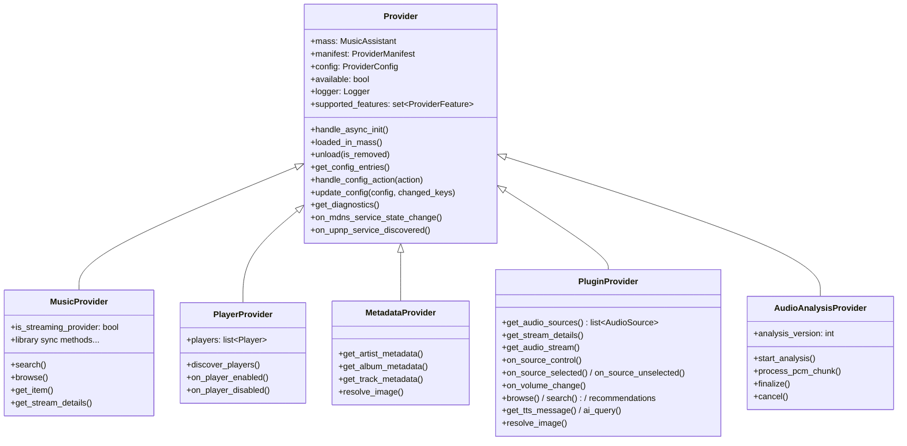
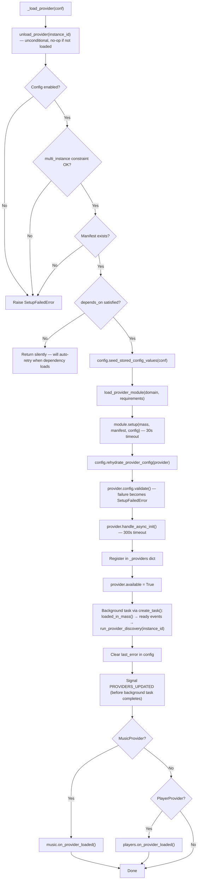

# Provider Lifecycle

Providers are the modular extension points of Music Assistant. Every external integration — a streaming service, a speaker protocol, a metadata source, an audio plugin — is a provider. This document covers how providers are discovered, loaded, configured, and torn down, and the class hierarchy that makes them work.

## Provider Taxonomy

The `ProviderType` enum (from `music_assistant_models.enums`) defines six real provider categories, plus `UNKNOWN` as a fallback:

| Type | Purpose | Examples |
|---|---|---|
| `MUSIC` | Sources of media: catalogs, libraries, streams | Spotify, Tidal, Qobuz, filesystem_local, RadioBrowser |
| `PLAYER` | Speakers and renderers that play audio | Chromecast, AirPlay, DLNA, Sonos, Bluesound, SqueezeBox |
| `METADATA` | Art, lyrics, biographies for enriching library items | TheAudioDB, MusicBrainz, Fanart.tv, LRCLIB |
| `PLUGIN` | Extras: connect integrations, scrobblers, audio sources | Spotify Connect, Last.fm scrobbler, VBAN receiver |
| `AUDIO_ANALYSIS` | Consume PCM chunks during streaming to produce analysis results | loudness_analysis (builtin), smart_fades, sonic_analysis, acoustid_lookup |
| `CORE` | Core controller manifests — not loadable as runtime providers | `streams`, `players`, `music`, `cache`, … |

`AUDIO_ANALYSIS` is a fully-fledged provider type with its own base class; see [16-audio-analysis.md](16-audio-analysis.md).

`CORE` needs a careful distinction. Core controllers **do** appear in the settings UI as first-class entities: each builds a `ProviderManifest` and the configurable ones are registered in `mass._provider_manifests` with icons detected from their package directory (see [00-overview.md](00-overview.md#core-modules-as-settings-entities)). But they are never *loaded* as providers — `_load_builtin_providers()` explicitly skips any manifest whose `type` is `ProviderType.CORE`, they never appear in `mass._providers`, and they have no `manifest.json` on disk. The manifest exists purely so the frontend can render a core module's settings page with the same components it uses for a provider.

## `ProviderManifest`

Every provider has a `manifest.json` in its directory. This is parsed into a `ProviderManifest` dataclass (from `music_assistant_models.provider`):

```python
@dataclass
class ProviderManifest(DataClassORJSONMixin):
    type: ProviderType
    domain: str           # unique identifier, e.g. "spotify"
    name: str             # human-readable name
    description: str
    codeowners: list[str]
    stage: ProviderStage = ProviderStage.STABLE
    requirements: list[str] = []       # pip packages
    multi_instance: bool = False       # allow multiple configs
    builtin: bool = False              # loaded automatically at startup (awaited before regular providers)
    allow_disable: bool = True
    depends_on: str | None = None      # domain of required provider
    mdns_discovery: list[str] | None = None
    upnp_discovery: list[str] | None = None
    icon: str | None = None                        # mdi icon name
    icon_images: list[ProviderIconVariant] = []    # which icon files were found on disk
    has_setup_flow: bool = False                   # a setup_flow.py exists in the directory
    documentation: str | None = None
    credits: list[str] = []
```

`icon_images` and `has_setup_flow` are *not* authored in `manifest.json` — the server fills them in during discovery from what it finds on disk (see below).

### Concrete Examples

**Music provider** (multi-instance, has pip requirements):

```json
{
  "type": "music",
  "domain": "spotify",
  "name": "Spotify",
  "description": "Stream music, playlists, podcasts...",
  "codeowners": ["@music-assistant"],
  "requirements": ["pkce==1.0.3"],
  "multi_instance": true
}
```

**Player provider** (single-instance, uses mDNS discovery):

```json
{
  "type": "player",
  "domain": "chromecast",
  "name": "Chromecast",
  "description": "Cast music to Chromecast or Google Cast devices.",
  "codeowners": ["@music-assistant"],
  "requirements": ["PyChromecast==14.0.10"],
  "mdns_discovery": ["_googlecast._tcp.local."]
}
```

**Builtin provider** (cannot be disabled, no external requirements):

```json
{
  "type": "player",
  "domain": "sync_group",
  "name": "Sync Group Player",
  "description": "Create permanent sync groups...",
  "codeowners": ["@music-assistant"],
  "builtin": true,
  "allow_disable": false
}
```

**Metadata provider** (builtin):

```json
{
  "type": "metadata",
  "domain": "theaudiodb",
  "name": "The Audio DB",
  "description": "Provides artist images, album art, and rich textual metadata...",
  "codeowners": ["@music-assistant"],
  "builtin": true
}
```

## Manifest Discovery

`__load_provider_manifests()` in `MusicAssistant` runs early during startup, before any controllers are set up:

1. Scans `music_assistant/providers/*/manifest.json`
2. Skips directories starting with `.` (hidden)
3. Skips directories starting with `_` unless `dev_mode` is active (demo/test providers)
4. Loads manifests in parallel via `TaskManager` (unlimited concurrency)
5. Detects icon variants via `detect_provider_icons()` and records which were found in `manifest.icon_images`
6. Sets `manifest.has_setup_flow` if a `setup_flow.py` file exists in the directory
7. Special case: if domain is `"hass"` and running as HA add-on, overrides `builtin=True` and `allow_disable=False`

Results are stored in `self._provider_manifests: dict[str, ProviderManifest]`, keyed by domain.

**Icons are detected eagerly but served on demand.** `detect_provider_icons()` looks for `icon.svg`/`icon.png` (`DEFAULT`), `icon_dark.svg`/`icon_dark.png` (`DARK`) and `icon_monochrome.svg`/`icon_monochrome.png` (`MONOCHROME`), preferring SVG when both exist for a variant. The bytes are held server-side in `mass._provider_icons` (keyed by domain, then `ProviderIconVariant`); the manifest itself carries only the *list of available variants*. Clients fetch the actual image through the `providers/icon` API command, which returns a base64 data URI for one variant, rather than receiving every icon inlined in the manifest list.

**`has_setup_flow` is detected by file presence alone.** The check is a deliberate `isfile` test rather than an import: importing `setup_flow.py` would trigger installing the provider's pip requirements, and manifest discovery has to stay cheap for all providers, including ones the user has never configured. The module is only imported later, lazily, when a setup flow actually starts. Of the providers shipping today, 64 have a `setup_flow.py`.

## Provider Class Hierarchy



### `Provider` Base Class (`music_assistant/models/provider.py`)

The base class provides:

- **Identity properties** (all `@final`): `type`, `domain`, `instance_id`, `name`, `default_name`, `stage`
- **Feature system**: `supported_features` set, `supports_feature()`, `check_feature()` (raises `UnsupportedFeaturedException`)
- **Lifecycle hooks**: `handle_async_init()`, `loaded_in_mass()`, `unload(is_removed)`
- **Config declaration**: `get_config_entries()` (instance method, no parameters) and `handle_config_action(action)` for `ACTION` entries
- **Config reading**: `get_config_value()` for persisted option values, `get_setup_value()` for values collected by the setup flow (both decrypt `SECURE_STRING` transparently)
- **Config handling**: `update_config()` — by default, reloads the provider on any non-log-level value change via `call_later(1, mass.load_provider_config, ...)`
- **Error signalling**: `unload_with_error(error)` — records a `ProviderError` and unloads, so the UI can prompt the user
- **Diagnostics**: `get_diagnostics()` — optional dict contributed to the diagnostics report
- **Events**: `signal_provider_event(data, sub_scope=None)` — emits a `PROVIDER_EVENT` scoped to this instance
- **Discovery callbacks**: `on_mdns_service_state_change()`, `on_upnp_service_discovered()` (see [13-discovery.md](13-discovery.md))
- **Logging**: logger configured per-provider with configurable log level

### `MusicProvider` (`music_assistant/models/music_provider.py`)

Adds the full media browsing/search/library API surface. Distinguishes between "streaming" providers (Spotify, Tidal — have shared catalogs) and "unique" providers (local filesystem — have unique data). This distinction affects how the music controller handles provider failover and library deduplication. (~1980 lines, covered in detail in [08-media-library.md](08-media-library.md).)

### `PlayerProvider` (`music_assistant/models/player_provider.py`)

Adds player discovery and management:
- `discover_players()` — called after the shared mDNS/UPnP discovery phase completes on every provider load, and again (debounced, 5s) when a player is enabled via config. The base implementation is a no-op, so a purely mDNS-driven provider never needs it. See [13-discovery.md](13-discovery.md#discover_players--provider-specific-discovery) for the full matrix of what providers actually do here
- `on_player_enabled()` / `on_player_disabled()` — config manager callbacks
- `players` property — returns all players belonging to this provider
- Group player management: `create_group_player()`, `remove_group_player()`

### `MetadataProvider` (`music_assistant/models/metadata_provider.py`)

Adds metadata resolution: `get_artist_metadata()`, `get_album_metadata()`, `get_track_metadata()` and `get_playlist_metadata()` each return `MediaItemMetadata | None`, alongside similar/top-item lookups (`get_similar_tracks()`, `get_similar_artists()`, `get_artist_toptracks()`, `get_artist_topalbums()`), recommendations, and `resolve_image()`. The metadata controller aggregates results from all loaded metadata providers, in `priority` order.

### `PluginProvider` (`music_assistant/models/plugin.py`)

The catch-all provider type. Receiver plugins (Spotify Connect, AirPlay, AriaCast, VBAN, Yandex Ynison) expose live inputs as **`AudioSource` media items** (`ProviderFeature.AUDIO_SOURCE`) that are browsed, enqueued, and streamed like radio stations, with transport and volume routed back through `on_source_control` / `on_volume_change` and ownership handled by the `on_source_selected` / `on_source_unselected` lifecycle pair (#3938). A plugin can also implement music features (#3811) (`BROWSE`, `SEARCH`, `RECOMMENDATIONS`, `SIMILAR_TRACKS`, playlist resolution), which is how the playlist and discovery plugins work; `TTS` and `AI_QUERY` make it a text-to-speech or AI backend. Scrobblers (Last.fm, ListenBrainz, Subsonic) declare no features and just subscribe to `MEDIA_ITEM_PLAYED`; bridges (Plex Connect, Yandex Smart Home) and guest experiences (Party, Music Quiz) register their own API surfaces. See [11-plugin-system.md](11-plugin-system.md) for the full plugin architecture.

### `AudioAnalysisProvider` (`music_assistant/models/audio_analysis_provider.py`)

Receives PCM chunks during streaming and produces analysis results — beat grids, key detection, loudness. The same hooks serve both live playback and background scans, so a provider never has to know which context it is in. Subclasses implement `_start_analysis()`, `process_pcm_chunk()` and `_finalize()`; the base class handles session bookkeeping, persistence, failure recording, and routing CPU-heavy work through the controller's bounded thread pool. See [16-audio-analysis.md](16-audio-analysis.md).

## Loading Flow

The full provider loading sequence, traced through `_load_provider` in `mass.py`:



### The Post-Load Background Task

`_on_provider_loaded()` is launched with `create_task()`, which is what lets `_load_provider` signal `PROVIDERS_UPDATED` and return without waiting for discovery. But **the task is only fire-and-forget from the outside** — internally every step is awaited in order:

1. `await provider.loaded_in_mass()`
2. `provider.initialized.set()` and the per-domain ready event, so anything blocked on `get_provider_ready_event(domain)` unblocks only *after* `loaded_in_mass()` returned
3. `await self.run_provider_discovery(provider.instance_id)` — which itself awaits the shared mDNS/UPnP phase and then `discover_players()` for a `PlayerProvider`
4. Persist the instance's `default_name` back to config if it was autogenerated

**A failing `loaded_in_mass()` does not stop the chain** (#5455). The exception is caught and logged as a warning, and steps 2–4 still run. The provider stays registered and available either way, so leaving the ready event unset would make every waiter pay the full timeout on every attempt until the provider reloaded — a worse outcome than a provider whose post-load step partially failed.

So a provider is guaranteed to be fully loaded before discovery starts, and to have had its cached mDNS results replayed before its own `discover_players()` runs. `mass.run_provider_discovery` takes an **instance id** (not a provider object) and resolves it internally, raising `KeyError` for an unknown or unavailable instance. See [13-discovery.md](13-discovery.md#the-two-phase-discovery-flow).

### Config Seeding, Rehydration and Validation

The three config steps bracketing `module.setup()` exist because of one constraint: **`get_config_entries()` is an instance method, so a provider's full config schema cannot be resolved until the instance exists** — yet the instance is constructed *with* a config. Untangling that takes three steps:

1. **`config.seed_stored_config_values(conf)`** — before load. The config built for loading carries only the server-default entries, since the provider's own options entries are not yet resolvable. Providers routinely read stored option values in `setup()` or `__init__`, so this adds the stored raw values as passthrough entries, making those reads see the right values.
2. **`config.rehydrate_provider_config(provider)`** — right after the instance exists. Now that `provider.get_config_entries()` can be called, the stored values are re-parsed against the *full* typed entry set and the result replaces `provider.config`. This runs before async init, so `get_config_value()` reads inside `handle_async_init()` see stored values.
3. **`provider.config.validate()`** — only now, because which values are *required* is itself part of the entry set step 2 just resolved. A failure is re-raised as `SetupFailedError` naming the offending entry, so a refusing provider says *which* value is missing rather than just "configuration is invalid".

### Load Timeouts

The two steps that call into provider code are each bounded, via the `_provider_load_step` context manager. It converts a `TimeoutError` into an ordinary `SetupFailedError`, so a wedged provider flows through the normal error path — recorded as a load failure and retried — rather than hanging startup:

| Step | Constant | Timeout | Rationale |
|---|---|---|---|
| `module.setup()` | `PROVIDER_SETUP_TIMEOUT` | 30s | Construction should be quick — it must not perform slow I/O |
| `handle_async_init()` | `PROVIDER_ASYNC_INIT_TIMEOUT` | 300s | Generous enough for the slowest hosts to load their ML models, but still bounded |

### `load_provider_module` (`music_assistant/helpers/util.py`)

This function handles dynamic import and dependency management:

1. For each requirement in `manifest.requirements`:
   - Unpinned requirements (no `==`) are skipped entirely
   - For pinned ones, compare against the installed version and `pip install` (via `uv`) on mismatch
   - Editable installs (version `"0.0.0"`) are skipped
   - Already-checked requirements are remembered in a module-level set, so repeat loads are free
2. Import the module via `importlib.import_module(f".{domain}", "music_assistant.providers")` on a worker thread
3. If the import raises `ImportError`, reinstall ALL requirements and retry once

The imported module must expose `setup(mass, manifest, config) -> Provider`. The `ProviderModuleType` protocol in `music_assistant/models/__init__.py` also declares a module-level `get_config_entries(mass, instance_id, action, values)`, but nothing calls it any more — it is a vestigial member of the protocol.

### Where Config Input Actually Comes From

The `action`/`values` parameters on that old module-level signature reflected a design where a single function served three jobs: rendering setup questions, handling interactive button presses, and rendering the options page. Those are now three separate mechanisms:

| Job | Mechanism |
|---|---|
| One-time setup input (credentials, hostnames, OAuth) | A `setup_flow.py` module, whose collected answers are persisted as encrypted `setup_data` and read back via `Provider.get_setup_value()` |
| Ongoing options shown on the settings page | `Provider.get_config_entries()` — an instance method with **no** parameters, which reads current state from `self.config` and capabilities from `self.supported_features` |
| Interactive buttons (`ConfigEntryType.ACTION`) | `Provider.handle_config_action(action)`, invoked by the `config/providers/invoke_action` API command, which runs the side effect and returns the re-rendered entries |

Because the options entries need a live instance, the `config/providers/get_entries` command (`get_provider_config_entries()`) falls back to returning just `DEFAULT_PROVIDER_CONFIG_ENTRIES` for a provider that is not loaded. The frontend does not present an editable options form in that case — it surfaces the load error and a Reconfigure action instead.

## Builtin vs Regular Providers

| Aspect | Builtin | Regular |
|---|---|---|
| `manifest.builtin` | `True` | `False` |
| Loading | `_load_builtin_providers()` — via `asyncio.TaskGroup`, fully awaited before regular providers | `_load_providers()` — via `TaskManager`, bounded concurrency |
| Failure impact | Non-fatal — `load_provider` swallows the exception so the TaskGroup completes; error logged on the config | Non-fatal — error logged, auto-retry scheduled |
| Auto-retry | Yes (via `allow_retry=True`) — on the shared `PROVIDER_RETRY_DELAYS` backoff | Yes — on the same backoff |
| Safe mode | Loaded | Skipped |
| Examples | `sync_group`, `universal_player`, `sendspin`, `sendspin_source`, `recommendations`, `builtin`, `theaudiodb`, `musicbrainz`, `loudness_analysis` | `spotify`, `chromecast`, `airplay`, `filesystem_local`, all user-configured providers |

### Builtin Provider Setup

Before loading, `_load_builtin_providers()` calls `config.create_builtin_provider_config(domain)` for each builtin manifest — this ensures a config entry exists in `settings.json` even if the user never explicitly configured the provider. Manifests of type `ProviderType.CORE` are skipped: core controllers carry a manifest but are not loadable providers.

A builtin provider is then loaded if its config is enabled **or** its manifest sets `allow_disable=False`, so a provider the system genuinely cannot run without loads regardless of what is stored in config. Nine builtins are undisableable today: `builtin`, `sync_group`, `universal_player`, `sendspin`, `musicbrainz`, `playlist_metadata`, `loudness_analysis`, `radio_playlist`, and `recommendations` — the last of these supplies the library recommendation rows that used to live in the music controller (#3890, see [08-media-library.md](08-media-library.md#recommendations)).

### Load Concurrency

Regular providers load through `TaskManager(self, PROVIDER_LOAD_CONCURRENCY)` with a limit of **8**, not as unbounded background tasks. The bound matters for memory rather than speed: importing a provider module can pull in a heavy dependency stack (a torch-backed provider costs hundreds of megabytes), and importing every provider at once on a host with many configured providers is what a cap avoids. Each load still runs as its own task, so one provider failing or hanging does not block the others.

### Default Providers

`DEFAULT_PROVIDERS` in `constants.py` lists providers that are auto-configured on first run:

```python
DEFAULT_PROVIDERS: Final[set[tuple[str, bool]]] = {
    ("airplay", False),                 # always set up
    ("chromecast", False),              # always set up
    ("dlna", False),                    # always set up
    ("sonos", True),                    # only if mDNS evidence found
    ("bluesound", True),                # only if mDNS evidence found
    ("heos", True),                     # only if mDNS evidence found
    ("wiim", True),                     # only if mDNS evidence found
    ("party", False),                   # always set up
    ("smart_fades", False),             # gated on system requirements at load time
    ("lastfm_recommendations", False),  # always set up
    ("playlist_metadata", False),       # always set up
    ("ambient_sounds", False),          # always set up
}
```

The boolean indicates whether mDNS evidence is required before auto-setup. For `True` entries, the discovery controller's zeroconf cache is checked for matching `mdns_discovery` types from the manifest.

Once a domain has been processed it is recorded in `CONF_DEFAULT_PROVIDERS_SETUP`, so a provider the user later removes is never silently re-created.

**Auto-removal of under-specced defaults.** `smart_fades` is the interesting case: it needs a minimum amount of RAM, a minimum CPU core count, and a CPU that can actually execute on-device ML inference. Its `setup()` calls `verify_system_meets_requirements()` *before* importing the heavy torch stack, raising `UnsupportedSystemError` on a host that does not qualify. The general mechanism is not smart-fades-specific: `_load_providers()` passes `remove_if_unsupported=True` for any config it just auto-created this run, and `load_provider` responds to `UnsupportedSystemError` by dropping the auto-created config key again rather than leaving a permanently broken provider in the UI. The domain stays marked as processed, so it is not re-created on the next boot. A provider the *user* configured by hand keeps its config and instead surfaces the error, which the UI renders as `ProviderStatus.INCOMPATIBLE`; it is never retried, since the condition is permanent.

## Dependency Management

The `depends_on` field in `ProviderManifest` creates a soft dependency chain:

- During `_load_provider`, if `depends_on` is set and `get_provider(depends_on)` finds no **available** instance (the default `return_unavailable=False`), the load **silently returns** with no error and **no 120s retry timer**. That covers both "dependency not loaded yet" and "dependency loaded but currently unavailable".
- When a provider successfully loads via `load_provider_config`, that path iterates all enabled provider configs and re-triggers `_load_provider` for any that `depends_on` the just-loaded provider's domain — this is the actual dependent (re)load path.
- When a provider unloads, `unload_provider` recursively unloads all providers that depend on it.

Separately, after a successful `load_provider` (the instance-id path), the server iterates currently loaded providers and **unloads** any that are loaded but *unavailable* and whose `depends_on` matches the just-loaded domain. That unload alone does **not** schedule a reload; recovery still depends on a later successful load of the dependency (or some other call into `load_provider_config` / `load_provider`) walking the dependent configs again.

This is eventually consistent when the dependency recovers through a successful load, but a dependent that hit the silent `depends_on` gate has no timer of its own — it waits for that walk.

## Unloading

`unload_provider(instance_id, is_removed=False)` performs a clean teardown:

1. **Await** `music.unschedule_provider_sync(instance_id, clear_persisted_state=is_removed)`. This is a bounded *wait* for a running sync to unwind (#5197), not a fire-and-forget cancel, because step 5 tears down state the sync may still be using — the mount of a network share, for instance. It goes through `unregister_scheduled_task_and_wait`, which is capped by `TASK_CANCEL_TIMEOUT` (10 s) so a stuck sync cannot block the unload forever.
2. Set `provider.unloading = True`. Every step below has an `await` point, so without this flag a callback still in flight could register a player back onto a provider that is already gone.
3. Notify relevant controllers:
   - `PluginProvider` → `players.release_provider_sources(instance_id)`, because a [live source](04-player-controller.md#live-audiosource-sessions) cannot outlive the plugin exposing it: the player would go on naming a source that can no longer be streamed, holding its queue inactive
   - `PlayerProvider` → `players.on_provider_unload(provider)`
   - `MusicProvider` → `music.on_provider_unload(provider)`
4. Recursively unload dependent providers (anything with `manifest.depends_on == provider.domain`)
5. For a player provider: unregister **every** player of this provider, read straight from the registry rather than from `provider.players`. The provider's own listing hides disabled and still-initializing players, which must be unregistered too so their `on_unload` runs and no stale entry is left behind.
6. Call `provider.unload(is_removed)` — the provider's own cleanup
7. In a `finally`, regardless of whether the above raised: clear the provider's ready event, remove it from `_providers`, notify `discovery.on_provider_unload(instance_id)`, update the global available-providers cache, and signal `EventType.PROVIDERS_UPDATED`

Steps 5–6 are wrapped in a `try` whose exception is logged as a warning, and the teardown in step 7 runs from the `finally` — so a provider that raises on unload still leaves the server consistent rather than half-unloaded.

The `is_removed` flag distinguishes between a temporary unload (for reload/restart) and a permanent removal (user deleted the config). Player providers use this to decide whether to permanently delete player state.

## Error Handling

A failed provider load is not just logged — it is persisted as structured data, because the UI has to tell the user *what kind* of problem it was. "Re-authenticate Spotify" and "this provider crashed" call for completely different affordances.

### `ProviderError`

`last_error` is a `ProviderError` dataclass (from `music_assistant_models.config_entries`), not a string:

```python
@dataclass
class ProviderError(DataClassDictMixin):
    error_code: int                       # MusicAssistantError.error_code; 999 for anything else
    message: str
    translation_key: str | None = None    # bare slug, resolved under errors.<slug>
    translation_args: list[Any] = []
    translation_owner: str | None = None  # "provider.<domain>" / "core.<domain>"
```

`mass._provider_error_from_exc()` builds one from any exception: a `MusicAssistantError` contributes its `error_code` and its translation key, args and owner, so the message can be localized in the client's language; anything else becomes `error_code=999` with the raw string. On serialization, `ProviderError.__post_serialize__()` resolves the translation key (owner namespace first, then `common`) and replaces `message` with the localized text, stripping the translation machinery from the payload.

Persistence goes through `config.update_provider_last_error(instance_id, error)` rather than a raw `config.set(...)`. That wrapper first checks the provider config still exists, so a config removed while a load was still in flight is not resurrected as a stub entry without a domain.

### `ProviderStatus`

The server derives a lifecycle status from the config plus load state (`_provider_status()` in `controllers/config/helpers.py`) and hands it to the UI:

| Status | Condition |
|---|---|
| `DISABLED` | Config exists but `enabled` is false |
| `LOADED` | A live instance exists (runtime reachability is conveyed separately by `ProviderInstance.available`) |
| `AUTH_REQUIRED` | `last_error.error_code` matches `AuthenticationRequired`, `AuthenticationFailed`, `LoginFailed` or `InvalidToken` |
| `INCOMPATIBLE` | `last_error.error_code` matches `UnsupportedSystemError` — permanent, never retried |
| `ERROR` | Any other `last_error` |
| `LOADING` | Enabled, no instance yet, and no error — includes waiting on a dependency |

Deriving `AUTH_REQUIRED` from the error code is what lets the frontend offer a reconfigure flow directly, instead of leaving a provider that merely needs a fresh token looking permanently stuck. The reconfigure flow reads the same error code to decide its own reason (`auth` vs `error`).

### Load-time Errors

When `load_provider` catches an exception:

1. A `ProviderError` is built from the exception and persisted via `config.update_provider_last_error()`
2. `UnsupportedSystemError` is handled separately and never retried — see the auto-removal note under [Default Providers](#default-providers)
3. For other `MusicAssistantError` subclasses (handled errors): auto-retry is scheduled via `call_later` on an **escalating backoff** — `PROVIDER_RETRY_DELAYS = (10, 30, 60, 120)`, indexed by `retry_attempt` with the last value repeating, plus up to `PROVIDER_RETRY_JITTER` (±3 s) of randomness. Starting at 10 seconds means a provider whose device was briefly unreachable recovers quickly, while escalating to 120 keeps a persistently broken one from retrying every 10 seconds forever; the jitter stops many providers that failed together from retrying in lockstep. **Authentication errors are excluded** (#6119, #5599): `AuthenticationRequired`, `AuthenticationFailed`, `LoginFailed` and `InvalidToken` all need the user to act, so retrying them just repeats a failing login
4. For any other exception (likely a bug that will not resolve itself): no retry, logged as a warning
5. The provider remains unloaded but its config entry stays in `settings.json`, visible in the UI with the derived status and localized message

A successful load clears `last_error` again, so a provider that recovers on retry stops reporting the stale failure.

### Runtime Errors

`unload_provider_with_error(instance_id, error)` handles a provider that hits a problem needing user intervention after it was already running (e.g. an expired OAuth token). It accepts either an exception — preferred, so a `LoginFailed` still surfaces as `AUTH_REQUIRED` with a localized message — or a plain string, which becomes a generic `error_code=999` error. Providers reach it through `Provider.unload_with_error()`, which defers the call by a second so the failing code path can unwind first.

## Retired Providers

A provider can be removed from the tree outright, but that makes it *silently disappear* from an install that was using it — its config lingers with nothing to explain what happened. The alternative is a **tombstone**: the manifest and strings stay, the implementation does not.

`ProviderStage.DEPRECATED` is the manifest-level marker. `flows.py` refuses to start a *new* setup for such a provider, aborting with the `provider_retired` reason, so the retirement cannot be undone by adding another instance:

```python
if manifest.stage == ProviderStage.DEPRECATED:
    # a retired provider can never be set up again; its own strings explain
    # what to use instead
    return self._synthesized_step(FlowStepType.ABORT, owner, reason="provider_retired")
```

**`local_audio` is the worked example** (#5965). Playing out of the server's own soundcards moved *outside* the server, to a Sendspin add-on (the official Local Audio App) that connects back as an ordinary external Sendspin client. What remains in-tree is `__init__.py`, `manifest.json`, `strings.json` and an icon; `setup()` does nothing but raise:

```python
raise UnsupportedSystemError(
    "The local audio provider within Music Assistant has been retired in favor of "
    "running a sendspin add-on such as the official Local Audio App.",
    translation_key="provider_retired",
    translation_owner="provider.local_audio",
)
```

`UnsupportedSystemError` maps to `ProviderStatus.INCOMPATIBLE`, which is never retried and which the frontend renders with a **Remove** button — so the user gets an explanation plus a one-click resolution instead of a provider that vanished. Three manifest keys are deliberately *absent*: `builtin` (which would recreate the config the cleanup below just removed), `depends_on` (which would park it in `LOADING` instead of surfacing the error), and any `requirements`.

Existing configs are handled separately, because most installs never actually used the provider. `cleanup_retired_local_audio()` (`controllers/config/retired_local_audio.py`) runs once at startup and looks for evidence of real use — a playlog row or a saved queue for any `local_audio` player:

- **No evidence:** the provider config, its player configs, DSP and queue settings, saved queues, and any orphaned Sendspin bridge players are all deleted. The install ends up as if the provider had never existed.
- **Evidence found:** everything is kept, the tombstone loads, and the user sees the INCOMPATIBLE banner pointing at the add-on.
- **Cleanup itself fails:** nothing is deleted and it retries on the next boot.

A one-shot flag (`CONF_RETIRED_LOCAL_AUDIO_CLEANED`) keeps it from re-running. It needs the library and cache databases, so it cannot run with the settings migrations — see the [startup sequence](00-overview.md#startup-lifecycle) for where it lands.

Neither `sendspin_source` nor `helpers/pulse_capture.py` is a replacement for `local_audio`: the former exposes a Sendspin client's *line-in* as an `AudioSource`, and the latter is PulseAudio *capture* plumbing for Spotify Soloist.

## `ProviderFeature` Flags

Providers declare their capabilities via `supported_features: set[ProviderFeature]`. The enum lives in `music-assistant-models` and has 58 members (including the `UNKNOWN` fallback), loosely grouped by provider type:

**Music provider features:** `BROWSE`, `SEARCH`, `RECOMMENDATIONS`, `ALBUM_VERSIONS`, `LIBRARY_ARTISTS`, `LIBRARY_ALBUMS`, `LIBRARY_TRACKS`, `LIBRARY_PLAYLISTS`, `LIBRARY_RADIOS`, `LIBRARY_AUDIOBOOKS`, `LIBRARY_PODCASTS`, `AUTHOR_AUDIOBOOKS`, `NARRATOR_AUDIOBOOKS`, `ARTIST_ALBUMS`, `ARTIST_TRACKS`, `ARTIST_TOPTRACKS`, `ARTIST_TOPALBUMS`, library edit features (`LIBRARY_*_EDIT`), favorite edit features (`FAVORITE_*_EDIT`), `SIMILAR_TRACKS`, `SIMILAR_ARTISTS`, external-id lookup features (`TRACK_BY_EXTERNAL_ID`, `ALBUM_BY_EXTERNAL_ID`, `ARTIST_BY_EXTERNAL_ID`), playlist features (`PLAYLIST_TRACKS_EDIT`, `PLAYLIST_CREATE_*`)

**Player provider features:** `SYNC_PLAYERS`, `REMOVE_PLAYER`, `CREATE_GROUP_PLAYER`, `REMOVE_GROUP_PLAYER`

**Metadata provider features:** `ARTIST_METADATA`, `ALBUM_METADATA`, `TRACK_METADATA`, `PLAYLIST_METADATA`, `LYRICS`

**Plugin features:** `AUDIO_SOURCE`, `SOUND_EFFECTS`, `SCROBBLE`, `AI_QUERY`, `TTS`

Because the enum is shared with the frontend, a member can land here before the server reads it. `ALBUM_VERSIONS` and `SCROBBLE` are currently in that state: defined, but not yet referenced anywhere in the server.

These flags drive conditional behavior throughout the system — the config controller uses them to determine which library sync options to show, the music controller uses them to decide which providers to query for searches, and the player controller uses them for command routing.

## `CoreController` Lifecycle

Core controllers are not providers, but they share much of the provider contract — the same `CoreConfig`/`ConfigEntry` machinery, the same translation namespacing, the same diagnostics hook. `CoreController` (`music_assistant/models/core_controller.py`) is a plain base class, not an ABC: every hook has a working default, so a controller only overrides what it needs.

### Setup and Reload

| Hook | When it runs |
|---|---|
| `setup(config)` | Once at startup, and again on every reload |
| `post_setup()` | After **all** controllers are set up, for cross-controller wiring that would deadlock inside `setup()`. Only called for the original seven at startup (see [00-overview.md](00-overview.md#startup-lifecycle)) |
| `close()` | On server stop, and at the start of a reload |
| `reload(config=None)` | `close()` → re-read config if not supplied → re-apply log level → **assign `self.config`** → `setup(config)` → `post_setup()` |
| `update_config(config, changed_keys)` | On any config change; assigns `self.config`, applies a log-level change immediately, and schedules a debounced `reload` only when a changed entry declares `requires_reload` |

The `self.config` assignment in `reload()` matters: without it a reloaded controller would keep serving values from its pre-reload config, since `get_config_value()` reads through `self.config`.

### Reading Config

Every controller carries `config: CoreConfig` — the active configuration, assigned by `MusicAssistant.start()` before `setup()` and kept current by the config controller. `get_config_value(key, default, *, return_type=...)` reads from it. Entry defaults are already applied to the active config, so the `default` argument only comes into play when the key is absent entirely. The `return_type` parameter is purely a static-typing aid and performs no runtime validation.

This exists so internal code can read a config value cheaply. The alternative — asking the config controller — would rebuild the entire entry set on every read.

### Declaring Config

`get_config_entries()` is an instance method taking no parameters, mirroring `Provider.get_config_entries()`. Interactive `ConfigEntryType.ACTION` entries are handled by `handle_config_action(action)`, reached via the `config/core/invoke_action` API command; the default implementation raises `ActionUnavailable`. Like the provider variant, the handler runs the side effect and returns the (possibly refreshed) entries so the settings page re-renders.

### Translations and Diagnostics

- `translation_owner` returns `core.{domain}`, the namespace this module's strings resolve under. It is the counterpart to a provider's `provider.{domain}`, and is what `CoreConfig.parse` stamps onto the controller's config entries so their labels localize.
- `get_diagnostics()` returns an optional dict contributed to the diagnostics report, or `None` (the default) when a controller has nothing to add. The diagnostics controller polls a fixed list of controller attributes (`CORE_CONTROLLER_ATTRS`) and gives each a 2-second budget, dropping any section that overruns so one slow contributor cannot break the report. Returned data must be small, JSON-serializable and free of sensitive values.

## Key Files

| File | What to look at |
|---|---|
| [`music_assistant/mass.py`](../../music_assistant/mass.py) | `_load_provider`, `_load_builtin_providers`, `_load_providers`, `__load_provider_manifests`, `load_provider`, `unload_provider`, `load_provider_config`, `PROVIDER_RETRY_DELAYS` / `PROVIDER_RETRY_JITTER` |
| [`music_assistant/controllers/config/retired_local_audio.py`](../../music_assistant/controllers/config/retired_local_audio.py) | `cleanup_retired_local_audio` — the one-shot config cleanup behind the [`local_audio` tombstone](#retired-providers) |
| [`music_assistant/providers/local_audio/`](../../music_assistant/providers/local_audio/) | The tombstone itself: manifest, strings, and a `setup()` that only raises |
| [`music_assistant/controllers/config/flows.py`](../../music_assistant/controllers/config/flows.py) | Setup flows, including the `ProviderStage.DEPRECATED` abort gate |
| [`music_assistant/models/provider.py`](../../music_assistant/models/provider.py) | `Provider` base class — lifecycle, features, config handling |
| [`music_assistant/models/music_provider.py`](../../music_assistant/models/music_provider.py) | `MusicProvider` — media browsing, search, library sync interface |
| [`music_assistant/models/player_provider.py`](../../music_assistant/models/player_provider.py) | `PlayerProvider` — player discovery, group management |
| [`music_assistant/models/metadata_provider.py`](../../music_assistant/models/metadata_provider.py) | `MetadataProvider` — metadata resolution interface |
| [`music_assistant/models/plugin.py`](../../music_assistant/models/plugin.py) | `PluginProvider` — `AudioSource` hooks, music features, TTS/AI backends |
| [`music_assistant/models/audio_analysis_provider.py`](../../music_assistant/models/audio_analysis_provider.py) | `AudioAnalysisProvider` — PCM chunk analysis (see [16-audio-analysis.md](16-audio-analysis.md)) |
| [`music_assistant/models/core_controller.py`](../../music_assistant/models/core_controller.py) | `CoreController` — core module lifecycle, config, diagnostics |
| [`music_assistant/models/__init__.py`](../../music_assistant/models/__init__.py) | `ProviderModuleType` — the protocol a provider module must satisfy |
| [`music_assistant/helpers/util.py`](../../music_assistant/helpers/util.py) | `load_provider_module` — dynamic import + pip install |
| [`music_assistant/helpers/images.py`](../../music_assistant/helpers/images.py) | `detect_provider_icons` — icon variant detection |
| [`music_assistant/controllers/config/providers.py`](../../music_assistant/controllers/config/providers.py) | `seed_stored_config_values`, `rehydrate_provider_config`, `update_provider_last_error` |
| [`music_assistant/controllers/config/helpers.py`](../../music_assistant/controllers/config/helpers.py) | `_provider_status` — `ProviderStatus` derivation |
| [`music_assistant/constants.py`](../../music_assistant/constants.py) | `DEFAULT_PROVIDERS`, `CONFIGURABLE_CORE_CONTROLLERS` |
| `music_assistant/providers/*/manifest.json` | Concrete manifest examples |
| `music_assistant/providers/*/setup_flow.py` | Concrete setup flow examples |
