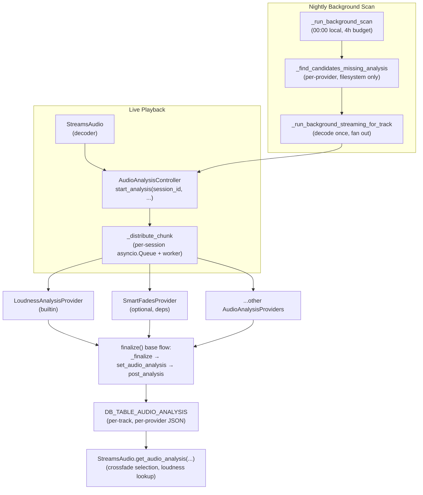
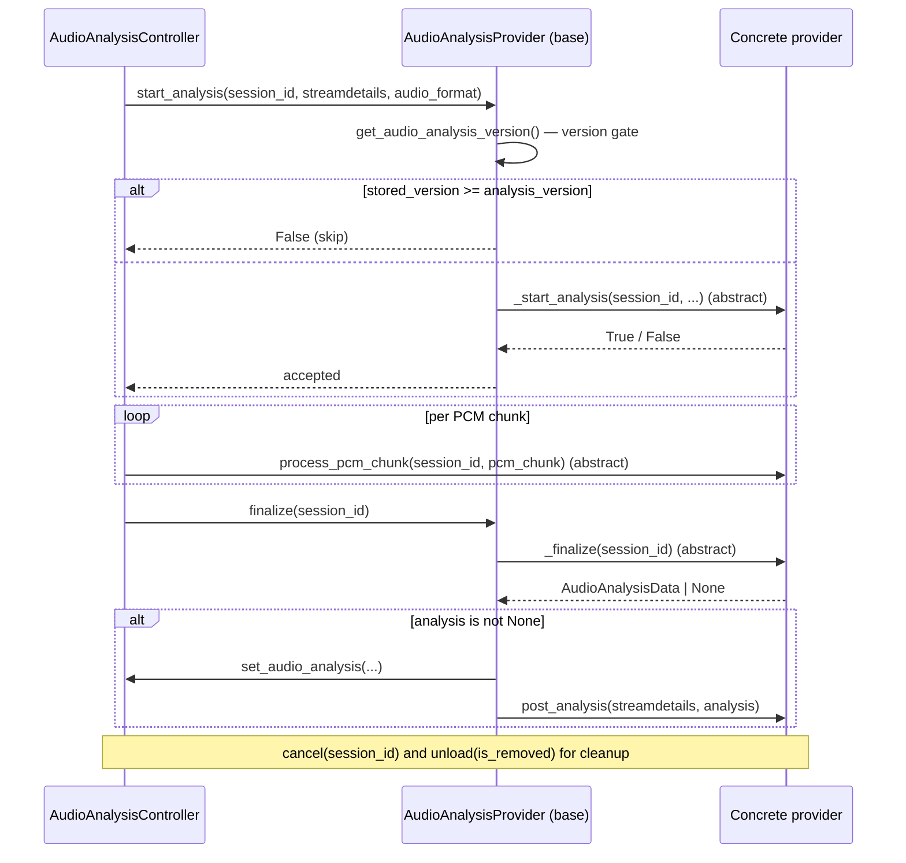

# 16 — Audio Analysis Subsystem

Audio analysis is a pluggable subsystem under the streams controller. **Audio analysis providers** receive PCM during streaming and persist analysis results — loudness (EBU R128), beat tracking, musical key, energy descriptors — into the library database. The same hooks drive both live playback and a nightly background scan, so providers do not need to know which context they are running in (#3509). Loudness measurement and smart-fades beat detection — both formerly bespoke chunk callbacks attached to the `AudioBuffer` — are now built on this subsystem.

## Architecture

Live playback and the background scan converge on the same `AudioAnalysisController`, which fans PCM chunks out to every registered provider. Each provider produces an `AudioAnalysisData` result; the base class persists it to `DB_TABLE_AUDIO_ANALYSIS` and then fires the provider's `post_analysis` hook.

## `AudioAnalysisController`

Defined in [`music_assistant/controllers/streams/audio_analysis.py`](../../music_assistant/controllers/streams/audio_analysis.py).

**Ownership.** A sub-controller of `StreamsController`, exposed as `mass.streams.audio_analysis`. Lifecycle is driven by `StreamsController`: `setup()` configures CPU caps and registers the nightly scan; `close()` cancels in-flight workers.

**Provider discovery.** The `providers` property returns `mass.get_providers(ProviderType.AUDIO_ANALYSIS)` filtered to available `AudioAnalysisProvider` instances.

**Session model.** `start_analysis(session_id, streamdetails, audio_format)` calls the same hook on every provider; each provider may decline (unsupported format, version already up-to-date). Live PCM enters via `_distribute_chunk(session_key, pcm_data)`, which feeds an `asyncio.Queue` per session served by `_chunk_worker`. The queue gives the controller a backpressure point: when the worker cannot drain in time, `CHUNK_PROCESS_TIMEOUT_SECONDS = 1.0` triggers a deferred drop rather than blocking the audio source. Sessions terminate via `_finalize_providers(session_key)` (success) or `_cancel_providers(session_key)` (cleanup).

**Persistence helpers.**

| Method | Purpose |
|---|---|
| `set_audio_analysis(item_id, provider_instance, aa_provider_domain, analysis, analysis_version, media_type)` | Writes JSON-serialized `AudioAnalysisData` plus the `analysis_version` to `DB_TABLE_AUDIO_ANALYSIS` keyed by `(media_type, item_id, provider, aa_provider_domain)`. |
| `get_audio_analysis(item_id, provider_instance_id_or_domain, media_type)` | Returns the merged `AudioAnalysisData` across all providers for a track — lets crossfade pull beats from one provider and loudness from another. |
| `get_audio_analysis_version(item_id, provider, aa_provider_domain, media_type)` | The gate consulted by `start_analysis` before accepting a session. |
| `set_track_loudness(item_id, provider, loudness, loudness_album, media_type)` | Side door for external loudness sources (file tags, ReplayGain). Persists under the builtin `loudness_analysis` domain so the runtime ebur128 provider will not re-analyze the track on playback (#3727). |

## `AudioAnalysisProvider`

Defined in [`music_assistant/models/audio_analysis_provider.py`](../../music_assistant/models/audio_analysis_provider.py). Subclasses must implement `_start_analysis`, `process_pcm_chunk`, and `_finalize`; other hooks default to safe no-ops.

Key points:

- **`analysis_version: int = 1`** class attribute (default 1) is the freshness gate. Bumping it on a provider forces re-analysis of every track that previously stored a smaller version. Per-media-type version gating means non-track media (podcasts, audiobooks) do not accidentally re-trigger analysis just because the track-side version moved (#3566).
- **`process_pcm_chunk` MUST `await` all heavy work** — the controller relies on this to backpressure the audio source. Synchronous compute should run in a thread (`asyncio.to_thread`) or a child process.
- **`post_analysis(streamdetails, analysis)`** is a side-effect hook that runs *after* persistence. The base class default is a no-op. Implementations must self-gate on whether `streamdetails.path` is a writable filesystem path, since this hook fires for both live and background-scan sessions (e.g. the loudness provider writes ReplayGain tags only when the source is on disk).

## `AudioAnalysisData`

Defined in [`music_assistant/models/audio_analysis.py`](../../music_assistant/models/audio_analysis.py). Shared dataclass that any provider may populate. All fields are optional (`None` by default) — providers fill only the fields they compute.

**General.**

| Field | Type | Purpose |
|---|---|---|
| `duration` | `float \| None` | Track duration in seconds |

**Loudness** (EBU R128, LUFS/LU/dBTP).

| Field | Type | Purpose |
|---|---|---|
| `loudness_integrated` | `float \| None` | Integrated loudness in LUFS |
| `loudness_album` | `float \| None` | Album-level integrated loudness (from tags/ReplayGain if available) |
| `loudness_range` | `float \| None` | Loudness range in LU |
| `true_peak` | `float \| None` | BS.1770-4 true peak in dBTP |

**Rhythm.**

| Field | Type | Purpose |
|---|---|---|
| `bpm` | `float \| None` | Beats per minute |
| `beats` | `NDArray[float32] \| None` | Beat positions in seconds |
| `downbeats` | `NDArray[float32] \| None` | Downbeat (bar-start) positions in seconds |
| `beats_per_bar` | `int \| None` | Time signature numerator (e.g. 3 for 3/4, 4 for 4/4) |

**Tonal.**

| Field | Type | Purpose |
|---|---|---|
| `key` | `str \| None` | Pitch class of detected key (`"C"`, `"F#"`, `"Bb"`, etc.) |
| `mode` | `str \| None` | `"major"` or `"minor"` |

**Spectral & energy** (fixed 1800 bins spanning the track).

| Field | Type | Purpose |
|---|---|---|
| `rms_energy` | `NDArray[float32] \| None` | RMS energy, peak-normalized 0.0–1.0 |
| `spectral_centroid` | `NDArray[float32] \| None` | Spectral centroid in Hz |

**High-level descriptors** (all normalized 0.0–1.0).

| Field | Purpose |
|---|---|
| `energy` | 0.0 low, 1.0 high |
| `danceability` | 0.0 not danceable, 1.0 very danceable |
| `valence` | 0.0 dark/sad, 1.0 bright/happy |
| `arousal` | 0.0 calm, 1.0 energetic (#132a0cac) |
| `speechiness` | 0.0 pure music, 1.0 pure speech |
| `instrumentalness` | 0.0 prominent vocals, 1.0 purely instrumental |
| `acousticness` | 0.0 electronic, 1.0 purely acoustic |
| `brightness` | 0.0 warm/dark, 1.0 bright/sharp |
| `harmonic_complexity` | 0.0 simple, 1.0 complex |
| `roughness` | 0.0 smooth, 1.0 rough/distorted |

## CPU Throttle and Concurrency

`_configure_thread_caps()` runs at controller setup:

- `torch.set_num_threads(_aa_thread_budget())` — caps PyTorch intra-op threading at `max(1, (os.process_cpu_count() or os.cpu_count() or 4) // 4)` (~25% of available cores) so audio analysis inference does not starve the rest of the server (#3808).
- `torch.set_num_interop_threads(1)` — only effective if no torch op has run yet; failure is suppressed.

Background scan concurrency: `CONF_BACKGROUND_SCAN_CONCURRENCY` (clamped to `[1, 8]`, default `DEFAULT_BACKGROUND_SCAN_CONCURRENCY`). Implemented as an `asyncio.Semaphore`; tracks process in parallel up to the limit, each subject to `BACKGROUND_PER_TRACK_TIMEOUT_SECONDS = 300`.

## Background Scan

`_run_background_scan` is registered as a daily scheduled task at midnight local time (`BACKGROUND_SCAN_TASK_ID = "audio_analysis_background_scan"`).

- **Candidate selection** (`_find_candidates_missing_analysis`) runs a SQL join across `DB_TABLE_PROVIDER_MAPPINGS` and `DB_TABLE_AUDIO_ANALYSIS` to find tracks whose `(provider, item_id)` lacks rows for one or more registered analysis-provider domains. Only filesystem-backed tracks are eligible — `FILESYSTEM_PROVIDER_DOMAINS = ("filesystem_local", "filesystem_smb", "filesystem_nfs")`. Streaming providers (Spotify, Tidal) are excluded because re-streaming is wasteful and the source files are not local for tag-write side effects.
- **Single-decode fan-out** (#3821): `_run_background_streaming_for_track` decodes the source once and feeds the resulting PCM into every provider that is missing analysis for that track. This replaced an earlier per-provider `analyze_file()` model that opened a separate decoder per provider.
- **Wall-clock budget**: `BACKGROUND_SCAN_RUN_BUDGET_SECONDS = 4 * 3600` (4 hours). Tracks already in flight finish; new candidates that have not started by the deadline defer to the next nightly run.
- **Auto-cleanup on deletion** (#3687): `MediaControllerBase` in [`music_assistant/controllers/media/base.py`](../../music_assistant/controllers/media/base.py) deletes corresponding `loudness_measurements` rows when a media item or provider mapping is removed, so re-imports start fresh.

## Built-in: Loudness Analysis

Located at [`music_assistant/providers/loudness_analysis/`](../../music_assistant/providers/loudness_analysis/). `LoudnessAnalysisProvider(AudioAnalysisProvider)` — builtin, non-disableable, single-instance. Replaces the old `attach_loudness_analyzer` chunk-callback approach (#3727).

- **Algorithm**: feeds PCM into ffmpeg with `filter_params=["ebur128=framelog=verbose"]` and parses the verbose log on `_finalize` to extract integrated loudness, loudness range, and true peak.
- **Robustness**: ebur128 reports ~-70 LUFS on near-silence or cancelled streams. Values below `LOUDNESS_MEASUREMENT_MIN_LUFS` are discarded so the runtime normalizer does not see junk values from short-circuited streams (#3703).
- **`post_analysis`**: writes ReplayGain tags onto local files when `streamdetails.path` is a writable filesystem path.

## Optional: Smart Fades v2

Located at [`music_assistant/providers/smart_fades/`](../../music_assistant/providers/smart_fades/). `SmartFadesProvider(AudioAnalysisProvider)`. Not builtin; requires `beat-this==1.1.0` and `nnAudio==0.3.3` Python deps (#3636).

- **Algorithms**: Beat This! transformer (CPJKU, ISMIR 2024) for beats and downbeats; S-KEY for musical key detection; per-block RMS energy and spectral centroid in parallel.
- **Streaming-friendly adaptation** of an offline-first model:
  - 10-second-block stateful resampling (`soxr.ResampleStream`) to 22050 Hz to avoid the edge artifacts that per-chunk stateless resampling would produce.
  - "Delayed last 2 frames" trick on the mel feature extractor so block-boundary frames see real forward context, matching offline-pipeline output bit-for-bit.
  - Hop-aligned (441-sample) audio segments so segment-local frame indices map exactly to global frame positions.
  - Single-pass model inference at `_finalize` on the concatenated features (Spect2Frames `small0` checkpoint dynamically quantized to qint8); pure-numpy DBN postprocessor (Viterbi over a bar-pointer HMM) replaces madmom.
- **Outputs**: `bpm`, `beats[]`, `downbeats[]`, `key`, `mode`, plus `rms_energy` and `spectral_centroid` interpolated to the standard 1800-bin grid.
- Full design rationale (streaming resampling, hop alignment, key detection model, etc.) lives in the in-tree [providers/smart_fades/README.md](../../music_assistant/providers/smart_fades/README.md).

## Crossfade Execution (separate from the analysis)

The `controllers/streams/smart_fades/` package is the **crossfade execution engine**, not the analysis algorithm — those split apart in the v2 design:

| Module | Role |
|---|---|
| [`mixer.py`](../../music_assistant/controllers/streams/smart_fades/mixer.py) | `SmartFadesMixer.mix(...)` — entry point. Reads persisted `AudioAnalysisData` via `mass.streams.audio_analysis.get_audio_analysis(...)` and picks `SmartCrossFade` (beat-matched) or falls back to `StandardCrossFade` (fixed-duration). |
| [`fades.py`](../../music_assistant/controllers/streams/smart_fades/fades.py) | `SmartFade` ABC plus `SmartCrossFade` and `StandardCrossFade` implementations. Each fade composes a list of `Filter` objects. |
| [`filters.py`](../../music_assistant/controllers/streams/smart_fades/filters.py) | Composable PCM filters: `CrossfadeFilter`, `FrequencySweepFilter`, `GradualTimeStretchFilter`, `TrimFilter`. |
| [`helpers.py`](../../music_assistant/controllers/streams/smart_fades/helpers.py) | Tempo step computation, downbeat extrapolation, synthetic-timestamp generation for partial analysis. |

`StreamsAudio` exposes the mixer via `streams_audio.smart_fades_mixer`. See [10-streaming-pipeline.md](10-streaming-pipeline.md#smart-fades-system) for where the mixer plugs into the audio path.

## Key Files

| File | Role |
|---|---|
| [`controllers/streams/audio_analysis.py`](../../music_assistant/controllers/streams/audio_analysis.py) | `AudioAnalysisController` — session lifecycle, PCM fan-out, persistence helpers, background scan, CPU caps |
| [`models/audio_analysis_provider.py`](../../music_assistant/models/audio_analysis_provider.py) | `AudioAnalysisProvider` ABC — hook surface, version gate, finalize/persist flow |
| [`models/audio_analysis.py`](../../music_assistant/models/audio_analysis.py) | `AudioAnalysisData` dataclass — shared analysis fields |
| [`providers/loudness_analysis/`](../../music_assistant/providers/loudness_analysis/) | Builtin EBU R128 loudness provider |
| [`providers/smart_fades/`](../../music_assistant/providers/smart_fades/) | Optional Beat This! / S-KEY analysis provider |
| [`controllers/streams/smart_fades/`](../../music_assistant/controllers/streams/smart_fades/) | Crossfade execution: mixer, fades, filters, helpers |
| `DB_TABLE_AUDIO_ANALYSIS` (`audio_analysis`) | Per-track, per-provider analysis JSON + version |
| `DB_TABLE_LOUDNESS_MEASUREMENTS` (`loudness_measurements`) | External-source loudness (file tags, ReplayGain) — auto-cleaned on item deletion |
