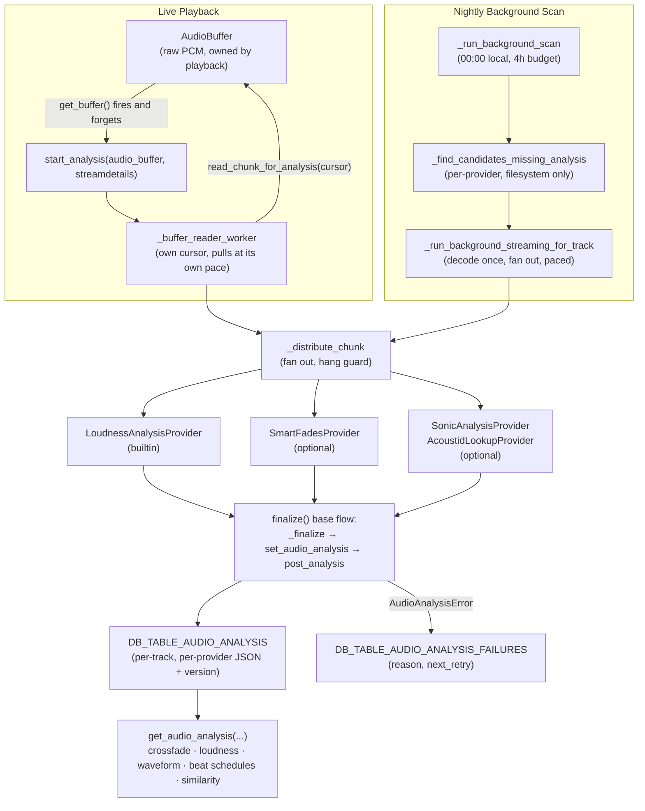
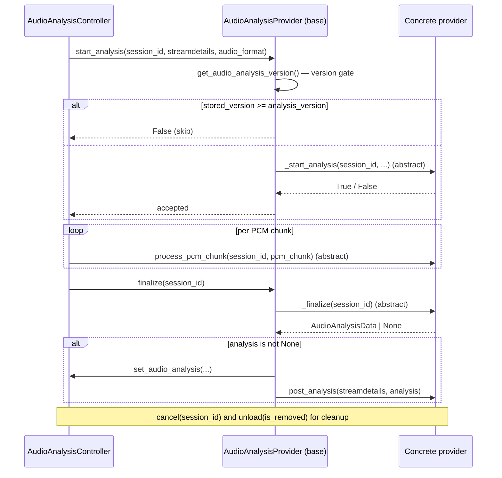

# 16 — Audio Analysis Subsystem

Audio analysis is a pluggable subsystem under the streams controller. **Audio analysis providers** receive PCM and persist analysis results — loudness (EBU R128), beat tracking, musical key, vocal activity, energy descriptors, CLAP embeddings, acoustic fingerprints — into the library database. The same hooks drive both live playback and a nightly background scan, so providers do not need to know which context they are running in (#3509).

The design constraint that shapes everything here: **analysis must never be able to degrade playback.** It runs the heaviest CPU work in the server — neural beat tracking, vocal-activity detection, CLAP inference — on the same box that has to keep an audio stream fed in real time. Three mechanisms enforce that: analysis *pulls* from the playback buffer rather than being pushed to (so it can fall behind and be dropped, never block), its CPU use is bounded by a semaphore and a niced thread pool, and while a player is actually streaming a solo lock holds it to one offload at a time.

## Architecture



Live playback and the background scan converge on the same `_distribute_chunk` fan-out, so providers see an identical chunk stream either way. Each provider produces an `AudioAnalysisData` result; the base class persists it and then fires the provider's `post_analysis` hook.

## `AudioAnalysisController`

Defined in [`music_assistant/controllers/streams/audio_analysis.py`](../../music_assistant/controllers/streams/audio_analysis.py).

**Ownership.** A sub-controller of `StreamsController`, exposed as `mass.streams.audio_analysis`. Lifecycle is driven by `StreamsController`: `setup()` registers the nightly scan; `close()` cancels in-flight workers. CPU caps are applied later by `ensure_inference_runtime_configured()` when a torch-backed provider actually needs them (see below).

**Provider discovery.** The `providers` property returns `mass.get_providers(ProviderType.AUDIO_ANALYSIS)` filtered to available `AudioAnalysisProvider` instances.

### Session model

`start_analysis(audio_buffer, streamdetails)` is the entry point, called fire-and-forget from `AudioBuffer.get_buffer()` (#4442). It takes the **buffer**, not a session id and format — the signature change is the whole point of the passive-observer design.

The session key is `streamdetails.uri`, so a second queue playing the same track does not start a duplicate session.

1. Offer the session to every available provider via `_start_analysis_on_providers()`; providers may decline (version already current, track too long, unsupported format, model load failed). **No accepting provider means no session at all.**
2. Enforce the per-queue session cap. `REALTIME_ANALYSIS_MAX_SESSIONS = 2` (#4451) — the playing track and its preloaded successor — evicting the oldest session *in that queue*. Scoping per queue rather than globally is deliberate: concurrent queues must not evict each other's still-playing analysis. Without the cap, rapid skipping would spawn a session per abandoned track.
3. Start `_buffer_reader_worker()` as a task and register `_on_cancel` through `audio_buffer.register_cancel_callback()`, so a torn-down buffer (track skipped, buffer cleaned up) frees the session.

`_buffer_reader_worker` holds **its own cursor** into the buffer's retained chunks and pulls one 1-second chunk at a time via `read_chunk_for_analysis(cursor)`, which does not mutate the buffer. Three exits:

| Exit | Cause | Outcome |
|---|---|---|
| `AudioBufferEOF` | Clean end of stream | Completed → providers finalized |
| `AudioBufferDiscarded` | The chunk it wanted was already evicted — the reader fell a full window behind | Session dropped, providers cancelled |
| Any other exception | Read failure | Session dropped |

Even a clean EOF is discarded when fewer than `ANALYSIS_MIN_COMPLETENESS_RATIO = 0.9` of the expected duration was received (#4738), so a source that died mid-track without raising cannot persist truncated analysis as if it were complete. That check is skipped when the duration is unknown (radio).

`_distribute_chunk(session_key, chunk, max_interval=CHUNK_HANG_GUARD_SECONDS)` fans each chunk out to the accepting providers. `CHUNK_HANG_GUARD_SECONDS = 120.0` replaced the old `CHUNK_PROCESS_TIMEOUT_SECONDS = 1.0`, and the direction of the change is informative: with the queue-and-backpressure model gone there is nothing to protect the audio source *from*, so the guard is now only about detecting a genuinely stuck provider — and it has to be generous, because analysis runs one offload at a time while a player streams, so a chunk can legitimately wait a long while behind other work before it computes. A provider that exceeds it is evicted from the session.

### Persistence helpers

| Method | Purpose |
|---|---|
| `set_audio_analysis(item_id, provider_instance_id_or_domain, aa_provider_domain, analysis, analysis_version, media_type)` | Writes JSON-serialized `AudioAnalysisData` plus the `analysis_version` to `DB_TABLE_AUDIO_ANALYSIS`, keyed by `(media_type, item_id, provider, aa_provider_domain)`. Also clears any recorded failure for that track/provider pair. |
| `get_audio_analysis(item_id, provider_instance_id_or_domain, media_type, priority)` | Returns the merged `AudioAnalysisData` across providers. **`priority` is the important addition:** with `None`, all available providers' rows merge latest-write-wins; with a tuple of AA domains, *only* those domains are considered and the first-listed wins each per-field conflict. That is how the loudness path insists on the authoritative EBU R128 value rather than another provider's loudness proxy, and how beat consumers insist on `smart_fades`. Rows from providers that are not currently available are always skipped. |
| `get_audio_analysis_version(...)` | The freshness gate consulted by `start_analysis`. |
| `get_audio_analysis_count(aa_domain)` | Row count for a provider, used by coverage reporting. |
| `set_track_loudness(item_id, provider, loudness, loudness_album, media_type)` | Side door for external loudness sources (file tags, ReplayGain). Persists under the builtin `loudness_analysis` domain so the runtime ebur128 provider will not re-analyze the track (#3727). Rejects non-finite values and anything at or below `LOUDNESS_MEASUREMENT_MIN_LUFS`. |
| `record_analysis_failure(...)` / `clear_analysis_failure(...)` | Write and delete `DB_TABLE_AUDIO_ANALYSIS_FAILURES` rows (#4167). Both no-op when the provider does not resolve to a loaded music provider. |
| `get_extra_data_for_album_tracks(...)` | Bulk read of `extra_data` across an album's tracks — used by AcoustID's album-level voting. |

**Corrupt-row recovery** (#4721). A row whose `analysis_data` JSON no longer deserializes — a model field changed type, say — used to be able to break reads. `_parse_row()` now catches the failure, logs only the error *type* and field name (the exception message can embed the entire 1800-bin payload), and collects the row id; the caller then **deletes** the unparsable rows so the track is simply re-analyzed. Provider keys are stored as `provider.domain` for streaming providers and `provider.instance_id` otherwise, so a re-added instance of a local filesystem provider does not orphan its rows.

## `AudioAnalysisProvider`

Defined in [`music_assistant/models/audio_analysis_provider.py`](../../music_assistant/models/audio_analysis_provider.py). Subclasses must implement `_start_analysis`, `process_pcm_chunk`, and `_finalize`; other hooks default to safe no-ops.



### Class attributes

| Attribute | Default | Purpose |
|---|---|---|
| `analysis_version` | `1` | Freshness gate. Bumping it forces re-analysis of every track that stored a smaller version. Per-media-type gating means non-track media (podcasts, audiobooks) do not re-trigger just because the track-side version moved (#3566). |
| `max_analysis_duration` | `None` | Longest track this provider will analyze; `start_analysis` declines beyond it. Providers that accumulate whole-track feature state opt in by setting it to `ACCUMULATING_ANALYSIS_MAX_DURATION_SECONDS` (1800 s). A multi-hour mix or audiobook would otherwise hold hundreds of MB of feature state and tie up the scan for hours — and smart crossfade or similarity carry no meaning at that length. |
| `has_unloadable_models` | `False` | Declares that the provider holds heavy ML models that can be freed while idle and reloaded on demand. |

### Model lifecycle

Providers with `has_unloadable_models = True` get load-on-demand and unload-when-idle for free:

- `ensure_models_loaded()` loads under an `asyncio.Lock` so concurrent session starts load once, and returns `False` on failure so `start_analysis` can decline the session rather than proceed model-less.
- `unload_idle_models()` frees them; the controller's idle monitor calls it after `MODEL_IDLE_UNLOAD_SECONDS` (300) without activity, checking every `MODEL_IDLE_CHECK_INTERVAL_SECONDS` (60) (#4452).
- Subclasses override `_load_models()` / `_free_models()`. `unload()` frees them too, alongside cancelling any active sessions.

### Offloading CPU work

`process_pcm_chunk` must `await` all heavy work, and the way to do that is `_run_offloaded(func, *args)` — not a bare `asyncio.to_thread`. Routing through it is what subjects the work to the controller's caps:

```python
result = await self._run_offloaded(self._compute_block, pcm)
result, seconds = await self._run_offloaded_timed(self._compute_block, pcm)
```

`_run_offloaded` acquires a semaphore permit, additionally takes the solo lock when `playback_active()`, and runs the callable on the controller's niced pool (falling back to `asyncio.to_thread` when no pool is configured). Two subtleties in its implementation are worth knowing because they are easy to get wrong in a reimplementation: the result is `await`ed under `asyncio.shield`, and the permit and lock are released from a done-callback on the future rather than in a `finally`. A cancelled awaiter cannot stop a running thread, so the slot must keep counting against the caps until the thread actually finishes. It also logs when an offload waited more than 0.5 s for a permit, which is the signal that analysis is queueing behind the caps rather than computing.

`_run_offloaded_timed` returns the callable's own execution seconds, never the time spent queued.

### Failure recording

`AudioAnalysisError(reason, retry_at=None)` (in `models/audio_analysis.py`) is how a provider fails an analysis deliberately. `retry_at` must be timezone-aware; `None` means never auto-retry. The base class catches it from both `_start_analysis` and `_finalize` and routes it to `record_analysis_failure()`, which writes a `DB_TABLE_AUDIO_ANALYSIS_FAILURES` row (#4167).

The error handling around the provider hooks is deliberately layered, because each layer has a different failure surface:

| Raised in | Handling |
|---|---|
| `AudioAnalysisError` from `_start_analysis` / `_finalize` | Recorded as a failure; session declined or abandoned |
| `asyncio.CancelledError` | Re-raised untouched — cancellation is not an analysis failure and must not be recorded as one |
| Any other exception from `_start_analysis` / `_finalize` | Logged with traceback *and* recorded as a failure. The catch stays broad because these are provider-implemented ffmpeg/torch/numpy paths with open-ended failure modes |
| `set_audio_analysis` | Logged and skipped — a DB write failure must not break session cleanup |
| `post_analysis` | Logged and skipped — a failing side effect must not break cleanup |
| `record_analysis_failure` itself | `sqlite3.Error` swallowed — the failure recorder must never break the session lifecycle |

The through-line: `finalize()` always reaches its `self._sessions.pop(session_id, None)`, whatever any hook does.

### `post_analysis`

A side-effect hook that runs *after* persistence; the base default is a no-op. Implementations must self-gate on whether `streamdetails.path` is a writable filesystem path, since it fires for both live and background-scan sessions — the loudness provider writes ReplayGain tags only when the source is on disk.

## `AudioAnalysisData`

Defined in [`music_assistant/models/audio_analysis.py`](../../music_assistant/models/audio_analysis.py). Shared `kw_only` dataclass that any provider may populate. All fields are optional (`None` by default) — providers fill only the fields they compute, and `update()` merges another instance latest-write-wins over non-`None` fields.

The model stays **server-local** and deliberately **numpy-free**: the rhythm and spectral fields are plain `list[float]`, not numpy arrays, so importing this model never pulls numpy in. Compute code that needs array math (smart fades, sonic analysis) converts at the point of use. That keeps numpy off installs that only do loudness normalization. The lighter `AudioAnalysisCoverage` shape lives upstream in `music_assistant_models.audio_analysis`.

**General.**

| Field | Type | Purpose |
|---|---|---|
| `duration` | `float \| None` | Track duration in seconds |

**Loudness** (EBU R128, LUFS/LU/dBTP).

| Field | Type | Purpose |
|---|---|---|
| `loudness_integrated` | `float \| None` | Integrated loudness in LUFS |
| `loudness_album` | `float \| None` | Album-level integrated loudness (from tags/ReplayGain if available) |
| `loudness_range` | `float \| None` | Loudness range in LU |
| `true_peak` | `float \| None` | BS.1770-4 true peak in dBTP |

**Rhythm.**

| Field | Type | Purpose |
|---|---|---|
| `bpm` | `float \| None` | Beats per minute |
| `beats` | `list[float] \| None` | Beat positions in seconds |
| `downbeats` | `list[float] \| None` | Downbeat (bar-start) positions in seconds |
| `beats_per_bar` | `int \| None` | Time signature numerator (e.g. 3 for 3/4, 4 for 4/4) (#4580) |

**Tonal.**

| Field | Type | Purpose |
|---|---|---|
| `key` | `str \| None` | Pitch class of detected key (`"C"`, `"F#"`, `"Bb"`, etc.) |
| `mode` | `str \| None` | `"major"` or `"minor"` |

**Spectral & energy** (fixed 1800 bins spanning the track).

| Field | Type | Purpose |
|---|---|---|
| `rms_energy` | `list[float] \| None` | RMS energy, peak-normalized 0.0–1.0 |
| `spectral_centroid` | `list[float] \| None` | Spectral centroid in Hz |

**High-level descriptors** (all normalized 0.0–1.0).

| Field | Purpose |
|---|---|
| `energy` | 0.0 low, 1.0 high |
| `danceability` | 0.0 not danceable, 1.0 very danceable |
| `valence` | 0.0 dark/sad, 1.0 bright/happy |
| `arousal` | 0.0 calm, 1.0 energetic (#132a0cac) |
| `speechiness` | 0.0 pure music, 1.0 pure speech |
| `instrumentalness` | 0.0 prominent vocals, 1.0 purely instrumental |
| `acousticness` | 0.0 electronic, 1.0 purely acoustic |
| `brightness` | 0.0 warm/dark, 1.0 bright/sharp |
| `harmonic_complexity` | 0.0 simple, 1.0 complex |
| `roughness` | 0.0 smooth, 1.0 rough/distorted |
| `rhythmic_regularity` | 0.0 free/rubato, 1.0 metronomic |

**Provider-specific.**

| Field | Type | Purpose |
|---|---|---|
| `extra_data` | `dict[str, Any] \| None` | Catch-all for data that does not warrant a first-class field |

`extra_data` is how providers ship structured payloads without growing the shared model. Current keys:

| Key | Written by | Contents |
|---|---|---|
| `vocal_activity` | `smart_fades` | 1800-bin vocal-activity timeline from FireRed AED (#4786) |
| `band_rms` | `smart_fades` | Per-band RMS envelopes (`low`, `low_mid`, `mid`, `high`), each 1800 bins, normalized against the same peak as `rms_energy` (#4580) |
| `clap_embedding` | `sonic_analysis` | CLAP audio embedding vector; the source of truth for the similarity index |
| `mbid`, `isrc`, `source`, `retry_after` | `acoustid_lookup` | Resolved MusicBrainz recording ID and ISRC, the provenance of the match, and a rate-limit backoff marker |

Because these are untyped, consumers must validate defensively. `vocal.py` in the smart-fades execution engine returns `None` for an absent or malformed `vocal_activity` rather than raising, and `bands.py` reads historical `band_rms` rows *by shape* — an older `analysis_version` may have written a different band set, and the band edges in `BAND_RMS_BANDS` describe only what the current version writes.

## CPU Throttle and Concurrency

This is the machinery that keeps analysis from degrading playback. Note the entry point: `ensure_inference_runtime_configured()` is **not** called at controller setup. Torch-backed providers call it at the start of their own `handle_async_init`, before loading models — so a host running no torch-backed provider never imports torch at all, and `set_num_interop_threads` still runs before the first torch op (its only valid window). The controller's `setup()` does nothing but register the nightly scan.

| Mechanism | Bound | Rationale |
|---|---|---|
| `torch.set_num_threads(inference_thread_budget())` | ~25% of cores | Caps PyTorch intra-op threading so inference does not starve the server (#3808). Shared with the native BLAS cap applied from the environment at process start (`cap_native_thread_pools`), so torch and OpenBLAS agree on a budget (#4568, #4311) — BLAS cannot be capped from here without deadlocking against a concurrent import |
| `torch.set_num_interop_threads(1)` | 1 | Suppressed on failure, since it only works before the first op |
| `analysis_semaphore` (`InstrumentedSemaphore`) | `max(1, cpu_count // 2)` | Caps concurrent analysis offloads at **half the cores** so analysis never occupies the whole box (#4311) |
| `analysis_solo_lock` | 1 offload | Taken *only while a player is streaming* (#4449). The GIL serializes Python execution, so concurrent inference starves the playback loop even under the semaphore. Idle, the semaphore alone applies and background work uses spare cores |
| `analysis_executor` (`ThreadPoolExecutor`) | `max(2, cpu_count)` workers | Every worker thread runs `_nice_analysis_worker` as its initializer, setting `ANALYSIS_THREAD_NICE = 10`. Linux-only, where nice is per-thread so it applies to this pool only; a no-op elsewhere. Sized above the caps deliberately — the semaphore and solo lock decide how many actually run |
| Idle model unload | 300 s | `MODEL_IDLE_UNLOAD_SECONDS`, checked every 60 s (#4452) |

`InstrumentedSemaphore` subclasses `asyncio.Semaphore` rather than wrapping it, so existing `isinstance` checks keep working, and exposes live `in_flight` / `capacity` / `waiters` counters — letting `_run_offloaded` log contention without touching asyncio internals.

On ARM hosts, `torch.backends.nnpack.set_flags(False)` is applied: NNPACK frequently fails to initialize on ARM SBCs like the Raspberry Pi, and torch then re-logs "Could not initialize NNPACK" on every conv op. Those hosts use the fp32 conv fallback regardless, so disabling it only removes log spam.

## Background Scan

`_run_background_scan` is registered as a daily scheduled task at midnight local time (`BACKGROUND_SCAN_TASK_ID = "audio_analysis_background_scan"`).

- **Candidate selection** (`_find_candidates_missing_analysis`) runs a SQL join across `DB_TABLE_PROVIDER_MAPPINGS` and `DB_TABLE_AUDIO_ANALYSIS` to find tracks whose `(provider, item_id)` lacks rows for one or more registered analysis-provider domains. Only filesystem-backed tracks are eligible — `FILESYSTEM_PROVIDER_DOMAINS = ("filesystem_local", "filesystem_smb", "filesystem_nfs")`. Streaming providers (Spotify, Tidal) are excluded because re-streaming is wasteful and the source files are not local for tag-write side effects.
- **Single-decode fan-out** (#3821): `_run_background_streaming_for_track` decodes the source once and feeds the resulting PCM into every provider that is missing analysis for that track. This replaced an earlier per-provider `analyze_file()` model that opened a separate decoder per provider.
- **Concurrency**: `CONF_BACKGROUND_SCAN_CONCURRENCY`, clamped to **`[1, 16]`** (default 2, or 1 below four cores), implemented as an `asyncio.Semaphore` over the candidate list.
- **Per-track timeout**: `max(BACKGROUND_PER_TRACK_TIMEOUT_SECONDS, duration × 1.5)` — a flat 300 s would time out a long track that is progressing perfectly well, so the multiplier scales the allowance with the material.
- **Pacing floor** (#4568): `BACKGROUND_PACE_INTERVAL_SECONDS_FLOOR = 0.250` between consecutive chunk dispatches. One chunk is one audio-second, so the floor caps each scanned track at roughly 4× realtime. Nightly work should be slow and steady rather than saturating the CPU to finish sooner.
- **Wall-clock budget**: `BACKGROUND_SCAN_RUN_BUDGET_SECONDS = 4 * 3600` (4 hours). Tracks already in flight finish; new candidates that have not started by the deadline defer to the next nightly run.
- **Auto-cleanup on deletion** (#3687): `MediaControllerBase` deletes the corresponding analysis rows when a media item or provider mapping is removed, so re-imports start fresh.

## Provider Inventory

| Provider | Kind | Version | Produces |
|---|---|---|---|
| `loudness_analysis` | `AudioAnalysisProvider`, **builtin**, non-disableable | 1 | EBU R128 integrated loudness, range, true peak |
| `smart_fades` | `AudioAnalysisProvider`, optional | **3** | Beats, downbeats, beats-per-bar, key/mode, RMS energy, spectral centroid, `vocal_activity`, `band_rms` |
| `sonic_analysis` | `AudioAnalysisProvider`, optional, ML-heavy | 1 | High-level descriptors, RMS energy, spectral centroid, `clap_embedding` |
| `acoustid_lookup` | `AudioAnalysisProvider`, optional | 1 | MusicBrainz recording ID / ISRC via acoustic fingerprint |
| `sonic_similarity` | **`PluginProvider`** — *not* an analysis provider | — | Consumes `clap_embedding`; provides similar tracks and a discover row |

`sonic_similarity` being a plugin rather than an analysis provider is the distinction to keep straight: analysis providers *produce* rows from PCM, and it produces nothing. It `depends_on` `sonic_analysis` and reads the embeddings back out.

There is also a `_demo_audio_analysis_provider` in the tree, the annotated template for writing one.

## Built-in: Loudness Analysis

Located at [`music_assistant/providers/loudness_analysis/`](../../music_assistant/providers/loudness_analysis/). `LoudnessAnalysisProvider(AudioAnalysisProvider)` — builtin, non-disableable, single-instance. Replaces the old `attach_loudness_analyzer` chunk-callback approach (#3727).

- **Algorithm**: feeds PCM into ffmpeg with `filter_params=["ebur128=framelog=verbose"]` and parses the verbose log on `_finalize` to extract integrated loudness, loudness range, and true peak.
- **Robustness**: ebur128 reports ~-70 LUFS on near-silence or cancelled streams. Values below `LOUDNESS_MEASUREMENT_MIN_LUFS` are discarded so the runtime normalizer does not see junk values from short-circuited streams (#3703).
- **`post_analysis`**: writes ReplayGain tags onto local files when `streamdetails.path` is a writable filesystem path.

## Optional: Smart Fades

Located at [`music_assistant/providers/smart_fades/`](../../music_assistant/providers/smart_fades/). `SmartFadesProvider(AudioAnalysisProvider)`, `analysis_version = 3`, `has_unloadable_models = True`, capped at 1800 s. Not builtin; requires `beat-this==1.1.0`, `nnAudio==0.3.4` and `kaldi-native-fbank==1.22.3` (#3636) — check the manifest for current pins.

- **Algorithms**: Beat This! transformer (CPJKU, ISMIR 2024) for beats and downbeats; S-KEY for musical key detection; per-block RMS energy and spectral centroid in parallel.
- **Streaming-friendly adaptation** of an offline-first model:
  - 10-second-block stateful resampling (`soxr.ResampleStream`) to 22050 Hz to avoid the edge artifacts that per-chunk stateless resampling would produce.
  - "Delayed last 2 frames" trick on the mel feature extractor so block-boundary frames see real forward context, matching offline-pipeline output bit-for-bit.
  - Hop-aligned (441-sample) audio segments so segment-local frame indices map exactly to global frame positions.
  - Single-pass model inference at `_finalize` on the concatenated features (Spect2Frames `small0` checkpoint dynamically quantized to qint8); pure-numpy DBN postprocessor (Viterbi over a bar-pointer HMM) replaces madmom.
- **Version 3 outputs**: `bpm`, `beats[]`, `downbeats[]`, `beats_per_bar`, `key`, `mode`, plus `rms_energy` and `spectral_centroid` aggregated to the standard 1800-bin grid. Energy bins use **mean power** rather than point sampling, because point sampling aliases beat-rate ripple into the bins; the centroid is zeroed where energy is negligible, since noise dominates there. `extra_data` carries `vocal_activity` (FireRed AED, #4786) and `band_rms` (four bands, #4580) — the latter normalized against the same peak as `rms_energy`, which is what makes band *fractions* comparable across tracks despite per-track peak normalization.
- Full design rationale (streaming resampling, hop alignment, key-detection model, the DBN postprocessor) lives in the in-tree [providers/smart_fades/README.md](../../music_assistant/providers/smart_fades/README.md).

## Optional: Sonic Analysis

Located at [`music_assistant/providers/sonic_analysis/`](../../music_assistant/providers/sonic_analysis/). `SonicAnalysisProvider(AudioAnalysisProvider)`, version 1, unloadable models, capped at 1800 s. Introduced in #3795. Requires `transformers`, `huggingface-hub`, `torchlibrosa` and `PyYAML`.

Two things at once, from a single audio load per track:

- **librosa-style scalar features** computed per 10-second block at 22050 Hz (with a 2048-sample overlap and stateful `soxr.ResampleStream`), collapsed at finalize into `energy`, `brightness`, `harmonic_complexity`, `roughness`, `rhythmic_regularity`, `loudness_integrated`, `loudness_range`, plus `rms_energy` and `spectral_centroid` series.
- **CLAP zero-shot scoring and an embedding.** Microsoft CLAP's HTSAT audio encoder takes a fixed 7-second window at 44.1 kHz, so the provider plans a set of window start positions up front from the track duration and a `clap_sampling` preset — `fast` (1 window), `balanced` (3) or `thorough` (8) — and selectively buffers only those windows. `score_scalars()` turns the embedding into descriptor scalars against precomputed prompt-pair embeddings (#4307); the embedding itself lands in `extra_data["clap_embedding"]`.

**Hardware gating.** On-device CLAP inference is not free, so the provider requires ~4 GB RAM and 2 cores to load at all (via `meets_memory_target`, which tolerates a genuine 4 GB host reporting ~3.8 GB), and surfaces an informational config notice below the recommended 6 GB / 4 cores.

**The CLAP model is vendored**, at [`providers/sonic_analysis/vendored_clap/`](../../music_assistant/providers/sonic_analysis/vendored_clap/README.md) — a pinned copy of Microsoft's MIT-licensed `msclap`. It is vendored rather than pip-installed because the PyPI package declares `librosa<0.11.0` and `numpy<2.0.0` pins that conflict with Music Assistant's, even though `clap_wrapper.py` does not actually use librosa at runtime; pip refuses regardless. The MA-side changes are all marked `# MA MOD:` in source and catalogued in that README — notably a cross-platform audio-loading fix, a flag to skip downloading ~500 MB of GPT2 text-encoder weights that MA never uses, a tensor-input path so live PCM can be scored without round-tripping through a temp file, and scoping a module-level `warnings.filterwarnings("ignore")` down to the model load (upstream's placement would have silenced warnings from every other provider for the process lifetime).

## Optional: AcoustID Lookup

Located at [`music_assistant/providers/acoustid_lookup/`](../../music_assistant/providers/acoustid_lookup/). `AcoustidLookupProvider(AudioAnalysisProvider)`, version 1. Introduced in #3892; requires `pyacoustid`.

Unlike the others this provider produces no signal analysis at all — it computes a Chromaprint acoustic fingerprint, submits it to AcoustID, and resolves the result to a MusicBrainz recording. Output lands entirely in `extra_data`: `mbid`, `isrc`, and a `source` marker recording whether the identifier came from the fingerprint lookup or from existing file tags. It cooperates with the `musicbrainz` provider for resolution and votes across an album's tracks using `get_extra_data_for_album_tracks`.

The rate-limit handling is a good illustration of `AudioAnalysisError(retry_at=...)`: a throttled lookup stores a `retry_after` marker and a distinct `NO_MATCH_ANALYSIS_VERSION`, so a track that genuinely has no match is not retried forever while a rate-limited one is.

## Crossfade Execution (separate from the analysis)

The analysis/execution split is the central architectural fact about smart fades. This document covers the **analysis** half — `providers/smart_fades/` at `analysis_version = 3`, producing rows. The **execution** half is `controllers/streams/smart_fades/`, which reads those rows back via `get_audio_analysis(..., priority=(SMART_FADES_ANALYSIS_DOMAIN,))` and turns them into a rendered transition. It spans roughly fifteen modules — a candidate/policy planner, vocal-collision math, band EQ assembly, and a filter renderer.

**See [17-smart-fades.md](17-smart-fades.md) for the execution engine.** [10-streaming-pipeline.md](10-streaming-pipeline.md#crossfade) covers where it plugs into the audio path.

## API Commands

| Command | Scope | Purpose |
|---|---|---|
| `audio_analysis/wave_form` | — | The 1800-bin `rms_energy` waveform for a track, or `None` when unanalyzed. Reads with `TRACK_EXPORT_AA_PRIORITY = (smart_fades, sonic_analysis)`, so the authoritative provider wins and the other is a fallback (#4626) |
| `audio_analysis/coverage` | `SYSTEM_MANAGE` | Per-provider health counts: `analyzed`, `pending` (filesystem-source tracks only, since streaming tracks are never background candidates), `stale_version`, and the provider's current `analysis_version` |
| `audio_analysis/failures` | `SYSTEM_MANAGE` | Recorded failures, optionally filtered by AA domain (#4167) |
| `audio_analysis/failures/clear` | `SYSTEM_MANAGE` | Delete failures by item, provider, or AA domain; returns the count. A call with no filters deletes nothing rather than everything |

The same `TRACK_EXPORT_AA_PRIORITY` backs the `bpm` and `musical_key` exposed on track metadata (#4626).

One detail in the coverage query worth noting, since it is an easy SQL trap: pre-versioning rows have a `NULL` `analysis_version`, and SQLite evaluates `NULL < N` as `NULL` (falsy). The stale count matches `analysis_version IS NULL OR analysis_version < :current` explicitly so those rows are correctly treated as stale.

## Downstream Consumers

| Consumer | Reads | Use |
|---|---|---|
| `controllers/streams/smart_fades/` | `beats`, `downbeats`, `beats_per_bar`, `band_rms`, `vocal_activity`, `rms_energy` | Transition planning and rendering — see [17-smart-fades.md](17-smart-fades.md) |
| `StreamsAudio.get_queue_item_stream` | `loudness_integrated`, `loudness_album` | Just-in-time loudness hydration for measurement-based normalization — see [10-streaming-pipeline.md](10-streaming-pipeline.md#volume-normalization) |
| `providers/sendspin/player.py` | `beats`, `downbeats` | Builds the Sendspin visualizer **beat schedule**: converts beat positions into `BeatTiming` entries anchored to the track's offset within the flow stream's audio timeline, re-pushing only on track change or seek. When analysis has not finished yet (the offline network takes ~5–10 s) it clears the schedule and starts a poller rather than caching a miss |
| `providers/hue_entertainment/analyzer.py` | *the pushed schedule*, not the analysis | Renders palette colour cycling and brightness pulses between beats, consuming the `BeatTiming` schedule off the Sendspin visualizer protocol. See the [Hue Entertainment README](../../music_assistant/providers/hue_entertainment/README.md) |
| `providers/sonic_similarity/` | `extra_data["clap_embedding"]` | Builds a `usearch` vector index over the embeddings (SQLite stays the source of truth) for similar-tracks and a discover row |

The Sendspin/Hue split is worth stating explicitly because it is easy to assume the light provider does its own analysis: **Sendspin derives** the beat schedule from persisted rows and pushes it over the protocol; **Hue consumes** that schedule. Neither runs beat detection inline.

## Key Files

| File | Role |
|---|---|
| [`controllers/streams/audio_analysis.py`](../../music_assistant/controllers/streams/audio_analysis.py) | `AudioAnalysisController` — session lifecycle, buffer reader, PCM fan-out, persistence, failures, background scan, CPU caps |
| [`models/audio_analysis_provider.py`](../../music_assistant/models/audio_analysis_provider.py) | `AudioAnalysisProvider` ABC, `InstrumentedSemaphore`, `AnalysisSessionData`, offload helpers |
| [`models/audio_analysis.py`](../../music_assistant/models/audio_analysis.py) | `AudioAnalysisData` dataclass and `AudioAnalysisError` |
| [`providers/loudness_analysis/`](../../music_assistant/providers/loudness_analysis/) | Builtin EBU R128 loudness provider |
| [`providers/smart_fades/`](../../music_assistant/providers/smart_fades/) | Optional Beat This! / S-KEY / FireRed analysis provider (`analysis_version = 3`) |
| [`providers/sonic_analysis/`](../../music_assistant/providers/sonic_analysis/) | Optional CLAP + librosa descriptor provider, with vendored `msclap` |
| [`providers/acoustid_lookup/`](../../music_assistant/providers/acoustid_lookup/) | Optional Chromaprint → MusicBrainz identification provider |
| [`providers/sonic_similarity/`](../../music_assistant/providers/sonic_similarity/) | Plugin provider consuming CLAP embeddings for similarity |
| [`providers/_demo_audio_analysis_provider/`](../../music_assistant/providers/_demo_audio_analysis_provider/) | Annotated template for writing an analysis provider |
| [`controllers/streams/smart_fades/`](../../music_assistant/controllers/streams/smart_fades/) | Crossfade **execution** engine — see [17-smart-fades.md](17-smart-fades.md) |
| `DB_TABLE_AUDIO_ANALYSIS` (`audio_analysis`) | Per-track, per-provider analysis JSON + version |
| `DB_TABLE_AUDIO_ANALYSIS_FAILURES` (`audio_analysis_failures`) | Recorded failures with reason and optional `next_retry` |
| `DB_TABLE_PROVIDER_MAPPINGS` (`provider_mappings`) | Resolves a library item to the `(provider, item_id)` pairs analysis rows are keyed by; both analysis tables are cleaned up per mapping on item deletion |
