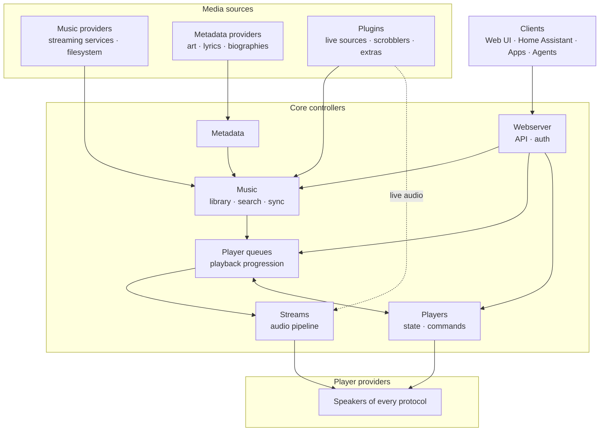

# Architecture

Music Assistant is a single-process async Python server. It aggregates music from streaming
services and local files into one library, and streams audio to speakers of many different
protocols. It integrates with Home Assistant but also runs standalone.

These documents are the big picture. Detail that belongs to one package lives in that package's
own README next to the code, and each page here links out to the ones it hands off to. If you want
to know what a function does, read the function; these pages are for understanding why the pieces
are arranged the way they are.

Config, cache and the event bus are deliberately absent from that diagram: everything above
depends on them, so they have no honest place in a dataflow drawing. See
[overview.md](overview.md) for the full controller map.

## Where to start

**I want to build a music provider.** Read [overview.md](overview.md), then
[providers.md](providers.md) for the lifecycle and manifest, [media-library.md](media-library.md)
for how your items are matched and stored, and [configuration.md](configuration.md) for config
entries and setup flows. The `_demo_music_provider` directory is an annotated template.

**I want to build a player provider.** Read [overview.md](overview.md), then
[players.md](players.md) for the player model and command routing,
[protocol-linking.md](protocol-linking.md) if your devices also speak another protocol,
[discovery.md](discovery.md) for being found on the network, and [providers.md](providers.md) for
the lifecycle. See `_demo_player_provider`.

**I want to build a plugin.** Read [plugins.md](plugins.md) for live audio sources, the selection
lifecycle and the receiver and scrobbler patterns. See `_demo_plugin_provider`.

**I want to understand playback.** Read [playback.md](playback.md) for the path from a play request
to audio on a speaker, then [grouping-and-volume.md](grouping-and-volume.md) for what changes when
more than one speaker is involved.

**I want to understand the API.** Read [api-and-auth.md](api-and-auth.md) for the surface, the
transports, scopes and users, plus [events-and-commands.md](events-and-commands.md) for how
commands and events relate.

**I want to connect an agent, or use AI features.** Read [ai-and-mcp.md](ai-and-mcp.md).

**I am debugging a running server.** Read [operations.md](operations.md) for background jobs, the
diagnostics report and where the logs are, and [discovery.md](discovery.md) for why a device is or
is not being found.

**I am adding user-facing text.** Read [localization.md](localization.md).

**I want the whole picture.** Read [overview.md](overview.md),
[events-and-commands.md](events-and-commands.md) and [configuration.md](configuration.md) first,
since everything else assumes them, then follow whichever path above interests you.

## All pages

| Page | Covers |
|---|---|
| [overview.md](overview.md) | The hub, the controllers, startup and shutdown, data directories |
| [events-and-commands.md](events-and-commands.md) | The event bus, the command registry, and how they relate |
| [configuration.md](configuration.md) | Config scopes, persistence, setup flows |
| [providers.md](providers.md) | Provider types, manifests, loading, features, errors |
| [players.md](players.md) | The player model and how a command reaches a device |
| [protocol-linking.md](protocol-linking.md) | Merging one physical device that speaks several protocols |
| [grouping-and-volume.md](grouping-and-volume.md) | The grouping models and volume routing |
| [media-library.md](media-library.md) | Aggregating providers into one library, and enriching it |
| [playback.md](playback.md) | From a play request to audio on a speaker |
| [plugins.md](plugins.md) | Live audio sources and the other plugin patterns |
| [api-and-auth.md](api-and-auth.md) | The API surface, users, scopes, remote access |
| [discovery.md](discovery.md) | Finding devices on the network |
| [operations.md](operations.md) | Background tasks, diagnostics, debugging |
| [localization.md](localization.md) | Authoring translatable text |
| [ai-and-mcp.md](ai-and-mcp.md) | AI provider features, and this server as an MCP server |

## Package documentation

Every controller and every non-trivial provider has a README beside its code, and larger ones have
sibling deep dives. Those own the detail; start from the architecture page above and follow the
link.

| Package | Covers |
|---|---|
| [music_assistant](../../music_assistant/README.md) | The package root: the hub, the event bus, the command registry |
| [controllers/cache](../../music_assistant/controllers/cache/README.md) | The SQLite cache and the caching decorator |
| [controllers/config](../../music_assistant/controllers/config/README.md) | Settings storage, scopes, setup flows, migrations |
| [controllers/diagnostics](../../music_assistant/controllers/diagnostics/README.md) | The diagnostics report and its sanitization |
| [controllers/discovery](../../music_assistant/controllers/discovery/README.md) | Zeroconf and SSDP |
| [controllers/metadata](../../music_assistant/controllers/metadata/README.md) | Enrichment, the image proxy, genres |
| [controllers/music](../../music_assistant/controllers/music/README.md) | The library, search, sync, schema, recommendations |
| [controllers/music/media](../../music_assistant/controllers/music/media/README.md) | The per-media-type sub-controllers and matching |
| [controllers/player_queues](../../music_assistant/controllers/player_queues/README.md) | Queues, state, continuation |
| [controllers/players](../../music_assistant/controllers/players/README.md) | The player controller internals |
| [controllers/streams](../../music_assistant/controllers/streams/README.md) | Buffering, processing, output, analysis |
| [controllers/streams/smart_fades](../../music_assistant/controllers/streams/smart_fades/README.md) | Transition planning and rendering |
| [controllers/tasks](../../music_assistant/controllers/tasks/README.md) | The background task manager |
| [controllers/translations](../../music_assistant/controllers/translations/README.md) | Runtime translation resolution and authoring |
| [controllers/webserver](../../music_assistant/controllers/webserver/README.md) | The API, auth, remote access |
| [providers/ai_radio](../../music_assistant/providers/ai_radio/README.md) | The AI radio orchestrator |
| [providers/airplay](../../music_assistant/providers/airplay/README.md) | AirPlay playback |
| [providers/airplay_receiver](../../music_assistant/providers/airplay_receiver/README.md) | Receiving AirPlay into the server |
| [providers/ariacast_receiver](../../music_assistant/providers/ariacast_receiver/README.md) | A natively implemented receiver protocol |
| [providers/fastmcp_server](../../music_assistant/providers/fastmcp_server/README.md) | This server as an MCP server |
| [providers/hass](../../music_assistant/providers/hass/README.md) | The Home Assistant connection, engines and control entities |
| [providers/hue_entertainment](../../music_assistant/providers/hue_entertainment/README.md) | Light sync |
| [providers/music_quiz](../../music_assistant/providers/music_quiz/README.md) | The multiplayer quiz |
| [providers/party](../../music_assistant/providers/party/README.md) | Guest queueing at a gathering |
| [providers/plex_connect](../../music_assistant/providers/plex_connect/README.md) | Appearing as a player in the Plex apps |
| [providers/radio_playlist](../../music_assistant/providers/radio_playlist/README.md) | Endless mixes generated from a seed item |
| [providers/sendspin](../../music_assistant/providers/sendspin/README.md) | The native synchronized protocol |
| [providers/sendspin_source](../../music_assistant/providers/sendspin_source/README.md) | Line-in and microphone sources |
| [providers/smart_fades](../../music_assistant/providers/smart_fades/README.md) | The audio analysis behind smart crossfades |
| [providers/smart_playlist](../../music_assistant/providers/smart_playlist/README.md) | Rule-based playlists |
| [providers/sonic_similarity](../../music_assistant/providers/sonic_similarity/README.md) | Finding tracks that sound alike |
| [providers/spotify_connect](../../music_assistant/providers/spotify_connect/README.md) | Spotify Connect and its backends |
| [providers/sync_group](../../music_assistant/providers/sync_group/README.md) | Sync group players |
| [providers/universal_player](../../music_assistant/providers/universal_player/README.md) | Universal players |
| [providers/vban_receiver](../../music_assistant/providers/vban_receiver/README.md) | Raw PCM over UDP, the simplest receiver |
| [providers/yandex_smarthome](../../music_assistant/providers/yandex_smarthome/README.md) | Voice control of players from Alice |
| [providers/yandex_ynison](../../music_assistant/providers/yandex_ynison/README.md) | Appearing as a device in the Yandex Music app |

## Elsewhere

- [DEVELOPMENT.md](../../DEVELOPMENT.md) for setting up a development environment.
- [AGENTS.md](../../AGENTS.md) for the conventions this codebase expects, human or otherwise.
- [developers.music-assistant.io](https://developers.music-assistant.io/) renders these pages and
  the package docs alongside the provider authoring guides.
