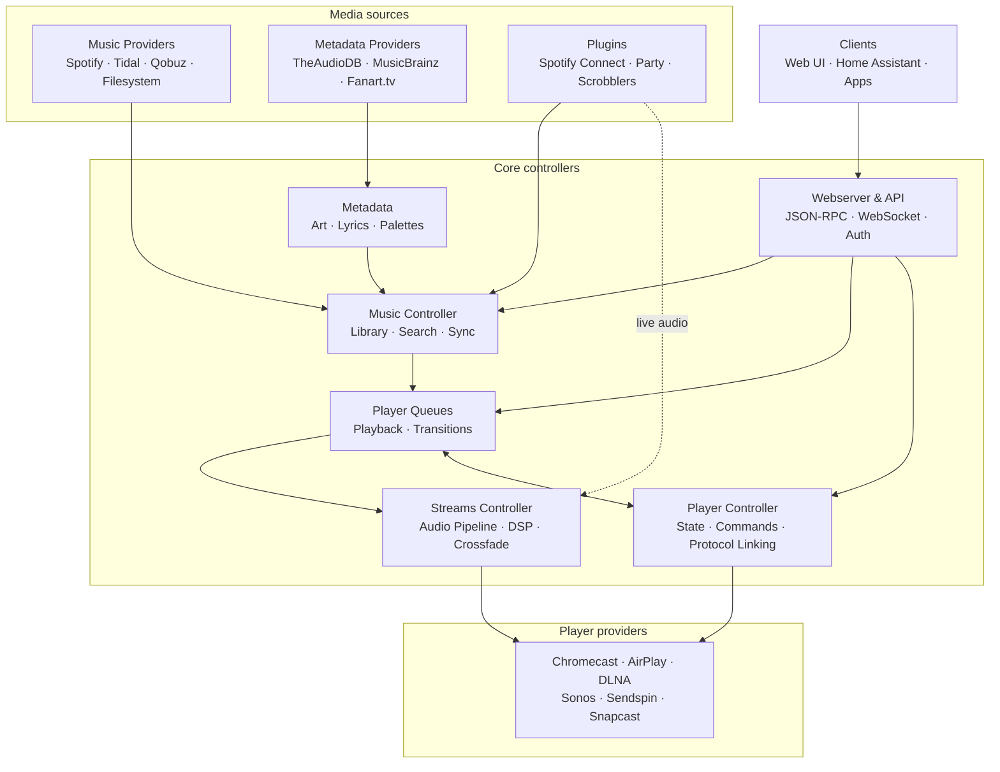

# Music Assistant Architecture Guide

## Getting Started

Music Assistant is a single-process async Python server that aggregates music from streaming services (Spotify, Tidal, Qobuz, local files) into a unified library and streams audio to speakers (Chromecast, AirPlay, DLNA, Sonos, and more). It integrates with Home Assistant but also runs standalone. The server is built on `asyncio` and `aiohttp`, with 13 controllers orchestrated by a central `MusicAssistant` hub, and a modular provider system for all external integrations.

Config, cache and the event bus are deliberately absent: every box above depends on them, so they have no honest place in a dataflow diagram. [00-overview.md](00-overview.md#component-map) has the full controller map, and [02-configuration.md](02-configuration.md) covers persistence.

### Recommended Reading Paths

- **I want to build a music provider** — Start with [00-overview.md](00-overview.md) for the big picture, then [15-provider-lifecycle.md](15-provider-lifecycle.md) for loading/unloading, [08-media-library.md](08-media-library.md) for the library sync pattern, and [02-configuration.md](02-configuration.md) for config entries. Also see the `_demo_music_provider` directory for an annotated template.

- **I want to build a player provider** — Read [00-overview.md](00-overview.md), then [03-player-model.md](03-player-model.md) for the `Player` class, [04-player-controller.md](04-player-controller.md) for command routing, [05-protocol-linking.md](05-protocol-linking.md) for multi-protocol device merging, and [15-provider-lifecycle.md](15-provider-lifecycle.md) for the loading lifecycle. See `_demo_player_provider` for a template.

- **I want to understand player behavior and grouping** — Read [03-player-model.md](03-player-model.md), [06-grouping.md](06-grouping.md) for the three grouping models (sync groups, universal groups, ad-hoc sync), and [07-volume.md](07-volume.md) for volume routing and group volume.

- **I want to understand the streaming pipeline** — Read [09-player-queues.md](09-player-queues.md) for queue management, the playback flow, and the pre-warm/enqueue-next hand-off, then [10-streaming-pipeline.md](10-streaming-pipeline.md) for audio decoding, buffering, normalization, crossfade, and output encoding.

- **I want to build a plugin** — Read [11-plugin-system.md](11-plugin-system.md) for the `AudioSource` media-item model, the selection lifecycle hooks, and the receiver/scrobbler/bridge patterns. See `_demo_plugin_provider` for a template.

- **I want to work with AI, or connect an LLM agent** — Read [18-ai-and-mcp.md](18-ai-and-mcp.md) for the `AI_QUERY`/`TTS` provider-feature contract and its consumers, and for the MCP server that exposes MA to external agents.

- **I want to understand the API** — Read [12-webserver-api.md](12-webserver-api.md) for JSON-RPC, WebSocket, routes, and remote access, plus [01-event-system.md](01-event-system.md) for the event/command duality. For who is allowed to call what, read [19-authentication.md](19-authentication.md).

- **I am operating or debugging a running server** — Read [20-background-tasks.md](20-background-tasks.md) for the job system and the diagnostics report, [13-discovery.md](13-discovery.md) for why a device is or isn't being found, and [02-configuration.md](02-configuration.md) for where settings and databases live.

- **I am adding user-facing text** — Read [21-localization.md](21-localization.md) for the `strings.json` authoring pipeline and how a translation key reaches the client already localized.

- **I just want a complete picture** — Read the documents in order, 00 through 21. They are structured to build understanding incrementally: core framework (00–02), players (03–07), media and playback (08–11), interfaces (12–15), audio analysis (16–17), and the newer subsystems (18–21).

---

## Complete Documentation Catalog

### Architecture Docs (`docs/architecture/`)

| Document | Description |
|----------|-------------|
| [00-overview.md](00-overview.md) | Central hub, controller map, startup/shutdown lifecycle, task management |
| [01-event-system.md](01-event-system.md) | Pub/sub events and the `EventType` set, subscription internals and dispatch, `mass.create_task`, command handlers and the `@api_command` decorator |
| [02-configuration.md](02-configuration.md) | JSON config, `ConfigEntry` schema, encryption, SQLite databases, caching |
| [03-player-model.md](03-player-model.md) | `Player` class, `_attr_*` pattern, `__final_*` computed properties, `PlayerState` snapshots |
| [04-player-controller.md](04-player-controller.md) | Command routing, registration, power/volume management, announcements, polling |
| [05-protocol-linking.md](05-protocol-linking.md) | Multi-protocol device merging, identifier matching, Universal Player, output selection |
| [06-grouping.md](06-grouping.md) | Sync groups, universal groups, ad-hoc sync, `set_members` pipeline |
| [07-volume.md](07-volume.md) | Individual/group volume routing, interpolation-based scaling, volume limits, mute lock, announcement volume |
| [08-media-library.md](08-media-library.md) | Music controller package, media sub-controllers, match-and-store pattern, search and FTS indexing, library sync, schema, recommendations, recency engine |
| [09-player-queues.md](09-player-queues.md) | `PlayerQueue`/`PlayerQueueData` split, playback flow, dynamic playlists and the managed pool, autoplay, smart shuffle, queue persistence |
| [10-streaming-pipeline.md](10-streaming-pipeline.md) | Audio decoding, buffering, normalization, crossfade, audio overlay, DSP and output plans, bit-perfect fidelity, HTTP delivery |
| [11-plugin-system.md](11-plugin-system.md) | `AudioSource` media items, `PluginProvider` hooks, selection lifecycle and ownership, receiver/scrobbler/bridge plugins |
| [12-webserver-api.md](12-webserver-api.md) | Routes, dynamic routes, the command registry and dispatch, WebSocket lifecycle and event filtering, remote access via WebRTC, the dashboard/diagnostics/MCP namespaces |
| [13-discovery.md](13-discovery.md) | Shared Zeroconf, aggregated mDNS browser, exact-match on-demand lookup, SSDP/UPnP, multi-address server advertisement, the provider discovery matrix |
| [14-metadata.md](14-metadata.md) | Metadata enrichment, provider priorities, opaque image proxy, thumbnail and source caches, colour palettes, radio artwork, genre system |
| [15-provider-lifecycle.md](15-provider-lifecycle.md) | Provider taxonomy, manifest system, loading/unloading, dependency management |
| [16-audio-analysis.md](16-audio-analysis.md) | Audio analysis subsystem: passive buffer observer, `AudioAnalysisProvider` ABC, `AudioAnalysisData`, CPU throttling, the loudness/smart-fades/sonic/AcoustID providers, background scan, failure tracking |
| [17-smart-fades.md](17-smart-fades.md) | Smart fades execution: candidate/policy transition planner, `TransitionPlan`, band EQ, vocal awareness, renderer and filter chain |
| [18-ai-and-mcp.md](18-ai-and-mcp.md) | The `AI_QUERY`/`TTS` provider-feature pattern, `hass` as the reference backend, AI Radio's generation pipeline, Music Quiz and Smart Playlist consumers, the FastMCP server and its tool surface |
| [19-authentication.md](19-authentication.md) | Scope-based authorization, roles, impersonation, token lifecycle, join codes and guest access, the two OAuth flows, ingress auto-provisioning, multi-user filtering |
| [20-background-tasks.md](20-background-tasks.md) | `TasksController` job model, scheduling, concurrency, contextvar log capture, per-user visibility; plus the diagnostics report, always-on capture and sanitization |
| [21-localization.md](21-localization.md) | The `strings.json` → Lokalise → locale-file pipeline, key namespaces and the candidate chain, `translation_owner`, resolution during serialization, reverse media-name lookup |

### Root Documentation

| Document | Description |
|----------|-------------|
| [`CLAUDE.md`](../../CLAUDE.md) | AI assistant instructions: dev commands, code style, branching conventions |
| [`DEVELOPMENT.md`](../../DEVELOPMENT.md) | Developer setup: prerequisites, venv, running locally, testing |
| [`README.md`](../../README.md) | Project overview, installation, Home Assistant integration |

### Controller Documentation (`music_assistant/controllers/`)

All nine in-tree controller READMEs. These own module inventories and config-key lists; the architecture docs above own the cross-cutting flows and design rationale.

| Document | Description |
|----------|-------------|
| [`cache/README.md`](../../music_assistant/controllers/cache/README.md) | Cache controller: SQLite-backed cache, categories, SWR refresh, maintenance |
| [`discovery/README.md`](../../music_assistant/controllers/discovery/README.md) | Discovery controller: shared Zeroconf, mDNS/UPnP patterns |
| [`metadata/README.md`](../../music_assistant/controllers/metadata/README.md) | Metadata controller package: module layout, image proxy, provider priorities |
| [`music/README.md`](../../music_assistant/controllers/music/README.md) | Music controller package: sub-controllers, sync, search, recommendations |
| [`player_queues/README.md`](../../music_assistant/controllers/player_queues/README.md) | Player queues controller internals: module layout, mixin boundaries, invariants, config inventory |
| [`players/README.md`](../../music_assistant/controllers/players/README.md) | Player controller internals: Player/PlayerState model, protocol linking, universal players |
| [`streams/README.md`](../../music_assistant/controllers/streams/README.md) | Streams controller internals: audio buffering, streaming pipeline, smart fades |
| [`tasks/README.md`](../../music_assistant/controllers/tasks/README.md) | Background task manager: scheduling, progress tracking, recurring jobs |
| [`webserver/README.md`](../../music_assistant/controllers/webserver/README.md) | Webserver architecture: auth system, WebSocket API, remote access |

### Provider Documentation (`music_assistant/providers/`)

| Document | Description |
|----------|-------------|
| [`spotify_connect/ARCHITECTURE.md`](../../music_assistant/providers/spotify_connect/ARCHITECTURE.md) | Spotify Connect: go-librespot integration, HTTP + WebSocket API, event flow, audio transport |
| [`sync_group/README.md`](../../music_assistant/providers/sync_group/README.md) | Sync group player: sync leader delegation, formation/dissolution |
| [`universal_player/README.md`](../../music_assistant/providers/universal_player/README.md) | Universal player: protocol merging, virtual player lifecycle |
| [`sendspin/README.md`](../../music_assistant/providers/sendspin/README.md) | Sendspin protocol: native MA playback, synchronized audio |
| [`airplay/README.md`](../../music_assistant/providers/airplay/README.md) | AirPlay provider: RAOP/AirPlay 2, device discovery, streaming |
| [`itunes_podcasts/README.md`](../../music_assistant/providers/itunes_podcasts/README.md) | iTunes podcast data: country code attribution |
| [`gpodder/README.md`](../../music_assistant/providers/gpodder/README.md) | gPodder icon attribution |
| [`airplay_receiver/bin/README.md`](../../music_assistant/providers/airplay_receiver/bin/README.md) | AirPlay receiver binary attribution |
| [`apple_music/bin/README.md`](../../music_assistant/providers/apple_music/bin/README.md) | Apple Music binary attribution |

### GitHub and CI (`/.github/`)

| Document | Description |
|----------|-------------|
| [`copilot-instructions.md`](../../.github/copilot-instructions.md) | PR review standards and coding guidelines for AI assistants |
| [`workflows/RELEASE_WORKFLOW_GUIDE.md`](../../.github/workflows/RELEASE_WORKFLOW_GUIDE.md) | Release workflow: tagging, channels, automation |
| [`workflows/RELEASE_NOTES_GENERATION.md`](../../.github/workflows/RELEASE_NOTES_GENERATION.md) | Release notes: channel-specific generation behavior |
| [`actions/generate-release-notes/README.md`](../../.github/actions/generate-release-notes/README.md) | Custom release notes action: commit ranges, PR categorization |

### Tests

| Document | Description |
|----------|-------------|
| [`tests/providers/nicovideo/README.md`](../../tests/providers/nicovideo/README.md) | Niconico provider test suite: fixtures, running instructions |

### External Resources

| Resource | Description |
|----------|-------------|
| [developers.music-assistant.io](https://developers.music-assistant.io/) | Official developer documentation site |
| [music-assistant.io](https://music-assistant.io/) | Project website with user guides and the audio pipeline concept page |
