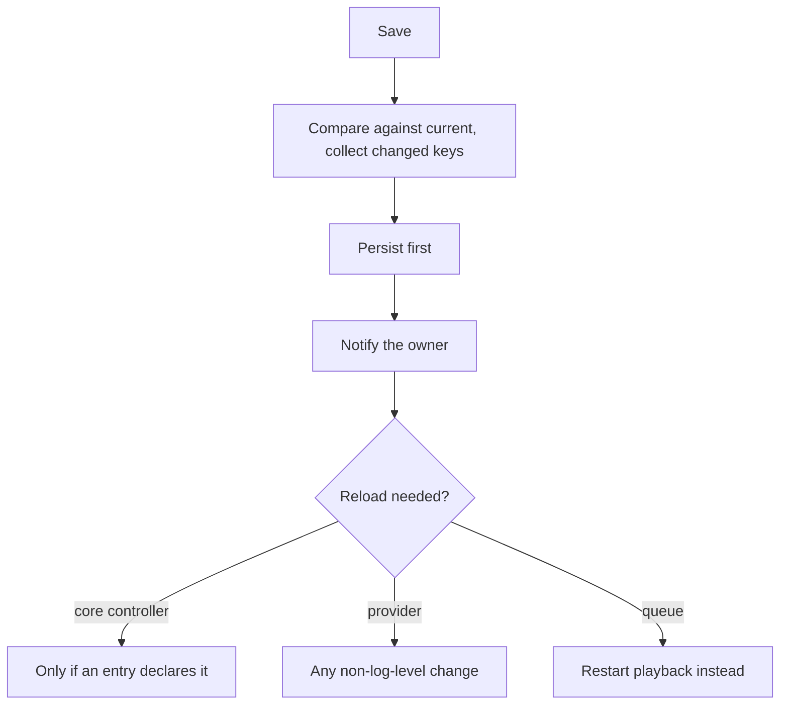

# Configuration and persistence

Every persistent setting in the server, from server options to provider credentials to per-player
audio tuning, goes through one controller. It is the first thing initialized, because everything
else reads its settings from it.

## Four scopes

| Scope | One per | Holds |
|---|---|---|
| Core | Configurable core controller | That module's own settings |
| Provider | Provider instance | Options, plus the setup data collected when it was added |
| Player | Player | Options, plus setup data such as pairing credentials |
| Queue | Queue, which matches a player | Playback preferences, each able to defer to a global default |

They share a base giving them entry values plus parse, update and validate behaviour. Parsing
stamps each entry with the namespace its label and description resolve under, which is how a
localized settings form is assembled without any controller passing a locale around.

## Settings are a file; data is a database

Settings live in one JSON file, addressed by slash-separated key paths. Structured data lives in
three SQLite databases: the media library, the cache, and the users and tokens store.

Writes to the settings file are debounced and atomic, with a backup rotated only when the current
file still parses. A crash can therefore not leave a truncated primary file, and a corrupt leftover
cannot overwrite a good backup. See
[controllers/config](../../music_assistant/controllers/config/README.md) for the durability detail
and [controllers/cache](../../music_assistant/controllers/cache/README.md) for the cache.

## Config entries describe settings

A setting is not a bare value; it is an entry carrying its type, default, options, range, UI
category, visibility, dependencies on other entries, and whether changing it requires a reload.
That is what lets the frontend render a whole settings page for a provider nobody wrote a UI for.

**Labels are never authored in code.** They resolve from the translation catalogue, and a
pre-commit hook fails the build when an entry hardcodes label or description text. See
[localization.md](localization.md).

A library of pre-built entries covers the settings many providers share, so a provider composes its
config from those plus its own.

## Setup data is not settings

Values are ongoing options, the things a user revisits in a settings form. Setup data is one-time
input: credentials, tokens, pairing state.

Only the setup flow engine writes setup data, its strings are encrypted at rest, and it is stripped
from every API payload. Clients never receive a secret in either form: serialization substitutes a
placeholder for secure values and drops setup data entirely, so a client can only ever set a new
value.

## Setup flows

Anything interactive belongs in a setup flow rather than in a config entry. A flow is one plain
coroutine that publishes a step and suspends until the user responds, which means an author writes
a linear sequence rather than a state machine.

Steps render a form, send the user to an external URL and await the callback, show progress, or
finish by persisting what was collected and creating the target. A provider that needs no input at
all still returns a synthesized finish step, so clients keep one code path for every provider.

Runtime options, by contrast, are declared by the provider and rendered from its entries.

See [controllers/config/setup-flows.md](../../music_assistant/controllers/config/setup-flows.md),
and the authoring guide at
[developers.music-assistant.io](https://developers.music-assistant.io/setup-flows/).

## Changing a setting

**Persisting comes first** because a reload can cancel the calling task, and reloading the
webserver does exactly that. The core and provider paths restore the previous raw config when the
update raises.

A provider reloads on any value change without consulting the per-entry flag, because provider
reloads are cheap and most providers read their config once at setup. A core controller consults
the flag. For a queue there is no owner to reload, so the flag means restart playback on that
queue.

Both reload paths run after a short delay under a shared id, which collapses rapid-fire changes
into one reload. A log level change applies immediately without reloading anything.

Providers persisting runtime state such as a rotated token use a raw write that skips validation
and triggers no reload.

## Migrations are not optional

Config entries and database rows are live user data. A renamed key, a changed type, a value that
moves scope or a dropped column breaks only the installs that already hold data, and no test
catches it.

Settings transforms have no version counter: each is independent, idempotent, gated on the shape of
the data it repairs, and tagged with the release after which it can be dropped. Database migrations
are versioned, and a failed library migration costs the user a full rescan.

So a migration has to be idempotent, survive missing and half-written values, and never raise. When
a change touches stored data, agree the migration before treating the work as done. See
[controllers/config/migrations.md](../../music_assistant/controllers/config/migrations.md) and
[controllers/music/schema.md](../../music_assistant/controllers/music/schema.md).

## Related

- [controllers/config](../../music_assistant/controllers/config/README.md) for the package.
- [providers.md](providers.md) for provider status and the error model.
- [api-and-auth.md](api-and-auth.md) for the scopes config commands require.
