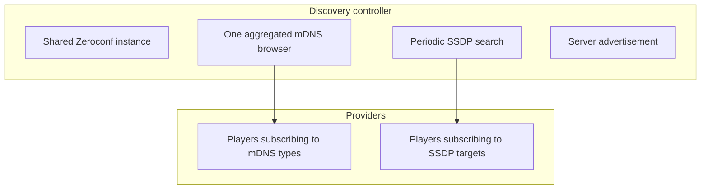

# Discovery

Finding devices on the network, and being found. If a speaker is not appearing, this is where to
look.

## Subscriptions are declared in manifests

A provider declares which mDNS service types or SSDP search targets it cares about in its manifest,
and implements the matching callback. Subscription is a capability of **any** provider, not only
player providers; at least one plugin uses it.

Manifests are read for all known providers at startup, not only configured ones, which is why the
subscription set is complete before anything loads.

Player providers can still keep their own discovery entry point for paths shared network discovery
does not cover, such as a manually configured IP or a user-triggered refresh.

## One shared instance

There is a single Zeroconf instance and a **single browser** covering the union of every service
type any manifest declares. Events are then routed to the providers that asked for that type, each
dispatched as its own task under a per-provider lock.

Running an instance per provider would mean several browsers on overlapping types, duplicated
network traffic, and several lifecycles to coordinate. Interface selection lives here for the same
reason: the choice is made once and every consumer inherits it.

## Late loaders get a replay

A provider loading after startup may have missed announcements that arrived before it was ready, so
its subscribed types are replayed from the Zeroconf cache as synthetic add events, serialized under
that provider's lock.

Providers can also **pull** a specific service synchronously when they need it, rather than waiting
for a push. That lookup checks the cache then waits, woken by any incoming event to re-scan.

This exists because of a real race: a device that advertises two related services independently can
have either arrive first, and a provider needing both to build one player pulls the other on demand
rather than holding partial state and hoping for a second callback.

**The pull matches device names exactly, not as a substring.** Matching by "does the cache key
contain this name" would match a different device whose name merely contains the one asked for, and
the provider would build a player out of another device's records. See
[mDNS discovery](../../music_assistant/controllers/discovery/mdns.md).

## SSDP and UPnP

Protocols that use UPnP rather than mDNS are handled by periodic search cycles rather than a
persistent browser, because SSDP has no equivalent of a long-lived subscription.

Cycles run every few minutes under a lock so two cannot overlap, results are deduplicated, and each
is dispatched to the providers that subscribed to that target. The client library is imported
lazily, so an install with no UPnP providers never loads it.

Not every UPnP subscriber searches for a generic media renderer; some search vendor-specific
targets, and one searches a control protocol identifier that is not a renderer at all.

An optional subnet-wide broadcast search is available and **off by default**, because broadcast
traffic is problematic on large networks. It helps with routers that do not relay multicast
properly.

## Who subscribes to what

Roughly fifteen providers declare a subscription, and the split is lopsided in a way worth seeing
before debugging a missing device.

| Mechanism | Providers |
|---|---|
| mDNS | AirPlay, AmpliPi, Bluesound, Bose SoundTouch, Chromecast, HEOS, MusicCast, Sonos, WiiM, Yandex Station, and the Hue lights plugin |
| SSDP | DLNA, Roku, Samsung WAM |

Read the manifests rather than this table when it matters; it will drift and the manifests cannot.

Three entries explain the caveats in the prose above. The Hue plugin is the non-player subscriber.
Roku searches a control protocol identifier rather than a media renderer target. Samsung searches
a vendor-specific target. AirPlay is the extreme case, subscribing to four service types, because
identifying an AirPlay device fully needs records that arrive independently, which is the race the
on-demand lookup exists for.

## Advertising the server

The server registers itself over Zeroconf, publishing its capabilities so clients and other
instances can find it without configuration.

**It publishes a list of addresses, not one.** A single record can then cover both IP families and
several interfaces on a multi-homed host. On a dual-stack network a client would otherwise only ever
see whichever family happened to be picked.

The streams server is the exception and still publishes one address, because a player is handed
exactly one stream URL.

A name collision with another instance on the same network is logged rather than raised, and a
config reload updates the existing registration rather than re-registering.

## Announcing to the Home Assistant Supervisor

Running as an add-on, the server also announces itself to the Supervisor over its REST API, bounded
by a timeout and with failure logged rather than raised, because a Supervisor hiccup must not fail
discovery setup.

**That announcement repeats daily, and the reason is token rotation rather than discovery.** The
integration token has a bounded lifetime and is rotated proactively, so on an instance that stays
up for months the token the Supervisor holds would eventually stop working. Re-announcing pushes
the current one back, so the integration keeps authenticating without a restart.

## Related

- [controllers/discovery](../../music_assistant/controllers/discovery/README.md) for the package.
- [Protocol linking](protocol-linking.md) for what happens once several endpoints turn out to be
  one device.
- [Providers](providers.md) for manifests and the provider lifecycle.
- [The API and authentication](api-and-auth.md) for the integration token being rotated.
