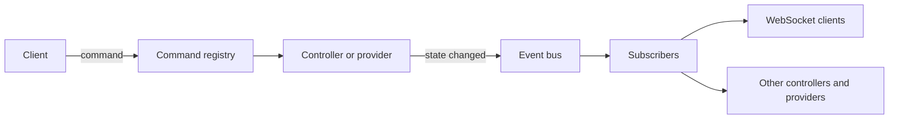

# Events and commands

Two complementary mechanisms, and understanding both is how the API stops looking arbitrary.
Commands are how something is asked to happen. Events are how everything else finds out that it
did.

## Commands

Any method anywhere in the codebase can be marked as an API command, which registers it in one
registry under a dotted name. Both transports dispatch through that same registry, so a command
behaves identically over the WebSocket and over HTTP, including its authentication and its required
scope.

Registration happens by scanning for the marker at startup, after the controllers are constructed
and before the webserver starts. That ordering is why a handler always exists by the time a request
can arrive.

The same registry is what the API documentation is generated from, so a command documents itself
from its signature and docstring. That is also why a command's docstring is written for the caller:
it becomes public API documentation.

Two commands are handled before the registry is consulted at all, because they mutate connection
state rather than invoking a controller. Setting the connection's locale is one of them.

## Events

An event carries a type, an optional object id and an optional payload. Signalling one is
synchronous: matching subscribers are walked in a single pass. A synchronous callback runs inline
and holds up that pass, while an asynchronous one is wrapped in a task, so real work belongs in the
latter.

Subscribing takes a callback plus optional filters on event type and object id, and returns an
unsubscribe callable. Filtering at subscription time rather than in the callback is what keeps a
busy event type cheap for subscribers that do not care about it.

Signalling verifies it was called from the event loop thread, because the subscriber set is not
thread-safe. Events are also suppressed once the server has begun stopping, so shutdown does not
generate traffic nobody will consume.

## What crosses the WebSocket

Connected clients are ordinary subscribers, with two differences worth knowing.

**Events are filtered per connection by scope.** Some events carry data not every user may see, so
the WebSocket layer checks the connection's scopes rather than broadcasting. Setup flow steps are
the clearest case, since a step can carry prefilled values and OAuth URLs.

**Some payloads are re-derived per connection** rather than forwarded as-is. Task updates work
this way: each client is sent the tasks visible to it, so one event becomes a different payload per
recipient.

## Bulk work suppresses events

A full library sync would emit one event per touched item, serialized once per connected client.
That is the dominant cost of a sync, so a context variable suppresses the per-item events for its
duration.

Clients follow progress through task events instead and refresh once at completion. Deletions are
never suppressed, because a client showing an item that no longer exists is worse than an extra
event.

## Three things called tasks

The overloading is genuinely confusing, so it is worth separating them.

| Thing | Purpose | User-visible |
|---|---|---|
| The hub's task helper | Fire-and-forget internal work, tracked so it can be cancelled at shutdown, with optional deduplication | No |
| The bounded fan-out helper | Parallelism that does not cancel siblings when one member fails | No |
| The tasks controller | Long-running jobs with progress, logs, scheduling and a UI surface | Yes |

Only the third emits events or appears in the frontend. Short-lived internal jobs belong on the
first. See [operations.md](operations.md).

## Provider events

A provider that needs to push its own state to clients signals a generic provider event scoped to
its instance, rather than having an event type added to the shared enum for it. The quiz plugin is
the fullest example, broadcasting game state that way.

That keeps the shared event vocabulary about things the core system does, while still letting a
plugin talk to its own frontend.

## Related

- [api-and-auth.md](api-and-auth.md) for the transports and the scope model.
- [overview.md](overview.md) for where registration sits in startup.
- [music_assistant/events.md](../../music_assistant/events.md) for the bus mechanics, the registry
  detail, and the enum members that look live but are not.
- [controllers/webserver](../../music_assistant/controllers/webserver/README.md) for the dispatch
  and connection detail.
- [operations.md](operations.md) for the task system.
