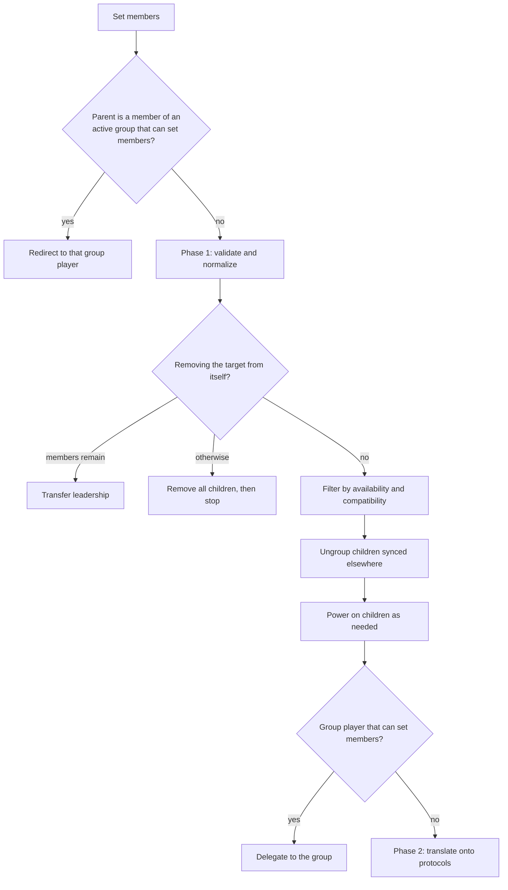

# Grouping and volume

Grouping and volume are documented together because nobody reads one without needing the other: the
moment two speakers play together, "set the volume" stops having one obvious meaning.

## Three grouping models

|  | Sync group | Universal group | Ad-hoc sync |
|---|---|---|---|
| Persistent entity | Yes | Yes | No |
| Owns the queue | The group player | The group player | The leader |
| Cross-protocol | No, one protocol only | Yes, any player | No |
| Audio delivery | Delegated to the leader's native protocol | Fanned out server-side, one stream per member | Native protocol sync |
| Captures members while | A session is active | A session is active | Members are synced |
| Dissolves | On stop, or after an idle grace period | On stop, or after an idle grace period | Immediately |

A sync group is a persistent player that delegates to a member's native sync protocol and never
touches audio itself. A universal group works across protocols by fanning the same audio out as an
independent stream per member, which is the only way to synchronize speakers that share no common
protocol. Ad-hoc sync has no group entity at all: one player becomes a leader and others follow it.

Both persistent kinds only advertise a power capability once the user explicitly assigns simulated
power, because the session lifecycle otherwise forms and dissolves the group on its own, and a
power toggle would just be a second, conflicting way to do that.

## Three properties, easily confused

| Property | Answers |
|---|---|
| Group members | Who is in this player's group, from the leader's or group's point of view |
| Synced to | Which player this one is following |
| Active group | Which group entity currently owns this player |

An ad-hoc leader lists **itself** first among its members, because it is a real speaker
contributing to the sound. A dedicated group player never lists itself. That asymmetry is
deliberate and shows up again in volume scaling below.

Synced-to is not a reported attribute but derived by scanning siblings on the same provider, which
is why changing group topology marks players dirty rather than updating one attribute.

## Setting members

Every grouping command converges on one pipeline, in two phases.

**The redirect exists to prevent inconsistent state.** Grouping two players that are already
members of a sync group would otherwise create a protocol-level sync the group knows nothing about.

**Phase two bridges intent and reality.** A user groups two speakers by name; the actual sync
happens between whichever protocol endpoints those players are currently using. This phase
identifies the parent's active protocol, translates each visible player id to the right protocol
player or keeps it native, and forwards each list to the right place. That translation is where
grouping meets [protocol linking](protocol-linking.md).

Two tolerances in phase one are worth knowing. A child is accepted for removal if either the parent
lists it **or** the child reports being synced to the parent, which covers a brief staleness after
the child already established protocol-level sync. And auto-ungrouping is skipped when the child is
already part of this group through its leader, because that is a normal in-group state rather than
being synced elsewhere.

## Individual volume

A volume command routes through the player's configured control chain: natively, simulated in
software, delegated to another player or control entity, or unsupported.

Resolution prefers an explicit config value, then an explicit delegation target, then auto-select,
which takes native support if present and otherwise looks for a linked protocol player that has it.
A sentinel value means "follow whichever protocol can handle it" and is offered as the default
exactly when the player has no native control but a linked protocol does.

Between the command and the device, two things happen. The logical range is scaled to the device's
configured minimum and maximum. And if a live audio source is playing on that player, the plugin is
notified **before** any hardware confirmation can echo back, so it sees the commanded value first.

### Nudges step from the commanded level

Volume up and down do not step from the level the player currently reports, because a device
confirms asynchronously and two quick presses would both step from the same stale reading and lose
one.

They step from the most recently commanded level instead, which carries a timestamp and expires, so
an external change eventually becomes authoritative again.

## Group volume

A group volume change scales all powered members proportionally, preserving their relative balance.

The first adjustment snapshots the members' levels, and the loudest of them becomes the reference
point. Raising the slider interpolates every member toward maximum; lowering it interpolates toward
zero. The snapshot is invalidated when an individual member's volume is set directly or when
membership changes.

**The snapshot reads last-commanded levels, not reported ones**, for the same reason nudges do. A
member that has not yet confirmed a change would otherwise put the reference above the level being
set, turning a step up into a step down.

That approach is chosen over an additive delta for four reasons: every member reaches silence at
zero and maximum at the top, relative balance survives the full range, returning the slider
restores the exact original levels, and a member sitting at zero still rises when the group goes up,
which an additive delta would leave stuck.

Group volume can be commanded from any member, not just the leader: a member redirects to its
leader, and a player that is in no group at all falls back to being treated individually. Group
mute behaves symmetrically.

Child volumes are applied concurrently, and the live source callback fires once afterwards, since
the group volume itself is not a hardware command.

## The mute lock

A mute lock marks a player the user muted **deliberately, inside a group**.

Its job is narrow but necessary. Since a muted player stays muted through a volume change, the lock
only still matters for simulated mute, which is implemented with the volume itself. Without the
lock, a group volume change writing a new level to that player would silently undo the mute.

Muting a grouped player sets the lock; unmuting any player clears it.

**A lock cannot outlive the group it was earned in.** Group membership is re-checked on every read,
so a player that leaves its group stops being treated as deliberately muted rather than carrying a
stale lock forever.

There is also a protocol-parent fallback: the lock is recorded on the visible player, while a group
volume change may arrive carrying the protocol child's id. Without the fallback, a deliberate mute
would not be respected when group volume reroutes through that child.

## Related

- [Players](players.md) for the control chains these resolve through.
- [Protocol linking](protocol-linking.md) for the protocol translation in phase two.
- [Playback](playback.md) for how group audio is actually delivered.
- [providers/sync_group](../../music_assistant/providers/sync_group/README.md) and
  [providers/universal_player](../../music_assistant/providers/universal_player/README.md).
