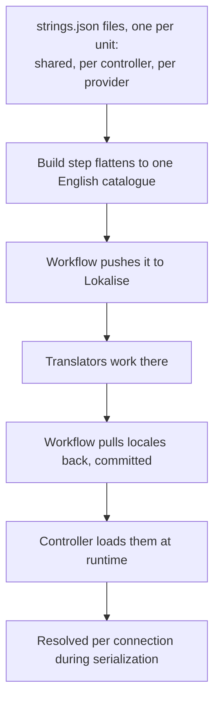

# Localization

Most of the UI is translated in the frontend. But a large amount of user-facing text is **generated
by the server**: config entry labels and descriptions, option titles, provider names, error
messages, setup flow steps, task names and some media item names.

None of that can be translated client-side, because the client does not know those strings exist
until the server sends them. So the server owns a catalogue and localizes its own output as it
serializes.

**The design goal is that no controller or provider has to think about localization.** They attach
a key to a model, and the value is swapped for the connection's locale on the way out.

## The pipeline

Authoring and building happen in the repository; resolution happens at runtime. Translated files
are committed, so a release ships its translations and the server never needs network access to
localize anything.

## Authoring

Source strings live in nested files, one per translatable unit: a shared file for strings used in
more than one place, and one per controller and per provider for what that component owns.

A string can also be a **reference** to another key, which declares that it reuses a shared string.
The build validates the target exists and then omits the referencing key from the catalogue
entirely, so translators translate the shared string exactly once and the runtime finds it through
the fallback chain below. A reference to a missing target fails the build rather than silently
producing English in every locale.

Template and test directories are excluded from the build, so placeholder strings never reach
translators as noise.

The build is standalone, with no imports from the package, so it runs without the server's import
chain. A check mode compares its output against the committed file, which is how the pre-commit
hook and CI keep them in sync.

See [controllers/translations/authoring.md](../../music_assistant/controllers/translations/authoring.md).

## The candidate chain

Keys are fully qualified with an owner root. Callers usually pass a **relative** key plus an owner
hint, which expands into an ordered candidate list, most specific first:

1. The owner's own string.
2. The domain-only form, for a multi-instance owner whose id carries an instance suffix.
3. The shared string.
4. The bare key.

Any candidate ending in a name segment also gets a fallback with that segment stripped, which lets
an authoring file write either form.

Each candidate is probed across locales in turn: the requested locale, then its base language, then
the English source. Resolution returns nothing when there is no match and **never raises**, so a
caller keeps whatever English value it already had rather than displaying a raw key.

That ladder is also what makes the build-time reference mechanism work, since a referencing key is
absent from the catalogue and is found one level further down.

## Owners

Both the controller and provider base classes expose the namespace their strings resolve under,
derived from their domain. Anything carrying a relative key passes its owner alongside it.

Provider errors carry the key, its arguments and the owner together, which is how a provider-raised
error arrives at a client already localized. A background task's owner is stamped by its controller
and omitted from serialization, because it is resolution machinery rather than data a client needs.

## Resolution during serialization

A context variable holds the resolver, and models call a helper from their post-serialize hook. The
server binds it for the duration of each outbound serialization, to the connection's locale on the
WebSocket and to the request's language header over HTTP.

Three properties fall out of doing it that way, and they are the reason it is worth the indirection.

**Models localize themselves.** An entry, a task or a media item swaps its own label, name or
description as it serializes. No controller passes a locale anywhere.

**Internal serialization is untouched.** A serialization with no resolver bound, which is what
caching, item mappings and config storage use, keeps the English source **and** keeps the
translation machinery in the output. That is essential: a cached object has to still be localizable
when it is later served to a different connection with a different locale. Localized API output
strips the machinery instead.

**Failures are invisible.** Resolution catches everything and returns nothing, because it must never
break serialization. A broken catalogue degrades to English rather than to an error response.

## Loading, and why it is first

Setup discovers the locale files by name without parsing them, computes the available list, and
eagerly loads English as the final fallback. Translated locales load lazily on first use, each
behind a per-locale lock so concurrent cold loads do not both read the file.

A connection declaring its locale warms it up front, so no lookup during serialization ever touches
disk.

**The translations controller is set up alone, before the other core controllers start
concurrently.** Every other controller can be serialized, and serialization resolves translations,
so none of them may start before the catalogue exists. See [overview.md](overview.md).

## Choosing a locale

A WebSocket client can pass a locale when it authenticates or set it at any time afterwards. That
setter is one of only two commands handled before the command registry is consulted, precisely
because it mutates connection state rather than invoking a controller.

HTTP derives the locale per request from the language header.

## Two locale lists, easily conflated

| List | Means |
|---|---|
| UI locales, discovered from the translation files | Which languages the server can localize its own output into |
| Metadata language, in the metadata controller's constants | Which language to request from metadata providers |

The metadata list is larger, because asking a streaming provider for German metadata does not
require anyone to have translated this project's UI into German.

Neither list should be hardcoded into documentation, including this page. Read the translations
directory and the metadata constants.

## Reverse lookup

One place where translation runs backwards. Genre and playlist names for built-in content are
themselves translatable, so a user searching for a genre by the name on screen would find nothing,
because the library stores the canonical English name.

Reverse lookup scans the configured metadata language's bundle for genre and playlist name keys
whose localized value contains the query, and returns the English source strings for the matches. A
text search that comes back empty retries against those.

Three deliberate limits. Only genres and playlists are considered, because they are the searchable
library media types, while browse and recommendation folder titles are display-only and never
library items. The locale is the metadata language rather than the connection locale, since it
doubles as the fallback search locale. And an English or untranslatable language returns nothing,
because a literal search already covers English.

## Related

- [controllers/translations](../../music_assistant/controllers/translations/README.md) for the
  runtime package.
- [configuration.md](configuration.md) for how config entry labels resolve.
- [media-library.md](media-library.md) for the search path that uses reverse lookup.
