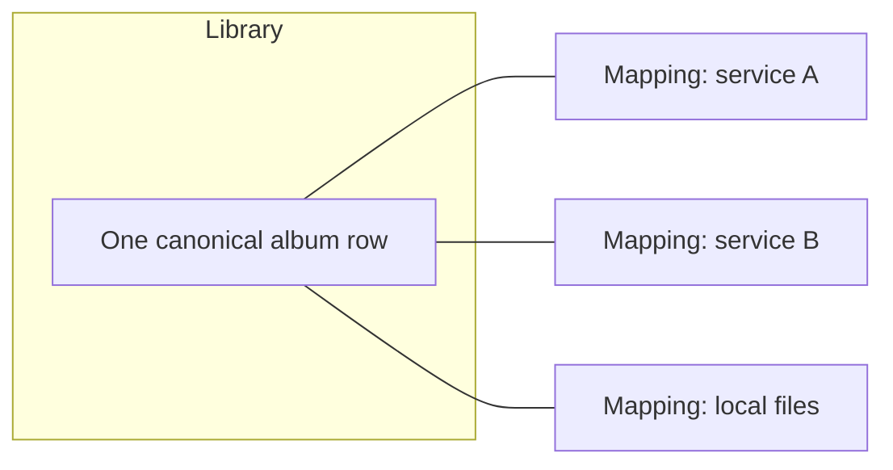

# The media library

Several music services and a pile of local files become one library that behaves as though it had
always been one. That is the whole problem this subsystem solves, and almost every design decision
in it follows from one fact: the same album exists in several places under slightly different
names, and the user wants to see it once.

## One canonical row, many mappings

A library item is a single row plus one provider mapping per place it exists.

Two rules follow, and getting them wrong is the most common source of bugs here:

**A library item never has a mapping to itself.** Library items use a reserved provider id, and
that id never appears in the mapping table.

**A mapping's item id is the provider's id, not a library id.** Resolving a provider item to its
library equivalent goes through an explicit lookup. Treating one as the other silently mixes up two
different namespaces.

## Matching is the heart of it

An incoming provider item joins an existing row when it shares a mapping, or a known external
identifier, or a confident name match. Otherwise it becomes a new row.

External identifiers are the strongest evidence, which is why they get their own indexed table and
a canonicalization layer: providers disagree about barcode format, ISRC punctuation and identifier
wrapping, and an index only works if both sides agree on spelling.

Albums are the hard case and get a tri-state answer rather than a boolean, because two copies of
the same record routinely differ only by an edition suffix. Alongside match and no-match there is
an explicit "insufficient", and the resolution is to **fetch more data rather than guess**: pull
ordered tracklists for both sides and let the fingerprint decide.

Finding a track on a *different* provider is a separate question with a graded answer, because the
caller has to decide how good a substitute is acceptable. Playlist migration is the consumer.

The detail lives in
[Matching and merging](../../music_assistant/controllers/music/media/matching.md).

## Sync

Each provider is synced per media type on a recurring schedule, serialized by a global lock so only
one provider and type runs at a time.

Two behaviours make a full sync affordable rather than crippling: writes are batched per item
instead of per statement, and per-item events are suppressed for the run, since a sync would
otherwise emit one event per touched item to every connected client. Clients follow task progress
instead and refresh once at completion.

Deletion handling is deliberately asymmetric. An item gone from a local provider with no other
library mappings is removed outright, because dangling rows stay visible in artist and album views.
An item gone from a streaming provider keeps its mapping, flagged as no longer in that provider's
library, which preserves the metadata accumulated against it.

See [Library sync](../../music_assistant/controllers/music/sync.md).

## Search

Search is built so one slow provider cannot stall the query. The library is searched first, always;
its results both answer the query and build the deduplication set. Provider searches then run in
parallel under a soft timeout, and a provider that misses the deadline keeps running in the
background so its result lands in the cache for next time.

The combined result is cached only when every provider contributed, so a failure is retried rather
than remembered.

Library search itself is backed by a trigram index, with a fallback scan for terms too short for a
trigram tokenizer to match at all.

See [Search and URIs](../../music_assistant/controllers/music/search.md).

## Enrichment

Metadata is a separate controller because it is a separate concern: the library knows what exists,
enrichment makes it presentable.

Provider mappings are processed in priority order so **local sources win over online ones**, and
online metadata is fetched only when enabled and when an item actually needs it. The refresh
interval is deliberately long, because the online services involved are free and shared and keeping
load off them is part of the deal.

Images are addressed by an opaque id rather than by provider and path. That is a security boundary:
only ids the server registered resolve, so the endpoint cannot be turned into a fetch-arbitrary-URL
primitive, and provider paths, which are often URLs with credentials in them, never reach a client.

See [controllers/metadata](../../music_assistant/controllers/metadata/README.md).

## Recommendations are provider rows

Recommendation rows come from every provider declaring the feature, interleaved so none dominates.

The library's own rows are **not** a special case: they come from a builtin plugin provider whose
only feature is recommendations. That means they compose through the ordinary machinery, including
the user's access rules and timeout isolation, rather than needing a parallel path.

Rows and their contents are separate calls, because a Discover page has to render before anyone
fetches a row's items.

See
[Recommendations and recency](../../music_assistant/controllers/music/recommendations.md).

## Per-user by construction

Which music sources a user can see follows from **ownership and sharing on each source**, not from
an allow-list on the user. A source carries an owner and a sharing level, and the resulting set is
applied to the provider lists, browse, recommendations and every library listing. Plugin providers
are never restricted. The levels themselves are in
[The API and authentication](api-and-auth.md).

It also decides which account an item actually plays through, and that is a substitution rather
than a preference. A library item's mapping records the account it was found on, which may belong
to another member. Playing it resolves to **an account of the same service that this listener may
use**, because two accounts of one streaming service resolve the same item ids. If the listener has
no account of that service, the item does not play for them rather than playing through somebody
else's.

That trick is available only for streaming services. A local or library-style provider's item ids
mean nothing on another instance, so there is no equivalent stand-in. And only a loaded, available
account can stand in, since the permitted set is read from stored config and still lists accounts
that are disabled.

Play history, resume positions and recency are scoped by user. An explicit provider request is
intersected with what the user can reach, and an empty intersection raises rather than quietly
returning nothing.

Note that "in my library" and "playable from here" are different questions. A library assembled
from several services still lists items a given service cannot play, so a listing can be restricted
to items reachable through specific providers, separately from the user's own permissions.

## Dynamic playlists are ordinary rows

A generated playlist is a normal playlist row with a flag set. Everything downstream treats it like
any other playlist; only the queue controller reads the flag, to decide whether to run a bounded
pool instead of a linear enqueue.

## Related

- [controllers/music](../../music_assistant/controllers/music/README.md) and its deep dives.
- [controllers/music/media](../../music_assistant/controllers/music/media/README.md) for the
  per-type sub-controllers.
- [Providers](providers.md) for the music provider contract.
- [Playback](playback.md) for what happens when one of these items is played.
