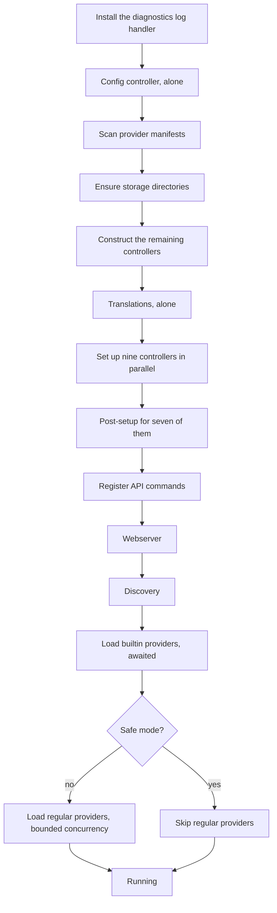

# Overview

One process, one event loop, thirteen controllers and a provider system for everything external.

## The server is one of several repositories

Everything these pages describe lives in the server repository, but the server is not the whole of
Music Assistant, and a change to what a client sees often belongs somewhere else.

| Repository | Is |
|---|---|
| Server | Controllers, providers, the streaming engine, the webserver. The subject of these pages |
| Models | The shared dataclasses, and therefore the wire-format contract between server and clients |
| Client | The async Python client, mirroring the server's command surface |
| Frontend | The web UI, served by the server's webserver controller |
| Protocol libraries | One per speaker protocol, each wrapped by a player provider |

The models package being separate is the thing to internalize: a model changed there changes the
wire format for the frontend, the Python client and the Home Assistant integration at once. It is
also why serialization concerns appear in the server as *usage* of models it does not own.

Compatibility is negotiated separately from that, by two numbers the server owns and reports in its
server info. One is the current schema version, bumped for additive API changes. The other is the
oldest schema a client may speak, bumped only for a breaking change, which forces every client to
update. Bumping the second is a decision about the whole ecosystem, not about the server alone.

## The hub

A single object is the nucleus of the server, and every other component holds a reference to it. It
owns the controllers, the event bus, the command registry, the provider registry, task tracking and
the shared HTTP sessions.

That shape is what makes the codebase navigable: anything reachable from anywhere is reachable
through the hub, so a provider never needs to be handed a dependency graph. It also means the hub
is the one object you cannot avoid knowing about.

## The controllers

| Controller | Responsibility |
|---|---|
| Config | Persistent settings, encryption, the get and set interface everything else reads |
| Cache | A SQLite cache with JSON values, expiration and scheduled cleanup |
| Tasks | Background jobs: scheduling, progress, logs, a UI surface |
| Discovery | Finding devices on the network, and advertising the server |
| Music | The unified library: provider sync, search, recommendations |
| Metadata | Art, lyrics and biographies, delegated to metadata providers |
| Streams | The audio pipeline: decode, buffer, process, encode, deliver |
| Players | Player state and command routing |
| Player queues | Per-player queues and playback progression |
| Webserver | The HTTP server, the API, WebSocket connections, auth |
| Translations | Loading and resolving translatable strings |
| Diagnostics | On-demand privacy-safe troubleshooting reports |
| Dashboard | Casting dashboards to display devices |

All but one inherit a common base giving them the same lifecycle hooks: setup, post-setup, close,
reload and config update. Nine of them are also configurable settings modules that appear in the
UI; translations, diagnostics and dashboard are controllers without being settings entities.

**Config is the exception**, and deliberately so. The base class hands a controller its config at
setup, and only the config controller can produce one, so it cannot itself be a core controller. It
has a simpler lifecycle that runs before the core controller machinery exists.

## Startup order

The sequence is ordered by dependency, with parallelism only where dependencies allow.

Four orderings in there are load-bearing rather than incidental.

**The diagnostics handler goes first**, before anything that can fail, so a boot-time error lands
in the report. Installing it is idempotent, because the entry point installs it too and embedded
use boots the server directly.

**Config goes second** because it loads the settings file and installs the encryption callbacks
every secure value depends on.

**Translations are set up alone, before the parallel group.** Every other controller can be
serialized, and serialization resolves translations, so none of them may start before the catalogue
exists.

**Commands are registered before the webserver starts**, so every handler exists by the time the
first request can arrive.

Provider load failures are non-fatal throughout. A failing provider records its error and is
retried on a backoff, so one broken integration cannot stop the server from starting. Builtin
providers are awaited as a group before regular ones begin.

## Shutdown order

Shutdown broadly reverses startup: stop accepting new work, cancel tracked tasks, unload providers
tolerating failures, then close controllers in order.

Config and cache close **last**, because the controllers ahead of them may still persist state as
they shut down.

## Safe mode

Safe mode loads the config controller, all core controllers and builtin providers, and skips every
regular provider.

The point is that a misbehaving provider cannot lock the user out. The server starts, the web UI is
reachable, and the user can disable the offending provider before restarting normally.

## Dev mode

Dev mode is detected from the environment or the presence of a virtualenv in the checkout. When
active, provider directories prefixed with an underscore are included in the manifest scan, which
is what surfaces the annotated demo providers used as templates.

## Async work

Two primitives cover scheduling. One wraps a coroutine in a tracked task, auto-cancelled at
shutdown, with optional deduplication by id. The other schedules something after a delay, using
the same ids for debouncing, which is how config reloads collapse rapid-fire changes into one.

Both verify they were called from the event loop thread. The subscriber set and the task
dictionaries are not thread-safe, so calling either from a background thread would race, and
failing loudly is better than corrupting them.

There is also a bounded-parallelism helper for fan-out that, unlike a task group, does **not**
cancel its siblings when one member fails. That distinction matters for work like loading providers,
where one failure should not take the others down.

## Data directories

Persistent data, meaning the settings file, the library database and the logs, lives in a storage
directory. Disposable cache data lives in a separate cache directory. The entry point respects the
usual environment variables for overriding both.

## Related

- [events-and-commands.md](events-and-commands.md) for the bus and the registry the hub owns.
- [configuration.md](configuration.md) for what the config controller does with all of this.
- [providers.md](providers.md) for the loading lifecycle the last startup steps run.
- [operations.md](operations.md) for the task system and diagnostics.
