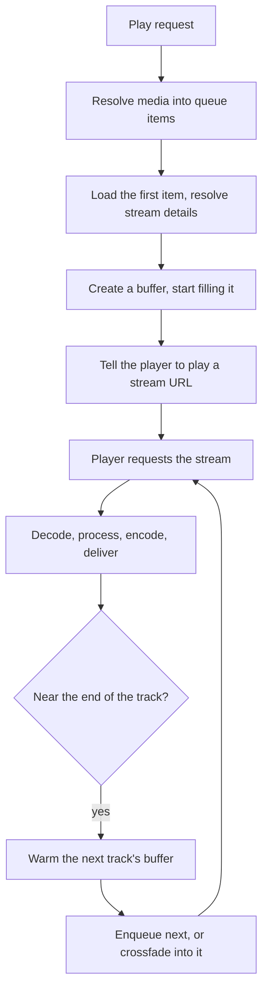

# Playback

From "play this" to audio coming out of a speaker. Three controllers are involved and the division
of labour between them is the thing to understand.

| Controller | Owns |
|---|---|
| Player queues | What plays next, and reconciling that against what the player reports |
| Streams | Turning a queue item into bytes a player can consume |
| Players | Telling the device to play, and resolving its state |

## The path

Two things about that flow are easy to get backwards.

**The player pulls; the server does not push.** Except for providers that consume raw PCM in
process, the server hands a player a URL and the player fetches it. That is why stream URLs carry a
session id, and why a stale request can be rejected.

**Buffering starts before the player asks.** A buffer is created and begins filling while the
player is still being told what to play, so playback starts without waiting for a provider round
trip.

## Resolving media into items

Non-track media has to be expanded: an artist, album, genre, playlist, podcast or folder becomes a
concrete list of tracks or episodes, applying the configured selection rules.

The enqueue option decides whether this replaces the queue, plays now, or is staged for later. A
replace **swaps the contents and never empties the queue first**, so the queue keeps playing while
the new media is resolved and clients never observe an empty queue with nothing playing.

## Look-ahead

For gapless playback and crossfades the queue anticipates the next item: it computes the next
index, pre-resolves its stream details, and hands it to the player ahead of time.

Warming the next track's *audio buffer* is a separate thing, triggered by the streams controller
near the end of the current track through a callback back into the queue. Those two are often
confused; enqueueing tells the player what is next, warming makes its audio ready.

## The audio pipeline

The buffer stores **raw decoded PCM with no filters applied**, and filters are applied on the way
out. That is what lets several consumers read the same buffered audio and apply different
processing, which is exactly what a group of speakers with different capabilities needs.

Work divides between what happens once per queue stream and what happens per destination:

| Once per queue stream | Per destination |
|---|---|
| Normalization, playback speed, crossfade, overlay | DSP, channel mapping, output format and encoding |

That split is also how clients are told what is happening to their audio, and it is why players
with identical effective output collapse into one reported entry.

See [controllers/streams](../../music_assistant/controllers/streams/README.md) and its deep dives.

## Flow mode

Normally each track is its own stream. In flow mode the whole queue is one continuous stream of
concatenated items.

That changes the bookkeeping rather than the audio: the player reports a cumulative position in one
long stream, and the queue has to map that back to a per-track index and elapsed time. An active
overlay forces flow mode, because an overlay has to play continuously across track boundaries.

## Crossfades

Crossfade is a queue setting. When smart crossfade is available and enabled, a planner chooses a
musical transition from stored analysis; otherwise a standard crossfade applies.

Nothing in that chain is allowed to break playback, so every stage has a fallback and the last one
cannot fail. A transition is also simply vetoed in cases where crossfading is wrong, such as two
tracks from the same album, since there is no reliable way to detect a gapless album.

See
[controllers/streams/smart_fades](../../music_assistant/controllers/streams/smart_fades/README.md).

## Keeping a queue going

Two mechanisms extend a queue as it runs low. A queue with dynamic sources maintains a small
bounded pool, topped up with recency-gated candidates spaced so adjacent tracks avoid sharing an
artist. Autoplay appends based on the media type of the last item, so music continues with a
configured strategy while a podcast episode continues with the next episode.

Live sources have no natural end, so autoplay does not apply to them at all.

See
[Look-ahead and keeping a queue going](../../music_assistant/controllers/player_queues/continuation.md).

## Reconciling against reality

The queue does not assume its commands took effect. It consumes player state updates, derives the
current index and item, recomputes elapsed time, and diffs against the previous snapshot to detect
transitions such as a track finishing or the queue ending.

Elapsed time needs care because the queue stores **media time**, usable directly as a resume
position, while the player reports **stream time** after any tempo filter. The two are bridged by
the playback speed.

## Groups change delivery, not the pipeline

A sync group delegates to a member's native protocol, so the audio path is the leader's. A universal
group fans the same stream out to each member independently, which is the only way to synchronize
across protocols. Ad-hoc sync uses the protocol's own sync.

See [Grouping and volume](grouping-and-volume.md).

## Live sources bypass most of this

A live audio source from a plugin is realtime: there is nothing to buffer ahead of, so it skips the
buffer, normalization, crossfade and overlay, and is paced to minimize latency rather than to build
a cushion.

It is also tracked as a per-player session rather than a queue item, so selecting one leaves the
queue intact. See [Plugins](plugins.md).

## Related

- [controllers/player_queues](../../music_assistant/controllers/player_queues/README.md)
- [controllers/streams](../../music_assistant/controllers/streams/README.md)
- [Players](players.md) for command routing and announcements.
- [The media library](media-library.md) for where the items come from.
