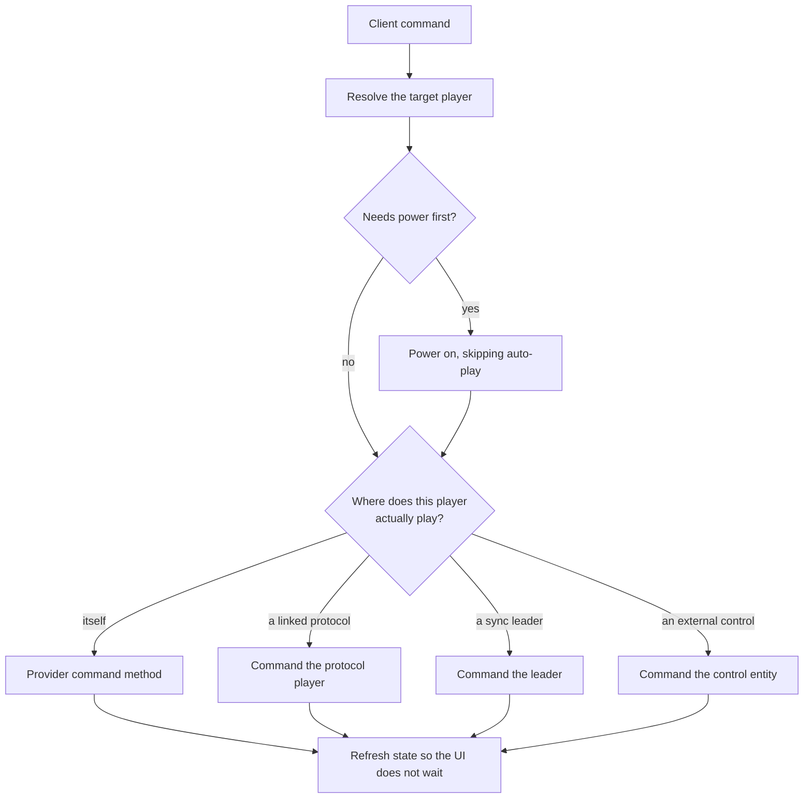

# Players

Two questions this page answers: what a player object actually is, and what happens between a
client pressing pause and a device stopping.

## Two objects per player

| Object | Is | Who touches it |
|---|---|---|
| The runtime player | The live mutable model, owned by its provider | A provider reports device state onto it; the controller calls its command methods |
| The state snapshot | A plain resolved dataclass | This is what goes over the API; clients see only this |

A provider never computes the values clients see. It reports what the **device** says, and the
framework layers everything else on top. That separation is the single most important thing to
understand before writing a player provider.

## Reporting versus resolving

A provider sets internal attributes and then asks for a state update. Public accessors expose them
read-only, and a set of computed properties derive the *effective* value of each one by layering
overrides.

Those overrides are why a raw attribute is rarely the answer:

- A player currently playing through a linked protocol reports that protocol's playback state, not
  its own.
- A player synced to a leader reports the leader's state.
- A live audio source with its own clock overrides the reported position.
- Power, volume and mute each resolve through a configured control chain.

Clients and the controller see resolved values only.

### Control chains

Power, volume and mute each read a per-player config choosing which mechanism handles them: the
device natively, a simulated control, another player, an external control entity, or nothing at
all.

**Power is an abstraction that means different things per player.** On hardware with real support
it is the device's power state. On an always-on network speaker, simulated power is a UI toggle
gating playback without touching hardware. On a group player it activates members, so powering on
captures them and powering off releases and stops them.

That is why the power capability flag is added and removed dynamically from the resolved feature
set: a player with no native power support can still gain a toggle, and a group only advertises one
once the user explicitly assigns simulated power, because the session lifecycle otherwise forms and
dissolves the group on its own.

Volume and mute are **independent of each other**. A muted player stays muted when its volume
changes, and the new level is what it will play at once unmuted. Simulated mute is the exception,
because it is implemented with the volume itself, so there is no separate state to preserve.

See [Grouping and volume](grouping-and-volume.md) for the routing detail.

## Change detection is a hot path

A state update runs on every provider report and on a polling tick for playing players, so it
cannot afford to recompute everything.

Three mechanisms keep it cheap without letting a real change slip through. An input snapshot of
everything the player itself contributes lets an unchanged update return before computing a single
derived property. A dirty flag forces a full recalculation, and it is what cross-player changes set,
since group topology and linked protocol state are not in the player's own attributes. And
expensive derived properties are cached, with the cache invalidated selectively: values derived
purely from config survive the frequent per-update invalidation and are cleared when config
changes.

The subtlety worth knowing is that a value looking config-derived may not be. An icon falls back
to a default computed from live device attributes such as manufacturer and model, so it has to be
recomputed like any other derived value rather than cached as config.

## How a command reaches a device

Several handlers power the player on before executing, because a playback command to an unpowered
player would otherwise silently do nothing.

Powering on has a follow-on: when auto-play is enabled, the player is neither grouped nor synced,
its active source is its own queue, and no announcement is running, the queue resumes.

**Power is never delegated to a protocol player**, unlike volume and mute. A stored config naming
one does not resolve, and falls through to auto-selection, which is worth knowing when reading an
old config that still carries one.

## Announcements

An announcement interrupts playback, plays something, and restores what was there.

Announcements take a URL **or** text. Passing text has the server speak it through a text-to-speech
engine before anything else happens, and the two are mutually exclusive.

A spoken message is rendered **once, up front**, so everything downstream, including every member
of a group fan-out, plays the resulting audio rather than re-speaking the text. The audio is
re-hosted on the server's own stream server so a chime can be prepended and so players that dislike
TLS still work.

Where a player supports announcements natively, the announcement is handed to it, and a group whose
members all support it fans out to per-member announcements. Otherwise the fallback path saves the
sync, group, source and media state, ungroups, stops, adjusts volume, plays through the normal
media path, waits, then restores everything.

## Live sources are sessions, not queue items

An external source playing on a player, such as a Connect integration or a receiver, is tracked as
a per-player session rather than as a queue item.

**Selecting a live source leaves the queue completely intact**, so switching away and back does not
destroy what the user had queued. Questions about the live source, such as what it is playing or
whether it can seek, are answered from the session rather than by inspecting a queue item.

A source plays on **one player at a time**, because two players both reporting it would let a
command sent to the loser drive the winner. The claim commits only once the owning plugin has
accepted the stream request, and eviction of the previous holder happens only on the first request
for a selection. A takeover that never gets a stream request therefore leaves the source where it
was, and a mere reconnect does not steal a source from a player it is being handed to.

Resolved stream details deliberately **outlive** the stream, because a paused external source keeps
the player while its stream is torn down, and clearing them would lose the session's identity
across an ordinary pause.

See [Plugins](plugins.md) for the audio source model itself.

## Related

- [Protocol linking](protocol-linking.md) for one device speaking several protocols.
- [Grouping and volume](grouping-and-volume.md) for groups, sync and volume routing.
- [Playback](playback.md) for what happens after a play command.
- [controllers/players](../../music_assistant/controllers/players/README.md) for the internals.
